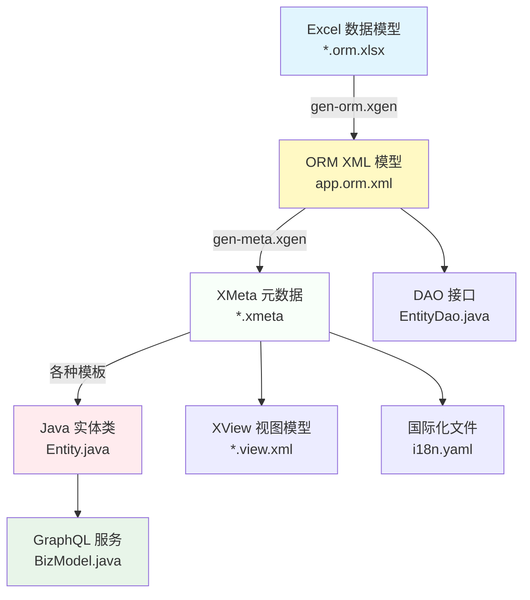
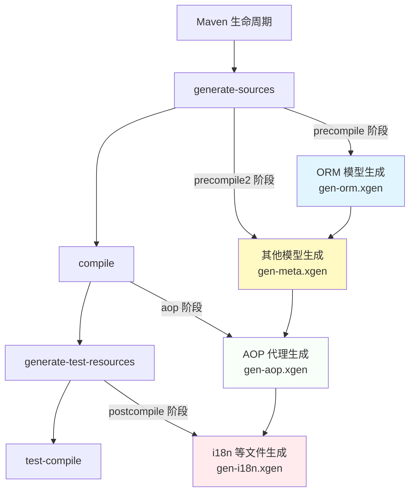
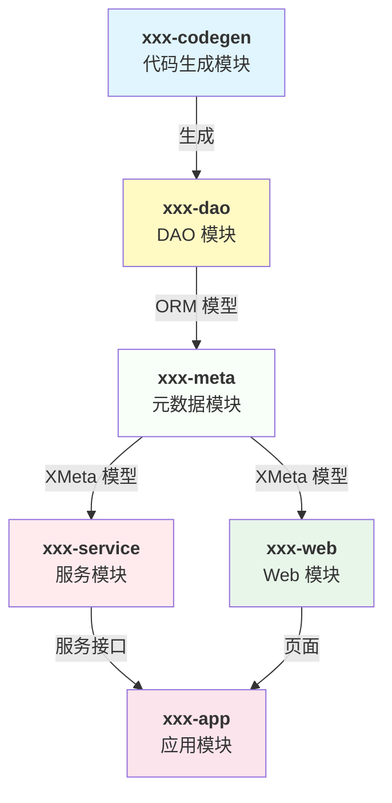
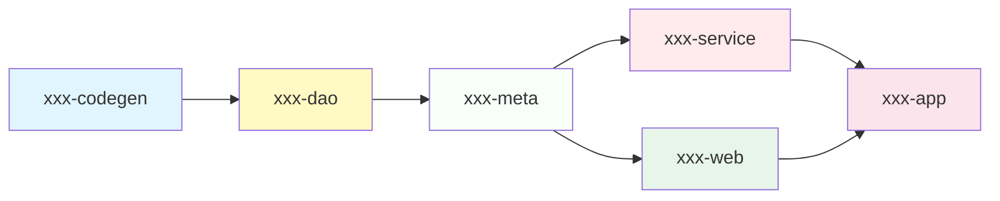
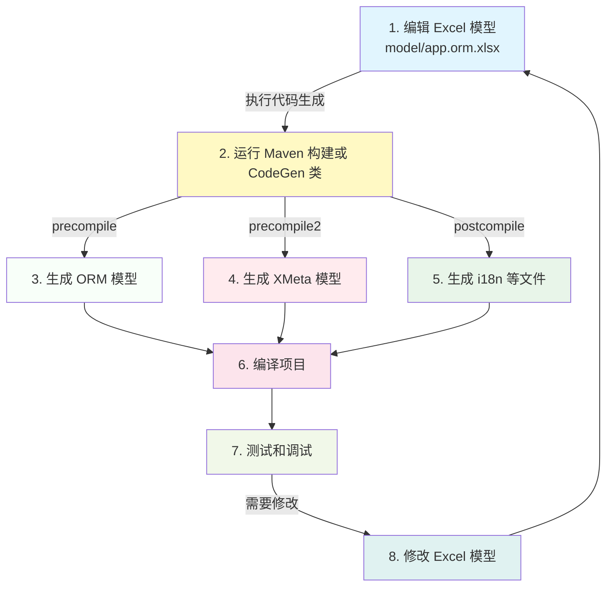

# Nop 平台标准项目结构与代码生成依赖关系

> **本文档说明 Nop 平台基于模型驱动开发的标准项目结构、代码生成流程和模块依赖关系**

## 一、标准项目结构

### 1.1 完整业务模块结构

基于 Excel 数据模型自动生成的标准项目包含以下子模块：

```
{appName}/
├── {appName}-codegen/      # 代码生成辅助工程
├── {appName}-dao/         # 数据库实体定义和 ORM 模型
├── {appName}-service/      # GraphQL 服务实现
├── {appName}-web/          # AMIS 页面文件及 View 模型定义
├── {appName}-app/          # 测试使用的打包工程
├── {appName}-meta/         # 元数据模型
├── {appName}-api/          # 对外暴露的接口定义（可选）
├── {appName}-delta/        # Delta 定制模块（可选）
└── model/                 # Excel 数据模型文件
    └── {appName}.orm.xlsx
```

### 1.2 各模块说明

| 模块 | 作用 | 是否生成 | 关键内容 |
|------|------|----------|----------|
| **{appName}-codegen** | 代码生成辅助工程，根据 ORM 模型更新当前工程代码 | 是 | `precompile/` 和 `postcompile/` 目录包含 `.xgen` 代码生成脚本 |
| **{appName}-dao** | 数据库实体定义和 ORM 模型 | 是 | Entity 类、DAO 接口、ORM XML 模型文件 |
| **{appName}-service** | GraphQL 服务实现 | 是 | BizModel 服务类、业务逻辑实现 |
| **{appName}-web** | AMIS 页面文件及 View 模型定义 | 是 | XView 模型、页面配置、前端资源 |
| **{appName}-app** | 测试使用的打包工程 | 是 | 应用启动类、配置文件、依赖所有子模块 |
| **{appName}-meta** | 元数据模型，根据 ORM 模型生成 | 是 | XMeta 模型文件（.xmeta） |
| **{appName}-api** | 对外暴露的接口定义和消息定义 | 可选 | API 接口、消息定义 |
| **{appName}-delta** | Delta 定制模块，用于扩展基础产品 | 否 | 差量定制代码、模型扩展 |

### 1.3 实例：nop-auth 模块

```bash
nop-auth/
├── nop-auth-codegen/      # 代码生成模块
│   ├── postcompile/
│   │   └── gen-orm.xgen   # ORM 代码生成脚本
│   └── pom.xml
├── nop-auth-dao/         # DAO 模块
│   └── src/main/resources/_vfs/nop/auth/orm/
│       ├── app.orm.xml      # ORM 模型定义
│       └── ...
├── nop-auth-service/      # 服务模块
│   └── src/main/java/io/nop/auth/service/
│       ├── entity/         # 实体服务
│       │   └── NopAuthUserBizModel.java
│       └── ...
├── nop-auth-web/          # Web 模块
│   └── src/main/resources/_vfs/nop/auth/
│       ├── pages/         # 页面配置
│       └── model/         # View 模型
├── nop-auth-meta/         # 元数据模块
│   ├── precompile/
│   │   └── gen-meta.xgen  # 元数据生成脚本
│   ├── postcompile/
│   │   └── gen-i18n.xgen  # 国际化生成脚本
│   └── src/main/resources/_vfs/nop/auth/model/
│       └── NopAuthUser/
│           └── NopAuthUser.xmeta  # 元数据定义
├── nop-auth-app/          # 应用模块
└── model/
    └── nop-auth.orm.xlsx   # Excel 数据模型
```

## 二、代码生成依赖关系

### 2.1 代码生成流程

Nop 平台的代码生成是一个分阶段的增量式过程，每个阶段都有特定的输入和输出：



### 2.2 模型文件类型

#### ORM 模型

**位置**: `{appName}-dao/src/main/resources/_vfs/nop/{module}/orm/app.orm.xml`

**作用**: 定义数据库表结构、字段映射、关联关系

**来源**:
- 从 Excel 文件 `model/{appName}.orm.xlsx` 生成
- 由 `gen-orm.xgen` 脚本执行生成

**示例**:
```xml
<?xml version="1.0" encoding="UTF-8" ?>
<orm x:schema="/nop/schema/orm/orm.xdef" x:extends="_app.orm.xml"
     xmlns:x="/nop/schema/xdsl.xdef">
    <entities>
        <entity name="io.nop.auth.dao.entity.NopAuthUser"
                tenantProp="tenantId" useTenant="true" />
    </entities>
</orm>
```

#### XMeta 模型

**位置**: `{appName}-meta/src/main/resources/_vfs/nop/{module}/model/{EntityName}/*.xmeta`

**作用**: 定义实体的元数据、字段属性、UI 显示规则、验证规则

**来源**:
- 从 ORM 模型自动生成
- 由 `gen-meta.xgen` 脚本执行生成

**示例**:
```xml
<?xml version="1.0" encoding="UTF-8" ?>
<meta x:schema="/nop/schema/xmeta.xdef" xmlns:x="/nop/schema/xdsl.xdef"
      x:extends="_NopAuthUser.xmeta" biz:allowGetDeleted="true">
    <props>
        <prop name="userName" allowFilterOp="eq,contains" ui:filterOp="contains"/>
        <prop name="password" displayName="密码" published="false" insertable="true" updatable="false">
            <schema type="String" domain="password" maxLength="20"/>
        </prop>
        <prop name="email" ui:maskPattern="3*7" />
    </props>
</meta>
```

#### XView 模型

**位置**: `{appName}-web/src/main/resources/_vfs/nop/{module}/pages/{EntityName}/*.view.xml`

**作用**: 定义页面的视图结构、表格、表单、操作等

**来源**:
- 从 XMeta 模型自动生成
- 由模板生成

**示例**:
```xml
<view>
    <objMeta>/nop/auth/model/NopAuthUser/NopAuthUser.xmeta</objMeta>
    <controlLib>/nop/web/xlib/control.xlib</controlLib>

    <grids>
        <grid id="list" x:abstract="true">
            <cols>
                <col id="userName" mandatory="true" sortable="true"/>
                <col id="nickName"/>
            </cols>
        </grid>
    </grids>
</view>
```

## 三、Maven 构建流程

### 3.1 代码生成阶段

Nop 平台使用 `exec-maven-plugin` 在 Maven 生命周期的不同阶段自动执行代码生成：



### 3.2 各阶段详细说明

#### 3.2.1 precompile 阶段

**Maven 阶段**: `generate-sources`

**作用**: 在编译之前生成基础模型和代码

**执行条件**:
- 可以访问所有依赖库
- 不能访问当前工程的类目录

**典型操作**:
- 从 Excel 文件生成 ORM XML 模型
- 生成基础的实体类定义
- 生成 DAO 接口

**示例** (`{appName}-codegen/postcompile/gen-orm.xgen`):
```xml
<c:script>
    // 根据ORM模型生成dao/entity/xbiz
    codeGenerator.withTargetDir("../").renderModel('../../model/{appName}.orm.xlsx',
        '/nop/templates/orm', '/',$scope);
    codeGenerator.withTargetDir("../{appName}-dao/src/main/java").renderModel(
        '../../{appName}-dao/src/main/resources/_vfs/nop/{module}/orm/app.orm.xml',
        '/nop/templates/orm-entity', '/',$scope);
</c:script>
```

#### 3.2.2 precompile2 阶段

**Maven 阶段**: `generate-sources`

**作用**: 第二次预编译，在 precompile 之后执行

**执行条件**:
- 可以访问所有依赖库
- 可以访问已生成的资源文件

**典型操作**:
- 生成元数据模型
- 生成服务接口定义

**示例** (`{appName}-meta/precompile/gen-meta.xgen`):
```xml
<c:script>
    codeGenerator.renderModel('/nop/{module}/orm/app.orm.xml',
        '/nop/templates/meta', '/',$scope);
</c:script>
```

#### 3.2.3 aop 阶段

**Maven 阶段**: `compile`

**作用**: 在编译后生成 AOP 代理类

**执行条件**:
- 可以访问已编译的类
- 可以访问所有依赖库

**典型操作**:
- 生成 AOP 代理类
- 生成拦截器代码

#### 3.2.4 postcompile 阶段

**Maven 阶段**: `generate-test-resources`

**作用**: 在编译后生成辅助文件

**执行条件**:
- 可以访问已编译的类
- 可以访问资源文件

**典型操作**:
- 生成国际化文件
- 生成配置文件
- 生成文档

**示例** (`{appName}-meta/postcompile/gen-i18n.xgen`):
```xml
<c:script>
    codeGenerator.withTplDir('/nop/templates/i18n').execute("/", {
        moduleId: "nop/{module}"
    }, $scope);
</c:script>
```

### 3.3 Maven 插件配置

在根 pom.xml 中配置的 `exec-maven-plugin` 定义了代码生成的标准流程：

```xml
<plugin>
    <groupId>org.codehaus.mojo</groupId>
    <artifactId>exec-maven-plugin</artifactId>
    <version>3.0.0</version>
    <executions>
        <!-- precompile 阶段 -->
        <execution>
            <id>precompile</id>
            <phase>generate-sources</phase>
            <goals>
                <goal>java</goal>
            </goals>
            <configuration>
                <arguments>
                    <argument>${project.basedir}</argument>
                    <argument>precompile</argument>
                </arguments>
                <addResourcesToClasspath>false</addResourcesToClasspath>
                <addOutputToClasspath>false</addOutputToClasspath>
            </configuration>
        </execution>

        <!-- precompile2 阶段 -->
        <execution>
            <id>precompile2</id>
            <phase>generate-sources</phase>
            <goals>
                <goal>java</goal>
            </goals>
            <configuration>
                <arguments>
                    <argument>${project.basedir}</argument>
                    <argument>precompile2</argument>
                </arguments>
                <addResourcesToClasspath>true</addResourcesToClasspath>
                <addOutputToClasspath>true</addOutputToClasspath>
            </configuration>
        </execution>

        <!-- aop 阶段 -->
        <execution>
            <id>aop</id>
            <phase>compile</phase>
            <goals>
                <goal>java</goal>
            </goals>
            <configuration>
                <classpathScope>test</classpathScope>
                <arguments>
                    <argument>${project.basedir}</argument>
                    <argument>aop</argument>
                </arguments>
            </configuration>
        </execution>

        <!-- postcompile 阶段 -->
        <execution>
            <id>postcompile</id>
            <phase>generate-test-resources</phase>
            <goals>
                <goal>java</goal>
            </goals>
            <configuration>
                <addResourcesToClasspath>true</addResourcesToClasspath>
                <addOutputToClasspath>true</addOutputToClasspath>
                <arguments>
                    <argument>${project.basedir}</argument>
                    <argument>postcompile</argument>
                </arguments>
            </configuration>
        </execution>
    </executions>
    <configuration>
        <classpathScope>compile</classpathScope>
        <includePluginDependencies>true</includePluginDependencies>
        <includeProjectDependencies>true</includeProjectDependencies>
        <addResourcesToClasspath>true</addResourcesToClasspath>
        <mainClass>io.nop.codegen.task.CodeGenTask</mainClass>
        <cleanupDaemonThreads>false</cleanupDaemonThreads>
    </configuration>
</plugin>
```

## 四、模块依赖关系

### 4.1 模块间依赖



### 4.2 依赖关系说明

1. **xxx-codegen → xxx-dao**
   - codegen 模块根据 Excel 模型生成 dao 模块的代码
   - dao 模块依赖 codegen 模块（仅在测试时）

2. **xxx-dao → xxx-meta**
   - dao 模块提供 ORM 模型
   - meta 模块根据 ORM 模型生成 XMeta 元数据

3. **xxx-meta → xxx-service**
   - meta 模块提供 XMeta 元数据
   - service 模块使用 XMeta 元数据生成 GraphQL 服务

4. **xxx-meta → xxx-web**
   - meta 模块提供 XMeta 元数据
   - web 模块使用 XMeta 元数据生成 View 模型

5. **xxx-service → xxx-app**
   - service 模块提供 GraphQL 服务
   - app 模块聚合所有模块，提供应用入口

6. **xxx-web → xxx-app**
   - web 模块提供页面和视图
   - app 模块聚合所有模块，提供应用入口

### 4.3 构建顺序

根据模块依赖关系，Maven 构建时应遵循以下顺序：



## 五、代码生成模板

### 5.1 模板目录结构

代码生成模板位于 `nop-kernel/nop-codegen/src/main/resources/_vfs/nop/templates/`：

```
templates/
├── orm/              # ORM 相关模板
│   ├── {appName}-codegen/
│   ├── {appName}-dao/
│   ├── {appName}-service/
│   ├── {appName}-web/
│   └── {appName}-meta/
├── orm-entity/       # 实体类模板
├── orm-dao/         # DAO 接口模板
├── meta/            # XMeta 模板
├── i18n/            # 国际化模板
└── backend/          # 后端通用模板
```

### 5.2 常用模板

| 模板路径 | 用途 | 生成内容 |
|---------|------|----------|
| `/nop/templates/orm` | 根据 Excel 生成完整项目结构 | 所有模块的基础代码 |
| `/nop/templates/orm-entity` | 生成实体类 | Entity.java |
| `/nop/templates/meta` | 生成元数据 | *.xmeta |
| `/nop/templates/i18n` | 生成国际化文件 | i18n.yaml |

## 六、开发工作流程

### 6.1 模型驱动开发流程



### 6.2 快速开发模式

除了使用 Maven 构建来执行代码生成，还可以在 IDEA 中直接运行 CodeGen 类：

```java
// 例如: NopAuthCodeGen.java
public class NopAuthCodeGen {
    public static void main(String[] args) {
        AppConfig.getConfigProvider().updateConfigValue(CoreConfigs.CFG_CORE_MAX_INITIALIZE_LEVEL,
                CoreConstants.INITIALIZER_PRIORITY_ANALYZE);

        CoreInitialization.initialize();
        try {
            File projectDir = MavenDirHelper.projectDir(NopAuthCodeGen.class);
            XCodeGenerator.runPostcompile(projectDir, "/", false);
        } finally {
            CoreInitialization.destroy();
        }
    }
}
```

**优点**:
- 无需执行完整的 Maven 编译过程
- 代码生成速度更快
- 便于开发期调试

## 七、Delta 定制模块

### 7.1 Delta 模块的作用

Delta 模块是 Nop 平台实现定制化开发的核心机制，可以在不修改基础产品源码的情况下增加、修改或删除功能。

### 7.2 Delta 模块结构

```
{appName}-delta/
├── model/                 # Delta 模型文件
│   ├── nop-auth-delta.orm.xlsx
│   └── ...
└── src/main/resources/_vfs/_delta/
    └── nop/auth/        # 差量定制代码
        ├── orm/          # ORM 差量
        ├── model/        # Meta 差量
        └── ...
```

### 7.3 Delta 模型示例

在 Delta 模型的 Excel 文件中，只包含需要被扩展的表和字段：

```markdown
## NopAuthUser（扩展表）

- 表名: (继承基础表)
- 类名: NopAuthUserEx
- 基类: io.nop.auth.dao.entity.NopAuthUser
- 对象名: io.nop.auth.dao.entity.NopAuthUser
- 标签: not-gen

#### 字段列表

|编号|标签|主键|非空|字段名|属性名|显示|中文名|类型|长度|备注|
| --- | --- | --- | --- | --- | --- | --- | --- | --- | --- |
| 51 |  | false | true | mall_user_id | mallUserId |  | 商城用户ID | VARCHAR | 36 | 关联到商城用户表 |
```

生成的 ORM 文件结构：
```xml
<orm x:extends="super,default/nop-auth.orm.xml">
  <entities>
      <entity className="app.mall.delta.dao.entity.NopAuthUserEx"
              displayName="用户"
              name="io.nop.auth.dao.entity.NopAuthUser">
              ...
      </entity>
  </entities>
</orm>
```

### 7.4 使用 Delta 模块

在其他模块（如 `app-mall-app`）中，只需依赖 Delta 模块即可实现对基础功能的定制：

```xml
<dependency>
    <groupId>io.github.entropy-cloud</groupId>
    <artifactId>app-mall-delta</artifactId>
    <version>${project.version}</version>
</dependency>
```

## 八、最佳实践

### 8.1 模型设计

1. **保持模型的简洁性**
   - Excel 模型应专注于数据结构定义
   - 避免在模型中包含业务逻辑

2. **合理命名**
   - 表名使用 snake_case（如 `nop_auth_user`）
   - 类名使用 PascalCase（如 `NopAuthUser`）
   - 字段名使用 camelCase（如 `userName`）

3. **使用标签控制生成**
   - `not-gen` 标记不需要生成的字段
   - `internal` 标记内部字段
   - `tenant` 标记租户字段

### 8.2 代码生成

1. **增量生成**
   - 代码生成器支持增量更新，不会覆盖手动修改的代码
   - 使用 `x:override` 和 `x:extends` 控制覆盖策略

2. **Delta 定制优先**
   - 优先使用 Delta 模块进行定制
   - 避免直接修改基础产品代码

3. **模型驱动**
   - 所有代码都应从模型生成
   - 避免手动修改生成的代码（除特殊情况外）

### 8.3 构建和部署

1. **遵循构建顺序**
   - 确保模块按依赖顺序构建
   - 使用 Maven Reactor 自动管理依赖

2. **统一版本管理**
   - 在父 POM 中统一管理版本
   - 使用 `${project.version}` 引用版本

3. **增量部署**
   - 利用 Delta 机制实现增量部署
   - 避免大规模代码合并

## 九、参考资源

- [代码生成文档](../../../dev-guide/codegen.md)
- [模块依赖文档](../../architecture/development/module-dependencies.md)
- [Delta 定制文档](../../../dev-guide/delta/delta-customization.md)
- [nop-app-mall 示例项目](https://gitee.com/canonical-entropy/nop-app-mall)
- [CLI 工具文档](../../../dev-guide/cli.md)

## 十、常见问题

### Q1: 为什么需要 xxx-codegen 模块？

**答**: xxx-codegen 模块包含代码生成脚本（.xgen 文件）和 CodeGen 类，用于在 Maven 构建时自动执行代码生成。这个模块只在构建时使用，不参与运行时。

### Q2: xxx-meta 模块和 xxx-dao 模块有什么区别？

**答**: 
- xxx-dao: 定义数据库结构和 ORM 映射
- xxx-meta: 基于 ORM 模型生成 XMeta 元数据，包含字段属性、UI 配置等更丰富的信息

### Q3: 如何只生成 DAO 模块而不生成前端代码？

**答**: 使用 `orm-dao` 模板而非 `orm` 模板：
```bash
java -jar nop-cli.jar gen -t=/nop/templates/orm-dao -o=app-dao model/app-mall.orm.xlsx
```

### Q4: 为什么有些模块有 precompile，有些有 postcompile？

**答**: 
- precompile: 在编译前生成，用于生成基础模型和代码
- postcompile: 在编译后生成，用于生成需要访问已编译类的文件（如 i18n）

### Q5: 如何调试代码生成脚本？

**答**: 
1. 在 IDEA 中运行 CodeGen 类的 main 方法
2. 使用 Nop 平台的断点调试功能
3. 查看 `XCodeGenerator` 的日志输出

### Q6: Delta 模块如何影响基础产品？

**答**: Delta 模块通过 x:extends 机制覆盖基础产品的模型定义。在运行时，系统会优先加载 Delta 目录下的模型文件，从而实现对基础功能的定制。

---

**文档维护者**: AI Assistant (Sisyphus)
**最后更新**: 2025-01-09
**文档版本**: v1.0
