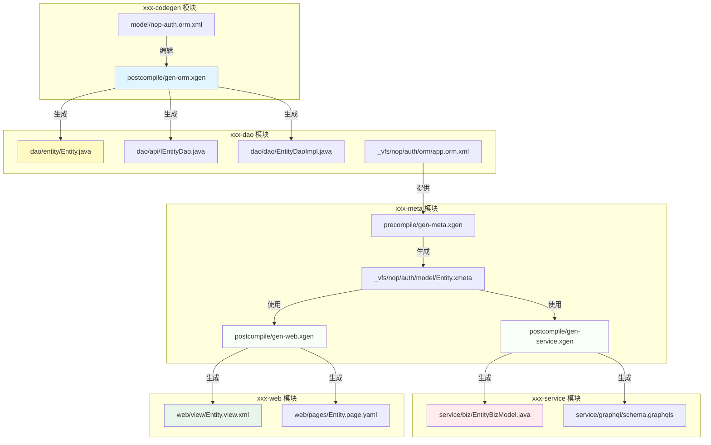

# Nop平台AI开发规范文档

## 1. Nop平台概述

Nop平台是基于可逆计算原理从零开始构建的采用面向语言编程范式的下一代低代码开发平台。包含基于全新原理从零开始研发的GraphQL引擎、ORM引擎、工作流引擎、报表引擎、规则引擎、批处理引擎等完整设计，根据XML数据模型自动生成GraphQL/REST/gRPC服务，定制化开发无需修改基础产品源码，支持GraalVM原生编译，中小企业可以免费商用。

### 1.1 核心优势
- **可逆计算**：基于可逆计算原理，实现模型的动态合成和差量化定制
- **语言导向**：鼓励设计领域特定语言(DSL)，而非直接使用通用编程语言
- **模型驱动**：通过XML模型、XMeta模型等定义业务结构，自动生成代码
- **无Spring依赖**：底层不使用Spring等第三方框架，重新设计实现
- **差量化定制**：定制化开发无需修改基础产品源码
- **云原生支持**：支持GraalVM原生编译，启动速度提升数十倍

### 1.2 适用场景
- 低代码开发平台
- 领域特定语言(DSL)开发
- 模型驱动的企业应用
- 云原生微服务架构
- 需要高度定制化的产品

## 2. 核心设计理念

### 2.1 可逆计算原理

Nop平台基于可逆计算原理，核心公式是`App = Delta x-extends Generator<DSL>`。

**简单理解**：通过Delta差量定制，无需修改基础产品源码即可实现定制化开发。

### 2.2 语言导向编程

Nop平台鼓励设计领域特定语言(DSL)，通过XML模型定义业务结构，自动生成代码。

**简单理解**：先设计模型，再生成代码，最后只写定制逻辑。

### 2.3 模型驱动开发

所有功能围绕模型展开，通过XML模型、XMeta模型等定义业务结构，自动生成代码。

**简单理解**：模型是核心资产，代码只是模型的表现形式之一。

### 2.4 差量化定制

基于Nop平台开发的产品，无需做任何特殊的设计，即可实现Delta差量化定制。

**简单理解**：对数据库结构、业务逻辑、前端界面等进行全方位的定制化开发，无需修改基础产品的源码。

## 3. 项目结构规范

### 3.1 模块划分
Nop平台采用模块化设计，每个功能领域独立成模块，模块之间通过明确的接口进行通信。常见模块包括：

| 模块名称 | 功能描述 |
|---------|---------|
| nop-auth | 权限管理和认证 |
| nop-orm | ORM引擎和数据库访问 |
| nop-graphql | GraphQL服务实现 |
| nop-report | 报表引擎 |
| nop-workflow | 工作流引擎 |
| nop-batch | 批处理引擎 |

### 3.2 目录结构

Nop平台项目遵循标准的Maven目录结构，并增加了一些特定的目录：

```
module-name/
├── src/
│   ├── main/
│   │   ├── java/         # Java代码
│   │   ├── resources/    # 资源文件
│   │   │   └── _vfs/     # 虚拟文件系统，存放模型文件和配置
│   │   └── xgen/         # 代码生成模板
│   └── test/             # 测试代码
└── pom.xml               # Maven配置
```

### 3.3 三明治架构

Nop平台采用独特的"三明治架构"，实现自动生成代码和手工定制代码的分离：

```
CustomClass extends _AutoGenClass extends BaseClass
```

- `_AutoGenClass`：自动生成的代码，总是被覆盖，文件名以下划线开头
- `CustomClass`：手工编写的定制代码，继承自动生成类
- `BaseClass`：平台提供的基础类，包含通用功能

这种架构允许开发者在不修改自动生成代码的情况下，对功能进行扩展和定制。

## 4. 核心开发流程

### 4.1 设计XML模型

使用XML定义数据模型、API模型等，XML模型是Nop平台开发的起点：

- **数据模型**：使用`*.orm.xml`文件定义数据库表结构和关系
- **API模型**：使用`*-api.xml`文件定义API接口和参数
- **业务模型**：使用`*.biz.xml`文件定义业务规则和流程

### 4.2 生成基础代码

使用代码生成器根据XML模型生成基础代码：

```shell
# 使用nop-cli命令行工具生成代码（模型文件使用模块名）
nop-cli gen model/nop-auth.orm.xml -t=/nop/templates/orm

# 或者使用Maven插件在编译时生成
mvn compile
```

#### 跨模块代码生成机制 ⭐

Nop 平台的代码生成是跨模块进行的，需要特别注意构建顺序：

1. **xxx-codegen → xxx-dao**
   - `xxx-codegen/postcompile/gen-orm.xgen` 生成 dao 模块的实体类和 DAO 接口
   - 执行 `xxx-codegen` 模块的 `mvn install` 时触发

2. **xxx-meta → xxx-service** ⭐
   - `xxx-meta/postcompile/gen-service.xgen` 生成 service 模块的 BizModel 类
   - 执行 `xxx-meta` 模块的 `mvn install` 时触发

3. **xxx-meta → xxx-web** ⭐
   - `xxx-meta/postcompile/gen-web.xgen` 生成 web 模块的视图文件
   - 执行 `xxx-meta` 模块的 `mvn install` 时触发

#### 正确的构建顺序

```bash
# 在根目录按顺序构建所有模块（推荐）
mvn clean install

# 或者手动按顺序构建
cd nop-auth-codegen && mvn install
cd ../nop-auth-dao && mvn install
cd ../nop-auth-meta && mvn install    # 会生成 service 和 web 的代码 ⭐
cd ../nop-auth-service && mvn install
cd ../nop-auth-web && mvn install
cd ../nop-auth-app && mvn install
```

#### 代码生成的内容

代码生成器会根据模板自动生成：
- Java实体类（由 xxx-codegen 生成）
- DAO接口和实现（由 xxx-codegen 生成）
- GraphQL服务（由 xxx-meta 生成到 xxx-service）⭐
- REST服务（由 xxx-meta 生成到 xxx-service）⭐
- 前端页面（由 xxx-meta 生成到 xxx-web）⭐

### 4.3 定制开发

#### 理解自动生成的代码

生成的代码分布在不同的模块中：

| 模块 | 生成内容 | 生成来源 |
|------|---------|---------|
| xxx-dao | Entity.java, IEntityDao, EntityDaoImpl | xxx-codegen |
| xxx-service | BizModel.java, GraphQL Service | xxx-meta ⭐ |
| xxx-web | XView 视图模型, 页面配置 | xxx-meta ⭐ |

#### 定制原则

基于生成的代码进行定制，主要修改非下划线前缀的类：

- 扩展自动生成类的功能
- 覆盖默认实现
- 增加业务逻辑
- 定制前端界面

### 4.4 测试和验证

使用Nop平台的自动化测试框架进行测试：

- 单元测试：测试核心功能
- 集成测试：测试模块间集成
- 自动化测试：录制回放机制，无需手工编写数据初始化和结果验证代码

### 4.5 部署和运行

Nop平台支持多种部署方式：

- **JAR包运行**：生成可执行JAR包，使用`java -jar`运行
- **GraalVM原生编译**：编译为原生可执行文件，无需JDK，启动速度快
- **容器化部署**：支持Docker和Kubernetes部署

## 5. 跨模块代码生成详解

### 5.1 代码生成架构



### 5.2 执行时机

| 模块 | Maven 命令 | 触发的代码生成 | 生成的目标模块 |
|------|-----------|--------------|--------------|
| xxx-codegen | `mvn install` | gen-orm.xgen | xxx-dao |
| xxx-meta | `mvn install` | gen-service.xgen, gen-web.xgen | xxx-service, xxx-web ⭐ |

### 5.3 关键要点

1. **xxx-meta 是关键**
   - xxx-meta 的 `mvn install` 命令会触发 `postcompile` 目录下的所有 xgen 脚本
   - 这些脚本生成 xxx-service 和 xxx-web 模块的大部分代码
   - 必须在 xxx-meta 上执行 `mvn install`，其他模块才能正确构建

2. **修改模型后的重新生成**
   ```bash
   # 修改模型文件
   vim model/nop-auth.orm.xml

   # 清理并重新构建（必须按顺序）
   cd nop-auth-codegen && mvn clean install
   cd ../nop-auth-dao && mvn clean install
   cd ../nop-auth-meta && mvn clean install    # ⭐ 关键步骤
   cd ../nop-auth-service && mvn clean install
   cd ../nop-auth-web && mvn clean install
   cd ../nop-auth-app && mvn clean install
   ```

3. **xgen 脚本的位置**
   ```
   xxx-meta/
   ├── precompile/
   │   └── gen-meta.xgen              # 生成 XMeta 元数据
   └── postcompile/
       ├── gen-service.xgen            # 生成 service 模块的代码 ⭐
       ├── gen-web.xgen                # 生成 web 模块的代码 ⭐
       └── gen-i18n.xgen              # 生成 i18n 文件
   ```

## 7. XLang语言体系

XLang是Nop平台实现可逆计算的核心技术，包含一系列子语言：

### 7.1 XDef - 元模型定义语言

XDef用于定义DSL语言的语法和结构，是Nop平台中所有DSL语言的基础：

```xml
<xdef:definitions xmlns:xdef="http://nop-xlang.github.io/schema/xdef.xdef">
    <xdef:type name="MyType" xdef:abstract="true">
        <xdef:prop name="name" type="string" required="true"/>
        <xdef:prop name="description" type="string"/>
    </xdef:type>
</xdef:definitions>
```

### 7.2 XScript - 支持宏函数的脚本语言

XScript是Nop平台的脚本语言，支持宏函数和元编程：

```javascript
function calculatePrice(quantity, unitPrice) {
    return quantity * unitPrice * (1 - getDiscount(quantity));
}

macro function getDiscount(quantity) {
    if (quantity > 100) return 0.1;
    if (quantity > 50) return 0.05;
    return 0;
}
```

### 7.3 Xpl - 面向元编程的模板语言

Xpl是XML格式的模板语言，用于生成代码和配置文件：

```xml
<xpl:unit xmlns:xpl="http://nop-xlang.github.io/schema/xpl.xdef">
    <c:script>
        let className = model.name;
    </c:script>

    public class ${className} {
        // 类内容
    }
</xpl:unit>
```

### 7.4 XMeta - 对象结构定义语言

XMeta用于定义对象的结构和属性，是Nop平台中对象模型的基础：

```xml
<xmeta:object xmlns:xmeta="http://nop-xlang.github.io/schema/xmeta.xdef" name="User">
    <xmeta:prop name="id" type="string" primary="true"/>
    <xmeta:prop name="name" type="string" required="true"/>
    <xmeta:prop name="email" type="string" format="email"/>
</xmeta:object>
```

### 7.5 XOverride - 差量合并算子

XOverride用于实现模型的差量化定制，通过x:extends属性继承并覆盖原有模型：

```xml
<model x:extends="_base.model.xml">
    <!-- 覆盖或添加的内容 -->
    <property name="newProperty" value="newValue"/>
</model>
```

## 8. 代码生成规范

### 8.1 模板文件命名

- **`.xgen`后缀**：模板文件，生成对应后缀的文件
- **`.xrun`后缀**：只执行代码不生成文件
- **`@`前缀**：内部使用，不输出到目标目录
- **`@init.xrun`**：初始化文件，在运行目录下的模板之前执行

### 8.2 模板路径编码

在路径中使用变量表达式实现循环和判断：

- `{var}`：循环变量，遍历变量值
- `{!!var}`：判断变量，返回false或null时跳过
- `{var.prop}`：访问变量属性
- `{var@mapper}`：集合包含判断，相当于`((Set)var).contains('mapper')`

### 8.3 生成规则

1. **总是被覆盖**：
   - 以`_`为前缀的文件
   - `_gen`目录下的文件
   - 包含`__XGEN_FORCE_OVERRIDE__`字符串的文件

2. **增量生成**：
   - 非下划线前缀的文件，不会被覆盖
   - 支持手工修改和自动生成的合并

### 8.4 模板示例

```xml
<!-- @init.xrun - 初始化文件 -->
<gen:DefineLoop xpl:lib="/nop/codegen/xlib/gen.xlib" xpl:slotScope="builder">
<c:script>
builder.defineGlobalVar("ormModel", ormModel);
builder.defineLoopVar("entity", "ormModel", model => model.entityModelsInTopoOrder);
</c:script>
</gen:DefineLoop>
```

```xml
<!-- 实体类模板 -->
<xpl:unit xmlns:xpl="http://nop-xlang.github.io/schema/xpl.xdef">
package ${entity.packageName};

public class ${entity.name} {
    <c:for var="field" in="entity.fields">
    private ${field.javaType} ${field.name};
    </c:for>
    
    <c:for var="field" in="entity.fields">
    public ${field.javaType} get${field.name.capitalize()}() {
        return ${field.name};
    }
    
    public void set${field.name.capitalize()}(${field.javaType} ${field.name}) {
        this.${field.name} = ${field.name};
    }
    </c:for>
}
</xpl:unit>
```

## 9. IoC容器使用

Nop平台内置了轻量级的IoC容器，支持依赖注入和AOP：

### 9.1 Bean配置

通过`beans/app-*.beans.xml`文件配置Bean：

```xml
<beans xmlns="http://nop-xlang.github.io/schema/beans.xdef">
    <bean id="myService" class="com.example.MyService">
        <property name="dao" ref="myDao"/>
        <property name="config" value="@cfg:nop.service.config"/>
    </bean>
    
    <bean id="myDao" class="com.example.MyDaoImpl">
        <property name="dataSource" ref="dataSource"/>
    </bean>
</beans>
```

### 9.2 注解支持

使用注解自动注入依赖：

```java
public class MyService {
    @Inject
    private MyDao dao;
    
    @Inject
    @ConfigProperty(name = "nop.service.config")
    private String config;
    
    // 业务方法
}
```

### 9.3 AOP支持

通过配置实现AOP增强：

```xml
<beans xmlns="http://nop-xlang.github.io/schema/beans.xdef">
    <bean id="myInterceptor" class="com.example.MyInterceptor"/>
    
    <aop:config>
        <aop:pointcut id="serviceMethods" expression="execution(* com.example.*Service.*(..))"/>
        <aop:advisor pointcut-ref="serviceMethods" advice-ref="myInterceptor"/>
    </aop:config>
</beans>
```

## 10. 测试和调试

### 10.1 单元测试

使用Junit进行单元测试，核心特性都有单元测试支持：

```java
@Test
public void testOrmQuery() {
    try (OrmSession session = ormProvider.openSession()) {
        List<User> users = session.query(User.class).where("name", "like", "test%").list();
        assertNotNull(users);
    }
}
```

### 10.2 集成测试

使用Nop平台的自动化测试框架，支持录制回放机制：

```java
public class MyTest extends JunitAutoTestCase {
    @Test
    public void testBizLogic() {
        // 测试业务逻辑，自动录制和验证结果
        User user = new User();
        user.setName("test");
        user.setEmail("test@example.com");
        userService.createUser(user);
    }
}
```

### 10.3 调试

- **IDEA插件**：使用Nop IDEA插件进行XLang断点调试
- **Quarkus Dev UI**：通过`http://localhost:8080/q/dev`进行开发期调试
- **GraphQL UI**：如果运行框架/依赖启用了 GraphQL UI（例如某些 Quarkus 配置可能提供 `/q/graphql-ui`），可以用来查看和测试 GraphQL 服务；具体以当前启动模块配置为准。
- **日志调试**：通过配置日志级别，查看详细的执行日志

## 11. 最佳实践

### 11.1 代码组织

- **保持核心业务逻辑在CustomClass中**：避免修改自动生成的代码
- **使用差量化定制**：通过x:extends机制定制模型，而非直接修改
- **遵循三明治架构**：CustomClass extends _AutoGenClass extends BaseClass
- **模块化设计**：将功能分解为独立的模块，降低耦合度

### 11.2 性能优化

- **利用缓存机制**：使用Nop平台内置的缓存，减少数据库访问
- **合理使用批量加载**：避免N+1查询问题
- **考虑GraalVM原生编译**：提高启动速度和运行性能
- **优化查询**：使用索引，避免全表扫描

### 11.3 安全性

- **使用平台内置的权限控制**：基于角色的访问控制
- **遵循最小权限原则**：只授予必要的权限
- **对敏感数据进行加密**：使用加密算法保护敏感信息
- **验证输入数据**：防止注入攻击和非法数据

### 11.4 可维护性

- **编写清晰的文档**：使用XMeta和XLang的自文档特性
- **保持模型的一致性**：确保XML模型和代码的一致性
- **使用版本控制**：对模型文件和代码进行版本管理
- **编写单元测试**：确保核心功能的正确性

## 12. 常见问题

### 12.1 如何扩展内置模板？

在`_vfs/_delta`目录下创建同名模板文件，使用x:extends继承并修改原模板：

```xml
<lib x:extends="super">
    <!-- 修改或添加标签定义 -->
    <tags>
        <CustomTag>
            <source>
                <!-- 新的实现 -->
            </source>
        </CustomTag>
    </tags>
</lib>
```

### 12.2 如何处理多环境配置？

使用不同的profile配置文件，通过`@cfg:`表达式引用配置值：

```xml
<bean id="dataSource" class="com.zaxxer.hikari.HikariDataSource">
    <property name="jdbcUrl" value="@cfg:nop.datasource.url"/>
    <property name="username" value="@cfg:nop.datasource.username"/>
    <property name="password" value="@cfg:nop.datasource.password"/>
</bean>
```

### 12.3 如何集成第三方框架？

Nop平台不依赖第三方框架，可以与任何Java框架集成：

- **Spring集成**：通过SpringBeanContainerAdapter集成
- **Quarkus集成**：通过QuarkusBeanContainerAdapter集成
- **Solon集成**：通过SolonBeanContainerAdapter集成

### 12.4 如何调试代码生成过程？

- 使用IDEA插件在xgen文件中设置断点
- 运行代码生成器时启用调试模式
- 查看生成过程的日志输出

## 13. 资源和学习路径

### 13.1 官方文档

- [Nop平台开发文档](https://gitee.com/canonical-entropy/nop-entropy/tree/master/docs)
- [XLang语言文档](https://gitee.com/canonical-entropy/nop-entropy/tree/master/docs/dev-guide/xlang)
- [代码生成器文档](https://gitee.com/canonical-entropy/nop-entropy/blob/master/docs/dev-guide/codegen.md)

### 13.2 视频教程

- [Nop平台开发](https://www.bilibili.com/video/BV1u84y1w7kX/)
- [使用Nop平台开发商品列表页面](https://www.bilibili.com/video/BV1384y1g78L/)
- [Nop平台架构设计](https://www.bilibili.com/video/BV1a84y1g78L/)

### 13.3 示例项目

- **nop-demo**：演示项目，包含完整的开发示例
- **nop-auth**：权限管理模块，展示如何开发业务模块
- **nop-orm**：ORM引擎，展示核心功能实现

### 13.4 开发工具

- **IDEA插件**：支持语法提示、文件跳转、断点调试
- **nop-cli**：命令行工具，用于代码生成和文件监听

## 14. 总结

Nop平台采用独特的可逆计算原理和模型驱动开发方式，提供了一套完整的低代码开发解决方案。AI在按照Nop平台开发规范进行开发时，应重点关注：

1. **理解可逆计算原理**：掌握x-extends和x-diff算法，理解模型的动态合成机制
2. **掌握XLang语言体系**：熟悉XDef、XScript、Xpl等子语言的使用
3. **遵循模型驱动开发**：从XML模型开始，通过代码生成器生成基础代码
4. **采用三明治架构**：分离自动生成代码和手工定制代码，便于维护和扩展
5. **使用差量化定制**：在不修改基础产品源码的情况下进行定制化开发
6. **利用平台内置引擎**：充分利用GraphQL引擎、ORM引擎等内置功能
7. **编写单元测试**：确保核心功能的正确性和稳定性

通过遵循这些规范，AI可以高效地开发出符合Nop平台设计理念的高质量应用程序，充分发挥Nop平台的优势，实现快速开发和灵活定制。