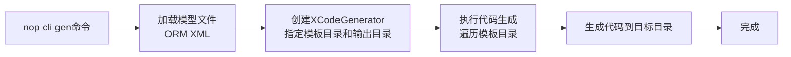

# 代码生成基础

Nop平台采用**差量化软件生产线**，支持增量生成和Delta合并：

```
Result = FirstGeneration + AutoGenDelta + ManualDelta
```

## 一、XCodeGenerator代码生成器

`XCodeGenerator`是Nop平台内置的数据驱动代码生成器，生成过程的逻辑控制完全由模板文件指定。

### 1.1 基本特性

**XCodeGenerator的关键特性**：

| 特性 | 说明 |
|-----|------|
| **数据驱动** | 生成逻辑由模板文件控制，而非硬编码 |
| **增量生成** | 支持反复执行，自动合并生成代码和手工修改 |
| **依赖追踪** | 自动追踪模型文件变化，仅当模型改变时才重新生成 |
| **智能缓存** | 缓存生成结果，相同文本跳过文件写入，减少IO |
| **Delta支持** | 支持`x:extends`机制，实现差量定制 |

### 1.2 执行流程

XCodeGenerator的执行流程：


**关键点**：
1. 执行模板目录根目录下的`@init.xrun`文件，初始化循环模型
2. 通过循环模型解析模板路径中的变量表达式
3. 针对每个变量组合执行一次代码生成
4. 自动追踪生成文件依赖的模型文件

## 二、代码生成模板语法

### 2.1 模板文件类型

| 后缀 | 说明 | 用途 |
|-----|------|------|
| **.xgen** | 代码生成模板 | 生成后去除`.xgen`后缀（如`Entity.java.xgen` → `Entity.java`） |
| **.xrun** | XPL脚本文件 | 仅执行逻辑，不生成文件 |
| **@前缀** | 内部文件 | 不生成，仅作为内部使用（如`@init.xrun`） |

### 2.2 变量表达式

模板路径中的变量表达式用于指定循环变量和生成逻辑：

```bash
# 基本变量
{varName}

# 嵌套属性访问
{model.name}
{entity.shortName}

```

**示例模板路径**：
```
/nop/dao/entity/{entityModel.packagePath}/{entityModel.shortName}.java.xgen
```

### 2.3 开关变量

用于条件性跳过文件的生成：

```bash
# 当webEnabled为false或null时，跳过该文件
/src/{package.name}/{webEnabled}/{model.name}Controller.java.xgen

# 当tagSet不包含mapper时，跳过
/dao/mapper/{!!entityModel.tagSet.@mapper}{entityModel.shortName}Mapper.java.xgen
```

**语法说明**：
- `{variable}`：变量值为`false`或`null`时跳过
- `{!!variable}`：双重否定，变量值存在且为`true`时生成

### 2.4 循环控制

#### 方式1：路径级循环（推荐）

通过目录和文件名中的变量表达式自动创建循环：

```xml
<!-- 模板结构 -->
/templates/
├── {entityModel.shortName}/
│   ├── {entityModel.shortName}.java.xgen
│   └── {entityModel.shortName}Mapper.java.xgen
```

**生成结果**（假设有2个实体）：
```
/NopFileRecord/
├── NopFileRecord.java
└── NopFileRecordMapper.java
/NopUser/
├── NopUser.java
└── NopUserMapper.java
```

#### 方式2：XPL模板内循环

使用XPL标签控制循环：

```xml
<c:for var="entity" items="${ormModel.entities}">
    <c:out>${entity.name}</c:out>
</c:for>
```

### 2.5 条件判断

```xml
<!-- if判断 -->
<c:if test="${entity.name == 'NopFileRecord'}">
    <c:out>这是文件记录实体</c:out>
</c:if>

<!-- choose-when-otherwise -->
<c:choose>
    <c:when test="${entity.tagSet.@mapper}">
        <c:out>生成Mapper接口</c:out>
    </c:when>
    <c:otherwise>
        <c:out>跳过Mapper接口</c:out>
    </c:otherwise>
</c:choose>
```

### 2.6 脚本执行

在模板中嵌入JavaScript/TypeScript脚本：

```xml
<c:script>
// 定义变量
let customEnabled;

// 复杂逻辑
if (entity.hasCustomField()) {
    customEnabled = true;
}
</c:script>

<!-- 使用脚本中定义的变量 -->
<c:out>${customEnabled}</c:out>
```

### 2.7 输出控制

```xml
<!-- 直接输出 -->
package ${basePackageName};

<!-- 不转义输出 -->
<c:out escape="none"><![CDATA[
    ${xmlContent}
]]></c:out>

```

### 2.8 完整模板示例

#### 示例1：Java实体类模板

```xml
<c:unit xpl:outputMode="text">package ${basePackageName}.dao.entity;

import io.nop.orm.model.IEntityModel;
import io.nop.orm.support.DynamicOrmEntity;

/**
 * ${entityModel.displayName}
 */
public class ${entityModel.className} extends DynamicOrmEntity {

    <c:for var="col" items="${entityModel.columns}">
    /**
     * ${col.displayName}: ${col.colName}
     */
    public static final String PROP_NAME_${col.propName} = "${col.propName}";
    public static final int PROP_ID_${col.propName} = ${col.id};

    </c:for>
}
</c:unit>
```

#### 示例2：Mapper接口模板

```xml
<c:unit xpl:outputMode="text">package ${basePackageName}.dao.mapper;

import io.nop.api.core.annotations.orm.SqlLibMapper;

@SqlLibMapper("/${moduleId}/sql/${entityModel.shortName}.sql-lib.xml")
public interface ${entityModel.shortName}Mapper {
}
</c:unit>
```

#### 示例3：代码生成脚本（.xrun）

```xml
<c:script>
// 生成Entity和DAO到目标模块
codeGenerator.withTargetDir("../nop-file-dao/src/main/java")
    .renderModel(
        '../../nop-file-dao/src/main/resources/_vfs/nop/file/orm/app.orm.xml',
        '/nop/templates/orm-entity', '/', $scope);
</c:script>
```

## 三、POM配置代码生成器

### 3.1 依赖代码生成器模块

```xml
<project>
    <artifactId>nop-file-codegen</artifactId>

    <dependencies>
        <!-- 核心依赖：代码生成器 -->
        <dependency>
            <groupId>io.github.entropy-cloud</groupId>
            <artifactId>nop-codegen</artifactId>
            <version>2.0.0-SNAPSHOT</version>
        </dependency>
    </dependencies>

    <build>
        <plugins>
            <!-- exec-maven-plugin：执行代码生成任务 -->
            <plugin>
                <groupId>org.codehaus.mojo</groupId>
                <artifactId>exec-maven-plugin</artifactId>
                <configuration>
                    <!-- 代码生成器主类 -->
                    <mainClass>io.nop.codegen.task.CodeGenTask</mainClass>
                </configuration>
            </plugin>
        </plugins>
    </build>
</project>
```

### 3.2 Maven生命周期配置

Nop平台的根`pom.xml`中统一配置了代码生成的Maven生命周期：

```xml
<plugin>
    <groupId>org.codehaus.mojo</groupId>
    <artifactId>exec-maven-plugin</artifactId>
    <executions>
        <!-- ==================== Precompile阶段 ==================== -->

        <!-- precompile: 在compile之前执行，不包含项目资源 -->
        <execution>
            <id>precompile</id>
            <phase>generate-sources</phase>
            <goals>
                <goal>java</goal>
            </goals>
            <configuration>
                <arguments>
                    <argument>${project.basedir}</argument>
                    <argument>precompile</argument>
                </arguments>
                <addResourcesToClasspath>false</addResourcesToClasspath>
                <addOutputToClasspath>false</addOutputToClasspath>
            </configuration>
        </execution>

        <!-- precompile2: 在compile之前执行，包含项目资源 -->
        <execution>
            <id>precompile2</id>
            <phase>generate-sources</phase>
            <goals>
                <goal>java</goal>
            </goals>
            <configuration>
                <arguments>
                    <argument>${project.basedir}</argument>
                    <argument>precompile2</argument>
                </arguments>
                <addResourcesToClasspath>true</addResourcesToClasspath>
                <addOutputToClasspath>true</addOutputToClasspath>
            </configuration>
        </execution>

        <!-- ==================== Compile阶段 ==================== -->

        <!-- aop: 编译后生成AOP代理类 -->
        <execution>
            <id>aop</id>
            <phase>compile</phase>
            <goals>
                <goal>java</goal>
            </goals>
            <configuration>
                <classpathScope>test</classpathScope>
                <arguments>
                    <argument>${project.basedir}</argument>
                    <argument>aop</argument>
                </arguments>
            </configuration>
        </execution>

        <!-- ==================== Postcompile阶段 ==================== -->

        <!-- postcompile: 编译后执行，包含项目资源 -->
        <execution>
            <id>postcompile</id>
            <phase>generate-test-resources</phase>
            <goals>
                <goal>java</goal>
            </goals>
            <configuration>
                <addResourcesToClasspath>true</addResourcesToClasspath>
                <addOutputToClasspath>true</addOutputToClasspath>
                <arguments>
                    <argument>${project.basedir}</argument>
                    <argument>postcompile</argument>
                </arguments>
            </configuration>
        </execution>
    </executions>

    <configuration>
        <classpathScope>compile</classpathScope>
        <includePluginDependencies>true</includePluginDependencies>
        <includeProjectDependencies>true</includeProjectDependencies>
        <mainClass>io.nop.codegen.task.CodeGenTask</mainClass>
    </configuration>
</plugin>
```

### 3.3 配置参数说明

| 参数 | 说明 | 推荐值 |
|-----|------|---------|
| `mainClass` | 代码生成器主类 | `io.nop.codegen.task.CodeGenTask` |
| `classpathScope` | 依赖范围 | `compile`（默认），`test`（需要依赖DAO模块时） |
| `addResourcesToClasspath` | 是否包含src/main/resources | `false`（precompile），`true`（postcompile） |
| `addOutputToClasspath` | 是否包含编译输出目录 | `false`（precompile），`true`（postcompile） |
| `includePluginDependencies` | 包含插件依赖 | `true` |
| `includeProjectDependencies` | 包含项目依赖 | `true` |

**precompile vs precompile2 vs postcompile**：

| 阶段 | Maven Phase | classpath配置 | 使用场景 |
|-------|-------------|--------------|---------|
| `precompile` | generate-sources | addResources=false, addOutput=false | 生成模型文件（不依赖已编译代码） |
| `precompile2` | generate-sources | addResources=true, addOutput=true | 生成依赖已生成模型的代码 |
| `postcompile` | generate-test-resources | addResources=true, addOutput=true | 生成业务代码（依赖模型文件） |

## 四、通过nop-cli执行代码生成

### 4.1 安装nop-cli

```bash
# 编译nop-runner模块
cd nop-runner/nop-cli-core
mvn clean install

# 或者使用预编译的jar包
# nop-cli.jar位于target目录
```

### 4.2 nop-cli命令语法

```bash
java -jar nop-cli.jar gen [model文件] [选项]
```

**常用选项**：

| 选项 | 说明 | 示例 |
|-----|------|------|
| `-t` | 指定模板目录 | `-t=/nop/templates/orm` |
| `-o` | 指定输出目录 | `-o=target` |

### 4.3 使用nop-cli生成初始项目

```bash
# 1. 从ORM模型生成完整项目
java -jar nop-cli.jar gen model/nop-file.orm.xml -t=/nop/templates/orm -o=.

# 2. 从XML模型生成代码
java -jar nop-cli.jar gen model/nop-file.orm.xml -t=/nop/templates/orm-entity -o=target
```

### 4.4 nop-cli执行流程



**伪代码表示**：
```javascript
// 1. 加载模型
codeGenModel = loadModelFile("model/nop-file.orm.xlsx");

// 2. 创建代码生成器
generator = new XCodeGenerator("/nop/templates/orm", ".");

// 3. 设置模型到作用域
scope.setLocalValue("codeGenModel", codeGenModel);

// 4. 执行代码生成
generator.execute("/", scope);
```

### 4.5 nop-cli vs Maven构建

| 对比项 | nop-cli | Maven构建 |
|-------|----------|-----------|
| **使用场景** | 初始化项目、一次性生成代码 | 持续开发、修改模型后重新生成 |
| **输入来源** | 独立的模型文件 | 模块内已生成的模型文件 |
| **执行方式** | 命令行工具 | Maven插件（自动触发） |
| **依赖追踪** | 无 | 自动追踪模型变化 |
| **增量生成** | 否 | 是（保护手工修改） |
| **推荐** | 生成初始项目 | 日常开发 |

## 五、增量生成机制

### 5.1 文件覆盖规则

Nop平台通过文件命名约定区分可手工修改和自动覆盖的文件：

**总是被覆盖**（不要手工修改）：
- 以`_`为前缀的文件：`_NopFileRecord.java`
- `_gen`目录下的所有文件：`entity/_gen/`
- 包含`__XGEN_FORCE_OVERRIDE__`标记的文件

**增量生成**（可手工修改）：
- 非下划线前缀的文件：`NopFileRecord.java`
- 不在`_gen`目录下的文件

### 5.2 三明治架构

```
CustomClass extends _AutoGenClass extends BaseClass
```

**示例**：

```java
// 可手工修改的实体类（不会覆盖）
public class NopFileRecord extends _NopFileRecord {
    // 手工添加的业务方法
    public String getDisplayName() {
        return getFileName();
    }

    // 手工添加的属性
    public String getCustomField() {
        return (String) internalGet("customField");
    }
}

// 自动生成的实体基类（总是覆盖）
public class _NopFileRecord extends DynamicOrmEntity {
    // 自动生成的属性和方法
    public String getFileId() {
        return (String) internalGet(PROP_NAME_fileId);
    }
}
```

### 5.3 Delta合并机制

使用`x:extends`实现差量定制：

```xml
<!-- 定制的Entity配置 -->
<meta x:extends="_NopFileRecord.xmeta">
    <props>
        <!-- 添加新属性 -->
        <prop name="customField" displayName="自定义字段"/>
    </props>
</meta>
```

## 六、生成后的项目开发

### 6.1 不再需要nop-cli

项目生成后，通过Maven构建即可：

```bash
# 1. 修改模型文件（ORM XML）
# model/nop-file.orm.xml

# 2. 执行Maven构建
mvn clean install

# 3. 代码自动生成和编译
# - precompile阶段：生成ORM模型和XMeta
# - postcompile阶段：生成Entity、DAO、Service、Web代码
```

### 6.2 修改模型后重新生成

```bash
# 方式1：重新构建所有模块
mvn clean install

# 方式2：只重新生成相关模块
cd nop-file-codegen && mvn clean install
cd ../nop-file-dao && mvn clean install
cd ../nop-file-meta && mvn clean install
cd ../nop-file-service && mvn clean install
cd ../nop-file-web && mvn clean install
```

### 6.3 日常开发流程


**关键点**：
- 代码生成自动触发，无需手动执行nop-cli
- 手工修改的代码不会被覆盖（三明治架构）
- 仅需修改模型文件，代码自动同步

## 七、相关文档

- [全栈代码生成详解](./full-stack-codegen.md) - ORM到前端全栈生成的完整流程
- [Delta定制基础](../delta/delta-basics.md) - 差量定制机制

---

**文档版本**: 3.0
**最后更新**: 2026-01-28
