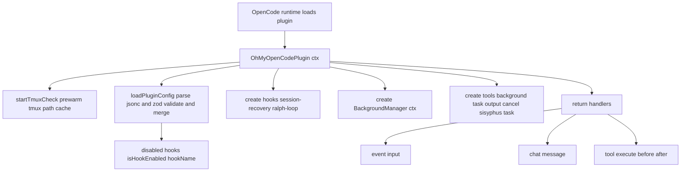
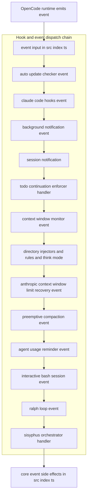
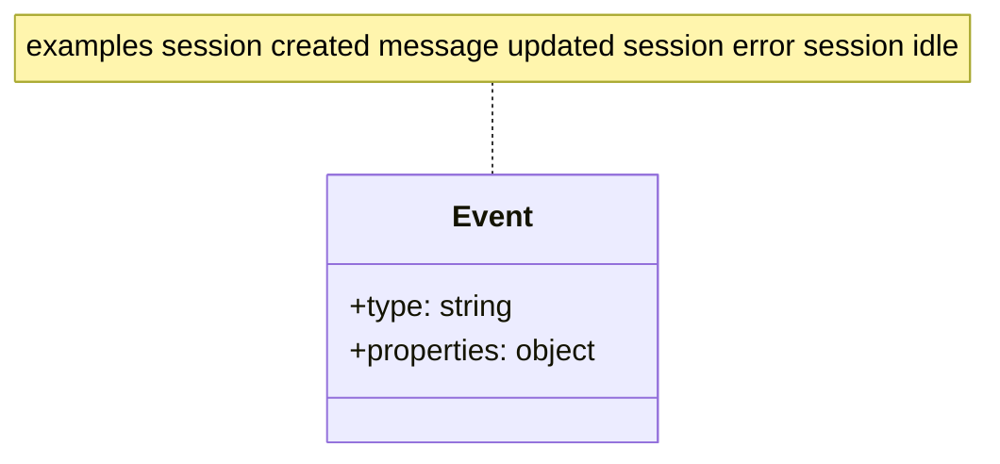
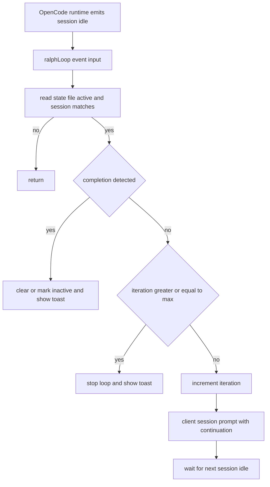
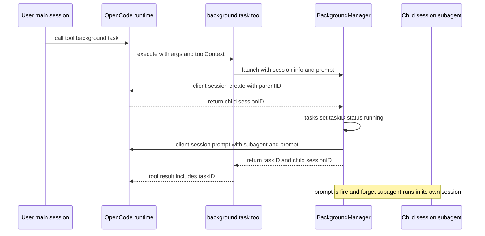
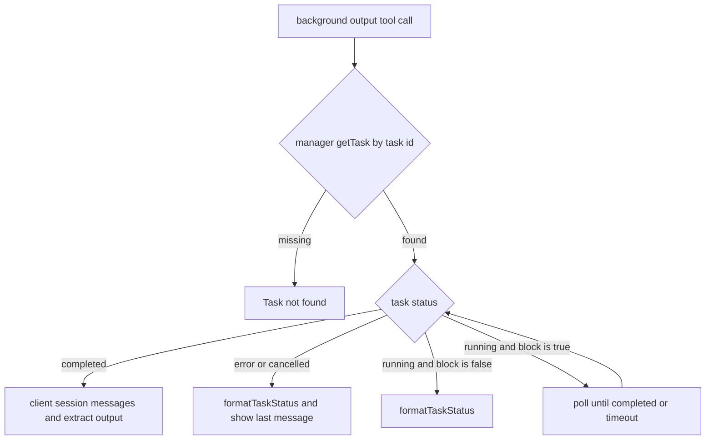
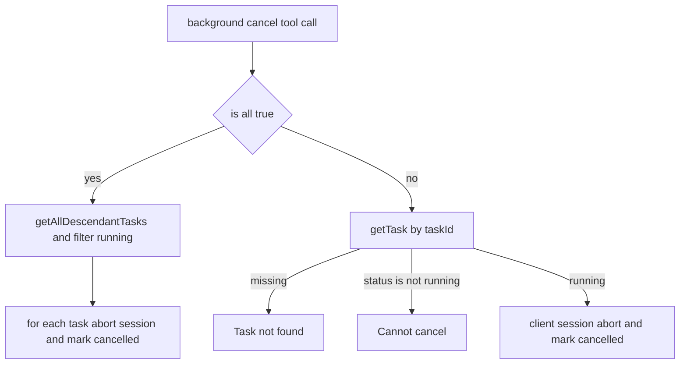

# OpenCode / oh-my-opencode 内部实现原理（源码导读）

这份文档基于 `oh-my-opencode` 项目源码（TypeScript + Bun）梳理 OpenCode 插件内部的关键机制：配置加载与合并、事件/Hook 生命周期、工具（tools）注册方式、SessionID 的来源/流转、Ralph Loop、tmux/interactive-bash、后台任务与 compaction（含 DCP 动态剪枝）。

> 说明：这里的“OpenCode”指 OpenCode 的插件运行时与事件系统；“oh-my-opencode”是一个复杂插件，提供 hooks / tools / agents / skills / MCP 兼容层。

## 1. 配置（Config）怎么找、怎么合并

源码入口：`oh-my-opencode/src/plugin-config.ts`。

### 1.1 配置文件路径与优先级

`loadPluginConfig(directory, ctx)` 会构造两类配置路径，并优先读取 `.jsonc`：

1. **用户级（user）**：`<userConfigDir>/opencode/oh-my-opencode.(jsonc|json)`
2. **项目级（project）**：`<project>/.opencode/oh-my-opencode.(jsonc|json)`

加载顺序：先读 user，后读 project（project 覆盖 user）。

### 1.2 JSONC + Schema 校验

`loadConfigFromPath()`：

- 使用 `parseJsonc()` 解析（允许注释、trailing comma）
- 调用 `OhMyOpenCodeConfigSchema.safeParse()` 做 Zod 校验
- 校验失败会记录错误（`addConfigLoadError`）并忽略该配置文件

### 1.3 合并规则（deep merge + set union）

`mergeConfigs(base, override)` 的核心规则：

- 顶层字段：`{ ...base, ...override }`（override 覆盖）
- `agents`、`claude_code`：使用 `deepMerge()` 深度合并
- 一系列 `disabled_*` 列表：做去重并集（Set union）

这意味着：

- 你可以在 user 级给出通用 agent 配置，在 project 级做小覆盖
- disabled 列表会累加，不会被 project “清空” user 的禁用项

## 2. 插件入口：Hook/Tool 是怎么被装配的

源码入口：`oh-my-opencode/src/index.ts`。

`OhMyOpenCodePlugin: Plugin = async (ctx) => { ... }` 内主要做三件事：

1. **启动全局后台检查**：`startTmuxCheck()`（用于 tmux 可用性/路径缓存等，来自 `src/tools/interactive-bash`）
2. **加载并解析配置**：`const pluginConfig = loadPluginConfig(ctx.directory, ctx)`
3. **按 enabled/disabled 装配 hooks + tools + handlers**



### 2.1 Hook 启用/禁用机制

`disabled_hooks` 来自配置：

```ts
const disabledHooks = new Set(pluginConfig.disabled_hooks ?? []);
const isHookEnabled = (hookName: HookName) => !disabledHooks.has(hookName);
```

之后每个 hook 都是类似的条件创建：

```ts
const ralphLoop = isHookEnabled("ralph-loop")
  ? createRalphLoopHook(ctx, { config: pluginConfig.ralph_loop, ... })
  : null;
```

### 2.2 插件暴露的主 handler（最重要的三类）

`return { tool: {...}, "chat.message": ..., event: ..., "tool.execute.before": ..., ... }`

其中三条主线：

1. **tool：工具注册表**（OpenCode 侧把它们当可调用工具）
2. **chat.message：用户消息/模型输出的拦截与注入**
3. **event：所有事件（session/message/tool 等）的统一分发**

## 3. SessionID 从哪里来？mainSessionID 是什么？

（这部分对理解 Ralph Loop、Todo Continuation、后台任务、MCP Session 复用都很关键。）

### 3.1 SessionID 的来源

在插件 runtime 中，SessionID 主要通过两种方式出现：

1. **Chat/Tool handler 输入**：例如 `"chat.message"` 的 `input.sessionID`，`"tool.execute.before"` 的 `input.sessionID`
2. **event 负载**：例如 `event.type === "session.idle"` 时，`event.properties.sessionID`

### 3.2 mainSessionID：插件记录的“主会话”

源码：`src/index.ts` 的 `event` 处理里：

- 当收到 `session.created` 且**没有 parentID**，调用 `setMainSession(sessionInfo.id)`
- 当 `session.deleted` 且删除的是 mainSession，调用 `setMainSession(undefined)`

用途：

- 某些功能只允许在 main session（或后台子 session）上触发，例如 `todo-continuation-enforcer`、`sisyphus-orchestrator` 等会做过滤（避免无关 session 无限“continue”）

## 4. Hook 分发顺序（事件总线）

`src/index.ts` 的 `event: async (input) => { ... }` 按固定顺序把事件交给多个 hook：

- autoUpdateChecker
- claudeCodeHooks
- backgroundNotification
- sessionNotification
- todoContinuationEnforcer
- contextWindowMonitor
- directoryAgentsInjector / directoryReadmeInjector / rulesInjector / thinkMode
- anthropicContextWindowLimitRecovery
- preemptiveCompaction
- agentUsageReminder
- interactiveBashSession
- ralphLoop
- sisyphusOrchestrator

这个顺序意味着：

- 例如 compaction 相关 hook 会早于 ralph-loop / orchestrator 运行
- ralph-loop 依赖 `session.idle`，所以它被放在 event 链里统一监听即可（不需要单独注册 “session.idle” handler）



### 4.1 event 负载（payload）是什么？谁会触发 event？

在 OpenCode 插件体系里，`event` 不是“你手动 emit 的事件总线”，而是 **OpenCode 运行时（host）在生命周期点主动推送给插件的事件流**。

- **谁触发**：OpenCode runtime（当 session/message/tool 等状态变化时）
- **插件如何注册监听器**：插件在入口返回对象里提供一个 `event` 函数；runtime 会在事件发生时调用它
- **何时触发**：取决于 event.type，例如会话创建/删除、会话空闲、消息更新、会话错误、工具执行等

在 `oh-my-opencode/src/index.ts` 里你能直接看到“注册监听器”的形式：

- 插件返回对象里定义 `event: async (input) => { ... }`
- 该函数里再依次调用各个 hook 的 `event()` / `handler()`，完成统一分发

### 4.2 event payload 的结构长什么样？

在本仓库里，`event` 入参通常长这样（简化）：

```ts
type PluginEventInput = {
  event: {
    type: string
    properties?: Record<string, unknown>
  }
  // 可能还包含 directory/client 等上下文（由 runtime 注入）
}
```



关键点：

- `event.type` 是判别字段（例如 `"session.created" | "session.deleted" | "message.updated" | "session.error" | "session.idle" ...`）
- `event.properties` 是载荷（payload），不同 type 形状不同；常见会包含：
  - `properties.sessionID`：事件关联的 session
  - `properties.info`：更细的对象（例如 session 的 `id/title/parentID`，或 message 的 `sessionID/agent/role`）
  - `properties.messageID` / `properties.error`：错误事件中用于恢复的字段

`oh-my-opencode` 在 `src/index.ts` 中对 payload 的典型使用示例：

- `session.created`：从 `properties.info.parentID` 判断是不是主会话（没有 parentID 才是 mainSession）
- `message.updated`：从 `properties.info.sessionID/agent/role` 记录 session 的“当前 agent”（只记录 role=user 的消息）
- `session.error`：从 `properties.sessionID/messageID/error` 触发 session-recovery 修复，并在主会话上自动 prompt("continue")

> 注意：event payload 的具体字段来自 OpenCode runtime，因此插件里经常会像本仓库一样用 `as Record<string, unknown>` 做窄化，再按需求取字段（同时保持对字段缺失的容错）。

## 5. Ralph Loop：自动“继续直到完成”的实现细节

相关文件：

- `src/hooks/ralph-loop/index.ts`：hook 本体
- `src/hooks/ralph-loop/storage.ts`：状态存储（YAML front matter）
- `src/index.ts`：触发 start/cancel 的入口（chat.message 模板识别、/slashcommand）

### 5.1 配置项

`oh-my-opencode.json(c)` 中：

```jsonc
{
  "ralph_loop": {
    "enabled": true,
    "default_max_iterations": 100,
    "state_dir": null
  }
}
```

- `enabled`: 是否启用 hook（最终仍会被 `disabled_hooks` 覆盖）
- `default_max_iterations`: 未显式指定时的最大继续次数
- `state_dir`: 自定义状态文件相对路径（相对 `ctx.directory`），例如 `".sisyphus/ralph-loop.local.md"`

### 5.2 触发：什么时候“开始一个 Ralph Loop”

在 `src/index.ts` 的 `"chat.message"` handler 中，插件会检查输出文本是否包含 Ralph Loop 模板片段：

- 判断是 “start” 模板：提取 `<user-task>...</user-task>`
- 解析可选参数：
  - `--max-iterations=...`
  - `--completion-promise=...`

最终调用：

```ts
ralphLoop.startLoop(input.sessionID, prompt, { maxIterations, completionPromise })
```

同理，在 `"tool.execute.before"` 里对 `slashcommand` 工具有特殊处理：当命令是 `/ralph-loop ...` 时会 `startLoop()`；当模板是取消时会 `cancelLoop()`。

### 5.3 状态存储格式：YAML front matter + body

默认状态文件的位置来自 `DEFAULT_STATE_FILE`（默认通常是 `.sisyphus/ralph-loop.local.md`）；也可以通过配置 `state_dir` 改到别处。

`src/hooks/ralph-loop/storage.ts` 写入格式：

```text
---
active: true
iteration: 1
max_iterations: 50
completion_promise: "DONE"
started_at: "2026-01-13T...Z"
session_id: "ses_..."  # 可选
---
<原始任务文本...>
```

实现要点：

- front matter 用 `parseFrontmatter()` 解析
- body（`{ body }`）保存的是原始 prompt，支持多行

### 5.4 “继续”的时机：监听 session.idle



`createRalphLoopHook().event()` 主要关心：

- `session.idle`：会话空闲时检查是否需要注入 continuation prompt
- `session.deleted`：如果 loop 归属的 session 被删除，清理状态
- `session.error`：如果用户 abort（`MessageAbortedError`），清理状态；否则短暂标记为 recovering（避免立即 idle 触发再注入）

continue 的核心流程（在 `session.idle`）：

1. 读取 state 文件，确认 `active` 且 session 匹配
2. 如果 `state.session_id` 与当前 idle 的 session 不同：
   - 可选地通过 `checkSessionExists` 判断原 session 是否已不存在；如果是“孤儿 state”则清理
3. 检测是否已经完成：
   - **先看 transcript 文件**是否出现 `<promise>...</promise>`（这是性能优化）
   - 再调用 `ctx.client.session.messages(...)` 扫消息内容确认
4. 若未完成且未超过 max iterations：
   - `incrementIteration()`
   - 构造 continuation prompt（包含 iteration/max/promise/原任务）
   - `ctx.client.session.prompt({ path: { id: sessionID }, body: { parts: [...] } })`
   - toast 提示当前 Iteration

### 5.5 Completion Promise：为什么要 `<promise>DONE</promise>`

Ralph Loop 的“完成判定”不是由工具或任务状态给出，而是由模型在输出中写入一个明确标识：

$$\texttt{<promise>YOUR\_PROMISE</promise>}$$

这使得：

- 模型在任何时候都能“自证完成”（可跨多轮继续）
- hook 可以无侵入地通过 transcript/messages 扫描判断

## 6. tmux / interactive-bash：为什么要单独做一套工具

相关文件：

- `src/tools/interactive-bash/tools.ts`：`interactive_bash` 工具
- `src/tools/interactive-bash/utils.ts`：tmux 路径探测与缓存
- `src/hooks/interactive-bash-session/*`：会话级 tmux session 跟踪与清理

### 6.1 interactive_bash 工具在做什么

#### tmux 是什么（给没用过的人）

tmux（Terminal MUltipleXer）是一个**终端复用器**：

- 一个 tmux **session** 可以包含多个窗口（window）和分屏（pane）
- 你可以 `detach` 后把它留在后台继续跑；之后再 `attach` 回来继续看输出

在本项目里，`interactive_bash` 并不是“直接跑 bash”，而是**通过 tmux 执行终端命令并管理 session**，从而获得：

- 可复用的交互终端（不用每次都开一个新进程/新窗口）
- 可控的超时与清理（防止 hanging / 防止残留）
- 更稳定的“后台运行 + 之后查询/收集输出”的体验

`interactive_bash` 的输入是一个字符串参数：`tmux_command`，例如：

- `"new-session -d -s my_sess"`
- `"ls"`

实现关键点（`src/tools/interactive-bash/tools.ts`）：

- 用 `tokenizeCommand()` 做**引号感知**的 tokenization
- 禁止一部分 tmux 子命令（`BLOCKED_TMUX_SUBCOMMANDS`）以避免滥用/绕过输出捕获策略
- 使用 `Bun.spawn([tmuxPath, ...parts])` 执行
- 设定超时（默认 `DEFAULT_TIMEOUT_MS`），防止 hang
- 非 0 exit code 返回 `Error: ...`

### 6.2 interactive-bash-session hook：为什么要跟踪 / 清理

### 6.3 “tmux 可用性后台检查（预热）”到底是什么

在插件入口 `src/index.ts` 会很早调用一次 `startTmuxCheck()`（来自 `src/tools/interactive-bash`），这件事经常被描述成“全局后台检查”。它的真实含义是：

- **提前探测**机器上是否存在 tmux（Windows 用 `where tmux`，mac/linux 用 `which tmux`）
- 找到后再用 `tmux -V` **验证可执行**
- 把最终路径缓存到内存（`tmuxPath`），后续 `interactive_bash` 执行时直接复用，避免首次调用额外卡顿

它是一个“依赖探测 + 缓存预热”的优化：

- 不会检查任何“后台任务是否完成”
- 探测失败会**静默忽略**（`catch(() => {})`），因此通常不会显式提示

`interactive-bash-session` hook（`src/hooks/interactive-bash-session/index.ts`）会在工具执行后分析 tmux 操作：

- 记录新建/kill 的 tmux session
- 把跟踪状态按 sessionID 持久化到 `.json`（见 `src/hooks/interactive-bash-session/storage.ts`）
- 当 OpenCode session 被删除（`session.deleted`）时，自动 kill 掉该 OpenCode session 关联的 tmux sessions，并清掉存储

这解决了一个现实问题：

- 你让 agent 起了 tmux session，如果不清理，很容易产生“孤儿 tmux session”在机器上长期残留。

## 7. 后台任务（Background tasks）与通知

相关文件：

- `src/features/background-agent/manager.ts`：BackgroundManager（创建子 session、并发控制、轮询、通知）
- `src/hooks/background-notification/index.ts`：事件路由到 BackgroundManager
- `src/tools/background-task/tools.ts`：`background_task` / `background_output` / `background_cancel`
- `src/tools/sisyphus-task/tools.ts`：更高阶的“按类别/skill”启动与 resume
- `src/tools/call-omo-agent/tools.ts`：限定 explore/librarian 的子 agent 调用（支持 sync + background）

### 7.1 背景任务是怎么“执行”的（启动/提示/运行）



核心是 `BackgroundManager.launch()`（`src/features/background-agent/manager.ts`）：

1. **并发控制**：按 agent 作为 key 调用 `ConcurrencyManager.acquire()`（避免同类 agent 过载）
2. **创建子 session**：调用 `client.session.create({ parentID, title })`
3. **标记 subagent session**：`subagentSessions.add(sessionID)`（来自 `src/features/claude-code-session-state/state.ts`）
4. **登记任务对象**：`tasks.set(task.id, task)`，状态初始为 `running`
5. **fire-and-forget prompt**：调用 `client.session.prompt({ agent, model?, system?, tools, parts })`
   - 注意这里是“发出去就不等返回”，失败通过 `.catch(...)` 把 task 标记为 `error` 并通知父 session

这里有一个非常关键的“上下文隔离”点：

- 子 agent 实际在**独立 session**里运行（`session.create(parentID=主会话)`），它的 tool output / 任务对话不会直接挤占主会话的上下文窗口。
- 主会话只会收到“通知/摘要式”信息（toast 或 prompt/noReply），从而避免子任务的长输出污染主上下文。

### 7.2 上下文如何传递给子 agent（以及传递了什么）

这里建议把“上下文传递”拆成两个概念：

1. **结构性上下文（会话树）**：通过 `parentID` 建立父子 session 关系。
2. **内容性上下文（prompt/system）**：显式把需要子 agent 知道的内容放入 prompt/system。

#### 7.2.0 子 agent 的“初始上下文”到底来自哪里？

一个容易误解的点：**子 agent 不会自动继承父会话的完整对话上下文**。

- `parentID` 建立的是“会话树关系”（结构关联），主要用于管理/追踪（父子 session 归属、任务树、清理、通知等），并不等价于“把父 session 的 messages 复制给子 session”。
- 子 agent 开局真正拥有的“内容上下文”，来自启动时显式发给它的：
  - `prompt`（通常是 `parts: [{ type: "text", text: ... }]`）
  - 可选 `system`（例如 skills 解析出来的 `skillContent`、category prompt append 等）

因此，如果子 agent 需要父会话里的关键信息（具体文件路径、已知结论、约束条件、要搜的关键字），必须由父侧在 `prompt/system` 里**显式带过去**，或者让子 agent 自己再去做一次 contextual grep。

#### 7.2.1 parentAgent / parentModel 的继承（容错 & 准确性）

多个工具都会尝试推断 `parentAgent`（父会话当前使用的 agent），以便后台系统做更合理的通知/恢复：

- `call_omo_agent`：`src/tools/call-omo-agent/tools.ts`
- `background_task`：`src/tools/background-task/tools.ts`
- `sisyphus_task`：`src/tools/sisyphus-task/tools.ts`

它们采用一致的“容错式多来源推断”链：

1. `toolContext.agent`（当前工具调用上下文直接给的 agent）
2. `getSessionAgent(sessionID)`（插件在 `message.updated` 事件里记录的 agent 映射）
3. `findFirstMessageWithAgent(...)`（从本地消息存储回溯第一条标注 agent 的消息）
4. `findNearestMessageWithFields(...)`（从本地消息存储回溯最近一条含 model/agent 等字段的消息）

这个链条的目的就是：即使 OpenCode SDK/event 在某一层缺字段，仍能从磁盘存储的 hook-message-injector 数据中恢复必要元信息。

对 `parentModel` 的推断也类似：从 `prevMessage?.model?.providerID/modelID` 推断。

#### 7.2.2 skill/system 内容注入（让子 agent 带着“能力/约束”开局）

`BackgroundManager.launch()` 支持把 `system: input.skillContent` 一起发给子 session（见 `manager.ts` 里的 `client.session.prompt` body）。

而 `sisyphus_task` 会把 skills 解析成一段 “skillContent”，再拼 category 的 prompt append：

- `resolveMultipleSkills(args.skills, ...)` -> `skillContent`
- `buildSystemContent({ skillContent, categoryPromptAppend })`

这样子 agent 在**自己的 session**里得到完整的 system 约束，但不会把这些内容塞回主会话消息。

### 7.3 如何让子 agent 不影响主 agent 的 context window

这个项目采用的是“**隔离 + 汇报**”策略，不是“共享上下文”策略：

1. **隔离**：子 agent 都运行在独立 session（`session.create(parentID=...)`），因此它们的大量对话、tool 输出占用的是各自 session 的上下文窗口。
2. **汇报/检查**：主会话通过 `background_output`/通知拿到结果，这些结果通常是摘要/截断的文本。
3. **主会话自保护**：主会话还会启用 `tool-output-truncator`、preemptive compaction、DCP 等机制，防止主会话被一次工具输出打爆。

换句话说：子 agent 的“长文本”不会直接注入主会话；只有当你显式把结果贴回主会话（例如让主 agent 引用/总结）时，才会消耗主会话窗口。

### 7.4 后台任务如何检查/等待/取消

#### 7.4.1 检查：`background_output`



实现：`src/tools/background-task/tools.ts`（同文件下有 `formatTaskStatus` / `formatTaskResult`）。

关键行为：

- **block=false（默认）**：立即返回任务状态表（running / complete / error）+ last message/tool 信息（可能会被 truncate）
- **block=true**：轮询等待直到完成或超时（内部用 delay + 状态检查）

它获取“结果”的方式是：读取子 session 的 `client.session.messages({ id: task.sessionID })`，并过滤 role 为 `assistant` 或 `tool` 的消息，再按时间拼接内容（避免“最后一条为空但之前有 tool_result”）。

#### 7.4.2 取消：`background_cancel`



实现同样在 `src/tools/background-task/tools.ts`：

- 支持 `taskId` 精确取消
- 或 `all=true` 取消整棵任务树（`getAllDescendantTasks(parentSessionID)`）里所有 running 任务

### 7.5 背景任务的容错点（失败时怎么退化）

`BackgroundManager.launch()` 的 prompt 是 `.catch(...)` 处理错误：

- 标记 task 为 `error`
- 尝试把错误原因写入 `task.error`
- 释放并发锁（`concurrencyManager.release(concurrencyKey)`）
- 触发通知（`markForNotification` / `notifyParentSession`）

其中还包含一个常见错误的专门分支：当错误消息包含 `agent.name` 或 `undefined` 时，提示“agent 未注册”。

## 8. 容错性：有哪些“防炸/自愈/降级”机制

这一块建议你把它理解为三层防线：

1. **工具输出截断（避免一次工具输出把 context 撑爆）**
2. **上下文窗口监控 + 预防性 compaction（快撑爆时提前 summarize）**
3. **异常恢复（当 API/模型侧报错时，修复 message/tool parts 后继续）**

### 8.1 Tool Output Truncator：按 tool 白名单截断输出

源码：`src/hooks/tool-output-truncator.ts`。

- 默认只截断 `TRUNCATABLE_TOOLS` 中的工具（grep/glob/LSP/ast-grep/interactive_bash/skill_mcp/webfetch...）
- 若配置 `experimental.truncate_all_tool_outputs=true` 则对所有工具输出截断
- 用 `createDynamicTruncator(ctx).truncate(sessionID, output, { targetMaxTokens })`
- **完全失败时静默降级**（catch 后不影响工具执行）

这属于“硬防炸”：宁愿输出不全，也不能把主会话窗口吃光。

### 8.2 Context Window Monitor：只做提醒，不做干预

源码：`src/hooks/context-window-monitor.ts`。

它在 `tool.execute.after` 拉取 `ctx.client.session.messages`，只看最后一条 assistant 的 token 使用，达到阈值就往工具输出末尾追加一个提醒块：

- `remindedSessions` 做去重（每个 session 只提醒一次）
- `try/catch` 包裹，失败不影响工具执行

这个 hook 的定位是“提醒你别 rush”，并不直接触发 compaction。

### 8.3 Session Recovery：修复消息结构错误并尝试自动 resume

源码：`src/hooks/session-recovery/index.ts`。

它解决的不是“任务逻辑错了”，而是“模型/SDK/消息结构不满足 API 约束导致报错”，典型包括：

- `tool_use`/`tool_result` 不匹配（缺 tool_result）
- thinking block 顺序不合法
- thinking disabled 但消息里含 thinking
- 空内容 message（部分 provider/模型会触发）

恢复策略大概是：

1. 通过 `detectErrorType(error)` 分类
2. 从错误里提取 `messages.N` 的 index（`extractMessageIndex`）定位问题消息
3. 通过本地存储（`readParts(...)` / replaceEmptyTextParts / stripThinkingParts 等）修复
4. 需要时调用 `client.session.prompt(...)` 注入缺失的 `tool_result` 或 resume 文本

并且它会尽量继承最后一条 user message 的 agent/model（`extractResumeConfig`），使“恢复后的继续”保持一致。

## 9. 子 agent（subagent）模式：sync vs background 的差异

这里容易混淆：同样是“让另一个 agent 去做事”，但同步/异步的上下文与影响完全不同。

### 9.1 `call_omo_agent`（限定 explore/librarian）

文件：`src/tools/call-omo-agent/tools.ts`

- 这是一个“受限版子 agent 调用器”，**只允许** `subagent_type` 为 `explore` 或 `librarian`。
- 参数形状（核心）：
  - `description`：短描述（3-5 词），用于状态展示
  - `prompt`：给子 agent 的完整任务文本
  - `subagent_type`：`explore` 或 `librarian`
  - `run_in_background`：**必填**，显式选择同步/后台
  - `session_id`：可选，仅用于同步模式下“继续已有子 session”

- `run_in_background=true`（后台模式）：
  - 走 `BackgroundManager.launch()`，创建独立子 session 异步跑。
  - **不支持** `session_id`（传了会直接报错）。
  - 返回文本里会给出 `Task ID` / `Session ID`，主会话通过通知或 `background_output(task_id)` 查看结果。

- `run_in_background=false`（同步模式）：
  - 如果没传 `session_id`：会 `session.create(parentID=主会话)` 创建子 session。
  - 然后对该子 session 调用 `session.prompt({ agent: subagent_type, tools: { task:false, call_omo_agent:false, sisyphus_task:false }, parts:[...] })`。
    - 这里的关键点是：同步子 agent 被**禁止**使用 `task` / `call_omo_agent` / `sisyphus_task`，避免递归编排或滥用。
  - 最后读取该子 session 的 messages，由程序把 `assistant` 与 `tool` role 的输出（包括 `text` / `reasoning` / `tool_result`）按时间顺序抽取并拼接，作为工具返回写回主会话（不是再发起一次模型调用做总结）。

注意：同步模式即使在子 session 中运行，最终**仍会把抽取的文本作为 tool 返回写进主会话**，因此会消耗主会话上下文；但通常比“共享同一个 session 直接跑”要干净。

### 9.2 `sisyphus_task`（更通用 + 支持 resume）

文件：`src/tools/sisyphus-task/tools.ts`

它的重点能力：

- 强制要求 `run_in_background` 和 `skills`（缺参数直接返回错误），避免调用方“忘了选模式”导致上下文污染或并发失控。
- 支持 `resume: <sessionID>`：
  - `run_in_background=true`：`manager.resume(...)`，并提示用 `background_output` 查进度
  - `run_in_background=false`：直接对 `args.resume` session 做 `client.session.prompt(...)`，然后用“消息稳定性检测”轮询等到输出稳定再返回

这个稳定性逻辑的目的非常现实：有些模型/工具会在 prompt 返回后还继续产生 tool messages 或追加输出，如果立刻读 messages 会读到不完整结果。

- `src/features/background-agent/*`：BackgroundManager（任务生命周期、层级关系、TTL/清理）
- `src/hooks/background-notification/index.ts`：把 OpenCode 事件转交给 manager
- `src/tools/background-task/*`：`background_output` / `background_cancel`
- `src/tools/sisyphus-task/*` / `src/tools/call-omo-agent/*`：创建或复用后台 session 并推动执行

### 7.1 BackgroundManager 的角色

BackgroundManager 是插件内的“后台任务控制面”：

- task 结构通常包含：`id`, `sessionID`（子 session）, `parentSessionID`（父 session）, `agent`, `status`, `startedAt`...
- 支持查找父子任务树（`getAllDescendantTasks`）
- 允许 resume / cancel 等操作
- 负责把任务进度通过 OpenCode 的 prompt/toast 通知回父 session（与 task-toast-manager 配合）

### 7.2 background-notification hook：纯事件路由

`src/hooks/background-notification/index.ts` 非常薄：

- `eventHandler` 直接 `manager.handleEvent(event)`

说明后台任务的“状态计算/通知策略”都集中在 manager 里，而 hook 只是为了接入 OpenCode 的 event bus。

## 8. Compaction、Preemptive compaction、以及 DCP（动态上下文剪枝）

相关文件：

- `src/hooks/preemptive-compaction/index.ts`
- `src/hooks/compaction-context-injector/index.ts`
- `src/hooks/anthropic-context-window-limit-recovery/*`

### 8.1 preemptive-compaction：到阈值就主动 summarize

当模型支持并且 token 使用率达到阈值（默认 `0.80` 或 `0.85`，以源码常量/配置为准）时：

- hook 会 toast 警告
- 调用 `ctx.client.session.summarize({ auto: true })`
- toast 成功并提示继续

这比“撞到硬上限再恢复”更稳定。

#### 8.1.1 preemptive-compaction 之前会先“按规则精简”吗？

不会。

`preemptive-compaction`（`src/hooks/preemptive-compaction/index.ts`）的核心流程是：

1. （可选）调用 `onBeforeSummarize(ctx)`
2. 直接调用 `ctx.client.session.summarize({ auto: true, providerID, modelID })`

其中常见的 `onBeforeSummarize` 实现是 `createCompactionContextInjector()`（`src/hooks/compaction-context-injector/index.ts`）。它做的事是通过 `injectHookMessage(sessionID, prompt, ...)` **注入一条“总结时必须包含哪些段落”的约束提示**，以提高 compaction 后的连续性。

注意：这里的“注入总结约束”不等价于“程序化剪枝/精简历史消息”。preemptive-compaction 不会在 summarize 之前主动删除/替换旧消息内容（例如 tool 输出）；它依赖 runtime 的 summarize/compaction 机制完成“变短”。

### 8.2 compaction-context-injector：总结前注入“保命上下文”

compaction 会把对话总结成更短文本，可能丢掉关键执行状态。

`createCompactionContextInjector()` 会产出一个 callback `onBeforeSummarize`，preemptive-compaction 在 summarize 前调用它，把“总结时必须包含”的结构化要求注入进去（例如：用户原始需求、已完成工作、剩余任务、禁止事项等）。

### 8.3 anthropic token limit recovery：撞墙后的多阶段恢复

当出现 token limit error（Anthropic 为主）时，`anthropic-context-window-limit-recovery` hook 会尝试自动恢复：

1. **PHASE 1：DCP（Dynamic Context Pruning）**
   - 剪枝重复 tool call、被后续 read 覆盖的 write、旧的错误工具输入等
2. **PHASE 2：输出截断/更激进策略**（取决于配置）
3. **PHASE 3：summarize / revert / resume**（取决于具体错误类型与实验配置）

其中 DCP 的核心实现集中在 `pruning-executor.ts` / `pruning-storage.ts`，会把部分历史 tool output 替换成类似：

`[Content pruned by Dynamic Context Pruning]`

并记录大致节省 token 数。

#### 8.3.1 这里的“精简”是 AI 总结，还是程序剪枝？

在 `anthropic-context-window-limit-recovery` 这条“撞墙恢复”路径里，两种机制都会出现，但它们是两回事：

1. **总结（AI summarize）**：在某些阶段会调用 `client.session.summarize(...)`，这属于 runtime 的总结能力。
2. **剪枝（程序化精简）**：在 summarize 之前/之外，代码会尝试用 DCP（Dynamic Context Pruning）或 sanitize 修复来减少错误与 token 压力。

具体包括：

- **summarize 前的 sanitize（修复空消息，避免 API 报错）**：`executor.ts` 里的 `sanitizeEmptyMessagesBeforeSummarize(sessionID)` 会查找“空内容 message”，并用 `replaceEmptyTextParts(...)` 或 `injectTextPart(...)` 写入占位文本（例如 `[user interrupted]`）。这是“可用性修复”，不以省 token 为主要目标。

- **DCP 程序化剪枝（以省 token 为目标）**：`pruning-executor.ts` 的 `executeDynamicContextPruning(sessionID, config, client)` 会运行三类策略，将要剪掉的 tool callID 收集到 `toolIdsToPrune`，最后由 `applyPruning(sessionID, state)`（`pruning-storage.ts`）把对应历史 tool 输出替换/剪除：
  - `pruning-deduplication.ts`：对“相同工具 + 相同输入”（signature）产生的重复调用去重，通常保留最后一次，剪掉之前的 tool 输出。
  - `pruning-supersede.ts`：对“后续写入已经覆盖旧写入结果”的历史写操作输出做 supersede（可配置是否 aggressive）。
  - `pruning-purge-errors.ts`：清理一定 turn 范围内与错误相关的工具输出/失败痕迹（turn 数可配置）。

另外，DCP 有一个默认的 **protected tools** 列表（`pruning-executor.ts` 的 `DEFAULT_PROTECTED_TOOLS`），例如 `task`/`todowrite`/`session_read`/`session_write` 等，默认不参与剪枝；原因是这些工具输出往往包含“不可轻易丢失的关键状态/记忆”，剪掉可能直接让后续恢复或继续执行失真。

## 9. 读源码的“地图”

如果你要系统理解插件，可以按下面路径读：

1. `src/index.ts`：装配与事件分发总线
2. `src/plugin-config.ts`：配置读取、JSONC、Zod 校验、合并策略
3. `src/tools/index.ts`：工具注册入口、哪些工具暴露给 OpenCode
4. `src/hooks/*`：每个 hook 的职责与触发点
5. `src/features/*`：较大系统（背景任务、skill/mcp、context injector、claude code compat）

## 10. 下一步可以补充的内容（可选）

- CLI `oh-my-opencode run` 的 session 创建/复用（如果你计划支持 `--session-id`）
- `claude-code-hooks` 兼容层：如何从 `~/.claude/settings.json` 加载并映射到 OpenCode 的 hook 事件
- `slashcommand` 工具与 `auto-slash-command` hook：如何把文本命令映射为工具调用
