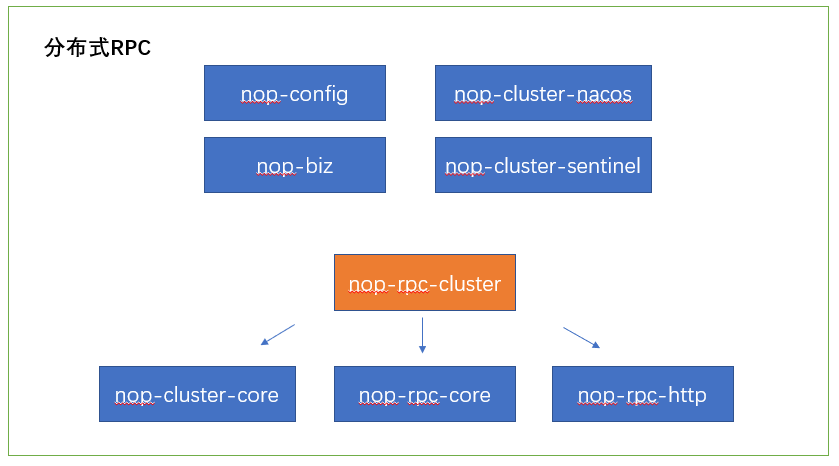
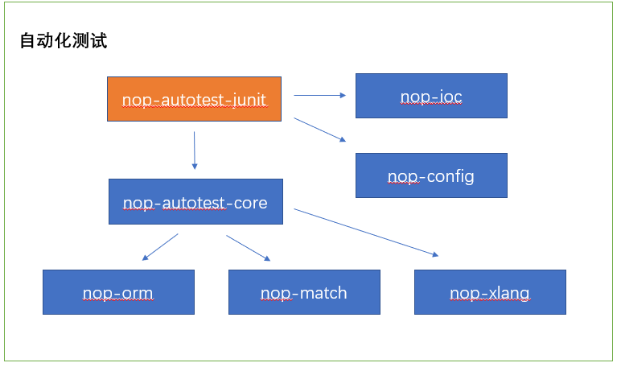

# 模块依赖关系

Nop平台的模块虽然很多，但是因为整体设计采用了依赖注入、动态加载等方式，各个模块的耦合度很低，大部分模块都可以独立使用，并且可以脱离Nop平台与其他框架集成使用。

## 一. 核心模块

Nop平台最核心的模块是nop-core、nop-xlang这两个模块。**所谓的可逆计算原理的具体实现都集中在这两个模块中**。

* **nop-api-core包含了整个平台对内、对外都需要共享的全局对象和交互消息**。例如平台中使用的所有注解、API调用用到的公共Bean（如ApiRequest, ApiResponse, PageBean），NopException统一异常处理类，IContext全局上下文，IUserContext用户上下文等。当第三方框架需要调用Nop平台提供的服务接口时一般会引用这个模块。

* nop-commons提供了StringHelper, FileHelper等帮助函数，并提供了大量的与业务无关的数据结构封装，例如ThreadPoolExecutor, LocalCache，TextScanner等。

* **nop-core负责提供其他模块都可能会用到的核心模型对象以及全局的模型缓存和依赖跟踪机制**。例如基本的Tree、Table、Graph、Filter、FieldSelection结构定义和相关算法实现，XML和JSON文件解析（没有使用第三方解析库），差量化的虚拟文件系统，全局模型加载器，以及字典表、国际化消息、异常码映射等。为了便于支持GraalVM，core模块还提供了自制的泛型类型定义以及反射调用机制（直接使用Java反射性能较低）。

* **nop-xlang提供Nop平台最核心的XLang语言以及差量合并算法的实现**。XLang语言是一个统称，它包括了Nop平台内置的一系列自定义领域语言，例如XDef元模型定义语言，XMeta对象结构定义语言，Xpl面向元编程的模板语言, XScript支持宏函数的脚本语言, XPath路径查找语言，XTransform结构转换语言等。参见[xlang](https://gitee.com/canonical-entropy/nop-entropy/blob/master/docs/dev-guide/xlang/index.md)

* **nop-codegen提供了可以与maven打包工具集成在一起的代码生成器**。XLang内置的元编程机制可以看作是一种语言内置的代码生成器，而codegen则提供了外置的、数据驱动的差量化代码生成器，参见[codegen.md](https://gitee.com/canonical-entropy/nop-entropy/blob/master/docs/dev-guide/codegen.md)。nop-codegen模块的templates目录下包含了大量内置的代码生成模板，比如/templates/orm用于根据数据模型来生成全套的前后端增删改查代码。这些代码生成模板可能需要解析DSL模型，这时就需要引入对应的元模型和Excel解析模型。比如为了根据g4文件定义生成Antlr AST解析器就需要引入nop-antlr4依赖，参见[antlr.md](https://gitee.com/canonical-entropy/nop-entropy/blob/master/docs/dev-guide/xlang/antlr.md)。为了解析Excel数据模型，我们需要引入nop-orm-model依赖，并使用nop-xdefs模块中的orm.xdef元模型定义。

nop-xlang的开发是一个有趣的自举过程。因为codegen需要使用XLang中的Xpl和XScript语言，而XScript语言的解析器又是根据antlr语法定义模型自动生成的，所以实际开发过程采用了如下方式：

1. 先手工编写一个简易的XScript解析器，使得它可以支持antlr代码生成模板的运行

2. 编写代码生成模板，根据antlr模型生成XScript解析器

3. 用自动生成的解析器覆盖手工编写的XScript解析器

nop-codegen工具可以独立于Nop平台被使用，生成其他框架或者其他语言的代码，比如生成mybatis代码，vue代码等，而且可以将CodeGenerator与FileWatcher结合在一起，**当发现某个目录下的模型文件发生变动时，就自动将依赖于该模型的所有文件重新生成一遍**。

引入nop-xlang模块之后，我们就可以调用`ResourceComponentManager.instance().loadComponentModel(path)`来加载`src/resources/_vfs/`
目录下的虚拟文件系统中的模型文件，自动根据xdef元模型定义实现模型解析，自动执行编译期代码生成、Delta差量合并等模型变换操作，并缓存模型解析结果。

## 二. GraphQL引擎

Nop平台的后端服务使用NopGraphQL引擎实现。NopGraphQL引擎没有使用graphql-java包，是完全从零开始实现的一个新的GraphQL引擎。相比于graphql-java，它充分利用了可逆计算原理，极大减少了需要手工编写的代码量，提高了运行时性能。此外，NopGraphQL支持模型动态加载，支持REST调用接口与GraphQL调用接口。

* nop-graphql-core提供了GraphQL的执行引擎，协调多个DataFetcher并行获取数据，并且提供了RPC调用接口封装

* nop-graphql-orm提供了使用NopORM引擎实现的各种DataFetcher

* nop-dao提供了JDBC封装、事务封装以及数据库Dialect机制

* nop-orm-model提供了实体模型定义，而nop-orm-eql提供了EQL语法的解析器。这两个模块可以独立于nop-orm引擎被使用

* nop-orm实现了一个包含Hibernate和MyBatis所有核心功能的ORM引擎

* nop-biz中的[BizObjectManager](https://gitee.com/canonical-entropy/nop-entropy/blob/master/nop-biz/src/main/java/io/nop/biz/impl/BizObjectManager.java)提供了[IGraphQLSchemaLoader](https://gitee.com/canonical-entropy/nop-entropy/blob/master/nop-graphql/nop-graphql-core/src/main/java/io/nop/graphql/core/schema/IGraphQLSchemaLoader.java)接口的实现，将GraphQL调用映射到BizModel的方法上。这个过程类似于REST框架将URL链接映射到Controler类的方法上，具体参见[graphql-java.md](https://gitee.com/canonical-entropy/nop-entropy/blob/master/docs/dev-guide/graphql/graphql-java.md)。nop-biz模块内置了[CRUD服务](https://gitee.com/canonical-entropy/nop-entropy/blob/master/nop-biz/src/main/java/io/nop/biz/crud/CrudBizModel.java)和[字典表服务](https://gitee.com/canonical-entropy/nop-entropy/blob/master/nop-biz/src/main/java/io/nop/biz/dict/DictProviderBizModel.java)。

* nop-biz通过nop-fsm内置了有限自动机机制，可以描述某些简单的业务流程

* nop-biz并不强依赖于NopIoC容器，但是依赖nop-ioc模块可以利用模块内置的beans.xml配置。

## 三. 分布式RPC框架

Nop平台在GraphQL引擎的基础上建立了分布式RPC机制，参见[rpc-design.md](../dev-guide/microservice/rpc-design.md)

* nop-cluster-core提供了负载均衡、服务发现、Leader选举等集群相关的支持机制

* nop-rpc-http将[IHttpClient](https://gitee.com/canonical-entropy/nop-entropy/blob/master/nop-http/nop-http-api/src/main/java/io/nop/http/api/client/IHttpClient.java)接口封装成了IRpcService接口（RPC服务的内部实现接口）

* nop-rpc-cluster提供了广播式RPC调用和负载均衡RPC调用

NopIoC内置了类似springboot的autoconfig机制，因此只要引入nop-cluster-nacos等模块就会自动初始化相关的bean。

* nop-cluster-nacos基于Alibaba Nacos服务提供了服务注册发现机制

* nop-cluster-sentinel基于Alibaba Sentinel服务实现了熔断限流机制

* nop-config提供了动态配置更新机制

* nop-biz通过GraphQL引擎实现了RPC服务接口

## 四. 应用入口

* nop-boot模块中的NopApplication类类似springboot中SpringApplication类的作用，负责整个应用的创建和初始化工作

* nop-quarkus-web-starter类似于springboot中starter模块的作用，应用只要引入nop-quarks-web-starter模块即可将Nop平台与Quarkus框架集成在一起。

* nop-spring-web-starter实现了Nop平台与Spring框架的集成。

## 五. 应用模块

* nop-web-site中包含了Nop平台的前端框架代码，它是nop-chaos项目打包的产物

* nop-web-amis-editor包含了AMIS可视化设计器的代码

一般通过Excel数据模型生成的代码会分成几个子模块：dao模块提供实体定义和Mapper定义，service模块提供GraphQL服务，web模块提供前端View模型和AMIS页面定义。一般的业务应用会引入nop-sys-web和nop-auth-web。

* nop-sys模块提供字典表、系统序列号等系统表相关的后端服务和前端页面

* nop-auth模块提供用户角色权限控制相关的后端服务和前端页面

Nop平台整体设计采用了可分可合的灵活组织形式。初始代码生成时对于每一个Excel数据模型，我们会生成一个app模块，它引用了本模型对应的service和web子模块，例如nop-auth-app引用了nop-auth-web和nop-auth-service。在开发调试的过程中，我们可以使用nop-auth-app模块作为微服务单独启动，通过内置的sso机制即可将多个微服务集成为一个整体应用系统。

除此之外，**我们也可以在一个应用中引用所有模块的web和service子模块，从而构成一个单体应用**，例如nop-quarkus-demo模块中的做法。

## 六. 报表引擎

NopReport是一个采用Excel作为可视化设计器的支持中国式报表的报表引擎，使用方法参见[report.md](../user-guide/report.md)。

* nop-report-core实现了报表展开算法、报表表达式、报表函数等核心机制

* nop-ooxml-xlsx提供了Excel文件解析和保存功能，它的实现没有使用apache poi包或者其他的第三方软件包，而是直接使用XML解析器解析Excel原始文件，因此它的代码总量很小，可以嵌入到Android平台中使用

* nop-excel提供了ExcelWorkbook模型对象，利用workbook.xdef元模型，可以自动实现XML格式的DSL与ExcelWorkbook对象之间的双向转换。因此ExcelWorkbook作为领域模型是脱离Excel软件独立存在的。

* nop-ooxml-docx提供了可以进行可视化编辑的Word模板机制，具体使用参见[word-temlate.md](../dev-guide/report/word-template.md)

## 七. 自动化测试框架

Nop平台的自动化测试框架原则上是一种通用设计，不依赖于JUnit测试框架。

* nop-autotest-core提供了框架中立的自动化测试支持，它与nop-orm引擎集成在一起，可以自动录制ORM引擎读取和修改的数据，并自动利用录制数据来初始化数据库，并自动校验测试用例执行结果与录制结果相匹配

* nop-match提供基于前缀引导语法的结果匹配校验算法

* nop-autotest-junit提供JUnit框架集成所需的封装，并和nop-ioc、nop-config模块集成在一起，简化自动化测试用例的配置和使用

## 八. IDEA插件

* nop-idea-plugin插件基于xdef元模型实现统一的DSL语法提示、校验、链接跳转、端点调试等功能

* nop-xlang-debugger提供断点调试支持，它的内部实现使用了一个基于socket的简单RPC接口

* 在被调试的应用程序中也要引入nop-xlang-debugger模块依赖。因为调试的基本原理是应用启动的时候打开一个socket监听端口，然后IDEA调试器链接到这个端口上发送调试指令。

## 九. 命令行工具

nop-cli命令行工具聚合了一批可以独立使用的功能，具体参见[cli.md](../dev-guide/cli.md)

* gen指令需要用到nop-codegen模块来执行代码生成

* reverse-db指令需要用到nop-dbtool模块从数据库中逆向分析数据表定义，然后转换为nop-orm模块中定义的实体对象模型，最后利用nop-report模块提供的报表导出功能将实体对象模型保存到Excel文件中
