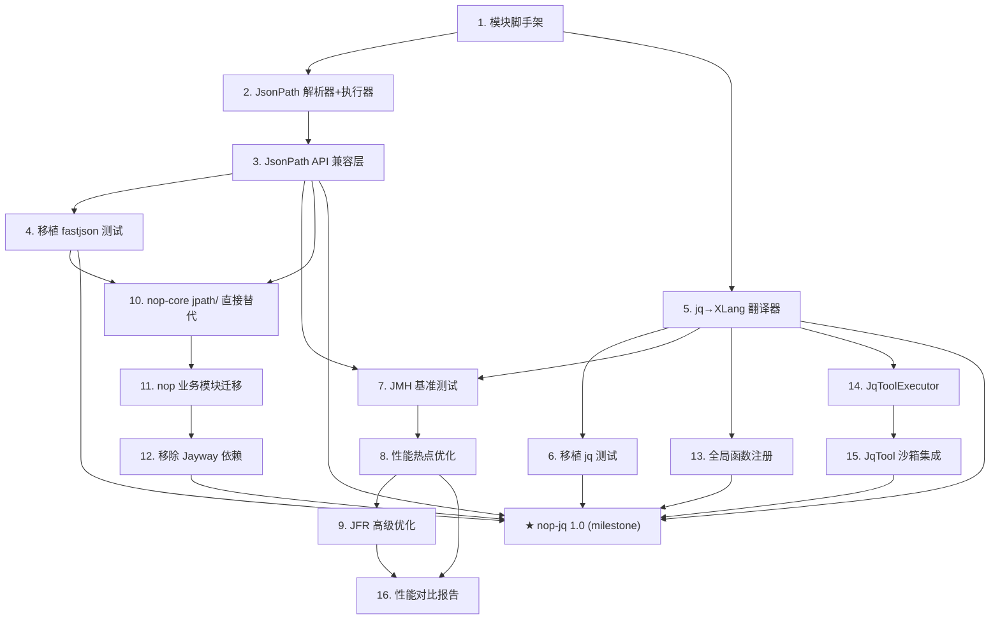

# nop-jq Roadmap — 自研 JSON 查询引擎

> Last updated: 2026-09-18
> Sources: `ai-dev/design/nop-jq/00-vision.md` (primary),
> `ai-dev/design/nop-jq/01-architecture-baseline.md` (architecture baseline)

## Purpose

本 roadmap 追踪 nop-jq 模块的实现：从零构建自研 JSON 查询引擎，支持 JsonPath（兼容 fastjson API）和 jq（兼容 jq 接口）两种语法，通过 JMH/JFR 完成性能优化使性能贴近 fastjson，**直接替代 nop 全平台对 Jayway JsonPath 的依赖**，并在 nop-ai-toolkit 中集成 jq CLI 工具供 AI Agent 调用。

Does not contain implementation details. Each `planned` stage is owned by its execution plan.

## Work Items

> **This is the only dynamic state block. Update status only here.**
> The roadmap is a human-AI alignment artifact: humans set items and their order;
> AI takes the first `todo` item, drafts/executes plans (humans don't review individual
> plans), and writes the item back to `done` when closure audit passes.

### Wave 1: 基础设施

- 1. 模块脚手架 + 基础设施（JsonValue, JsonAccessor, NopJsonPath 门面）: `todo`
- 2. JsonPath 解析器 + 执行器（递归下降, Segment[], Filter 体系）: `todo`
- 3. JsonPath API 兼容层（兼容 fastjson JSONPath 全部公开 API）: `todo`

### Wave 2: 测试移植 + 功能完善

- 4. 移植 fastjson JsonPath 单元测试（118 个测试文件）: `todo`
- 5. jq→XLang 翻译器 + jq 核心语法支持: `todo`
- 6. 移植 jq 核心测试用例（Tier 1 + Tier 2，约 400 个用例）: `todo`

### Wave 3: 性能优化

- 7. JMH 基准测试框架搭建 + 基线测量: `todo`
- 8. 性能热点优化（属性访问、Segment 融合、缓存策略）: `todo`
- 9. JFR 分析 + 高级优化（减少分配、向量化、锁竞争）: `todo`

### Wave 4: 全平台直接替代

- 10. nop-core jpath/ 移除 + 调用方切换到 io.nop.jq.jsonpath.JSONPath: `todo`
- 11. nop 业务模块迁移（nop-biz, nop-auth, nop-wf, nop-graphql 等全部上层模块）: `todo`
- 12. 从 nop-dependencies/pom.xml 移除 Jayway JsonPath 依赖声明: `todo`
- 13. 全局函数注册（XLang/XSQL/XDef 中可用 jq/jsonPath）: `todo`

### Wave 5: nop-ai-toolkit 集成

- 14. JqToolExecutor 实现（模拟 jq 命令行，AI Agent 可调用）: `todo`
- 15. JqTool 沙箱集成（HostBashSandbox 中执行 nop-jq）: `todo`

### Wave 6: 收尾

- 16. 性能对比报告（nop-jq vs fastjson vs Jayway, 含 JMH 结果）: `todo`

★ **Milestone: nop-jq 1.0**（unlocks when 1-15 all done）: `todo`

## Status values

| Status | Meaning |
| --- | --- |
| `todo` | Not started, no plan |
| `planned` | Has execution plan, passed draft review |
| `done` | Complete, passed closure audit |

> Milestone status is derived: when work items 1-15 are all `done`, the milestone auto-flips to `done`.

## Framework / platform reuse

| Capability | Provider | Notes |
| --- | --- | --- |
| JSON 解析/序列化 | nop-core `JsonTool` | 复用，不重新实现 |
| 属性访问（Bean/Map/DynamicObject） | nop-core `BeanTool` + `ReflectionManager` | 通过 `JsonAccessor` 抽象复用 |
| 编译缓存 | nop-core `LocalCache` | 复用，替代 fastjson 的 `ConcurrentHashMap` |
| 表达式引擎（jq 翻译目标） | nop-xlang `IExecutableExpression` | jq→XLang 翻译器的执行后端 |
| AI 工具注册 | nop-ai-toolkit `IToolExecutor` + `*.tool.xml` | 复用工具发现和调用机制 |
| 沙箱执行 | nop-ai-toolkit `IBashSandbox` | 复用 HostBashSandbox/DockerBashSandbox |
| 测试框架 | JUnit 5 + Nop AutoTest | 项目标准 |

## Current baseline

**Already shipped:**
- nop-core `jpath/` 封装（JPath, BeanJsonProvider, BeanMappingProvider）— 依赖 Jayway，将被移除
- nop-core `JsonVisitState` — delta/merge 路径追踪（不涉及）
- nop-xlang 表达式引擎 — 已有 select, map, reduce, 管道等
- nop-ai-toolkit `BashExecutor` — shell 命令执行（可复用沙箱机制）

**Main gaps:**
- nop 全平台依赖 Jayway JsonPath（外部依赖）→ 由 nop-jq 直接替代
- 无 jq 风格查询能力
- 无自研 JsonPath 实现
- 无 JSON 查询性能基准测试
- nop-ai-toolkit 无 jq 命令行工具集成

## Stages

| # | Stage | Owner plan | Deps | Critical path | Reuse |
| --- | --- | --- | --- | --- | --- |
| 1 | 模块脚手架 + 基础设施 | plan-01-scaffold | — | **Yes** | nop-core JsonTool, BeanTool |
| 2 | JsonPath 解析器 + 执行器 | plan-02-jsonpath-engine | after 1 | **Yes** | — |
| 3 | JsonPath API 兼容层 | plan-03-jsonpath-compat | after 2 | **Yes** | — |
| 4 | 移植 fastjson 测试 | plan-04-fastjson-tests | after 3 | No | fastjson 测试用例 |
| 5 | jq→XLang 翻译器 | plan-05-jq-translator | after 1 | No | nop-xlang |
| 6 | 移植 jq 测试 | plan-06-jq-tests | after 5 | No | jq 测试用例 |
| 7 | JMH 基准测试 | plan-07-jmh-baseline | after 3, 5 | No | JMH |
| 8 | 性能热点优化 | plan-08-perf-optimize | after 7 | **Yes** | JFR |
| 9 | JFR 高级优化 | plan-09-jfr-advanced | after 8 | No | JFR |
| 10 | nop-core jpath/ 移除 + 切换 | plan-10-nop-core-replace | after 3, 4 | **Yes** | — |
| 11 | nop 业务模块迁移 | plan-11-biz-module-migration | after 10 | No | — |
| 12 | 移除 Jayway 依赖 | plan-12-remove-jayway | after 10, 11 | **Yes** | — |
| 13 | 全局函数注册 | plan-13-global-functions | after 5 | No | nop-xlang |
| 14 | JqToolExecutor | plan-14-jq-tool-executor | after 5 | No | nop-ai-toolkit |
| 15 | JqTool 沙箱集成 | plan-15-jq-tool-sandbox | after 14 | No | IBashSandbox |
| 16 | 性能对比报告 | plan-16-perf-report | after 8, 9 | No | JMH, JFR |
| ★ | nop-jq 1.0 (milestone) | — | 1-15 done | — | — |

## Stage details

### 1. 模块脚手架 + 基础设施

> Status: see Work Items above

**Goal:** 创建 nop-jq Maven 模块，实现共享基础设施：JsonValue sealed interface、JsonAccessor 抽象及 NopJsonAccessor 实现、NopJsonPath 门面类骨架。

**Deliverables:**
- NOPJQ-01: nop-jq/pom.xml（依赖 nop-core, nop-commons, nop-xlang）
- NOPJQ-02: JsonValue sealed interface + 6 个实现类（JsonNull/Boolean/Number/String/Array/Object）
- NOPJQ-03: JsonAccessor 接口 + NopJsonAccessor 实现（复用 BeanTool/ReflectionManager）
- NOPJQ-04: JsonQueryContext 上下文类
- NOPJQ-05: NopJsonPath 门面骨架（方法签名，暂不实现）

**Out of scope:** 解析器、执行器、jq 支持。

**Module / area:** `nop-kernel/nop-jq/src/main/java/io/nop/jq/`

### 2. JsonPath 解析器 + 执行器

> Status: see Work Items above

**Goal:** 实现递归下降 JsonPath 解析器，将路径字符串编译为 Segment[] 数组；实现完整的 Segment 体系和 Filter 体系。

**Deliverables:**
- NOPJQ-06: JsonPathParser（递归下降，参考 fastjson JSONPathParser）
- NOPJQ-07: Segment 接口 + 实现（PropertySegment, ArrayAccessSegment, WildCardSegment, FilterSegment, RangeSegment, MultiIndexSegment, MultiPropertySegment, DeepScanSegment）
- NOPJQ-08: Filter 接口 + 实现（CompareFilter, InFilter, BetweenFilter, RegexFilter, LikeFilter, NullFilter, LogicFilter, RefFilter）
- NOPJQ-09: JsonPathCompiler（编译入口，缓存集成）
- NOPJQ-10: JsonPathExecutor（管道执行模型）

**Out of scope:** fastjson API 兼容（stage 3）、extract() 流式路径。

**Module / area:** `nop-kernel/nop-jq/src/main/java/io/nop/jq/jsonpath/`

### 3. JsonPath API 兼容层

> Status: see Work Items above

**Goal:** 实现兼容 fastjson JSONPath 的完整公开 API，包括静态便捷方法和实例方法。

**Deliverables:**
- NOPJQ-11: `JSONPath.compile(path)` / `compile(path, ignoreNullValue)` — 编译+缓存
- NOPJQ-12: `eval(root)` / `eval(root, path)` — 静态+实例
- NOPJQ-13: `read(json, path)` — JSON 字符串解析+查询
- NOPJQ-14: `set(root, path, value)` / `set(root, value)` — 写操作（自动创建中间容器）
- NOPJQ-15: `remove(root, path)` / `remove(root)` — 删除操作
- NOPJQ-16: `size(root, path)` / `contains(root, path)` / `containsValue(root, path, value)`
- NOPJQ-17: `keySet(root, path)` / `paths(root)` / `reserveToArray()` / `reserveToObject()`
- NOPJQ-18: `arrayAdd(root, path, values)` / `patchAdd(root, value, replace)`
- NOPJQ-19: NopJsonPath 门面（委托到新实现，保持 JPath 签名兼容）

**Out of scope:** extract() 流式路径（Non-Goal）。

**Module / area:** `nop-kernel/nop-jq/src/main/java/io/nop/jq/jsonpath/`

### 4. 移植 fastjson JsonPath 单元测试

> Status: see Work Items above

**Goal:** 将 fastjson 的 118 个 JSONPath 测试文件移植到 nop-jq，替换 fastjson 类型为 nop-jq 类型，确保全部通过。

**Deliverables:**
- NOPJQ-20: 按类别移植测试（属性访问、数组访问、过滤器、深度扫描、聚合、写操作、边界情况）
- NOPJQ-21: 测试适配器（替换 `com.alibaba.fastjson.JSONPath` → `io.nop.jq.jsonpath.JSONPath`，`JSON.parse` → `JsonTool.parse`）
- NOPJQ-22: 确保所有 118 个测试文件通过

**Out of scope:** extract() 相关测试（7 个文件，Non-Goal）、ASM 相关测试。

**Module / area:** `nop-kernel/nop-jq/src/test/java/io/nop/jq/jsonpath/`

### 5. jq→XLang 翻译器

> Status: see Work Items above

**Goal:** 实现 jq 表达式到 XLang 表达式的翻译器，支持核心 jq 语法。提供兼容 jq CLI 的 Java 编程接口。

**Deliverables:**
- NOPJQ-23: JqLexer（jq 词法分析）
- NOPJQ-24: JqParser（jq 语法分析，输出翻译后的 XLang 表达式字符串）
- NOPJQ-25: 翻译映射：`.foo`, `select`, `map`, `reduce`, 管道, 数组/对象构造, if-then-else, 变量绑定
- NOPJQ-26: JqEngine 门面（`jq(expr).apply(root)` 调用方式）
- NOPJQ-27: XLang 新增内置函数：`keys`, `to_entries`, `from_entries`, `recurse`, `pick`, `sort_by`, `group_by`
- NOPJQ-28: `jq` CLI 兼容接口 — `JqQuery.compile(expr)` 返回 `IJsonQuery`，支持 `.apply()`, `.applyOne()`, `.set()`, `.remove()` 等操作

**Out of scope:** fork/backtrack VM、label/break、用户自定义函数、模块系统。

**Module / area:** `nop-kernel/nop-jq/src/main/java/io/nop/jq/jq/`

### 6. 移植 jq 核心测试

> Status: see Work Items above

**Goal:** 从 jq 测试套件中移植 Tier 1（核心）和 Tier 2（重要）测试用例，转换为 JUnit 5 格式。

**Deliverables:**
- NOPJQ-29: 移植 Tier 1 测试（~200 用例）：identity, 属性访问, 数组迭代, 切片, pipe, select, map, reduce, 算术, 比较, 条件, 变量, 字符串操作, length, type, error handling
- NOPJQ-30: 移植 Tier 2 测试（~200 用例）：解构, 赋值操作符, to_entries/from_entries, path 操作, sort/group/unique, 用户定义函数, 迭代组合子
- NOPJQ-31: 测试格式转换器（jq 的 program/input/output 三元组 → JUnit 5 @ParameterizedTest）

**Out of scope:** Tier 3 测试（regex 依赖 Oniguruma, formatting, module system）。

**Module / area:** `nop-kernel/nop-jq/src/test/java/io/nop/jq/jq/`

### 7. JMH 基准测试框架

> Status: see Work Items above

**Goal:** 搭建 JMH 基准测试框架，对 nop-jq、fastjson、Jayway JsonPath 进行基线性能测量。

**Deliverables:**
- NOPJQ-32: JMH 依赖配置（nop-jq 模块 + 独立 benchmark 子模块或 profile）
- NOPJQ-33: 基准测试场景定义（单层属性、嵌套属性、数组索引、过滤器、深度扫描、复合路径）
- NOPJQ-34: 三方可对比基准测试（nop-jq vs fastjson JSONPath vs Jayway JsonPath）
- NOPJQ-35: 基线性能报告（ops/time, 吞吐量, 平均耗时, P99）

**Out of scope:** 优化（stage 8）。

**Module / area:** `nop-kernel/nop-jq/src/test/java/io/nop/jq/benchmark/`

### 8. 性能热点优化

> Status: see Work Items above

**Goal:** 根据 JMH 基线结果，针对性优化 nop-jq 的性能热点，目标：常见场景性能达到 fastjson 的 80% 以上。

**Deliverables:**
- NOPJQ-36: 属性访问优化（FNV-1a 哈希加速、属性名缓存、避免反射查找）
- NOPJQ-37: Segment 融合优化（相邻 PropertySegment 合并为单次查找）
- NOPJQ-38: 内联优化（小对象分配消除、逃逸分析辅助）
- NOPJQ-39: 缓存策略优化（编译缓存命中率、Segment 实例共享）
- NOPJQ-40: 优化后 JMH 对比报告

**Out of scope:** JFR 分析（stage 9）、extract() 流式优化。

**Module / area:** `nop-kernel/nop-jq/src/main/java/io/nop/jq/`

### 9. JFR 分析 + 高级优化

> Status: see Work Items above

**Goal:** 使用 JFR (Java Flight Recorder) 分析运行时行为，进行高级优化。

**Deliverables:**
- NOPJQ-41: JFR 配置（jdk.ExecutionSample, jdk.ObjectAllocationInNewTLAB, jdk.JavaMonitorWait）
- NOPJQ-42: 热点分析报告（CPU 热点、分配热点、锁竞争）
- NOPJQ-43: 高级优化（减少 TLAB 分配、优化虚方法调用、SIMD 友好数据结构）
- NOPJQ-44: JFR 优化前后对比报告

**Out of scope:** native 层面优化。

**Module / area:** `nop-kernel/nop-jq/`

### 10. nop-core jpath/ 移除 + 调用方切换

> Status: see Work Items above

**Goal:** 移除 nop-core `jpath/` 包中的旧包装类（JPath, BeanJsonProvider, BeanMappingProvider），所有调用方切换到 `io.nop.jq.jsonpath.JSONPath`。API 名称和签名仿照 fastjson `com.alibaba.fastjson.JSONPath`，便于从 fastjson 迁移。

**Deliverables:**
- NOPJQ-45: 删除 `io.nop.core.lang.json.jpath` 包（JPath, BeanJsonProvider, BeanMappingProvider）
- NOPJQ-46: 更新 nop-core 内部调用点（JsonCleaner, JsonDiffer, ORM jsonPath 等）— `JPath.compile(path)` → `JSONPath.compile(path)`，`JPath.get(bean, path)` → `JSONPath.eval(bean, path)` 等
- NOPJQ-47: 更新 `CoreConfigs.CFG_JPATH_CACHE_SIZE` 引用指向 nop-jq 缓存配置
- NOPJQ-48: 确保 nop-core 单元测试全部通过

**Out of scope:** 上层业务模块迁移（stage 11）、移除 Jayway 依赖（stage 12）。

**Module / area:** `nop-kernel/nop-core/`, `nop-kernel/nop-jq/`

### 11. nop 业务模块迁移

> Status: see Work Items above

**Goal:** 扫描并迁移 nop 全平台中所有使用 Jayway JsonPath 的业务模块，确保无遗漏。

**Deliverables:**
- NOPJQ-51: 全平台 grep 扫描 `com.jayway.jsonpath` 引用，列出所有使用点
- NOPJQ-52: 迁移 nop-auth（认证模块中的 JSON 路径查询）
- NOPJQ-53: 迁移 nop-wf（工作流中的 JSON 路径操作）
- NOPJQ-54: 迁移 nop-graphql（GraphQL 参数提取）
- NOPJQ-55: 迁移 nop-ai-* 模块（AI 子系统中的 JSON 查询）
- NOPJQ-56: 迁移其他业务模块（nop-biz, nop-sys, nop-report 等）
- NOPJQ-57: 确保所有迁移模块的单元测试通过

**Out of scope:** nop-demo 和测试模块。

**Module / area:** 全平台 `nop-*/`

### 12. 移除 Jayway 依赖

> Status: see Work Items above

**Goal:** 从 nop-dependencies/pom.xml 中移除 Jayway JsonPath 依赖声明，从 nop-core/pom.xml 中移除依赖引用，确保全平台编译通过。

**Deliverables:**
- NOPJQ-58: 从 `nop-dependencies/pom.xml` 移除 `com.jayway.jsonpath:json-path` 依赖声明
- NOPJQ-59: 从 `nop-core/pom.xml` 移除 `com.jayway.jsonpath:json-path` 依赖引用
- NOPJQ-60: 全平台 `./mvnw clean install -T 1C` 编译通过
- NOPJQ-61: 全平台测试通过
- NOPJQ-62: 验证无残留 `com.jayway` import

**Out of scope:** nop-demo 中的示例代码（可保留作为对比参考）。

**Module / area:** `nop-kernel/nop-dependencies/`, `nop-kernel/nop-core/`, 全平台

### 13. 全局函数注册

> Status: see Work Items above

**Goal:** 在 XLang 中注册 jq 和 jsonPath 全局函数，使其可在 XSQL、XDef、XBiz 等 DSL 中直接使用。

**Deliverables:**
- NOPJQ-63: `jq(expr, root)` 全局函数
- NOPJQ-64: `jsonPath(root, path)` 全局函数
- NOPJQ-65: 在 nop-xlang 的全局函数注册表中注册
- NOPJQ-66: DSL 使用示例和文档

**Out of scope:** ORM 层面的自动集成（由 nop-core 迁移覆盖）。

**Module / area:** `nop-kernel/nop-jq/`, `nop-kernel/nop-xlang/`

### 14. JqToolExecutor

> Status: see Work Items above

**Goal:** 在 nop-ai-toolkit 中实现 JqToolExecutor，使 AI Agent 可以通过工具调用执行 jq 风格的 JSON 查询和转换。

**Deliverables:**
- NOPJQ-67: `jq-query.tool.xml` — 工具定义（输入：expression + json data 或 file path，输出：查询结果）
- NOPJQ-68: `jq-query.tool.xml` 的 schema 定义（兼容 jq CLI 参数风格：`--arg`, `--raw-output`, `--slurp` 等）
- NOPJQ-69: `JqQueryExecutor.java` — 实现 `IToolExecutor`，委托 nop-jq 的 JqEngine 执行
- NOPJQ-70: 在 `ai-toolkit-defaults.beans.xml` 中注册 bean `ai-tools:jq-query`
- NOPJQ-71: 支持从文件读取 JSON（`context.getFileSystem()`）和直接传入 JSON 字符串
- NOPJQ-72: 输出格式支持：raw（原始 JSON）、raw-string（无引号字符串）、compact（紧凑 JSON）、pretty（格式化 JSON）
- NOPJQ-73: 错误处理：语法错误、类型错误、路径不存在等友好错误信息

**Out of scope:** Docker 沙箱隔离（stage 15）、完整的 jq CLI 所有 flag。

**Module / area:** `nop-ai/nop-ai-toolkit/`

### 15. JqTool 沙箱集成

> Status: see Work Items above

**Goal:** 将 JqQueryExecutor 与 nop-ai-toolkit 的沙箱机制集成，支持在 HostBashSandbox 和 DockerBashSandbox 中安全执行。

**Deliverables:**
- NOPJQ-74: JqQueryExecutor 支持通过 `IBashSandbox` 执行（调用 nop-jq 的 CLI 入口）
- NOPJQ-75: 沙箱配置：允许的文件目录、超时限制、输出大小限制
- NOPJQ-76: Docker 沙箱配置：CPU/内存限制、网络隔离
- NOPJQ-77: 集成测试：验证 AI Agent 可通过 `IToolManager.callTool("jq-query", ...)` 完成 JSON 查询

**Out of scope:** 自定义 Docker 镜像（使用现有 nop-ai-toolkit 镜像）。

**Module / area:** `nop-ai/nop-ai-toolkit/`

### 16. 性能对比报告

> Status: see Work Items above

**Goal:** 生成完整的性能对比报告，包含 JMH 数据、JFR 分析结论、优化前后对比。

**Deliverables:**
- NOPJQ-78: JMH 最终对比表（nop-jq vs fastjson vs Jayway, 按场景分组）
- NOPJQ-79: JFR 热点对比（CPU、分配、锁）
- NOPJQ-80: 优化总结报告（哪些优化有效、哪些场景仍有差距、下一步方向）
- NOPJQ-81: 更新设计文档和 docs-for-ai

**Out of scope:** 持续性能回归测试 CI 集成。

**Module / area:** `ai-dev/design/nop-jq/`, `docs-for-ai/`

## Dependency graph

## Cross-cutting concerns

| Concern | Notes |
| --- | --- |
| 测试兼容性 | fastjson 测试用 JUnit 4，nop-jq 用 JUnit 5；需写适配器或转换注解 |
| 性能测试隔离 | JMH benchmark 必须在独立 JVM 中运行，避免 JIT 预热干扰 |
| JFR 开销 | 生产环境禁用 JFR；仅在 benchmark 和诊断时启用 |
| 迁移策略 | 旧 jpath/ 包装类直接移除，调用方切换到 `io.nop.jq.jsonpath.JSONPath`（API 仿照 fastjson） |
| 迁移策略 | 按模块逐个迁移，每迁移一个模块确保其测试通过后再迁移下一个 |
| Jayway 移除时机 | 仅在 nop-core（stage 10）和业务模块（stage 11）全部迁移完成后才执行移除（stage 12） |
| AI 工具安全 | JqToolExecutor 必须通过沙箱执行，不允许直接执行任意命令 |
| 代码风格 | 遵循 nop 项目规范：4 空格缩进、imports 分组、无多余注释 |

## Rules

- This file is a state index and coarse decomposition, not an execution plan.
- Each `planned` stage is owned by its execution plan.
- Status changes happen only in the Work Items block at the top.
- Milestones are derived: all dependencies must be `done` before the milestone is marked `done`.
