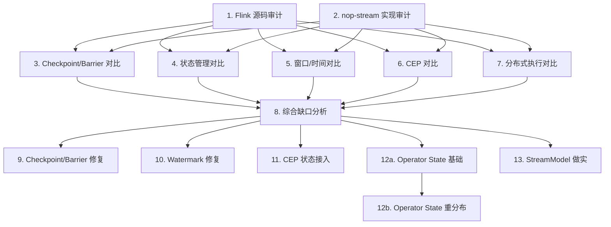

# nop-stream Flink 源码深度对比与完善路线图

> Last updated: 2026-07-24
> Sources: `ai-dev/design/nop-stream/`（全部设计文档）、`~/sources/flink/`（Flink 源码，tag release-1.20.0）、`nop-stream/`（当前实现）、`ai-dev/design/nop-stream/comparison.md`（现有高层对比）、`ai-dev/design/nop-stream/completion-roadmap.md`（现有完善路线图，本路线图的分析阶段产出将与之对齐）

## Purpose

本路线图的目标是把 nop-stream 与 Flink 的**源码级实现**进行逐层、逐组件的系统对比，找出当前 nop-stream 在实现上与 Flink 的差异、缺口、空心实现和静默跳过模式，然后基于对比发现驱动 nop-stream 的实质性改进。

现有 `comparison.md` 是架构设计层的对比，缺少源码级的深入。本路线图从源码出发，覆盖 DataStream API → 图模型 → 算子运行时 → 状态管理 → Checkpoint → 窗口/时间 → CEP → 分布式执行 的完整链路。

**Flink 源码依赖**：本路线图所有对比分析依赖 `~/sources/flink/` 下的 Flink 源码。期望 tag `release-1.20.0`。如不存在：`mkdir -p ~/sources && cd ~/sources && git clone https://github.com/apache/flink.git && cd flink && git checkout release-1.20.0`。

Does not contain implementation details. Each `planned` stage is owned by its execution plan.

## Work Items

> **This is the only dynamic state block. Update status only here.**
> The roadmap is a human-AI alignment artifact: humans set items and their order;
> AI takes the first `todo` item, drafts/executes plans, and writes the item back to `done` when closure audit passes.
>
> 文档审核规则：见 Rules 节。

- 1. Flink 核心源码结构审计（streaming-api、runtime、checkpoint、state、window、CEP 六大包）：`todo`
- 2. nop-stream 现有实现审计（core API、图模型、算子运行时、checkpoint）：`todo`
- 3. Checkpoint & barrier 机制源码级对比分析：`done`
- 4. 状态管理 & 状态后端源码级对比分析：`done`
- 5. 窗口机制 & 时间模型源码级对比分析：`done`
- 6. CEP 引擎源码级对比分析：`todo`
- 7. 分布式执行模型源码级对比分析：`todo`
- 8. 综合缺口分析文档（汇总所有发现、分类、优先级排序）：`todo`
- 9. Checkpoint & barrier 修复（启用 BarrierAligner、修复 findCompletedCheckpointId、接线 abort 通道）：`todo`
- 10. Watermark 集成修复（自动插入 TimestampsAndWatermarksOperator、修复 watermarkInterval）：`todo`
- 11. CEP 状态后端接入（移除 SimpleKeyedStateStore、接线 IKeyedStateBackend）：`todo`
- 12a. Operator State 基础体系（CheckpointedFunction 接口、OperatorStateStore 基本 list state、operator state 快照/恢复）：`todo`
- 12b. Operator State 重分布与完整管线（union/broadcast redistribution、snapshot pipeline 接线、重分布恢复）：`todo`（depends on 12a）
- 13. StreamModel 做实（buildStreamModel 注册 StreamComponents、Fingerprint 真正生效）：`todo`

## Status values

| Status | Meaning |
| --- | --- |
| `todo` | Not started, no plan |
| `planned` | Has execution plan, passed draft review |
| `done` | Complete, passed closure audit |

## Framework / platform reuse

| Capability | Provider | Notes |
| --- | --- | --- |
| 状态持久化 | `ICheckpointStorage` (LocalFile/JDBC) | 已设计，LocalFile 已实现，Jdbc 待接线 |
| 数据序列化 | `JsonTool` | 当前使用，与 Flink 的 TypeSerializer 不同 |
| CEP 条件表达式 | `IEvalFunction` (nop-xlang) | 已使用 |
| 数据库访问 | `IJdbcTemplate` + `IDialect` | 已设计，checkpoint storage 使用 |
| 批量数据源 | `IBatchLoader` / `IBatchConsumer` | 已桥接 |
| 消息队列 | `IMessageService` | 分布式数据面 |
| RPC | `IStreamTaskRpcService` / `IStreamCoordinatorRpcService` | 强类型接口，跨 JVM 待接线 |
| Leader 选举 | `ILeaderElector` / `SysDaoLeaderElector` | 规划，nop-stream 是首个生产用户 |

## Current baseline

**Already shipped:**
- 完整的设计文档体系（vision、architecture、core、graph、checkpoint、state、window、time、connector、CEP）
- DataStream API（map/filter/flatMap/keyBy/window/sink）
- 图模型管线（Transformation → StreamGraph → JobGraph → PartitionedPlan → DeploymentPlan）
- CheckpointCoordinator、BarrierAligner（未启用）、ICheckpointStorage（LocalFile）
- MemoryStateBackend、MemoryKeyedStateBackend
- 窗口四要素（WindowAssigner、Trigger、Evictor、WindowFunction）完整移植
- CEP 引擎（Pattern DSL、NFA、SharedBuffer、CepOperator）
- 分布式运行时框架（JobCoordinator、TaskManager、EmbeddedDistributedExecutor）
- 连接器桥接（BatchLoaderSourceFunction、BatchConsumerSinkFunction、MessageSourceFunction）

**Main gaps (known, not yet closed):**
- [gap] Operator State 体系缺失（completion-roadmap Phase 0.3）
- [gap] CEP 使用 SimpleKeyedStateStore 而非统一状态后端（Phase 0.4）
- [gap] BarrierAligner 已实现未启用（Phase 0.5）
- [gap] Watermark: TimestampsAndWatermarksOperator 未自动插入
- [gap] Watermark: watermarkInterval 硬编码为 0，周期性发射不生效
- [gap] StreamModel 未真正做实（buildStreamModel 未注册完整 StreamComponents）（Phase 0.2）
- [gap] 端到端并行度 > 1 未验证（Phase 0.7）
- [gap] 部分文档描述的层与实际实现不一致（Phase 0.1）
- [gap] nop-stream-cep 的 NFA 状态未参与 checkpoint
- [plan] RocksDB 状态后端缺失（Phase 1）
- [plan] Unaligned checkpoint 缺失（Phase 4）
- [plan] 分布式 RPC 跨 JVM 未接线（Phase 3）

## Stages

| # | Stage | Owner plan | Deps | Critical path | Reuse |
| --- | --- | --- | --- | --- | --- |
| 1 | Flink 核心源码审计 | `01-flink-source-audit` | — | **Yes** | — |
| 2 | nop-stream 实现审计 | `02-nopstream-live-audit` | — | **Yes** | — |
| 3 | Checkpoint/Barrier 源码对比 | `03-checkpoint-comparison` | 1, 2 | **Yes** | existing design docs |
| 4 | 状态管理源码对比 | `04-state-comparison` | 1, 2 | **Yes** | existing design docs |
| 5 | 窗口/时间源码对比 | `05-window-comparison` | 1, 2 | **Yes** | existing design docs |
| 6 | CEP 源码对比 | `06-cep-comparison` | 1, 2 | No | existing design docs |
| 7 | 分布式执行源码对比 | `07-distributed-comparison` | 1, 2 | No | existing design docs |
| 8 | 综合缺口分析文档 | `08-gap-analysis` | 3, 4, 5, 6, 7 | **Yes** | — |
| 9 | Checkpoint & barrier 修复 | `09-checkpoint-fixes` | 8 | **Yes** | — |
| 10 | Watermark 集成修复 | `10-watermark-fixes` | 8 | No | — |
| 11 | CEP 状态后端接入 | `11-cep-state-integration` | 8 | No | — |
| 12a | Operator State 基础 | `12a-operator-state-basic` | 8 | **Yes** | Flink CheckpointedFunction |
| 12b | Operator State 重分布 | `12b-operator-state-redistribution` | 12a | No | Flink redistribution |
| 13 | StreamModel 做实 | `13-streammodel-rectify` | 8 | No | — |

### Stage details

#### 1. Flink 核心源码结构审计

> Status: see Work Items above

**Goal:** 系统审计 Flink 源码的关键包结构、核心类层次、设计模式和执行流程，为后续 nop-stream 逐项对比建立精确的 Flink baseline。

_Deliverables output to:_ `ai-dev/analysis/nop-stream/01-flink-source-audit.md`

**Deliverables:**
- Flink streaming-api 源码映射：DataStream/KeyedStream/WindowedStream、Transformation 体系、TypeInformation
- Flink runtime 执行模型映射：StreamTask/Mailbox、Task 生命周期、InputProcessor、CheckpointedInputGate
- Flink checkpoint 协调器映射：CheckpointCoordinator、PendingCheckpoint、CompletedCheckpointStore
- Flink state 体系映射：StateBackend、KeyedStateBackend、OperatorStateBackend、Key-Group
- Flink 窗口/时间映射：WindowOperator、InternalTimerService、WatermarkStrategy/StatusWatermarkValve
- Flink CEP 映射：NFA/SharedBuffer/CepOperator，验证 nop-stream-cep 的剥离完整性
- Flink 分布式执行映射：ExecutionGraph、Scheduler、Slot/ResourceManager、RPC 抽象

**Out of scope:** Flink Table/SQL API、PyFlink、ML、Gelly 等非流处理核心模块。

**Module / area:** `~/sources/flink/flink-streaming-java/`, `~/sources/flink/flink-runtime/`, `~/sources/flink/flink-core/`, `~/sources/flink/flink-cep/`

#### 2. nop-stream 现有实现审计

> Status: see Work Items above

**Goal:** 以执行审计的视角遍历 nop-stream 所有模块的实际代码，记录当前实现的真实状态、接口完整度、标称实现但实际 no-op 的组件、hollow implementation。

_Deliverables output to:_ `ai-dev/analysis/nop-stream/02-nopstream-live-audit.md`

**Deliverables:**
- nop-stream-core 审计：DataStream API 实现度、Transformation 覆盖度、StreamGraph/JobGraph/PartitionedPlan 状态
- nop-stream-runtime 审计：TaskExecutor/Task 生命周期、RecordWriter/InputChannel/BarrierAligner 实际接线
- nop-stream-cep 审计：CepOperator 状态后端、watermark 集成、NFA state checkpoint
- nop-stream-connector 审计：桥接适配器状态、exactly-once 支持
- Checkpoint 子系统审计：CheckpointCoordinator、PendingCheckpoint、BarrierAligner、EpochManifest 耐用性
- Watermark 子系统审计：TimestampsAndWatermarksOperator（是否插入）、watermarkInterval、多输入合并

**Out of scope:** nop-stream-flow（规划模块，几乎无代码）、nop-stream-fraud-example。

**Module / area:** `nop-stream/nop-stream-core/`, `nop-stream/nop-stream-runtime/`, `nop-stream/nop-stream-cep/`, `nop-stream/nop-stream-connector/`

#### 3. Checkpoint & barrier 机制源码级对比分析

> Status: see Work Items above

**Goal:** 逐行对比 nop-stream 的 checkpoint 子系统与 Flink 对应实现，识别差距、bug、空壳和不一致。

_Deliverables output to:_ `ai-dev/analysis/nop-stream/03-checkpoint-comparison.md`

**Deliverables:**
- Barrier 注入/对齐路径对比（Flink CheckpointBarrierHandler vs nop-stream InputGate 内联 vs BarrierAligner）
- CheckpointCoordinator 协调流程对比（FLIP 触发、pending 管理、ACK 收集、complete 判定、subsume）
- Checkpoint storage 对比（Flink CompletedCheckpointStore vs nop-stream ICheckpointStorage）
- 状态快照路径对比（Flink OperatorSnapshotFutures 异步两阶段 vs nop-stream 同步）
- Exactly-Once 等级实现对比（aligned/unaligned、AT_LEAST_ONCE、EFFECTIVELY_ONCE）
- 故障恢复路径对比（Flink ExecutionGraph restart vs nop-stream globalRecovery）
- abort 控制通道对比（Flink 独立通道 vs nop-stream 现状）
- 结论：差距列表、优先级、修复建议

#### 4. 状态管理 & 状态后端源码级对比分析

> Status: see Work Items above

**Goal:** 对比 nop-stream 状态体系与 Flink 的差异，识别需要对接/修复的缺口。

_Deliverables output to:_ `ai-dev/analysis/nop-stream/04-state-comparison.md`

**Deliverables:**
- keyed state 接口层次对比（Value/List/Map/Reducing/Aggregating）
- Operator State 体系对比（Flink CheckpointedFunction/OperatorStateStore vs nop-stream 缺失）
- 状态后端架构对比（Flink StateBackend 两层 vs nop-stream IStateBackend 三层）
- Key-Group vs StateShard 深入对比：优劣、适用场景、迁移路径
- 状态序列化/反序列化对比（Flink TypeSerializerSnapshot 兼容性 vs nop-stream SerializerFingerprint）
- State TTL 实现对比
- 结论：差距列表、优先级、修复建议

#### 5. 窗口机制 & 时间模型源码级对比分析

> Status: see Work Items above

**Goal:** 对比 nop-stream 窗口/时间模型与 Flink 的实现层面差异。

_Deliverables output to:_ `ai-dev/analysis/nop-stream/05-window-comparison.md`

**Deliverables:**
- WindowOperator 执行路径对比（窗口分配、状态操作、trigger 触发、emit、purging）
- MergingWindowSet/合并窗口对比（SessionWindow、MergingWindowAssigner 路径）
- Pane 语义对比（early/on-time/late firing、PaneState）
- InternalTimerService 对比（timer 注册/触发/checkpoint/恢复）
- Watermark 生成与传播对比（策略接口、单输入/多输入对齐、空闲检测）
- Watermark 自动插入机制对比（Flink 的 autoWatermarkInterval + onPeriodicEmit vs nop-stream 未生效）
- 结论：差距列表、优先级、修复建议

#### 6. CEP 引擎源码级对比分析

> Status: see Work Items above

**Goal:** 验证 nop-stream-cep 与 Flink CEP 的源码一致性，找出剥离过程中引入的差异和退化。

_Deliverables output to:_ `ai-dev/analysis/nop-stream/06-cep-comparison.md`

**Deliverables:**
- NFA 编译/执行路径对比（NFACompiler、NFAState、状态转换）
- SharedBuffer 实现对比（Dewey 编号、引用计数、TElement/TCompletion 管理）
- CepOperator 对比（Flink 的 KeyedStateBackend 集成 vs nop-stream 的 SimpleKeyedStateStore）
- 事件时间超时处理对比（within + timer vs nop-stream 的 Long.MIN_VALUE）
- 匹配后策略对比（AfterMatchSkipStrategy 实现完整性）
- 声明式模型对比（nop-stream 独有的 CepPatternModel，对比 Flink API 等价性）
- 结论：差距列表、优先级、修复建议

#### 7. 分布式执行模型源码级对比分析

> Status: see Work Items above

**Goal:** 对比 nop-stream 分布式运行时与 Flink 的架构差异，评估 nop-stream 三面分离设计的完备性。

_Deliverables output to:_ `ai-dev/analysis/nop-stream/07-distributed-comparison.md`

**Deliverables:**
- 执行图层次对比（Flink ExecutionGraph 调度状态机 vs nop-stream PartitionedPlan/DeploymentPlan）
- Task 生命周期对比（Flink StreamTask Mailbox vs nop-stream Task/SubtaskTask run-loop）
- 调度模型对比（Flink SchedulerNG + Slot 分配 vs nop-stream IStreamExecutionDispatcher）
- RPC 抽象对比（Flink Akka/RpcGateway vs nop-stream IStreamTaskRpcService）
- 数据交换对比（Flink Netty NetworkBufferPool vs nop-stream ResultPartition/InputChannel）
- 集群管理对比（Flink ResourceManager/JobManager HA vs nop-stream ClusterRegistry + 规划 ILeaderElector）
- 结论：差距列表、优先级、修复建议

#### 8. 综合缺口分析文档

> Status: see Work Items above

**Goal:** 汇总 3-7 的全部发现，形成带优先级排列的完整缺口清单和修复路线图。

_Deliverables output to:_ `ai-dev/analysis/nop-stream/08-gap-analysis.md`

**Deliverables:**
- 所有对比发现的汇总表（分类：Bug/缺口/改进/Hollow/No-Op/Doc）
- 优先级排序（P0: correctness blocking, P1: design contract violation, P2: missing capability, P3: optimization）
- 修复建议与计划的映射（明确每个修复归属于哪个 plan）
- 与 `completion-roadmap.md` 的交叉引用和对齐
- 文档更新清单（哪些 owner-doc 需要更新）
- 对比过程中发现的新设计决策点（需要人确认的）
- 对 `completion-roadmap.md` 的阶段划分是否需要调整的建议

#### 9. Checkpoint & barrier 修复

> Status: see Work Items above

**Goal:** 基于对比分析发现，修复 nop-stream checkpoint 子系统中的已知缺口和空壳实现。

**Deliverables:**
- 启用 BarrierAligner，替换 InputGate 内联对齐逻辑
- 修复 findCompletedCheckpointId 的 O(输入数×待完成数) 复杂度
- 接线 abort 控制通道（local 路径：直接方法调用；distributed 路径复用 IStreamTaskRpcService）
- 统一 Task 与 Invokable 的 OperatorChain 生命周期管理
- 清理 GraphModelCheckpointExecutor 代码重复
- 对应的单元测试和端到端验证

**Out of scope:** unaligned checkpoint（属于后续阶段）、Coordinator HA（Phase 3）

**Module / area:** `nop-stream/nop-stream-core/checkpoint/`, `nop-stream/nop-stream-runtime/checkpoint/`

#### 10. Watermark 集成修复

> Status: see Work Items above

**Goal:** 修复 watermark 管线中的空壳和未接线部分，使事件时间语义完整可用。

**Deliverables:**
- TimestampsAndWatermarksOperator 自动插入图模型管线
- 修复 watermarkInterval 硬编码为 0 的问题，使周期性发射生效
- 多输入 watermark 合并接入执行路径
- 空闲检测（withIdleness）接线
- 对应的单元测试和端到端验证

**Out of scope:** 并行源 watermark 对齐（WatermarkAlignment group + coordinator 支持）

**Module / area:** `nop-stream/nop-stream-core/time/`, `nop-stream/nop-stream-core/datastream/`, `nop-stream/nop-stream-runtime/watermark/`

#### 11. CEP 状态后端接入

> Status: see Work Items above

**Goal:** 移除 CepOperator 自建的 SimpleKeyedStateStore，改用统一 IKeyedStateBackend，使 CEP 状态参与 checkpoint/恢复。

**Deliverables:**
- CepOperator 改用标准 IKeyedStateBackend 存储 NFA state、shared buffer、computation state
- CEP 状态参与 checkpoint（snapshotState + restoreState）
- 与现有 CepPatternModel 和 NFA 的集成
- CEP checkpoint/恢复端到端测试

**Out of scope:** CEP watermark 集成修复（currentWatermark() 返回 Long.MIN_VALUE 的问题在对比分析后可能属于本项，由 analysis 决定）

**Module / area:** `nop-stream/nop-stream-cep/`

#### 12a. Operator State 基础体系

> Status: see Work Items above

**Goal:** 实现 nop-stream 的 Operator State 基础体系，为 source exactly-once 提供语义基础。

**Deliverables:**
- CheckpointedFunction 接口（snapshotState + initializeState）
- OperatorStateStore 基本实现（list state only）
- OperatorStateDescriptor 类型体系
- operator state 快照与恢复管线
- 对应的单元测试

**Out of scope:** union/broadcast redistribution（属于 12b）、与具体 connector 的集成

**Module / area:** `nop-stream/nop-stream-core/state/`, `nop-stream/nop-stream-core/checkpoint/`

#### 12b. Operator State 重分布与完整管线

> Status: see Work Items above

**Goal:** 补齐 Operator State 的重分布模式和完整集成。

**Deliverables:**
- UNION 全量广播重分布模式
- BROADCAST 全量重分布模式
- SPLIT_DISTRIBUTE round-robin 重分布
- 重分布恢复逻辑（parallelism 变化时正确重新分配）
- 与 source connector（BatchLoaderSourceFunction、MessageSourceFunction）的集成
- 端到端测试：source offset checkpoint → kill → 恢复不丢不重

**Out of scope:** RocksDB 后端承载 operator state（属于 Phase 1）

**Module / area:** `nop-stream/nop-stream-core/state/`, `nop-stream/nop-stream-connector/`

#### 13. StreamModel 做实

> Status: see Work Items above

**Goal:** 使 StreamModel 真正成为系统唯一的 canonical 模型，buildStreamModel 注册完整 StreamComponents，fingerprint 在编译期生效。

**Deliverables:**
- buildStreamModel() 注册 transforms/streams/windowingStrategies/requirements/checkpointParticipants
- StreamModelFingerprint 在编译期真正拒绝不兼容的 requirements 组合
- 基于 fingerprint 的校验逻辑接线
- 文档更新（README、01-architecture-baseline.md 等），确保描述与实现在基一致
- 对应的单元测试

**Out of scope:** XDSL 声明式入口（属于 Phase 5）、Delta 定制（属于 Phase 5）

**Module / area:** `nop-stream/nop-stream-core/model/`, `nop-stream/nop-stream-core/datastream/`

## Dependency graph

## Cross-cutting concerns

| Concern | Notes |
| --- | --- |
| 对比深度 | 源码级（精确到类名、方法签名、代码行）而非文档级，每个发现须附带代码引用 |
| 避免重复造轮 | Flink 中大量代码直接剥离复制到 nop-stream-cep，对比时要区分"有意修改"与"剥离退化" |
| Verification baseline | 代码变更后 `mvn test -pl nop-stream/nop-stream-core -am && mvn test -pl nop-stream/nop-stream-cep -am && mvn test -pl nop-stream/nop-stream-runtime -am` 必须通过；纯分析阶段（1-8）不要求构建验证 |
| 空壳检测 | 每个实现 plan 9-13 必须包含 Anti-Hollow 检查 |
| Owner-doc 同步 | analysis 和 design 文档必须保持与 live repo 一致，发现不一致立即修复 |
| 与 completion-roadmap.md 的关系 | 本路线图的分析发现应对齐到 `completion-roadmap.md` 的阶段划分。若分析发现与 completion-roadmap 不一致，作为第 8 阶段的一项输出提出调整建议，不在本路线图中直接覆盖 |
| Flink 版本 | 所有对比基于 `release-1.20.0`，除非特定功能在此版本之后有重大变更 |

## Rules

- This file is a state index and coarse decomposition, not an execution plan.
- Each `planned` stage is owned by its execution plan.
- Status changes happen only in the Work Items block at the top.
- **Document review rule**: any doc created or modified under this roadmap must go through independent sub-agent iterative review (different task_id each round, must reach consensus with no Blocker remaining). This rule applies to the roadmap itself, all analysis docs, execution plans, and design docs created/modified as part of this mission.
- Analysis artifacts output to `ai-dev/analysis/nop-stream/` with naming pattern `NN-<topic>.md` (per deliverable paths specified in each stage detail section).
