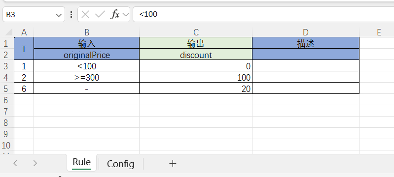

# 逻辑编排引擎NopTaskFlow与SolonFlow的设计对比

solon-flow 是国产开源开发框架solon内置的一个基础级的流处理引擎，可用于业务规则、决策处理、计算编排、流程审批等多种场景（这里的流处理指的应该是工作流或者业务流处理）。solon-flow的设计非常轻量级，目前已经实现的功能比较简单。它的设计与Nop平台内置的逻辑编排引擎NopTaskFlow有一定的相似之处，这为我们提供了一个对比分析的机会。通过对比可以清晰地看到 Nop 平台与传统开发平台之间的本质区别，即底层平台如何自动提供通用的可扩展设计。

Nop平台基于可逆计算理论，构建了一整套通用的基础技术设施，这意味着在开发任何引擎（如ORM引擎、规则引擎、流程编排引擎）时，无需为每个引擎单独设计可扩展机制，而是可以直接复用这套通用的可扩展设计**及其实现**。这大大提高了开发效率，降低了开发成本，使得在 Nop 平台上开发的引擎能够更加灵活地进行功能扩展和定制。

## 一. 简单示例：订单打折规则

> 示例来源于[drools 规则引擎和 solon-flow 哪个好？ solon-flow 简明教程](https://zhuanlan.zhihu.com/p/20299193626)

solon提供的简明教程中提供了一个使用solon-flow实现订单打折规则的演示。

首先定义实体类BookOrder

```java
@DataBean
public class Order {
    private Double originalPrice;//订单原始价格，即优惠前价格
    private Double realPrice;//订单真实价格，即优惠后价格
}
```

第二，定义一个yaml格式的流程模型文件`bookDiscount.yaml`

```yaml
id: "book_discount"
nodes:
  - type: "start"
  - id: "book_discount_1"
    when: "order.getOriginalPrice() < 100"
    task: |
      order.setRealPrice(order.getOriginalPrice());
      System.out.println("没有优惠");
  - id: "book_discount_4"
    when: "order.getOriginalPrice() >= 300"
    task: |
      order.setRealPrice(order.getOriginalPrice() - 100);
      System.out.println("优惠100元");
  - id: "book_discount_2"
    when: "order.getOriginalPrice() < 200 && order.getOriginalPrice() > 100"
    task: |
      order.setRealPrice(order.getOriginalPrice() - 20);
      System.out.println("优惠20元");
  - type: "end"
```

然后通过如下方式调用流程模型

```javascript
 @Test
 public void testDiscount()
    FlowEngine flowEngine = FlowEngine.newInstance();
    flowEngine.load(Chain.parseByUri("classpath:flow/bookDiscount.yml"));

    BookOrder bookOrder = new BookOrder();
    bookOrder.setOriginalPrice(500);

    ChainContext ctx = new ChainContext();
    ctx.put("order", bookOrder);

    flowEngine.eval("book_discount", ctx);

    //价格变了，省了100块
    assert bookOrder.getRealPrice() == 400;
}
```

**NopTaskFlow的核心（nop-task-core模块）虽然只有3000行左右的代码，但是它是一个非常完整的逻辑编排引擎，支持异步处理、超时重试、断点重提等高级功能**，所以用NopTaskFlow可以很容易的实现solon-flow所演示的功能。

```yaml
version: 1
steps:
  - type: xpl
    name: book_discount_1
    when: "order.getOriginalPrice() < 100"
    source: |
      order.setRealPrice(order.getOriginalPrice());
      logInfo("没有优惠");
  - type: xpl
    name: book_discount_4
    when: "order.getOriginalPrice() >= 300"
    source: |
      order.setRealPrice(order.getOriginalPrice() - 100);
      logInfo("优惠100元");
  - type: xpl
    name: book_discount_2
    when: "order.getOriginalPrice() >= 100 && order.getOriginalPrice() < 200"
    source: |
      order.setRealPrice(order.getOriginalPrice() - 20);
      logInfo("优惠20元");
outputs:
  - name: realPrice
    source: order.realPrice
```

除了属性名的差异之外，整个流程定义基本与solon-flow完全一致。

| 特性          | Solon-Flow                                                                  | NopTaskFlow                                                                     |
| ----------- | --------------------------------------------------------------------------- | ------------------------------------------------------------------------------- |
| **整体结构**    | 使用 `id` 和 `nodes` 定义流程，节点通过 `id` 和 `type` 区分。                               | 使用 `version` 和 `steps` 定义流程，步骤通过 `type` 和 `name` 区分。                            |
| **起始/结束节点** | 通过 `type: "start"` 和 `type: "end"` 明确标识流程的开始和结束。                            | 缺省按照顺序执行steps中的步骤，也可以设置图模式，此时需要显式指定下一个执行步骤。                                     |
| **步骤定义**    | 每个步骤通过 `id` 和 `when` 条件定义，任务通过 `task` 字段指定。                                 | 每个步骤通过 `type` 和 `name` 定义，任务通过 `source` 字段指定。                                   |
| **条件判断**    | 使用 `when` 字段定义条件，如 `order.getOriginalPrice() < 100`。                        | 使用 `when` 字段定义条件，如 `order.getOriginalPrice() < 100`。                            |
| **任务执行**    | 任务通过 `task` 字段定义，直接包含代码块，如 `order.setRealPrice(order.getOriginalPrice());`。 | 任务通过 `source` 字段定义，直接包含代码块，如 `order.setRealPrice(order.getOriginalPrice());`。   |
| **输出结果**    | 没有明确的输出结果定义，结果通过任务代码中的操作（如 `order.setRealPrice`）间接返回。                       | 通过 `outputs` 字段明确定义输出结果，如 `outputs: - name: realPrice source: order.realPrice`。 |

NopTaskFlow的调用方式与solon-flow也非常相似：

```javascript
@Test
public void testDiscount01ForYaml() {
  ITask task = taskFlowManager.loadTaskFromPath("/nop/demo/task/discount-01.task.yaml");
  ITaskRuntime taskRt = taskFlowManager.newTaskRuntime(task, false, null);

  BookOrder bookOrder = new BookOrder();
  bookOrder.setOriginalPrice(500.0);

  taskRt.setInput("order", bookOrder);

  Map<String, Object> outputs = task.execute(taskRt).syncGetOutputs();
  assertEquals(400.0, outputs.get("realPrice"));

  assertEquals(400.0, bookOrder.getRealPrice());
}
```

| 特性           | Solon-Flow                                                 | NopTaskFlow                                       |
| ------------ | ---------------------------------------------------------- | ------------------------------------------------- |
| **任务引擎加载方式** | 使用 `flowEngine.load(Chain.parseByUri)`  方法加载流程模型文件。        | 使用 `taskFlowManager.loadTaskFromPath` 方法加载流程模型文件。 |
| **任务加载路径**   | classpath下的文件或者操作系统目录下的文件`classpath:flow/bookDiscount.yml` | 虚拟文件系统中的路径`/nop/demo/task/discount-01.task.yaml`  |
| **上下文设置方式**  | 使用 `ChainContext.put` 设置上下文变量。                             | 使用 `ITaskRuntime.setInput` 设置输入参数。                |
| **任务执行方式**   | 使用 `flowEngine.eval` 方法执行任务。                               | 使用 `task.execute` 方法执行任务。                         |
| **任务执行**     | 同步执行，通过对象属性来返回结果                                           | 支持异步执行。任务会返回outputs结果变量集合，当然也可以通过对象属性来返回结果        |

## 二. NopTaskFlow内置的可扩展能力

NopTaskFlow非常强大，自动支持异步实行、支持图模式和堆栈模式等多种执行模式，并支持非常精细的变量作用域控制。详细介绍参见[从零开始编写的下一代逻辑编排引擎 NopTaskFlow](https://mp.weixin.qq.com/s/2mFC0nQon_l2M82tOlJVhg)。任何用到函数的地方都可以替换为使用NopTaskFlow，比如后台服务函数可以直接调用NopTaskFlow来实现，而不需要在Java中编码。参见[通过NopTaskFlow逻辑编排实现后台服务函数](https://mp.weixin.qq.com/s/CMBcV9Riehlf4_Ds_BmyEw)。

除了上述的领域特定设计（比如事务、异步、状态恢复等）之外，NopTaskFlow还从Nop平台自动继承了XLang语言所自带的一系列可扩展机制。

### 2.1 统一模型加载器

solon-flow的示例演示了从classpath加载模型文件，而NopTaskFlow使用Nop平台统一提供的ResourceComponentManager.loadComponentModel来加载模型文件，它自动识别虚拟文件路径，具体虚拟文件的实际保存位置可以是classpath，也可以是操作系统中的某个目录，或者是数据库中的一张模型表。而且模型加载过程会自动缓存解析结果，并自动跟踪模型文件的依赖关系。比如说`a.task.xml`用到了xpl标签库`batch.xlib`，则当`batch.xlib`被修改的时候，`a.task.xml`对应的模型缓存会自动失效。

虚拟文件系统的能力可以被其他DSL所共享，比如ORM模型文件同样基于这一机制加载，假如我们为虚拟文件系统增加了一个Redis存储支持，则ORM模型和NopTaskFlow模型都会立刻获得相关支持。而solon-flow的做法中并不能在多个DSL模型之间共享这种底层机制。

### 2.2 Delta定制

Nop平台中由统一模型加载器所管理的DSL模型都自动支持Delta定制。当我们需要修改模型内容时，并不需要直接修改原有的模型文件，而是可以在`_delta`目录下增加一个同名的模型文件，则会覆盖原有模型文件，优先加载delta目录下的文件。在定制文件中可以通过`x:extends='super'`来表示继承已有的模型文件。

Delta定制类似于Docker中的分层文件系统，上层的文件会自动覆盖下层同名的文件。只是通过XLang语言中的`x:extends`语法，Nop平台中的模型文件可以实现两个模型文件的内部结构的合并，而不是如Docker那样只能按照文件名整体进行覆盖。

详细介绍参见[如何在不修改基础产品源码的情况下实现定制化开发](https://mp.weixin.qq.com/s/JopDTYBIw0_Pmp0ZsTuMpA)

### 2.3 Delta合并

Nop平台的所有DSL模型都支持`x:extends`和`x:gen-extends`语法，可以用它来实现复杂模型的分解与合并。比如

```yaml
x:extends: "base.task.xml"
x:gen-extends: |
   <task-gen:GenAppWorkflow bizObjName="XXX"/>

steps:
   - type: step
     name: step2
     x:override: remove
```

`x:extends`可以用于表示继承已有的模型文件，可以通过逗号分隔表示多个基础文件，然后会按照从前到后的顺序依次进行合并。

可以通过`x:gen-extends`和`x:post-extends`执行编译期的代码生成逻辑，动态生成用于继承的基础模型。

在合并的过程中，可以通过`x:override`来控制具体节点的合并逻辑，比如`x:override: remove`表示删除该节点。通过这种方式可以引入删除语义和逆元的概念。

详细介绍参见 [XDSL：通用的领域特定语言设计](https://mp.weixin.qq.com/s/usInt7_odzvFzuiIUPw4iQ)

### 2.4 多重表象

可逆计算理论强调同一个信息可以具有多种表达形式(Representaion)，这些表达形式因为信息等价，所以可以自由的进行可逆转换。比如说，所谓的可视化设计可以看作是DSL模型的一种可视化展现形式，而DSL代码文本是模型信息的文本表达形式。之所以能够进行可视化设计，原因就在于可视化表象和文本表象之间可以相互转换。

```
可视化表象 = Designer(文本表象),   文本表象 = Serializer(可视化表象)
```

利用Nop平台内置的机制和可逆性的可复合性，从字段级别的多重表象可以自动推导得到对象级别的多重表象，从而自动实现模型对象的可视化编辑。比如说，对于solon-flow而言，如果要开发一个可视化设计器，需要专门针对solon-flow的语法去设计并实现这个设计器，但是在Nop平台中，我们可以根据元模型定义自动生成一个专用于逻辑编排的可视化设计器，并不需要针对逻辑编排引擎去编写设计器。

作为一个简单的示例，Nop平台中的所有模型都自动支持XML和YAML等多种语法表示形式，可以使用多种形式来表示同一个业务逻辑。

```xml
<task version="1" x:schema="/nop/schema/task/task.xdef" xmlns:x="/nop/schema/xdsl.xdef">
    <steps>
        <xpl name="book_discount_1">
            <when><![CDATA[
                order.getOriginalPrice() < 100
            ]]></when>
            <source>
                order.setRealPrice(order.getOriginalPrice());
                logInfo("没有优惠");
            </source>
        </xpl>

        <xpl name="book_discount_4">
            <when><![CDATA[
                order.getOriginalPrice() >= 300
            ]]></when>
            <source>
                order.setRealPrice(order.getOriginalPrice() - 100);
                logInfo("优惠100元");
            </source>
        </xpl>

        <xpl name="book_discount_2">
            <when><![CDATA[
               order.getOriginalPrice() >= 100 && order.getOriginalPrice() < 200
            ]]></when>
            <source>
                order.setRealPrice(order.getOriginalPrice() - 20);
                logInfo("优惠20元");
            </source>
        </xpl>
    </steps>

    <output name="realPrice">
        <source>order.realPrice</source>
    </output>
</task>
```

这里的XML表达的信息与上一节中YAML格式所表达的信息完全相同。

在Nop平台中，另外一个自动存在的表象形式是Excel。对于任意的DSL模型，无需编写Excel解析和生成代码，就可以通过Excel来配置复杂的领域模型对象。比如ORM模型和API模型一般都通过Excel来管理，而不是通过`orm.xml`和`api.xml`模型文件来管理。根据Excel模型可以自动转换得到对应的XML模型文件。

## 三. 规则模型

除了NopTaskFlow逻辑编排之外，Nop平台还提供了一个专门描述复杂判断逻辑的规则模型(NopRule)，可以用它来描述决策表或者决策树。与NopTaskFlow的区别在于，NopRule专注于逻辑判断，通过树结构和矩阵结构可以复用判断条件，从而简化配置，优化性能。比如对于决策树而言，在上层节点判断过之后，在下层节点就不需要重复判断了。另外规则模型还引入了加权平均等概念，可以直接映射到业务层面的计分卡等管理工具，比直接使用逻辑编排要简单。

使用NopRule来配置同样的折扣规则:

```xml
<rule ruleVersion="1" x:schema="/nop/schema/rule.xdef" xmlns:x="/nop/schema/xdsl.xdef">
    <input name="order" mandatory="true"/>
    <output name="discount" mandatory="true" type="Double"/>

    <decisionTree>
        <children>
            <child id="discount-1" label="价格小于100">
                <predicate>
                    <lt name="order.originalPrice" value="100" />
                </predicate>
                <output name="discount">
                    <valueExpr>0</valueExpr>
                </output>
            </child>

            <child id="discount-4" label="价格大于300">
                <predicate>
                    <ge name="order.originalPrice" value="300" />
                </predicate>

                <output name="discount">
                    <valueExpr>100</valueExpr>
                </output>
            </child>

            <child id="discount-2">
                <output name="discount">
                    <valueExpr>20</valueExpr>
                </output>
            </child>
        </children>
    </decisionTree>
</rule>
```

除了XML格式之外，我们还可以使用Excel格式来配置决策表和决策树


在Nop平台中，我们还可以将Excel模型导入到数据库中，通过Web页面来在线编辑、调整规则，并可以在线调试。

关于NopRule的详细介绍，参见[采用Excel作为可视化设计器的开源规则引擎 NopRule](https://mp.weixin.qq.com/s/zJvovUG2f4mjB5CbrlX6RA)

## 四. 模型嵌套

Nop平台与所有其他平台、框架的一个本质性区别在于，它并不是孤立的去研发某个底层引擎，而是一次性抽象完成所有引擎的底层技术架构，所有的引擎都共享同样的XLang语言和可逆计算支持。使用XLang定义的DSL语言不需要自己去考虑扩展性问题（也不用设计相关语法），而且也不需要考虑多个DSL如何无缝集成在一起使用的问题。

前面介绍了NopTaskFlow和NopRule这两个DSL模型，通过xpl模板语言，我们只需要实现一个xpl标签函数（类似Vue组件），就可以将两种DSL模型无缝集成在一起使用。

```xml
<task version="1" x:schema="/nop/schema/task/task.xdef" xmlns:x="/nop/schema/xdsl.xdef"
      xmlns:rule="rule" xmlns:xpl="xpl" xmlns:c="c">
    <steps>
        <xpl name="calcDiscount">
            <source>
               <rule:Execute ruleModelPath="/nop/demo/rule/discount.rule.xlsx"
                             inputs="${{order}}" xpl:return="outputs"
                             xpl:lib="/nop/rule/xlib/rule.xlib" />
               <c:script>
                    order.setRealPrice(order.originalPrice - outputs.discount);
               </c:script>
            </source>
        </xpl>
    </steps>

    <output name="realPrice">
        <source>order.realPrice</source>
    </output>
</task>
```

在上面的示例中，我们通过`<rule:Execute>`标签函数调用`discount.rule.xlsx`这个规则模型来计算折扣，返回结果保存在outputs变量中。通过这种方式，我们就可以在Excel中维护业务规则，在业务代码中直接调用Excel格式的业务规则。

`rule.xlib`的实现也非常简单

```xml
<lib x:schema="/nop/schema/xlib.xdef" xmlns:x="/nop/schema/xdsl.xdef" xmlns:c="c" xmlns:xpl="xpl"
>

    <tags>

        <Execute>
            <attr name="ruleModelPath" stdDomain="v-path" optional="true" />
            <attr name="ruleName" type="String" optional="true"/>
            <attr name="ruleVersion" type="Long" optional="true"/>
            <attr name="inputs" type="Map" optional="true" />

            <attr name="svcCtx" type="io.nop.core.context.IServiceContext" implicit="true" optional="true"/>

            <source><![CDATA[
                const ruleManager = inject('nopRuleManager');
                const rule = ruleModelPath? ruleManager.loadRuleFromPath(ruleModelPath) :
                            ruleManager.getRule(ruleName,ruleVersion);

                const ruleRt = ruleManager.newRuleRuntime(svcCtx, $scope);
                if(inputs != null){
                    ruleRt.setInputs(inputs);
                }
                return rule.executeForOutputs(ruleRt);
            ]]></source>
        </Execute>

    </tags>
</lib>
```

可以直接指定ruleModelPath，也可以指定ruleName和ruleVersion，然后动态确定规则模型对象（从虚拟文件内系统中加载，没有找到则尝试在数据库中加载）。

Nop平台并不只是提供单一功能的DSL，而是一系列DSL组成的所谓DSL森林。关于DSL森林的详细介绍，可以参见[Nop如何克服DSL只能应用于特定领域的限制?](https://mp.weixin.qq.com/s/6TOVbqHFmiFIqoXxQrRkYg),
更详细的示例参见[为什么SpringBatch是一个糟糕的设计？](https://mp.weixin.qq.com/s/1F2Mkz99ihiw3_juYXrTFw)。


基于可逆计算理论设计的低代码平台NopPlatform已开源：

- gitee: [canonical-entropy/nop-entropy](https://gitee.com/canonical-entropy/nop-entropy)
- github: [entropy-cloud/nop-entropy](https://github.com/entropy-cloud/nop-entropy)
- gitcode:[canonical-entropy/nop-entropy](https://gitcode.com/canonical-entropy/nop-entropy)
- 开发示例：[docs/tutorial/tutorial.md](https://gitee.com/canonical-entropy/nop-entropy/blob/master/docs/tutorial/tutorial.md)
- [可逆计算原理和Nop平台介绍及答疑\_哔哩哔哩\_bilibili](https://www.bilibili.com/video/BV14u411T715/)
- 官网国际站: [https://nop-platform.github.io/](https://nop-platform.github.io/)
- 网友Crazydan Studio建立的Nop开发实践分享网站: [https://nop.crazydan.io/](https://nop.crazydan.io/)

