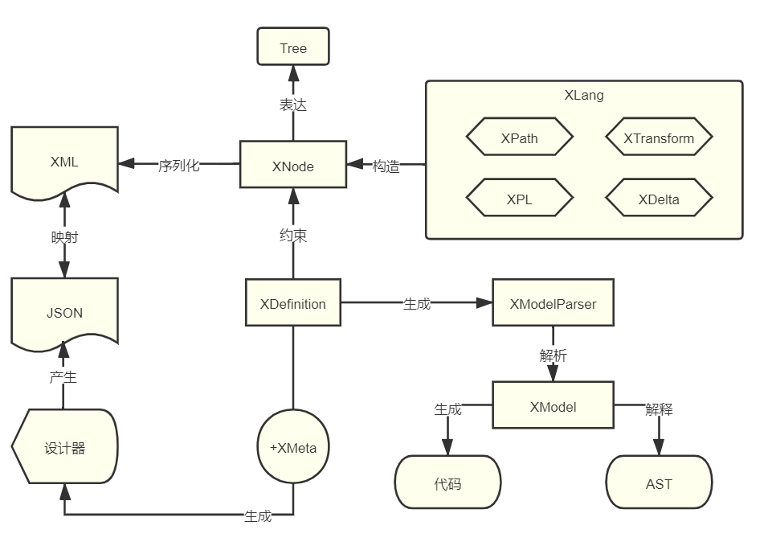

# Nop平台与SpringCloud的功能对比

Nop平台是根据可逆计算原理从零开始设计并实现的新一代的低代码平台，它的目标并不是针对少数固化的场景提供预置的开发脚手架和可视化设计工具，
而是打破描述式编程和传统命令式编程之间人为制造的藩篱，建立两者无缝相容的一种新的编程范式。不断扩大描述式编程所覆盖的语义空间。为了以最低的技术成本达到这一目标，
Nop平台没有采用目前业内主流的基础开源框架，而是选择了基于可逆计算原理重塑整个技术体系。本文将简单列举一下Nop平台所造的轮子，并与SpringCloud技术体系中现有的轮子做个对比。

|轮子|Nop体系|Spring体系|
|---|---|---|
|Web框架|NopGraphQL|SpringMVC|
|表达式引擎|XLang XScript|SpringEL|
|模板引擎|XLang Xpl|Velocity/Freemarker|
|ORM引擎|NopORM|JPA/Mybatis|
|IoC容器|NopIoC|SpringIoC|
|动态配置|NopConfig|SpringConfig|
|分布式事务|NopTcc|Alibaba Seata|
|自动化测试|NopAutoTest|SpringBootTest|
|分布式RPC|NopRPC|Feign RPC|
|报表引擎|NopReport|JasperReport|
|规则引擎|NopRule|Drools|
|批处理引擎|NopBatch|SpringBatch|
|工作流引擎|NopWorkflow|Flowable/BPM|
|任务调度|NopJob|Quartz|
|XML/JSON解析|NopCore|Jaxb/Jackson|
|资源抽象|NopResource|Spring Resource|
|代码生成器|NopCodeGen|各类自制生成器|
|IDE插件|NopIdeaPlugin|Mybatis插件/Spring插件等|

Nop平台可以直接作为类似SpringCloud的基础开发框架来使用，在ProCode层面也可以极大简化软件开发过程，并明显提升软件的可扩展性。

## 一. IoC容器

声明式的IoC容器是Spring发家时的基本技能。但是自从Spring2.0版本之后，SpringIoC就逐渐失去了它的声明式特性，导致现在它的执行掺杂了大量命令式逻辑，典型的体现就是：**改变Spring中包扫描的顺序会以微妙的方式改变bean装配的结果**。

NopIoC是在Spring1.0的装配语法的基础上补充了类似SpringBoot的条件装配逻辑，最终运行时完全归约为Spring1.0的语法来执行。**beans文件的装载顺序以及bean的声明顺序不会影响到最终装配的结果**。

```xml
@ConditionOnMissingBean
@ConditionOnProperty("test.my-bean.enabled")
@Component
public class MyBean{
    @Inject
    OtherBean other;
}
```

对应于NopIoC的如下配置

```xml
<bean id="myBean" ioc:default="true" class="test.MyBean">
  <ioc:condition>
     <if-property name="test.my-bean.enabled" />
  </ioc:condition>
</bean>
```

NopIoC支持`@Inject`,`@PostConstruct`,` @PreDestroy`等规范化注解，也兼容Spring特有的`@Autowired`注解。但是它不使用包扫描来发现bean的定义，而是要求在beans.xml文件中声明bean。

因为Nop平台大量使用模型驱动来动态生成代码，所以大量bean的定义会自动被生成到配置文件中，需要手工编写的配置内容其实很少。另外自己也可以写一个扩展扫描函数，利用NopIoC的元编程机制来动态生成bean的定义。例如

```xml
<beans>
   <x:gen-extends>
      <ioc-gen:scan packages="test.my,test.other" />
   </x:gen-extends>
</beans>
```

### Bean的定制

NopIoC的独特之处在于**可以通过标准的Delta定制来实现对装配逻辑的定制**，例如可以通过如下代码**删除已有的bean的定义**。

```xml
<beans x:extends="super">
    <bean id="dataSource" x:override="remove" />
</beans>
```

### 动态配置

NopIoC的设计中包含了与NopConfig配置中心的一体化设计。在beans.xml配置中可以通过特殊的前缀表示动态配置项：

```xml
<bean id="xx">
   <property name="poolSize" value="@r-cfg:my.pool-size|5" />
</bean>
```

`@r-cfg:`前缀表示是动态配置项，当配置中心更改配置时会自动更新bean的属性。

另外在beans语法中还定义专门的ioc:config节点

```xml
  <ioc:config id="nopOrmGlobalCacheConfig" class="io.nop.commons.cache.CacheConfig"
    ioc:config-prefix="nop.orm.global-cache"  ioc:default="true"/>
```

NopIoC容器会自动跟踪所有对于`ioc:config`的引用，一旦配置发生变化，会自动触发那些使用config的bean上所定义的refresh-config方法。

ioc:config-prefix的作用类似于Spring中`@ConfigurationProperties`，用于指定配置项在配置文件中所对应的前缀。

### 与SpringIoC的互操作

NopIoC与Spring容器可以同时使用，一般情况下NopIoC会在SpringIoC初始化之后再启动，它可以通过parentContainer拿到Spring容器所管理的bean。所以在NopIoC中可以通过`@Inject`直接注入Spring所管理的bean，而在Spring所管理的bean中，可以使用beanContainer来按照名称或者类型获取NopIoC所管理的bean。

```java
BeanContainer.intance().getBean(beanName)
BeanContainer.intance().getBeanByType(beanType)
```

NopIoC的设计目标是成为一个更好的SpringIoC，它坚持了严格的声明式设计，可以集成到Spring生态中使用，全部代码不超过5000行。更详细的设计可以参见文章： [如果重写SpringBoot，我们会做哪些不同的选择？](https://zhuanlan.zhihu.com/p/579847124)

## 二. Web框架

在SpringCloud的技术体系中，我们一般是在Controller中调用Service来完成具体业务逻辑，而在Controller中会处理一些对象结构转换或者组合的工作，例如将实体对象转换为DTO对象等。为了实现GraphQL服务接口，我们需要使用graphql-java包重新编写接口层代码，并不能直接复用Controller对外提供服务。

NopGraphQL引擎极大简化了服务接口层的设计，一般情况下我们**可以直接把领域模型对象暴露为对外服务接口，通过元数据层实现权限管控和结构适配，而无需通过Controller层实现适配转换**。

例如，即使对于最简单的Web服务，我们也需要指定url模式，指定参数传递方式（是通过param传递，还是通过path传递，或者是通过body传递）。很多时候还会在无意中引入对HttpServlet接口的依赖，导致整个服务与具体的Web运行时环境绑定。

```java
@RestController
public class MyController{
    @PostMapping(value = "/echo/{id}")
    public String echo(@QueryParam("msg") String msg,
                 @PathParam("id") String id, HttpServletRequest request) {
        return "Hello Nacos Discovery " + msg + ",id=" + id;
    }
}
```

在Nop平台中，我们只需要在领域模型对象上增加`@BizModel`注解，然后标记服务方法及服务参数的名称即可。

```xml
@BizModel("MyObject")
public class MyObjectBizModel{
    @BizQuery
    public PageBean<MyEntity> findPage(@Name("id") id,
             FieldSelection selection, IServiceContext ctx){
       return ....
    }
}
```

1. NopGraphQL可以提供REST服务，但是它约定了固定的url模式：`/r/{bizObjName}__{bizAction}`，无需为每个请求单独设计链接模式。

2. 标记了@BizQuery注解的函数可以通过POST和GET方式来访问，而标记了@BizMutation的方法只支持POST方式访问。这种自动推导也避免了误用。

3. 对于参数只需要通过@Name注解来标记参数名，无需指定参数传递方式

4. 标记为@BizMutation的函数会自动启用事务管理，无需额外标记@Transactional

### GraphQL作为通用分解组合方案


NopGraphQL引擎不仅仅可以同时提供GraphQL和REST两种服务模式，它在Nop平台中的作用是作为一个通用的分解组合方案。在Nop平台中，所有的消息服务、批处理服务、RPC服务等，**在接收到请求消息之后，都是把它们投递到GraphQLEngine中去处理**。

一般的Web框架的服务方法都不支持直接返回实体对象，因为一般实体对象上包含过多的信息，并不适合直接序列化到前台。但是**在GraphQL引擎的协调下，服务方法的返回值并不会直接作为结果数据返回给前台，而是要经过selection和Data Loader的增强处理**。基于这种情况，NopGraphQL将结果转换和适配工作完全交给GraphQL引擎（根据XMeta提供的元数据）去处理。也就是说可以通过配置的方式实现适配层，而无需单独设计的Controller适配层。

NopGraphQL引擎可以脱离Web环境，在任何需要工作分解和结果选择、适配的场景下使用。它提供了与运行时无关的IServiceContext上下文对象（基本等价于一个Map），可以利用它缓存在多个服务调用之间共享的数据，优化批处理的性能。

### 分布式RPC

在SpringCloud的技术体系中，服务端启动时自动注册到服务注册中心，然后在客户端增加Feign接口，就可以实现负载均衡调用，灰度发布、AB测试等都可以利用这里的服务路由机制来实现。

在NopGraphQL中，我们也是增加服务调用接口，

```java
    public interface RuleService{

        CompletionStage<ApiResponse<RuleResultBean>> executeRuleAsync(ApiRequest<RuleRequestBean> request);

        default ApiResponse<RuleResultBean> executeRule(ApiRequest<RuleRequestBean> request){
            return FutureHelper.syncGet(executeRuleAsync(request));
        }
    }
```

1. 服务接口支持异步调用和同步调用模式，异步调用约定返回类型为CompletionStage，而且方法名增加后缀Async。

2. 约定请求参数为ApiRequest类型，而返回结果为ApiResponse类型，这样可以在消息对象层面直接设置和读取headers扩展数据，而无需依赖底层的运行时接口。

3. 在服务接口上无需增加额外注解，比如不用增加@Path等REST路径声明等

在beans.xml中通过如下配置创建分布式RPC客户端

```xml
    <bean id="testGraphQLRpc" parent="AbstractRpcProxyFactoryBean"
          ioc:type="io.nop.rpc.client.TestRpc">
        <property name="serviceName" value="rpc-demo-consumer"/>
    </bean>
```

通过设置nop.rpc.service-mesh.enabled=true，可以启用服务网格模式，跳过客户端负载均衡代理。

详细介绍可以参见文章：

1. [低代码平台中的GraphQL引擎](https://zhuanlan.zhihu.com/p/589565334)

2. [低代码平台中的分布式RPC框架(约3000行代码)](https://zhuanlan.zhihu.com/p/631686718)

## 三. 存储层

NopORM引擎包含了SpringData, JPA以及MyBatis的大部分功能，同时补充了大量业务开发中的常用功能，例如字段加密、逻辑删除、修改历史跟踪、扩展字段、多租户等。

在使用接口层面，NopORM的使用模式与Spring中非常类似，只是它总是使用XML模型文件而不是JPA注解。

```java
IEntityDao<NopAuthUser> dao = daoProvider.daoFor(NopAuthUser.class);


MyEntity example = dao.newEntity();
example.setMyField("a");
// 查找满足条件的第一个
MyEntity entity = dao.findFirstByExample(example);

QueryBean query = new QueryBean();
query.setFilter(and(eq(MyEntity.PROP_NAME_myField,"a"), gt(MyEntity.PROP_NAME_myStatus,3)));
query.setLimit(5);

List<MyEntity> list = dao.findPageByQuery(query);
```

一般情况下内置的IEntityDao上提供的方法已经足够的丰富，可以通过它支持非常复杂的查询条件，因此没有必要单独为每个实体生成独立的Dao接口，一般都是通过DaoProvider获取到对应的IEntityDao接口来使用。

对于复杂查询语句，可以直接使用类似MyBatis的sql-lib机制，通过XML模型来管理复杂动态SQL。

```java
@SqlLibMapper("/app/mall/sql/LitemallGoods.sql-lib.xml")
public interface LitemallGoodsMapper {
    void syncCartProduct(@Name("product") LitemallGoodsProduct product);
}
```

在Mapper接口上增加@SqlLibMapper注解来定义sql-lib模型与Java接口的映射关系。

在sql-lib模型中，可以通过Xpl模板语言来生成SQL语句

```xml
        <eql name="syncCartProduct" sqlMethod="execute">
            <arg name="product"/>

            <source>
                update LitemallCart o
                set o.price = ${product.price},
                  o.goodsName = ${product.goods.name},
                  o.picUrl = ${product.url},
                  o.goodsSn = ${product.goods.goodsSn}
                where o.productId = ${product.id}
            </source>
        </eql>
```

### Excel模型驱动

Nop平台提供了非常强大的模型驱动开发模式，可以解析Excel数据模型文件自动生成实体定义、Mapper接口定义、元数据定义，后台GraphQL服务，甚至包括前台增加改查页面等。


详细设计可以参见文章

1. [低代码平台需要什么样的ORM引擎?(2)](https://zhuanlan.zhihu.com/p/545063021)

2. [数据驱动的差量化代码生成器](https://zhuanlan.zhihu.com/p/540022264)

3. [基于可逆计算理论的开源低代码平台：Nop Platform](https://zhuanlan.zhihu.com/p/612433693)

4. [低代码平台如何在不改表的情况下为实体增加扩展字段](https://zhuanlan.zhihu.com/p/618851796)

## 四. 底层语言

Nop平台提供了专为DSL开发而设计的XLang语言，它包含了XScript脚本语言，Xpl模板语言，XTransform结构转换语言，XDef元模型定义语言等多个子语言。其中

1. XScript脚本语言的语法类似于JavaScript语法，并支持类似Java的类型系统，可以作为一般性的表达式语言来使用。

2. Xpl模板语言是类似于FreeMarker的模板语言，支持自定义标签库，支持编译期宏处理。

3. XDef元模型定义语言类似于XML Schema模式定义语言，是一种非常简单直观的元模型定义语言。

4. XTransform是类似于XSLT的通用Tree结构转换语言。



Nop平台底层对于XML语言进行了很多改造，它只是使用基本的XML语法形式，并没有使用JAXB标准，也没有使用Java中常用的XML解析器，而是完全从零编写了XML解析器和JSON解析器。相比于常用的XML解析器和DOM模型，Nop平台的XNode结构要更加简单、直观，并且它内置SourceLocation跟踪机制，可以直接作为通用的AST语法树节点来使用。

```java
XNode node = XNodeParser.instance().parseFromText(loc, text);

node.getTagName() // 读取标签名
node.getAttr(name) // 读取属性
node.setAttr(name,value) // 设置属性

node.attrText(name) // 得到文本属性，如果文本值为空，则返回null而不是空串
node.attrTextOrEmpty(name) // 如果属性值为空，则返回null。属性值不存在时返回null
node.attrInt(name) //  得到属性值并转换为Integer类型
node.attrInt(name, defaultValue) // 如果属性值为空，则返回缺省值
node.attrBoolean(name) // 读取属性值并转换为Boolean类型
node.attrLong(name) // 读取属性值并转换为Long类型
node.attrCsvSet(name) // 读取属性值，如果是字符串，则按照逗号分隔转换字符串集合


node.getAttrs() // 得到属性集合
node.getChildren() // 得到子节点集合
node.childByTag(tagName) // 根据子节点名查找得到对应子节点
node.childByAttr(attrName, attrValue) // 根据属性值查找得到子节点
node.getContentValue() // 读取节点值

node.hasChild() // 是否有子节点
node.hasAttr() // 是否有属性
node.hasContent() // 直接内容是否不为空
node.hasBody()  // 是否有子节点或者直接内容

node.getParent() // 得到父节点

node.cloneInstance() // 复制节点

list = node.cloneChildren() // 复制所有子节点

node.detach() // 解除父子关系

node.remove() // 从父节点中删除

node.replaceBy(newNode) // 在父节点的children集合中将本节点替换为newNode


node.xml() // 得到节点的XML文本
node.innerXml() // 得到节点内部对应的XML文本

node.toTreeBean() // 转换为TreeBean对象

XNode.fromTreeBean(treeBean) // 从TreeBean转换为XNode
```

与Spring生态的表达式语言和模板语言相比，Nop平台XLang语言的设计一致性更强，

1. 多个子语言共用大量的语法特性

2. 多个子语言共用全局函数库

3. 可以将一般的Java函数注册为全局函数

4. 语法类似于JavaScript，支持对象函数调用

5. 提供了一个很容易定制的表达式解析器SimpleExprParser。在报表引擎中使用ReportExprParser以及在规则引擎中使用的RuleExprParser都是基于这个表达式引擎定制而来。

6. 系统化的支持编译期元编程机制，例如支持宏函数、宏标签等

进一步的详细信息可以参考文章：

1. [低代码平台中的元编程(Meta Programming)](https://zhuanlan.zhihu.com/p/652413095),

2. [替代XSD的统一元模型定义语言:XDef](https://zhuanlan.zhihu.com/p/652191061),

3. [从可逆计算看DSL的设计要点](https://zhuanlan.zhihu.com/p/646144092)

## 五. 导入导出

NopReport是基于可逆计算理论从零开始独立实现的一套开源中国式报表引擎，它的核心代码很短，只有3000多行（参见[nop-report-core](https://link.zhihu.com/?target=https%3A//gitee.com/canonical-entropy/nop-entropy/tree/master/nop-report/nop-report-core)模块），具有较高的性能（性能测试代码参见[TestReportSpeed.java](https://link.zhihu.com/?target=https%3A//gitee.com/canonical-entropy/nop-entropy/blob/master/nop-report/nop-report-demo/src/test/java/io/nop/report/demo/TestReportSpeed.java)），以及其他报表引擎难以达到的灵活性和可扩展性。

NopReport在[Nop平台](https://link.zhihu.com/?target=https%3A//gitee.com/canonical-entropy/nop-entropy)中的定位是对表格形式数据结构的通用建模工具，所有需要生成表格形式数据的功能都可以转化为NopReport报表模型对象来实现。例如，NopCli命令行工具提供的数据库逆向工程命令会逆向分析数据库表结构，生成Excel模型文件，这个Excel模型文件就是通过**将导入模板转化为报表输出模型**来生成。


与其他报表引擎相比，NopReport具有如下非常鲜明的个性化特点：

1. 采用Excel作为模板设计器

2. 可以直接采用领域模型对象作为数据对象，而数据集(DataSet)仅仅是一种可选的数据对象形式。（一般的报表引擎只能使用表格数据）

3. 在通用的表达式语法基础上扩展层次坐标概念，而不是使用专门设计的报表表达式语法

4. 支持多Sheet和循环生成

NopReport除了用于导出数据之外，它还支持自定义数据结构的导入。无需编程，只需要少量配置即可实现Excel数据模型的导入。Nop平台中所有使用的Excel模型文件，例如ORM实体模型，API接口模型等都是使用这里的报表导入机制实现导入。

详细介绍可以参见：

1. [采用Excel作为设计器的开源中国式报表引擎：NopReport](https://zhuanlan.zhihu.com/p/620250740)

2. [如何用800行代码实现类似poi-tl的可视化Word模板](https://zhuanlan.zhihu.com/p/537439335)

3. [导入导出Excel时如何支持动态列和动态样式](https://www.bilibili.com/video/BV1M14y1271a/)

## 六. 逻辑编排

Nop平台提供了业务规则、工作流引擎、批处理引擎、任务调度引擎等逻辑编排相关的引擎实现，可以对一般的业务逻辑进行完整的描述。


具体介绍可以参见 [采用Excel作为可视化设计器的规则引擎 NopRule](https://zhuanlan.zhihu.com/p/655192140)

## 七. 自动化测试

SprintBootTest提供了Spring框架与JUnit等测试框架的集成。在Nop平台中，从JunitAutoTest基类继承即可使用依赖注入来得到需要测试的Bean。

```java
@NopTestConfig(localDb = true,initDatabaseSchema = true)
public class TestGraphQLTransaction extends JunitAutoTestCase {
    @Inject
    IDaoProvider daoProvider;

    @Inject
    IGraphQLEngine graphQLEngine;

    @EnableSnapshot
    @Test
    public void testRollback() {
        GraphQLRequestBean request = new GraphQLRequestBean();
        request.setQuery("mutation { DemoAuth__testFlushError }");
        IGraphQLExecutionContext context = graphQLEngine.newGraphQLContext(request);
        GraphQLResponseBean response = graphQLEngine.executeGraphQL(context);
        output("response.json5", response);
        assertTrue(response.hasError());
        assertTrue(daoProvider.daoFor(NopAuthRole.class).getEntityById("test123") == null);
    }
}
```

通过@NopTestConfig注解可以很简单的控制自动化测试相关的一些配置开关。

NopAutoTest自动化测试框架的独特之处是它**提供了模型驱动的自动化测试能力，可以通过录制、回放机制实现复杂业务功能的自动化测试**，无需手工编写测试代码。

具体设计参见 [低代码平台中的自动化测试](https://zhuanlan.zhihu.com/p/569315603)

## 八. 外围工具

Nop平台提供了与Maven相集成的代码生成器，它**可以在Nop平台之外独立使用，基于用户自定义的模型文件，应用用户自定义的代码模板，以增量化的方式生成指定代码**。而一般的代码生成器，无论是模型还是代码模板都很难支持细粒度的定制。

详细设计参见 [数据驱动的差量化代码生成器](https://zhuanlan.zhihu.com/p/540022264)

NopIdeaPlugin提供了一个通用的IDEA插件，它会自动识别XML根节点上x:schema属性所指定的元模型，然后根据元模型自动实现属性提示、链接跳转、格式校验等，对于代码段还提供了断点调试功能。


## 总结

Nop平台的实现与SpringCloud相比，主要有如下特点：

1. 实现原理简单直接，代码量普遍比Spring框架中的组件小一个数量级以上，但是核心功能反而更加丰富

2. 支持差量化定制，可以在Delta目录下增加Delta模型文件来定制所有已有功能（包括平台内置功能），例如所有的数据模型、所有的设计器页面都可以自由定制。

3. 利用代码生成、元编程等机制实现自动推导，极大降低需要手工编写的代码量，保证系统内部信息结构的高度一致性。

4. 统一使用XDSL规范来实现模型DSL，可以随时新增DSL模型，也可以在原有DSL模型中增加新的扩展属性。IDE插件自动识别并支持新的DSL模型，无需特殊编写支持插件。

5. 模型驱动集成在DevOps开发流程中，在maven打包过程中实现代码生成、模型转换等，不需要单独部署模型管理平台。

Nop平台可以作为运行在SpringCloud之上的一种扩展组件，它与SpringCloud内置机制并不冲突，它内部的各种组件也可以被替换为SpringCloud的实现，只是会丢失很多高级特性、损失性能、损失扩展性，破坏程序结构的可推理性。
