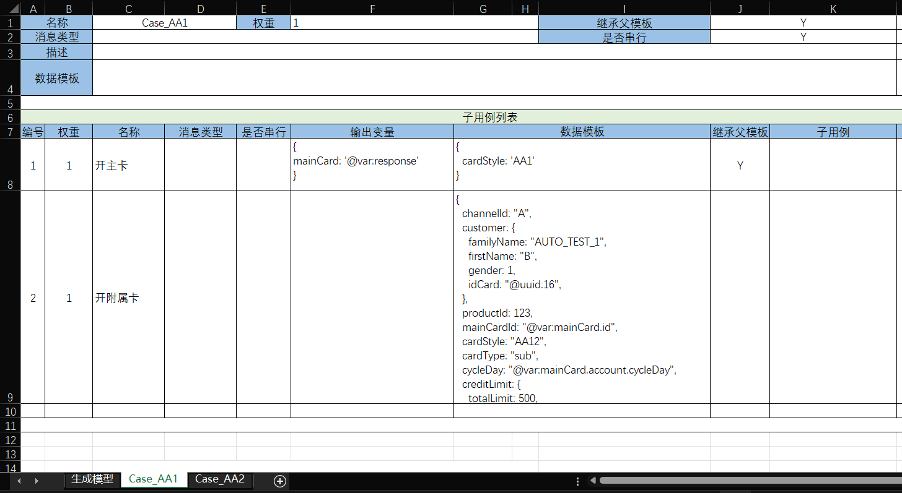

# 测试数据生成器

`batch-gen`模型提供了按照比例动态生成测试数据的机制。




以上用例按照比例生成用例：
1. 生成30%的A类账户和70%的B类账户。
2. A类账户再分成Case_AA1和Case_AA2两种情况。Case_AA1包含顺序执行的子用例，先执行【开主卡】，再执行【开附属卡】。
   执行完子用例之后通过【输出变量】可以记录下临时变量，然后在后续用例中可以通过前缀引导语法 `@var:mainCard.id`来引用已有的变量。

在批处理模型中可以通过generator配置来引用batch-gen模型，表示根据批量生成模型来生成数据。

```xml
<batch>
  <loader>
    <generator genModelPath="create-card.batch-gen.xlsx" totalCountExpr="totalCount"/>
  </loader>
</batch>
```

