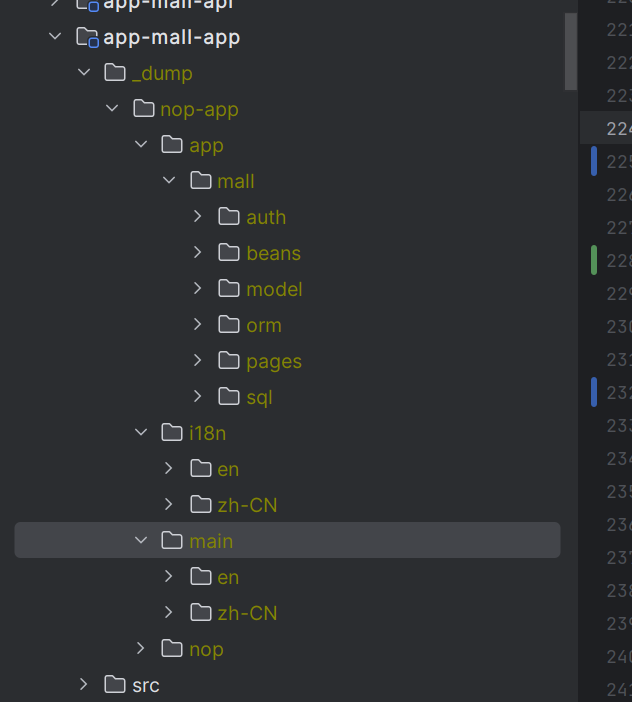

# 开发调试

## debug模式

**设置nop.debug=true会开启debug模式，此时才会注册DevDoc等用于调试的后台服务，才会输出`_dump`文件。**

缺省配置文件是`application.yaml`，如果要启用`application-dev.yaml`这样的特殊环境配置文件，必须在bootstrap.yaml或者application.yaml中配置对应的`nop.profile`

## 错误定位

后台抛出异常时一般会统一使用NopException异常类，它具有SourceLocation属性，会提示错误发生时对应的XLang程序源码位置。NopException类上还报错了XLang执行堆栈，打印异常消息时会输出Xpl堆栈信息。例如

```
io.nop.api.core.exceptions.NopException: NopException[seq=4,status=-1,errorCode=nop.err.xui.ref-view-not-exists,params={viewPath=/app/mall/LitemallGoods/attributes.page.yaml},desc=view配置不存在：/app/mall/LitemallGoods/attributes.page.yaml]@_loc=[114:22:0:0]/app/mall/pages/LitemallGoods/LitemallGoods.view.xml
  @@getFormSelection(formModel,objMeta)@[7:30:0:0]/nop/web/xlib/web/page_simple.xpl
  @@</_delta/default/nop/web/xlib/web.xlib#GenPage>("/app/mall/pages/LitemallGoods/LitemallGoods.view.xml","add",null)@[1:17:0:0]/app/mall/pages/LitemallGoods/add.page.yaml
  @@__fn_1()@[1:17:0:0]/app/mall/pages/LitemallGoods/add.page.yaml
```

以上异常表示

1. add.page.yaml调用了web.xlib中的GenPage标签
2. GenPage标签调用了`page_simple.xpl`
3. `page_simple.xpl`在第7行调用了getFormSelection函数
4. 在函数内部访问到`LitemallGoods.view.xml`模型文件，发现它的第114行的配置不正确。

## 日志信息

### 1. 配置项信息
   如果设置了nop.debug=true，则系统启动的时候会打印所有配置参数的值以及所在的配置文件（因为可能存在多个配置文件，而且高优先级的文件会覆盖低优先级的文件）

```
# [84:11:0:0]classpath:application.yaml
quarkus.log.level=INFO
```

### 2. 模型文件解析
   所有模型文件解析时都会打印日志，并且会打印解析花费时间

```
2023-07-11 21:13:16,152 INFO  [io.nop.cor.res.com.par.AbstractResourceParser] (Quarkus Main Thread) nop.core.component.finish-parse-resource:usedTime=10,path=/nop/schema/beans.xdef,parser=class io.nop.core.lang.xml.parse.XNodeParser
```

### 3. 动态装配的bean
   将io.nop.ioc的调试级别设置为debug，则系统启动的时候会打印出条件bean的执行情况。

```
quarkus:
  log:
    category:
      "io.nop":
        level: DEBUG
```

NopIoC容器会先分析所有bean的存在条件，然后再创建bean。分析结果会打印到日志文件中。对于disabled的bean会打印出禁用的原因

```
disabled-bean:id=nopLoginService
    loc=[15:6:0:0]/nop/auth/beans/sso-defaults.beans.xml,trace=null
    check-if-property-fail:nop.auth.sso.enabled=null
```

在`_dump`目录下，`/nop/main/beans/merged-app.beans.xml`中输出了所有最终被激活的bean以及它们所对应的配置文件源码位置。

### 4. 数据库访问
   所有的数据库访问SQL都会记录在日志中，并且显示SQL执行时间

```
2023-07-11 21:14:39,637 INFO  [io.nop.dao.jdb.imp.JdbcTemplateImpl] (Quarkus Main Thread) nop.jdbc.run:usedTime=1,querySpace=default,range=0,1,name=jdbc:null,sql=select o.SEQ_NAME as c1
from nop_sys_sequence as o
 where o.DEL_FLAG =  0
```

### 5. 成功初始化
   Nop平台成功初始化之后会打印出初始化总共执行的时间，并且会打印banner

```
2023-07-11 21:14:40,562 INFO  [io.nop.cor.ini.CoreInitialization] (Quarkus Main Thread) nop.core.end-initialize:usedTime=87286
```

### 6. 虚拟文件扫描
Nop平台启动时会使用类扫描机制查找所有`_vfs`目录下的虚拟文件，在调试模式下启动时扫描结果会输出到nop-vfs-index.txt中。这个文件中记录了所有可访问的虚拟文件路径

## 日志打印

### 1. XScript脚本中内置了logInfo/logDebug等函数

```javascript
 logInfo("nop.err.invalid-name:name={}",name);
```

第一个参数必须是静态字符串，不允许"sss"+yyy这种形式，从而也避免了log注入攻击。注意第一个参数使用了slf4j框架的日志消息模板语法，必须通过`{}`来表示变量占位。

日志函数的具体实现参见 `LogFunctions.java`和`LogHelper.java`。

### 2. 任意对象调用$函数都会导致打印调试语句

```javascript
b = a.f().$("test")
```

以上调用等价于 `b = DebugHelper.v(location(), "test",a.f());`，其中test参数为自定义的提示信息。
所以，当我们想查看任意表达式的值的时候，可以在其后增加$调用。打印出的调试信息如下：

```
21:00:01.686 [main] INFO io.nop.xlang.utils.DebugHelper - test:a.f()=>1,loc=[6:8:0:0]file:/C:/can/nop/nop-entropy-bak/nop-xlang/target/test-classes/io/nop/xlang/expr/exprs/debug.test.md
```

test为自定义前缀信息。 a.f()为待查看的表达式源码, `=> 1`表示表达式的返回值为1。 loc对应于调试语句所对应的源码位置。

> 可以在DebugHelper中加条件断点来调试Java源码

### 3. 在xpl模板语言中

```
<c:log info="${data}" />
```

## 模型dump

Nop平台大量使用了元编程来动态生成代码，为了有效跟踪代码生成的细节过程，让最终运行代码片段的实际来源一目了然，Nop平台在调试模式下会自动输出合并后的结果模型文件到项目根目录下的\_dump目录中。当我们启动应用程序后，可以看到`_dump`目录下存在大量输出文件


如果结果文件是由多个delta文件合并得来，则在结果文件中我们会看到每个来源节点/属性的源码位置信息。

在XDSL模型的根节点上，我们也可以增加`x:dump="true"`属性，它会把更细节的合并算法执行过程打印到日志中。

```javascript
DslNodeLoader.INSTANCE.loadFromResource(resource, null, XDslExtendPhase.validate);
```

通过DslNodeLoader可以加载XDSL文件并返回合并后的XNode。XNode节点合并内部分为多个阶段，可以通过XDslExtendPhase合并到某个中间阶段就返回。

## XLang调试器

Nop平台的`nop-idea-plugin`模块提供了IDEA开发插件，其中包含了针对XScript脚本语言的调试器，可以为所有XDSL领域语言增加断点调试功能。具体参见文档 [idea-plugin.md](../user-guide/idea/idea-plugin.md)

## GraphQL调试工具

Quarkus框架内置了`graphql-ui`调试工具。以调试模式启动应用之后，通过链接`/q/graphql-ui`可以访问到调试页面。
在此页面上可以查看所有后台GraphQL端点和类型的定义，并且输入代码时会自动提示候选文本。


## 常见问题

## 前端

### 1. 字段对应的前端控件显示为空，无法录入

可能是control.xlib中没有针对该字段定义对应的编辑器。在debug日志级别下，XuiHelper.getControlTag函数会打印控件映射结果。例如:

```
 nop.xui.resolve-control-tag:controlTag=edit-int,prop=id,domain=null,stdDomain=null,stdDataType=int,mode=add
```

### 2. 上传文件时提示 415 Unsupported Media Type

这是Quarkus框架报错，可以将quarkus.log.level设置为DEBUG。
后端服务需要引入

## 后端

### 1. 后端的bean未按预期注入

首先查看启动工程的`_dump`目录下`/{appName}/nop/mai/beans/merged-app.beans.xml`中的结果是否满足预期。
这个文件是IoC容器执行完所有动态判断逻辑之后输出的最终结果，其中还打印了属性和对象的来源文件。例如:

```xml
<!--LOC:[18:6:0:0]/nop/auth/beans/auth-service.beans.xml-->
    <bean class="io.nop.auth.service.login.DaoLoginSessionStore" id="$DEFAULT$nopLoginSessionStore" ioc:aop="false"
          name="nopLoginSessionStore">
        <property name="daoProvider" ext:autowired="true">
            <ref bean="$DEFAULT$nopDaoProvider" ext:resolved-loc="[51:6:0:0]/nop/orm/beans/orm-defaults.beans.xml"/>
        </property>
        <property name="sessionIdGenerator" ext:autowired="true">
            <ref bean="$DEFAULT$nopSessionIdGenerator"
                 ext:resolved-loc="[34:6:0:0]/nop/auth/beans/auth-core-defaults.beans.xml"/>
        </property>
    </bean>
```

1. 如果节点路径和前一个兄弟节点的路径不同，则会打印LOC信息。
2. `ext:autowired="true"`表示这个属性是通过`@Inject`注解自动注入的。
3. `ext:resolved-loc`属性表示了这个对象具体所在的配置文件路径。
4. `ext:resolved-trace="/nop/auth/beans/app-service.beans.xml"`。 `ext:resolved-trace`属性可以表示是哪个beans.xml引入了这个bean所在的xml文件

### 2. 如何查看当前应用所加载的bean

在debug模式下，可以通过`/p/DevDoc__beans`链接查看实际装载的bean

### 3. 如何查看系统中定义的全局函数和全局对象

在debug模式下，可以访问如下链接

1. `/r/DevDoc__globalFunctions`
2. `/r/DevDoc__globalVars`

在返回的结果中我们可以看到这些函数和变量的实际对应的Java类和方法。

### 4. 如何查看当前启用的配置变量集合

nop-config模块负责从多个配置来源收集配置信息，并按照优先级决定它们之间的覆盖关系，最终启用的配置变量可以通过如下链接查看：
`/r/DevDoc__configVars`

在返回的结果中包含每个配置变量的来源资源文件路径。

### 5. 如何查看后台所有的GraphQL服务以及类型定义

`/p/DevDoc__graphql`
返回graphql定义

### 6. 调试模型合并过程

在  `x:gen-extends`或者 `x:post-extends`段中增加日志输出代码或者通过扩展属性来输出调试信息。

```xml
<orm>
  <x:gen-extends>
    <orm ext:time="${now()}" xgen:x:dump="true" />
  </x:gen-extends>
</orm>
```

## 自动化测试

1. 自动录制的response中变量名可能不正确
   因为有可能多个随机变量具有同样的值，因此当保存response数据的时候，有可能根据变量的值反向查找变量名的时候出现错误，导致录制出的变量名不正确。
   例如updateTime录制为addTime等。
