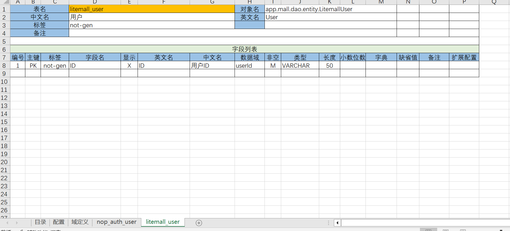

# 如何在不修改基础产品源码的情况下实现定制化开发

ToB市场中软件产品开发难以摆脱的一个魔咒是所谓的定制化开发。一般情况下，定制化开发需要针对特定用户的特定需求对产品源代码进行大量修改，导致产品代码的通用性被严重腐蚀。如果无法平衡好定制化开发和标准化产品开发之间的关系，则有可能严重拖累公司产品的整体发展进程。因为商业层面的竞争力很大程度上来源于差异化的能力，所以高价值的中高端客户必然会存在大量定制化的需求，甚至这些需求还很难被抽象到一个标准化的可配置模式中。为了最小化同时进行定制化开发和基础产品研发的成本，在理想的情况下，定制化开发不应该修改基础产品的代码，但是基于现有的软件工程理论和通用框架，要实现这一点却困难重重，或者成本非常高。在本文中，我将分析定制化开发之所以陷入困境的技术原因，并介绍Nop平台中如何利用可逆计算原理来提供一种创新的定制能力，它使得应用层代码无需做出任何特殊的设计（比如预先抽象出扩展接口）即可获得完全增量式的定制化开发能力（定制的增量代码完全独立于基础产品代码，定制基础产品或者Nop平台的功能都无需修改原始代码）。

具体的定制实例可以参见示例工程 [nop-app-mall/app-mall-delta](https://gitee.com/canonical-entropy/nop-app-mall/tree/master/app-mall-delta)。关于可逆计算理论，可以参见文章 [可逆计算：下一代软件构造理论](https://zhuanlan.zhihu.com/p/64004026)。

## 一. 定制化开发的困局

传统上，我们处理定制化开发的技术方案主要有如下两个：

## 1.1  代码分支

最常见的方式是针对每个客户建立一个专属的代码分支，然后定期从主干分支合并代码。根据我们观察到的情况，如果存在5个以上的分支，就非常容易产生混乱，特别是当同一个团队同时维护多个差异巨大的代码分支的情况下，甚至会出现错误提交、发布错误版本的情况。

基础产品一般较为复杂，依赖众多，每个分支都包含相似而又不相同的基础产品的代码会导致开发环境的维护成本急剧上升。而当出现问题需要诊断的时候，因为基础产品的代码已经被频繁改动，往往很难快速定位问题来源是在修改后的基础产品代码中还是在新开发的定制代码中。

因为基础产品的代码量一般很大，代码同步时进行比对分析的工作量和要求的知识储备也很高。如果在基础产品中修复了bug或者增加了新功能，把这些修改同步到下游分支往往是一个漫长的过程，必须有相当清楚修改原因的开发人员负责执行代码合并过程。而另一方面，当定制化代码分支中出现一个优秀的特性，希望能够被逆向抽取，合并到主分支中时，从定制化分支剥离通用特性代码也是一个比较复杂的过程。**基础产品代码与特殊定制代码纠缠、混杂在一起，缺乏明确的形式边界，很容易出现意大利面条式的依赖关系而难以分离**。

## 1.2. 配置化和插件化

配置化和插件化是支持定制化开发的另一条主要技术路线。一个成熟的产品化产品必然是一个高度可配置的产品，大量的客户化需求都被抽象为配置项的交叉组合。对于一些难以事前穷举的需求变化，如果我们能够预测到它所对应的变化位置，则可以事先在基础产品中预留好扩展点（扩展接口），然后在定制化开发时插入特殊的插件实现实例。

这一方案的主要问题是预测可能不准。特别是当产品本身还不成熟的情况下，有可能预测的变化都没有发生，而需求变化都发生在没有预测到的地方。这导致一个比较尴尬的情况：**当我们最需要可扩展性来降低产品演进成本的时候，它可能还不存在**。

高度的灵活性一般也伴随着复杂性的上升以及运行性能的下降。一些并不常见的需求有可能会在基础产品内部留下深深的、不成比例的烙印，导致后来的开发人员非常疑惑，这里绕这么一个大弯的目的何在？需求只有一句话，为什么会对应如此多的接口和实现代码？如果把特定的业务需求看作是一条逻辑路径，那么配置化相当于是将多条逻辑路径都内置在产品中，形成四通八达的交通网络，然后再通过密密麻麻的调度开关来控制具体启用的路径连接。如果缺乏全局性的指导原则和设计规划，那么配置本身很容易就会成为新的复杂性来源，变得难以被理解，难以被复用。

基于现有的软件工程理论，比如软件产品线工程(Software Product Line)，提升软件灵活性的技术手段可以被归类为适配（adaptation)、替换（replacement）和扩展(extension)这三类。它们都可以看作是向核心架构补充功能。但是定制化的原因不一定是来自于缺少新的功能，很多时候也在于需要屏蔽或者简化原先已经存在的功能。现有的技术手段难以高效的实现删除已有功能的目标。

## 二. 可逆计算理论

事前预测不靠谱，事后分离成本高。如果希望以低廉的成本实现定制化开发，在理想的情况下，定制化代码和基础产品代码应该物理隔离，同时无需预留接口，即可通过某种通用机制对基础产品功能进行剪裁、扩展。为了实现这个目标，我们有必要重新审视定制化开发的理论基础。

假设我们已经建立了基础产品`X`，它具有多个组成部分，可以用如下公式来表达：

```
   X = A + B + C
```

我们希望开发的目标产品`Y`，它也具有多个组成部分，

```
   Y = A + B + D
```

**在产品X的基础上来开发产品Y，翻译到抽象层面，对应于建立从X到Y的一个运算关系**

```
   Y = A + B + D = (A + B + C) + (-C + D) = X + Delta
```

如果真的可以实现完全不修改基础产品`X`，那么一个很自然的理论推论是：**定制化代码相当于是一种针对基础产品的Delta修正**。

更进一步，我们可以有如下衍生的推论:

1. 差量Delta应该是架构设计中的**第一类(First Class)概念**。
   这样它才可以被独立识别、管理、存放。定制化代码应该和基础产品代码在物理层面分离，单独进行版本管理。

2. `X = 0 + X`，任何量作用于单位元都得到它自身，因此**全量是差量的一个特例**。 Delta的定义和表达形式在理论层面无需进行特殊设计，任何一个原有的形式表达都可以被看作是一种差量化表达，我们只需要定义好差量之间的运算规则即可。

3. `Y = X  + Delta1 + Delta2 = X + (Delta1 + Delta2) = X + Delta`。 **Delta应该满足结合律**，这样可以脱离基础产品，独立的对多个Delta进行合并运算，将多个Delta打包为一个整体。

4. `Delta = -C + D`，除了新增组分之外，**Delta必须包含逆元**，这样才能实现对原系统的剪裁。Delta应该是新增、修改、删除的混合体。

5. `Y = (A + dA) + (B + dB) + (C + dC) = A + B + C + (dA + dB + dC) = X + Delta`，如果允许原系统各处都可以发生变化，则Delta机制需要从原系统的各个细微之处搜集变化，然后把它们聚合为一个整体的Delta。**这隐含的要求原系统具有一个稳定的定位坐标系**。`dA`与`A`分离之后，存放到独立存在的Delta中，那么它必然保留了某种定位坐标，只有这样，当Delta与`X`结合的时候，才可以重新找到原始的结构`A`，然后与`A`相结合。

一些高度灵活的SAAS产品将表单配置和流程配置保存在数据库表中，然后通过调整配置来实现针对特定用户的定制化开发。在这种解决方案中，配置表和配置条目的主键相当于构成了一个坐标系统。在此基础上，可以为配置条目增加版本字段，从而实现版本管理甚至版本继承功能。

一些软件提供的补丁热更新的机制本质上也是一种Delta修正机制。补丁的成功应用依赖于基础架构层面提供的坐标系定位机制以及定位后执行的差量合并算法。不过，与定制化开发相比，热更新对补丁的结构化要求较低，不一定要求补丁本身具有相对稳定的业务语义，补丁本身也不一定对应于程序员可以直接理解的源码。

在Docker技术出现之前，虚拟机技术已经可以实现增量备份，但是虚拟机的增量是定义在二进制字节空间中，一个很小的业务变化就可能导致大量字节层面的变化，极不稳定，因此虚拟机增量备份不具备业务语义，也很少有独立存在的价值。而**Docker相当于在文件系统空间中定义了差量合并规则，Docker镜像具有明确的业务语义，可以通过DockerFile这一领域语言来动态构建，可以上传到中心仓库存储、检索，这开辟了一条基于差量概念实现应用构建的完整技术路线**。

可逆计算理论指出，各种基于差量概念的技术实践背后存在着统一的软件构造原理，它们都可以统一到如下公式中:

```
  App = Delta x-extends Generator<DSL>
```

关于可逆计算的详细介绍，可以参见文章 [可逆计算：下一代软件构造理论](https://zhuanlan.zhihu.com/p/64004026)。

Nop平台是可逆计算理论的一个参考实现，基于Nop平台的Delta定制机制，无需付出额外成本，我们就可以实现完全增量式的定制化软件开发。在下一节中我将详细介绍Nop平台中的具体做法。

## 三. Nop平台中的Delta定制

使用Nop平台开发的所有应用都自动支持Delta定制。这里以一个电商应用为例，具体演示在系统的各个层面如何在不修改基础产品源码的情况下增加功能，以及如何修改、删除已有功能。具体示例代码参见 [nop-app-mall/app-mall-delta](https://gitee.com/canonical-entropy/nop-app-mall/tree/master/app-mall-delta)

## 3.1 专用的Delta模块

所有差量定制代码可以集中存放在一个专用的Delta模块中，例如[app-mall-delta](https://gitee.com/canonical-entropy/nop-app-mall/tree/master/app-mall-delta)。

在`app-mall-codegen`模块的[gen-orm.xgen](https://gitee.com/canonical-entropy/nop-app-mall/blob/master/app-mall-codegen/postcompile/gen-orm.xgen)文件中，增加如下调用，表示将差量化定制代码生成到`app-mall-delta`模块下。

```javascript
codeGenerator.withTargetDir("../app-mall-delta").renderModel('../../model/nop-auth-delta.orm.xlsx','/nop/templates/orm-delta', '/',$scope);
codeGenerator.withTargetDir("../app-mall-delta").renderModel('../../model/nop-auth-delta.orm.xlsx','/nop/templates/meta-delta', '/',$scope);
```

在其他模块中，例如`app-mall-app`模块中，只要依赖`app-mall-delta`模块即可实现对Nop平台内置功能的定制。

## 3.2 数据模型的Delta定制

`nop-auth`模块是Nop平台缺省提供的一个权限管理模块，Nop平台基于[nop-auth.orm.xlsx](https://gitee.com/canonical-entropy/nop-entropy/blob/master/nop-auth/model/nop-auth.orm.xlsx)这一数据模型来自动生成ORM模型定义以及GraphQL类型定义等。如果需要在系统内置的用户表上增加字段，则我们可以增加一个[nop-auth-delta.orm.xlsx](https://gitee.com/canonical-entropy/nop-app-mall/blob/master/model/nop-auth-delta.orm.xlsx)差量模型，在其中只包含需要被扩展的表和字段。


在`NopAuthUser`表中我们增加了一个`MALL_USER_ID`字段，它关联到`nop-app-mall`项目中定义的`LitemallUser`表。

1. `MALL_USER_ID`的【编号】列必须指定一个唯一编号，一般情况下我们可以选择从`基础模型的最大编号+50`开始，避免与基础模型中新增字段的编号重复。

2. 为了保证模型中数据结构的完整性，我们必须在`NopAuthUser`表中包含主键定义，为了避免重复生成代码，在【标签】列需要增加`not-gen`标签，表示它是基类中已经定义的字段，无需生成对应属性定义代码。

3. 需要将表的【对象名】指定为`io.nop.auth.dao.entity.NopAuthUser`，这样可以保持基础模型中定义的实体对象名不变，所有已有的代码不会受到影响。

4. 表的【基类】指定为`io.nop.auth.dao.entity.NopAuthUser`，【类名】指定为`NopAuthUserEx`，这样生成的实体类会从`NopAuthUser`类继承。

在差量模型中如果引用其他模块中定义的实体类，则需要使用完整的实体名，例如`app.mall.dao.entity.LitemallUser`。



因为不需要为这些外部表生成代码，所以我们在`LitemallUser`表的【标签】配置中增加`not-gen`标签，且表的字段定义只保留主键定义，用于模型解析时的完整性校验。


**注意`appName`需要与自己定制的模块名保持一致，否则无法实现定制功能，运行时会出现重复定义实体的错误**

在数据模型配置中，我们指定`deltaDir=default`，这样模型文件生成的路径为 `/_vfs/_delta/{deltaDir}/{originalPath}`。模型装载的时候会优先装载delta目录下的模型文件，从而覆盖基础产品中的模型定义。

实际生成ORM模型文件结构为

```xml
<orm x:extends="super,default/nop-auth.orm.xml">
  <entities>
     <entity className="app.mall.delta.dao.entity.NopAuthUserEx" displayName="用户"
             name="io.nop.auth.dao.entity.NopAuthUser">
             ...
     </entity>
  </entities>
</orm>
```

在这种配置下，`entityDao`或者`ormTemplate`新建实体时返回的实现类为`NopAuthUserEx`类型，但是实体名保持为`NoptAuthUser`。

```javascript
 IEntityDao<NopAuthUser> dao = daoProvider.daoFor(NopAuthUser.class);
 NopAuthUserEx user = (NopAuthUser)dao.newEntity();

或者
 NopAuthUserEx user = （NopAuthUserEx) ormTemplate.newEntity(NopAuthUser.class.getName());
```

实体类生成的代码结构为

```java
class NopAuthUserEx extends _NopAuthUserEx{

}

class _NopAuthUserEx extends NopAuthUser{

}
```

在扩展的实体类中，继承了基础模型实体类的全部功能，同时可以通过生成的`_NopAuthUserEx`类来增加新的字段信息。

如果希望在数据库中精简字段，删除某些字段定义，则只需要在字段的【标签】配置中增加`del`标签，它对应生成如下配置

```xml
<orm>
   <entities>
      <entity name="io.nop.auth.dao.entity.NopAuthUser">
         <columns>
            <!-- x:override=remove表示删除此字段定义 -->
            <column name="clientId" x:override="remove" />
         </columns>
      </entity>
   </entities>
</orm>
```

使用差量化数据模型，我们可以很容易的跟踪定制化版本与基础产品版本之间的数据库差异。

> 在数据模型文档中可以很明确的注明定制原因和变化时间等附加信息。

### 3.3 IoC容器的Delta定制

Nop平台内置了一个兼容Spring1.0配置语法的IoC容器[NopIoC](https://zhuanlan.zhihu.com/p/579847124)。

#### 1. 条件开关
   NopIoC在Spring1.0的XML语法的基础之上补充了类似SpringBoot的条件装配能力。我们可以采用配置变量开关来启用或者禁用参与装配的bean

```xml
    <bean id="nopAuthHttpServerFilter" class="io.nop.auth.core.filter.AuthHttpServerFilter">
        <ioc:condition>
            <if-property name="nop.auth.http-server-filter.enabled" enableIfMissing="true"/>
        </ioc:condition>
        <property name="config" ref="nopAuthFilterConfig"/>
    </bean>
```

#### 2. 缺省实现
   NopIoC可以为指定名称的bean提供一个缺省实现，如果在容器中存在其他同名的bean，则缺省实现会被自动忽略，这一点类似于SpringBoot中的`ConditionOnMissingBean`机制。
   
```xml
<bean id="nopActionAuthChecker" class="io.nop.auth.service.auth.DefaultActionAuthChecker" ioc:default="true"/>

<!-- 标记了ioc:default="true"的bean 会被其他文件中定义的同名的bean覆盖 -->
<bean id="nopActionAuthChecker" class="com.ruoyi.framework.web.service.PermissionService" />
```

也可以为新增的bean增加`primary=true`配置，它的优先级会高于所有没有标记为`primary`的bean的定义。

#### 3. x-extends继承

NopIoC更为强大的地方是它支持XLang语言内置的Delta定制机制。我们可以在delta目录下增加同名的`beans.xml`配置文件来覆盖基础产品中已有的配置文件。例如`app-mall-delta`模块中`/_vfs/_delta/default/nop/auth/auth-service.beans.xml`

```xml
<beans x:schema="/nop/schema/beans.xdef" xmlns:x="/nop/schema/xdsl.xdef"
       x:extends="super">

    <bean id="nopAuthFilterConfig">
        <property name="authPaths">
            <list x:override="append">
                <value>/mall*</value>
            </list>
        </property>
    </bean>

</beans>
```

上面的配置表示继承已有的模型（`x:extends="super"`），然后修改`nopAuthFilterConfig`这个bean的`authPaths`属性的配置，为它增加一个条目。

除了覆盖bean的配置之外，我们可以通过delta定制来删除bean的配置。例如Nop平台与Ruoyi框架集成的时候需要删除内置的`dataSource`配置

```xml
    <bean id="nopDataSource" x:override="remove" />
```

具体配置参见[delta目录下的dao-defaults.beans.xml](https://gitee.com/canonical-entropy/nop-for-ruoyi/blob/master/ruoyi-admin/src/main/resources/_vfs/_delta/default/nop/dao/beans/dao-defaults.beans.xml)

Delta定制非常简单直观，**适用于所有模型文件而且可以定制到最细粒度的单个属性**。如果对比一下SpringBoot的等价实现，我们会发现SpringBoot的定制功能存在很大的限制：首先，为了实现Bean exclusion和 Bean Override，Spring需要在引擎内部增加大量相关的处理代码，同时也引入很多特殊的使用语法。第二，Spring的定制机制只针对单个Bean的配置，比如我们可以禁用某个bean，但缺乏合适的针对单个属性的定制手段。如果事前规划的不好，我们很难通过简单的方式来覆盖系统中已有的Bean的定义。

> 因为IoC容器可以按照名称、类型、注解等多种方式搜索匹配的bean，并实现装配，所以在一般情况下我们不需要再额外设计插件机制。

> 在调试模式下启动时，NopIoC会将所有bean的定义输出到`/_dump/{appName}/nop/main/beans/merged-app.beans.xml`文件中，在其中可以看到每一个bean的定义所对应的源码位置。

### 3.4 GraphQL对象的Delta定制

Nop平台的GraphQL服务一般对应于`BizModel`对象，例如`NopAuthUser__findPage`表示调用`NopAuthUserBizModel`类上的`findPage`方法。我们可以通过覆盖`BizModel`注册类的方式来实现对GraphQL服务的定制。具体做法如下：

#### 1. 从已有的`BizModel`类继承，在其中增加新的服务方法，或者重载原有的方法

```java
public class NopAuthUserExBizModel extends NopAuthUserBizModel {
    static final Logger LOG = LoggerFactory.getLogger(NopAuthUserExBizModel.class);

    @Override
    protected void defaultPrepareUpdate(EntityData<NopAuthUser> entityData, IServiceContext context) {
        super.defaultPrepareUpdate(entityData, context);

        LOG.info("prepare update user: {}", entityData.getEntity().getUserId());
    }
}
```

#### 2. 在`beans.xml`中覆盖原有的bean定义。
   
   ```xml
    <bean id="io.nop.auth.service.entity.NopAuthUserBizModel"
          class="app.mall.delta.biz.NopAuthUserExBizModel"/>
   ```
   
   自动生成的bean定义上标记了`ioc:default="true"`，所以只要重新按照同样的`id`注册，就会覆盖缺省的定义。

除了扩展已有的`BizModel`类之外，我们可以通过`XBiz`模型来覆盖Java对象中定义的服务方法。例如定制`NopAuthUser.xbiz`文件，在其中增加方法定义

```xml
<biz x:schema="/nop/schema/biz/xbiz.xdef" xmlns:x="/nop/schema/xdsl.xdef" x:extends="super">

    <actions>
        <query name="extAction3" displayName="定义在biz文件中的测试函数3">
            <source>
                return "result3"
            </source>
        </query>
    </actions>
</biz>
```

NopGraphQL引擎会自动收集所有biz文件以及标注了`@BizModel`的bean，并按照`bizObjName`把它们分组汇总为最终的服务对象。这种做法有些类似于游戏开发领域的[ECS架构(Entity-Component-System)](https://zhuanlan.zhihu.com/p/30538626)。在这种架构中，具有唯一标识的对象是由多个对象切片堆叠而成，因此定制的时候我们不一定需要修改原有的对象切片，而是可以选择堆叠一个新的切片覆盖此前的功能即可。`XBiz`文件中定义的函数优先级最高，它会覆盖`BizModel`中定义的函数。

## 3.5 前端页面的Delta定制

Nop平台的前端页面主要在`view.xml`和`page.yaml`这两种模型文件中定义。前者是技术中立的`XView`视图大纲模型，它采用表单、表格、页面、按钮等粗粒度的概念实现对页面结构的描述，足以描述一般的管理页面。而`page.yaml`模型对应于百度AMIS框架的JSON描述，最终返回到前端的实际上是`page.yaml`文件中的内容。`page.yaml`利用`x:gen-extends`这一元编程机制根据`XView`模型来动态生成页面内容。

通过定制这两种模型文件，我们可以调整表单的布局、设置单个字段的显示控件、在页面上增加按钮、删除按钮，甚至完全覆盖基础产品中的页面内容。

## 3.6 标签函数的Delta定制

Nop平台的代码生成以及元编程机制中大量使用Xpl模板语言，而且工作流模型等可执行模型中所有涉及脚本执行的地方使用的都是Xpl模板语言。Xpl模板语言内置了标签库机制来实现函数级别的封装（每一个标签相当于是一个静态函数）。标签库xlib文件可以通过Delta定制机制来实现定制。
例如我们可以定制[control.xlib](https://gitee.com/canonical-entropy/nop-app-mall/blob/master/app-mall-app/src/main/resources/_vfs/_delta/default/nop/web/xlib/control.xlib)来调整字段类型所对应的缺省展示控件，也可以定制[ddl.xlib](https://gitee.com/canonical-entropy/nop-entropy/blob/master/nop-orm/src/main/resources/_vfs/nop/orm/xlib/ddl/ddl_mysql.xlib)来修复针对某个数据库版本的建表语句的语法。

## 3.7 规则模型和报表模型等的Delta定制

Nop平台中的所有模型，包括工作流模型、报表模型、规则模型等都是采用XDef元模型来约束，它们都满足XDSL领域语法规则(具体介绍参见[XDSL:通用领域特定语言设计](https://zhuanlan.zhihu.com/p/612512300))。因此，所有的模型也自动具有Delta定制能力，可以在`_vfs/_delta/{deltaDir}`目录下增加对应路径的模型文件来定制基础产品内置的模型文件。

与一般的报表引擎、工作流引擎不同，Nop平台中的引擎大量使用了Xpl模板语言作为可执行脚本，因此可以引入自定义标签库来实现定制扩展。例如，
一般的报表引擎会内置几种数据加载机制:JDBC/CSV/JSON/Excel等。如果我们希望增加新的加载方式，一般需要实现引擎内置的特殊接口，并且使用特殊的注册机制将接口实现注册到引擎中，而修改可视化设计器，使其支持自定义配置一般也不是一项很简单的工作。

而在`NopReport`报表模型中，提供了名为`beforeExecute`的Xpl模板配置，它可以看作是一个基于通用接口（[IEvalAction](https://gitee.com/canonical-entropy/nop-entropy/blob/master/nop-core/src/main/java/io/nop/core/lang/eval/IEvalAction.java)）的扩展点。在`beforeExecute`段中我们可以采用如下方式引入新的数据加载机制：

```xml
<beforeExecute>
   <spl:MakeDataSet xpl:lib="/nop/report/spl/spl.xlib" dsName="ds1" src="/nop/report/demo/spl/test-data.splx" />
</beforeExecute>
```

> 只需要查看XDef元模型我们就可以很容易的发现哪些节点是Xpl模板配置节点，无需定义或者理解特殊的插件接口。

标签调用既是一种函数调用，又可以看作是一种很容易被解析的XML配置，可以通过补充一个`XView`模型文件来自动生成`beforeExecute`段的可视化编辑器。
如果平台已经提供了模型的可视化设计器，也可以很容易的通过定制设计器所对应的模型文件实现自定义扩展。

另外一种做法是利用XDSL内置的扩展属性配置。Nop平台所有的模型文件都自动支持扩展属性，除了XDef元模型中定义的属性和节点之外，所有带名字空间的属性和节点在缺省情况下都不会参与格式校验，会作为扩展属性被存储（这一机制类似于允许在Java类中增加任意的Annotation注解）。我们引入扩展属性节点来保存配置，然后利用`x:post-extends`元编程机制在编译期解析扩展配置，动态生成`beforeExecute`段。这种做法不需要在报表模型中内置引入数据源配置这样的概念，也不需要报表引擎在运行时有任何特殊的接口支持，仅仅通过**局部的编译期变换**即可实现任意外部数据源的集成。

```xml
<x:post-extends>
   <xpt-gen:DataSetSupport/> <!-- 负责解析ext:dataSets扩展配置，动态生成代码，追加到beforeExecute段 -->
</x:post-extends>

<ext:dataSets>
   <spl name="ds1" src="/nop/report/demo/spl/test-data.splx" />
</ext:dataSets>

<beforeExecute> 这里还可以写其他初始化代码 </beforeExecute>
```

## 3.8 编译期的特性开关

一个高度可配置的产品如果希望保持运行时性能，那么它应该尽量在编译期执行各类特性开关，这样最终生成的代码可以得到简化。在Nop平台中，所有的XDSL领域模型文件都支持`feature:on`和`feature:off`特性开关机制。例如

```xml
<form id="view" feature:on="!nop.auth.use-ext-info"> ...</form>
```

在任何一个XML节点上都可以设置`feature:on`和`feature:off`属性。`feature:on="!nop.auth.use-ext-info"`表示`nop.auth.use-ext-info`配置变量为`false`时此节点才存在，否则它会被自动删除。

可以和SpringBoot中的条件开关机制做一个对比：Nop平台内置的`feature`开关可以作用于任何模型文件的任何节点，模型本身并不需要针对条件开关做任何针对性设计，也不需要在运行时引擎增加任何相关代码，特性过滤是在XML加载时实现的。而SpringBoot的条件开关则需要专门编写相关代码，也无法应用于其他模型文件。

## 四. 总结

Nop平台基于可逆计算原理实现了所谓的Delta定制机制，通过它可以在完全不修改基础产品的情况下，实现对于前后端功能的全面定制。

Nop平台的开源地址：

- gitee: [canonical-entropy/nop-entropy](https://gitee.com/canonical-entropy/nop-entropy)
- github: [entropy-cloud/nop-entropy](https://github.com/entropy-cloud/nop-entropy)
- 开发示例：[docs/tutorial/tutorial.md](https://gitee.com/canonical-entropy/nop-entropy/blob/master/docs/tutorial/tutorial.md)
- [可逆计算原理和Nop平台介绍及答疑\_哔哩哔哩\_bilibili](https://www.bilibili.com/video/BV1u84y1w7kX/)
