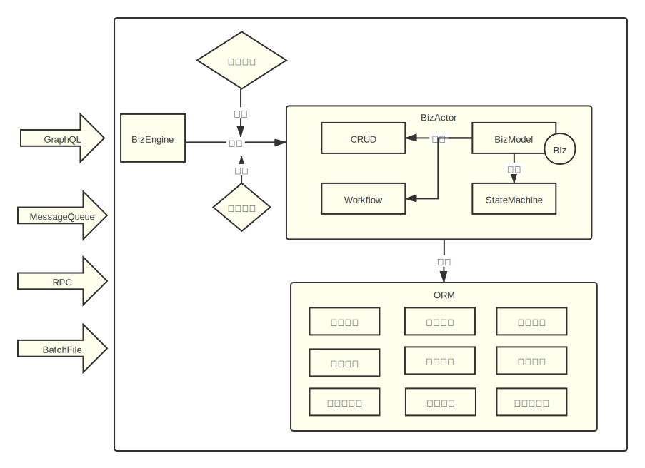

# 面向对象的GraphQL

Nop平台以数据模型为基础，自动生成实体定义、SQL表定义、GraphQL类型、前端页面等。以部门表Department为例，缺省情况下我们会生成一个GraphQL类型Department，
并为主外键关联生成对应的属性，例如parent和children。如果增加了connection标签，我们还会为关联对象生成分页获取所对应的属性，
例如usersConnection通过类似[Relay Cursor Connection](https://relay.dev/graphql/connections.htm)的方式来分页返回属于指定部门的用户。
缺省情况下业务对象会自动继承CrudBizModel，所以它会自动生成GraphQL入口操作.

> 关于connection的具体介绍，参见[connection.md](connection.md)

```graphql
extend type Query{
    Department__get(id:String!): Department
    Department__batchGet(ids:[String!]): [Department]
    Department__findPage(query:QueryBeanInput): PageBean_Department
    ...
}
extend type Mutation{
    Department__save(data: DepartmentInput): Department
    Department__delete(id:String!): Boolean
    ...
}
```

Nop平台内置了一个自动化的后台管理软件生产线，它的输入是用户需求（以Excel文档的形式表达），输出是可运行的应用系统，主要通过系统化的增量式代码生成方案来实现生产线的运转。这其中，GraphQL
Schema是根据Meta元数据定义和BizModel业务模型定义自动生成的一种中间产物，我们并不会手工编写GraphQL类型定义，在编写业务代码的过程中也不需要具有任何GraphQL相关的知识，不需要实现GraphQL特有的DataFetcher、DataLoader等接口。具体的技术细节在“差量流水线”一节中会有更详细的介绍。另外可以参考以下文章：

[数据驱动的差量化代码生成器](https://zhuanlan.zhihu.com/p/540022264)

## GraphQL对象定义

NopGraphQL引擎在初始化的时候会利用IoC容器的动态扫描能力发现所有标记了`@BizModel`注解的bean，并把它们按照BizObjName配置进行归类合并。例如

```java

@BizModel("NopAuthUser")
public class NopAuthUserBizModel extends CrudBizModel<NopAuthUser> {
    @BizMutation
    public void changeSelfPassword(@Name("oldPassword") String oldPassword,
                                   @Name("newPassword") String newPassword) {
        ...
    }
}


@BizModel("NopAuthUser")
public class NopAuthUserBizModelEx {
    @BizMutation
    public void otherOperation() {
         ...
    }

    @BizMutation
    @Priority(NORMAL_PRIORITY - 100)
    public void changeSelfPassword
    @Name("oldPassword")
    String oldPassword,
    @Name("newPassword")
    String newPassword)

    {
        ...
    }
}
```

NopAuthUserBizModel和NopAuthUserBizModelEx的BizObjectName都是NopAuthUser，它们的方法会叠加在一起共同生成NopAuthUser业务对象上的方法。当出现同名的函数时，会按照`@Priority`
优先级配置选择优先级更高的实现。如果优先级相同且函数名相同，则会抛出异常。

NopGraphQL引擎在构造BizObject的时候还会检查xbiz扩展模型，我们可以通过在NopAuthUser.xbiz模型文件中增加方法来扩展BizObject，这个模型文件可以在线更新，更新后会即时起效，无需重新初始化GraphQL类型定义。xbiz文件中定义的方法优先级最高，它会自动覆盖JavaBean中定义的业务方法。

如果把对象名相同的BizModel看作是对象的一个切片，则NopGraphQL引擎相当于是在系统初始化的时候动态收集这些对象切片，然后像docker镜像一样把它们叠加在一起，构成完整的对象定义。在运行时，最上层的xbiz切片可以被动态修改，并覆盖下层切片的功能。

> BizModel切片的概念有些类似于游戏开发领域中的Entity Component System (ECS)模式，只是它累加的是动态行为而不是局部状态。

与Gather对偶的能力是Scatter：我们经常需要做一些全局规则的抽象，需要将某些公共知识自动推送到不同的业务对象中。NopGraphQL主要通过AOP机制和元编程机制来实现信息的分发：

1. 公共的机制可以作为AOP拦截器作用于符合条件的业务方法上

2. xbiz文件中可以通过XLang中通用的x:gen-extends元编程机制动态生成方法定义。也可以使用外部的CodeGenerator来生成代码。

## CRUD模型

在一般的业务开发中，CRUD(Create/Read/Update/Delete)
操作往往是不同的业务对象中相似度最高的部分，因此有必要对它们进行统一抽象。NopGraphQL使用设计模式中的模板方法(Template
Method)模式提供了通用的CRUD实现：CrudBizModel。具体使用方法是从CrudBizModel类继承，然后可以通过实现defaultPrepareSave/afterEntityChange等函数补充定制逻辑。参见代码

[CrudBizModel.java](https://gitee.com/canonical-entropy/nop-entropy/blob/master/nop-biz/src/main/java/io/nop/biz/crud/CrudBizModel.java)

[ObjMetaBasedValidator.java](https://gitee.com/canonical-entropy/nop-entropy/blob/master/nop-biz/src/main/java/io/nop/biz/crud/ObjMetaBasedValidator.java)

[NopAuthUserBizModel.java](https://gitee.com/canonical-entropy/nop-entropy/blob/master/nop-auth/nop-auth-service/src/main/java/io/nop/auth/service/entity/NopAuthUserBizModel.java)

## 3.1 元数据驱动

CrudBizModel采用的是元数据驱动的实现方式，它会读取xmeta配置文件中的内容，内置实现了数据验证、自动初始化、级联删除、逻辑删除、数据权限等多种常见需求，所以一般情况下只需要调整xmeta和xbiz配置文件，并不需要编写定制逻辑。

1. 数据验证：类似于GraphQL的输出选择，NopGraphQL可以对输入字段进行选择性验证和转换，这体现了**输入和输出的对偶性**。

   ```javascript
   validatedData = new ObjMetaBasedValidator(bizObjManager,bizObjName,objMeta,context,checkWriteAuth)
                       .validateForSave(input,inputSelection)
   ```

2. 自动初始化：在meta中可以配置字段的autoExpr表达式，更新或者修改的时候可以根据该配置自动初始化字段值。autoExpr表达式可以根据数据模型中的domain配置自动生成。

3. 自动转换：根据meta中配置transformIn表达式，对输入的属性值进行适配转换。transformIn表达式可以根据数据模型中的domain配置自动生成。

4. 级联删除：标记为cascade-delete的子表数据会随着主表数据的删除一并删除，而且会执行子表对应的BizObject业务对象上的定义的删除逻辑。

5.

逻辑删除：如果启用delFlag逻辑删除标记字段，则底层的ORM引擎会自动将删除调用转换为修改delFlag的操作，并且对所有查询都自动应用delFlag=0的过滤条件，除非明确在SQL对象上设置disableLogicalDelete属性。

6. 数据权限：所有读取到的实体记录都会自动验证是否满足数据权限要求。

## 3.2 复杂查询

CrudBizModel对于复杂查询提供了三个标准接口

```javascript
PageBean<OrmEntity> findPage(@Name("query") QueryBean query, FieldSelectionBean selection);
List<OrmEntity> findList(@Name("query") QueryBean query);
OrmEntity findFirst(@Name("query") QueryBean query);
```

1. findPage会根据查询条件返回分页查询结果，分页逻辑可以采用cursor+next
   page的方式，也可以采用传统的offset+limit的方式。selection对应于前端调用时传入的返回字段集合。\*
   \*如果没有要求返回total总页数，则findPage内部会跳过总页数查询，如果没有要求返回items数据列表，则实际会调整真正的分页查询本身
   \*\*。

2. findList根据查询条件返回列表数据，如果没有设置分页大小，则按照meta上的配置选择maxPageSize条记录。

3. findFirst返回满足条件的第一条记录。

QueryBean类似于Hibernate中的Criteria查询对象，支持复杂的and/or嵌套查询条件以及排序条件。QueryBean可以由前台直接构造，在送到dao中真正执行之前它会经历如下处理过程：

1. 验证查询条件中只包含`queryable=true`的字段，且查询算符在每个字段的allowFilterOp集合中，缺省只允许按照相等条件进行查询。例如配置用户名支持模糊查询

   ```xml
   <!-- 支持按照相等或者模糊匹配的方式进行查询，缺省前端生成的控件为模糊查询 -->
   <prop name="userName" allowFilterOp="eq,contains" queryable="true"
             xui:defaultFilterOp="contains"/>
   ```

2. 追加数据权限过滤条件，例如过滤只能查看管理单位是本单位的数据。

3. 增加按主键字段排序的排序条件。分页查询时如果不进行排序，则因为数据库并发执行的原因，返回的结果集合可能是随机的。所以所有分页查询原则上都应该具有排序条件，确保排序后的分页顺序一致。

QueryBean利用底层的NopOrm引擎的能力，可以很自然的支持关联对象查询，例如

```xml

<eq name="manager.dept.type" value="1"/>
```

表示按照 manager.dept.type = 1条件进行过滤，自动根据`manager_id`关联对应的部门表。

如果底层的ORM引擎不支持关联查询，也可以自行编写一个QueryTransformer接口来对QueryBean进行变换，例如将上面的等于判断转换为一个子查询

```sql
o.manager_id in (select user.id from User user, Dept dept
       where user.dept_id = dept.id and dept.type = 1)
```

在前端，为了通过以表单方式构造复杂查询条件，我们在AMIS框架中做了如下约定：

```
字段名格式为: filter_{propName}__{filterOp}
```

例如 `filter_userName__contains`表示按照contains运算符对userName字段进行过滤。对于filterOp为eq(等于条件)
的情况，可以省略filterOp的部分，例如 filter\_userId等价于`filter_userId__eq`

注意：过滤条件的值如果为空，则会忽略该字段条件。如果一定要按照空值进行查询，则可以使用`__null`来表示null,使用`__empty`
来表示空字符串。

在AMIS的url中调用以findPage/findList/findFirst为后缀的方法时，可以使用filter过滤约定

```javascript
{
   url: "@query:NopAuthUser__findPage?filter_userStatus=1"
}
```

### 复杂查询条件的构造

直接调用后台的GraphQL服务或者REST服务时，可以构造QueryBean对象。

```
POST /r/NopAuthUser__findPage

{
   "query": {
      "filter": {
         "$type": "eq",
         "name" : "userStatus",
         "value": 1
      }
   }
}
```

filter对应于后台的TreeBean类型的对象，这是一个通用的Tree结构，并且可以自动转换为XML格式。具体转换规则是Nop平台所定义的一种标准转换机制：

1. $type属性对应于标签名
2. $body对应于子节点和节点内容
3. 不以$为前缀的其他属性对应于XML节点的属性
4. 以`@:`为前缀的值按照json格式解析

```xml

<and>
    <eq name="status" value="@:1"/>
    <gt name="amount" value="@:3"/>
</and>
```

对应于

```json
{
  "$type": "and",
  "$body": [
    {
      "$type": "eq",
      "name": "status",
      "value": 1
    },
    {
      "$type": "gt",
      "name": "amount",
      "value": 3
    }
  ]
}
```

过滤条件中所支持的运算符如eq,gt等，都是[FilterOp.java](https://gitee.com/canonical-entropy/nop-entropy/blob/master/nop-core/src/main/java/io/nop/core/model/query/FilterOp.java)
中定义的操作符。
重用的算符有：

|操作符|说明|
|---|---|
|eq|等于|
|gt|大于|
|ge|大于等于|
|lt|小于|
|xe|小于等于|
|in|在集合中|
|between|介于min和max之间|
|betweenDate|日期在min和max之间|
|alwaysTrue|总是为真|
|alwaysFalse|总是为假|
|isEmpty|name对应的值为空|
|startsWith|字符串的前缀为指定值|
|endsWith|字符串的后缀为指定值|

## 3.3 this指针：知识的相对化

GraphQL中定义的操作名是全局名称，例如 `query{ getUser(id:3){ id, userName}}`
查询中用到的getUser方法需要在整个模型中具有唯一性，这一要求对于复用代码来说是不利的。

NopGraphQL中实现CRUD时只需要继承CrudBizModel基类，对外暴露的GraphQL操作名由对象名和方法名拼接而成。

```java
class CrudBizModel<T> {
    @BizQuery
    @GraphQLReturn(bizObjName = "THIS_OBJ")
    public T get(@Name("id") String id) {
       ....
    }
}

@BizModel("NopAuthUser")
class NopAuthUserBizModel extends CrudBizModel<NopAuthUser> {

}
```

上面的示例中，NopGraphQL引擎会自动生成一个query操作`NopAuthUser_get`，并且它的返回类型为`THIS_OBJ`
，这意味着它会被替换为当前对象所对应的BizObjName，即NopAuthUser。

注意到，采用这种实现方案，我们可以针对同一个实现类提供不同的GraphQL类型。例如

```java
@BizModel("NopAuthUser_admin")
public NopAuthUserAdminBizModel extends CrudBizModel<NopAuthUser>{

        }
```

同样是从`CrudBizModel<NopAuthUser>`继承，但是因为BizModel注解中提供的bizObjName为`NopAuthUser_admin`
，则get方法返回的字段集合可以有别于普通的NopAuthUser，对后台调用的权限要求也可能不一样。

也就是说，对象上的方法名是一个局部名称，它的语义是相对于this指针而定义的。在不具备全部知识的情况下，我们可以基于相对知识编制相当复杂的逻辑，然后注入不同的this指针，就可以改变整个一组调用的具体含义。这实际上是面向对象最基本的设计原理。

> 面向对象技术创造了一个特殊的名---this指针，它是一种约定了的固化了的局部名称。使用this指针使得我们区分了领域(domain)
> 的内外。在domain外对象可以有各种称谓，而domain内我们直接通过this直接指代当前对象。
>
> 代码本身只是一种形式表达，它的具体含义需要一个诠释的过程才能确定。基于对象指针的调用形式直接导向了诠释的多样化：只要注入不同的this指针，就可以提供不同的诠释。

在前台的实现中，我们使用了类似的策略：前台脚本根据方法名的后缀自动判断方法签名，例如所有以`_findPage`为后缀的方法它的缺省签名都是

```java
XXX_findPage(query:QueryBeanInput):PageBean_XXX
```

### 返回值类型

BizModel上的服务方法不需要将返回值类型包装为ApiResponse，框架自身会负责进行ApiResponse包装。而且如果返回String类型，那么对应到前台就是String，不会自动解析为JSON。
如果返回Map或者其他bean对象，则会按照DataLoader机制进行属性加载然后返回。如果返回的是CompletionStage，则表示异步执行。

```
@BizQuery
public Map<String,Object> myMethod(){
   ...
}

@BizQuery
public CompletionStage<Map<String,Object>> myMethod2Async(){
   return ...
}

@BizQuery
public MyResultBean myMethod3(){
   return ...
}
```

## 四. 框架无关的设计

使用传统的Web框架在编写业务代码的时候总是不可避免的会用到框架特有的一些环境对象，例如HttpServletRequest或者SpringMVC中的ModelAndView等。这些对象都和框架特定的运行时环境强相关，使得我们的代码与某个运行时环境绑定，难以应用到多种使用场景中。最明显的，一个为在线API调用编制的服务函数，一般无法直接作为消息队列的消费者来使用。我们必须抽象出一个额外的层次:
Service层，然后在Service层的基础上分别包装为Controller和MessageConsumer，让它们负责响应Web请求和消息队列。

NopGraphQL在实现业务方法时，采用的是一种框架无关的非侵入式设计，它扩展了服务方法的使用场景，简化了服务层的编写。具体来说，NopGraphQL引入了少量注解，使用POJO对象来作为输入输出对象，自动将业务方法翻译为GraphQL引擎所需的DataFetcher和DataLoader。例如

```java

@BizModel("MyEntity")
class MyBizModel {
    @BizQuery
    public MyEntity get(@Name("id") String id) {
        return ...
    }

    @BizLoader
    public String extProp(@ContextSource MyEntity entity) {
        ...
    }

    @BizLoader(forType = OtherEntity.class)
    public String otherProp(@ContextSource OtherEntity entity) {
       ...
    }

    @BizLoader("someProp")
    public CompletionStage<List<SomeObject>> batchLoadSomePropAsync(
            @ContextSource List<MyEntity> entities) {
       ...
    }
}
```

1. `@BizQuery`表示本方法将被映射为GraphQL中的query调用，`@BizMutation`将被映射为GraphQL中的mutation调用。

2. `@BizLoader`为GraphQL类型的属性提供fetcher和loader定义。注意，为了保证概念的简单性，NopGraphQL要求所有属性都必须在xmeta文件中声明，BizModel中仅是为已定义的属性提供定制的加载器。

3. 如果返回值类型为CompletionStage，则表示该方法异步执行

4. 如果标注了`@BizLoader`注解的方法的ContextSource参数为 List类型，则表示它对应GraphQL的DataLoader实现，支持批量加载。



基于NopGraphQL引擎编写的服务方法，可以看作具有如下函数签名

```javascript
ApiResponse<Object> service(ApiRequest<Map> request);

class ApiRequest<T>{
    Map<String,Object> headers;
    FieldSelectionBean selection;
    T data;
}
```

服务方法都是接收一个POJO的request对象，返回一个POJO的response对象。因为输入和输出都是简单对象，所以可以无需编码，只需要简单配置，就可以做到

1. 把GraphQL服务方法发布为消息队列的消费者，它从一个topic接收request对象，向另一个topic发送返回消息，如果header中标注了one-way，则忽略返回消息。

2. 将GraphQL服务方法发布为RPC服务函数

3. 从批处理文件中读取Request对象，依次调用服务方法，批量提交，失败重试，然后把返回的Response消息写入到输出文件中。

## REST Over GraphQL

GraphQL引擎可以运行在REST服务之上，提供所谓federation的功能，将多个REST服务组合为一个统一的GraphQL端点。那么反过来是不是也可以将底层的GraphQL服务方法拆解开来，暴露为一个个独立的REST资源？

NopGraphQL借助lazy字段的概念，对GraphQL类型定义Eager加载的属性集合，通过规范化的方式将GraphQL模型中的方法转化为REST服务。具体REST链接格式如下

```java
/r/{operationName}?@selection=a,b,c{d,e}
```

1. 通过request body来传参数

2. /r/{operationName}为服务链接，通过可选的`@selection`
   参数来指定对返回结果的字段选择。如果不指定，则后台会自动返回所有没有标记为lazy的属性。代码生成的时候，关联表的数据缺省会被标记为lazy，因此它们在缺省情况下不会包含在REST调用的返回结果中。

3. GET请求只能调用GraphQL的query操作，而POST可以调用query或者mutation的操作。

可以通过URL参数来传递调用参数。例如

```
GET /r/NopAuthUser_get?id=3
```

等价于执行 NopAuthUser\_get(id:3)。

在POST请求时可以通过http的body传送json格式的请求对象

Nop平台的前端框架在百度AMIS框架的基础上，对GraphQL调用做了进一步的简化。在前端，我们现在可以使用如下url格式来发起GraphQL调用，

```js
api: {
    url: '@query:NopAuthUser__get/id,userName?id=$id'
}
```

上面的url链接使用了所谓的前缀引导语法，底层的ajaxFetch函数会识别`@query:`前缀，并把它转化为graphql请求

```graphql
query($id:String){
    NopAuthUser_get(id:$id){
       id, userName
    }
}
```

ajaxFetch识别的graphql url的格式为

```
(@query|@mutation):{operationName}/{selection}?参数名=参数值
```

当我们需要为表单或者表格编写加载函数时，如果字段比较多，则手工编写graphql请求很容易出现字段遗漏。因为Nop平台的前端代码也是自动生成的，所以我们可以利用编译期信息自动生成graphql请求，使得我们恰好只选择表单或者表格中用到的数据。具体做法是引入编译期的变量formSelection,
pageSelection等。例如

```js
@query:NopAuthUser_get/{@formSelection}?id=$id
```

`{@formSelection}`表示选择当前表单中用到的所有字段。

## GraphQL扩展

### Map类型

GraphQL是一种强类型的框架，它要求所有数据都有明确的类型定义，这在某些动态场景中使用时并不方便。例如有的时候我们可能需要把一个扩展集合返回到前端。

NopGraphQL引入了一个特殊的Scalar类型: Map，可以利用它来描述那些动态数据结构。例如

```
type QueryBean{
    filter: Map
    orderBy: [OrderFieldBean]
}
```

### 树形结构

对于单位树、菜单树这样的树形结构的获取，NopGraphQL通过Directive机制提供了一个扩展语法，可以直接表达递归拉取数据，例如

```
NopAuthDept_findList{
    value: id,
    label: displayName
    children @TreeChildren(max=5)
}
```

`@TreeChildren(max=5)`表示按照本层的结构最多嵌套5层。

## 文件上传下载

参见[upload.md](upload.md)

## REST链接

NopGraphQL引擎支持通过REST链接的方式调用后台服务函数。
在某种意义上它统一了GraphQL和REST，使得它们可以实现同样的功能，区别仅仅是请求和响应消息的格式不同

参见 [rest.md](rest.md)

## GraphQL结果组合

GraphQL提供了REST所不具备的结果组合能力，可以极大提升系统的可组合性和运行时性能。下面以DevDocBizModel中的实现做一个简要说明。

在前台我们可以查询后台的全局对象定义，每个全局对象具有methods属性，返回这个全局对象上所定义的方法

```graphql
query{
   DevDoc__globalVars{
      name
      methods
   }
}
```

在DevDocBizModel的实现中，globalVars方法中只初始化了GlobalVarDefinition的name属性等简单属性，并没有加载复杂的methods属性。
globalVars方法返回`List<GlobalVarDefinition>`之后，由GraphQL引擎进行后续处理，它发现需要返回methods属性之后，会调用methods所对应的DataLoader,
实际构造`List<FunctionDefBean>`返回。

**如果客户端没有请求methods属性，则后台可以避免执行methods加载函数，从而提升性能**

```java

@BizModel("DevDoc")
public class DevDocBizModel {
    @BizQuery
    @Description("全局变量")
    public List<GlobalVariableDefBean> globalVars() {
        return ...
    }

    @BizLoader(forType = GlobalVariableDefBean.class)
    public List<FunctionDefBean> methods(@ContextSource GlobalVariableDefBean varDef) {
        return ...
    }
}
```

完整实现参考[DevDocBizModel.java](https://gitee.com/canonical-entropy/nop-entropy/blob/master/nop-biz/src/main/java/io/nop/biz/dev/DevDocBizModel.java)

## 在XBiz模型中定义Loader

在xbiz中定义query,mutation和loader与在Java中定义是等价的。例如

```java

@BizModel("NopAuthRole")
public class NopAuthRoleBizModel extends CrudBizModel<NopAuthRole> {
    @BizLoader
    @GraphQLReturn(bizObjName = "NopAuthUser")
    public List<NopAuthUser> roleUsers(@ContextSource NopAuthRole role) {
        return role.getUserMappings().stream().map(NopAuthUserRole::getUser)
                .sorted(comparing(NopAuthUser::getUserName)).collect(Collectors.toList());
    }
}
```

如果写到xbiz文件中，就对应如下方式

```xml

<loaders>
    <loader name="roleUsers">
        <arg name="role" kind="ContextSource" type="io.nop.auth.dao.entity.NopAuthRole"/>
        <return type="List&lt;io.nop.auth.dao.entity.NopAuthUser>"/>

        <source>
            <c:script>
                const users = role.userMappings.map(m=>m.user);
                return _.sortBy(users,"userName")
            </c:script>
        </source>
    </loader>
</loaders>
```

注意：所有GraphQL中能够使用的属性都必须在meta中配置。仅定义loader并不会自动生成属性定义，这主要是为了保证meta模型的语义完整性。

## 通过meta的getter来实现自定义属性

有些简单的属性适配问题，如果使用xbiz中的loader机制可能觉得过于繁琐，可以直接在meta中通过getter属性来配置。

```xml

<prop name="nameEx">
    <getter>
        <c:script>
            // 这里entity表示当前实体
            return entity.name + 'M'
        </c:script>
    </getter>
</prop>
```
