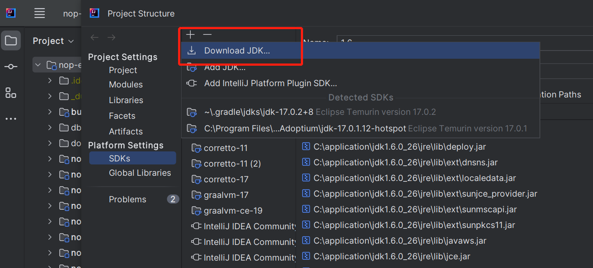
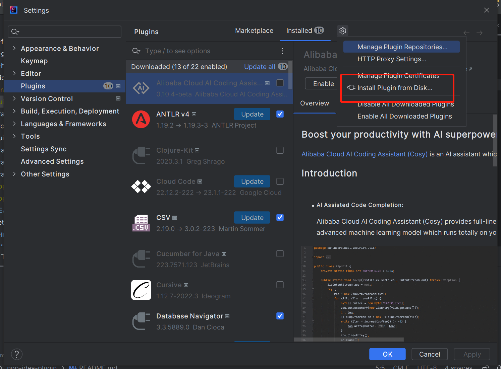

# 安装JDK

nop-chaos编译需要JDK11以上版本。 可以下载比较新的IDEA开发工具: [Download](https://www.jetbrains.com/idea/download/#section=windows)

也可以通过菜单File/Project Structure/SDKS/Download SDK下载指定JDK版本。



## 编译插件

```
cd nop-idea-plugin
gradlew buildPlugin
```

编译出来的插件存放在build/distributions目录下

## 安装插件

编译nop-idea-plugin插件项目之后，点击 File/Settings/Plugins/Install Plugins From Disk菜单进行安装



## 识别文件类型

为了激活nop-idea-plugin插件的作用，文件类型必须是XLang DSL。可以点击菜单 File/Settings/Editor/File Types， 为XLang DSL增加文件名匹配模式。


## 清空缓存

插件使用过程中，如果IDEA异常关闭，可能导致文件索引损坏，插件无法正常工作。此时可以点击菜单 File/Invalidate Caches清空缓存，重建索引。


## 更新 IDEA 之后，插件报错：Plugin 'Nop Entropy' (version '*') is not compatible with the current version of the IDE, because it requires build * or older but the current build is *。

这是因为插件的版本号不兼容当前IDEA版本。可以通过修改 [build.gradle.kts](https://gitee.com/canonical-entropy/nop-entropy/blob/master/nop-idea-plugin/build.gradle.kts) 文件，将插件的版本号修改为当前IDEA版本号，之后重新编译插件。

```
patchPluginXml {
    sinceBuild.set("211")
    untilBuild.set("233.*")  // 修改为当前IDEA版本号
}
```
