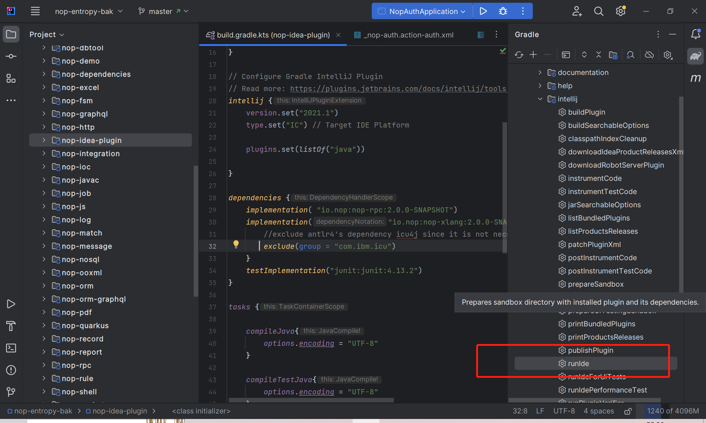

# 关联Gradle工程

nop-idea-plugin工程是Gradle工程，在IDEA中可以鼠标右键点击文件build.gradle.kts，选择Link Gradle Project菜单

## 调试

导入Gradle工程之后，可以在Gradle任务的管理窗口中，选择Tasks/intellij/runIde任务，右键选择调试插件。
IDEA会启动一个新的应用实例进行调试。

## 插件功能

## 语法校验

XLangAnnotator负责检查XML文件是否符合xdef元模型定义

## 语法提示

XLangCompletionContributor会根据xdef元模型定义，提示标签名、属性名、属性值等

## 快速文档

鼠标悬停在标签名、属性名、属性值上的时候，会提示xdef元模型中定义的描述信息。实现类为 XLangDocumentationProvider。

## 链接跳转

CTRL+鼠标悬停时会提示跳转到关联位置。XLangFileDeclarationHandler负责识别虚拟文件路径和XPL标签定义，并实现跳转。

## 断点调试

XLangDebugExecutor负责增加与Debug/Run平级的调试执行按钮。

XLangDebuggerRunner负责启动调试器。具体实现方式是被调试程序启动一个RPC服务，对外暴露io.nop.api.debugger.IDebugger接口，在IDEA插件中通过远程RPC机制调用此接口，并接收返回消息。

## 虚拟文件系统

Nop平台中通过单例对象VirtualFileSystem来访问虚拟文件系统，同时通过单例对象ResourceComponentManager来加载并缓存模型文件。

因为IDEA运行时可能打开多个Project，针对每个Project，nop-idea-plugin插件都必须建立独立的缓存。
因此，在NopAppListener中对VirtualFileSystem/ResourceComponentManager/DictProvider等单例对象都注册了特殊的实现。它们会ProjectEnv类查找上下文环境中的Project对象，然后从中获取到NopProjectService服务，再利用该服务中的缓存来实现功能。
