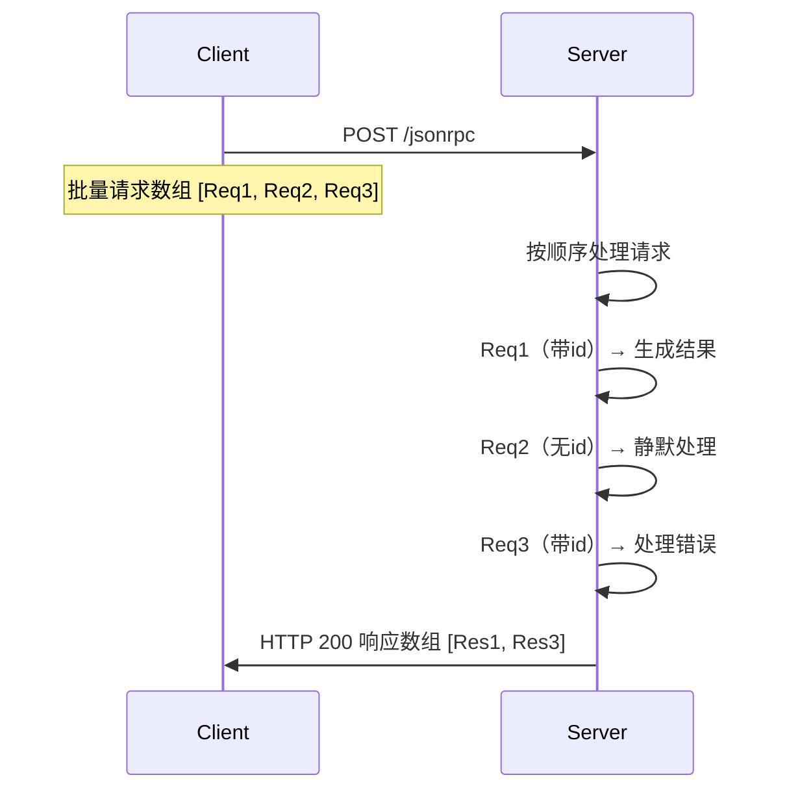

# JsonRpc调用协议

通过`/jsonrpc`链接可以使用JsonRpc协议进行远程调用。NopGraphQL对于JsonRPC做了如下扩展：

* id固定使用String类型，且如果为null，则认为不存在
* JsonRpcResponse.Error可以增加errorCode扩展属性，对应于ApiResponse中的code，而JsonRpcResponse.Error中的code对应于ApiResponse的status
* JsonRpcRequest可以增加selection扩展属性，它对应于ApiRequest中的FieldSelectionBean，用于支持GraphQL字段选择
* method对应于NopGraphQL中的operationName，比如`NopAuthUser__findPage`
* 如果params是数组类型，则会被作为名称为params的参数传递。NopGraphQL要求服务函数的每个参数都必须按名称传递，所以并不直接支持按照位置传递的参数，需要包装为一个命名参数。

以下是DeepSeek对于JSON-RPC协议的说明。

## 1. 基础协议

### 1.1 请求格式

```
{
  "jsonrpc": "2.0",
  "method": "method_name",
  "params": [
    arg1,
    arg2
  ]
  | {  "key": "value"  },
  "id": "unique_identifier"
}
```

**字段说明**:

- `jsonrpc` (必填): 固定值 `"2.0"`
- `method` (必填): 调用的方法名（字符串）
- `params` (可选): 参数（数组或对象格式）
- `id` (可选): 请求标识符（数值/字符串/null），省略时为通知请求

### 1.2 响应格式

```json
{
  "jsonrpc": "2.0",
  "result": "response_data",
  "error": {
    "code": -32600,
    "message": "Invalid Request",
    "data": {}
  },
  "id": "corresponding_id"
}
```

**字段互斥性**:

- `result` 与 `error` 必须二选一
- `id` 必须与请求中的标识符一致

## 2. 批量调用 (Batch)

### 2.1 请求格式

通过 **JSON 数组** 发送多个请求对象：

```
[
  {
    Request1
  },
  {
    Request2
  },
  ...
]
```

**核心规则**:

1. **数组结构**：必须为顶级 JSON 数组
2. **混合请求**：可包含带 `id` 的请求和通知请求
3. **顺序保证**：服务端必须按请求顺序返回响应
4. **空请求限制**：空数组 `[]` 视为无效请求

### 2.2 请求示例

```json
[
  {
    "jsonrpc": "2.0",
    "method": "getBalance",
    "params": [
      "0x742d35Cc6634C0532925a3b844Bc454e4438f44e"
    ],
    "id": 1
  },
  {
    "jsonrpc": "2.0",
    "method": "notifyLog",
    "params": {
      "event": "system_start"
    }
  },
  {
    "jsonrpc": "2.0",
    "method": "getBlock",
    "params": [
      "latest"
    ],
    "id": "block_req"
  }
]
```

### 2.3 响应格式

返回与请求顺序一致的 **JSON 数组**，仅包含带 `id` 的请求结果：

```
[
  {
    Response1
  },
  {
    Response3
  }
]
```

**响应示例**：

```json
[
  {
    "jsonrpc": "2.0",
    "result": "0x123acb",
    "id": 1
  },
  {
    "jsonrpc": "2.0",
    "error": {
      "code": -32601,
      "message": "Method not found"
    },
    "id": "block_req"
  }
]
```

## 3. 协议执行规则

### 3.1 处理流程



### 3.2 错误处理

| 错误场景     | 响应处理                     |
|----------|--------------------------|
| 单个请求参数错误 | 对应响应返回错误对象，其他请求正常处理      |
| 整个请求格式非法 | 返回顶层错误（HTTP 400），不处理任何请求 |
| 服务端处理崩溃  | 返回已处理请求的响应，后续请求标记为内部错误   |

## 4. 传输层要求

```http
POST /jsonrpc HTTP/1.1
Host: api.example.com
Content-Type: application/json
Content-Length: 187

[BATCH_REQUEST]
```

