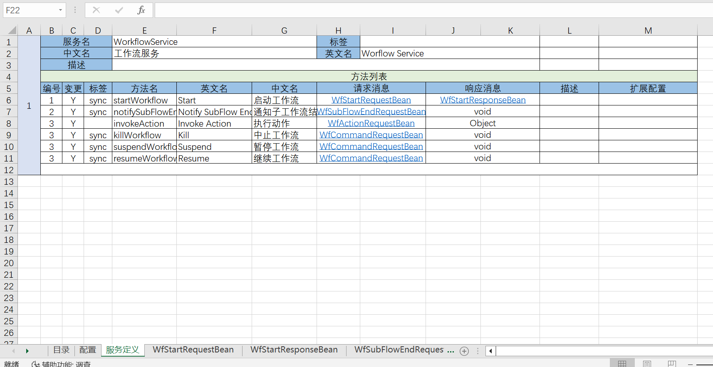

# 低代码平台中的分布式RPC框架(约3000行代码)

RPC是分布式系统设计中不可或缺的一个部分。国内开源的RPC框架很多，它们的设计大都受到了dubbo框架的影响，核心的抽象概念与dubbo类似。从今天的角度上看，dubbo的设计已经过于繁琐冗长，如果基于现在的技术环境，重新审视RPC框架的定位和设计，我们可以得到更简单、扩展性更好的实现方案。本文将介绍Nop平台中的NopRPC框架的设计思想和具体实现，它充分利用了成熟的技术设施，如IoC容器、JSON序列化、GraphQL引擎、Nacos注册中心、Sentinel熔断限流器等，通过大概3000行代码即可实现一个具备实用价值的分布式RPC框架。NopRPC具有如下特点：

1. **可以将NopGraphQL服务封装为普通的强类型的RPC接口，同时保留GraphQL的响应字段选择能力**

2. **可以将任意支持单向信息发送和接收的消息接口封装为等待响应消息的RPC接口**

3. **Http、Socket、WebSocket、消息队列、批处理文件等都只是一种接口形式，通过配置可以将同一个服务实现适配到多种不同的接口形式**

4. **支持取消正在执行的RPC调用，取消时可以调用远程服务上的cancelMethod**

5. **支持将配对的startTask和checkTaskStatus两个调用封装为一个异步RPC接口**

6. 支持灰度发布。可以在网关处设置路由选择header，直接控制后续调用链路中的服务路由。

7. 支持广播式调用、选主调用（只调用选举得到的主服务器），以及指定服务器调用（直接指定被调用服务的地址和端口）

8. 利用NopTcc引擎实现分布式事务

9. 利用NopTask引擎实现服务端的低代码模型驱动开发

10. 支持端到端的RPC超时控制

11. 支持国际化多语言消息

12. 支持错误码映射（例如将多个内部错误码统一映射为同一个外部错误码或者将同一个错误码根据错误参数不同映射为不同的外部错误码和错误消息）

13. 支持云原生的服务网格

14. 支持GraalVM原生应用编译

NopRPC的具体使用文档参见[rpc.md](rpc.md)

## 一. 请求和响应消息设计

RPC的核心功能是发送请求消息和接收响应消息，所以请求消息和响应消息的结构是RPC中的一项关键性设计。NopRPC框架中的消息结构定义如下：

```java
class ApiRequest<T>{
    Map<String,Object> headers;
    T data;
    FieldSelectionBean selection;
    Map<String,Object> properties;
}

class ApiResponse<T>{
    Map<String,Object> headers;
    int status;
    String code;
    String msg;
    T data;
}
```

1. 根据可逆计算原理，Nop平台中所有的核心数据结构都要采取（data, metadata)这种配对的结构设计，在metadata中可以存放data之外的扩展数据，因此我们为消息对象增加了headers字段，在传输时可以映射到底层信道支持的headers字段，例如通过http传输时headers对应于http的headers，而通过Kafka消息队列传输时，对应于Kafka消息的headers。

2. GraphQL的一个特别之处是支持调用端选择返回哪些数据，这样可以减少返回的数据量并可以优化服务端数据处理过程。**ApiRequest增加的selection字段将这种能力扩展到了所有RPC调用过程**。

3. headers是与data一起被发送到远端的扩展数据，除了这些扩展数据之外，我们经常还需要使用一些仅存在于当前处理过程中的扩展对象，例如responseNormalizer等，因此ApiRequest中定义了一个properties扩展数据集合，它不支持json序列化，可以用于存放那些不需要被发送到远端的临时数据。

4. NopRPC对错误码和错误消息的处理进行了统一规范化，前端页面的Ajax请求直接使用ApiResponse返回消息格式，统一了RPC和Web请求的输入输出规范。具体错误码规范参见[error-code.md](../error-code.md)

5. 为了支持可以通过命令行调用RPC服务，ApiResponse通过整数类型的status字段来表示是否调用成功。如果调用成功，则返回0。作为命令行程序被调用时，status可以直接被映射为命令行的返回值。

一般的RPC框架中，Request和Response消息往往会包含大量实现细节，导致它们仅限于在框架实现层面作为内部类来使用，而NopRPC的设计则是将ApiRequest和ApiResponse通用化，在所有需要传输消息、返回信息的地方都采用统一的消息结构，实现了RPC、Web框架、消息队列、批处理服务、命令行应用等一系列接口的无缝对接。

## 二. RPC的解构

NopRPC的核心接口是IRpcService

```java
interface IRpcService{
   CompletionStage<ApiResponse<?>> callAsync(String serviceMethod, 
           ApiRequest<?> request, ICancelToken cancelToken);
}

interface ICancelToken{
   boolean isCancelled();
   String getCancelReason();
   void appendOnCancel(Consumer<String> task);
}
```

通过以上接口定义，我们可以获知如下信息：

1. NopRPC是一个面向异步处理的框架，而且它支持取消机制

2. ApiRequest和ApiResponse都是POJO对象，框架本身没有任何运行时假定，因此可以脱离Web环境以及Socket环境来使用。

> 现在有些RPC框架采用ReactiveStream的设计，每个RPC请求可能产生多个响应消息，并且支持通过RPC来下载大附件。但是在Nop平台中，RPC的定位就是实现应用之间一对一的信息交换：每发送一个请求消息，接收且必然接收到唯一的一个响应消息。因为按照ReactiveStream方式来实现RPC会导致服务端和客户端的管理控制变得更加复杂，而在实际使用过程中大部分情况下却用不到多个返回消息的情况。另外，在消息系统的抽象中，本身就提供了发送和接收消息流的功能，如果通过RPC再次暴露类似的功能就显得有些多余。至于大文件的上传下载现在一般都是封装为单独的文件服务，可以专门定义针对云存储优化的接口，也没有必要在RPC框架中再提供类似的功能。

## 2.1 RPC over GraphQL

一般的RPC服务端都是根据消息类型直接映射到某个服务方法，然后所有业务处理都在这个消息服务函数中执行。但是在Nop平台中，RPC调用在服务端会将消息投递给NopGraphQL引擎，然后由GraphQLExecutor负责协调组织多个DataLoader协同工作。例如在服务端我们实现了如下BizModel

```java
@BizModel("MyEntity")
public class MyEntityBizModel{
    @BizQuery
    public List<MyEntity> findList(@RequestBean MyRequestBean request,             
             FieldSelectionBean selection){
        //....
    }

    @BizLoader("children")
    @GraphQLReturn(bizObjName = "MyEntity")
    public List<MyEntity> loadChildren(@ContextSource MyEntity entity) {
        //...
        return children;
    }
}

class MyEntity{
   private String name;
   private List<MyEntity> children;

   public String getName(){
      return name;
   }

   @LazyLoad
   public List<MyEntity> getChildren(){
      return children;
   }
}
```

以上代码中，我们在服务端定义了一个业务对象MyEntity，并对外提供了一个查询服务函数`MyEntity__findList`，这个查询函数会返回MyEntity对象列表， MyEntity对象上的children属性为延迟加载属性，除非明确指定，否则它并不会自动返回给前端。而加载children属性时会触发MyEntityBizModel上的loadChildren函数。借助于这种设计，我们可以将一个庞大复杂的领域对象模型暴露为统一的RPC接口服务，而不用担心无关信息过多影响性能。
在客户端我们可以使用如下接口来调用：

```java
@BizModel("MyEntity")
interface MyEntityService{
   @BizQuery
   CompletionStage<ApiResponse<List<MyEntity>>> findListAsync(ApiRequest<MyRequestBean> request, ICancelToken cancelToken);

   @BizQuery
   List<MyEntity> findList(@RequestBean MyRequestBean request);
}
```

多个Java方法可以映射到同一个后台服务调用，可以同时支持同步调用和异步调用。一般情况下约定异步调用方法名的后缀为Async，返回类型为CompletionStage。如果不需要设置selection和headers，我们也可以使用普通java对象作为输入参数, 返回普通的Java对象，出错时会自动将ApiResponse中的错误码和错误消息包装为NopRebuildException对外抛出。

Java接口通过Aop Proxy会被转换为对IRpcService接口的调用，以上方法调用将会被转换为

```
  rpcService.callAsync("MyEntity__findList", apiRequest, cancelToken)
```

对应于前端的REST请求格式如下：

```
POST /r/MyEntity__findList?@selection=a,b,children{a,b}
{
    json body 
}
```

通过内置的@selection参数可以为REST请求补充响应字段选择能力

NopGraphQL引擎本质上采用的是框架中立的设计，相当于是针对POJO的Request对象的一种纯逻辑处理函数，没有任何特定的运行时依赖，因此包装为RPC接口之后可以适配到各类输入输出信道上。例如作为批处理文件的处理函数，通过配置读取批处理文件的每一行，构造为ApiRequest对象后调用对应的GraphQL服务。

关于NopGraphQL引擎更进一步的介绍可以参见[graphql-java.md](../graphql/graphql-java.md)

## 2.2 RPC over Message Queue

很多RPC框架在实现层面都会引入大量内部接口，这些接口仅对该RPC框架有意义，无法在RPC框架之外作为一般应用接口来使用。NopRPC非常强调概念层面的抽象性和通用性，提供了[MessageRpcClient](https://gitee.com/canonical-entropy/nop-entropy/blob/master/nop-network/nop-rpc/nop-rpc-core/src/main/java/io/nop/rpc/core/message/MessageRpcClient.java)和[MessageRpcServer](https://gitee.com/canonical-entropy/nop-entropy/blob/master/nop-network/nop-rpc/nop-rpc-core/src/main/java/io/nop/rpc/core/message/MessageRpcServer.java)等缺省实现，可以在任意消息队列的基础上建立RPC调用机制。
消息队列在Nop平台中的定位就是单向信息发送，它的核心抽象接口如下：

```java
interface IMessageService{
     CompletionStage<Void> sendAsync(String topic, Object message,  
                   MessageSendOptions options);

    /**
     * 响应消息发送到一个相关的topic上
     *
     * @param topic 请求消息所属的topic
     * @return reply消息所对应的队列
     */
    default String getReplyTopic(String topic) {
        return "reply-" + topic;
    }

    IMessageSubscription subscribe(String topic, IMessageConsumer listener, 
            MessageSubscribeOptions options);
}
```

基于消息队列实现RPC客户端的做法如下：

1. 在ApiRequest的header中增加nop-id唯一标识，设置nop-svc-action为服务方法标识
2. 在实际发送前将消息注册到waiting队列中
3. 发送消息到topic并监听reply topic
4. 从reply topic接收到响应或者超时发生时从waiting队列中取到CompletableFuture对象，并设置返回结果。

服务端实现比较简单：

1. 监听topic并对接收到的ApiRequest消息调用本地的IRpcService服务实现
2. 对rpcService返回的ApiReponse对象，设置nop-rel-id这个header的值为ApiRequest中的nop-id。
3. 将ApiResponse发送到reply topic。

这个消息队列的实现非常通用。比如说[nop-rpc-simple](https://gitee.com/canonical-entropy/nop-entropy/tree/master/nop-rpc/nop-rpc-simple)模块将Socket信道抽象为IMessageService服务，实现了基于TCP进行简单RPC调用的机制。此外我们还可以基于Kafka或者Pulsar等消息队列实现RPC，或者利用Redis的PUB/SUB机制来实现。

**再次强调一下[IMessageService](https://gitee.com/canonical-entropy/nop-entropy/blob/master/nop-kernel/nop-api-core/src/main/java/io/nop/api/core/message/IMessageService.java)是Nop平台在应用层提供的对消息服务的统一抽象接口，并不是专为RPC内部实现所设计的一种专用接口**。

NopRPC这一双向信息交互抽象可以建筑在单向的消息流抽象之上，有趣的是，我们也可以反过来，基于IRpcService抽象来提供IMessageService接口的实现。具体参见 [RpcMessageSender,java](https://gitee.com/canonical-entropy/nop-entropy/blob/master/nop-network/nop-rpc/nop-rpc-core/src/main/java/io/nop/rpc/core/message/RpcMessageSender.java)和[RpcMessageSubscriber.java](https://gitee.com/canonical-entropy/nop-entropy/blob/master/nop-network/nop-rpc/nop-rpc-core/src/main/java/io/nop/rpc/core/message/RpcMessageSubscriber.java)。这种我中有你，你中有我的现象在数学推理中非常常见，它体现出IRpcService和IMessageService都是某种类似数学概念的通用抽象。

基于这种通用抽象，NopRPC的实现非常简洁、通用，而很多RPC框架的实现都和底层的Netty交换信道深度绑定，无法轻易应用到新的交换信道上。

## 二. 负载均衡设计

分布式RPC最核心的价值就在于它提供了自定义的客户端负载均衡机制，从而可以利用集群冗余来扩展系统吞吐能力。分布式RPC的其他部分主要是为了运行负载均衡算法所做的准备工作。

NopRPC客户端执行逻辑的伪代码如下：

```javascript
// 利用服务发现机制获取到所有可用的服务实例
List<ServiceInstance> instances = discoveryClient.getInstances(serviceName);

List<ServiceInstance> filtered = new ArrayList<>(instances);
// 过滤掉所有不符合匹配条件的服务实例
for(IRequestServiceInstanceFilter filter: filters){
    // 先按照比较严格的规则进行过滤，比如只选择在同一个zone中的服务器
    filter.filter(filtered, request, false);
}

// 如果没有匹配的服务实例，则尝试按照比较宽松的规则进行过滤
if(filtered.isEmpty()){
    filtered = new ArrayList<>(instances);
    for(IRequestServiceInstanceFilter filter: filters){
       filter.filter(filtered, request, true);
    }
}

// 利用负载均衡算法从所有可选的服务实例中随机选择一个
ServiceInstance selected = loadBalance.choose(filtered,request);
IRpcService rpcService = rpcClientInstanceProvider.getRpcClientInstance(selected);
CompletionStage<ApiResponse> response = rpcService.callAsync(
     serviceMethod, request, cancelToken);
```

本质上是先执行路由过滤逻辑，只保留符合匹配条件的路由条目，然后再执行负载均衡算法实现最终选择。

## 失败重试

如果配置了nop.rpc.cluster-client-retry-count(缺省值是2)，则当连接服务端失败时会自动从备选列表中删除连接失败的服务器，然后重新运行负载均衡算法选择一个实例，重新建立连接。

> 目前只有连接失败才会重试（抛出NopConnectException），其他失败情况并不会导致重试。

对应的伪代码为:

```javascript
 Exception error = null;
 for (int i = 0; i <= retryCount; i++) {
     ServiceInstance instance = loadBalance.choose(instances, request);
     try {
         return getRpcClient(instance, request).call(serviceMethod, request, cancelToken);
     } catch (Exception e) {
         error = e;

         if (!isAllowRetry(e)) {
             break;
         }

         if (instances.size() > 1) {
            // 删除刚才出错的连接，然后重试
            instances.remove(instance);
         }
     }
 }
 throw NopException.adapt(error);
```

## 灰度发布

灰度发布可以看作是一种路由逻辑，即满足某些条件的请求只会路由到指定的服务实例。在NopRPC中我们可以利用[TagServiceInstanceFilter](https://gitee.com/canonical-entropy/nop-entropy/blob/master/nop-cluster/nop-cluster-core/src/main/java/io/nop/cluster/chooser/filter/TagServiceInstanceFilter.java)和[RouteServiceInstanceFilter](https://gitee.com/canonical-entropy/nop-entropy/blob/master/nop-cluster/nop-cluster-core/src/main/java/io/nop/cluster/chooser/filter/RouteServiceInstanceFilter.java)来实现灰度发布。

* 如果ApiRequest中包含nop-tags这个header，则只会选择具有指定标签的ServiceInstance。例如`nop-tags=a,b`，则要求ServiceInstance必须同时具有这两个标签。
* 通过nop-svc-route这个header可以直接指定服务版本，例如nop-svc-route=ServiceA:1.0.0,ServiceB:^2.0.3表示对服务A使用版本1.0.0，而对于ServiceB，则使用2.0.3以上的版本。nop-svc-route的格式为`服务名:NPM版本定义，服务名:NPM版本定义`，版本定义采用NPM包的语义版本号规则。

## 三. 取消执行和状态轮询

NopRPC的设计并没有选择利用CompletableFuture对象上的cancel方法，因为在实践中，通过参数传递cancelToken要比返回具有cancel函数的Future对象要容易处理得多，也更容易实现性能优化。

在执行取消操作时，一般的RPC框架只是会中断当前的请求连接，并不会向服务端主动发送取消消息。而在NopRPC中，可以通过如下配置，表示当执行取消操作时主动执行服务端的一个取消方法

```java
@BizModel("MyEntity")
interface MyEntityService{
    @RpcMethod(cancelMethod="Sys__cancel")
    CompletionStage<ApiResponse<MyResponseBean>> myAction(ApiRequest<MyRequestBean> request, ICancelToken cancelToken);
}
```

`@RpcMethod(cancelMethod="Sys__cancel")`注解表示当执行取消操作时会主动调用服务端Sys对象上的cancel方法，它是一个系统缺省的取消方法，会在服务端调用cancelToken的cancel操作。如果我们需要在cancel时执行一些业务相关的代码，则可以在服务端的MyEntityBizModel上实现cancel方法，然后使用`@RpcMethod(cancelMethod="cancel")`。

> 如果cancelMethod中没有包含对象名，则表示调用当前业务对象上的方法。

具体cancelMethod的调用逻辑可以参见[CancellableRpcClient.java](https://gitee.com/canonical-entropy/nop-entropy/blob/master/nop-network/nop-rpc/nop-rpc-core/src/main/java/io/nop/rpc/core/composite/CancellableRpcClient.java)

除了cancelMethod之外，RpcMethod注解还支持配置pollingMethod。

```java
interface MyEntityService{
   @RpcMethod(pollingMethod="checkTaskStatus")
   CompletionStage<ApiResponse<TaskResultBean>> startTask(
          ApiRequest<StartTaskRequestBean> request);
}
```

如果配置了pollingMethod，则当执行RPC方法之后不会立刻返回，而是不断调用pollingMethod对应的远程服务，直到返回结果信息。

具体pollingMethod的处理逻辑参见 [PollingRpcClient.java](https://gitee.com/canonical-entropy/nop-entropy/blob/master/nop-network/nop-rpc/nop-rpc-core/src/main/java/io/nop/rpc/core/composite/PollingRpcClient.java)

## 四. 上下文传播

在微服务架构下，一次业务操作可能会产生多个相关联的RPC调用，必须要建立一种自动的上下文传播机制，将一些共享的信息从上游的服务传播到下游的服务。在NopRPC的具体实现中[ContextBinder](https://gitee.com/canonical-entropy/nop-entropy/blob/master/nop-network/nop-rpc/nop-rpc-api/src/main/java/io/nop/rpc/api/ContextBinder.java)负责将ApiRequest的部分header信息复制到异步上下文对象IContext上，而[ClientContextRpcServiceInterceptor](https://gitee.com/canonical-entropy/nop-entropy/blob/master/nop-network/nop-rpc/nop-rpc-core/src/main/java/io/nop/rpc/core/interceptors/ClientContextRpcServiceInterceptor.java)负责将IContext上的信息传播到下游的ApiRequest的headers中。

缺省情况下，以下header会自动跨系统传播

|名称|说明|
|---|---|
|nop-svc-tags|灰度发布时使用的过滤标签|
|nop-svc-route|灰度发布时使用的路由信息|
|nop-tenant|租户ID|
|nop-user-id|当前登录用户|
|nop-locale|返回响应消息时使用的国际化语言|
|nop-timezone|返回消息中时间类型的字段所对应的时区|
|nop-txn-id|分布式式事务所对应的事务id|
|nop-txn-branch-id|分布式事务的分支事务id|
|nop-trace|入口服务所分配的traceId，用于将一系列相关的RPC调用关联在一起|
|nop-client-addr|客户端的真实ip和端口|
|nop-timeout|端到端的超时控制所需要的超时时间参数|

## 端到端的超时控制

NopRPC的nop-timeout消息头表示的是整个RPC调用的超时时间，因此当它传播到下一个RPC调用时会减去当前已经消耗的时间。例如 服务A接收到nop-timeout=1000，然后经过200ms的处理之后调用下一个RPC服务，传给下游RPC的nop-timeout=800。
在服务内部，所有耗时的操作（例如数据库查询）都会检查IContext.getCallExpireTime()是否超过当前时间。如果已超时，则直接中断，不再继续执行。通过这种方式可以减轻在系统繁忙的时候因为客户不断重试所导致的系统压力。

例如下游的服务B还在执行的过程中服务A认为它已经超时了，可能会发起重试，如果服务B没有发现自己已超时，还在继续执行未完成的操作，则可能会同时执行两个业务操作，导致系统的压力倍增。

## 五. 模型驱动开发

在Nop平台中我们提供了一个API模型，可以在Excel中定义系统对外暴露哪些服务，这些服务的请求和响应消息是什么。具体实例参见[nop-wf.api.xlsx](https://gitee.com/canonical-entropy/nop-entropy/raw/master/nop-wf/model/nop-wf.api.xlsx)



在RPC的实现层面，我们也可以直接生成对[TaskFlow](https://gitee.com/canonical-entropy/nop-entropy/blob/master/nop-kernel/nop-xdefs/src/main/resources/_vfs/nop/schema/task/task.xdef)或者[Workflow](https://gitee.com/canonical-entropy/nop-entropy/blob/master/nop-kernel/nop-xdefs/src/main/resources/_vfs/nop/schema/wf/wf.xdef)模型的调用，通过可视化编配来实现业务功能。

## 六. 关于Dubbo的设计

Dubbo框架中大量代码实现的都是辅助性的工作，从今天的角度看已经过时。

1. SPI插件加载机制。本质上相当于一个不太完善的Bean加载和装配引擎，可以直接用IoC容器来替换

2. 序列化机制。在REST的场景下可以使用通用的JSON序列化来实现，而在二进制情况下也可以直接使用现成的protostuff等编码包

3. 消息传输信道。可以直接使用JDK内置的Httpclient, 也可以直接使用IMessageService消息队列抽象。

4. Proxy代理接口。本质上是为了实现从强类型的Java对象到通用的IRpcService之间的双向转换，直接提供一个IRpcMessageTransformer接口即可隔离各种转换策略。

5. 服务注册发现。直接使用Nacos等专用的服务注册发现机制即可，不需要再对Zookeeper进行封装。

Dubbo框架中内部接口的设计也不尽合理，例如负载均衡算法接口

```java
interface LoadBalance {
    <T> Invoker<T> select(List<Invoker<T>> invokers, URL url, 
        Invocation invocation) throws RpcException;
}
```

这个设计存在如下问题：

* Invoker导致Loadblance算法和RPC的执行器产生不必要的依赖
* Invocation导致和AOP包装过程产生不必要的依赖
* URL是Dubbo引入的一个自定义的数据结构（与JDK内置的URL并不相同），相比于普通的JSON对象没有任何优势。

而在NopRPC中，负载均衡接口定义如下：

```java
interface ILoadBalance<T,R>{
     T choose(List<T> candidates, R request);
}
```

如果需要从candidate对象上读取权重配置等信息，可以使用Adapter适配器

```
public interface ILoadBalanceAdapter<T> {
    int getWeight(T candidate);

    int getActiveCount(T candidate);
}
```

通过这种抽象，负载均衡算法成为纯粹的逻辑函数，与RPC的执行逻辑完全解耦，可以应用到所有需要负载均衡算法的地方，而不仅仅限于RPC调用场景。

## 总结

NopRPC是从第一性原理出发，重新审视RPC的概念，完全重新设计的Yet Another PRC框架，它的设计非常简洁直观，易于扩展，是Nop平台的一个有机组成部分。

基于可逆计算理论设计的低代码平台NopPlatform已开源：

- gitee: [canonical-entropy/nop-entropy](https://gitee.com/canonical-entropy/nop-entropy)
- github: [entropy-cloud/nop-entropy](https://github.com/entropy-cloud/nop-entropy)
- 开发示例：[docs/tutorial/tutorial.md](https://gitee.com/canonical-entropy/nop-entropy/blob/master/docs/tutorial/tutorial.md)
- [可逆计算原理和Nop平台介绍及答疑\_哔哩哔哩\_bilibili](https://www.bilibili.com/video/BV1u84y1w7kX/)
