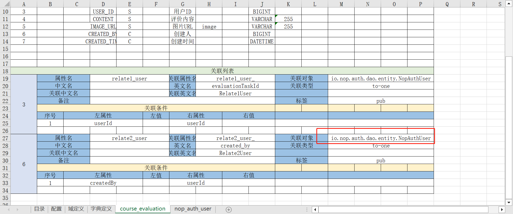
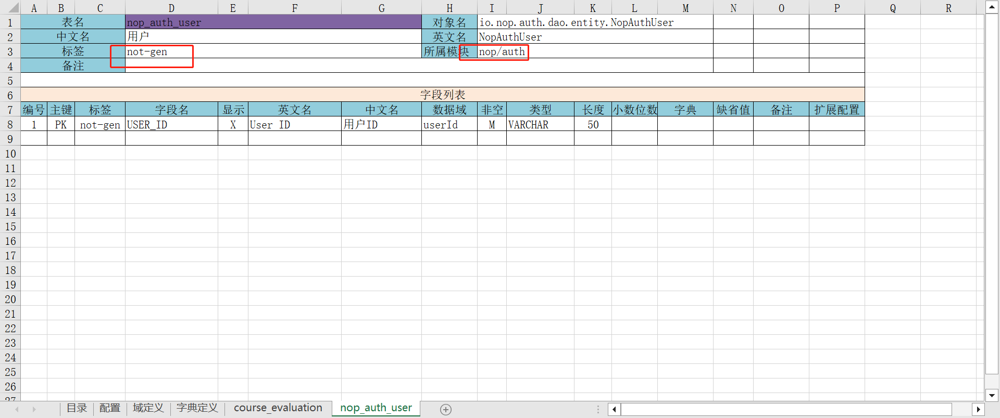

# Excel数据模型

通过Excel格式的文档可以配置数据模型。数据模型的具体结构由[orm.imp.xml](https://gitee.com/canonical-entropy/nop-entropy/blob/master/nop-orm/src/main/resources/_vfs/nop/orm/imp/orm.imp.xml)导入模型文件来定义。

在Nop平台中，无需手工编程，只需要增加`imp.xml`配置文件，即可实现对Excel文件的解析。例如[Api模型](api-model.md)也是采用同一机制实现。

`imp`导入规范对于Excel格式的要求相对比较灵活，并不依赖于字段出现的前后顺序，非必填的字段如果不需要设置可以直接从模板中删除。
只需要满足如下两条规则即可采用`imp`模型来实现解析：

1. 普通字段的布局应该是 `字段名 - 字段值`，即字段名所在单元格的右侧为字段值
2. 列表字段的字段名字段的下方为它的值的列表，列表的第一列必须是序号列，其中为数字格式。注意字段名所在的单元格必须能够覆盖它的所有列。

## 配置

* `registerShortName`：实体名为包含包名的全类名，如果`registerShortName`设置为`true`，则也可以通过去除包名的短类名来访问实体
* `appName`：所有子模块的前缀名，**格式必须为 `xxx-yyy`，例如`nop-sys`**，它会自动成为虚拟文件系统中的两级子目录名，如，`src/resources/_vfs/nop/sys`，并且平台限制其只能为两级，以控制模块扫描的范围。Excel模型的名称应该与`appName`相同（即，Excel文件名称需命名为`${appName}.orm.xlsx`），否则自动生成`codegen`模块中的配置会不正确
* `entityPackageName`：实体对象所在的包名，一般应该是`xxx.dao.entity`，例如`io.nop.sys.dao.entity`
* `basePackageName`：所有子模块的父包名, 例如 `io.nop.sys`
* `maven.groupId`：主工程的`groupId`
* `maven.artifactId`：主工程的`artifactId`
* `maven.version`：主工程以及所有子模块的版本号
* `platformVersion`：Nop平台的版本号
* `dialect`：生成对应数据库的建表语句，可以是逗号分隔的多个名称，例如 `mysql,oracle,postgresql`
* `deltaDir`：仅在差量化数据模型中使用，用于指定生成到哪个delta定制目录下
* `allowIdAsColName`: 允许列名为id。缺省情况下id保留为主键使用，凡是以id为列名的，对应在java中的属性名都会被自动重命名为id_。如果设置了这个选项，则保留为id。但是需要注意，在Nop平台中id是固定暴露给主键使用的。

## 数据域

数据域(`domain`)的概念类似于PowerDesigner设计工具中的`domain`概念，它可以为反复出现的、具有一定业务含义的字段定义提供一个可以被复用的名称。

1. 一般情况下设置了数据表中字段的类型定义应该与指定的数据域保持一致。例如数据域`json-1000`的数据类型为`VARCHAR`，长度为`1000`，则使用了这个数据域的字段也应该设置类型为`VARCHAR`，长度为`1000`。如果不一致，则模型验证的时候会提示。

2. 标准域是Nop平台中在`StdDomainRegistry`中注册的标准业务数据类型，例如`var-name`表示必须是合法的Java变量名等。

3. 代码生成的时候会特殊识别如下数据域: `version`、`createTime`、`createdBy`、`updateTime`、`updatedBy`、`delFlag`、`tenantId`。标记了这些数据域的字段会被自动识别为ORM引擎所支持的乐观锁字段、创建时间字段等。

4. 生成`meta`文件的时候，会自动生成为`schema`节点的`domain`属性。在前台布局引擎中会自动映射到`control.xlib`中定义的显示和编辑控件。例如 `domain=phone`会对应于控件`<edit-phone/>`

## 字典表

## 数据表作为字典表

* 在数据表上增加标签`dict`，表示它可以作为字典表来使用。字典表的数据量不应该很大，一般会使用下拉列表来显示。
* 然后通过`obj/{objName}`来引用这个数据表来作为字典。例如 `obj/LitemallBrand`

## 在【字典定义】中增加字典表

这里定义的字典表在生成代码的时候会生成静态字典文件到`{appName}-dao/src/main/resources/_vfs/nop/dict`目录下。

* 名称：字典表的引用名称，例如 `mall/order-status`
* 中文名、英文名：字典的显示名称
* 值类型：字典值的类型，一般是`int`或者`string`

字典项配置中：

* 值：字典项的`value`

* 名称：字典项的`label`

* 代码：如果配置了这个属性，则会在`DaoConstants`常量类中生成一个常量定义，例如`mall/order-status`中`CREATED`代码对应于生成

```java
public interface _AppMallDaoConstants {

  /**
    * 订单状态: 未付款
    */
  int ORDER_STATUS_CREATED = 101;
  ...
}
```

## 数据表

表名会直接按照驼峰规则映射为GraphQL中的对象名，所以表名原则上需要全局唯一（不同模块之间的表名不应该冲突）。建议每个模块具有自己特殊的表名前缀，比如`litemall_xxx`,`nop_wf_xxx`等。
Nop平台内置的表名都具有前缀`nop_`。

## 数据表标签

* `dict`：标记为字典表，其他地方可以通过`obj/{objName}`来将该表的数据作为字典表来使用
* `mapper`：为该表生成类似MyBatis的Mapper定义文件和Mapper接口类。
* `no-web`：后台使用的数据对象，不为它单独生成前台页面入口
* `no-tenant`: 全局开启租户支持时，本表也不自动启用租户过滤，例如nop\_auth\_user表和nop\_auth\_tenant表
* `kv-table`：标记当前实体需要实现`IOrmKeyValueTable`接口。这个接口要求表中必须具有`fieldName`、`fieldType`、`stringValue`等字段，具体参考`nop_sys_ext_field`表的字段设计。
* `use-ext-field`：为当前实体增加扩展字段支持，将扩展字段值以数据行的形式保存到`nop_sys_ext_field`表中。关于扩展字段详细介绍参见[ext-field.md](../orm/ext-field.md)
* `many-to-many`：标注是多对多关联的中间表，根据此标签会在Java实体上生成多个帮助函数，用于自动处理多对多关联。参见[many-to-many.md](../orm/many-to-many.md)
* `not-gen`：表示是其他模型中定义的表，当本模型生成代码的时候不需要针对此表生成实体定义
* `view`：只读表，不允许新增、修改和删除
* `log`：日志表，不允许新增和修改。新增由后台程序自动进行，只允许删除操作
* `not-pub`：表示不会参与GraphQL层的对象构建，不暴露给外部

## 字段标签

* `seq`：利用`SequenceGenerator`来自动生成主键，Nop内置实现类`UuidSequenceGenerator`和`SysSequenceGenerator`（在`/_vfs/nop/orm/beans/orm-defaults.beans.xml`中id为`nopSequenceGenerator`的bean上指定默认的生成器），当字段类型为字符串时，二者均默认生成UUID，若字段为数字，则默认生成随机数。如果`SysSequenceGenerator`禁用UUID，则其将使用`nop_sys_sequence`表来记录递增的整数序列，并在字段为字符串时取其字符串形式作为该字段的值。
  在nop\_sys\_sequence表中，可以为每个实体指定自己的sequence，名称为{entityName}@{colPropName}

* `seq-default`：与seq的区别在于，如果在nop\_sys\_sequence表中如果不存在针对指定实体字段的sequence，则会自动选择名称为default的sequence。配置项 `nop.sys.seq.default-seq-init-next-value` 可以设置名称为 default 的 sequence 的起始值，缺省为 `1`。

* `var`：表示随机生成的变量。在自动化测试框架中，这个字段将被记录为变量，录制到数据文件中时会被替换为变量名保存。例如`NopAuthUser`表的`userId`字段，新建用户时自动录制的`nop_auth_user.csv`中，`userId`列的值为 `@var:NopAuthUser@userId`

* `disp`：数据记录的显示名称。在字典表或者选择列表中会作为`label`被使用。若未在其他列上标记`disp`，则默认以主键作为显示名称。

* `parent`：表示该列是否为父级属性。若标记为`parent`，则默认会在前端列表的`操作`列的`更多`中提供`添加下级`的下拉菜单项，用于直接添加子级数据。若是在【关联列表】中同时指定了该列的【关联属性名】，则默认会在前端列表中以树结构展示父子数据。

* `masked`：表示打印到log中时需要掩码。

* `not-pub`：表示不会返回到前台。

* `sort`：表示列表的缺省排序字段, `sort-desc`表示缺省按照此字段的降序排序。生成meta的时候对应于`orderBy`段。

* `not-gen`：仅在差量化模型中使用，表示会从基类中继承字段定义，不会为此字段生成Java属性。

* `del`：仅在差量化模型中使用，表示在ORM模型中删除字段定义，从而访问数据库时不会使用此字段，生成的建表语句也不包含此字段。

* `clock`: 标记字段根据调用时刻的时钟来动态确定，因此在自动化单元测试录制时需要记录为变量。

## 字段显示

代码生成的时候会在`view.xml`页面结构文件中自动生成列表和表单布局定义。列表缺省按照模型中的字段顺序显示。表单布局如果字段个数超过10个，则按照两列显示，否则按照一列显示。

为了减少手工调整`view.xml`的工作量，可以在模型中设置最常用的一些显示控制

* `X`表示在界面上不显示，由程序内部使用，
* `R`表示只读字段，
* `C`表示不允许修改但允许插入，
* `S`表示占据单行显示，
* `L`表示在列表上不显示

## 字段数据类型

必须是`StdSqlType`中定义的类型，包括`BOOLEAN`、`TINYINT`、`INTEGER`、`BIGINT`、`CHAR`、`VARCHAR`、`DATE`、`DATETIME`、`TIMESTAMP`、`DECIMAL`、`FLOAT`、`DOUBLE`等。

## 关联属性标签

一般情况下我们只定义`to-one`类型的关联对象，它的【左对象】对应于当前表，【关联对象】对应于父表。`join`的【左属性】对应于外键属性（不是数据库字段名，而是Java中的属性名，也即字段名的驼峰命名形式），【关联属性】是父实体中对应子实体的集合属性，而`join`的【右属性】为父表的主键属性

* `pub`：关联属性缺省仅在后台编程使用，不对外暴露为GraphQL接口。标记为`pub`之后才对外暴露。
* `cascade-delete`：删除当前对象的时候，也删除关联对象。一般使用的是`ref-cascade-delete`，而不是`cascade-delete`。
* `ref-cascade-delete`：删除父表的时候自动删除子表集合对象
* `ref-insertable`：主表提交的时候允许也同时提交子表数据，一次性插入
* `ref-updatable`：主表提交的时候允许同时更新子表数据
* `ref-grid`：自动生成界面时在主表编辑页面上增加子表表格，子表数据和主表数据一起提交
* `ref-connection`: 父表上增加类似relay框架的对子表进行分页查询的Connection属性。具体功能参见[connection.md](../graphql/connection.md)

`ref-xx`表示的是在父表中对应子表的属性上所增加的标签。例如在子表的关联上增加`ref-pub`标签，对应于在`parent.children`这个属性上增加了`pub`标签。

在逆向工程时，左对象的【属性名】会根据已有数据库的字段名自动生成（对于非逆向工程，需要自行填写【属性名】）。假设当前表为`PurchaseOrder`，它具有一个字段`SUPPLIER_ID`，关联到父表 `Supplier`，则会自动为`PurchaseOrder`表生成一个
`to-one`关联，【属性名】为`supplier`（对应于Java中`Supplier#getSupplier()`方法）。【关联属性名】是父表实体中对应于子表实体的集合属性名，除非我们需要在内存中使用该集合，否则不要设置【关联属性名】。特别是当子表集合中条目数超过1000时，
在内存中操纵可能会导致消耗过多内存，同时导致性能低下。

对于目标数据库中的每一列，NopOrm都会自动生成一个对应的Java属性，属性名采用驼峰形式，例如 `SUPPLIER_ID`对应Java属性`supplierId`。同时对于关联对象属性，会根据
关联关系中涉及到的数据库列名猜测得到Java属性名。规则如下：

1. 如果字段名是`XXX_ID`，则对象属性名为 `xxx`
2. 如果字段名不是`XXX_ID`，而是`YYY`，则对象属性名为 `yyyObj`，即增加`Obj`后缀，避免和已经存在的其他属性名冲突。

> 有些人可能习惯于列名本身就对应Java属性名，例如列名 `UserName`，但是因为按照数据库规范标准，列名一般会被规范化为全大写或者全小写字符，导致在不同数据库迁移时无法识别大小写混排的情况。
> 所以Nop平台假定所有列名都要被自动转换为大写，通过下划线分隔，然后在转成Java属性时按照驼峰规则命名。

需要注意的是，按照驼峰规则转换成Java属性名时，一般情况下首字母是小写字母，但是考虑到Java Bean规范，存在特殊情况。
假设数据库列名为 `S_USER_NAME`，它对应的Java Get方法为 `String#getSUserName()`，按照JavaBean规范，除去`get`前缀后，如果连续两个字母都是大写字母，则对应Java属性名也保持首字母大写，
因此Java属性名为`SUserName`，而不是`sUserName`。

### 关联集合的排序条件
通过【排序条件】配置可以指定关联集合的排序条件，它对应于`refSet.sort`配置。例如配置nop-rule.orm.xlsx中NopAuth【排序条件】为 orderNo asc

## 外部表

有时需要引入其他模块中的实体，这时要写实体的全名，同时插入一个占位用的Sheet，在其中只定义主键即可，同时在表上增加`not-gen`标签。

比如以下`course_evaluation`表引用`nop_auth_user`表。



`nop_auth_user`表是定义在`nop-auth`模块中的，所以需要重新使用全类名来表示关联实体。同时要插入一个`nop_auth_user`表达的定义



因为是外部表，不需要为该表生成代码，所以增加`not-gen`标签。同时需要指定这个表所在的模块，`模块ID`的格式为`A/B`这种形式，对应于二级目录结构。
例如`nop-auth`这个包生成的资源文件都存放在`/_vfs/nop/auth`目录下，它对应的模块名是`nop/auth`

Excel模型中如果定义了`所属模型`这个参数，则会在自动生成`_app.orm.xml`和关联字段的meta定义中都增加`biz:moduleId`配置。

前端页面使用的控件缺省由`control.xlib`库根据meta配置来自动推定。`edit-relation`控件会调用`XuiHelper.getRelationPickerUrl`
函数来生成`picker`页面对应的链接，链接格式为  `"/" + moduleId + "/pages/" + bizObjName + "/picker.page.yaml"`。如果关联子表的meta配置中
设置了`biz:moduleId`属性，则`moduleId`以设置的值为准，否则会自动根据meta文件的路径推定它所在的模块。
