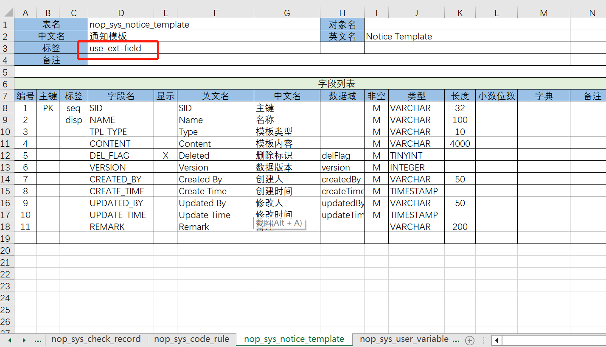

# 如何在不改表的情况下为实体增加扩展字段

[视频演示](https://www.bilibili.com/video/BV1wL411D7g7)

基于Nop平台中内置的NopOrm引擎，可以很方便的为任意实体增加扩展属性，而且这些属性支持查询和排序，在使用层面和实体内置属性完全一致。

具体做法非常简单，只需要在Excel数据模型中为数据表增加`use-ext-field`标签，即可启用全局扩展字段支持。扩展字段将保存到`nop_sys_ext_field`表中。



`nop_sys_ext_field`表的结构如下：

|列名|类型|
|---|---|
|entity\_name|VARCHAR|
|entity\_id|VARCHAR|
|field\_name|VARCHAR|
|field\_type|INTEGER|
|decimal\_value|DECIMAL|
|date\_value|DATE|
|timestamp\_value|TIMESTAMP|
|string\_value|VARCHAR|

根据`field_type`字段类型的设置，具体的字段值保存到`decimal_value`等不同的字段中。

## ORM配置

在编译期，[`<orm-gen:ExtFieldsSupport>`](https://gitee.com/canonical-entropy/nop-entropy/blob/master/nop-persistence/nop-orm/src/main/resources/_vfs/nop/orm/xlib/orm-gen.xlib)标签会识别`use-ext-field`配置，并自动生成关联属性：

```xml
<entity name="xxx.MyEntity">
    <relations>
        <to-many name="extFields" refEntityName="io.nop.sys.dao.entity.NopSysExtField" keyProp="fieldName">
            <join>
                <on leftProp="id" rightProp="entityId"/>
                <on leftValue="xxx.MyEntity" rightProp="entityName"/>
            </join>
        </to-many>
    </relations>
</entity>
```

> 一对多关联的配置中如果设置了`keyProp`，则表示这个属性是唯一标识属性。`IOrmEntitySet`集合提供了`prop_get/prop_set`等扩展方法，可以直接根据这个属性来存取对应的集合条目。

关于扩展字段的使用可以参见 [TestExtFields.java](https://gitee.com/canonical-entropy/nop-entropy/blob/master/nop-orm/src/test/java/io/nop/orm/dao/TestExtFields.java)

在Java程序中我们可以通过如下配置来访问扩展字段

```java
IOrmKeyValueTable field = (IOrmKeyValueTable)entity.getExtFields().prop_get("fldA");
entity.getExtFields().prop_set("fldA",value);
```

在XScript脚本语言中以及在EQL查询语言中 `extFields.fldA.string` 等价于 `entity.getExtFields().prop_get("fldA").getString()`

`fldA`相当于是按照`keyProp`从一对多集合对象中查找得到唯一的一条记录。

### 扩展字段别名

为了简化访问，我们可以为扩展字段增加别名

```xml
<entity>
    <relations>
        <to-many name="extFields" ... />
    </relations>

    <aliases>
        <alias name="extFldA" propPath="extFields.fldA.string" type="String"/>
        <alias name="extFldB" propPath="extFields.fldB.int" type="Integer" />
    </aliases>
</entity>
```

增加`alias`配置之后，`extFldA`和`extFldB`会成为实体上的属性，在java中可以通过`entity.prop_get(fieldName)`来获取扩展属性。
在XScript中可以通过`entity.extFldA`这种属性方式来存取，与普通实体属性完全一致。

> 如果是根据定义了`alias`的orm模型文件来生成代码，则会自动生成对应get/set方法，这样在java中我们就可以通过`entity.getExtFldA()`和`entity.setExtFldA(value)`这两个方法来访问扩展属性。
>
> 如果生成了get/set方法，就不能再使用`entity.prop_get`方法来获取属性值了。因为`prop_get`是用于获取实体上不存在的扩展属性的方法。如果希望通过统一的方式来获取实体内置字段和扩展字段，可以使用`entity.orm_propValueByName(name)`方法，或者使用`BeanTool.getProperty(entity, propName)`反射机制来获取。

不仅如此，在EQL查询语法中，可以直接使用扩展字段来进行过滤和排序，扩展字段的使用方式与实体上的内置字段完全一致

```sql
select o.extFldA
from MyEntity o
where o.extFldA = '123'
order by o.extFldA
```

利用别名机制我们可以实现扩展字段和内置字段之间的平滑过渡：初次开发的时候可以先使用扩展字段，等到性能出现瓶颈时再在实体上增加基本字段，
此时可以保持Java代码中属性名不变。

## GraphQL访问

在xmeta文件中增加`extFldA`和`extFldB`等属性的配置，即可通过GraphQL来实现扩展属性访问。

```xml
    <prop name="extFldA" displayName="扩展字段A" queryable="true" sortable="true" insertable="true" updatable="true">
        <schema type="String" domain="email" />
    </prop>
```

## 专属的扩展字段表

缺省情况下系统中所有的扩展字段都存放在`nop_sys_ext_field`表中，这样可能会导致单个表数据量过大，性能低下。为了缓解这个问题，我们可以为实体表再增加
`local-ext`标签，则系统会自动为当前实体生成一个配对的扩展字段表，扩展表表名一般为`原表名+'_ext'`，例如`nop_sys_notice_template_ext`。

扩展表的结构与`nop_sys_ext_field`类似， 只是缺少`entityName`字段，不需要按照实体名进行过滤。

## 纵表转横表

很多低代码平台为了实现动态修改数据库结构，都采用纵表来保存所有数据，而纵表转横表的做法是特殊写死的一种变换。Nop平台与此不同，
它内置的横纵表换是一个标准数学变换，不仅仅是普通的纵表，任意的一对多关联都可以被转换为一对一关联，而一对一或者多对一关联的属性在EQL层面和使用表上原生的字段完全一致。

在[TestExtFields](https://gitee.com/canonical-entropy/nop-entropy/blob/master/nop-orm/src/test/java/io/nop/orm/dao/TestExtFields.java)单元测试中

```xml
 <entity name="io.nop.app.SimsExam">

            <aliases>
                <alias name="extFldA" propPath="ext.fldA.string" type="String"/>
                <alias name="extFldB" propPath="ext.fldB.boolean" type="Boolean" notGenCode="true"/>
            </aliases>

            <relations>
                <to-many name="ext" refEntityName="io.nop.app.SimsExtField" keyProp="fieldName">
                    <join>
                        <on leftProp="id" rightProp="entityId"/>
                        <on leftValue="io.nop.app.SimsExam" rightProp="entityName"/>
                    </join>
                </to-many>

            </relations>
        </entity>
```

* 任何`to-many`关联上都可以配置`keyProp`属性，用于在集合中区分出唯一的一条记录。
* `ext.fldA.string`等价于`((IOrmEntitySet)entity.getExt()).prop_get("fldA").getString()`
* 通过别名机制，可以我们为访问扩展字段的复杂路径起一个别名。例如上面的配置中`extFldA`等价于`ext.fldA.string`。
* 标记了`notGenCode`，则生成代码的时候不会为该属性生成java中的get/set方法，获取值时需要通过`entity.prop_get("extFldB")`这种方式。

在XScript脚本或者XPL模板语言中，扩展属性和普通属性的访问语法完全相同，可以直接使用`entity.extFldB = true`这种方式。

在EQL查询语言中，也会自动识别`keyProp`，进行结构变换。

```sql
select o.children.myKey.value from MyEntity o
// 会被转换为
select u.value from MyEntity o  left join Children u on o.id = u.parent_id and u.key = 'myKey'
```

即一个集合只要具有某种唯一标识，那么数学上它就一定能够展平成为具有唯一访问路径的关联属性。而ORM引擎的EQL查询语言负责的就是把`o.a.b.c`这种关联属性转换为表关联查询。

```sql
select o.name from MyEntity o
where o.children.myKey1.intValue = 3 and o.children.myKey2.strValue like 'a%'

-- 会被变换为

select o.name from MyEntity o left join Children u1
on o.sid = u1.parent_id and u1.key = 'myKey1'
left join Children u2
on o.sid = u2.parent_id and u2.key = 'myKey2'
where u1.intValue = 3
and u2.strValue like 'a%'
```

一个一对多关联表，如果增加一个`key`过滤条件就自然变成一对一关联表了

```sql
select o.key1,o.children.myKey1.value,o.children.myKey2.value
from MyEntity o

-- 会被转换为
select o.key1, u1.value, u2.value
from MyEntity o left join Children u1 on
on o.sid = u1.parent_id and u1.key = 'myKey1'
left join Children u2
on o.sid = u2.parent_id and u2.key = 'myKey2'
```

按照规则，从`o.children.myKey`抽取出关联表，这在数学层面就是一个具有确定性的局部变换规则
