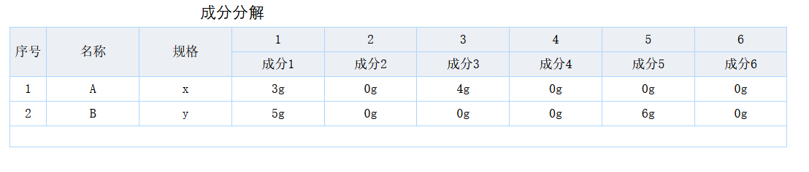
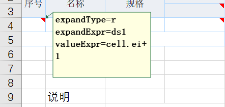
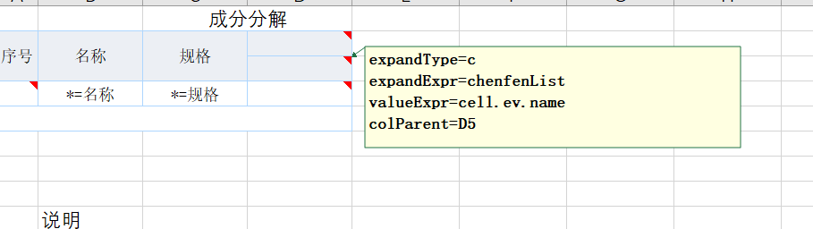
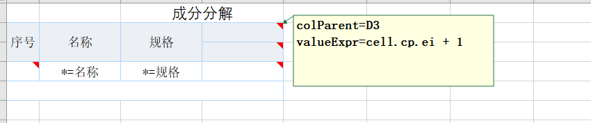

# 动态展开列

报表要求： 成分列根据预设的成分列表来显示，然后每一行如果有对应成分则显示


后台数据：

```javascript
let ds1 = [
 { "名称":"A", "规格": "x",  chenfen: [ { name: "001", weight: 3}, {name: "003", weight:4}] },
 { "名称": "B", "规格": "y", chenfen: [  { name: "001", weight: 5}, {name: "005", weight:6}]  }
];
let chenfenList = [
    {value: "001",name:"成分1" },
    {value: "002",name:"成分2" }, 
    {value: "003",name:"成分3" },
    {value: "004",name:"成分4" },
    {value: "005",name:"成分5" },
    {value: "006",name:"成分6" },
] 
```

[查看报表模板](https://gitee.com/canonical-entropy/nop-entropy/blob/master)

基本做法为：

1. 通过expandExpr可以根据指定列表展开
2. 在单元格中可以通过cell.rowParent.expandValue和cell.colParent.expandValue来获取到行列父单元格中对应的展开对象
3. 在valueExpr中可以使用Underscore中提供的集合函数进行集合查找

## 1. 在A4单元格中配置行展开



* expandType=r表示行展开
* expandExpr=ds1 表示按照数据集ds1展开
* valueExpr=cell.ei+1 表示单元格实际显示内容为 展开下标（从0开始） +1

## 2. 在D3单元格中配置列展开



* expandType=c表示列展开
* expandExpr=chenfenList 表示按照chenfenList列表展开
* valueExpr=cell.ev.name 表示实际显示的内容是展开对象的name属性
* colParent=D5 表示D5单元格是它的列父格，当D3展开的时候D5会跟随扩展

## 3. 在D2单元格中配置列父格



* colParent=D3 表示D3单元格展开的时候D2单元格会跟随复制
* valueExpr=cell.cp.ei + 1 表示D2单元格的值为 colParent.expandValue.expandIndex + 1

## 4. 在D4单元格中使用表达式获取值


\*`valueExpr=(_.findWhere(cell.rp.ev.chenfen,"name",cell.cp.ev.value)?.weight || 0) + 'g'`
表示使用[Underscore](https://gitee.com/canonical-entropy/nop-entropy/blob/master/nop-kernel/nop-core/src/main/java/io/nop/core/lang/utils/Underscore.java)类上的findWhere函数，从chenfen列表中查找到name为指定值的对象，然后显示它的weight属性。
在报表表达式中可以使用所有XLang语言内置的函数和对象，并且可以在【展开前】段中定义可使用的局部函数
