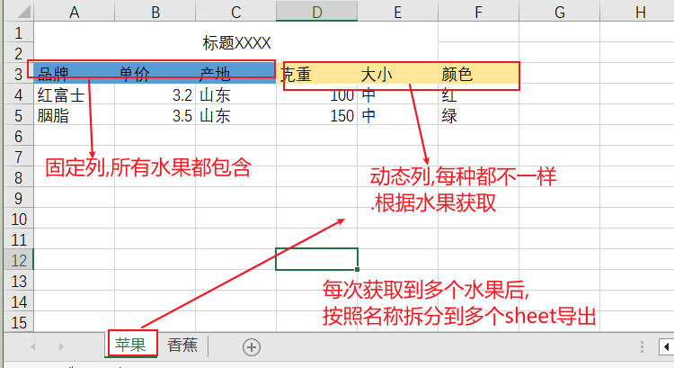

# NopReport示例: 动态Sheet和动态列

讲解视频: https://www.bilibili.com/video/BV1fKXkYWEQJ/

NopReport是一个非常强大的中国式报表引擎，它支持各种复杂报表格式，一般商业报表引擎如帆软报表FineReport可以实现的报表在NopReport中都存在一个简单的对应解决方案。
详细介绍参见 [NopReport:采用Excel作为设计器的开源中国式报表引擎](https://mp.weixin.qq.com/s/_nKUiryetF2O5zSrPfU8FQ)

与一般商业报表引擎不同的是，NopReport除了平面化的DataSet数据表结构之外，还支持直接使用复杂嵌套对象结构来作为数据来源，根据领域对象来生成报表。

下面的示例演示了如何根据一个复杂的JSON数据，动态生成多个Sheet页，每个Sheet页中还包含多个动态生成的数据列。



输入的数据是复杂的嵌套结构：

```json
[
  {
    "name": "苹果",
    "list": [
      {
        "单价": "3.2",
        "产地": "山东",
        "属性": {
          "克重": "100",
          "大小": "中",
          "颜色": "红"
        }
      }
    ]
  },
  {
    "name": "香蕉",
    "list": [
      {
        "单价": "2.1",
        "产地": "山东",
        "属性": {
          "长度": "150",
          "成熟度": "中等",
          "存储": "低温"
        }
      }
    ]
  }
]
```

## 导出模板

### Sheet页配置

NopReport报表模板中可以为每个Sheet页指定对应的报表模型。比如shee1对应的模型配置放在`sheet1-XptSheetModel`页中


* 【构建循环变量】用于配置一个Xpl模板片段，返回一个数据列表。Report导出的时候会按照这个数据列表循环生成多个Sheet。如果列表为空，则实际会跳过这个Sheet的生成。示例中的data表示返回当前上下文中的data变量，它是一个List。

* 【循环变量名】用于指定循环生成时的循环变量。比如示例中data对应一个List，它的每一个条目对应的变量名为entity。如果不指定【循环变量名】，缺省值为
  `sheetLoopVar`。同时循环过程中当前循环下标对应的变量名为`sheetLoopIndex`。

* 【表单名称表达式】用于指定动态生成的ExcelSheet的名称。实例中entity.name表示从当前循环变量上取name属性作为表单名称。

### 单元格展开配置


A3单元格配置行展开：

* `expandType=r` 表示行展开
* `expandExpr=entity.list` 表示从当前上下文中的entity对象上取list属性作为循环展开的数据

D2单元格配置列展开：

* `expandType=c` 表示列展开
* `expandExpr=entity.list[0].属性.keySet()`
  表示从当前上下文中的entity对象上取list中第一个条目的【属性】字段，这个字段是一个Map，它的key集合是动态属性名称集合。实际使用中可能采用其他方式获取动态属性名。
* `*=产地` 是valueExpr的一种简写形式，用于从当前的expandedValue上取指定属性作为单元格的值。


D3单元格通过valueExpr来获取动态列的值，具体配置为`valueExpr=cell.rp.ev.属性[cell.cp.ev]`

* cell.rp表示当前单元格的行父格，也就是最左侧的展开单元格A3
* ev表示取单元格的展开值，也就是entity.list中的某个行
* cell.cp表示当前单元格的列父格，也就是上方的展开单元格D2
* cell.cp.ev对应于动态属性名， `cell.rp.ev.属性[cell.cp.ev]`表示从当前行中取属性字段，然后根据属性名取对应的值。

## 导入配置

Nop平台中提供了ImportModel导入模型，可以通过配置`imp.xml`模型文件，无需编码即可实现Excel文件的解析。

TestImportExcelModel这个单元测试中提供了一个`test-dynamic-sheet-and-col.imp.xml`配置，可以用于解析上一节导出的Excel数据文件。

```xml
<imp x:schema="/nop/schema/excel/imp.xdef" xmlns:x="/nop/schema/xdsl.xdef"
>

    <sheets>

        <sheet name="数据" field="data" list="true" namePattern=".*"
               multipleAsMap="true" multiple="true"
               noSeqCol="true" headerRowCount="2">

            <fields>
                <field name="品牌" displayName="品牌">

                </field>

                <field name="单价" mandatory="true">
                    <schema stdDomain="double"/>
                </field>

                <field name="产地" mandatory="true">

                </field>

                <field name="dynamicProp" virtual="true">
                    <valueExpr>
                        let map = record.makeMap('属性')
                        map[fieldLabel] = value;
                    </valueExpr>
                </field>
            </fields>

            <!-- 动态列全部映射到dynamicProp字段去处理。
             dynamicProp字段是一个虚拟字段，它执行valueExpr来实现数据结构变换
             -->
            <fieldDecider>
                'dynamicProp'
            </fieldDecider>
        </sheet>

    </sheets>

    <normalizeFieldsExpr>
      const list = [];
      rootRecord['data'].forEach((k,v) => {
      list.push({name:k,list:v})
      })

      rootRecord.data = list;
    </normalizeFieldsExpr>

</imp>
```

* `field=data`解析得到的数据保存为data变量
* `namePattern=".*" multiple=true multipleAsMap=true` 表示匹配多个Sheet页，解析得到一个Map对象，Map的key为Sheet页的名称
* `list="true"` 表示Sheet中包含的是一个列表数据
* `headerRowCount="2"`表示表头占前两行，从第三行开始是数据。
* `noSeqCol="true"`表示没有序号列，从第三行开始解析，一直到发现一个空行为止。如果没有配置noSeqCol或者配置为false，则要求第一列是一个序号列，其中的内容必须是数字。
  解析时会解析到序号列为空为止。

动态列解析时使用fieldDecider配置

* fieldDecider中可以根据fieldLabel等条件判断是否是动态列，如果是，对应哪个解析配置。示例中固定返回`'dynamicProp'`，表示使用dynamicProp字段配置来解析动态列。
* dynamicProp字段是一个虚拟字段，它执行valueExpr来实现数据结构变换。示例中通过`record.makeMap('属性')`创建一个Map对象，然后根据fieldLabel和value来设置Map中的值。

解析得到的data是一个Map结构，但是要求的返回类型是`List<Map>`结构，所以通过normalizeFieldsExpr将Map转换为List

通过`ExcelHelper.loadXlsxObject(impModelPath,excelResource)`方法就可以解析Excel文件得到Bean对象，实际返回类型是DynamicObject，它类似Map结构。

```javascript
 IResource resource = attachmentResource("test-dynamic-sheet-and-col.xlsx");
 Object bean = ExcelHelper.loadXlsxObject(
       "/nop/test/imp/test-dynamic-sheet-and-col.imp.xml", resource);
 assertEquals(attachmentJsonText("test-dynamic-sheet-and-col.json"),
       JsonTool.serialize(bean, true));
```
