## Excel 图表（Chart）动态数据绑定开发指引

本文介绍如何在 Excel 模板中通过图表的“可选文字”（Alt Text，对应模型字段 description/descr）配置图表的动态数据来源与行为，重点说明：

- 在可选文字中以简洁的 key=value 语法配置动态绑定（dynamicBindings）
- 通过 seriesTestExpr 决定最终生成哪些系列（series），并要求在模板中预先准备“最多可能需要”的系列数
- 在表达式中使用 seriesModel.index 获取当前系列的 0 基索引
- 利用 seriesDataCellRefExpr 等表达式动态计算 Excel 单元格引用；表达式内可直接调用 IXptRuntime.buildCellRef 助手函数


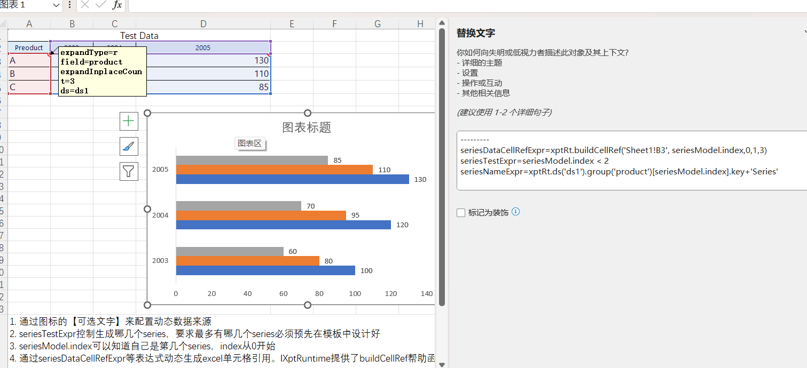


## 在 Excel 中写“descr”（可选文字）

右键图表 →“编辑可选文字”，将描述与配置写在同一文本框中：

- “----” 之前的内容为人类可读的描述，将保留到模型的 description 字段
- “----” 之后按多行 key=value 写配置，解析为 ChartModel.dynamicBindings

语法规则（由 MultiLineConfigParser 解析）：

- 每行一个配置项，形如 key = value
- 字符串可直接写；如包含换行可用 """ 多行字符串 """ 包裹；或用 `反引号字符串`

最小示例：

```
我的销售图表
----
seriesDataCellRefExpr=xptRt.buildCellRef('Sheet1!B3', seriesModel.index,0,1,3)
seriesTestExpr=seriesModel.index < 2
seriesNameExpr=xptRt.ds('ds1').group('product')[seriesModel.index].key+'Series'
```

上述配置效果：

- 动态产生单元格引用表达式，比如生成 `Sheet1!B3:D3`
- 仅生成 index 为 0、1 的两个系列
- 图表名称使用动态计算得到的字符串


## dynamicBindings 可配置项与签名

可在“----”之后配置以下常用表达式（更多项见 schema：/nop/schema/excel/chart.xdef 的 <dynamicBindings>）：

- chartTestExpr: (chartModel) => boolean
	- 决定是否生成整个图表
- chartTitleCellRefExpr: (chartModel) => string
- chartTitleExpr: (chartModel) => string
	- 标题可用单元格引用或直接文本（二选一）。若 cellRefExpr 返回非空，则优先按单元格；否则尝试 titleExpr 文本
- seriesTestExpr: (seriesModel, chartModel) => boolean
	- 决定某个系列是否保留（返回 true 保留）
- seriesNameCellRefExpr | seriesNameExpr: (seriesModel, chartModel) => string
- seriesDataCellRefExpr | seriesDataExpr: (seriesModel, chartModel) => string/any
- seriesCatCellRefExpr | seriesCatExpr: (seriesModel, chartModel) => string/any
- axisDataCellRefExpr: (axisModel, chartModel) => string
- axisTitleCellRefExpr | axisTitleExpr: (axisModel, chartModel) => string

引擎行为（参见 ExpandedSheetChartGenerator）：

- 若 *CellRefExpr 返回非空*，则覆盖模板中相应的单元格引用
- 若返回空，则保留模板原值；对于标题/名称，若 cellRef 为空则再尝试 *Expr* 返回直接文本


## seriesTestExpr 与“模板需预置最多的 series 数”

- 运行时不会“新增”系列，只会基于模板中已有系列做“保留/删除”。
- 因此必须在模板中预先设计“最多可能需要”的系列数量（例如最多 5 条线），运行期用 seriesTestExpr 过滤超出的系列。
- 例：若数据集只有 3 条线，且模板预置 5 个系列，则可以配置


## seriesModel.index（从 0 开始）

- 引擎在加载模板时会为系列自动编号：0、1、2、…（详见 ExcelChartModel.init 与 ChartPlotAreaParser）
- 在所有系列相关表达式中可通过 series.index 取得该序号，用于偏移列/行、拼接名称等


## 动态生成单元格引用：xptRt.buildCellRef

表达式中可直接返回：

- A1 或 A1:B10 形式的字符串（可包含 Sheet! 前缀）
- 或返回 IXptRuntime.buildCellRef 的结果对象，系统会自动转为字符串

buildCellRef 签名：

- buildCellRef(cellRefTpl, rowOffset, colOffset, rowSize, colSize) ⇒ ExcelCellRef


## 标题与坐标轴的动态绑定

```
chartTitleCellRefExpr = "Sheet1!$D$1"
chartTitleExpr        = "销售额走势"
```

注意：当 cellRefExpr 返回非空时，titleExpr 将被忽略。


## 支持的图表示例

以下为部分效果图（模板+绑定后均可用）：

- 柱/条形：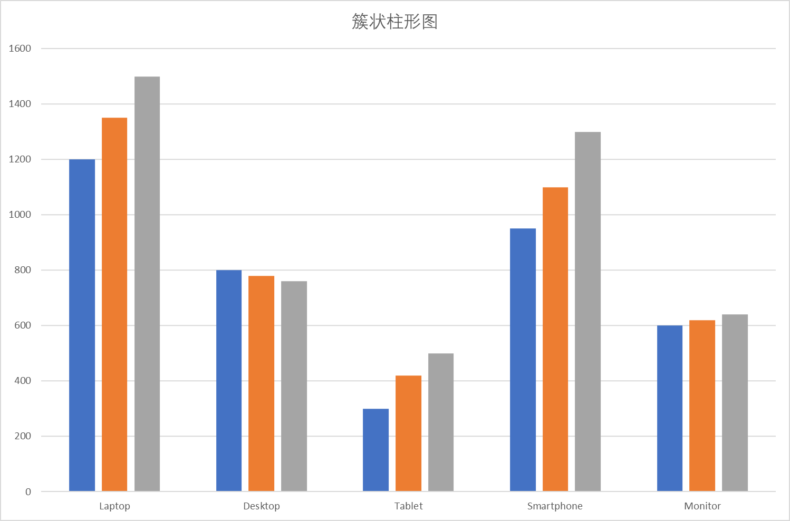 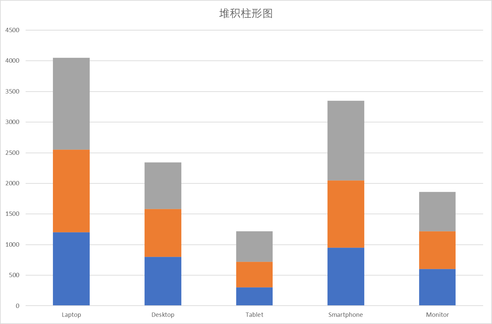 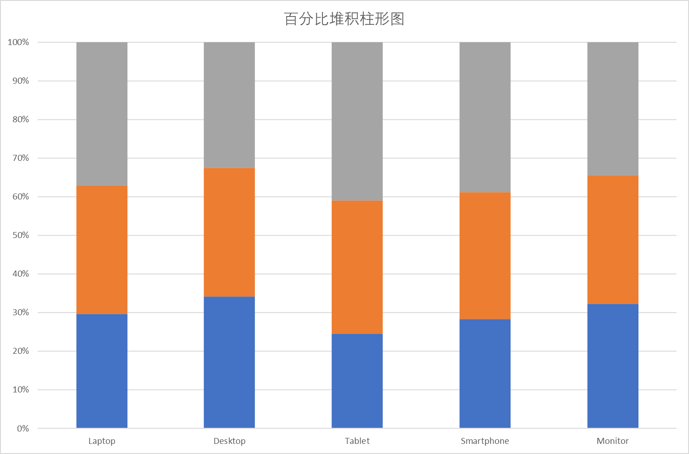
- 折线：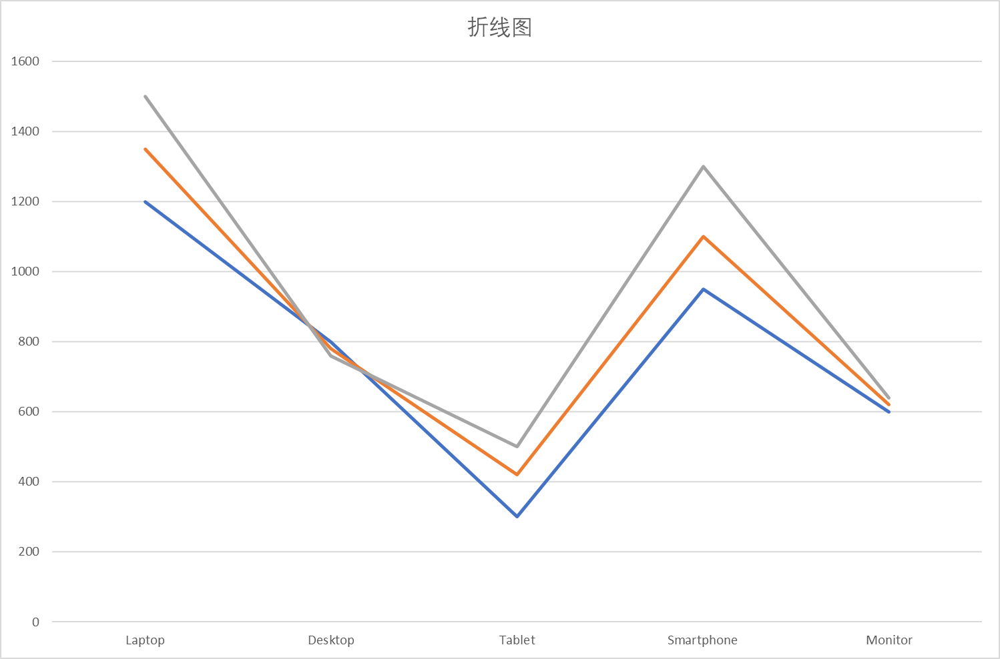 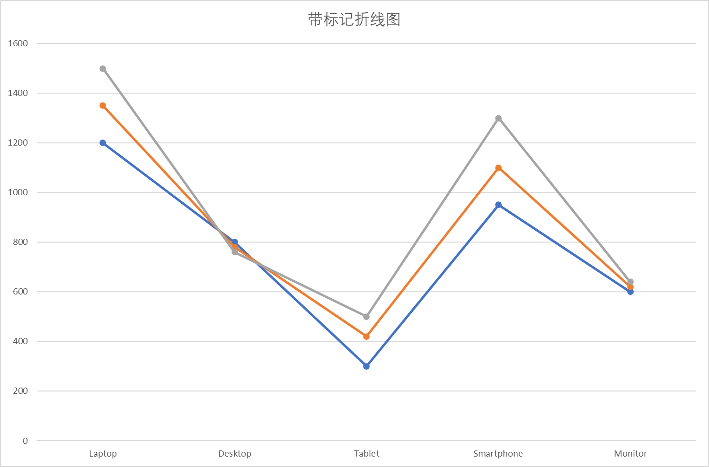
- 面积：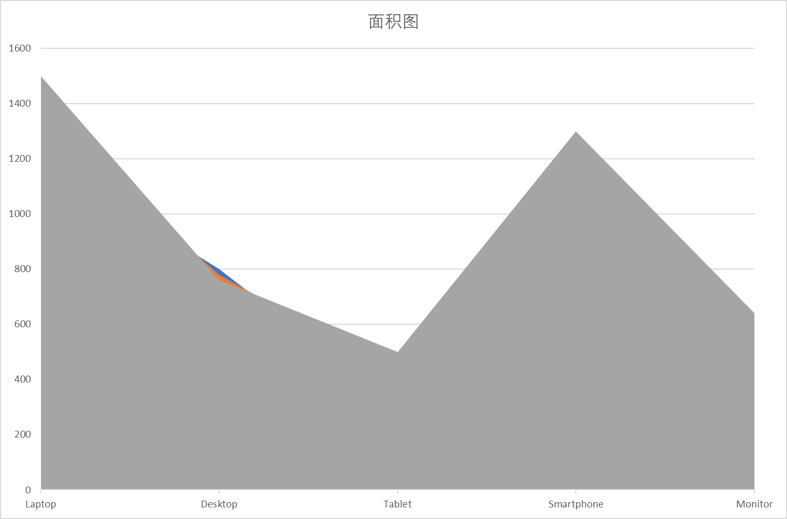 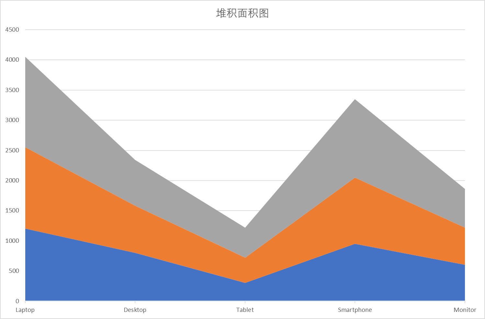 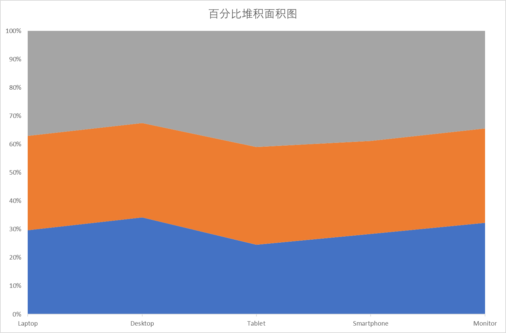
- 饼/环：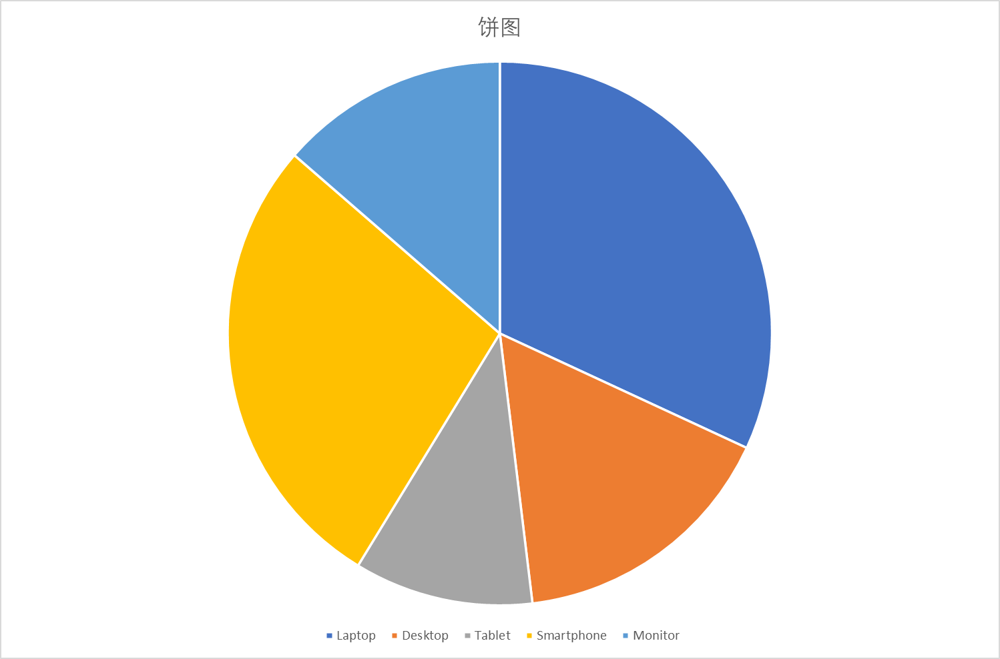 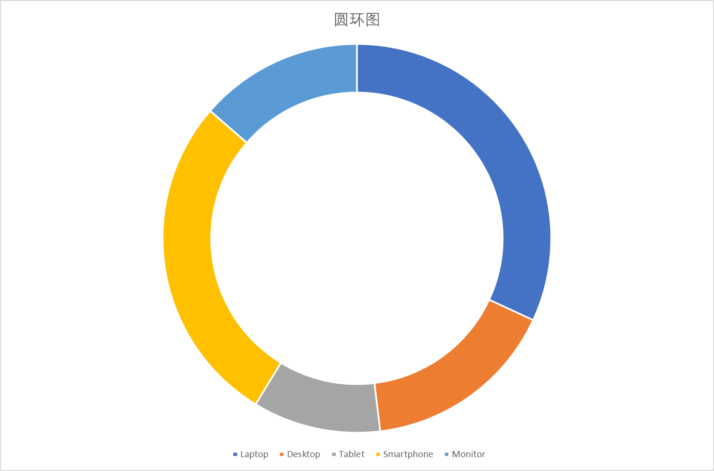
- 雷达/散点：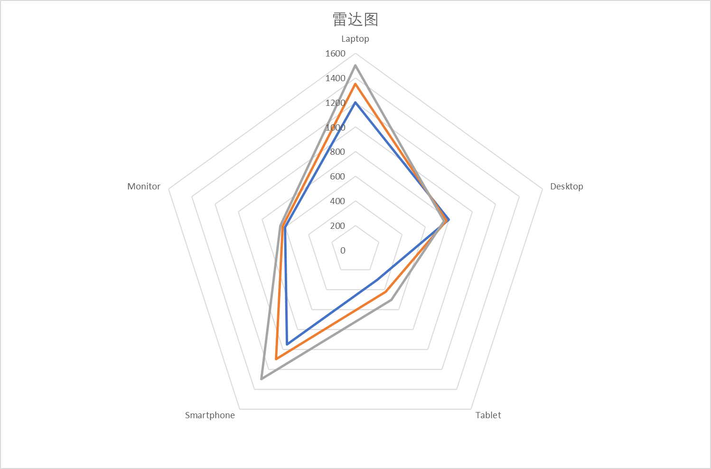 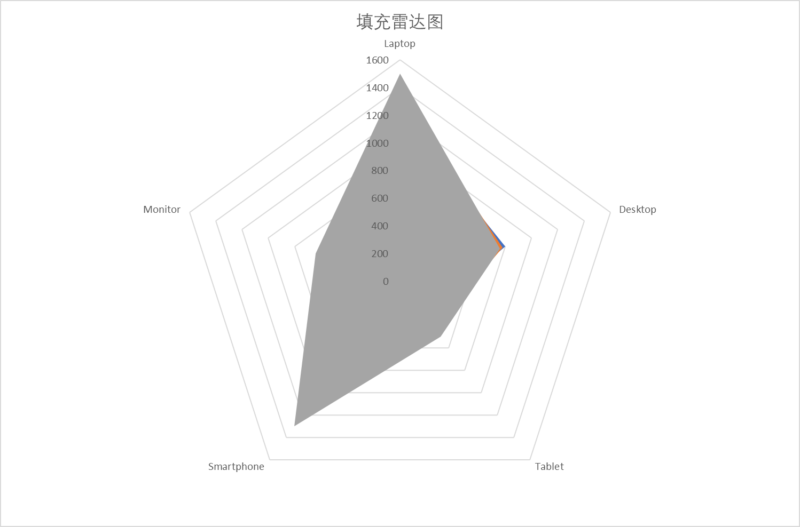 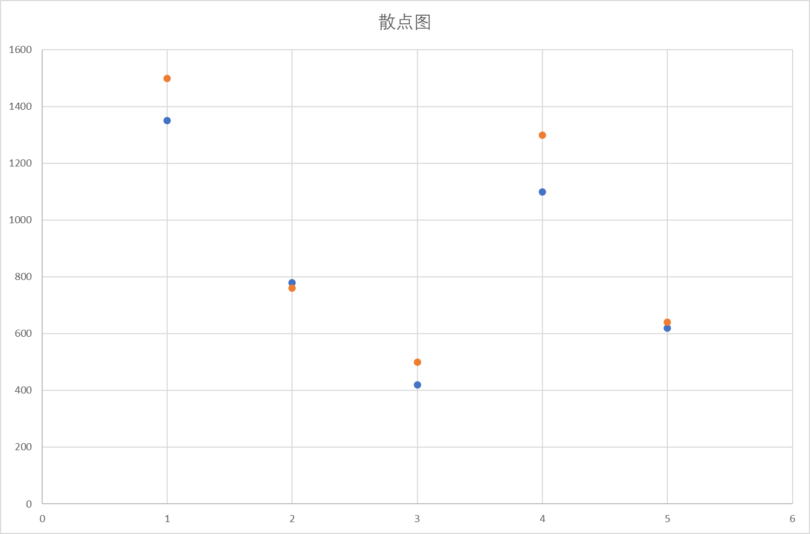 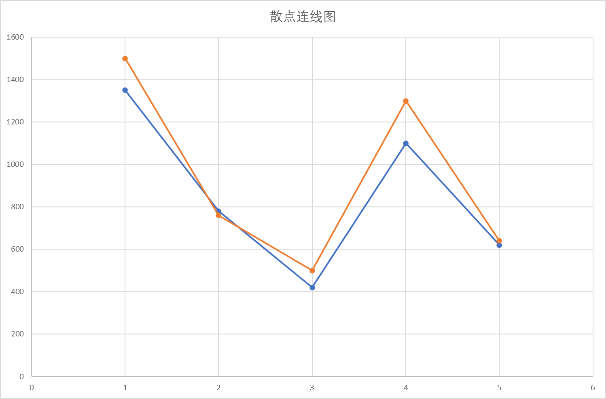


## 参考与实现位置

- XDef（schema）：`/nop/schema/excel/chart.xdef` 的 `<dynamicBindings>` 段定义了所有可用表达式与签名
- 模型与生成：`io.nop.report.core.engine.ExpandedSheetChartGenerator`（动态绑定的执行逻辑）
- “可选文字”解析：`io.nop.report.core.build.ExcelToXptModelTransformer#parseChartModel`（以 "----" 分隔描述与配置；key=value 逐项解析）
- 运行期上下文：`io.nop.report.core.engine.IXptRuntime`（表达式作用域变量名为 `xptRt`；提供 `buildCellRef`、`ds` 等方法）
- 图表解析/构建（OOXML）：`nop-format/nop-ooxml/nop-ooxml-xlsx` 模块下 `io.nop.ooxml.xlsx.chart.*`（Parser/Builder）


## 小贴士（常见问题）

- 必须在模板中预置最多的系列（series），运行时不会创建超过模板数量的新系列
- 返回 null 或空字符串会保留模板中的默认引用/文本
- 返回 ExcelCellRef 或 A1/A1:A10 字符串均可；若需要包含工作表名，建议写 Sheet!$A$1:$A$10
- seriesModel.index 从 0 开始

完成以上配置后，导出时引擎会根据可选文字中的 dynamicBindings 自动计算标题、分类、数据等引用，并按需过滤系列，达到“模板一次设计、运行多场景复用”的效果。

