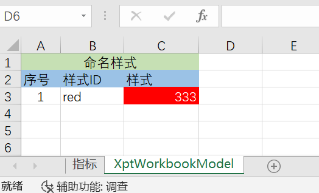
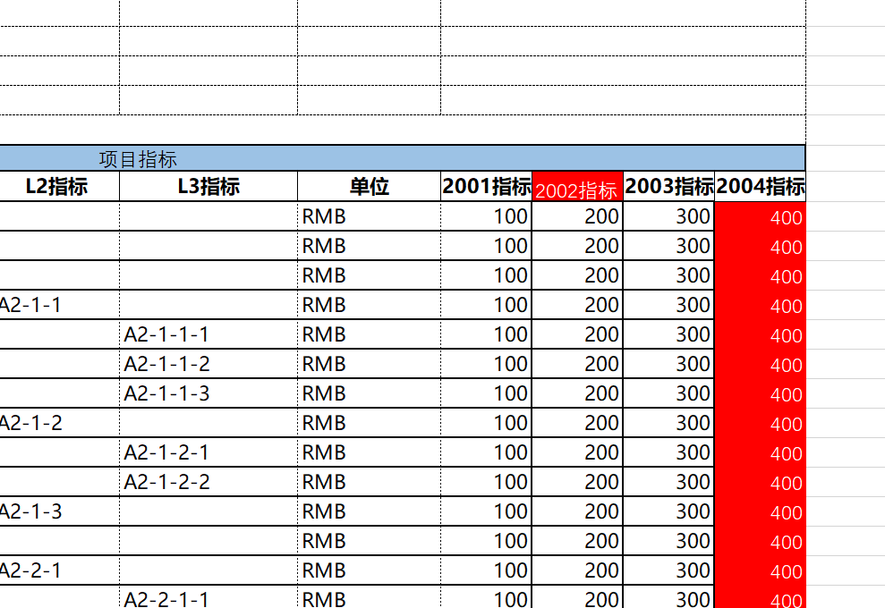
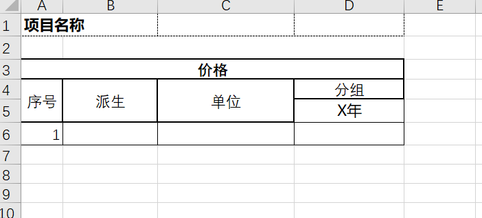
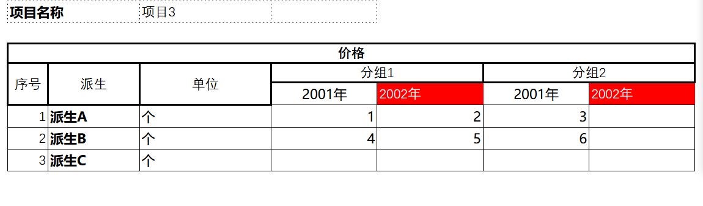

# Excel数据导入导出

在Nop平台中只需要增加imp.xml导入模型即可实现对存储在Excel中的复杂业务对象的解析，具体imp模型的定义参见[imp.xdef](https://gitee.com/canonical-entropy/nop-entropy/blob/master/nop-xdefs/src/main/resources/_vfs/nop/schema/excel/imp.xdef)

## 基本原理

* 对于普通字段，按照左侧是label，右侧是值来解析
* 对于列表字段，可以按照上面是label，下方是列表来解析
* 列表的第一列必须是数字列，不要求编号唯一，也不要求编号列在字段列表中定义。它仅仅被用于确定列表行的范围。
* 关键是在整体结构上能够明确的识别出父子关系。父字段必须覆盖子字段的范围。这样才能实现自动解析。
* label可以对应于field的displayName或者name，两者都可以
* 字段的前后顺序不影响解析。在imp.xml中定义的field是全集，实际的模板中可以只使用部分字段。
* 但是标记为mandatory的字段必须在模板中存在，否则解析后发现对应字段值为空，会抛出异常。

## 配置说明

## 如果解析列表

* sheet或者field上标注list=true，表示将会解析得到一个列表
* 列表的第一列必须是数字列，不要求编号唯一，也不要求编号列在字段列表中定义。它仅仅被用于确定列表行的范围。

## 如何解析一组sheet得到一个值

```xml
<sheet name="ss" namePattern=".*" multiple="true" multipleAsMap="true" field="ss">
    
</sheet>
```

* namePattern指定一个正则表达式，它描述如何匹配对应的sheet
* multiple=true表示会匹配到多个sheet
* multipleAsMap=true表示匹配到的多个sheet解析后，会按照sheetName汇总成一个Map。如果不指定这个属性或者设置为false，则多个sheet的解析结果会合并为一个List

## 使用导入模板来实现导出

1. 首先制作一个空的导入模板，即把导入数据删除，保留列表数据的序号列。具体样例参考[template.orm.xlsx](https://gitee.com/canonical-entropy/nop-entropy/blob/master/nop-orm-model/src/main/resources/_vfs/nop/orm/imp/template.orm.xlsx)
2. 在imp.xml文件中通过templatePath属性来指向导入模板

```xml
<imp x:schema="/nop/schema/excel/imp.xdef" xmlns:x="/nop/schema/xdsl.xdef" xmlns:c="c" xmlns:xpt="xpt"
     templatePath="template.orm.xlsx" >
</imp>
```

ExcelReportHelper中提供了根据导入的业务数据自动生成html或者xlsx文件的方法。

```javascript
    Object bean = ExcelHelper.loadXlsxObject("/nop/test/imp/test5.imp.xml", resource);    
    String html = ExcelReportHelper.getHtmlForXlsxObject(impModelPath, bean, scope);
    ExcelReportHelper.saveXlsxObject(impModelPath, resource, bean);
```

在imp模型的帮助下，Excel可以被看作是Java对象的一种序列化形式，类似于JSON和Java对象之间的自动双向转换，我们可以实现Excel和Java对象之间的自动双向转换。

具体示例参见[TestImportExcelModel.java](https://gitee.com/canonical-entropy/nop-entropy/blob/master/nop-biz/src/test/java/io/nop/biz/impl/TestImportExcelModel.java)

## 动态确定需要导入的列

示例配置[test3.imp.xml](https://gitee.com/canonical-entropy/nop-entropy/blob/master/nop-biz/src/test/resources/_vfs/nop/test/imp/test3.imp.xml),
测试用例[TestParseTreeTable.java](https://gitee.com/canonical-entropy/nop-entropy/blob/master/nop-biz/src/test/java/io/nop/biz/impl/TestParseTreeTable.java)

通过fieldDecider可以动态确定数据列所对应的解析配置。例如 2002指标、2003指标等列是动态变化的，我们希望解析这些列并把它们转换为一个列表属性。


```xml
<field name="columns" displayName="项目指标" list="true">
    <fields>
        <field name="name" displayName="指标" mandatory="true"/>
        
        <field name="indexValue" displayName="X年指标" virtual="true">
            <schema stdDomain="int"/>
            <valueExpr>
                // 如果是第一次访问indexValues属性，则自动创建一个List
                let list = record.makeList('indexValues')
                let year = fieldLabel.$removeTail('指标').$toInt()
                list.add({ year, value})
            </valueExpr>

            <xpt:labelExpandExpr>
                <!-- 外部传入的年份列表数据 -->
                indexYears
            </xpt:labelExpandExpr>

            <!-- 根据展开表达式值动态构建字段标题 -->
            <xpt:labelValueExpr>
                cell.ev + '指标'
            </xpt:labelValueExpr>

            <xpt:valueExpr>
                _.findWhere(cell.rp.ev.indexValues,'year',cell.cp.ev.$toInt()).value
            </xpt:valueExpr>            
        </field>

    </fields>

    <!-- 如果字段标签以指标为后缀，则执行名称为indexValue的解析规则 -->
    <fieldDecider>
        fieldLabel.endsWith("指标") ? "indexValue" : null
    </fieldDecider>
</field>
```

* virtual=true表示是虚拟字段。导入时只会执行字段的valueExpr，但并不会把返回的value设置到record的属性上。
* 在valueExpr执行的时候可以通过fieldLabel来引用字段的标题，通过value引用从单元格中解析得到的值，通过cell引用当前单元格
* xpt:labelExpandExpr等以`xpt:`为前缀的标签在数据导出的时候使用。xpt:labelExpandExpr用于动态生成表格列
* xpt:valueExpr返回动态生成的列所对应的单元格的值。cell.rp.ev相当于 cell.rowParent.expandValue用于获取行父格的展开值，而
  cell.cp.ev对应于cell.colParent.expandValue，用于获取列的展开值。\_.findWhere根据行父格和列父格的值，动态查找得到当前单元格对应的值。

## 动态设置单元格样式

导出数据的时候可以增加动态样式：当单元格的值满足某些条件的时候采用指定的样式来显示。例如当单元格的值大于300的时候，将单元格背景设置为红色。

```xml
<field>
    <xpt:labelStyleIdExpr>
        cell.ev == 2002 ? 'red' : null
    </xpt:labelStyleIdExpr>

    <xpt:styleIdExpr>
        cell.value > 300 ? 'red' : null
    </xpt:styleIdExpr>
</field>
```

在数据模板中需要增加XptWorkbookModel这个Sheet页，在其中定义命名样式。


实际导出的结果为


## 支持复合表头

导入数据的时候可以支持多级表头（目前只支持两级）


导出结果为


在imp.xml导入模型中进行配置时，只考虑匹配最下层的字段，分组字段不会直接参与匹配。

在field配置上增加groupField配置，它对应于另一个field配置，在其中可以配置`xpt:labelExpandExpr`等导出配置。

```xml
<fields>
    <field name="indexValue" displayName="X年" virtual="true" groupField="group">
        <schema stdDomain="int"/>
        <valueExpr>
            // 如果是第一次访问indexValues属性，则自动创建一个List
            let list = record.makeList('indexValues')
            let year = fieldLabel.$removeTail('年').$toInt()
            let group = labelData.groupLabel
            list.add({ year, value,group})
        </valueExpr>

        <xpt:labelExpandExpr>
            <!-- 外部传入的年份列表数据。也可以通过cell.cp.ev来访问分组单元格的值 -->
            indexYears
        </xpt:labelExpandExpr>

        <!-- 根据展开表达式值动态构建字段标题 -->
        <xpt:labelValueExpr>
            cell.ev + '年'
        </xpt:labelValueExpr>

        <!-- xpt:valueExpr是导出时执行的，而valueExpr是导入时执行的。因为执行时机不同，它们的上下文环境中
        可访问的变量也不同。导出时主要是cell和xptRt，也就是NopReport中的变量。而导入时是record, cell, fieldLabel等，
        此时没有rowParent和colParent等概念。
        -->
        <xpt:valueExpr>
            // cell.cp.cp表示取当前单元格的列父格的列父格。
            // cp是colParent的缩写。当前单元格的列父格就是动态展开的列的label所在的单元格。label单元格的父格就是分组单元格
            _.findWhere(cell.rp.ev.indexValues,{ year: cell.cp.ev.$toInt(), group: cell.cp.cp.value})?.value
        </xpt:valueExpr>

        <xpt:labelStyleIdExpr>
            cell.ev == 2002 ? 'red' : null
        </xpt:labelStyleIdExpr>

        <xpt:styleIdExpr>
            cell.value > 300 ? 'red' : null
            <!--cell.value == 'A2' ? 'red' : null-->
        </xpt:styleIdExpr>
    </field>

    <!--
    indexValue字段的groupField属性指向这个分组字段。这里主要是引入labelExpandExpr配置，也就是导出报表时的一些相关配置
    -->
    <field name="group" displayName="group">
        <schema stdDomain="string" />
        <xpt:labelExpandExpr>
            groups
        </xpt:labelExpandExpr>
    </field>
</fields>
```

在导入具体数据单元格的时候，可以通过labelData变量（LabelData类型）访问到对应的labelCell和groupCell, 以及对应的field配置等。

## 与Spring框架集成

如果要使用Nop平台的Excel导入导出功能，只需要在pom文件中引入如下模块

```xml
        <!-- 实现Nop平台与spring框架的集成，不依赖于数据库，不依赖Web环境 -->
<dependency>
    <groupId>io.github.entropy-cloud</groupId>
    <artifactId>nop-spring-core-starter</artifactId>
</dependency>

        <!-- Excel解析和报表引擎支持 -->
<dependency>
<groupId>io.github.entropy-cloud</groupId>
<artifactId>nop-report-core</artifactId>
</dependency>

```

具体示例项目参见 [nop-spring-report-demo](https://gitee.com/canonical-entropy/nop-entropy/tree/master/nop-demo/nop-spring-report-demo)
