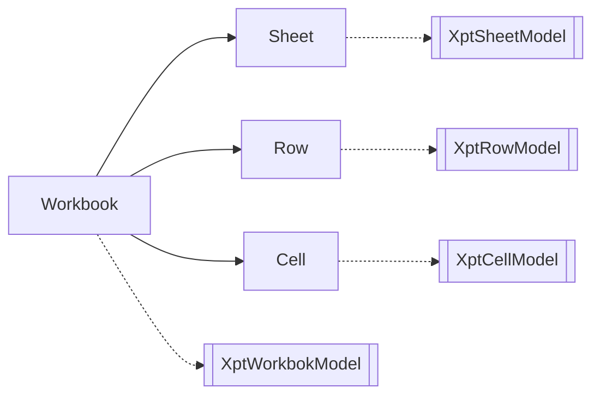

# NopReport的源码分析

## 报表模型作为Excel模型的扩展

根据可逆计算理论，模板(Template)可以看作是原始模型对象的一种抽象化，在结构层面它可以看作是原始模型对象的一种增强。也就是说，任何一个原始模型对象都应该可以被看作是一种合法的模板对象。在这种设计思想指引下，NopReport中将报表模型的DSL设计为Excel模型的扩展模型，它在Excel的DSL的基础上增加了model子节点。



对应的元模型定义为
```xml
<workbook>
   <model>...</model>
   <sheets>
      <sheet name="!string">
         <model>...</model>
         <rows>
            <row>
               <model>...</model>
               <cells>
                  <cell  mergeAcross="!int=0" mergeDown="!int=0" styleId="string" >
                     <model>...</model>
                     <value xdef:value="any"/>
                     <comment xdef:value="string" />
                  </cell>
               </cells>
            </row>
         </rows>
      </sheet>
   </sheets>
</workbook>
````

### 利用Excel内置的机制实现可视化
我们可以利用Excel内置的一些扩展机制来保存扩展模型信息，从而将Excel改造为可视化报表设计器。


1. 利用单元格的Comment来保存扩展模型信息


2. 利用单独的Sheet页来保存扩展模型信息


**如果Excel工具引入一种自定义Schema机制，就可以自动实现对扩展模型的格式校验。**

**如果上下游所有的工具都满足可逆计算原理，则这些工具可以自动实现无缝融合**

## 报表引擎的执行逻辑

NopReport的功能功能在[ReportEngine](https://gitee.com/canonical-entropy/nop-entropy/blob/master/nop-report/nop-report-core/src/main/java/io/nop/report/core/engine/ReportEngine.java)对象中实现，它的主要工作可以分为如下三个部分：

1. Parse: 从xpt文件或者xpt.xlsx文件解析得到报表模型
   * [解析Excel文件得到ExcelWorkbook对象](https://gitee.com/canonical-entropy/nop-entropy/blob/master/nop-ooxml/nop-ooxml-xlsx/src/main/java/io/nop/ooxml/xlsx/parse/ExcelWorkbookParser.java)
   * [将ExcelWorkbook转换为报表模型](https://gitee.com/canonical-entropy/nop-entropy/blob/master/nop-report/nop-report-core/src/main/java/io/nop/report/core/build/ExcelToXptModelTransformer.java)
   * [分析单元格的父子关系，初始化报表模型中的各类关联信息](https://gitee.com/canonical-entropy/nop-entropy/blob/master/nop-report/nop-report-core/src/main/java/io/nop/report/core/build/XptModelInitializer.java)
2. [Generate](https://gitee.com/canonical-entropy/nop-entropy/blob/master/nop-report/nop-report-core/src/main/java/io/nop/report/core/engine/ExpandedSheetGenerator.java): 根据报表模型动态展开，生成ExpandedSheet
   * [Expand](https://gitee.com/canonical-entropy/nop-entropy/blob/master/nop-report/nop-report-core/src/main/java/io/nop/report/core/engine/expand/TableExpander.java): 先按照父子关系执行展开
   * [Evaluate](https://gitee.com/canonical-entropy/nop-entropy/blob/master/nop-report/nop-report-core/src/main/java/io/nop/report/core/engine/ExpandedSheetEvaluator.java): 执行每个单元格的valueExpr，生成单元格的值和显示文本
3. [Render](https://gitee.com/canonical-entropy/nop-entropy/blob/master/nop-report/nop-report-core/src/main/java/io/nop/report/core/engine/renderer/HtmlReportRendererFactory.java): 根据renderType选择不同的Renderer来生成输出文件


````mermaid
   graph LR
      ReportEngine --> Parse
      ReportEngine --> Generate
      ReportEngine --> Render
      Parse --> ExcelWorkbookParser
      Parse --> ExcelToXptModelTransformer
      Parse --> XptModelInitializer

      Generate --> TableExpander
      TableExpander --> CellRowExpander
      TableExpander --> CellColExpander
      Generate --> ExpandedSheetEvaluator

      Render --> HtmlReportRendererFactory
      Render --> XlsxReportRendererFactory
````      

## 核心数据结构：ExpandedCell

非线性报表的单元格展开算法中核心的数据结构是ExpandedCell。


```java
public class ExpandedCell implements ICellView {   
   ExpandedRow row;
   ExpandedCol col;

   ExpandedCell right;
   ExpandedCell down;

     
   // 对于合并单元格，realCell设置为左上角的单元格
   ExpandedCell realCell;
   int mergeDown;
   int mergeAcross;


   ExpandedCell rowParent;
   ExpandedCell colParent;

   // 递归包含所有子单元格
   Map<String, List<ExpandedCell>> rowDescendants = null;
   Map<String, List<ExpandedCell>> colDescendants = null;

   // expandExpr计算得到的值
   Object expandedValue;
   int expandedIndex;

   // valueExpr计算得到的值，在父子单元格展开完毕后执行
   Object value;

   // value为内存中的值，显示到界面上时执行formatExpr得到显示用的值
   Object formattedValue;

   boolean removed;

   // valueExpr已经执行完毕，value值可用
   boolean evaluated;

   // 缓存与单元格有关的动态计算的值
   Map<String, Object> computedValues;
}

```

1. ExpandedCell同时处在Row和Col中，行列对称
2. 通过down和right形成两个单向链表
3. 对于单元格合并的情况，插入单元格占位，通过realCell指向左上角的单元格
4. 行和列分别维护父子单元格关系

NopReport区分了expandedValue, value和formattedValue
1. expandedValue是expandExpr的计算结果，即在父子单元格展开过程中得到的值。执行expandExpr的时候层次坐标系还没有建立，因此不能使用层次坐标去访问其他的单元格
2. 在父子格展开完毕之后，根据valueExpr可以计算得到单元格的值。在计算过程中可以通过层次坐标访问其他单元格的值。如果没有指定valueExpr，则value=expandedValue
3. 单元格的值作为文本显示时会执行formatExpr，如果配置，则formattedValue=value
   
