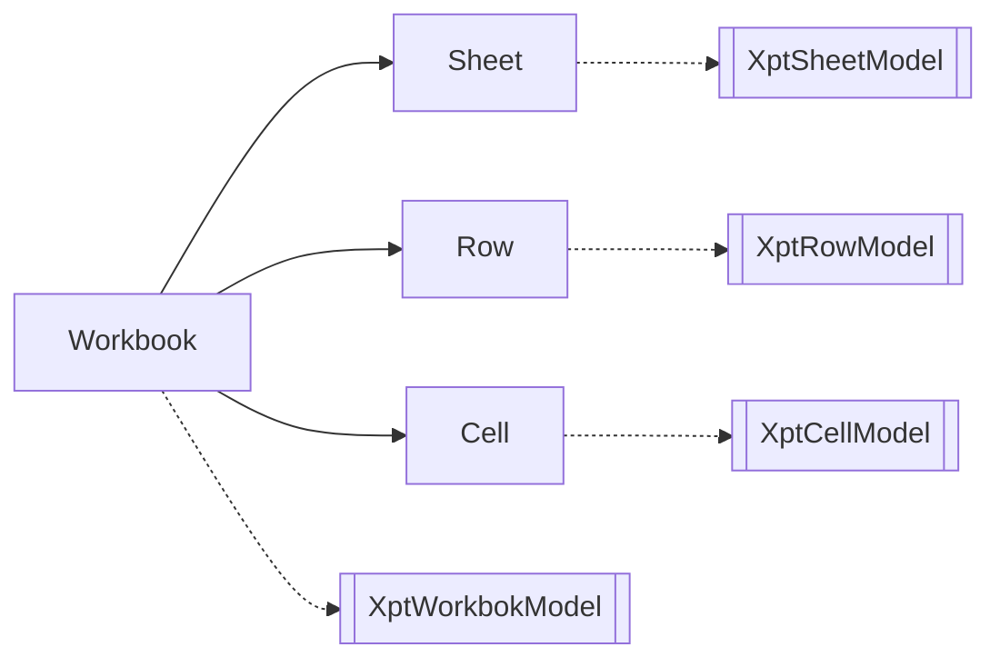

# NopReport报表引擎源码分析

# 报表模型作为Excel模型的扩展

根据可逆计算理论，模板(Template)可以看作是原始模型对象的一种抽象化，在结构层面它可以看作是原始模型对象的一种增强。也就是说，任何一个原始模型对象都应该可以被看作是一种合法的模板对象。在这种设计思想指引下，NopReport中将报表模型的DSL设计为Excel模型的扩展模型，它在Excel的DSL的基础上增加了model子节点。



对应的元模型定义为
```xml
<workbook>
   <model>...</model>
   <sheets>
      <sheet name="!string">
         <model>...</model>
         <rows>
            <row>
               <model>...</model>
               <cells>
                  <cell  mergeAcross="!int=0" mergeDown="!int=0" styleId="string" >
                     <model>...</model>
                     <value xdef:value="any"/>
                     <comment xdef:value="string" />
                  </cell>
               </cells>
            </row>
         </rows>
      </sheet>
   </sheets>
</workbook>
````

## 利用Excel内置的机制实现可视化
我们可以利用Excel内置的一些扩展机制来保存扩展模型信息，从而将Excel改造为可视化报表设计器。


1. 利用单元格的Comment来保存扩展模型信息


2. 利用单独的Sheet页来保存扩展模型信息


**如果Excel工具引入一种自定义Schema机制，就可以自动实现对扩展模型的格式校验。**

**如果上下游所有的工具都满足可逆计算原理，则这些工具可以自动实现无缝融合**

# 报表引擎的执行逻辑

NopReport的功能功能在[ReportEngine](https://gitee.com/canonical-entropy/nop-entropy/blob/master/nop-report/nop-report-core/src/main/java/io/nop/report/core/engine/ReportEngine.java)对象中实现，它的主要工作可以分为如下三个部分：

1. Parse: 从xpt文件或者xpt.xlsx文件解析得到报表模型
   * [解析Excel文件得到ExcelWorkbook对象](https://gitee.com/canonical-entropy/nop-entropy/blob/master/nop-ooxml/nop-ooxml-xlsx/src/main/java/io/nop/ooxml/xlsx/parse/ExcelWorkbookParser.java)
   * [将ExcelWorkbook转换为报表模型](https://gitee.com/canonical-entropy/nop-entropy/blob/master/nop-report/nop-report-core/src/main/java/io/nop/report/core/build/ExcelToXptModelTransformer.java)
   * [分析单元格的父子关系，初始化报表模型中的各类关联信息](https://gitee.com/canonical-entropy/nop-entropy/blob/master/nop-report/nop-report-core/src/main/java/io/nop/report/core/build/XptModelInitializer.java)
2. [Generate](https://gitee.com/canonical-entropy/nop-entropy/blob/master/nop-report/nop-report-core/src/main/java/io/nop/report/core/engine/ExpandedSheetGenerator.java): 根据报表模型动态展开，生成ExpandedSheet
   * [Expand](https://gitee.com/canonical-entropy/nop-entropy/blob/master/nop-report/nop-report-core/src/main/java/io/nop/report/core/engine/expand/TableExpander.java): 先按照父子关系执行展开
   * [Evaluate](https://gitee.com/canonical-entropy/nop-entropy/blob/master/nop-report/nop-report-core/src/main/java/io/nop/report/core/engine/ExpandedSheetEvaluator.java): 执行每个单元格的valueExpr，生成单元格的值和显示文本
3. [Render](https://gitee.com/canonical-entropy/nop-entropy/blob/master/nop-report/nop-report-core/src/main/java/io/nop/report/core/engine/renderer/HtmlReportRendererFactory.java): 根据renderType选择不同的Renderer来生成输出文件


````mermaid
   graph LR
      ReportEngine --> a1[/Parse/]
      ReportEngine --> a2[/Generate/]
      ReportEngine --> a3[/Render/]
      a1[/Parse/] --> ExcelWorkbookParser
      a1[/Parse/] --> ExcelToXptModelTransformer
      a1[/Parse/] --> XptModelInitializer

      a2[/Generate/] --> TableExpander
      TableExpander --> CellRowExpander
      TableExpander --> CellColExpander
      a2[/Generate/] --> ExpandedSheetEvaluator

      a3[/Render/] --> HtmlReportRendererFactory
      a3[/Render/] --> XlsxReportRendererFactory
````      

## 层次坐标

````
CellName[cellCoordinates ; cellCoordinates]
````


````mermaid
graph RL
B1 --> A1
C1 --> B1
A1 --> D1 
````

D1是A1的rowParent，所以A1展开的时候，D1会自动延展。

层次坐标的意思是利用树形结构中父格的坐标进行进一步过滤，并且可以利用相对坐标来访问兄弟节点。

````mermaid
graph TD

A-0 --> B-00
A-0 --> B-01
A-0 --> C-0
B-00 --> D-0
C-0 --> F-0

A-1 --> B-10
````

假设有如上的一个父子结构，在B-10节点中如下坐标`[A:-1,B:1]`指向的是当前A节点的前一个节点下的第一个B节点，即B-00


## 核心数据结构：ExpandedCell

非线性报表的单元格展开算法中核心的数据结构是ExpandedCell。

````mermaid
graph TD

ExpandedCell --> a3[/行列关系/]
ExpandedCell --> a2[/父子关系/]
ExpandedCell --> a1[/值/]
ExpandedCell --> a4[/合并单元格/]

a2[/父子关系/] --> rowParent --> rowDescendants
a2[/父子关系/] --> colParent --> colDescendants

a3[/行列关系/] --> right --> row
a3[/行列关系/] --> down --> col


a1[/值/] --expandExpr--> expandedValue
a1[/值/] --valueExpr--> value
a1[/值/] --formatExpr--> formattedValue

a4[/合并单元格/] --> realCell
````

````java
public class ExpandedCell implements ICellView {   
   ExpandedRow row;
   ExpandedCol col;

   ExpandedCell right;
   ExpandedCell down;

     
   // 对于合并单元格，realCell设置为左上角的单元格
   ExpandedCell realCell;
   int mergeDown;
   int mergeAcross;


   ExpandedCell rowParent;
   ExpandedCell colParent;

   // 递归包含所有子单元格
   Map<String, List<ExpandedCell>> rowDescendants = null;
   Map<String, List<ExpandedCell>> colDescendants = null;

   // expandExpr计算得到的值
   Object expandedValue;
   int expandedIndex;

   // valueExpr计算得到的值，在父子单元格展开完毕后执行
   Object value;

   // value为内存中的值，显示到界面上时执行formatExpr得到显示用的值
   Object formattedValue;

   boolean removed;

   // valueExpr已经执行完毕，value值可用
   boolean evaluated;

   // 缓存与单元格有关的动态计算的值
   Map<String, Object> computedValues;
}

````

1. ExpandedCell同时处在Row和Col中，行列对称
2. 通过down和right形成两个单向链表
3. 对于单元格合并的情况，插入单元格占位，通过realCell指向左上角的单元格
4. 行和列分别维护父子单元格关系

NopReport区分了expandedValue, value和formattedValue
1. expandedValue是expandExpr的计算结果，即在父子单元格展开过程中得到的值。执行expandExpr的时候层次坐标系还没有建立，因此不能使用层次坐标去访问其他的单元格
2. 在父子格展开完毕之后，根据valueExpr可以计算得到单元格的值。在计算过程中可以通过层次坐标访问其他单元格的值。如果没有指定valueExpr，则value=expandedValue
3. 单元格的值作为文本显示时会执行formatExpr，如果配置，则formattedValue=value

## 表格展开
实现代码在[TableExpander.java](https://gitee.com/canonical-entropy/nop-entropy/blob/master/nop-report/nop-report-core/src/main/java/io/nop/report/core/engine/expand/TableExpander.java)中

1. 自上而下，自左而右，依次执行单元格的展开逻辑
2. 如果父格尚未展开，则先展开父格

````java
public void expand(IXptRuntime xptRt) {
   do {
      ExpandedCell cell = processing.poll();
      if (cell == null)
            return;

      if (cell.isRemoved() || cell.isExpanded())
            continue;

      if (cell.getColParent() != null && !cell.    getColParent().isExpanded()) {
            processing.push(cell);
            processing.push(cell.getColParent());
            continue;
      }

      if (cell.getRowParent() != null && !cell.getRowParent().isExpanded()) {
            processing.push(cell);
            processing.push(cell.getRowParent());
            continue;
      }

      getCellExpander(cell).expand(cell, processing, xptRt);
   } while (true);
}
````
   
## 单元格展开

1. 运行expandExpr得到展开对象列表
2. 复用当前单元格作为展开后的第一个单元格
3. 然后以这个单元格为模板复制n-1次
4. 扩展父单元格

````javascript
// CellRowExpander
expandList = runExpandExpr(cell, xptRt)
cell.expandIndex = 0
cell.expandedValue = expandList[0]

expandCount = duplicate(expandedList, cell)
expandCells(cell, expandCount)
````

## 报表表达式

报表引擎中的表达式需要引入层次坐标语法，从而简化数据获取逻辑的编写。

NopReport中的ReportExpr完全基于内置的XScript表达式引擎进行扩展，因此保留了对象方法调用和局部函数定义的能力。同时，通过使用Lambda表达式也避免了在表达式语言中引入特殊的程序语法。参见[ReportExpressionParser.java](https://gitee.com/canonical-entropy/nop-entropy/blob/master/nop-report/nop-report-core/src/main/java/io/nop/report/core/expr/ReportExpressionParser.java)

> 早期的报表引擎在开发的时候函数式编程概念还没有普及，所以一般会在表达式引擎中引入一些特殊语法来支持对数据集的转换和过滤，但是现在使用map、filter、flatMap、reduce等集合函数即可完成类似功能，没有必要再引入特殊语法。这也简化了表达式引擎的实现。


## 通过接口实现简化

````mermaid
graph LR
 
 层次坐标 --> a[ExpandedCellSet]

 a[ExpandedCellSet] --> iterator
 a[ExpandedCellSet] --> value
````

1. `A1`，`A1:B5`以及`A3[A2:-1]`这样的层次坐标表达式在运行期会返回[ExpandedCellSet](https://gitee.com/canonical-entropy/nop-entropy/blob/master/nop-report/nop-report-core/src/main/java/io/nop/report/core/model/ExpandedCellSet.java)对象。

2. ExpandedCellSet实现`Iterable<Object>`接口，可以被看作是一个值集合，在编程时可以像普通值列表一样被统一处理。参见[ReportFunctions.java](https://gitee.com/canonical-entropy/nop-entropy/blob/master/nop-report/nop-report-core/src/main/java/io/nop/report/core/functions/ReportFunctions.java)中的Excel函数实现。

````java
public static Number SUM(@Name("values") Object values) {
   if (values == null)
      return null;

   Iterator<Object> it = CollectionHelper.toIterator(values, true);
   Number ret = 0;

   while (it.hasNext()) {
      Object value = it.next();
      if (!(value instanceof Number))
            continue;
      ret = MathHelper.add(ret, value);
   }
   return ret;
}
````

3. 对于`A3 + 2 > B5`这样的表达式，会在编译期识别出层次坐标，并把它转换为`A3.value + 2 > B5.value`。而ExpandedCellSet上定义了getValue方法，用于返回集合中第一个单元格的值。

````java
    @Override
    public Object getValue() {
        if (cells.isEmpty())
            return null;
        ExpandedCell cell = cells.get(0);
        return cell.getValue();
    }
````

## 性能优化

报表展开为纯函数式运算，因此表达式的计算结果可以进行缓存。ExpandedCell提供了一个缓存集合，可以通过

````java
   ExpandedCell firstCell = xptRt.getNamedCell(cellName);
   // 利用第一个单元格的计算属性来缓存汇总结果
   Number sum = (Number) firstCell.getComputed(XptConstants.KEY_ALL_SUM,
            c -> SUM(xptRt.getNamedCellSet(cellName)));
````

具体实例可以参见[ReportFunctions.java](https://gitee.com/canonical-entropy/nop-entropy/blob/master/nop-report/nop-report-core/src/main/java/io/nop/report/core/functions/ReportFunctions.java)中PROPORTION等函数的实现。

## 数据集：DynamicReportDataSet

参见代码[DynamicReportDataSet.java](https://gitee.com/canonical-entropy/nop-entropy/blob/master/nop-report/nop-report-core/src/main/java/io/nop/report/core/dataset/DynamicReportDataSet.java)

````mermaid
graph LR

DynamicReportDataSet --> a1[/current/]
DynamicReportDataSet --> a2[group]
DynamicReportDataSet --> a3[field]
````

1. DynamicReportDataSet提供了group/groupBy/where/filter/sort/field/select/sum/max/min等大量集合选择和运算函数。
2. 它的计算结果与当前单元格密切相关，它根据xptRt.cell来获取到当前单元格，然后根据父格的expandedValue取交集得到当前所处理的数据集合。

> ds=ds1, expandType=r, field=xxx这种配置实际等价于 expandType=r,expandExpr=ds1.group("xxx")，它会设置展开单元格的expandedValue为分组汇总后的子数据集。
>
> 单元格可能同时具有行父格和列父格，它自身在执行ds1.field(name)这样的函数时，会取行父格与列父格中子数据集的**交集**，得到一个当前可见的集合列表，然后再执行相关操作


