# 非线性中国式报表引擎NopReport源码解析

日常开发中我们经常需要导入导出Excel数据，生成Excel和Word报表等，常用的[easyexcel](https://gitee.com/easyexcel/easyexcel), [poi-tl](https://gitee.com/mirrors/poi-tl)等软件包都依赖底层的POI引擎，体积臃肿，同时在功能方面也难以处理结构复杂的异形表格。在制作复杂的中国式报表时，一般还是需要使用润乾和帆软这样的专业报表软件公司所提供的报表引擎。

很多年前，润乾公司首创了支持行列对称展开的非线性报表生成算法，后来发展成为商业报表软件的翘楚，后续的报表软件如帆软等也都模仿了类似的报表生成算法。NopReport报表引擎为这个算法提供了一个非常精简的开源实现（约3000行代码），可以很容易的进行定制和扩展。本文详细介绍了NopReport报表引擎的基本实现原理，以及非线性报表生成算法的技术细节。

算法讲解视频：https://www.bilibili.com/video/BV17g4y1o7wr/
使用示例视频：https://www.bilibili.com/video/BV1Sa4y1K7tD/
引擎使用文档：https://zhuanlan.zhihu.com/p/620250740

## 一. 报表模型DSL的设计

## 报表模型作为Excel模型的扩展

根据可逆计算理论，模板(Template)可以看作是原始模型对象的一种抽象化，在结构层面它可以看作是原始模型对象的一种增强。也就是说，任何一个原始模型对象都应该可以被看作是一种合法的模板对象。在这种设计思想指引下，NopReport中将报表模型的DSL设计为Excel模型的扩展模型，它在Excel的DSL的基础上增加了model子节点。

> 任意一个Excel都可以看作是一个合法的报表模板，报表模板可以看作是普通Excel+扩展模型信息

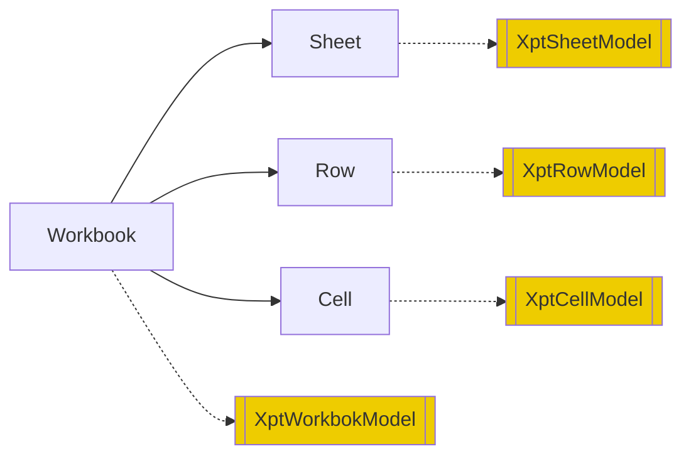

对应的元模型定义为

```xml
<workbook>
   <model>...</model>
   <sheets>
      <sheet name="!string">
         <model>...</model>
         <rows>
            <row>
               <model>...</model>
               <cells>
                  <cell  mergeAcross="!int=0" mergeDown="!int=0" styleId="string" >
                     <model>...</model>
                     <value xdef:value="any"/>
                     <comment xdef:value="string" />
                  </cell>
               </cells>
            </row>
         </rows>
      </sheet>
   </sheets>
</workbook>
```

DSL的属性设计与OOXML标准中Excel的属性设置基本保持一致，便于实现与Excel格式的双向转换。

## 利用Excel内置的机制实现可视化

我们可以利用Excel内置的一些扩展机制来保存扩展模型信息，从而将Excel改造为可视化报表设计器。


1. 利用单元格的Comment来保存扩展模型信息

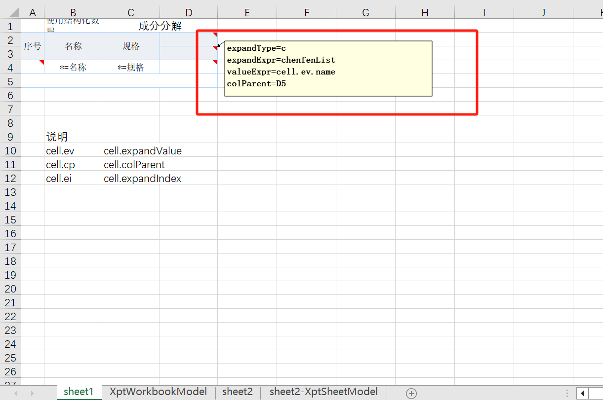

2. 利用单独的Sheet页来保存扩展模型信息
   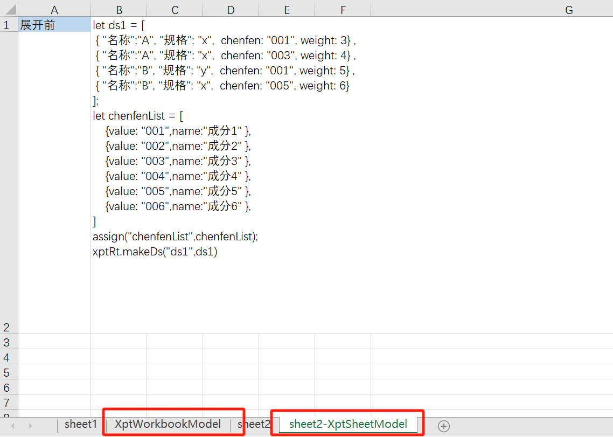

**如果Excel工具引入一种自定义Schema机制，就可以自动实现对扩展模型的格式校验。**

**如果上下游所有的工具都满足可逆计算原理，则这些工具可以自动实现无缝融合**

## 二. 非线性中国式报表理论


润乾公司的创始人蒋步星学长发明了非线性中国式报表模型的相关理论，是报表引擎领域一项真正原创的技术。后续的商业报表公司如帆软报表等都延续了这种类Excel单元格展开的设计思想。

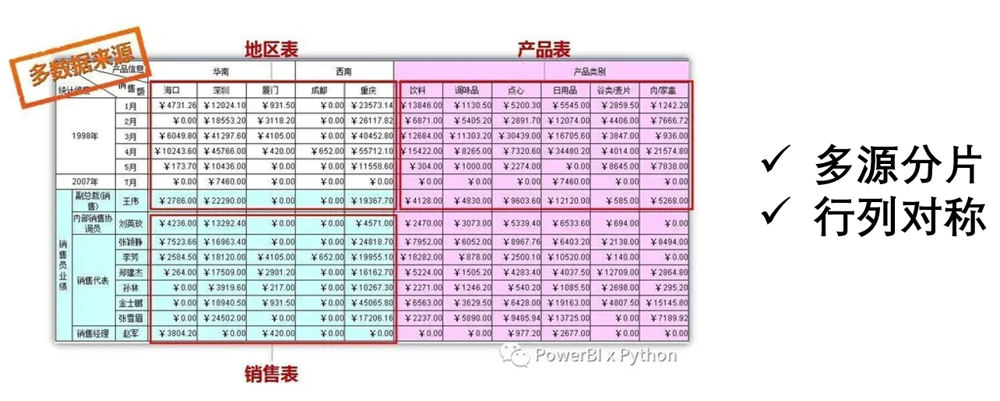


> 所谓的非线性报表是相对于线性报表而言。国外的水晶报表只能沿着一个方向延展，列方向一般是固定的，所以被定义为线性报表。非线性报表是行与列都构成复杂的树形嵌套关系，不再是线性平铺

NopReport提供了非线性报表展开算法的一个开源实现，但是它的具体实现细节是根据相关报表工具的用户使用文档推理得到，与原报表工具的实现方案并没有直接的关系。

## 报表引擎的执行逻辑

NopReport的功能功能在[ReportEngine](https://gitee.com/canonical-entropy/nop-entropy/blob/master/nop-report/nop-report-core/src/main/java/io/nop/report/core/engine/ReportEngine.java)对象中实现，它的主要工作可以分为如下三个部分：

1. Parse: 从xpt文件或者xpt.xlsx文件解析得到报表模型
   * [解析Excel文件得到ExcelWorkbook对象](https://gitee.com/canonical-entropy/nop-entropy/blob/master/nop-ooxml/nop-ooxml-xlsx/src/main/java/io/nop/ooxml/xlsx/parse/ExcelWorkbookParser.java)
   * [将ExcelWorkbook转换为报表模型](https://gitee.com/canonical-entropy/nop-entropy/blob/master/nop-report/nop-report-core/src/main/java/io/nop/report/core/build/ExcelToXptModelTransformer.java)
   * [分析单元格的父子关系，初始化报表模型中的各类关联信息](https://gitee.com/canonical-entropy/nop-entropy/blob/master/nop-report/nop-report-core/src/main/java/io/nop/report/core/build/XptModelInitializer.java)
2. [Generate](https://gitee.com/canonical-entropy/nop-entropy/blob/master/nop-report/nop-report-core/src/main/java/io/nop/report/core/engine/ExpandedSheetGenerator.java): 根据报表模型动态展开，生成ExpandedSheet
   * [Expand](https://gitee.com/canonical-entropy/nop-entropy/blob/master/nop-report/nop-report-core/src/main/java/io/nop/report/core/engine/expand/TableExpander.java): 先按照父子关系执行展开
   * [Evaluate](https://gitee.com/canonical-entropy/nop-entropy/blob/master/nop-report/nop-report-core/src/main/java/io/nop/report/core/engine/ExpandedSheetEvaluator.java): 执行每个单元格的valueExpr，生成单元格的值和显示文本
3. [Render](https://gitee.com/canonical-entropy/nop-entropy/blob/master/nop-report/nop-report-core/src/main/java/io/nop/report/core/engine/renderer/HtmlReportRendererFactory.java): 根据renderType选择不同的Renderer来生成输出文件

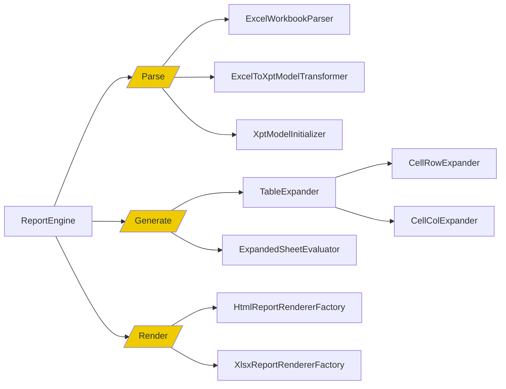

## 表格展开

非线性报表引擎的关键技术就是报表模板的展开算法，基本思想是**父格展开时自动递归复制所有子单元格，而子单元格展开时，自动延展同一行或者同一列的父单元格**。

> 如果父单元格与展开单元格不在同一行或者同一列中，则不需要被延展。

具体流程：

1. 自上而下，自左而右，依次执行单元格的展开逻辑
2. 如果父格尚未展开，则先展开父格

实现代码在[TableExpander.java](https://gitee.com/canonical-entropy/nop-entropy/blob/master/nop-report/nop-report-core/src/main/java/io/nop/report/core/engine/expand/TableExpander.java)中

```java
public void expand(IXptRuntime xptRt) {
   do {
      ExpandedCell cell = processing.poll();
      if (cell == null)
            return;

      if (cell.isRemoved() || cell.isExpanded())
            continue;

      if (cell.getColParent() != null && !cell.getColParent().isExpanded()) {
            processing.push(cell);
            processing.push(cell.getColParent());
            continue;
      }

      if (cell.getRowParent() != null && !cell.getRowParent().isExpanded()) {
            processing.push(cell);
            processing.push(cell.getRowParent());
            continue;
      }

      getCellExpander(cell).expand(cell, processing, xptRt);
   } while (true);
}
```

## 单元格展开

1. 运行expandExpr得到展开对象列表
2. 复用当前单元格作为展开后的第一个单元格
3. 然后以这个单元格为模板复制n-1次
4. 扩展父单元格

```javascript
// CellRowExpander
expandList = runExpandExpr(cell, xptRt)
cell.expandIndex = 0
cell.expandedValue = expandList[0]

expandCount = duplicate(expandedList, cell)
expandCells(cell, expandCount)
```

新插入的单元格需要建立父子关系，需要注意维护所有父格的rowDescendants集合。这里采用了空间换时间的方案。

```java
    public void addRowChild(ExpandedCell cell) {
        if (rowDescendants == null)
            rowDescendants = new HashMap<>();

        addToList(rowDescendants, cell);

        ExpandedCell p = rowParent;
        while (p != null) {
            if (p.rowDescendants == null)
                p.rowDescendants = new HashMap<>();
            addToList(p.rowDescendants, cell);
            p = p.getRowParent();
        }
    }
```

* 行父格和行子格不一定在同一行，但是一个行父格会管辖一块包含所有行子格的连续区域。**处于不同的父格的区域不会出现交叉，只会嵌套，构成严格的树形关系**。
* 同理，列父格的逻辑类似。

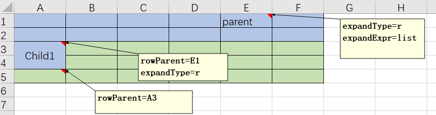

## 层次坐标

非线性报表模型理论中发明的层次坐标概念提供了一种访问展开后的单元格的一种精确、快捷的方式，使用它可以极大简化报表计算逻辑的表达。
类似同步、环比这样的常见计算都可以使用层次坐标来进行简单的表达。


一个层次坐标相当于是一个选择符，通过层次坐标可以在父子单元格组成的树结构中定位选择出满足条件的单元格集合。

```
层次坐标格式： CellName[rowCoordinates ; colCoordinates]
```


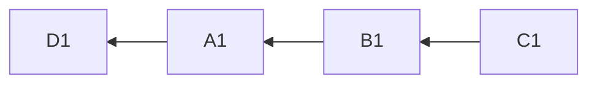

D1是A1的rowParent，所以A1展开的时候，D1会自动延展。

层次坐标中可以利用相对坐标来访问兄弟节点。

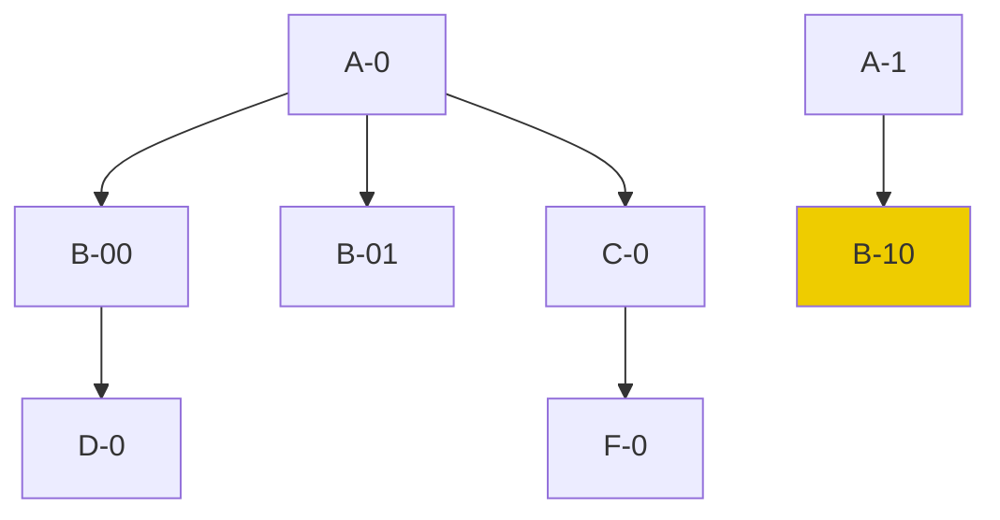

假设有如上的一个父子结构，在B-10节点中如下坐标`D[A:-1,B:1]`指向的是D-0节点

1.  A:-1表示当前A节点的前一个节点，即A-0
2.  B:1表示A-0节点范围内的第一个B节点，即B-00
3.  在B-00范围内查找D节点，得到D-0

## 三. 核心数据结构讲解

## 展开单元格：ExpandedCell

非线性报表的单元格展开算法中核心的数据结构是ExpandedCell。它的设计需要支持快速插入和复制，而且行和列处于对称地位（所有针对行的操作都可以直接翻译为针对列的操作）。

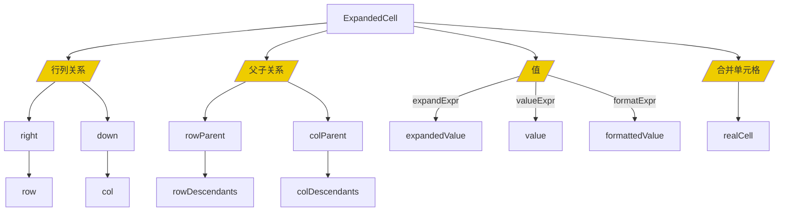

```java
public class ExpandedCell implements ICellView {
   ExpandedRow row;
   ExpandedCol col;

   ExpandedCell right;
   ExpandedCell down;


   // 对于合并单元格，realCell设置为左上角的单元格
   ExpandedCell realCell;
   int mergeDown;
   int mergeAcross;


   ExpandedCell rowParent;
   ExpandedCell colParent;

   // 递归包含所有子单元格
   Map<String, List<ExpandedCell>> rowDescendants = null;
   Map<String, List<ExpandedCell>> colDescendants = null;

   // expandExpr计算得到的值
   Object expandedValue;
   int expandedIndex;

   // valueExpr计算得到的值，在父子单元格展开完毕后执行
   Object value;

   // value为内存中的值，显示到界面上时执行formatExpr得到显示用的值
   Object formattedValue;

   boolean removed;

   // valueExpr已经执行完毕，value值可用
   boolean evaluated;

   // 缓存与单元格有关的动态计算的值
   Map<String, Object> computedValues;
}
```

1. ExpandedCell同时处在Row和Col中，行列对称
2. 通过down和right形成两个单向链表
3. 对于单元格合并的情况，插入单元格占位，通过realCell指向左上角的单元格
4. 行和列分别维护父子单元格关系

NopReport区分了expandedValue, value和formattedValue

1. expandedValue是expandExpr的计算结果，即在父子单元格展开过程中得到的值。执行expandExpr的时候层次坐标系还没有建立，因此不能使用层次坐标去访问其他的单元格
2. 在父子格展开完毕之后，根据valueExpr可以计算得到单元格的值。在计算过程中可以通过层次坐标访问其他单元格的值。如果没有指定valueExpr，则value=expandedValue
3. 单元格的值作为文本显示时会执行formatExpr，如果配置，则formattedValue=value

## 动态数据集：DynamicReportDataSet

报表引擎中用户最常用的数据类型就是数据集，一般是通过JDBC请求读取到的列表数据。NopReport提供了DynamicReportDataSet结构来简化报表引擎对表格数据的使用。

参见代码[DynamicReportDataSet.java](https://gitee.com/canonical-entropy/nop-entropy/blob/master/nop-report/nop-report-core/src/main/java/io/nop/report/core/dataset/DynamicReportDataSet.java)

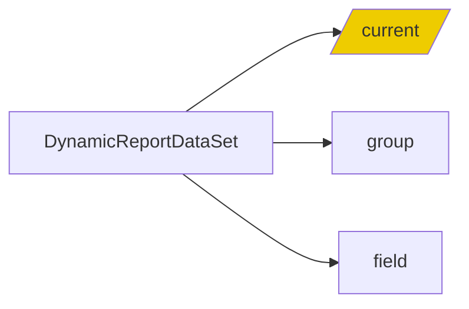

1. DynamicReportDataSet提供了group/groupBy/where/filter/sort/field/select/sum/max/min等大量集合选择和运算函数。
2. 它的计算结果与当前单元格密切相关，它根据xptRt.cell来获取到当前单元格，然后根据父格的expandedValue取交集得到当前所处理的数据集合。
3. current()函数实现动态查找当前实际可用数据列表。

> ds=ds1, expandType=r, field=xxx这种配置实际等价于 expandType=r,expandExpr=ds1.group("xxx")，它会设置展开单元格的expandedValue为分组汇总后的子数据集。
>
> 单元格可能同时具有行父格和列父格，它自身在执行ds1.field(name)这样的函数时，会取行父格与列父格中子数据集的**交集**，得到一个当前可见的集合列表，然后再执行相关操作

## 报表上下文： XptRuntime

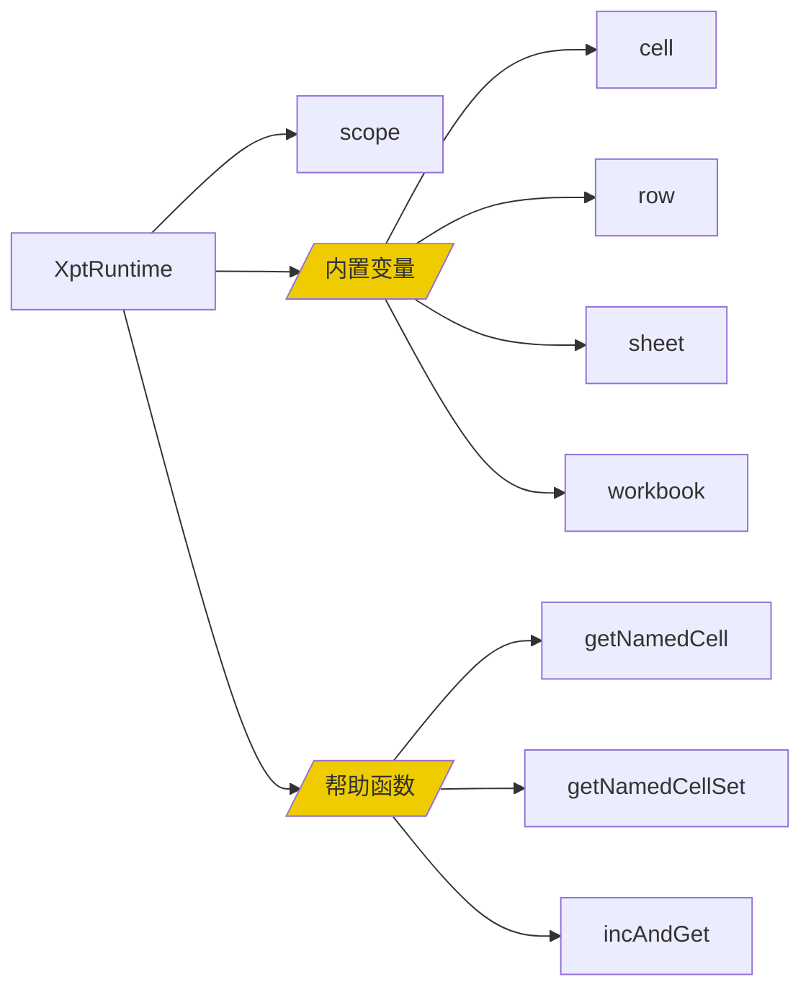

XptRuntime在报表展开算法执行的过程中会记录当前正在处理的单元格，从而在表达式中可以使用相对层次坐标来定位单元格。

XptRuntime还提供了一些使用相对坐标的函数，比如getNamedCells(cellName)返回指定模板单元格生成的、当前单元格可见的所有单元格。这里的可见指的是同属于同一个最近的父单元格。

## 四. 报表表达式引擎设计

报表引擎中的表达式需要引入层次坐标语法，从而简化数据获取逻辑的编写。

NopReport中的ReportExpr完全基于内置的XScript表达式引擎进行扩展，因此保留了对象方法调用和局部函数定义的能力。同时，通过使用Lambda表达式也避免了在表达式语言中引入特殊的程序语法。参见[ReportExpressionParser.java](https://gitee.com/canonical-entropy/nop-entropy/blob/master/nop-report/nop-report-core/src/main/java/io/nop/report/core/expr/ReportExpressionParser.java)

**与一般的报表引擎不同，NopReport的表达式引擎没有内置任何关于数据集的知识**

> 早期的报表引擎在开发的时候函数式编程概念还没有普及，所以一般会在表达式引擎中引入一些特殊语法来支持对数据集的转换和过滤，但是现在使用map、filter、flatMap、reduce等集合函数即可完成类似功能，没有必要再引入特殊语法。这也简化了表达式引擎的实现。

## 通过接口实现简化

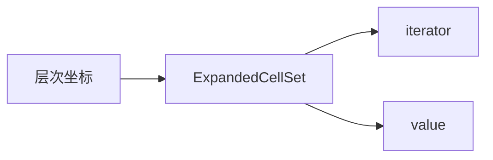

1. `A1`，`A1:B5`以及`A3[A2:-1]`这样的层次坐标表达式在运行期会返回[ExpandedCellSet](https://gitee.com/canonical-entropy/nop-entropy/blob/master/nop-report/nop-report-core/src/main/java/io/nop/report/core/model/ExpandedCellSet.java)对象。

2. ExpandedCellSet实现`Iterable<Object>`接口，可以被看作是一个值集合，在编程时可以像普通值列表一样被统一处理。参见[ReportFunctions.java](https://gitee.com/canonical-entropy/nop-entropy/blob/master/nop-report/nop-report-core/src/main/java/io/nop/report/core/functions/ReportFunctions.java)中的Excel函数实现。

```java
public static Number SUM(@Name("values") Object values) {
   if (values == null)
      return null;

   Iterator<Object> it = CollectionHelper.toIterator(values, true);
   Number ret = 0;

   while (it.hasNext()) {
      Object value = it.next();
      if (!(value instanceof Number))
            continue;
      ret = MathHelper.add(ret, value);
   }
   return ret;
}
```

3. 对于`A3 + 2 > B5`这样的表达式，会在编译期识别出层次坐标，并把它转换为`A3.value + 2 > B5.value`。而ExpandedCellSet上定义了getValue方法，用于返回集合中第一个单元格的值。

```java
    @Override
    public Object getValue() {
        if (cells.isEmpty())
            return null;
        ExpandedCell cell = cells.get(0);
        return cell.getValue();
    }
```

## 函数定义

* 通过[ReportFunctionProvider](https://gitee.com/canonical-entropy/nop-entropy/blob/master/nop-report/nop-report-core/src/main/java/io/nop/report/core/functions/ReportFunctionProvider.java)向报表引擎中注册全局函数。

* NopReport并没有定义任何特殊的函数接口，可以将任意的Java静态函数注册为表达式函数。而一般的报表引擎中定义的函数专为报表引擎设计，无法在报表引擎之外使用。编写也要符合一定的规范，需要有报表引擎相关的知识才能编写。

* 目前内置的函数参见[ReportFunctions.java](https://gitee.com/canonical-entropy/nop-entropy/blob/master/nop-report/nop-report-core/src/main/java/io/nop/report/core/functions/ReportFunctions.java)

## 性能优化

* NopReport没有使用POI库，甚至XML解析器都是手工实现，自行实现了一套Excel文件的流式解析和生成工具，从而避免了POI库所带来的一系列复杂性和性能损耗，同时也极大降低了运行时代码体积。

* 报表展开为纯函数式运算，因此表达式的计算结果可以进行缓存。ExpandedCell提供了一个缓存集合，可以通过

```java
   ExpandedCell firstCell = xptRt.getNamedCell(cellName);
   // 利用第一个单元格的计算属性来缓存汇总结果
   Number sum = (Number) firstCell.getComputed(XptConstants.KEY_ALL_SUM,
            c -> SUM(xptRt.getNamedCellSet(cellName)));
```

具体实例可以参见[ReportFunctions.java](https://gitee.com/canonical-entropy/nop-entropy/blob/master/nop-report/nop-report-core/src/main/java/io/nop/report/core/functions/ReportFunctions.java)中PROPORTION等函数的实现。

## 五. 可扩展设计

与一般的报表引擎不同，NopReport没有引入任何额外的插件机制，也没有设计SPI服务提供接口机制。它利用Nop平台内置的Delta定制能力以及XPL模板语言，可以实现其他引擎所无法达到的可扩展性。

1. 报表DSL的设计中大量配置支持XPL模板语言，例如beginLoop, beforeExpand等
2. 在xpl段中，可以使用`<c:import>`标签引入外部模板库，模板库可以通过Delta定制机制进行定制
3. 在xpl段中，可以通过import语句引入Java类，可以通过`inject(beanName)`函数使用IoC容器中的bean
4. 通过ReportFunctionProvider可以将任意的Java静态函数注册为报表表达式可以使用的函数

例如，可以通过spl.xlib标签库引入润乾SPL计算引擎来计算得到数据集。

```xml
<beforeExpand>
   <spl:MakeDataSet xpl:lib="/nop/report/spl/spl.xlib" dsName="ds1" src="/nop/report/demo/spl/test-data.splx"/>

   <c:script>
      import xx.MyBean;

      const myHelper = inject("myHelper");
      assign("ds2", myHelper.genDataSet())
   </script>
</beforeExpand>
```

**有了IoC容器和模板语言，一般不再需要额外设计插件机制**，即使是远程加载Jar包，动态初始化bean等复杂的扩展机制，也可以通过Xpl标签库引入，通过标签调用屏蔽所有底层的复杂性。

## 模型化数据导入

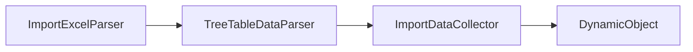

ImportExcelParser会分析ExcelWorkbook中单元格的布局，按照通用的规则识别出Tree结构，解析得到对象。


ExcelTemplateToXptModelTransformer分析ExcelWorkbook的结构，自动将它转换为报表模型

基于可逆计算理论设计的低代码平台NopPlatform已开源：

- gitee: https://gitee.com/canonical-entropy/nop-entropy
- github: https://github.com/entropy-cloud/nop-entropy
- 开发示例：https://gitee.com/canonical-entropy/nop-entropy/blob/master/docs/tutorial/tutorial.md
- 文档入口：https://gitee.com/canonical-entropy/nop-entropy/blob/master/docs/index.md
- 理论介绍：https://zhuanlan.zhihu.com/p/64004026
- 可逆计算原理和Nop平台介绍及答疑: https://www.bilibili.com/video/BV14u411T715/
