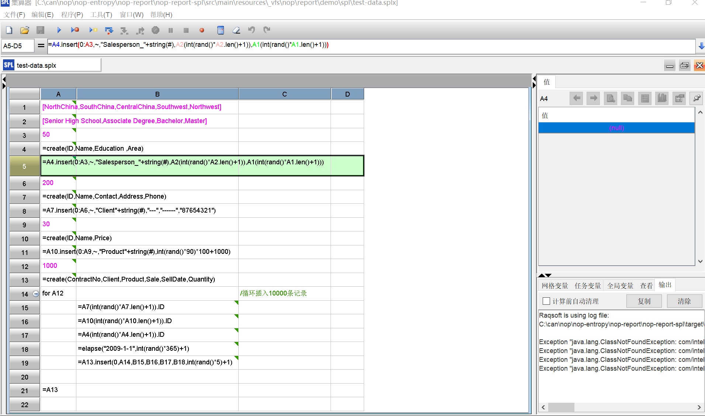

# 润乾集算器(SPL)

SPL介绍视频: [没有 RDB 也敢揽 SQL 活的开源金刚钻 SPL](https://www.bilibili.com/video/BV18a411m7M5/)
SPL参考文档: [集算器 - 敏捷计算编程语言](http://www.raqsoft.com.cn/p/esproc-spl)

Nop平台集成SPL的[介绍视频](https://www.bilibili.com/video/BV1Km4y1m7y2/)



在Nop平台中集成SPL只需要引入nop-report-spl模块。在程序中可以通过以下几种方式来调用SPL；

1. 调用 SplExecutor.executeForPath(IEvalScope scope, String path)函数来执行SPL文件。 path为SPL或者SPLX文件所对应的虚拟路径。
2. 直接调用SplExecutor.executeSPL(IEvalScope scope, String splSource)函数来执行SPL语句。
3. 在XPL模板语言中可以通过标签库 `<spl:Execute src="xxx.splx" xpl:return="result" />`来调用
4. 在NopReport报表引擎中，可以通过如下方式调用SPL语句来构造数据集

```xml
<spl:MakeDataSet xpl:lib="/nop/report/spl/spl.xlib" dsName="ds1" src="/nop/report/demo/spl/test-data.splx" />
```
