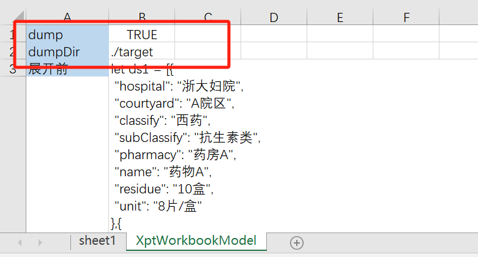
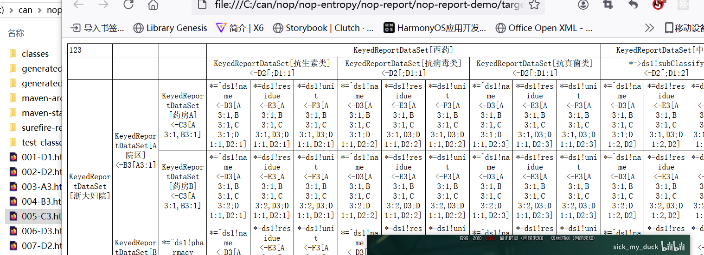

# 报表引擎

## 初始化数据

在Excel报表文件中，通过XptWorkbookModel这个Sheet来设置整个报表的初始化逻辑。它对应workbook.xdef元模型中的XptWorkbookModel定义。

一般我们在【展开前】这个xpl段中执行初始化代码，例如

```
<c:script>
  let entity = {...}
  assign("entity",entity);

  let ds1 = [...];
  xptRt.makeDs("ds1",ds1);
</c:script>
```

assign调用将把变量设置到scope上下文中，在报表单元格中就可以使用该变量。否则变量的作用域就是script内部，不会暴露给外部环境。
xptRt.makeDs函数将一个列表数据包装为ReportDataSet对象，并设置到scope上下文中。

## 单元格表达式

在单元格中，可以通过EL表达式形式来设置单元格的值，例如 ${entity.name}。

在单元格表达式的执行环境中存在一个全局变量 xptRt，它对应于IXptRuntime类型，提供如下属性和方法

- xptRt.cell : 当前单元格， ExpandedCell类型
- xptRt.row  : 当前行
- xptRt.table: 当前表格
- xptRt.sheet； 当前Excel表单
- xptRt.workbook: 当前Excel工作簿
- xptRt.field(name): 从最近邻的环境对象上获取字段值
- cell: 等价于xptRt.cell
- row: 等价于xptRt.row
- table: 等价于xptRt.table
- sheet: 等价于xptRt.sheet
- workbook: 等价于xptRt.workbook

### cell对象上的属性

cell对应于 ExpandedCell类型

* rowParent或者rp: 行父格
* colParent或者cp: 列父格
* expandValue 或者ev: 单元格展开表达式返回的条目值
* expandIndex 或者ei: 单元格展开时在父格中的下标，从0开始
* value 当前单元格的值

## 单元格展开

在单元格的批注中可以写如下属性

- expandType:  r表示沿行的方向展开，而c表示沿列的方向展开

- expandExpr:  如果非空，则表达式应该返回一个集合，当前单元格会按照此集合的值展开成多个单元格。

- ds: 当前数据源对象

- field: 如果没有指定expandExpr，而指定了field，则按照该字段对当前数据集进行汇总，然后针对分组情况进行展开。

- keepExpandEmpty: 当展开集合返回空时，缺省情况下会把对应单元格及其子单元格都删除。但是如果设置了keepExpandEmpty，则这些未展开的单元格会保留，但值会被设置为null

- rowParent: 行父格。必须是一个设置了expandType的单元格。行父格展开时会复制所有的子单元格。如果不指定，则向左侧查找。

- colParent: 列父格。必须是一个设置了expandType的单元格。列父格展开时会复制所有的子单元格。如果不指定，则向上查找。

- expandMinCount: 控制展开时最少有多少个元素，如果expandExpr返回的长度较小，则补充null。

- expandMaxCount: 控制展开时最多有多少个元素。超过的行将会被自动丢弃
* rowParent和colParent如果设置为A0，则表示它们是根单元格，没有父格。
* formatExpr: 单元格具有value和formattedValue两个属性。value是计算出来的值，而formattedValue是格式化后的值。如果配置了formatExpr，则formattedValue会被设置为formatExpr的值。
* dict: 如果配置了字典表，且没有配置formatExpr，则自动计算formattedValue为字典项的label。也就是说显示在界面上的是经过字典翻译后的文本。
   如果没有配置formatExpr，也没有配置dict，则会考虑Excel的单元格样式中是否配置了格式化规则，会尝试使用Excel格式化规则来得到formattedValue

批注中可配置的属性参考 workflow.xdef元模型中的cell节点的model部分。

在单元格的文本中，我们可以直接写表达式语法。优点是在界面上可以直接看见表达式内容，而不需要把批注展开。
支持两种格式的文本表达式语法：

1. EL表达式：例如${entity.myField}
2. 展开表达式：它采用 `*=`作为前缀
   A. `*=fieldName` 等价于配置field=fieldName
   B. `*=^ds1!fieldName`，等价于配置 expandType=r, ds=ds1, field=fieldName
   C. `*=>ds1!fieldName` 等价于配置 expandType=c, ds=ds1, field=fieldName
   D. `*=^fieldName@data` 等价于配置 expandType=r, expandExpr=data, field=fieldName

## 层次坐标

层次坐标是由润乾报表所首创的一种报表数据定位方式。目前Nop平台的实现类似于帆软报表的设计：[层次坐标](https://help.fanruan.com/finereport/doc-view-3802.html)

层次坐标分为相对坐标和绝对坐标：


## 报表整体配置

### 在【XptWorkbookModel】这个sheet中配置全局参数

* 展开前：在报表引擎执行展开算法之前调用的xpl代码。可以在这里准备数据。通过assign函数设置数据到报表上下文中
* 删除隐藏单元：缺省情况下隐藏的行或者列会被输出，在这里可以设置为true，从而输出时删除隐藏列。

## 常用公式

1. 在C3(占比)单元格中直接使用占比公式：=PROPORTION(B3)；占比：当前值占总值的比例

2. 比较：当前值与第一个值做比较 计算公式为：当前值减去第一个值（C2/C2\[A2:1\]）

3. 环比：当前值比上月份的值； 计算公式 IF(B4.expandIndex \> 0 , C4 / C4\[B4:-1\] , '--') , B4为月份，C4为金额

4. 单元格展开位置： A2.expandIndex 从0开始，对应于帆软表达式的 \&A2

5. 同期比：

## 内置函数

具体参见[ReportFunctions](https://gitee.com/canonical-entropy/nop-entropy/blob/master/nop-report/nop-report-core/src/main/java/io/nop/report/core/functions/ReportFunctions.java)
类中定义的函数。

* SUM
* PRODUCT
* COUNT
* COUNTA
* AVERAGE
* MIN
* MAX
* NVL(value, defaultValue): 当value为null时返回defaultValue
* PROPORTIION: 占比
* RANK: 计算排名
* ACCSUM: 累积汇总

## 导出Excel公式

如果在Excel单元格中配置了Excel公式，则导出Excel的时候会将valueExpr转换为Excel公式输出。例如 SUM(A3)将可以经过报表展开后成为
SUM(A3:D5)

对于复杂的层次坐标表达式，无法直接用Excel公式直接表达，则可以配置valueExpr,然后设置单元格的exportFormula=true。

## 与润乾集算器集成

润乾软件开源了一个数据处理中间件，可以使用类似于报表表达式的机制对异构数据进行处理加工。在Nop平台中可以很方便的集成SPL处理引擎。具体参见[spl.md](spl.md)

## 常用表达式

* xptRt.seq(seqName): 相当于是 seqName ++，即读取seqName对应的变量值，执行递增操作，然后返回递增之前的值。如果一开始变量不存在，则认为初始化为1

## 调试

在【XptWorkbookModel】配置中可以设置`dump=true`启用调试文件输出，在模板展开的过程中会把每一个中间结果输出到dumpDir目录下，dumpDir的缺省值为`./target`。



调试文件的文件名格式为`{seq}-{cellPos}.html`


调试文件中的每个单元格中的内容为 `cellText <- cellLayerCoordinate`。

同时在日志中会打印出报表单元格的父子关系

## 常见问题解答：

### 1. 单元格的展开值`cell.expandValue`和单元格个的值`cell.value`之间有什么区别?

展开和计算单元格的值是两个步骤，第一步是按照层次坐标展开，此时使用的是展开表达式expandType，得到的是展开值expandValue。
只有设置了expandType和expandExpr的单元格才具有展开值。

全部展开完毕后再执行单元格计算，此时根据valueExpr计算单元格的值。如果没有设置valueExpr，则单元格会取展开值expandValue为自己的缺省值。

### 2. 如何支持默认多个空行

* 在单元格中配置expandInplaceCount，然后在模板中实现插入多行。如果展开表达式返回个数小于这个值，则不需要新增单元格。

### 3. 数据条数过多，怎么支持  只显示 前 几个

可以配置单元格的expandExpr，通过表达式去控制具体展开时返回的条目。 更简单的方式是通过expandMinCount来控制
