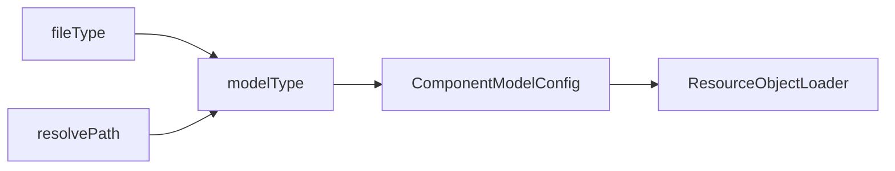

# DSL模型文件加载




1. 根据文件虚拟路径vPath得到文件类型fileType，然后再得到modelType
2. 或者根据`resolve-{modelType}:`这种动态解析路径得到modelType
3. 根据modelType获取到对应的LoadingCache
4. 在LoadingCache的Loader中再根据fileType获取到具体对用的Loader。fileType到Loader之间的绑定关系在register-model.xml配置文件中定义。

目前系统中内置的Loader配置有两种：

1. xslx-loader: 解析Excel模型文件
2. xdsl-loader: 解析xdef模型定义的XML文件


## RuleModel的配置示例

```xml
<model x:schema="/nop/schema/register-model.xdef" xmlns:x="/nop/schema/xdsl.xdef"
       name="rule">

    <resolve-handler resolveInDir="/nop/rule" defaultLoaderBean="nopDaoRuleModelLoader" />

    <loaders>

        <loader fileType="rule.xlsx"
                class="io.nop.rule.core.model.compile.RuleExcelModelLoader"/>

        <loader fileType="rule.xml"
                class="io.nop.rule.core.model.compile.RuleDslModelLoader"/>

    </loaders>

</model>
```

resolve-rule:myRule/v1 会查找

1. /nop/rule/myRule/v1.rule.xlsx
2. /nop/rule/myRule/v1.rule.xml
3. 查找NopRuleDefinition表中定义的规则模型