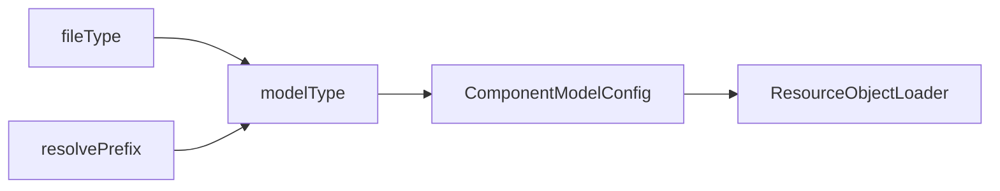

# DSL模型文件加载

[B站讲解视频](https://www.bilibili.com/video/BV1rH4y117hd/)

Nop平台中统一使用ResourceComponentManager来加载DSL模型。

```javascript
model = ResourceComponentManager.instance().loadComponentModel(path);
```

## 加载时支持两种路径格式：

1. 普通的虚拟路径，例如`/nop/rule/test/myRule/v1.rule.xml`，直接指定具体对应的资源文件，由VirtualFileSystem来处理Delta路径解析
2. 使用resolve机制动态确定资源文件，例如`resolve-rule:test/myRule`,底层可以是虚拟文件系统管理的资源文件，也可以是存储在数据库中的数据记录。

## 注册加载器

在平台初始化的过程中，会自动搜集所有/nop/core/registry/xxx.register-model.xml模型注册文件中所定义的注册信息，
建立文件类型(fileType)与加载器(ResourceObjectLoader)之间的映射关系。

> fileType与fileExt的区别在于，它在fileName中查找最后两个dot, 而不是最后一个dot。 例如 a.orm.xml对应fileType=orm.xml, 而fileExt=xml。

### RuleModel加载器的注册配置

```xml
<model x:schema="/nop/schema/register-model.xdef" xmlns:x="/nop/schema/xdsl.xdef"
       name="rule">

    <!--
        resolve-rule:在/nop/rule目录下查找不同后缀名的模型文件，如果不存在，就使用nopDaoRuleModelLoader在数据库中查找。
    -->
    <resolve-handler resolveInDir="/nop/rule" defaultLoaderBean="nopDaoRuleModelLoader" />

    <loaders>

        <loader fileType="rule.xlsx"
                class="io.nop.rule.core.model.compile.RuleExcelModelLoader"/>

        <loader fileType="rule.xml"
                class="io.nop.rule.core.model.compile.RuleDslModelLoader"/>

    </loaders>

</model>
```

resolve-rule:test/myRule/v1 会查找

1. /nop/rule/test/myRule/v1.rule.xlsx
2. /nop/rule/test/myRule/v1.rule.xml
3. 查找NopRuleDefinition表中定义的规则模型, ruleName=test/myRule

## loadComponentModel实现

基本逻辑是根据文件类型或者resolve前缀确定模型类型(modelType)，然后根据modelType得到注册的ComponentModelConfig，利用其中定义的Loader来实际解析DSL模型。

* 加载过程中利用ResourceLoadingCache来实现解析结果的缓存。
* ResourceLoadingCache会自动跟踪模型依赖的变化。当模型解析过程中依赖的任何文件发生变化时，都会导致模型缓存自动失效。



1. 根据文件虚拟路径vPath得到文件类型fileType，然后再得到modelType
2. 或者根据`resolve-{modelType}:`这种动态解析路径得到modelType
3. 根据modelType获取到对应的ResourceLoadingCache
4. ResourceLoadingCache判断depends集合中的依赖文件是否发生变化，如果没有变化，则返回缓存的解析结果
5. 在ResourceLoadingCache的Loader中再根据fileType获取到具体对用的Loader。

目前系统中内置了两种特殊的loader，可以直接使用元模型定义，无需编写特殊的Loader类

1. xslx-loader: 解析Excel模型文件
2. xdsl-loader: 解析xdef模型定义的XML文件

例如ORM模型的注册配置为

```xml
<model x:schema="/nop/schema/register-model.xdef" xmlns:x="/nop/schema/xdsl.xdef"
       name="orm">
    <loaders>
        <xlsx-loader fileType="orm.xlsx" impPath="/nop/orm/imp/orm.imp.xml"/>
        <xdsl-loader fileType="orm.xml" schemaPath="/nop/schema/orm/orm.xdef"/>
    </loaders>
</model>
```
