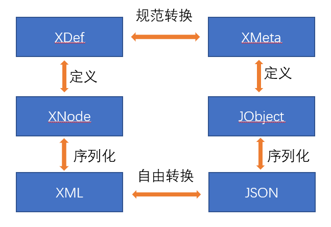

# XDSL：通用的领域特定语言设计

Nop平台提供了面向语言编程的编程范式，即我们解决问题时总是倾向于先设计一个领域特定语言(DSL)，然后再利用该DSL来具体描述业务逻辑。Nop平台中极大简化了创建自定义DSL的过程。

## 一. 采用XML或者JSON语法

领域特定语言的价值在于它精炼了领域内特有的逻辑关系，定义了专属于该领域的原子语义概念，至于具体语法形式，并不是关键。程序代码经过`Lexer`和`Parser`解析后会得到抽象语法树(AST)，所有的程序语义原则上都是由AST来承载。XML和JSON都是树形结构，可以直接表达AST，从而完全避免编写特殊的`Lexer`和`Parser`。

> Lisp语言的做法正是直接使用通用的`S-Expr`来表达AST，从而可以很容易的使用宏机制来定义自定义的DSL。基于XML语法可以做到类似的效果，特别是XML标签可以表示模板函数，动态生成新的XML节点，起到类似Lisp宏的作用（代码和代码生成结果的结构都是XML节点，这对应于[Lisp语言中所谓的同像性](https://zhuanlan.zhihu.com/p/34063805)）。

我们使用XDef元模型定义语言来约束DSL的语法结构，例如 [beans.xdef](https://gitee.com/canonical-entropy/nop-entropy/blob/master/nop-xdefs/src/main/resources/_vfs/nop/schema/beans.xdef)。相比于XML Schema或者JSON Schema，XDef定义更加简单直观，而且可以表达更复杂的约束条件。关于XDef语言的细节，可以参考[xdef.md](xdef.md)

> Nop平台中的所有DSL都通过XDef语言来定义，包括工作流、报表、IoC、ORM等，定义文件统一存放在[nop-xdefs模块](https://gitee.com/canonical-entropy/nop-entropy/tree/master/nop-xdefs/src/main/resources/_vfs/nop/schema)中。



XDef不仅仅定义了XML格式的DSL语法，它还规定了一种XML和JSON之间的双向转换规则。因此，只要定义了XDef元模型，就可以自动得到JSON表示，可以直接用于前台可视化编辑器的输入输出。

在没有定义XDef元模型的情况下，Nop平台也定义了一种紧凑的约定转换规则，可以实现无Schema约束情况下XML和JSON的双向转换。具体参见前端AMIS页面的XML表示：[amis.md](../xui/amis.md)

## 二. XDSL通用语法

将所有的DSL都归一化为XML格式之后，就可以统一提供模块分解、差量合并、元编程等高级机制了。Nop平台定义了统一的XDSL扩展语法，自动为所有通过XDef元模型定义的DSL语言增加可逆计算扩展语法，具体XDSL语法的内容由[xdsl.xdef](https://gitee.com/canonical-entropy/nop-entropy/blob/master/nop-xdefs/src/main/resources/_vfs/nop/schema/beans.xdef)这一元模型来定义。

XDSL的主要语法元素示例如下:

```xml
<orm x:schema="/nop/schema/orm/orm.xdef"
     x:extends="base.orm.xml" x:dump="true"
     xmlns:x="/nop/schema/xdsl.xdef" xmlns:xpl="/nop/schema/xpl.xdef">
    <x:gen-extends>
        <pdman:GenOrm src="test.pdma.json" xpl:lib="/nop/orm/xlib/pdman.xlib"
                      versionCol="REVISION"
                      createrCol="CREATED_BY" createTimeCol="CREATED_TIME"
                      updaterCol="UPDATED_BY" updateTimeCol="UPDATED_TIME"
                      tenantCol="TENANT_ID"
        />
    </x:gen-extends>

    <x:post-extends>
        <orm-gen:JsonComponentSupport xpl:lib="/nop/orm/xlib/orm-gen.xlib"/>
    </x:post-extends>

    <entities>
        <entity name="io.nop.app.SimsClassFee" x:override="remove"/>
    </entities>
</orm>
```

1. 所有的XDSL文件都要求根节点上必须使用`x:schema`属性来指定所使用的xdef定义文件
2. 根节点上可以设置`x:dump="true"`来打印差量合并过程的中间结果以及最终生成的合并结果。在Quarkus框架的调试模式下最终的合并结果会输出到当前工程的\_dump目录下。
3. `x:extends`属性引入被继承的基础模型，当前模型和base模型将按照树形结构逐级进行合并。
4. `x:gen-extends`和`x:post-extends`提供内置的元编程机制，它们可以动态生成模型对象，然后再和当前模型进行合并。
5. 通过`x:override`属性可以控制两个节点合并时的细节，例如`x:override="remove"`表示删除基础模型中的对应节点，而`x:override="replace"`则表示由当前节点完全覆盖基础模型中的对应节点。缺省情况下`x:override="merge"`，它表示逐级进行子节点合并。合并规则的详细介绍参见文档[x-override.md](x-override.md)

### x-extends的合并顺序

`x-extends`差量合并机制实现了可逆计算理论所要求的技术模式

> App = Delta x-extends Generator<DSL>

具体来说，`x:gen-extends`和 `x:post-extends`都是编译期执行的`Generator`，它们利用XPL模板语言来动态生成模型节点，允许一次性生成多个节点，然后依次进行合并，具体合并顺序定义如下：

```
<model x:extends="A,B">
    <x:gen-extends>
        <C/>
        <D/>
    </x:gen-extends>

    <x:post-extends>
        <E/>
        <F/>
    </x:post-extends>
</model>
```

合并结果为

```
F x-extends E x-extends model x-extends D x-extends C x-extends B x-extends A
```

当前模型会覆盖`x:gen-extends`和`x:extends`的结果，而`x:post-extends`会覆盖当前模型。

借助于`x:extends`和`x:gen-extends`我们可以有效的实现DSL的分解和组合。

### x:post-extends的重要意义

如果我们已经创建了一个XDSL领域特定语言，现在希望针对一些特殊场景引入额外的扩展，但是不想修改底层的运行时引擎，则可以利用`x:post-extends`机制。

基于可逆计算理论，对于已有的DSL，我们可以对它进行进一步的可逆计算分解，得到一个新的DSLx。

```java
App = Delta x-extends Generator<DSL>
DSL = Delta x-extends Generator<DSLx>
```

我们描述业务的时候可以使用DSLx这种扩展语法，然后通过`x:post-extends`将它转化为已有的DSL语法。**`x-extends`合并算法执行完毕之后会自动删除所有x名字空间的属性和子节点**，所以最底层的解析和运行引擎完全不需要知道这些扩展语法的知识，它们只需要针对原有的DSL语义概念进行编写即可，**所有的通用扩展机制都在XDSL语法层面由编译期元编程来实现**。

举一个具体的例子。在ORM引擎中对于JSON文本字段我们希望它对应于两个实体属性，一个`jsonText`对应于JSON文本存储，另一个`jsonComponent`对应于将JSON文本解析为对象结构，修改对象属性最终会导致`jsonText`存储文本被修改。我们希望通过为字段增加`json`标签来标记它是一个JSON文本，然后自动为该字段生成对应的`component`属性。这是一种特殊的约定，我们并不希望把它内置到ORM引擎中，此时我们可以使用`x:post-extends`机制来实现这一抽象。

```xml
<orm x:schema="/nop/schema/orm/orm.xdef"
     x:extends="base.orm.xml">
    <x:post-extends>
        <orm-gen:JsonComponentSupport xpl:lib="/nop/orm/xlib/orm-gen.xlib"/>
    </x:post-extends>
    <entities>
      <entity name="xxx.MyEntity">
            <columns>
                <column name="jsonExt" code="JSON_EXT" propId="101" tagSet="json"
                        stdSqlType="VARCHAR"
                        precision="4000"/>
            </columns>
        <!-- 最终会自动生成component配置
           <components>
              <component name="jsonExtComponent"
                         class="io.nop.orm.component.JsonOrmComponent">
                 <prop name="jsonText" column="jsonExt" />
              </component>
           </components>
         -->
      </entity>
    </entities>
</orm>
```

如果我们自定义的扩展很多，则可以进一步封装为一个基础模型，例如

```xml
<!-- std.orm.xml -->
<orm x:schema="/nop/schema/orm/orm.xdef"
     x:extends="base.orm.xml">

    <x:post-extends>
        <orm-gen:JsonComponentSupport xpl:lib="/nop/orm/xlib/orm-gen.xlib"/>
    </x:post-extends>
</orm>
<!-- my.orm.xml -->
<orm x:extends="std.orm.xml">
    ....
</orm>
```

可以将常用的扩展封装到一个`std.pom.xml`模型中，然后只需要继承该模型即可获得对应扩展支持。

> `x:extends`支持逗号分隔的多个模型路径，可以一次性继承多个基础模型。这些模型按照从前向后的顺序依次合并。

更进一步，**`x:post-extends`为实现定制化的可视化设计器铺平了道路**。`x-extends`合并算法执行的时候可以指定合并阶段，如果只合并到`mergeBase`阶段，则我们会得到当前模型与`x:gen-extends`合并后的结果，但此时尚未应用`x:post-extends`。可视化设计器可以针对`mergeBase`的产物进行设计，提供大量业务特定的配置选项，而底层的运行引擎无需做出任何改动。

在Nop平台中，OA审批常见的会签节点就是采用`x:post-extends`机制实现。底层的工作流引擎是为通用场景而设计的。因为会签的功能可以通过`一个普通步骤节点+一个Join合并节点`来实现，所以没有必要在底层引擎中内置会签相关的知识。在工作流设计器中我们提供了会签节点以及大量OA相关的简化操作，然后在元编程阶段由`x:post-extends`机制负责将这些OA相关的配置展开为底层引擎可识别的模型节点和属性。

### 可执行语义

XDSL中通过XLang语言来实现可执行语义。只要在xdef元模型中标注某个属性为EL表达式，或者某个节点内容为XPL模板语言，则该属性就会被自动解析为`IEvalAction`可执行函数接口。具体示例可以参见[wf.xdef](https://gitee.com/canonical-entropy/nop-entropy/blob/master/nop-xdefs/src/main/resources/_vfs/nop/schema/wf/wf.xdef)

```xml
 <action name="!string" >
    <when xdef:value="xpl-predicate"/>

    <arg name="!var-name" xdef:ref="WfArgVarModel" xdef:unique-attr="name"/>

    <source xdef:value="xpl"/>
 </action>
```

Nop平台通过`nop-idea-plugin`插件为XLang语言提供了文档提示、自动补全、语法校验、断点调试等功能。具体参见[idea-plugin.md](https://gitee.com/canonical-entropy/nop-entropy/blob/master/docs/user-guide/idea/idea-plugin.md)


### 超越接口和组件的Delta定制

基于可逆计算理论，Nop平台的XDSL内置了一种通用的Delta定制机制，它与传统的接口抽象和组件组装的方式相比，要更加简单、灵活。

所有的XDSL模型文件都存放在`src/resources/_vfs`目录下，它们组成一个虚拟文件系统。这个虚拟文件系统支持Delta分层叠加的概念（类似于Docker技术中的`overlay-fs`分层文件系统），缺省具有分层`/_delta/default`(可以通过配置增加更多的分层)。也就是说，如果同时存在文件`/_vfs/_delta/default/nop/app.orm.xml`和`/nop/app.orm.xml`文件，则实际使用的是delta目录下的版本。在delta定制文件中，可以通过`x:extends="raw:/nop/app.orm.xml"` 来继承指定的基础模型，或者通过`x:extends="super"`来表示继承上一层的基础模型。

Delta定制非常灵活，粒度可粗可细。粗到可以定制整个模型文件。细到可以定制单个属性或节点。而且与接口定制不同，Delta定制可以实现**删除**功能，即在定制文件中标记删除模型中的某个部分，而且是真正的删除，并不是以空操作来模拟，不会影响到运行时性能。

与传统的编程语言所提供的定制机制相比，**Delta定制的规则非常通用直观，与具体的应用实现无关**。以ORM引擎所用到的数据库Dialect定制为例，如果要扩展Hibernate框架内置的`MySQLDialect`，我们必须要具有一定的Hibernate框架的知识，如果用到了Spring集成，则我们还需要了解Spring对Hibernate的封装方式，具体从哪里找到Dialect并配置到当前`SessionFactory`中。而在Nop平台中，我们只需要增加文件`/_vfs/default/nop/dao/dialect/mysql.dialect.xml`，就可以确保所有用到MySQL方言的地方都会更新为使用新的Dialect模型。

Delta定制代码存放在单独的目录中，可以与程序主应用的代码相分离。例如将delta定制文件打包为`nop-platform-delta`模块中，需要使用此定制的时候只要引入对应模块即可。我们也可以同时引入多个delta目录，然后通过`nop.core.vfs.delta-layer-ids`参数来控制delta层的顺序。例如配置 `nop.core.vfs.delta-layer-ids=base,hunan` 表示启用两个delta层，一个是基础产品层，在其上是某个具体部署版本所使用的delta层。通过这种方式，我们可以以极低的成本实现软件的产品化：**一个功能基本完善的基础产品在各个客户处实施的时候可以完全不修改基础产品的代码，而是只增加Delta定制代码**。

### 三. Antlr扩展

Nop平台对于自定义程序语法的DSL开发也提供了一定的支持，可以基于Antlr4的g4文件定义直接生成AST的解析器（Antlr内置只支持解析到`ParseTree`，需要手工编写从`ParseTree`到AST的转换代码）。具体参见[antlr.md](antlr.md)


## 在任意XML/JSON基础上增加XDSL支持
任何XML和JSON都可以被自动改造为XDSL。比如说前端AMIS框架本身采用了JSON格式，我们不需要对AMIS引擎进行任何修改，通过统一的DeltaJsonLoader，就可以为AMIS引入可逆计算的分解合并机制。

```json
{
  "x:extends": "继承已有的其他AMIS文件，实现页面分解，AMIS并没有内置的分解机制",
  "title": "在继承的页面基础上可以差量化定制修正",
  "x:override": "缺省合并运算采用merge方式，可以通过x:override修改为remove/replace/bounded-merge等",
  "x:gen-extends": "这里可以写xpl模板语言来动态生成基础对象结构",
  "feature:on": "这里的特性表达式返回true的时候本节点才存在，否则自动删除节点"
}
```

具体XDSL使用了哪些语法属性，参见[xdsl.xdef元模型定义](https://gitee.com/canonical-entropy/nop-entropy/blob/master/nop-xdefs/src/main/resources/_vfs/nop/schema/xdsl.xdef).
`x:override`合并算子的介绍参见[x-override.md](x-override.md)
