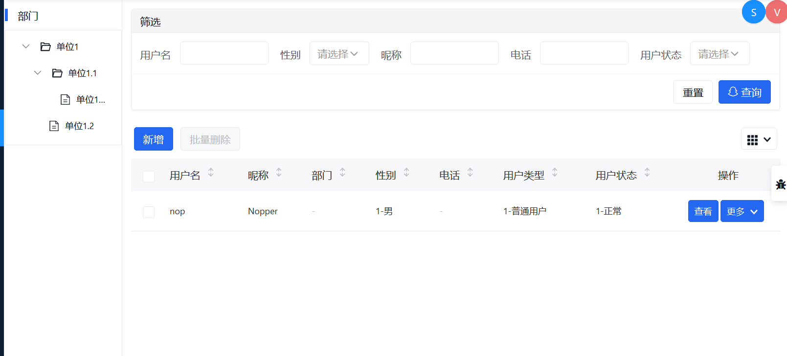

# 布局语言

在Nop平台中，我们通过NopLayout这一专用于表单布局的领域特定语言来实现表单布局信息和（字段级）内容信息之间的分离。例如对于如下表单布局

```xml
 <form id="add" editMode="add" title="新增-用户" i18n-en:title="Add User">
  <layout>
    ============>baseInfo[基本信息]======
    userName[用户名] status[用户状态]
    nickName[昵称]
    deptId[部门]

    ===========^extInfo[扩展信息]=========
    idType[证件类型] idNbr[证件号]
    birthday[生日] workNo[工号]
    positionId[职务]
    remark[备注]
  </layout>
</form>
```

对应显示


## 一. 布局语法

NopLayout规定了如下规则：

1. 指定每行显示的字段，例如 `a b` 表示本行显示`a`和`b`字段

2. 通过`fieldName[displayName]`指定字段名以及对应的显示名

3. 通过`===分组名[分组Label]===`标记分组

4. 如果为分组指定Label，则使用`FieldSet`控件来显示分组，并通过符号`^`表示分组收缩，符号`>`表示分组展开

5. 在字段名前标记符号`@`, 表示该字段是只读字段，前台使用view模式的控件去显示

6. 在字段名前标记符号`!`，表示不显示Label。

例如在用户列表的左侧增加按照部门进行过滤，本质上是在左侧引入一个过滤表单

```xml
<form id="asideFilter" submitOnChange="true" editMode="query">
  <layout>
    ==dept[部门]==
    !deptId
  </layout>
  <cells>
    <cell id="deptId">
      <gen-control>
        <input-tree
           source="@query:NopAuthDept__findList/value:id,label:deptName,
              children @TreeChildren(max:5)?filter_parentId=__null"/>
      </gen-control>
    </cell>
  </cells>
</form>
```

`deptId`字段前标记符号`!`，表示不显示Label，最后得到



## 二. 字段控件推定

字段级别的显示控件一般情况下可以根据数据模型中定义的字段类型和数据域来推定。

例如对于字段`gender`，我们指定了它使用`auth/gender`这个字典，取值范围只能是字典范围内的值。对于字段`email`,它的数据域(domain)设置为`email`，要求录入格式必须是满足email格式规范。

具体推导需要使用的控件时，首先会确定字段的编辑模式（一般与表单的`editMode`设置相同，但可以单个字段指定），然后在`control.xlib`控件标签库中按照如下顺序依次查找，以第一个匹配的控件为准：

1. 查找名称为`{editMode}-{control}`的控件, `control`为在`cell`配置中明确指定的`control`属性。

2. 查找名称为`{editMode}-{domain}`的控件，例如`<edit-email/>`

3. 如果配置了字典项，则查找名称为`{editMode}-enum`的控件

4. 查找名称为`{editMode}-{stdDomain}`的控件，`stdDomain`是系统全局注册的标准数据域，相当于是对普通数据类型的一种细化，例如`stdDomain=xml`表示文本字段，但存储的内容是xml格式等。

5. 如果是外键关联，则查找名称为`{editMode}-to-one`的控件，尝试使用关联对象选择控件。

6. 查找名称为`{editMode}-{dataType}`的控件，例如`<edit-string/>`和`<edit-double/>`

7. 如果`editMode`不是`edit`,也不是`view`, 则按照`edit`模式，从第一步开始重新查找一遍

8. 如果是`view`模式，则使用`<view-any/>`控件，否则使用`<edit-any/>`控件。

`editMode`分为`add/view/update/edit/query`等多种模式，主要用于区分字段的不同使用场景。在不同的使用场景下我们可能会使用不同的控件。例如在编辑模式下我们可以会使用单选控件，但是在查询模式下我们可能会选择使用多选查询控件，但是在表单布局中我们可以使用同样的字段名来表示该字段。

**字段控件推定是一个可扩展的机制**。当我们在业务上不断发现字段级别的重复语义时，我们可以在数据模型中为它们单独指定一个独特的domain，这样在前端我们就会自动对所有标记为这一domain的所有字段使用统一的控件来展示。我们所需要做的工作为两步:

1. 在数据模型中定义`domain`, 并为字段指定`domain`

2. 在`control.xlib`中增加不同编辑模式下的控件实现（例如对于`domain=roleId`，可以增加`<edit-roleId/>`、`<view-roleId/>`、`<query-roleId/>`）。或者不直接修改`control.xlib`，利用Delta差量定制机制，对系统内置的`control.xlib`进行扩展即可。

用户自定义`domain`的处理过程与系统内置的`domain`的处理过程是完全一致的。

如果控件比较特殊，而且没有抽象为统一`domain`的价值，则我们也可以选择直接指定表单中使用的显示控件，例如

```xml
<form id="edit">
   <layout>
      ...
   </layout>
   <cells>
      <cell id="fldA">
         <gen-control>
            这里输出具体使用的控件描述
         </gen-control>
      </cell>
   </cells>
</form>
```

`gen-control`是执行XPL模板语言来生成json控件描述。

## 三. 字段联动

在布局信息之外，我们可以通过补充的`cell`配置来指定字段间的联动信息。例如

```xml
<form id="default" >
  <layout>
    sid[资源ID] siteId[站点ID]
    displayName[显示名称] orderNo[排序]
    resourceType[资源类型] parentId[父资源ID]
    =====menuProps=============
    icon[图标] routePath[前端路由]
    url[链接] component[组件名]
    target[链接目标] hidden[是否隐藏]
    keepAlive[隐藏时保持状态] noAuth[不检查权限]
    depends[依赖资源]
    =====authProps============
    permissions[权限标识]
    =====otherProps===========
    status[状态] remark[备注]
  </layout>

  <cells>
    <cell id="parentId">
      <requiredOn>${resourceType != 'TOPM'}</requiredOn>
    </cell>
    <cell id="menuProps">
      <visibleOn>${resourceType != 'FNPT'}</visibleOn>
    </cell>
    <!--
     字段分组如果没有Label，则仅起分组作用，不会显示为FieldSet
    -->
    <cell id="authProps">
      <visibleOn>${resourceType == 'FNPT'}</visibleOn>
    </cell>
  </cells>
</form>
```

`cell`不仅仅可以用于指定单个字段，它还可以对应于字段分组，从而为一组字段指定显示/隐藏条件。例如上例中`menuProps`对应于一组字段，仅当`resourceType != 'FNPT'`时才会显示。

## 四. 原型继承

信息化系统中，一个经常出现的情况是新增、修改、查看表单的布局基本一致、甚至完全相同，但是修改和查看的时候使用的控件不同。对于这种部分层面相似或者相同的场景，一般的技术很难实现复用，而在Nop平台中借助于可逆计算原理，我们提供了一个标准化的解决方案：

1. **将公共的、可能得到复用的信息抽象为某个DSL语法节点**

2. **利用X语言中内置的`x:prototype`机制，可以将某个兄弟节点作为模板来构造自身**

3. **通过`x:prototype-override`来对模板进行差量定制**

具体到前台表单方面的应用，具体做法为:

1. 将表单布局抽象为`<form/>`节点

2. 定义`<form id="default" x:abstract="true"/>`作为模板，view/edit表单的`x:prototype`设置为`default`

3. 可以通过`<cell/>`节点调整具体字段的显示

```xml
<form id="default" x:abstract="true">
   <layout>
      ....
   </layout>
   <cells>
     <cell id="xx" >
        <visibleOn>yyy</visibleOn>
     </cell>
   </cells>
</form>

<form id="view" x:prototype="default" editMode="view">
</form>

<form id="edit" x:prototype="default" editMode="edit">
</form>
```

`x:abstract`是XLang语法中规定的一个特殊属性，如果它设置为`true`，则表示本节点仅作为模板来使用，在最终合并生成的结果中会被自动删除，类似于Spring的XML配置中的`abstract`属性的作用。

## 五. 扩展布局

NopLayout布局语言还可以支持更复杂一些的布局结构。比如说它支持多级嵌套布局

```xml
<form>
  <layout>
      ====#sub1===
      ====##sub1_1===
       a b
      ====##sub1_2===
       c d
  </layout>
</form>
```

在分组标记中，可以通过符号`#`来表示嵌套层级，类似于Markdown语法，可以通过多个`#`来表示层级数。`##`表示是`#`的子节点。
