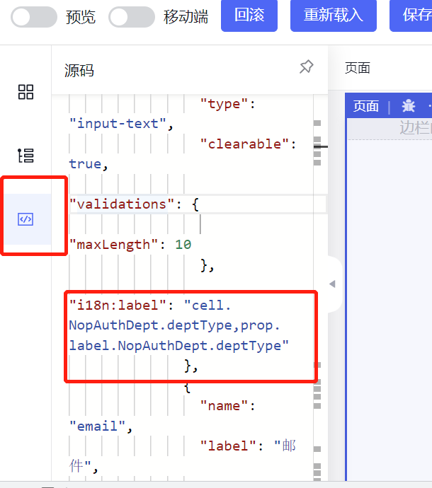

# 常见问题

## 开发问题

### 1. 修改列名后保存，刷新前台列表页面后发现修改没有应用。但是设计器中已经修改。

保存到后台后，可以发现page.yaml中label携带了i18n key，则前台得到的页面实际上会被国际化文本替换。

```yaml
x:gen-extends: |
  <web:GenPage view="NopAuthDept.view.xml" page="main" xpl:lib="/nop/web/xlib/web.xlib" />
body:
  name: crud-grid
  columns:
  - name: deptType
    label: '@i18n:col.NopAuthDept.deptType,prop.label.NopAuthDept.deptType|改变类型'
    placeholder: '-'
    x:virtual: true
  x:virtual: true
```

`@i18n:key|defaultValue`格式中，字符\|之后的部分是缺省值，只有当i18n key对应的国际化文本不存在的时候才会返回这个值。

在设计器里查看的时候，因为是在设计阶段所以没有替换i18n key。如果一定要以修改的值为准，则可以删除i18n key.

```yaml
x:gen-extends: |
  <web:GenPage view="NopAuthDept.view.xml" page="main" xpl:lib="/nop/web/xlib/web.xlib" />
body:
  name: crud-grid
  columns:
  - name: deptType
    label: '改变类型'
    placeholder: '-'
    x:virtual: true
  x:virtual: true
```

在设计器中修改，则需要在json视图中自己删除



### 2. 在GraphQL中如何构造Query条件

在前台可以使用`url："@query:NopAuthDept__findList/id?filter_deptName=a"`这种简化查询语法，执行对象的
findList或者findPage函数时，会识别`filter_`为前缀的参数，然后把它转换为QueryBean的filter树形结构查询条件。如果一定要手工构造QueryBean，则可以仿照如下调用

```graphql
query($query:QueryBeanInput,$q2:QueryBeanInput){
  NopAuthDept__findList(query:$query) {
    id,
    deptName
    parent {
      id
    }
  },

  NopAuthUser__findPage(query:$q2){
    page
    items{
      nickName
      userName
    }
  }
}

```

variables设置为:

```json
{
  "query": {
    "filter": {
      "$type":"and",
      "$body": [{
        "$type":"eq",
        "name": "deptName",
        "value": "a"
      }
      ]
    }
  },
  "q2":{
    "filter":{
      "$type":"eq",
      "name":"userName",
      "value":"a"
    }
  }
}

```

### 3. 单元测试如何不使用本地数据库

自动化测试介绍参见[autotest.md](../dev-guide/autotest.md)

1. 需要利用内存数据库，基于NopOrm底层的数据层录制回放机制，
2. 不需要内存数据库支持可以从JunitBaseTestCase继承，实现纯逻辑的测试，它只启动IoC容器。如果IoC也不需要，可以从BaseTestCase继承，它只提供一些帮助函数

### 4. 应用运行的时候，虚拟文件系统里面的模型文件更新了，会自动刷新吗？还是需要重启应用

Nop平台内部统一使用ResourceComponentManager来加载模型文件，加载的模型会缓存到内存中。ResourceLoadingCache内置了依赖追踪能力，即它会自动记录
解析模型的过程中所使用的所有依赖的模型文件，只要任何一个文件发生修改（时间戳发生变化），模型缓存都会自动失效。再次获取时会重新解析。

如果是新生成的文件，虚拟文件系统不会自动扫描得知新的文件，需要调用一下VirtualFileSystem.instance().refresh(true)。
虚拟文件系统不仅仅包括classpath下的\_vfs目录，还会自动包括系统启动时当前目录下的\_vfs目录。而且当前目录下的\_vfs目录优先级更高，其中的文件会覆盖classpath下的文件，

在前台页面中，有一个【刷新缓存按钮】会清空后台全局模型缓存，并自动刷新虚拟文件系统。

### 4. 从IServiceContext中能否获取request, response等Web环境对象

NopGraphQL的设计是与Web环境无关，它可以用在消息队列、批处理等场景，作为一个通用的服务派发、结果汇总框架来使用，因此不提供任何与Web环境相关的方法。

在IServiceContext中可以通过setAttribute/getAttribute等方法保存自定义对象。IServiceContext.getCache()还提供了一个单次请求范围内有效的缓存对象，
可以用于缓存字典数据等。一般业务参数应该显式传递，IServiceContext基本等价于一个Map结构，主要用于在框架内部保存一些单次请求范围内的共享信息。

### 5. Nop跟keycloak的集成除了单点以外，授权等特性也可以用吗？

做了角色集成，可以使用keycloak中配置的角色，角色与权限的配置关联要在nop平台中做。keycloak可以配置用户和角色的关联，参见OAuthLoginServiceImpl.java

### 6. `_ExcelWorkbook`这样的模型类是什么时候生成的

模型类是采用代码生成器在maven打包的时候生成。

mvn package执行的时候会执行exec-maven-plugin插件，在nop-entropy项目的根pom.xml文件的pluginManagement中，引入了如下配置

```xml
 <plugin>
    <groupId>org.codehaus.mojo</groupId>
    <artifactId>exec-maven-plugin</artifactId>
    <version>3.0.0</version>
    <executions>
        <execution>
            <id>precompile</id>
            <phase>generate-sources</phase>
            <goals>
                <goal>java</goal>
            </goals>
            <configuration>
                <arguments>
                    <argument>${project.basedir}</argument>
                    <argument>precompile</argument>
                </arguments>

                <!--
                避免包含META-INF目录导致加载尚未编译的ICoreInitializer
                -->
                <addResourcesToClasspath>false</addResourcesToClasspath>
                <addOutputToClasspath>false</addOutputToClasspath>
            </configuration>
        </execution>
        ...
    </executions>
</plugin>
```

在nop-excel项目的pom文件中，引入exec-maven-plugin插件就会自动执行precompile目录下的代码生成脚本

```xml
    <build>
        <plugins>
            <plugin>
                <groupId>org.codehaus.mojo</groupId>
                <artifactId>exec-maven-plugin</artifactId>
            </plugin>
        </plugins>
    </build>
```

在precompile目录下所有xgen后缀名的文件都会被自动执行

```xml
<c:script>
codeGenerator.renderModel('/nop/schema/excel/workbook.xdef','/nop/templates/xdsl', '/',$scope);
codeGenerator.renderModel('/nop/schema/excel/imp.xdef','/nop/templates/xdsl', '/',$scope);
</c:script>
```

XCodeGenerator上的renderModel函数可以读取模型文件，然后执行代码生成模板。在上面的例子中是读取xdef元模型定义，然后调用nop-codegen模块下的/nop/templates/xds模板。

### 7. 系统什么时候自动建表

配置了nop.orm.init-database-schema=true之后，在应用启动的时候DatabaseSchemaInitializer类会负责自动创建数据库表。
但是如果建表语句执行失败会自动忽略错误，并且不再执行后续的建表语句。也就是说，如果数据库为空库，则会成功建表，如果数据库中已经有表，则会因为建表失败而忽略。

一般只是新加个别表的时候，目前并不会自动识别并新建。 可以将Log级别设置为TRACE级别，建表失败的时候会打印日志信息。

### 8. 从多个库逆向得到多个Excel，生成代码的时候需要合并成一个Excel吗

数据模型是每个Excel对应一个模块。本身就应该是多模块系统的。这样即可以作为微服务部署，也可以放到一起作为单体应用部署。
平台中内置的nop-auth, nop-wf等每个都是一个子模块，有自己的模型。每个模块都可以单独开发调试。
如果模块之间有表之间的引用，可以在Excel中增加外部表引用（配置表的标签为not-gen）

### 9. ORM中表可以存放在不同的数据库中吗？

如果为entity指定不同的querySpace，就可以存放到不同的数据库中。每个querySpace可以对应于一个nopDataSource\_{querySpace}的DataSource配置。

实体按照主键和外键进行加载的时候会自动执行跨库查询，但是一条EQL查询语句只允许访问一个库，不会自动执行跨库查询

### 10. 报表模板中的表达式语法的文档在哪里

报表相关的使用文档参见 [report.md](../user-guide/report.md)和[xpt-report.md](../dev-guide/report/index.md)
报表表达式的语法与普通的XLang Expression语法类似，就是javascript语法，只是其中有有xptRt环境变量，以及一些扩展函数

### 11. 修改Excel数据模型后，需要调用mvn clean install来重新生成代码吗？

一般情况下不需要clean，只有删除了文件的情况下才需要clean。
另外代码生成时会在xxx-codegen子项目下生成一个xxxCodeGen.java，例如nop-auth中的NopAuthCodeGen.java，可以用于直接在IDEA里执行生成代码，
效果与执行mvn install等价。

### 12. XPL模板中使用的变量从哪里来

问题: codegen模块的orm模板，`@init.xrun` 中调用了`gen:DefineLoopForOrm`标签，在该标签的定义中，`<attr name="codeGenModel" implicit="true"/>`，
codeGenModel 属性是隐式的， `@init.xrun` 也没有传这个属性，那它的属性值是从哪里来的呢？

回答：这个变量是在XGenerator中通过scope.setLocalValue存进去的。在xrun文件中可以访问的变量除了定义的变量之外还有scope上下文传入的变量。
在标签库中，所有变量都必须是传入的参数，无法直接访问scope变量。所以设置implicit=true的变量，从调用标签处捕获名称为codeGenModel的变量，作为标签参数传入。

### 13. 前端如何使用类似like的查询条件

参见[xview.md](../dev-guide/xui/xview.md)

* 在meta中配置允许contains过滤运算

```xml
<prop name="userName" allowFilterOp="eq,contains" xui:defaultFilterOp="contains"/>
```

以上条件表示`userName`允许按照`eq`和`contains`两种关系过滤算符进行查询，`eq`表示相等条件，`contains`表示包含，通过`like`来实现。`xui:defaultFilterOp`表示缺省过滤算符采用`contains`。

* 前台传送过滤条件
  前端条件拼接条件filter\_{propName}\_{filterOp}={value}，例如 filter\_userName\_\_contains=abc

### 14. 为什么Inject bean没有成功

```javascript
@Inject
private MyBean myBean;
```

NopIoC不支持对于private变量进行注入。目前Spring也不推荐这种使用方式，因为private方式不便于实现编译期IoC处理，也破坏了类的封装性。
一般应该使用package protected或者protected变量。或者定义public的set方法。

### 15. 除了系统内置自动加载的`app-xxx.beans.xml`，如何加载指定的beans.xml文件？

NopIoC的入口文件全部是自动发现，可以在自动发现的beans.xml中import其它的文件。

* 注意，NopIoC中多次导入同一个文件会自动去重，这一点优于Spring的处理。Spring中import节点对应于include语义，而不是程序语言中常用的导入语义。
  在多个文件中多次导入同一个包应该等价于只导入一次。而include语义是每次执行都完整导入一次，会导致bean的定义出现冲突。

```xml
<import resource="a.beans.xml" />
```

### 16. 可以单独接入xdef吗？

可以。引入nop-xlang即可，代码生成器也可以独立于Nop平台使用。Nop平台的模块虽然很多，但是因为整体设计采用了依赖注入、动态加载等方式，
各个模块的耦合度很低，大部分模块都可以独立使用，并且可以脱离Nop平台与其他框架集成使用。

具体模块依赖关系可以参见[module-dependency.md](../arch/module-dependency.md)

### 17. 生成的 app.orm.xml 中，对应了这样的属性 ext:dict="obj/LitemallBrand"，这个 ext:dict 在xdef中是找不到的，是否xdef没有定义的属性可以随意添加？

是的。可以随意添加具有名字空间的扩展属性。根据可逆计算思想，任何数据定义都必然伴随它的delta扩展定义，也就是说我们总是在局部预留了保存扩展信息的机制，
永远都是 `(data, meta-data)`配对设计，这里的meta-data本质上就是保存扩展信息的一种形式。

ext名字空间一般用于临时添加扩展属性。如果该扩展属性经常被使用，可以专门选定一个特殊的名字空间，然后在xdef模型上指定校验该名字空间，
这样就会检查扩展属性也必须满足xdef元模型要求。

```
<schema xdef:check-ns="graphql,ui,biz" ...>
  <props>
     <prop  ui:control="xml-name" graphql:connectionProp="prop-name" ...> </prop>
  </props>
</schema>
```

### 18. 级联新增和修改需要做什么特殊的配置吗？

不需要，ORM在实体层面操作就会自动反映到数据库中。本质上不应该存在级联更新的问题。Hibernate的级联配置是错误使用了action概念来驱动修改操作，
应该采用状态检测来驱动修改操作。只要发现实体层面的属性发生了修改，就自动转化为Insert/Update/Delete等SQL语句。

比如说 `entity.getChildren().addChild(child)`就表示要自动在子表中插入记录。
`entity.relatedTable.setMyProp(3)`就表示将关联表的my\_prop字段设置为3。

如果使用了ORM引擎，理想情况下我们可以仅在实体层面进行操作，然后ORM引擎自动跟踪这些实体的当前属性值，并自动计算出它们和数据库中表数据之间的差量，
然后自动将差量转化为相应的SQL语句。整个过程类似于前台的虚拟DOM Diff过程。

### 19. 新生成的一个xx-meta模块为什么src目录下时钟为空，没有根据orm.xml生成meta文件？

meta文件是通过exec-maven-plugin插件执行postcompile代码生成模板来自动生成的。因此pom文件中必须配置这个plugin。
一般情况下我们选择从nop-entropy的pom文件继承，从而减少maven插件的配置

```xml
<?xml version="1.0" encoding="UTF-8" ?>
<project xmlns="http://maven.apache.org/POM/4.0.0" xmlns:xsi="http://www.w3.org/2001/XMLSchema-instance"
         xsi:schemaLocation="http://maven.apache.org/POM/4.0.0 http://maven.apache.org/xsd/maven-4.0.0.xsd">

    <parent>
        <artifactId>nop-entropy</artifactId>
        <groupId>io.github.entropy-cloud</groupId>
        <version>2.0.0-SNAPSHOT</version>
    </parent>
      ...
    <build>
        <plugins>
            <plugin>
                <groupId>org.codehaus.mojo</groupId>
                <artifactId>exec-maven-plugin</artifactId>
                <configuration>
                    <classpathScope>test</classpathScope>
                </configuration>
            </plugin>
        </plugins>
    </build>
</project>
```

### 20. Java类的函数上增加了`@SingleSession`和`@Transactional`等注解，为什么没有自动生成对应的aop类？

生成aop是通过exec-maven-plugin触发aop代码生成实现的。因此pom文件中必须配置exec-maven-plugin插件，如果是
从nop-entropy的根pom继承，则只需要引入exec-maven-plugin插件即可

```xml
   <build>
        <plugins>
            <plugin>
                <groupId>org.codehaus.mojo</groupId>
                <artifactId>exec-maven-plugin</artifactId>
                <configuration>
                    <classpathScope>test</classpathScope>
                </configuration>
            </plugin>
        </plugins>
    </build>
```

### 21. 报表引擎中的Excel公式支持嵌套调用吗？如何增加自己的报表函数？

手工编写一个top-down的表达式解析器只需要1000多行代码。nop-xlang包中的SimpleExprParser提供了一个基本的表达式解析器，可以通过feature flag定制它支持的语法特性。
可选的语法特性如下：

```
public static final int ALL = LAMBDA_FUNCTION | FUNCTION_DEF | STATEMENT | FUNCTION_CALL | OBJECT_CALL | BIT_OP
| SELF_ASSIGN | CP_EXPR | TAG_FUNC | JSON | OBJECT_PROP | ARRAY_INDEX | SELF_INC | IMPORT | NEW;
```

ExcelFormulaParser就是对从SimpleExprParser继承，实现一些剪裁并加上对报表层次坐标表达式的识别。

目前NopReport中内置实现的Excel函数比较少，它们全部定义在ReportFunctions类中。
如有需要可以自行扩编写静态函数，然后类似ReportFunctions注册到ReportFunctionProvider中。

### 22. 如何使用Quarkus中定义的RedisDataSource

在NopIoC管理的bean中可以直接通过  `@Inject RedisDataSource redisDataSource;`来注入Quarkus所管理的bean。
需要注意的是，Quark的IoC是在编译期完成扫描和注册，所以在Quarkus的环境中使用到RedisDataSource才会完成自动发现和注册。例如增加一个QuarkusConfig类

```java
@ApplicationScoped
public class QuarkusConfig {
    @Inject
    RedisDataSource redisDataSource;
}
```

### 23. 字典字段，返回的label里面自动添加了  字典值-字典名称  ，有没有方法方便的把  字典值-  去掉，只保留字典名称？

nop.core.dict.return-normalized-label配置成false

### 24. CrudBizModel中的save跟update这两个方法有什么区别？

update必须具有id属性，表示修改操作。而save是新增操作，转化为insert语句。
save\_update是只要有id就识别为修改操作，否则识别为新增操作。

### 25. action-auth.xml 也能控制 graphql action的权限，Auth 注解和 xbiz 也能控制，这个该怎么选择，如果互相冲突以哪个为准呢

Nop平台采用的是多层叠加的设计，也就是说 整体逻辑 = 基础逻辑 + Delta定制逻辑，定制性强的层会覆盖变化性较低的层。xbiz中定义的内容会覆盖Java中定义的内容。xmeta中的定义优先级最高。

action-auth.xml并不能控制权限，它能定义给一组权限起一个便于管理的分组名称。具体的权限名还是服务方法上定义的。
action-auth.xml可以配置缺省的角色和permission之间的绑定关系。而后台的AuthMeta本质上是配置permission和服务函数之间的绑定关系，只是有时为了方便也可以直接指定role和服务函数之间的绑定关系。如果同时指定，实际上是同时限制的

### 26. 通过Delta定制如何处理多对多关联？

问题：在 delta.orm.xlxs 中定制 NopAuthUser 时，对于 many-to-many 关系，比如用户和商户多对多，因为要在 NopAuthUser 中生成商户相关的 java 属性，又要在商户这边生成用户相关的 Java 属性。这种情况下，中间关联表是要在 auth delta excel 中定义，还是在应用模块的 excel 中定义呢？
回答：建议是在自己的业务模型中增加多对多关联表，将用户表标记为not-gen，作为外部表引用。这样不会自动为NopAuthUserEx生成多对多相关的帮助函数，这个可以手工自行添加。

### 27. nop-ooxml-xlsx模块与Java的poi库有什么区别？

poi很大，最少有10几M，而且很慢。nop-ooxml-xlsx是利用Nop平台自己实现的XML解析器来解析xlsx文件，它的底层没有使用POI库，
比POI快很多，内存消耗也小很多，但是支持的功能不多，只支持目前report开发中用到的xlsx特性。

### 28. Excel模型中updateTime等系统约定的特殊字段能改成自己定义的名称吗？比如updateTime修改为updatedAt

代码生成的时候会特殊识别如下数据域:createdBy 、 updateTime 、 updatedBy 、 delFlag、version 、createTime tenantId 。标记了这些数据域的字段会被自动识别为ORM引擎所支持的乐观锁字段、创建时间字段等。
数据域不能改，数据库字段名可以改.

### 29. auth模块有没有类似spring security的匿名用户和匿名角色？

所有登录用户都具有角色user，但是目前没有设计内置的的匿名用户机制。如果有需要，可以继承AuthHttpServerFilter来实现

### 30. 除了主动运行gen命令，还有什么时候能生成代码？

每个DSL文件都支持x:gen-extends和x:post-extends子节点，这些段就相当于是内嵌在DSL中的generator。

* push模式：mvn install触发precompile目录下的xgen，执行代码生成
* pull模式: x:gen-extends，加载模型的时候触发代码生成段，执行代码生成

### 31. NopORM中的querySpace概念是什么意思？

用于多数据源配置，每个querySpace可以对应一个不同的数据库或者存储机制。比如一部分数据存在ElasticSearch或者另一个数据库中，每个数据源就是一个querySpace。

### 32. IContext 和 IServiceContext 是什么样的关系，各自使用场景是怎样的

IContext主要是提供异步上下文，并包含一些最简单的全局信息。它在api-core包中，不可能包含太多其他信息，在各种场景下都存在IContext。
整个Nop平台中并不直接依赖于ThreadLocal，一般的上下文隐式传递时实际上是对象保存在IContext中，比如当前的ITransaction和IOrmSession对象等。
在服务调用环境下，我们需要传递更多的环境信息。IServiceContext相当于是服务框架中提供的扩展上下文信息，它包含IEvalScope和IUserContext等更复杂的信息，且必须依赖于nop-core模块。

一般情况下一个请求过来，会创建一个IContext，绑定到某个执行任务线程，然后GraphQL引擎创建IServiceContext，并引用了先前的IContext，带上了更多的信息。因此对于一个请求来讲，会有一个IServiceContext以及一个IContext。

## 部署问题

## 设计问题

### 1. Nop平台的文档中提到的函数抽象和函数模板化是什么意思？

比如说工作流 执行到步骤A，需要增加一个判断条件，不管这个判断怎么写，它本质上都对应于一个判断函数。在工作流引擎的设计中，有些人可能会做如下设计

```xml
<step>
    <when class="xxx.MyCondition" />
</step>
```

由一个Java类负责提供判断条件。在这种情况下，工作流引擎甚至有可能提供一整套的插件机制，来动态加载判断插件。这些插件需要符合
工作流的接口标准，只能在当前这个工作流引擎中使用。

但是在Nop平台看来，这里所需要的仅仅是一个函数抽象接口，具体如何实现是另外一个独立的问题，**与工作流引擎的设计无关**。
也就是说，在工作流引擎的设计中，我们唯一需要的就是函数抽象，而并不需要进一步的插件加载抽象。

Nop平台的具体做法是统一使用xpl模板语言，通过将函数结构体模板化来解决函数实现的问题。

也就说，在Nop平台中解决问题，我们系统化的采用如下策略：

1. 在关键的地方定义函数，且使用通用的IEvalFunction或者IEvalAction接口
2. 使用模板语言提供函数实现。

因为模板语言是XML格式（结构化的表达格式），可以通过通用的TreeEditor自动实现可视化编辑。

根据可逆计算理论，一切信息结构都可以存在多种表示形式，这些表示形式之间可以进行可逆转换。可视化编辑不过是可视化表示与文本表示之间的一种双向映射。

这种双向映射的能力具有复合性。也就是说，如果a \<--\> A, b \<--\> B, 那么我们有可能自动得到 a + b \<--\> A + B

#### 通过XPL模板语言实现函数结构的模板化

假设我们的判断条件在Java中具有如下实现代码

```
if(user.age < 18)
  return false

if(user.gender == 1)
  return false

return true
```

我们可以把它转换为抽象语法树，然后再保存为XML格式，但实际看起来并不直观。
借助于Xpl模板语言中的标签库抽象机制，我们可以通过将具体的逻辑封装为更具有业务语义的标签函数，然后再提供可视化编辑器。
（这类似于我们在表单编辑的过程中配置的是自定义组件，而不是最底层的div/span节点）。

```xml
<and>
    <app:已经成年/>
    <app:性别为男/>
</and>
```

### 2. 什么情况下我们会自己定义自己的所需的.xlib文件，道xlib要放到固定的位置下吗？

xlib就是xpl模板语言的函数库，一般写在自己模块的xlib目录下。它可以写在任何地方，只是普通的函数库而已，在xpl段中调用时通过import语句导入
标签库就可以使用。常用的内置标签库有：

1. web.xlib是用于根据xview模型生成amis页面
2. control.xlib根据字段的domain和type等信息推导得到显示控件。

### 3. 没有实体定义的情况下也可以写BizModel吗？

可以，Nop平台的整体设计是分层的，后一层不依赖于前一层。自己写一个BizModel类即可，参见LoginApiBizModel。

```
  Excel --> ORM --> BizModel --> XView --> Page
```

通过Nop平台的代码生成器，我们可以根据Excel中的数据模型定义一路推导得到前端页面，但是每个推导步骤都是可选步骤，并不一定需要前一个步骤的存在。

参考[LoginApiBizModel](https://gitee.com/canonical-entropy/nop-entropy/blob/master/nop-auth/nop-auth-service/src/main/java/io/nop/auth/service/biz/LoginApiBizModel.java)的实现，我们可以在Java中直接编写一个BizModel类，然后在某个beans.xml中注册，即可通过NopGraphQL引擎来调用。

> LoginApiBizModel实现ILoginSpi接口仅仅是为了提高代码可读性和可维护性，并不是必须的。一个BizModel类可以不继承任何基类，也不需要实现任何接口，
> 本质上BizModel与Spring框架中的Controller类似，只是它不依赖于任何Web运行时环境，返回结果也不要求是POJO等可以直接进行JSON序列化的对象。
> （BizModel中函数的返回值会经过NopGraphQL引擎处理后得到返回值）

使用NopGraphQL，一般没有必要再区分Controller和Service，直接在Service上增加@BizModel注解（并注册在beans.xml）中即可直接将服务发布为Web服务。通过meta层可以进行返回结果增强和后处理等，即NopGraphQL本身提供了一个弹性适配层，很多情况下都没有必要再增加一个对象来实现适配。

### 4. Nop平台的重点发展方向到底是“领域语言工作台”，还是“低代码开发平台”，还是SpringCloud这种开发框架呢

Nop平台的发展目标是成为通用的领域语言工作台，其他都是附带的东西。因为可以快速开发和扩展领域语言，并自动推导得到设计器和解析器，因此内置一些领域模型后就可以作为低代码平台来使用，为了简化内部的实现，并且最大化可扩展性，重新按照可逆计算原理重新实现了一套底层开发框架，这是研发过程的一种副作用。最终会在20万行左右手写代码的规模性完成所有功能，其他代码通过代码生成来生成，基本在一个程序员个人可控的范围之内。

### 5. Nop平台对于低代码平台这类产品是怎么理解的，它和领域语言的联系是什么

我现在不关注低代码这种产品形态，而是从广义的描述式编程的角度去推进技术发展，不断扩大描述式编程的应用范围，同时实现描述式和命令式编程的无缝融合。低代码要怎么低，在我的文章 \[从可逆计算看LowCode\] (https://zhuanlan.zhihu.com/p/344845973) 有介绍，实际上低代码的实现途径本质上和模型驱动是一样的，模型序列化为文本就是DSL。可逆计算对于模型引入了差量化理解，对于模型的构造和扩展提出了新的技术手段。

图灵机能够实现图灵完备的根本原因在于图灵机可以被看作是一种虚拟机，它可以模拟所有其他的自动计算机器，而如果我们不断提升虚拟机的抽象层次，就会得到可以直接"运行"所谓领域特定语言(DSL)的虚拟机，但是因为DSL关注的重点是特定领域概念，它必然无法以最便利的方式表达所有通用计算逻辑（否则它就成为了通用语言），必然会导致某种信息溢出，成为所谓的Delta项。

在第一代、第二代、第三代程序语言的发展过程中，不断的提升抽象层次，但它们仍然都是通用程序语言，但是发展到第四代程序语言，我们很可能得到的不是另一种通用程序语言，而是大量领域特定语言所构成的DSL森林，通过它们我们可以形成对原有程序结构的一种新的表示和认知。

### 6. Excel模型中的appName，必须是两级名字吗，如果一级或者三级会有什么问题，这个限制比较奇怪。另外，自动成为两级目录名，这里的目录是指src下的包目录吗？

这个两级目录名是对应于 `src/resources/_vfs/xxx/yyy`这里的目录名，是虚拟文件系统中的子目录名。
目前限制为两级，因为平台启动的时候有一个模块扫描的过程，为了限制模块扫描的范围，目前只扫描两级目录，发现存在 `/_vfs/xxx/yyy/_module`文件，就认为是一个模块，会自动加载它的beans目录下的`app-*.beans.xml`文件。

通过`module:/abc/yy.xml` 这种方式加载文件时会扫描所有模块下的/abc/yy.xml文件，例如`/_vfs/xxx/yyy/abc/yy.xml`

### 7. Nop平台中的GraphQL可以独立于Spring和Quarks框架使用吗?

Nop平台的GraphQL引擎是纯逻辑的实现，它相当于是一种通用的服务分解机制，可以应用到所有request=\>response这种处理逻辑流程中。
GraphQLWebService提供了基于jaxrs标准的与Web层对接的一个实现。QuarkusGraphQLWebService和SpringGraphQLWebService等派生类填充了具体的一些框架相关的实现细节，
由此对外暴露 `/graphql`和`/r/{operationName}`这两种对外接口方式。

如果自己基于vertx框架或者netty框架简单写一个http协议适配，则也可以不依赖于quarkus或者spring框架。

因为NopGraphQL的入口参数和返回结果都是POJO，所以它可以直接应用于批处理引擎以及kafka消息队列处理等场景，甚至在流处理框架中也可以使用。

如果只想使用Nop平台的后端，不想引入前端AMIS技术，可以引入 nop-spring-web-orm-starter（包括GraphQL和ORM）或者nop-spring-core-starter只包含基础的xlang，
或者引入nop-quarkus-web-orm-starter或者nop-quarkus-core-starter。

starter提供了与spring框架以及quarkus框架的自动集成机制。只要引入相应依赖，应用启动后会自动调用Nop平台的初始化函数（CoreInitialization.initialize()）

### 8. Nop平台中的逻辑编排是代码逻辑还是服务调用逻辑，类似于zeebe是做微服务编排的

逻辑编排引擎本身不应该知道是代码逻辑还是服务调用逻辑，这完全是实现层面的细节。微服务在调用时也就是体现为一个函数。只要能编配函数，原则上就可以编配服务，只是服务存在额外的一些管理逻辑，
这些逻辑与编配无关，不应该污染编配引擎。Nop平台基于模板语言和DSL进行编配，底层运行时可以利用xpl模板语言实现无限扩展。
重试、tcc回滚等都可以作为一种函数decorator出现。

### 8. 如何实现轻关联的机制

能不能实现个轻关联、轻填充的功能，例如：字段默认值可以指定其他表的字段或者直接使用 el 表达式去加载本地的类方法，只需要指定表达式 ${user.userId} 就可以自动填充数据，实际被填充字段的表和表达式之所指定的表之间是没有关联关系的，也不用去指定复杂的关联关系

解决方案：

1. 内置CrudBizModel已经提供了大量的通用服务获取函数，无需手工编写，而且可以通过graphql的重命名机制来实现字段适配。 例如/r/NopAuthUser\_\_get?id=3\&@selection=name:userName,status:userStatus就可以从后台按照id查询数据并且返回结果为name,status这两个字段。
2. 在meta文件中可以增加自定义的prop，然后在prop的getter配置中写XScript脚本来获取数据，这样可以不需要写xbiz文件。
3. 如果是使用NopDynEntity机制，则可以在线配置后台服务函数，然后前台去调用后台服务函数来返回数据。

本质上在前后端分离的架构设计下，前端轻关联是在前端配置页面中增加一个后端服务函数的标准化调用方式即可。至于服务函数是怎么实现的，是否是在线定义的，是一个独立的问题。
Nop平台中后台服务函数的命名方式是标准化的，/r/{bizObjName}\_{bizMethodName}?@selection={selectionSet}

有了数据供体，前台可以自由的决定它是作为默认值使用，还是固定的数据联动

### 9. 模块化，子系统的概念在Nop平台中如何体现？像企业应用，财务，crm，hr，客户不一定，同时购买，是三个独立的子系统。

采用微服务架构之后，模块化更多的是通过服务划分来解决。Nop平台内部支持两级模块系统，通过虚拟文件系统中的子目录来区分不同的模块。也就是说/nop/auth目录对应于 {vendor}/{subModule}这种模式的模块id.
合理安排模块路径，可以实现ap/fin, app/crm, app/hr三个模块独立进行开发、管理。
Nop平台采用可分可合的设计。如果引入了app/fin模块，就自动具有它的功能。可以每个子模块部署为一个exe，也可以多个子模块打包成单体应用部署为一个exe

概念层面上Nop平台类似于一种微内核设计，可以动态加载、卸载业务模块。但是在目前的实现中如果模块中包含java类，还需要重启。
不过也可以通过一个Java ClassLoader去加载模块中的class类。如果模块中没有包含自己的java类，则不需要重启。
不过这些属于细化特性，Nop平台核心可能不会去处理得这么细致

在开发模式下，Quarkus框架内置了hot load机制。在开发模式下修改java，它会自动reload。所以Nop开发一般模块时可以使用Quarkus集成模式。

### 10. nop的扩展性很灵活颗粒度可以很小，那么当别人在这个之上做扩展，怎么避免不恰当配置导致功能受影响。比如把某个源的 bean 关了就影响了功能

Nop只解决结构空间的构造和变换问题。最终语义空间的问题需要自己想办法保证，自己增加约束校验。框架层面在各类引擎会进行一部分的语义检查。

1. xdef元模型中会定义格式要求，模型合并完之后会经过validator校验
2. IoC容器在mvn install打包以及系统启动的时候会自动检查bean的依赖关系
3. ORM启动的时候会检查所有的表引用和属性引用正确
4. XView模型会检查所有引用的字段如果没有标记为custom，则必须在XMeta中定义
   总之，在各类引擎中，可以根据自己的语义增加一些检查，类似于增强型的类型检查。xdef就是比程序语言类型更强的一种检查。但是各个引擎内部可以引入业务语义相关的更强的事前约束。

可逆计算理论中，Delta合并发生在结构层，此时各种运行时非法的结构都是可以存在的。结构层所在的是可行空间，是所有可能出现的结构的最大集合。
类似于量子力学在观测之外是可以打破能量守恒定律的，各种量子隧穿是允许的。但是合并完成之后，真正进入可观测、可运行的世界，这时需要经过一系列的规律约束。
Nop平台内置了多阶段编译能力，在真正运行前提供了很多图灵完备、应用层可介入的验证时机，甚至可以类似于contract based programming，插入单元测试，
在调试模式下通过某些样例测试才能启动。

传统的编程中，结构空间是封闭的，它仅由编译器厂商定义。Nop平台相当于开放了结构空间，允许自定义的结构规则，将编译器的能力开放给应用层。
前端领域，随着babel的流行，一定程度上已经开放了编译器的部分能力，但是除了少数框架，真正在应用层能用上babel的能力的很少。
Nop提出一系列的结构规则和使用模式，使得这种能力的使用变得更加简单、直观。
