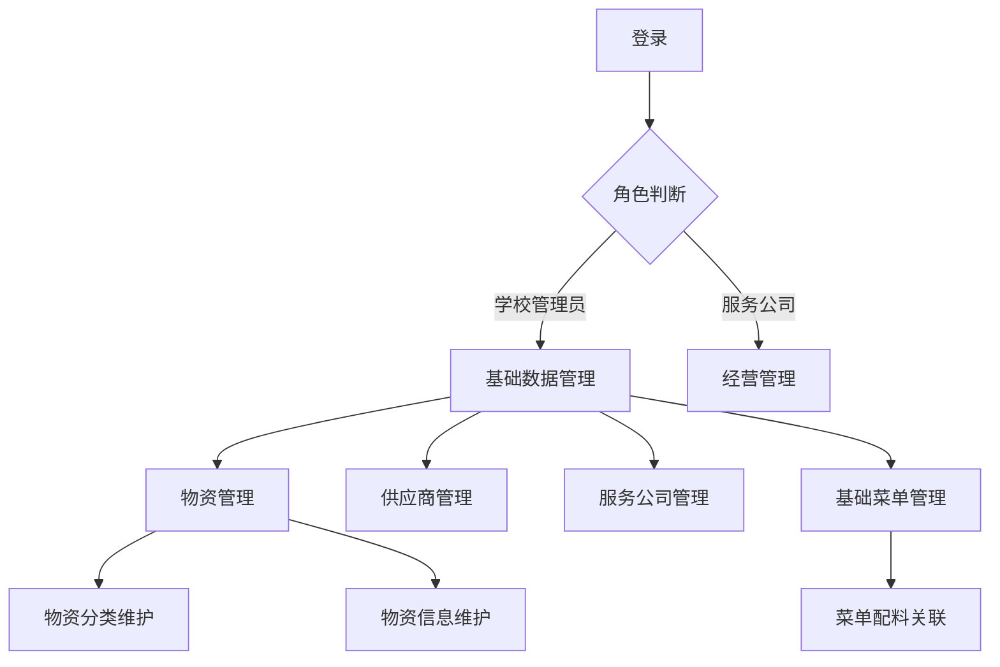
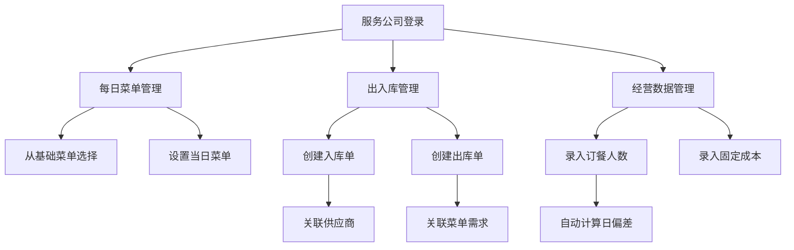
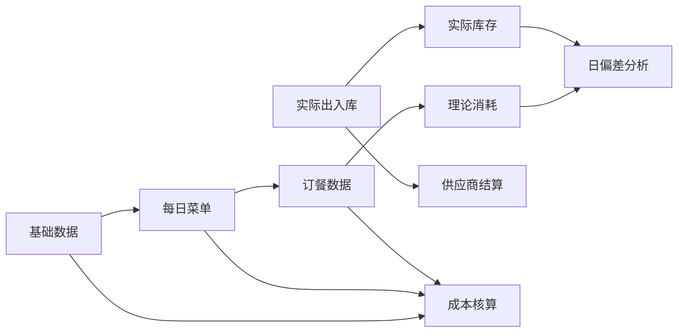

# 食堂物资管理系统详细设计

## 角色与权限设计

### 1. 角色定义

| 角色名称 | 描述 | 系统权限 |
|---------|------|---------|
| 学校管理员 | 负责系统基础数据维护、日常监管和统计分析 | 基础数据管理、数据查询、统计分析 |
| 服务公司管理员 | 食堂经营单位的管理人员，负责日常经营数据录入 | 经营管理、数据录入、供应商结算 |

### 2. 权限矩阵

| 功能模块 | 子功能 | 学校管理员 | 服务公司管理员 |
|---------|--------|------------|----------------|
| 物资管理 | 增删改查 | 读写 | 只读 |
| 供应商管理 | 增删改查 | 读写 | 只读 |
| 服务公司管理 | 增删改查 | 读写 | 只读(仅自身) |
| 基础菜单管理 | 增删改查 | 读写 | 只读 |
| 库房管理 | 增删改查 | 只读 | 读写(仅自身) |
| 每日菜单管理 | 增删改查 | 只读 | 读写(仅自身) |
| 出入库管理 | 增删改查 | 只读 | 读写(仅自身) |
| 盘库管理 | 操作 | 只读 | 读写(仅自身) |
| 供应商结算 | 操作 | 只读 | 读写 |
| 经营数据管理 | 增删改查 | 只读 | 读写(仅自身) |
| 统计分析 | 各类报表 | 读写 | 只读(仅自身数据) |

## 菜单设计

### 1. 学校管理员菜单
- 基础数据管理
  - 物资管理
  - 供应商管理
  - 服务公司管理
  - 基础菜单管理
- 监管中心
  - 出入库查询
  - 经营数据查询
  - 库存监控
- 统计分析
  - 物资统计报表
  - 成本分析报表
  - 经营绩效分析
- 系统设置
  - 用户管理
  - 角色权限
  - 系统参数

### 2. 服务公司管理员菜单
- 经营管理
  - 库房管理
  - 每日菜单
  - 出入库管理
  - 盘库管理
- 供应商结算
  - 结算单管理
  - 付款记录
- 经营数据
  - 订餐人数录入
  - 固定成本录入
  - 日偏差查看
- 数据查询
  - 库存查询
  - 历史菜单
  - 出入库记录

## 功能模块详细设计

### 1. 基础数据管理模块

#### 功能点列表（优先级）
1. 物资管理（P0）
  - 物资分类管理（多级）
  - 物资CRUD操作
  - 物资图片上传
  - 物资库存查询
2. 供应商管理（P0）
  - 供应商CRUD
  - 供应商启用/禁用
  - 供应商资质管理
3. 服务公司管理（P0）
  - 服务公司CRUD
  - 服务公司启用/禁用
4. 基础菜单管理（P1）
  - 基础菜单CRUD
  - 菜单配料管理
  - 菜单成本计算

#### 交互流程图

#### 核心业务逻辑
- 物资分类采用树形结构，支持无限级分类
- 物资编码采用"分类码+序列号"自动生成规则
- 供应商和服务公司启用/禁用状态影响相关业务操作
- 基础菜单的配料关联物资，自动计算菜品成本

### 2. 经营管理模块

#### 功能点列表（优先级）
1. 库房管理（P1）
  - 库房CRUD
2. 每日菜单管理（P0）
  - 从基础菜单选择
  - 按日期管理
  - 结算日锁定
3. 出入库管理（P0）
  - 入库单管理
  - 出库单管理
  - 整入整出
  - 单据锁定
4. 盘库管理（P1）
  - 库存盘点
  - 盘盈盘亏处理
5. 供应商结算（P1）
  - 结算单生成
  - 付款记录
6. 经营数据管理（P0）
  - 订餐人数录入
  - 固定成本录入
  - 日偏差计算

#### 交互流程图

#### 核心业务逻辑
- 每日菜单必须从基础菜单中选择，不可自定义
- 出入库单据包含明细项，影响实时库存
- 出库可与菜单关联，自动计算理论消耗量
- 日偏差 = 理论消耗量(根据订餐人数计算) - 实际出库量
- 结算日后的数据自动锁定，不可修改

### 3. 统计分析模块

#### 功能点列表（优先级）
1. 物资统计（P1）
  - 出入库汇总
  - 库存预警
2. 成本分析（P0）
  - 菜品成本分析
  - 经营成本分析
3. 经营绩效（P1）
  - 服务公司绩效
  - 供应商评价

#### 核心业务逻辑
- 基于时间维度、物资维度、服务公司维度的交叉分析
- 成本分析结合实际消耗和标准配方的理论消耗
- 绩效评估考虑成本控制、库存周转率等指标

## 数据流设计

## 关键业务规则

1. 数据锁定规则：
  - 结算日后自动锁定相关数据
  - 手动锁定的单据需上级解锁

2. 库存变更规则：
  - 入库增加库存
  - 出库减少库存
  - 盘盈盘亏调整库存

3. 权限控制规则：
  - 服务公司只能操作自身数据
  - 敏感操作需记录操作日志

4. 成本计算规则：
  - 菜品成本 = ∑(配料数量×最新入库单价)
  - 经营成本 = 固定成本 + 食材成本

5. 偏差分析规则：
  - 日偏差率 = (实际消耗 - 理论消耗)/理论消耗
  - 连续异常偏差触发预警
