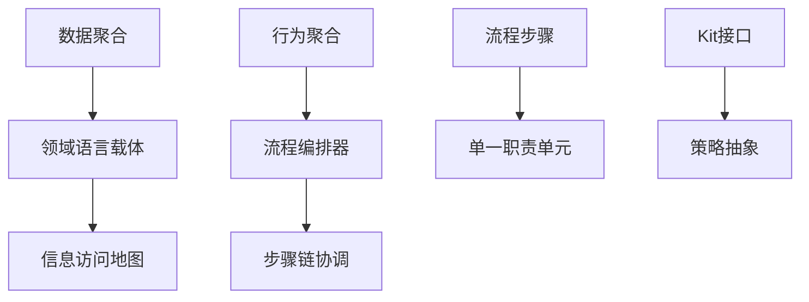
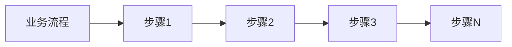
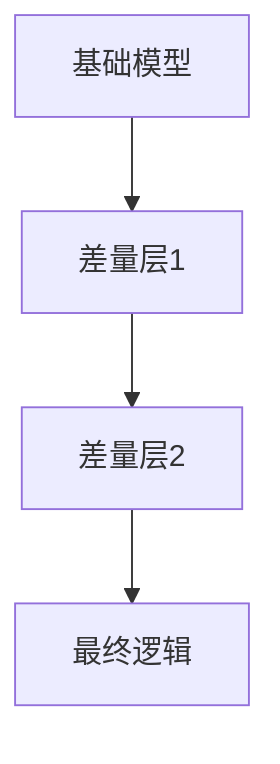
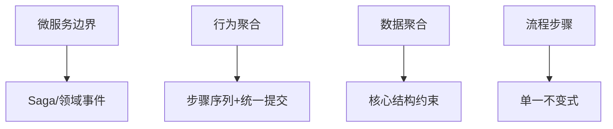

# DDD核心概念演进：充血模型与聚合根的范式升级

---

## 1. 问题背景：DDD实践中的核心困惑

### 充血模型的"两难境地"
- **理论美好**：对象包含数据+行为
- **现实困境**：
  - 业务逻辑放领域对象？ → 上帝类
  - 放领域服务？ → 事务脚本

### 妥协的诱惑
> "领域服务承载业务逻辑，领域对象只做数据结构，不是更清爽吗？"

**代价**：放弃面向对象优势，退化为难以维护的事务脚本

---

## 2. 问题根源：混淆结构与行为

### 两个正交关注点
| 结构（是什么） | 行为（怎么做） |
|---------------|---------------|
| 系统稳定状态 | 状态变化过程 |
| 实体关联关系 | 业务流程步骤 |
| 领域概念定义 | 业务目标实现 |

### 传统错误做法
```java
// 把所有行为塞进聚合根
public class Order {
    public void placeOrder() {
        // 校验 + 风控 + 营销 + 库存...
    }
}
```

---

## 3. 范式转变：从行为充血到结构充血

### 重新定义"充血"
- ❌ **行为充血**：塞满业务方法
- ✅ **结构充血**：充领域语义的血

### 结构充血的三大支柱
1. 聚合根 = 领域语言载体
2. 声明式而非立即执行
3. 业务流程外置编排

---

## 4. 聚合根作为领域语言载体

### 构建领域词汇表
```java
// 领域自然表达
order.customer.creditLimit
order.canBeCancelled()
order.getItems().totalWeight()
```

### 声明式设计精髓
- 设计时：完整定义所有关联
- 运行时：按需加载数据
- 性能保障：形式聚合 ≠ 存取时机聚合

---

## 5. 重新思考聚合根的核心职责

### 传统标准答案 vs 实践真相
- **传统认知**：维护一致性边界
- **现实困境**：
  1. "不变式"幻觉 → 将易变策略当作领域真理
  2. "上帝聚合"陷阱 → 行为数据过度捆绑导致臃肿
  3. 粒度误区 → 不相关规则杂糅在宏大的方法中
  4. 事务边界枷锁 → 在批量处理和长流程中成为性能瓶颈

### 真正的不变式
- **核心结构约束**：价格≥0、库存≥0
- **易变业务策略**：VIP额度、促销规则

---

## 6. 新概念模型：数据聚合与行为聚合



---

## 7. 数据聚合：信息表达者

### 核心职责
- 构建统一的信息访问地图
- 承载结构性数据与核心不变式
- 提供关联对象加载能力

### 实现特性
```java
public class OrderBO {
    // 惰性加载关联对象
    public CustomerBO getCustomer() {
        return manager.getCustomerOfOrder(this.data, this.cache);
    }
}
```

---

## 8. 行为聚合：流程协调者

### 核心职责
- 不直接承载领域状态
- 将大方法拆分为有序步骤链
- 支持动态组合扩展

### 编排模式


---

## 9. 重构示例：下单流程Before

### 典型的"上帝聚合"
```java
public class Order {
    public void placeOrder(CustomerRepository repo, 
                          PromotionService promoSvc) {
        // 1. 校验状态
        // 2. 加载关联对象
        // 3. 检查信用
        // 4. 应用促销
        // 5. 检查库存
        // 6. 修改状态
        // 50+行混杂逻辑
    }
}
```

**问题**：臃肿、强依赖、难测试、违反开闭原则

---

## 10. 重构示例：下单流程After

### 声明式流程定义
```yaml
# placeOrder.task.yaml
steps:
  - name: creditValidation
    bean: validateCreditStep
  - name: couponApplication
    bean: applyCouponStep
    when: "order.customer.coupons.size() > 0"
  - name: promotionApplication
    bean: applyPromotionStep
```

### 独立步骤实现
```java
@Component("validateCreditStep")
public class ValidateCreditStep implements IStep {
    public void execute(Context ctx) {
        OrderBO order = (OrderBO) ctx.getAttribute("order");
        // 单一职责：只做信用验证
    }
}
```

---

## 11. 架构优势：拉取式信息流

### 传统推送模式
```java
// 需要准备专用DTO
orderService.placeOrder(orderDTO);
```

### 新范式拉取模式
```java
// 按需从信息空间拉取
if (order.getCustomer().isVIP()) {
    // 业务逻辑
}
```

### 优势
- 组件彻底解耦
- 逻辑调整只需修改局部
- 自然表达领域语义

---

## 12. 架构优势：差量编程

### 传统扩展方式
- 继承、组合
- 需要修改源码
- 侵入性强

### 差量编程机制


**价值**：非侵入式扩展，支持多租户深度定制

---

## 13. CQRS架构下的聚合根

### 命令端 vs 查询端
| 命令端 | 查询端 |
|--------|--------|
| 写操作处理 | 读操作处理 |
| 业务规则维护 | 高效数据返回 |
| 行为聚合+数据聚合 | 优化数据聚合 |

### 统一语义，差异实现
- **命令端**：流程编排修改数据聚合状态
- **查询端**：数据聚合提供领域语义表达
- **价值**：保持代码纯净，解决性能瓶颈

---

## 14. 工程实践：迁移路径

### 渐进式迁移步骤
1. **分类**：区分结构不变式 vs 策略/流程逻辑
2. **提取**：策略代码到Kit接口
3. **切分**：大方法拆分为Step
4. **配置化**：创建流程定义
5. **替换**：引入框架统一调用入口
6. **扩展**：差量编程定制

---

## 15. 工程实践：陷阱规避

### 常见问题与解决方案
| 陷阱 | 解决方案 |
|------|----------|
| 过度拆分步骤 | 保持清晰的领域可命名性 |
| 上帝Kit接口 | 按能力域拆分 |
| 重试不幂等 | 将变化输入捕获到Context |
| 性能退化 | 批加载器解决N+1查询 |

---

## 16. 事务与并发策略

### 灵活的事务管理
- 事务边界与聚合根解耦
- 流程末尾统一提交
- 支持微批处理（每N个聚合提交一次）

### 并发控制
- 乐观锁：版本号检查
- 冲突处理：安全重放流程

---

## 17. 一致性分层管理



### 各层职责明确
- 只有核心结构约束需要强一致性
- 业务策略正确性通过流程保证

---

## 18. 两种范式根本差异

| 对比维度 | 传统DDD | 新范式 |
|---------|---------|--------|
| 理论基础 | 面向对象 | 可逆计算 |
| 核心职责 | 一致性守护 | 语言载体 |
| 数据行为 | 必须合一 | 	结构vs动力学分离 |
| 扩展机制 | 侵入式 | 差量编程 |
|事务边界	|与聚合根强绑定 |	声明式定义|

---

## 19. 总结：架构哲学跃迁

### 核心理念转变
1. **充血模型**：结构充血 > 行为充血
2. **聚合根**：语言载体 > 事务囚徒
3. **架构设计**：信息空间 + 流程编排 > 对象网络

### 最终目标
> 构建与业务同频演化的软件系统

---

## 20. Q&A与讨论
