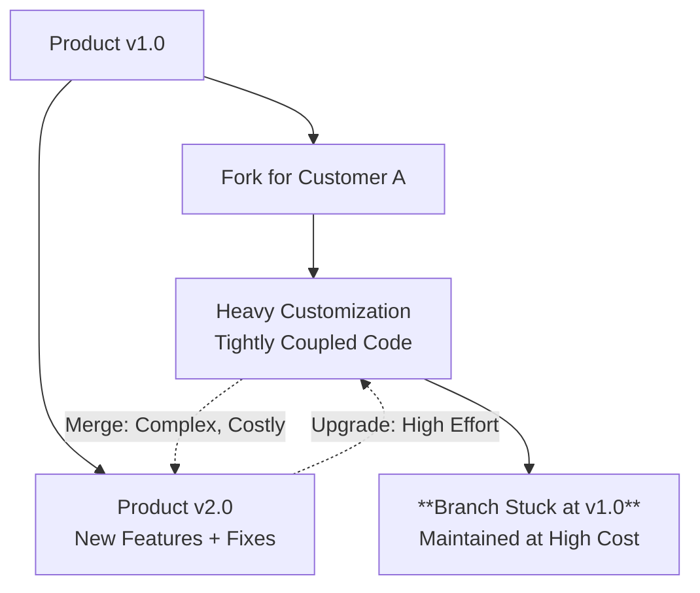
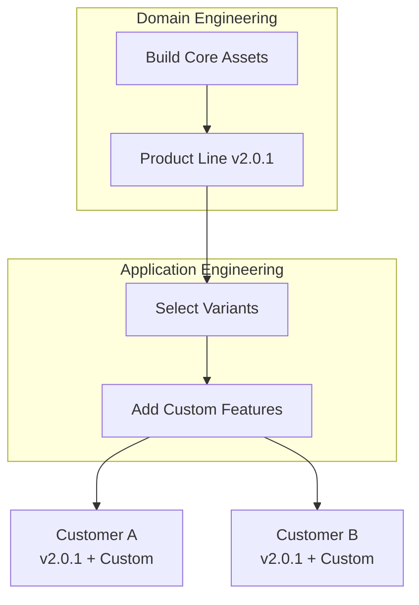
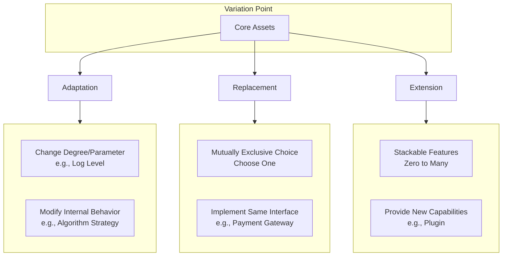

# Slide 1
Extensibility based on the Delta‑Oriented Framework
September 2025


# Slide 2
The Customization Trap



The Vicious Cycle:
- Copy & Modify: The deceptively easy start
- Diverging Paths: Custom & core code evolve separately
- Technical Debt: Stagnation, conflicts, and high-cost maintenance


# Slide 3
Software Product Lines: From Ad Hoc to Systematic Reuse



Key Process:
- Build Core: Develop reusable product line components
- Select: Choose from pre-built variants  
- Extend: Add customer-specific features
- Deploy: Deliver customized products

# Slide 4
The Promise vs. The Reality

- The Promise (CMU SEI 2008): 
  
  - > 10× productivity
  - > 60% cost reduction
  - > 98% faster time-to-market

- The Reality: 
  One Core Challenge – Effective Variability Management.


# Slide 5
The Prescribed Approach: Adapt, Replace, Extend



Do not modify core assets.
Derive variants by ACTIVATE · SELECT · PROVIDE pre-defined variations.

# Slide 6
The Dilemmas of Component-Based Reuse

1. The Granularity Paradox
   
   - Reusable components contain only commonality.
   - Dilemma: They are inherently smaller than any product, conflicting with the goal of a large, reusable core.

2. The Prediction Paradox
   
   - Requires a stable core with predefined extension points.
   - Dilemma:
     - Too few points: Architecture is rigid.
     - Too many points: Architecture is destroyed.
   - These are fundamental limits of the additive approach.

# Slide 7
Inspiration from Physics: A New Duality for Software

- Particle View (Current): Reductionism.
  - Decompose systems into atoms (objects, components).
  - Assemble parts to build wholes.
- Wave View (New): Superposition.
  - Think of features as waves to be overlaid and combined.
- The Question: Can we build software via non-invasive superposition, not assembly?

# Slide 8
An Algebraic View of Software Evolution

- Object-Oriented: Implicit Delta (A > B)
  - Reuse constrained by hierarchy.
- Component-Oriented: Explicit Addition (A = B + C)
  - Delta C becomes a reusable component.
- Reversible Computation: Algebraic Manipulation (B = A + (-C))
  - The Leap: Introduce a formal inverse element.
  - Unlocks: Reuse by transforming anything related, not just identical.

# Slide 9
Reversible Computation: A Next-Gen Construction Theory

**`App = Delta x-extends Generator<DSL>`**

- New Locus of Computation： **Transformation is primary.**
- Generator<DSL>: Core domain knowledge.  
- Delta: Features as independent transformations.
- x-extends: Superposition operator.


# Slide 10
From Theory to Practice: Docker as Reversible Computation

- Docker's Formula:
    `App = DockerBuild<Dockerfile> overlay-fs BaseImage`
- The Mapping:
  - DockerBuild<Dockerfile> -> Generator<DSL>
  - overlay-fs -> x-extends
- Why It Works: This pattern is a mathematical necessity for managing change.
   ` Y = (F0+F1)(X0+X1) = F0(X0) + Δ`


# Slide 11
Delta Customization (1): File-Level Overrides

- Foundation: A Virtual File System (VFS) with delta layers.
- Mechanism: Files in a delta layer (/_delta/customer-a/...) override base files.
- Activation: Switch behavior globally with a parameter (e.g., deltaId=customer-a).

Example Directory Structure:

```
/_delta/customer-a/beans/job.xml       // Customization for Customer A
/_delta/customer-b/config/auth.json    // Customization for Customer B
/beans/job.xml                         // Base product file
/config/auth.json                      // Base product file

```

# Slide 12
Delta Customization (2): Intra-File Surgical Customization

Base Definition (/beans/core.xml)

```xml
<beans>
    <bean id="securityManager" class="com.mycorp.StandardSecurityManager"/>
    <bean id="dataService" class="com.mycorp.DefaultDataService"/>
</beans>
```
  
Customer-A Delta (/_delta/customer-a/beans/core.xml)

```xml
<beans x:extends="super">
    <!-- 1. Modify Class -->
    <bean id="securityManager" class="com.customer.AdvancedSecurityManager"/>

    <!-- 2. Remove Bean -->
    <bean id="dataService" x:override="remove"/>
    
    <!-- 3. Add Conditionally -->
    <bean id="auditLogger" class="com.customer.AuditLogger"
          feature:on="auditing.enabled"/>

</beans>
```

# Slide 13
Delta Oriented Framework: The Core Principle
Unified, DSL-Agnostic Customization

- Philosophy: One mechanism to customize any DSL.
- Mechanism: "Loader as Generator"
     - Swap native loader for DeltaFileSystem loader.
     - Non-intrusively finds, merges, and generates the final model.
- Impact:
     - Full-stack customization (Data to UI).
     - Zero changes to base product code.

# Slide 14
From Model to Code: Delta-Driven Generation

- Full-Stack Generation:
     - From models (ORM, etc.) to code (DAO, Microservices, UI, SQL, i18n).
- Delta-Based Pattern:
     - `_Account.java` (Base): Machine-generated, safe to overwrite.
     - Account.java (Extension): Manually extended, generator-safe.
- Advantage: Parallel Evolution
     - Continuously regenerate model & code without losing custom logic.

# Slide 15
Nop Architecture: A Cohesive Blueprint

 <!-- width:400px;height:300px; -->

- Foundation: Universal Delta capabilities & code generation.
- Development: Reusable core engines for complex business logic.
- Synergy: Delta Customization balances platform stability with agile customization.

# Slide 16
Synergy with AI: The Future of Development

- AI as a Co-pilot for DSLs:
  - Well-defined DSLs provide perfect structure for AI to generate and understand code.
- AI for Documentation
  - generate docs from models, pages, and configurations.
  - (This presentation and its graphics were AI-generated.)
- AI Generated Tests
  - Automated creation of test cases and data.

# Slide 17
Summary: Extensibility Through Reversible Computation

- The Problem: Traditional component-based reuse hits fundamental limits (Granularity & Prediction Paradoxes).
- The Insight: Draw inspiration from physics and mathematics - treat features as superposable transformations.
- The Solution: The Delta-Oriented Framework, enabled by Reversible Computation theory.
- Key Understanding: Reversible Computation expands the solution space significantly
- The Result:
  - Systematic, non-invasive customization for various DSLs
  - Maintains a stable yet adaptable core architecture
  - Helps escape "The Customization Trap"
