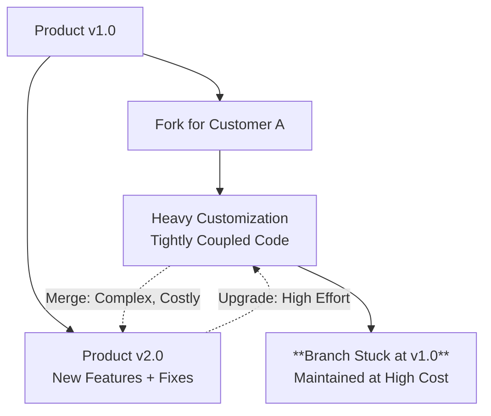
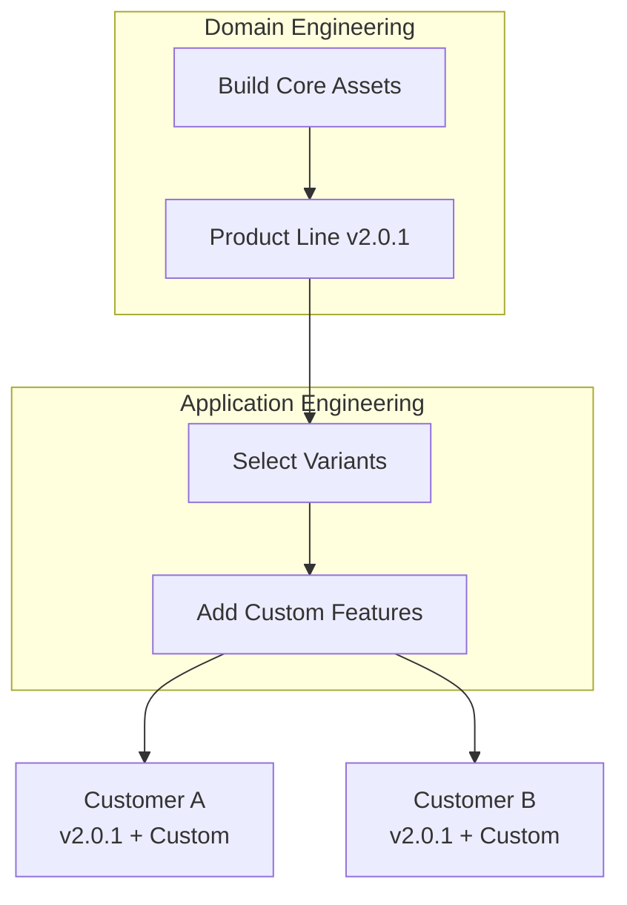
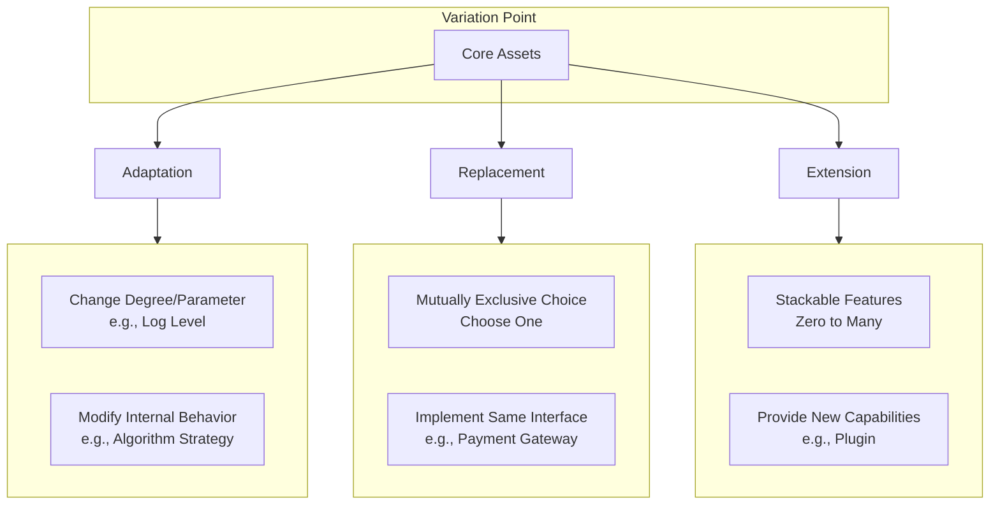

# Slide 1
Extensibility based on the Delta‑Oriented Framework
September 2025


# Slide 2
The Customization Trap



The Vicious Cycle:
- Copy & Modify: The deceptively easy start
- Diverging Paths: Custom & core code evolve separately
- Technical Debt: Stagnation, conflicts, and high-cost maintenance


# Slide 3
Software Product Lines: From Ad Hoc to Systematic Reuse



Key Process:
- Build Core: Develop reusable product line components
- Select: Choose from pre-built variants  
- Extend: Add customer-specific features
- Deploy: Deliver customized products

# Slide 4
Promise vs.  Reality

- The Promise (CMU SEI 2008): 
  
  - > 10× productivity
  - > 60% cost reduction
  - > 98% faster time-to-market

- The Reality: 
  One Core Challenge – Effective Variability Management.


# Slide 5
The Prescribed Approach: Adapt, Replace, Extend



Do not modify core assets.
Derive variants by ACTIVATE · SELECT · PROVIDE pre-defined variations.

# Slide 6
The Dilemmas of Component-Based Reuse

1. The Granularity Paradox
   
   - Component reuse is achieved by factoring out the common core.
   - Dilemma: This core, by definition, is smaller than any individual product, conflicting with the goal of a large, reusable core.

2. The Prediction Paradox
   
   - Requires a stable core with predefined extension points.
   - Dilemma:
     - Too few points: Architecture is rigid.
     - Too many points: Architecture is destroyed.

These are fundamental limits of the additive approach.

# Slide 7
Inspiration from Physics: A New Duality for Software

- Particle View (Current): Reductionism.
  - Decompose systems into atoms (objects, components).
  - Assemble parts to build wholes.
- Wave View (New): Superposition.
  - Think of features as waves to be overlaid and combined.

The Question: Can we build software via non-invasive superposition, not assembly?

# Slide 8
An Algebraic View of Software Evolution

- Object-Oriented: Implicit Delta (A > B)
  - Reuse constrained by hierarchy.
- Component-Oriented: Explicit Addition (A = B + C)
  - Delta C becomes a reusable component.
- Reversible Computation: Algebraic Manipulation (B = A + (-C))
  - The Leap: Introduce a formal inverse element.
  - Unlocks: Reuse by transforming anything related, not just identical.

# Slide 9
Reversible Computation: A Next-Gen Construction Theory

**`App = Delta x-extends Generator<DSL>`**

- Generator<DSL>: unfolds a dense kernel of truth into an executable base
- Delta: A reversible and stand-alone unit of change, designed to be both composable and non-invasive.
- x-extends: deterministic merge of deltas in a well-defined order.

(Ultimately, the Base itself is just the first Delta applied to a void.)

# Slide 10
From Theory to Practice: Docker as Reversible Computation

- Docker's Formula:
    `App = DockerBuild<Dockerfile> overlay-fs BaseImage`
- The Mapping:
  - DockerBuild<Dockerfile> -> Generator<DSL>
  - overlay-fs -> x-extends

# Slide 11
The Inevitability of Deltas: A Universal Pattern

1. Computation: 
Result = Function(Data)

2. Decompostion of Change: 
New_Function = Base_Function ⊕ Δ_Function
New_Data = Base_Data  ⊕ Δ_Data

3. The Resulting "Delta Form": 
New_Result = BaseFunction(BaseData)  ⊕ Δ_Total 
(analogous to a Taylor Expansion)

The Paradigm Shift: treats change itself as a first-class citizen.

# Slide 12
Delta Customization (1): File-Level Overlay

- Foundation: A Virtual File System (VFS) with delta layers.
- Mechanism: Files in a delta layer (/_delta/customer-a/...) override base files.
- Activation: Switch behavior globally with a parameter (e.g., deltaId=customer-a).

Example Directory Structure:

```
/_delta/customer-a/beans/job.xml       // Customization for Customer A
/_delta/customer-b/config/auth.json    // Customization for Customer B
/beans/job.xml                         // Base product file
/config/auth.json                      // Base product file

```

# Slide 13
Delta Customization (2): Intra-File Surgical Scalpel

Base Definition (/beans/core.xml)

```xml
<beans>
    <bean id="securityManager" class="com.mycorp.StandardSecurityManager"/>
    <bean id="dataService" class="com.mycorp.DefaultDataService"/>
</beans>
```
  
Customer-A Delta (/_delta/customer-a/beans/core.xml)

```xml
<beans x:extends="super">
    <!-- 1. Modify Class -->
    <bean id="securityManager" class="com.customer.AdvancedSecurityManager"/>

    <!-- 2. Remove Bean -->
    <bean id="dataService" x:override="remove"/>
    
    <!-- 3. Add Conditionally -->
    <bean id="auditLogger" class="com.customer.AuditLogger"
          feature:on="auditing.enabled"/>

</beans>
```

Precisely modify tree-structured files (XML, JSON, YAML) without touching the original.

# Slide 14
Delta Oriented Framework: The Core Principle
Unified, DSL-Agnostic Customization

- Philosophy: One mechanism to customize any DSL.
- Mechanism: "Loader as Generator"
     - Swap native loader for DeltaFileSystem loader.
     - Non-intrusively finds, merges, and generates the final model.
- Impact:
     - Full-stack customization (Data to UI).
     - Zero changes to base product code.

# Slide 15
From Model to Code: Delta-Driven Generation

- Unified Source:
     -  effective model = base ⊕ deltas → generate DAO/services, API/SQL, UI/i18n
- Generation Gap Pattern:
   - `_Account.java` (Generated Base): Always safe to overwrite.
   - `Account.java` (Manual Extension): Never touched by generator.
- Core Advantage: Fearless Regeneration. 
   - Evolve base. Regenerate constantly. Extensions remain untouched.


# Slide 16
Delta Oriented Architecture: A Cohesive Blueprint

 <!-- width:400px;height:300px; -->

- Foundation: Universal Delta capabilities & code generation.
- Development: Reusable core engines for complex business logic.
- Synergy: Delta Customization balances platform stability with agile customization.

# Slide 17
Reversible Computation × AI: Cohesive Models, Cleaner Signals, Better Co‑pilots

- Single cohesive truth: effective model = base ⊕ deltas (complete, schema‑typed, noise‑free)
- Reversible deltas: safe explore/undo → faster, risk‑free AI iteration
- Deterministic composition: reproducible grounding with full provenance
- Output discipline: AI emits deltas (not core edits), schema/contract‑validated

(This presentation and its graphics were AI-generated.)

# Slide 18
Summary: Extensibility Through Reversible Computation

- The Problem: Traditional component-based reuse hits fundamental limits (Granularity & Prediction Paradoxes).
- The Insight: Draw inspiration from physics and mathematics - treat features as superposable transformations.
- The Solution: The Delta-Oriented Framework, enabled by Reversible Computation theory.
- Key Understanding: Reversible Computation expands the solution space significantly
- The Result:
    - From “Extension Points Everywhere” to “Overlays Above Everything”
    - From “1 core + N forks” to “1 base + N deltas”
	- Effective System = Base ⊕ ΔIndustry ⊕ ΔRegion ⊕ ΔCustomer
