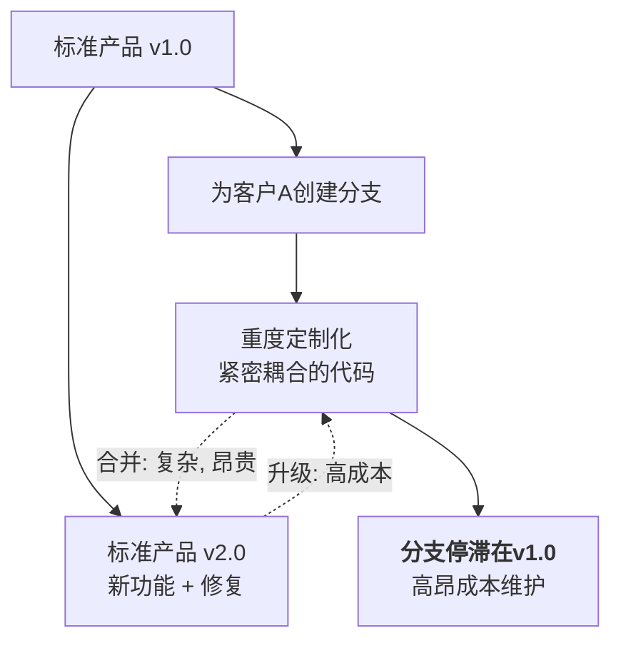

# Nop平台：基于可逆计算理论的下一代软件技术架构

## 作者简介

- 2002年毕业于清华大学工程物理系
- 20多年架构设计经验
- 现任大型外企中国区首席架构师
- 负责亚太区新一代信用卡核心系统架构设计
- 可逆计算理论提出者和开源Nop平台创始人

## 演讲议程
1. 为什么需要下一代软件架构 
2. 可逆计算理论简介 
3. Nop平台整体架构 ️
4. 核心引擎与技术对比 
5. 如何集成与应用
6. Q&A环节 

## 当前困境：定制化开发的泥潭



**恶性循环：**
- 技术债务累积
- 版本分支泛滥
- 维护成本指数级增长

## 传统方案的理论瓶颈

### 粒度悖论（Granularity Paradox）
- **目标**：构建庞大的公共核心
- **矛盾**：提取的公共部分必然小于任何产品
- **结果**：大核心目标与小核心手段根本冲突

### 预测悖论（Prediction Paradox）
- **要求**：预先定义稳定扩展点
- **困境**：
  - 扩展点少 → 架构僵化
  - 扩展点多 → 架构溶解
- **结果**：完美预测未来变化不可能

**结论：这是"组装式复用"的理论天花板，并非工程问题。**

## 来自物理学的启发：波粒二象性

- **粒子视角：还原论**
  - 离散个体的分解组合
  
- **波动视角：叠加**
  - 连续模式的无侵入性的叠加干涉

**问题：我们能否通过非侵入式的叠加，而非组装的方式，来构建软件？**

### 理论的自然演进：可逆计算

- **面向对象**：隐式差量 (A > B) - 复用受继承约束
- **面向组件**：显式加法 (A = B + C) - 差量C成为组件
- **可逆计算**：代数变换 (B = A + (-C)) - **引入形式化的逆元**

**核心公式：** `App = Delta x-extends Generator<DSL>`


### 现实参照：Docker作为可逆计算的实践

**Docker的构建过程**
` App = DockerBuild<Dockerfile> overlay-fs BaseImage`

| Docker概念 | 可逆计算概念 |
|------------|--------------|
| **DockerBuild<Dockerfile>** | **Generator<DSL>** |
| **overlay-fs（联合文件系统）** | **x-extends（差量合并）** |

任何关于差量的创新实践都可以纳入到可逆计算理论的范畴。

### Delta定制
**非侵入式的精准修改**

1. **文件级覆盖**：差量层文件 `/_delta/xxx/` 自动覆盖基础文件
2. **文件内合并**：XML/JSON/YAML结构树的精准手术刀式修改

```xml
<!-- 差量文件示例 -->
<beans x:extends="super">
    <bean id="service" class="com.cust.a.CustomService"/> 
    <bean id="oldService" x:override="remove"/>
	 <bean id="auditLogger" class="com.customer.AuditLogger"
          feature:on="auditing.enabled"/>
</beans>
```

## Nop平台核心架构

 <!-- width:400px;height:auto; -->

- **基础层**: XLang语言 | 差量合并 | 统一元编程框架
- **引擎层**: 基于统一XDSL机制的DSL森林 
- **应用层**: DDD领域设计 | 全量代码生成
- **全域差量定制**: 非侵入修改任何层级，**兼顾标准化与个性化**

## 为什么Nop是下一代软件技术架构

- **基于可逆计算理论，重构软件生产范式**：
   其核心是Generator + Delta的代数化软件生成范式，为软件构造提供了超越传统“组装式”开发的全新数学基础和解耦手段

- **通过模型驱动和语言导向，显著降低系统复杂性**：
    与传统Spring/微服务架构相比，通过声明式的领域特定语言（DSL）替代大量胶水代码和配置，使代码量减少十倍以上，并大幅降低认知负担。

- **为系统级可扩展性和产品化复用提供理论级解决方案**：
    通过元编程和差量定制，实现了非侵入式的系统级扩展（Extension），使得粗粒度的软件产品（如整个SaaS平台）能够像类一样被高效、无损地复用和定制，为实现“软件产品线”工程提供了可行的技术路径。


## Nop vs. Spring 技术栈对比

| 领域           | Nop           | Spring           |
|----------------|---------------|------------------|
| **脚本语言**       | XLang         | Spring EL/FreeMarker |
| **依赖注入**    | NopIoC        | Spring IoC       |
| **数据访问**       | NopORM        | JPA/MyBatis      |
| **Web服务**        | NopGraphQL    | SpringMVC        |
| **分布式**       | NopRPC/NopTcc    | Feign/Seata  |
| **业务流程**       | NopWorkflow/NopTaskFlow   | Flowable         |
| **业务规则** | NopRule | Drools|
| **批处理**     | NopBatch      | Spring Batch     |
| **报表**       | NopReport     | JasperReports    |


## Nop：框架中立，无缝集成

- 协同而非替代：Nop采用框架中立设计，可与 Spring、Quarkus、Solon 等基础框架协同工作
- 能力可插拔：可按需选用单个组件，基本无相互依赖

| 采用方式 | 获得能力 | 适用场景 |
|---------|---------|---------|
| **全栈使用** | 最大创新能力和定制性 | 全新系统开发 |
| **组件选用** | 单独使用ORM/Report等引擎 | 现有系统部分增强 |
| **机制复用** | 仅引入Delta差量定制能力 | 快速实现产品化定制 |

**用Nop增强现有系统，而非推倒重来**

## 定制示例
- 数据模型定制: 数据表字段与关联关系灵活调整
- 扩展字段支持: 一键启用内置动态扩展能力
- 服务接口定制: 消息请求与响应结构自由定制
- 处理流程定制: 业务处理逻辑与规则重写
- Bean组件定制: 平台组件删除与替换
- 页面视图定制: 组件替换与页面的部分复用

所有定制修改无需修改基础产品和Nop平台

### 总结与展望

**Nop带来的范式转变：**
- 从「定点扩展（Extension Points Everywhere）」到「随处覆盖（Overlays Above Everything）」
- 从「1 core + N forks」到「1 base + N deltas」
- Effective System = Base ⊕ ΔIndustry ⊕ ΔRegion ⊕ ΔCustomer

**愿景：** 为AI时代的软件智能生产提供关键技术支撑

### Q&A

问题与讨论