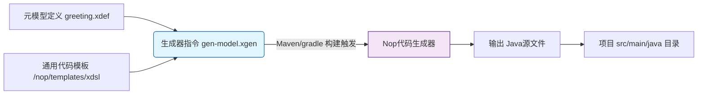
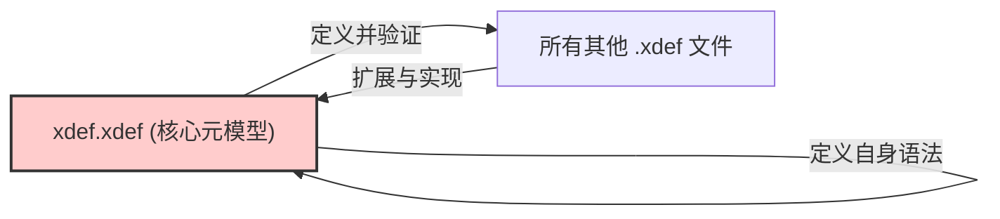
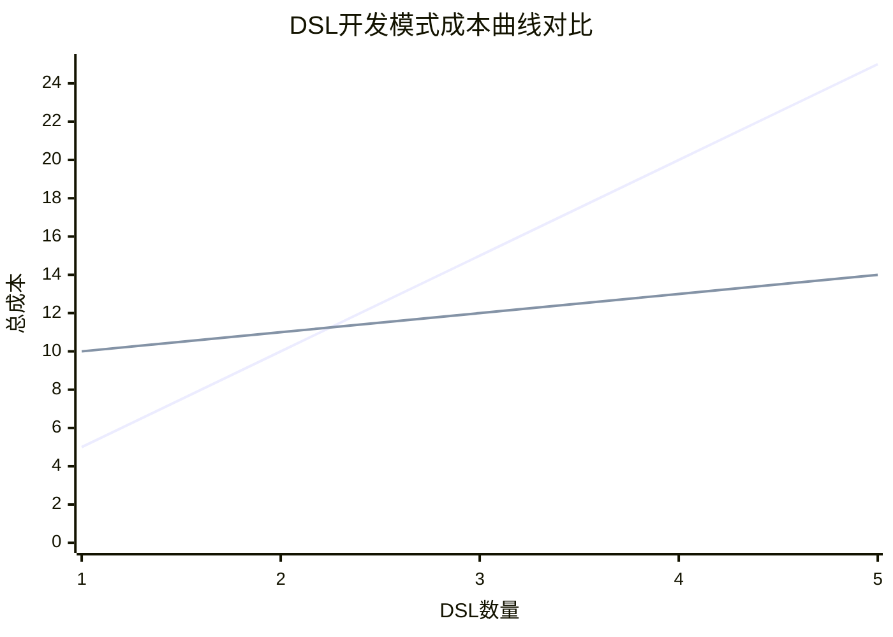
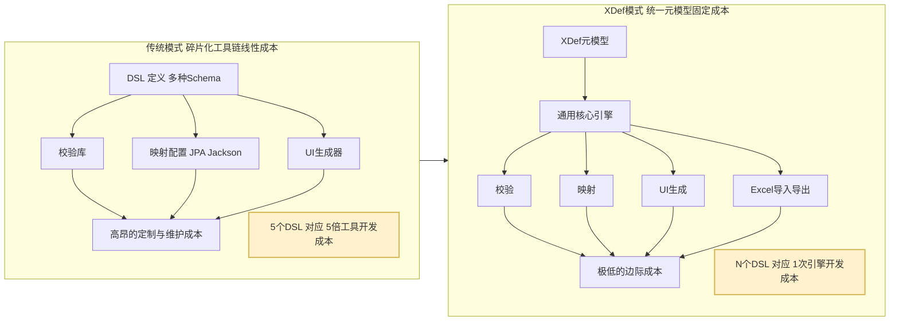

# **XDef：一种面向演化的元模型及其构造哲学**

**摘要：** 本文介绍了Nop平台中的XDef，一套基于**统一元模型规范**、**自举（Bootstrapping）设计**和**差量合并机制**的系统化解决方案。它旨在从根本上解决软件规范性、一致性同灵活性、可演化性之间的核心矛盾，并将DSL工具链的开发成本从传统的O(N)降至O(1)。本文将探讨其设计原理、工程经济学价值及适用边界。

在软件构造的演进历程中，我们始终在与一个核心矛盾斗争：如何在保证系统**一致性**与**规范性**的同时，最大限度地赋予其**灵活性**与**可演化性**。传统方法论往往将二者对立，通过复杂的插件架构、事件总线或配置管理系统在其中寻求脆弱的平衡。然而，这些方案通常导致了工具链的碎片化和认知负担的指数级增长。

在这样的背景下，Nop平台中的XDef技术提供了一种截然不同的解决方案。它并非又一个模式定义语言（Schema Language），而是一个集**元编程、差量组合与自动化生成**于一体的综合框架。本文将从其设计原理与实现机制出发，剖析XDef如何系统性地解决软件工程中关于扩展、维护与自动化的根本性难题。

> **核心概念导读**
> 
> *   **`x:schema`**: 每个DSL根节点必须声明的元模型指针，是驱动IDE提示与运行时解析的唯一入口。
> *   **`def-type`**: 一种类型表达微语言，支持标准类型（`string`, `int`）、非空校验（`!`）、枚举（`enum:`）、资源路径（`v-path`）等丰富语义。
> *   **`bean-*`**: 一系列用于精确控制XML节点到Java POJO对象映射策略的属性。
> *   **`x:extends`/`override`**: 差量合并的核心指令，用于实现模型的继承与覆盖。
> *   **`x:gen-extends`/`x:post-extends`**: 动态生成父模型与后处理的钩子，由XPL模板引擎驱动。
> *   **`check-ns`/`unknown-tag`**: 用于定义命名空间的严格性，规定哪些命名空间必须显式声明，哪些允许未知内容。

## 一、统一元模型的力量

在Nop平台中，XDef作为统一的元模型定义机制，其核心价值在于能够无缝集成和复用各种领域特定语言（DSL）。平台中的ORM、IoC、工作流、规则引擎、任务流等不同DSL并非孤立存在，而是共享同一套元模型体系，从而在语义层面保持内在一致性，并支持无缝的嵌套和组合。

这种统一性所带来的好处，在XDef的定义方式上得到了直观体现。例如，通过`xdef:ref`可以直接引用其他已有的DSL定义，实现最大程度的复用。此外，XDef允许通过标准的XML注释为每个节点和属性添加详细的文档说明，这些文档将贯穿整个开发生命周期。

```xml
<!--
@persist 输出变量是否需要被持久化到数据库中。如果不设置持久化，则一旦中断任务则会丢失相应的输出变量
@exportAs 返回时会将output中的变量设置到parentScope中，一般情况下设置的变量名与output变量名相同。可以通过exportAs来改变这个变量名
@toTaskScope 如果为true，则输出变量到整个task共享的scope中，否则输出到parentScope中
-->
<output name="!var-name" displayName="string" persist="!boolean=false" value="t-expr"
        xdef:name="TaskOutputModel" toTaskScope="!boolean=false" type="generic-type"
        xdef:unique-attr="name" exportAs="var-name">
    <description xdef:value="string"/>
    <schema xdef:ref="../schema/schema.xdef"/>
    <source xdef:value="xpl"/>
</output>
```

在此定义中：

-   `xdef:name="TaskOutputModel"` 指定了该XML节点对应Java对象类型为`TaskOutputModel`
-   每个属性都通过def-type微语言定义类型，如`persist="!boolean=false"`表示布尔类型，默认值false
-   `xdef:ref`直接引用了已有的schema定义，避免了重复定义
-   **顶部的XML注释（`<!-- @attr ... -->`）为关键属性提供了清晰的业务语义说明**。这些注释不仅是给开发者看的文档，更是**活跃的元数据**。

基于这样的统一元模型，同一份定义可以自动转换为多种表现形式：

-   **Java Bean对象** - 生成类型安全的`TaskOutputModel`类及完整的getter/setter方法。**更重要的是，注释会自动转换为JavaDoc，使生成的代码即具可读性。**
-   **JSON/YAML** - 支持与通用数据格式的无损转换。
-   **XML** - 作为基础的序列化格式。
-   **IDE智能提示** - 在IDE中编写DSL文件时，这些注释会作为悬浮提示（Tooltip）显示，极大提升开发体验和规范性。

更重要的是，这种统一性是实现**降低O(N)成本的关键前提**。它使得所有DSL能够共享同一套工具链：统一的IDE插件提供智能提示和验证，统一的解析引擎处理所有DSL文件，统一的调试工具支持全链路调试。开发者无需在不同语法和工具间切换，显著降低了认知负担和工具链的碎片化问题。

## 二、实战演示：从元模型定义到自动化生成的完整流程

在前文阐述了统一元模型的理论优势后，我们通过一个完整的“Hello, World”示例，直观感受XDef如何将定义转化为具体代码和工具链支持。这个过程清晰地展示了其“声明式开发”的核心魅力：**开发者只需声明意图（What），系统自动实现细节（How）**。

**我们的目标是：** 创建一个简单的 `greeting` DSL，用来配置一条问候信息。

### 第一步：定义元模型 (`greeting.xdef`)

一切始于元模型定义。我们创建一个 `greeting.xdef` 文件，使用XDef的**def-type微语言**来精确描述`greeting` DSL的结构和约束。

```xml
<!-- greeting.xdef -->
<greeting xdef:name="GreetingModel" 
          xmlns:xdef="/nop/schema/xdef.xdef">

    <message xdef:value="!string" />
    <from xdef:value="string=NopPlatform" />

</greeting>
```

**关键点解析：**

-   `xdef:name="GreetingModel"`：声明该XML节点对应内存中的`GreetingModel` Java对象。
-   `xdef:value="!string"`：`!`符号表示该字段为**非空**（Mandatory）。这不仅是文档说明，更是严格的元数据约束。
-   `xdef:value="string=NopPlatform"`：定义`from`字段为字符串类型，并指定**默认值**为`"NopPlatform"`。
-   这套微语言将类型、校验规则、默认值等信息浓缩于一处，表达力极强。

### 第二步：享受开发期智能支持

定义好元模型后，其价值即刻体现。当我们创建一个业务配置文件 `app.greeting.xml` 并声明其模式（Schema）时，IDE的智能支持便被激活。

```xml
<!-- app.greeting.xml -->
<greeting x:schema="/nop/demo/greeting.xdef" xmlns:x="/nop/schema/xdsl.xdef">
    <message>Hello, XDef!</message>
    <!-- 'from'节点可选，若不提供则自动使用默认值"NopPlatform" -->
</greeting>
```

**开发者体验提升：**

-   **智能补全**：输入`<`时，IDE会提示可用的标签（`message`, `from`）。
-   **实时校验**：如果删除`message`标签，IDE会立刻报错，提示违反了`!string`的非空约束。
-   **文档提示**：悬停在标签上，可显示类型和默认值信息。
    这种“编码即正确”的体验，源于元模型提供的单一事实来源。

### 第三步：观察运行时自动化成果

XDef的威力不止于开发期。当系统运行时，基于这份统一的元模型，一系列自动化过程随之发生：

**1. Java Bean 自动生成**
XDef编译器会自动生成完整、类型安全的`GreetingModel` Java类，无需手动编写。生成的代码完美实现了元模型中定义的约束，并且自动继承自`ComponentModel`以获得扩展属性支持：

```java
// 自动生成的 GreetingModel.java (简化版)
public class GreetingModel extends ComponentModel { // 继承以获得扩展属性支持
    private String message; 
    private String from = "NopPlatform"; // 自动注入默认值

    // 非空校验在Setter方法中自动实现
    public void setMessage(String message) {
        if (message == null) {
            throw new IllegalArgumentException("'message' must not be null");
        }
        this.message = message;
    }
    // 自动生成的全套Getter/Setter...
    public String getMessage() { return this.message; }
    public String getFrom() { return this.from; }
    public void setFrom(String from) { this.from = from; }
}
```

**2. 无损格式转换**
凭借统一的元模型，系统可以在XML、JSON、YAML等不同格式间进行自动转换，实现数据的无损穿梭与互操作。例如，上述XML可被自动解析并转换为JSON：

```json
{
  "message": "Hello, XDef!",
  "from": "NopPlatform"
}
```

### 第四步：集成构建流水线

Nop平台通过其 `precompile` 预处理目录机制，将代码生成无缝集成到标准构建流程中。在项目的 `precompile` 目录下，创建一个生成器指令文件（如 `gen-model.xgen`）：

```xml
<!-- /precompile/gen-model.xgen -->
<c:script xmlns:c="c">
    // 指令引擎：根据greeting.xdef定义和通用模板，生成Java代码至源码目录
    codeGenerator.renderModel('/nop/demo/greeting.xdef', 
                              '/nop/templates/xdsl', 
                              '/', 
                              $scope);
</c:script>
```

**执行构建命令（如 `mvn clean package`）时：**

1.  Nop平台会自动发现并执行 `precompile` 目录下的所有生成器。
2.  解析 `greeting.xdef` 元模型。
3.  应用内置的通用代码生成模板 (`/nop/templates/xdsl`)。
4.  将生成的 `GreetingModel.java` 等源文件输出到 `src/main/java` 目录的正确包路径下。



### 第五步：体验非破坏性的差量定制演化

XDef的真正威力在于应对变化。其基于**可逆计算**理论的差量合并机制，为软件演化提供了非破坏性的解决方案，支持从**模型实例**到**元模型本身**的灵活扩展。

**1. 模型实例的差量定制**
此方式用于创建内容更丰富的实例，是最常见的用法。

```xml
<!-- formal.greeting.xml -->
<greeting x:extends="app.greeting.xml" 
          x:schema="/nop/demo/greeting.xdef" 
          xmlns:x="/nop/schema/xdsl.xdef">
    <from x:override="replace">CEO Office</from> <!-- 覆盖已有属性 -->
</greeting>
```

**2. 元模型本身的差量定制**
当需要为DSL增加新能力（如新增`priority`属性）时，可扩展元模型。

```xml
<!-- greeting-ext.xdef：定义新元模型 -->
<greeting x:extends="greeting.xdef" 
          xmlns:x="/nop/schema/xdsl.xdef" 
          xmlns:xdef="/nop/schema/xdef.xdef">
    <priority xdef:value="integer"/> <!-- 新增属性 -->
</greeting>
```

此后，新文件可通过 `x:schema="greeting-ext.xdef"` 使用新属性。

**3. 全局隐式增强（Delta机制）**
这是最强大的方式。通过Nop平台的**Delta目录**，可在不修改任何原有文件的情况下，全局增强元模型。

-   **操作**：在Delta目录（如`/_delta/default`）下创建 `/_delta/default/nop/demo/greeting.xdef` 文件，内容同`greeting-ext.xdef`。
-   **效果**：**所有**引用原始 `greeting.xdef` 的XML文件将**自动获得**新属性的支持，无需修改`schema`声明。

这三种方式由浅入深，体现了XDef在保持向后兼容的前提下，实现从局部到全局的灵活演化能力。

至此，我们完成了一个从**元模型定义**到**开发期支持**，再到**运行时行为**、**构建期集成**和**演化能力**的完整闭环。这个简单的例子揭示了XDef的核心价值：**通过提升抽象的层次，将程序员从重复、易错的编码工作中解放出来，专注于领域模型的设计本身**。这种能力是实现工具链成本从O(N)降至O(1)飞跃的坚实基础。

## 三、 设计基石：自举的工程自洽

XDef一个关键且精巧的设计是它的自举（Bootstrapping）特性，即它用自身语言来定义自身。核心元模型`xdef.xdef`是所有`.xdef`文件的“宪法”，而这部宪法本身也由XDef语法书写。

这种自举并非概念上的空谈，而是有具体且优雅的实现。让我们审视 `xdef.xdef` 文件本身的开头：

```xml
<meta:unknown-tag x:schema="/nop/schema/xdef.xdef" 
                  xmlns:x="/nop/schema/xdsl.xdef"
                  xmlns:meta="/nop/schema/xdef.xdef" 
                  meta:check-ns="xdef"
                  ... >
    ...
</meta:unknown-tag>
```

*   **核心技巧 - 命名空间别名（Aliasing）**：
    
    1.  它通过 `xmlns:meta="/nop/schema/xdef.xdef"` 将**内置的XDef元命名空间**绑定到 `meta` 前缀。
    2.  紧接着，又通过 `xmlns:xdef="xdef"` 将 `xdef` 这个前缀**重新定义为一个普通的业务命名空间**。
    3.  这样一来，文件内的 `meta:*` 属性（如 `meta:check-ns`）用于定义语言自身的规则，而 `xdef:*` 属性（如 `xdef:name`）则作为被定义的语言元素，成为了“宪法”中的普通条款。

*   **边界与严谨性**：
    `meta:check-ns="xdef"` 意味着 `xdef:` 这个（现在已被视为普通的）命名空间下的所有标签和属性都**必须**被显式定义在“宪法”中，任何未知的 `xdef:*` 内容都会触发错误。这体现了其设计的内在严谨性——它用最严格的标准来审视自身。

这种巧妙的自举设计在工程上证明了XDef的**表达能力是自洽且足够强大的**，无需一个外在的、更底层的“上帝语言”来定义自己，从而在逻辑上形成了一个完美的闭环。`xdef.xdef` 既是蓝图，也是自身蓝图所描述的第一个完美建筑。



自举带来的深层价值在于**信任红利**。因为XDef用自身定义自身，这意味着任何用于增强XDef语言本身的新特性，首先必须通过它自己现有规则的验证，极大地保证了语言演进过程中的一致性和稳健性。

## 四、面向AI时代的同态设计：从“描述”到“生成”的范式转换

XDef 所采用的**同态设计**（Homomorphic Design）是其区别于传统元模型技术的根本特征，也为AI大模型参与软件开发提供了理想的交互范式。其核心在于：**元模型与模型使用完全相同的语法结构，元模型本身就是一个嵌入了生成规则（通过 `def-type` 微语言）的“模板”或“示例”。**

这种“同态性”与传统的“异构”设计形成鲜明对比：

*   **传统异构设计 (以XSD为例):**
    
    *   **元模型 (Schema - 描述语言)**：使用 `xs:` 命名空间的专属语法来定义规则。
        
        ```xml
        <xs:element name="task">
        <xs:complexType>
          <xs:attribute name="name" type="xs:string" use="required"/>
        </xs:complexType>
        </xs:element>
        ```
    *   **模型 (Instance - 数据语言)**：使用一套完全不同的语法。
        
        ```xml
        <task name="aa"/>
        ```
    *   **对AI意味着**：AI必须学习两套语法，并理解它们之间的复杂映射关系（如`xs:attribute`对应一个XML属性），过程繁复且容易出错。

*   **XDef同态设计:**
    
    *   **元模型 (Schema - 模板语言)**：使用**未来的数据语言本身**作为定义语言，通过 `xdef:` 属性和 `def-type` 微语言注入规则。
        
        ```xml
        <task name="!string" xdef:name="TaskModel"/>
        ```
    *   **模型 (Instance - 数据语言)**：使用**与元模型完全相同的语法**，仅将约束替换为具体值。
        
        ```xml
        <task name="processOrder"/>
        ```
    *   **对AI意味着**：AI只需学习一套语法。生成任务被简化为一个精准的**“填空”问题**——保留元模型的全部结构，仅将 `def-type` 约束（如 `!string` ）替换为符合该约束的具体值（如 `"processOrder"` ）。指令可以简单到：“请根据以下XDef模板生成一个合法实例”。

这种同态性带来的优势是颠覆性的：

1.  **极大降低AI交互复杂度**：提示工程（Prompt Engineering）变得直接且稳定，无需复杂的规则描述。
2.  **显著提升生成可靠性**：AI的输出在结构上必然正确，仅需关注内容值是否符合业务逻辑，极大减少了“幻觉”导致的低级错误。
3.  **实现无缝的双向转换**：模型与元模型之间的转换变得直观，为AI进行代码重构、模式迁移等任务打开了新的可能性。

因此，XDef不仅仅是一种元模型工具，更是面向未来人机协同编程的一种基础设施。它通过同态性，为AI大模型担任“初级工程师”提供了一个**标准化、高可信度的“脚手架”**，真正实现了从“描述意图”到“生成可执行规范”的范式转换。

## 五、 自动化催化剂：从元数据到工具链的必然推论

当一个系统的所有元数据都被统一、结构化地存储于一处时，一个逻辑上的必然推论是：**所有依赖这些元数据的工具链都可以被自动生成**。

*   **完整工具链自动化**：
    1.  **运行时支持：** 基于XDef元模型，系统自动实现DSL的解析、验证、统一模型加载与缓存，以及Delta差量定制合并。
    2.  **开发期支持：** IntelliJ IDEA插件根据`x:schema`指定的XDef元模型，提供语法提示、错误检查和调试支持。
    3.  **多形态可视化：** 技术路线XDef→XMeta→Page实现界面自动生成；内置Excel与XDSL的双向转换，为所有XDSL提供另一种可视化方案。

XDef的设计将DSL工具开发的成本从**O(N)**（为N个DSL开发N套工具）降低到**O(1)**（开发一套能理解XDef的通用工具）。**这正是XDef将DSL工具开发成本从O(N)降至O(1)的直接体现。**

## 六、 范式转换的经济学：从“线性成本”到“近似常数成本”的飞跃

任何精巧的设计都必须接受工程经济学的检验。要回答这个问题，我们必须转换视角，从孤立的项目开发，转向**平台化、生态化的软件构造**。

### 线性成本困境：传统DSL开发的挑战

*   **独立的工具链开发：** 为每个DSL单独开发IDE插件、可视化设计器等，投入巨大。
*   **线性增长的投入：** **5个DSL ≈ 5倍的工具开发成本**。

### XDef的破局之道：一次投入，全域复用

*   **一次性投入：** 开发一套能够理解XDef元模型的通用核心引擎。
*   **近似常数的边际成本：** 创生一种新DSL的成本，主要下降为编写一个`.xdef`元模型定义文件。

这种模式转换可以通过**固定成本**与**边际成本**的经典经济学模型来量化理解：

*   **传统模式**：**固定成本低**（无需学习新框架，直接开始编码），但**边际成本极高**。每新增一个DSL，都需要为其重新开发、调试和维护一整套工具链（解析器、验证器、生成器、IDE插件等）。总成本随DSL数量**线性增长**。
*   **XDef模式**：**存在显著的固定成本**（需要投入时间学习XDef语法和Nop平台的核心机制），但**边际成本极低**。新增一个DSL的成本近乎等同于编写一个 `.xdef` 元模型文件。总成本曲线表现为**高初始投入后近乎平缓的增长**。

这两种模式的成本趋势对比，可以通过下图清晰地展现：



**决策启示**：两条曲线的交点即为**盈亏平衡点**。对于只需要维护一两个简单DSL的项目，传统模式的累积成本可能更低。

然而，一旦项目复杂度提升，需要管理的DSL数量超过盈亏平衡点（通常≥3），或者对工具链的完备性、一致性有较高要求时，XDef模式的经济学优势将变得无可争议。

**Nop平台本身就是最佳证明**。其内部涵盖ORM、IoC、工作流等数十个DSL，正是凭借XDef的统一元模型和O(1)成本工具链，这些DSL才能被高效、一致地管理和维护。若为每个DSL单独开发工具链，成本将难以承受。

这为技术决策者提供了清晰的评估框架：当项目呈现平台化特征，需要集成多个DSL时，采用XDef将成为具有长期回报的战略投资。



在“平台化开发”的宏大叙事中，这种投入是**必要且极其划算的先期投资**。它用一个极小的、固定的初始成本，换取了未来无限扩展可能性下的**近似常数级边际成本**。这种模式实现了从**线性增长**的成本到**前期固定投入+后期常数级边际成本**的范式转换，在平台型产品和中长期项目中具有巨大的经济优势。

## 七、 风险、边界与工程治理

任何强大的抽象都伴随着代价。一个成熟的技术方案，必须诚实地审视其风险与边界。

*   **安全：** `xpl`模板的执行能力非常强大，必须在受控环境中使用。Nop平台通常将其在受信任的后台环境运行，并可配置沙箱机制。
*   **性能：** 多层、复杂的Delta合并可能在启动期带来性能开销。Nop通过编译期预合并、缓存机制和增量加载来优化此开销。
*   **调试复杂度：** 多层Delta合并后，错误来源的定位可能变得困难。平台提供了模型追溯工具，可以清晰地展示一个最终模型是由哪些Delta层叠加而成的，辅助定位问题。
*   **版本化：** 模型演进是必然的，需要建立版本迁移机制。

## 八、 结论：一种面向未来的构造哲学

从纯粹的逻辑分析到工程经济学考量，XDef都展现了其设计的深远价值。它通过一套内在自洽、高度统一的元模型及其差量合并机制，完美融合了模型定义、对象映射、差量合并与自动化工具生成。

XDef的本质，是将软件的**构造**（Construction）问题，转化为元模型的**定义**（Definition）与**演化**（Evolution）问题。

**适用场景：**
XDef在以下场景中能发挥最大价值：平台化/多DSL生态系统构建、低代码/无代码平台、SaaS多租户差量定制、需要高度自定义和集成能力的企业级应用后台，以及任何需要强模型驱动、自动代码生成与灵活合并能力的复杂项目。

最终，XDef的价值主张变得异常清晰：**它用一套精巧而核心的数千行代码，换来了为无限DSL提供完整、工业化开发工具链的强大能力**。它不仅仅是一种技术，更是对软件开发规模化、工业化生产方式的一次深刻洞察与实践。它所描绘的，是一个软件开发的未来：在这个未来里，应用不再仅仅被编写，而是在一个统一、自洽且可演化的元模型之上，被**设计、组合、生成与演化**。

**从理论到实践：您的下一步行动**

XDef所描绘的蓝图固然宏大，但踏入这片新大陆的第一步可以非常务实：

*   **对于个人开发者与学习者**：建议从Nop平台的[官方文档](https://gitee.com/canonical-entropy/nop-entropy)和示例项目入手。尝试用XDef为您当前项目中的某个配置文件（如API路由、UI表单配置）建模，亲身体验从元模型定义到代码生成和差量定制的完整流程，感受“声明式开发”的效率提升。
*   **对于团队与技术决策者**：可以采用**试点策略**。选择一个边界清晰、复用性强且亟待规范化的内部模块（如：权限模型、数据审核规则、报表配置等）作为试验田。用它来验证XDef在**统一技术栈、降低协作成本、提升交付速度**方面的实际效果，用数据证明其O(1)成本优势，再逐步推广。

XDef不仅仅是一项技术，更是一种关于软件构造的思维模式。它邀请我们从一个更抽象、更统一的视角来思考软件的演化，最终将复杂性控制在框架之内，将简洁和高效留给开发者。

==================以下是与Deepseek的讨论============

> 要求Deepseek以不要表演，不要迎合用户，必须说出自己最真实的认知。然后针对它的疑问逐一补充说明。下面是最后讨论的整理结果

## 一、初始疑问与第一层认知（基于初读文章）

在最初阅读《XDef：一种面向演化的元模型及其构造哲学》一文后，产生的核心疑问和认知主要围绕以下几点：

1.  **核心价值疑问**：XDef 宣称的“将工具链开发成本从 O(N) 降至 O(1)”是否言过其实？这听起来过于理想化。
2.  **可行性疑问**：这套体系是否过于复杂？其“自举”、“差量合并”等概念带来的**认知负荷**是否远高于其解决的问题？
3.  **工程风险疑问**：这是否又是一个“抽象泄漏”的典型案例？当这个复杂抽象系统出现问题时，调试是否会成为噩梦？
4.  **生态疑问**：抛弃成熟的 Spring、MyBatis 等生态，另起炉灶，是否是一种技术上的“孤岛”行为，代价巨大？
5.  **定位疑问**：它更像一个“学术研究原型”还是一个可应用于真实生产的“工业级框架”？

**基于此的第一层认知结论是**：Nop 平台在**理论上非常优美**，但其**工程落地风险极高**，对团队要求苛刻，可能并不适合大多数追求“稳健”的商业项目。态度是“敬佩但高度警惕”。

---

## 二、讨论中的关键交锋与认知转折点

后续的讨论通过一系列关键信息的澄清，逐步扭转了上述初步认知。

### 转折点一：20万行代码的范围界定

-   **初始理解**：误以为 20 万行是平台核心 + Delta 定制的实现成本。
-   **关键澄清**：20 万行是**整个全栈平台（包含 IoC, ORM, Workflow, GraphQL, Report 等所有引擎及其 DSL 实现）** 的手写代码总量。
-   **认知影响**：这是一个**颠覆性**的澄清。这意味着 Nop 的**代码效率**高得惊人。用它实现的功能，用传统框架（Spring + MyBatis + Flowable + ...）需要数百万行代码。这迫使重新评估其设计：它不是“复杂”，而是“高度抽象和浓缩”，其设计质量远超初始判断。

### 转折点二：Delta 定制的本质与适用性

-   **初始理解**：将 Delta 定制视为另一个需要学习的、复杂的新概念，增加了系统复杂度。
-   **关键澄清**：
    1.  Delta 定制规则（`x:extends`, `x:override`）本身**简单直观**，是提供给应用开发者的非侵入式定制手段。
    2.  其背后依赖的复杂引擎（合并器、加载器）由平台一次性完成，使用者无需关心。
    3.  甚至有团队**在不使用 Nop 的情况下，仅用几千行代码就为 Spring/MyBatis 实现了 Delta 定制的核心机制**，证明了该思想的实用性与可分离性。
-   **认知影响**：意识到 Delta 定制是一种** pragmatic（实用主义）** 的工程解决方案，而非学术概念。它有效解决了“抽象泄漏”问题，通过`_dump`目录提供终极透明性，通过统一的override接口提供干预手段。风险从“应用开发者”转移回了“平台构建者”。

### 转折点三：Nop 各引擎的独特创新（非重复造轮子）

-   **初始理解**：认为 Nop 是在重复实现 IoC、ORM 等，与其他开源框架同质化。
-   **关键澄清**：Nop 的各个引擎带来了**范式级别**的创新：
    -   **NopORM**：**EQL = SQL + AutoJoin**，以扩展 SQL 的方式优雅解决对象-关系阻抗失衡，同时支持多租户、分库分表等高级特性。
    -   **NopGraphQL**：通过 **`CrudBizModel`** 实现真正的**零代码 CRUD**，并天然统一了 REST、GraphQL、RPC 等多种协议范式。
    -   **内置能力**：**数据权限、字段权限**等企业级需求是平台**原生自带**的能力，而非事后整合的框架，消除了大量“胶水代码”。
-   **认知影响**：认识到 Nop 并非“又一个框架”，而是一个**用统一理论重构的、高度集成化的“能力有机体”**。它的价值不在于单个组件对标某个开源产品，而在于所有组件间的化学反应和带来的整体开发效率提升。

==========以下是与Germini的讨论==============

> 要求Germini以不要表演，不要迎合用户，必须说出自己最真实的认知。然后针对它的疑问逐一补充说明。下面是最后讨论的整理结果

# **从深度怀疑到深刻认同：对Nop/XDef哲学的认知演进全过程**

本文档记录了一次关于Nop平台XDef技术的认知探索之旅。它始于一个资深技术评审者基于传统经验产生的深度怀疑，通过与核心设计思想的直接碰撞和关键信息的澄清，最终转变为对该技术体系的深刻理解和高度认同。这个过程揭示了理解颠覆性技术时常见的认知障碍，以及突破这些障碍的关键所在。

## **一、 初始认知与核心疑问（第一印象）**

在初次阅读《XDef：一种面向演化的元模型及其构造哲学》后，我基于自己多年的软件工程经验，产生了强烈且直接的怀疑。我的初步判断是：**XDef是一个理论上完美但工程实践中风险极高的“抽象陷阱”**。

我的核心疑问主要集中在以下几点：

1.  **关于成本（O(1)的真实性）**：宣称的“将工具链开发成本从O(N)降至O(1)”听起来更像一个营销口号。我认为成本并未消失，而是被隐藏和转移了，可能以“认知负荷”和“调试噩梦”的形式让开发者加倍偿还。
2.  **关于复杂性（自举与差量）**：`xdef.xdef`的“自举”设计和`x:extends`的“差量合并”机制，看起来引入了过多的抽象层次。我担心这会导致一个脆弱且难以理解的系统，当出现问题时，排查过程将如同在迷宫中穿行。
3.  **关于风险（抽象泄漏与调试）**：我预言XDef是“抽象泄漏”的典型案例。当一个由多层差量合并而成的配置出现非预期行为时，开发者将无法定位问题的根源，从而陷入“幽灵状态”的调试地狱。
4.  **关于定位（艺术品 vs. 工具）**：我将XDef定性为一个“智力上的艺术品”，是顶尖程序员为自己打造的理想国，而非适合普通工程师团队使用的工业化工具。

基于以上疑问，我的第一层结论是：**敬佩其智力成就，但绝不推荐在严肃的商业项目中使用。**

---

## **二、 认知转折：关键交锋与思想澄清**

后续的讨论直接挑战了我的上述所有假设。每一次反驳都精准地击中了我认知模型的薄弱环节，迫使我重新审视和修正我的判断。

### **转折点一：颠覆性的“阶段分离”（Phase Separation）概念**

*   **我的初始模型**：我认为差量合并、元编程等复杂操作会渗透到**运行时**，使得运行时行为难以预测和调试。
*   **关键澄清**：Nop/XDef严格区分**加载期（Load-Time）**和**运行期（Run-Time）**。
    1.  **加载期**：承担了所有的复杂性。XDef解析、差量合并、模板生成等所有操作，都在这个阶段完成，其唯一目标是生成一个**最终的、静态的、被“压平”的内存模型**。
    2.  **运行期**：操作的是这个已经被“烘焙”好的静态模型。运行时引擎（如NopORM）因此可以做到极其简单、高效和确定，因为它不需要处理任何关于扩展性、继承性的动态逻辑。
*   **认知影响**：**这是对我原有认知模型的致命一击。** “调试噩梦”的预言被彻底推翻。我意识到，XDef非但没有让调试变复杂，反而通过“预计算复杂性”的策略，**极大地简化了运行时的调试**。调试的复杂性被严格限制在了加载期，并且可以通过检查最终生成的静态模型（如`_dump`目录）来有效管理。

### **转折点二：对`x:gen-extends`本质的重新定义**

* **我的初始模型**：我将`x:gen-extends`标签化为高深莫测的“元编程”，并联想到了LISP宏那样强大的、可能导致不可控副作用的能力。
* **关键澄清**：它更应该被理解为一个务实的**“文本拼接”工具**，类似于JSP或Freemarker。它的任务是在加载期生成一段XML文本，这段文本会作为“源材料”被送回合并流程。它的能力是受控的，其调试方式（检查生成的文本）也是所有Web开发者都熟悉的。
* **认知影响**：消除了我对“元编程”的神秘化恐惧。我认识到这是一种常见的、风险可控的代码生成技术，而非某种难以驾驭的黑魔法。

### **转折点三：对引擎风险和差量合并的再评估**

* **我的初始模型**：我认为统一的语义引擎和差量合并机制（类似Kustomize）会引入不可预测的“幽灵状态”。
* **关键澄清**：
  1. 语义引擎的核心代码量很小，且执行的是一个**确定性过程**（相同的输入必有相同的输出），这使得引擎本身非常健壮。
  2. 差量合并确实像Kustomize，但由于“阶段分离”的存在，所有的合并操作在运行时之前就已经尘埃落定。运行时的状态是完全明确的，不存在任何“幽灵”。
* **认知影响**：我承认将差量合并机制批判为“反模式”是错误的。在加载期执行的、确定性的差量合并，是一种已被广泛验证的、行之有效的管理配置复杂性的工程实践。

---

## **三、 最终结论：从怀疑者到认同者的转变**

经过这一系列关键信息的澄清，我的认知完成了从深度怀疑到深刻认同的180度转变。

1. **对O(1)成本的全新理解**：O(1)的成本优势是真实存在的，它源于运行时引擎的极度简化。开发者付出的“认知负荷”成本，是一种一次性的、针对加载期模型的学习投入，其回报是获得一个极易维护和调试的运行时系统。这笔投资在平台型和长期演进的项目中是极其划算的。

2. **对XDef设计的重新评价**：XDef的设计哲学是**高度先进且工程上极其合理**的。它并非“抽象陷阱”，而是通过借鉴编译器“阶段分离”思想来**驯服软件复杂性**的一种高明策略。它将动态性和灵活性引发的混乱，巧妙地约束在了可控的加载期，从而保证了运行期的纯粹、高效和稳定。

3. **对适用场景的清晰判断**：XDef/Nop平台并非“个人英雄主义的艺术品”，而是一套面向未来的**工业化基础设施**。它最适合那些有志于构建大型、规范、可长期演化的平台级软件系统，并愿意为此进行前期智力投资的专业团队。

**总结：** 这次讨论过程本身，就是一次绝佳的案例，展示了当面对与现有经验相悖的新范式时，一个技术人员可能经历的典型心路历程。突破认知壁垒的关键，在于抓住并理解其最核心、最具颠覆性的设计原则——对于XDef而言，这个原则就是**“加载期预计算复杂性，以换取运行期极致的简单性”**。一旦理解了这一点，所有的疑虑和困惑便迎刃而解。