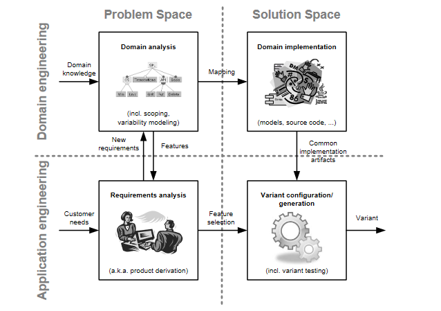
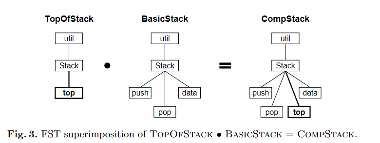
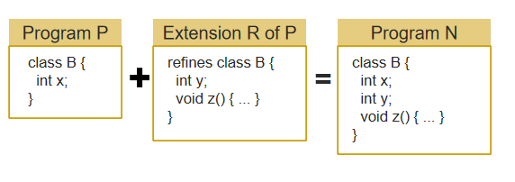
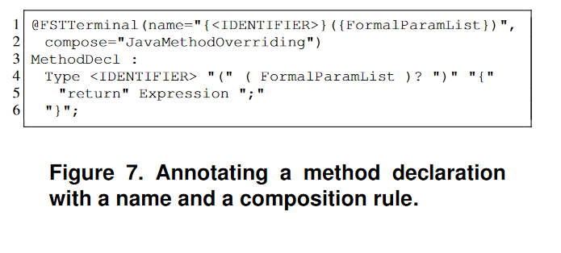
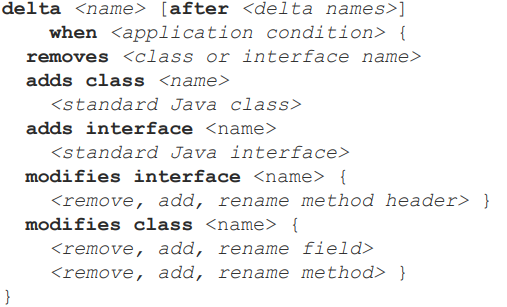
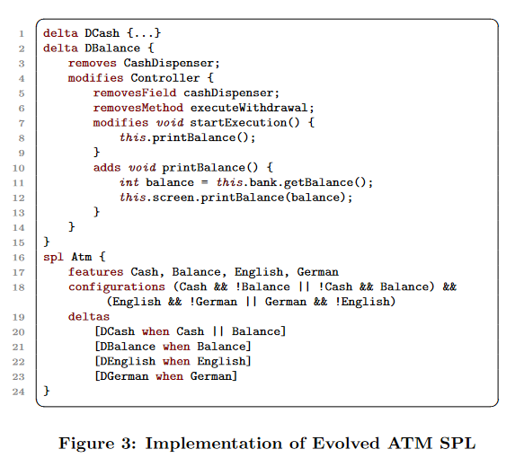
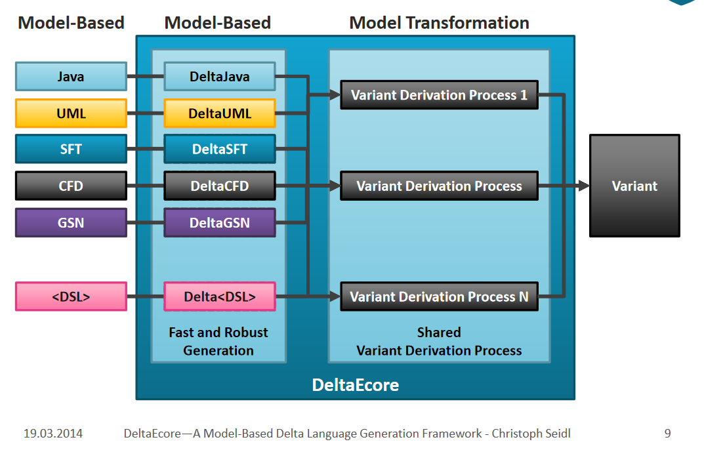
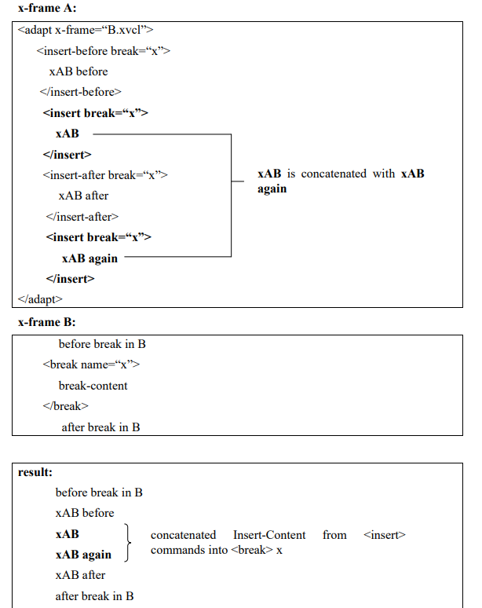

# 从可逆计算看Delta Oriented Programming

多年以前，为了向领导汇报，需要鼓吹一下可逆计算理论的原创性和普适性，所以我做了一点文献调研，查阅了国际软件工程大会(ICSE)历年的文章，发现最接近的理论是1997年出现的Feature Oriented Programming（FOP）[\[2\]](#f2)[\[3\]](#f3)和2010年左右由德国的教授Schaefer提出的Delta-Oriented Programming（DOP）[\[7\]](#f7)[\[8\]](#f8)。可逆计算理论由我在2007年左右提出 [\[12\]](#f12)
[\[13\]](#f13)[\[14\]](#f14)，它的思想来源不是传统的软件工程或者计算机领域，实际上我的学术背景是理论物理学，而且我对于软件工程理论方面的历史成果事前也并不了解，因此在基本原理层面可逆计算与学术界现有的理论并不相同。在本文中，我简单介绍一下可逆计算理论与类似理论之间的区别和联系。

## 一. 软件产品线工程与可变性管理

谈到软件工程理论，就绕不开卡内基梅隆大学软件工程研究所（Software Engineering Institute，SEI）。它不仅是理论界的扛把子，而且是理论联系实际的典范（每年CMM认证授权费就收到手软）。自从SEI提出所谓的软件产品线工程理论（Software Product Lines） [\[1\]](#f1)之后，学术界的众多理论都经历了一个校正调整的过程，把自身的概念校准到软件产品线的话语体系中来。软件产品线工程是横跨管理和技术领域的综合性理论，试图利用一切可行手段去解决非常宏大的系统级、产品级软件复用问题（远远超越细粒度的组件复用技术）。

软件产品线工程所提出的核心技术问题是所谓的**可变性管理**。这几乎是一个万能箩筐型的问题。我们在软件开发和演化过程中所遭遇的**几乎所有困难都能够很容易的被归因于应对变化的能力不足**。经过校准之后FOP将自己定位为软件产品线的某种自然而且高效的实现途径。而后来的DOP将自己解释为对FOP缺陷的改进，同样是实现可变性管理的一种关键技术手段。按照同样的校准逻辑，可逆计算可以看作是对DOP的进一步发展和提升。当然，实际情况是，可逆计算的提出时间要早于DOP，而且它所遵循的是完全不同的思想路线。

根据理论上的分析，可变性管理的真正困难在于如何有效的管控**预料之外的**（unexpected）变化。如果我们对一个领域非常熟悉，而且领域内的变化方式为有限的几种，那么就可以在关键位置设置几个**恰到好处的扩展点**，举重若轻的解决可变性问题。但如果变化的可能位置不断增加，变化的方式不断翻新花样（换句话说，也就是**变化的自由度不断增加，直至趋于无穷**），那么迟早这种变化的自由度会超越手工枚举能够管控的范围。在这种充满未知的演化图景下，我们如何实现对无限多的变化自由度的有效描述和管控？在物理学中，这实际上属于一个已经被解决了的问题。

在高中阶段我们所学习的牛顿物理学是所谓古典力学中的刚体力学。它的世界观是完全机械化的：刚体的运动完全由它的质心坐标和尺寸形状朝向等少数几个参数来描述，刚体的内部构造无法被观测也无关紧要，刚体之间通过直接接触发生相互作用，刚体的形状必须精确匹配才能构成一个无缝的整体（可以对比一下软件组件的黑箱模型）。即使是在古典力学中，稍微高级一点的观点也都会转换到拉格朗日表述或者哈密尔顿表述，它的精神实质是转向**场论的世界观**。所谓的场（Field），其实就是**建立一个无所不在的坐标系，然后在坐标系的每一点上都可以指定一个物理量**。场的自由度是无限的，但是通过坐标系它是可描述的、可定义的、可研究的，在坐标系的每一点上我们都可以精确的度量局部的变化。基于同样的精神，可逆计算的基本设定是首先建立一个足够精细和通用的领域描述坐标系，在这个坐标系中我们能够做到指哪打哪和打哪指哪（**坐标的唯一性**）。建立场的观念之后，我们就可以在下一节对FOP和DOP进行一些理论分析了。

## 二. 从面向特征(FOP)到面向差量(DOP)

面向特征编程，顾名思义，其最核心的概念就是所谓的特征（Feature）。那么，什么是特征？按照文献 [\[3\]](#f3)中的定义

> A feature is a unit of functionality of a software system that satisfies a requirement, represents a design decision, and provides a potential configuration option.

比如按照上面的特征模型，车（Car）必须具有引擎（Engine）这一特征，引擎可以是燃油的或者是电动的，甚至是混动的。而变速箱(Transmission)可以是自动的或者手动的，但不能既是自动的，又是手动的。按照软件产品线工程的设想，具体软件开发类似买车时在配置菜单中打勾做选择（也可以类比于到饭馆点菜），选择指定的特征之后，由生成器负责将它们转换为可执行代码，自动生成可运行的程序。

FOP最基本的洞见在于特征（我们在业务层面所关注的内容）往往不能很好的和面向对象（组件）或者函数分解结构对齐，而几乎必然会成为一种横切关注点（crosscutting concern）。这其实也很好理解。特征是在问题空间中有价值的、可识别的结构，而组件/函数是在解空间中的有效抽象和描述，从问题空间到解空间的结构映射在一般性的业务环境中都是**非平凡的**，因此两种描述方式无法有效的对齐。套用人工智能领域的话语，我们可以说：**有用的特征都是分布式的（distributed）**。

在软件产品线工程中，实现特征定义和组合的一种基本技术手段是类似C语言的预处理机制（条件编译）。

FOP对于软件产品线工程的贡献在于，它提供了更为规范和强大的特征定义和组合机制[\[5\]](#f5)[\[6\]](#f6)。

1. 定义语言无关的特征结构树（Feature Structure Tree, FST）
2. 通过语言无关的Tree Superimposition来实现特征组合

所谓的FST就是一个通用的树形结构，每个节点具有名称(name)和类型(type)，其中子节点的名称各不相同，从而可以区分开来。Tree Superimposition就是两棵树之间的合并过程，节点按照名称逐级合并，合并节点的类型需要匹配。

> Superimposition is the process of composing software artifacts by merging their corresponding substructures.

早期的FOP并没有意识到树结构以及树结构合并算法的通用性，它所采用的是对已有语言进行语法扩展的路数。

Apel在2008-2009年左右发表的一系列工作[\[4\]](#f4)[\[5\]](#f5)[\[6\]](#f6)将FOP推进到一个新的抽象高度。不仅仅限于代码文件，文档、测试用例等等一切相关artifact都可以纳入特征结构树的管辖范围。FeatureHouse[\[6\]](#f6)通过为EBNF语法规则增加FOP相关标注的方式，允许为任意语法结构引入通用的合并规则（不再需要为FOP引入特定的程序语言），从而极大的扩展了FOP的应用范围。

> FEATUREHOUSE relies  on  three  ingredients:
> 
> (1) a  language-independent  model  of  software  artifacts
> 
> (2) superimposition  as  a  language-independent  composition paradigm
> 
> (3)  an artifact language specification based on attribute grammars.

根据上一节的分析，FOP的这一系列做法其实非常容易理解。所谓FST树，就是一种通用的描述坐标系，所有的artifact都**必然**可以分解到这个坐标系中获得一个唯一的、确定的表示。之所以是树形结构，是因为树结构中**任意节点到根节点的路径都是唯一的**，因此可以作为坐标来使用。确定坐标之后，坐标点上的合并过程完全是Generic的，与具体的业务逻辑和业务结构完全无关。这一点，在Apel引入的Feature Algebra形式代数[\[4\]](#f4)中表达的非常清楚。

如果与AOP做个对比，可以发现一个非常有意思的情况。AOP的pointcut能力非常强大，可以直接使用正则表达式这种复杂算子来实现过滤选择，但是丧失了坐标的唯一性，难以建立Feature Algebra。同时，AOP与程序语言深度绑定，难以扩展到其他artifact层面。所以，**强大的表达能力并不是我们所需要追求的全部**，可逆计算非常强调可逆性，强大到破坏了可逆性的行为是需要被限制，甚至被禁止的。

FOP的理论看似已经非常完善，但从可逆计算的角度看，它仍然存在很大的发展空间。2010年，Schaefer发现了FOP的一个不足之处，提出了所谓的Delta Oriented Programming（面向差量编程）。Schaefer的发现是

> It is not possible to start  from  an  existing  legacy  application  comprising  a  larger  set of features and to **remove** features.

如果**抛弃所有关于feature的业务解读，直接把它定义为功能的差量(Delta)**，立刻就可以发现FOP只包含覆盖和新增操作，没有定义**删除**操作！DOP最初是引入了一个类Java语法:DeltaJ [\[10\]](#f10)

后来DOP也学习FeatureHouse，引入了DeltaEcore[\[11\]](#f11)，可以为任意语法引入差量结构。

最早的时候，DOP需要包含一个core product，所有的delta作用到core product之后产生最终的产品。但是，按照可逆计算理论，在存在单位元的情况下，差量和全量之间是可以互相转化的。Schaefer很快也发现了这一点，立马又灌了一篇论文[\[8\]](#f8)，指出不需要core product，仅依赖delta module就可以构建所有系统。

从可逆计算的角度去观察DOP，会发现它仍然存在很大的发展空间，最明显的是它缺少Generator的部分。不过，与可逆计算相比，DOP对于Delta的认知也仍然处于比较初级的程度。taowen前两天提到一篇论文[\[15\]](#f15)，其中描述了一个与差量有关的技术XVCL，它与DOP也有一些相似的地方。在下一节我将分析一下可逆计算中的差量概念与DOP和XVCL等技术之间的区别。

## 三. XVCL与Frame Technology

XVCL宣称自己的理论基础源于所谓的Frame technology，而Frame technology宣称自己的概念源于人工智能领域的Frame，而Frame这个概念由Minsky于1975年发明（没办法，为了发论文每个人都得给自己的概念找个体面的祖师爷）。简单的理解起来，Frame就是一个结构模板（architype），其中挖了一些洞，叫做slot，可以被定制，基本上和vue component没多大区别。

> 1. 选择一个example X
> 2. 将X内部容易变化的细节部分标记出来，把它转化为frame参数（slot），同时将example X的原始内容作为缺省值（slot的body）（。。。好吧，这就是一个vue组件）

网上有一篇2008年对Frame technology发明人Bassett的访谈[\[17\]](#f17)，这篇文章还是包含了一些有趣的观点的（基本都是我基于可逆计算理论表达过的观点，这算英雄所见略同，还是历史就是一个loop？）：

1. Frame可以有效描述 "A与B很相似，**除了**..."这种情况，也可以描述 "A与B+C很相似，**除了**..."这种情况
2. 程序员通过拷贝粘贴修改代码即耗费人力，又不可靠，通过frame指令实现对代码的增删改，又快又准
3. Frame可以互相嵌套构成Frame Tree，可以架设在任意语言所表达的结构之上（比如说在自然语言所写的文本文档中增加frame标记就可以实现文档的frame扩展）
4. 在Frame的观点下，maintenance不再是与development相互割裂的过程。整个开发的过程和维护的过程一样，都是在外部逐步增加frame差量来实现的（不需要修改原始的frame，在原frame中只需要增加标记）。
5. similar programs often differ by small amounts of code，**差异部分可以被局限在frame delta中**，一般只有总量的5% - 15%
6. 任何领域都有所谓的自然粒度（natural graininess）。具体的实现技术，如类、函数等会将自然的结构拆分的稀碎（比如成百上千很小的类和函数），导致不必要的复杂性
7. Frame基于semi-lattice数学结构，可以处理多重继承问题（基本和scala语言的trait机制类似，通过规定覆盖顺序来避免继承导致的概念冲突）
8. Frame就是一个architype，它可以被看作是一个模糊集合（fuzzy set）的中心元素。与其他抽象技术不同，**并不需要事前确保frame的抽象正确无误**。如果发现还需要增加变化点，只要在原始frame中增加slot标记就好了（完全兼容此前的代码，也没有任何运行时成本）。

以上观点听起来很神奇，但对应的XVCL实现代码却是朴实无华的。

XVCL类似于一种模板语言，其中可以定义变量、判断、循环等。adapt类似于函数调用，可以嵌套调用其他frame。而break标签用于标记一个扩展点，类似vue中的slot标签。因为类似模板语言，所以可以用于生成代码，也可以用于生成文档。例如生成Use Case文档。

XVCL与vue组件毕竟是不同的，它提供了某种差量编程的能力：当通过adapt标签来调用其他的frame的时候，可以通过insert-before/insert/insert-after等对定制内容进行较为复杂的控制（adapt的时候insert标签对应部分将修改基础frame中break标签所标记的部分），使用insert empty也可以实现删除缺省内容的效果。

相比于C语言的预处理器，XVCL是一种进步，因为它**可以应用于任意文本格式的文件**，而不仅仅限于特定程序语言（虽然任何模板语言都能干这个），同时XVCL具有更严格的变量作用域规则，并提供了**受控的差量定制机制**（C语言预处理器无法提供slot定制功能）。

不过，如果按照可逆计算理论的分析框架，XVCL所建立的坐标系统实际上是比FeatureHouse[\[6\]](#f6)要更弱的： XVCL通过把系统分解为frame，并在frame中增加break标记构造了一个可用于支持定制的坐标系统，但是frame文件之间基本上处于无组织的状态，而FeatureHouse好歹按照目录结构把所有artifact都管理起来，并在每一级目录上都定义了合并算子。frame-break这种两级抽象基本类似于class-member结构，FeatureHouse通过Feature Structure Tree可以毫无压力的模拟frame机制。而DOP相比于XVCL，也提供了更多的feature组合能力。

虽然FOP、DOP和Frame Technology都采用了差量概念，但它们所定义的差量与可逆计算理论中的差量是有着明显区别的：可逆计算指出差量不仅仅是要表达差异，更重要的是它意味着可逆的运算结构，从而可以有效的限制系统的熵增。基于可逆计算进行设计时，引入任何机制都需要进行配对设计（正向与逆向）。在下一节中我将更详细的阐述一下可逆计算的不同之处。

## 四. 可逆计算有什么不同之处？

在可逆计算的介绍文章[\[18\]](#f18)中，我首先阐述了一个启发式的观点：可逆计算可以看作是**图灵机理论和Lambda演算理论之外实现所谓图灵完备的通用计算的第三条逻辑路径**。强调这个观点的目的是为了指出，**可逆计算并不是一种简单的程序技巧或者是仅适用于某个领域的设计模式**，它是一种具有普适性的计算结构，可以用于各种抽象层面、各种应用领域。可逆计算与物理学中熵的概念息息相关，它所揭示的规律也并不仅仅限于软件应用系统。

可逆计算引入了可逆的差量这一核心概念，明确指出**全量= 单位元+差量**, 因此**全量和差量是可以互相转化的**。这一概念的一个基本推论是：**全量和差量可以是同构的，应该用同一个schema去约束**。这与DOP和XVCL的做法有着很大的区别，在DOP和XVCL中，差量都是**以修改动作的形式出现**，差量的表达方式与全量的表达方式截然不同，这样的话如何去描述差量的差量？差量与全量同构的情况下，**差量的差量仍然是一个普通的差量**。很多人将差量的作用看作是 base + patch，认为base是主要的，patch是次要的。但是，实际上base也可以被看作是patch的patch，base与patch之间是对偶关系，在理论上没有必要把它们区别对待。**差量具有独立存在的价值，它并不需要依附于base才能够被理解**。

在XVCL中，我们需要主动在代码中插入break标签来标记扩展点。但是可逆计算的普适性决定了以下事实：**DSL模型既是在坐标系中定义的实体，同时它又构成了坐标系本身**。我们没有必要单独为了扩展点在模型中增加额外的描述信息，而只需要采用类似FeatureHouse的做法，在EBNF规则/Schema定义中增加少量标注信息即可。

在FOP中，特征模型特别高层，基本退化为了开关树，难以容纳复杂的领域逻辑，而具体的特性表达手段又特别低层，一般与通用程序语言语法类似，或直接依附于通用程序语言（如Java等），这导致根据特性组合编译为具体产品的过程必然与很多细节知识绑定在一切，难以扩展到复杂的应用场景。这从FOP论文所举的实例多半为玩具项目也可窥见一斑。可逆计算明确了DSL的核心地位，为渐进式的引入领域知识指明了方向。

1. **DSL与DSL如何无缝融合**？DSL的本征结构采用Tree结构描述，但是每一个节点都可以具有不同的表观层文本语法，并且可以关联不同的可视化界面。因此不同的DSL可以无缝嵌套在一起
2. **不同的DSL如何共享部分信息，避免出现逻辑冲突**？$ DSL_2 = Generator\langle DSL_1\rangle  + Delta $, 可以从DSL1模型中反向抽取共享信息，然后通过生成器再传播到DSL2模型中，非共享的部分直接通过Delta机制进行描述即可。

FOP虽然引入了Feature Structure Tree这种通用的树形结构，但是与业内其他主流实践类似，它也**陷入到了类型理论的逻辑陷阱中难以自拔**。类型理论可以看作是提供了一个两层坐标系统：任何结构都具有一个确定的类型，根据属性名或者方法名我们可以定位到指定的子结构（相当于是一种局部相对坐标）。定制过程也分为两步：1. 根据类型找到对应的对象  2. 打开对象，修改其中的属性或者方法。但是，**以类型作为坐标系统，明显是不精确和不完善的**。

作为一个坐标系统，最基本的能力是提供如下两个操作

1. value = get(path)
2. set(path, value)

所有需要识别的对象在此坐标系中都应该具有唯一的存取坐标。

但是类型的本义是对相同的结构进行归并表达：**不同的对象具有相同的类型**。这导致使用类型在领域空间中进行唯一定位并不是理所当然的一件事情。最基本的一个问题是，如何定位数组中的某个元素（数组中的元素具有同样的类型）？我们可以使用数组下标来作为数组中的局部坐标，但是**这一坐标表示一般情况下是不稳定的**。当我们在数组中插入一个元素时，所有后续元素对应的下标都会跟着变化。参考一下虚拟DOM的diff算法的实现，我们就可以发现，有必要为数组中的每个元素规定一个特殊的id属性，用于作为该元素稳定的坐标表示。当然，肯定可以通过对类型系统进行扩展，把这一概念包含到类型定义中，但是如果一个模型对象始终只有一个实例，那么有多大必要将自己局限在类型理论的范畴内讨论问题是很值得存疑的。

FOP的特征结构树对应的是包-类-方法这样的组织层级，当我们需要进行特化处理的时候，必然会导致引入大量不必要的类型。可逆计算按照领域结构进行组织（DSL模型本身可能对应多个层级，而不是类-方法这样两层），在领域结构上明确规定坐标的唯一性，因此结构具有唯一的坐标表示，而生成器相当于是一个映射函数，它将一个对象的坐标表示映射到一个新的坐标表示（类似物理系统在相空间中的演化）。生成器本身也是在同样的坐标系下进行表达的，可以通过同样的动力学过程驱动它的演化。与FOP相比，可逆计算明显具有更好的适应性。

FOP和DOP是学术界对于如何构建复杂系统所进行的有益的理论探索，它们也确实带给我一些新的启发。特别的，我在可逆计算中吸收了特性选择器的观念，允许在任意模型节点上通过`feature:on='特性选择表达式'`这一标注来决定是否启用特性相关部分，这一处理过程在模型结构解析之前发生，因此是完全通用的机制，与特定DSL模型无关。

## 五. 可逆计算的开源实现

能坚持看到这里的，估计也没几个人了，握个手吧。如果你对可逆计算确实感兴趣，可能觉得纯理论说得云山雾绕，没多大意思，不如show me the code。这个可以有。我已经开源了一个可逆计算的参考实现**Nop Platform 2.0**。后端使用java（不依赖spring框架），前端使用vue3.0，第一阶段的开源部分主要包含从模型定义到GraphQL服务这条链路所涉及到的所有技术。计划中主要展示如下内容：

1. 模型驱动的代码生成：只需输入一个Excel格式的数据模型，即可得到前后端全套可运行代码，可以完成对多主子表数据结构的增删改查操作。

2. 渐进式的模型增强：在已生成代码的基础上，可以进行增量式的微调。手工调整代码与自动生成代码相互隔离，互不影响。

3. 基于同态映射的可视化设计：代码和可视化模型可以看作是同一逻辑结构的两种同态表示，根据元模型定义自动生成对应的可视化设计器。

4. 多版本差量定制：无需修改主程序代码，即可为不同部署版本定制不同的实现逻辑。定制代码以差量形式存放，粒度可以精确到单个函数和单个按钮展现。

5. 设计器与应用的协同演化：设计器本身也是模型驱动的产物，它并不是固化的工具。设计器可以针对特定应用进行定制优化，同时随着应用功能演进不断增强。设计器定制逻辑与应用定制完全相同。

6. 编译期元编程：通过元模型可以随时定义新的模型，并自动得到对应的解析器、验证器、可视化设计器等。大量的模型构造和转化工作在编译期完成，大幅简化运行期结构，同时可以将同一模型适配到多种运行时引擎上。

7. GraphQL服务、消息服务和批处理服务的统一：无需编程，同一份业务处理逻辑可以发布为在线GraphQL服务，或者消息队列处理服务，或者批处理文件处理任务等，并自动实现批量加载和批量提交优化。

8. 模型驱动的自动化测试：无需编写测试代码，在系统调试过程中可以自动录制服务输入输出数据以及数据库更改记录，并实现回放测试。自动化测试引擎会自动识别随机生成的主键和主子表关联等信息，并执行对应校验代码。

9. 基于变化检测的即时更新：自动识别模型文件变更，并实现即时重编译。通过FileWatch监视文件变化主动触发重编译。

10. 分库分表、多租户、分布式：对于复杂应用场景的内置支持。

后续还将逐步开源IDE插件和WorkflowEngine、 RuleEngine、ReportEngine、JobEngine等运行时引擎，并集成GraalVM虚拟机，基于Truffle框架实现XLang运行时，支持编译为二进制程序等。

项目地址：

- gitee: [canonical-entropy/nop-entropy](https://gitee.com/canonical-entropy/nop-entropy)
- github: [entropy-cloud/nop-entropy](https://github.com/entropy-cloud/nop-entropy)
- 开发示例：[docs/tutorial/tutorial.md](https://gitee.com/canonical-entropy/nop-entropy/blob/master/docs/tutorial/tutorial.md)
- [可逆计算原理和Nop平台介绍及答疑\_哔哩哔哩\_bilibili](https://www.bilibili.com/video/BV1u84y1w7kX/)

## 参考

\[1\]: [Software Product Lines Essentials](https://resources.sei.cmu.edu/asset_files/Presentation/2008_017_001_24246.pdf)

\[2\]: [An Overview of Feature-Oriented Software Development](http://www.jot.fm/issues/issue_2009_07/column5.pdf)

\[3\]: [Feature-Oriented Software Development:A Short Tutorial on Feature-Oriented Programming,Virtual Separation of Concerns, and Variability-AwareAnalysis](https://www.cs.cmu.edu/~ckaestne/pdf/gttse11.pdf)

\[4\]: [An Algebra for Features and Feature Composition](https://www.infosun.fim.uni-passau.de/cl/publications/docs/AMAST2008.pdf)

\[5\]: [Superimposition: A Language-Independent Approach to Software Composition](https://www.se.cs.uni-saarland.de/publications/docs/MIP-0711.pdf)

\[6\]: [FEATUREHOUSE: Language-Independent, Automated Software Composition](https://www.infosun.fim.uni-passau.de/cl/publications/docs/ICSE2009fh.pdf)</pan>

\[7\]: [Delta Oriented Programming](https://homepages.dcc.ufmg.br/~figueiredo/disciplinas/lectures/dop_v01.pdf)

\[8\]: [Pure Delta-oriented Programming](https://www.se.cs.uni-saarland.de/apel/FOSD2010/49-schaefer.pdf)

\[9\]: [Refactoring Delta-Oriented Software Product Lines](https://www.isf.cs.tu-bs.de/cms/team/schulze/pubs/2013/AOSD2013-DOR.pdf)

\[10\]:[https://deltajava.org/](https://deltajava.org/)

\[11\]: [DeltaEcore—A Model-Based Delta Language Generation Framework](https://subs.emis.de/LNI/Proceedings/Proceedings225/81.pdf)

\[12\]: [Witrix架构分析](http://www.blogjava.net/canonical/archive/2007/09/23/147641.html)

\[13\]: [从编写代码到制造代码](http://www.blogjava.net/canonical/archive/2009/02/15/254784.html)

\[14\]: [模型驱动的数学原理](http://www.blogjava.net/canonical/archive/2011/02/07/343919.html)

\[15\]: [XVCL: a mechanism for handling variants insoftware product lines](https://core.ac.uk/download/pdf/82147954.pdf)

\[16\]: [ANALYSIS AND DEBUGGING OF META-PROGRAMS IN XVCL](https://core.ac.uk/download/pdf/48627012.pdf)

\[17\]: [Frame technology](http://www.stephenibaraki.com/cips/v46/bassett.html)

\[18\]: [可逆计算：下一代软件构造理论](https://zhuanlan.zhihu.com/p/64004026)

