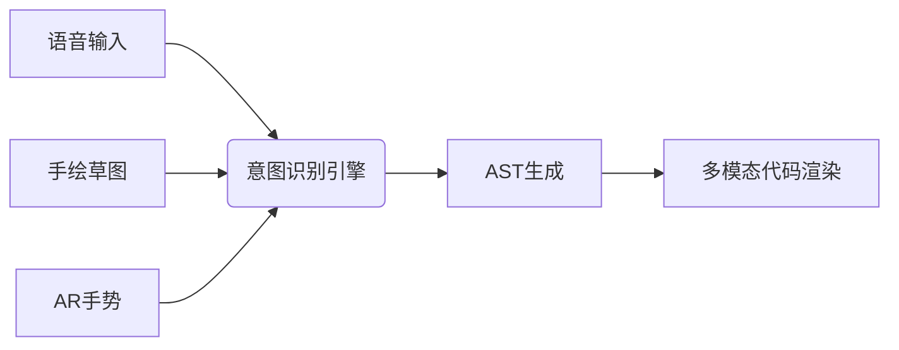

# AI时代的下一代程序语言还有可能做出哪些语言创新？

现有的程序语言都没有考虑到人与AI协同的问题，设计的时候默认的假设是人去编写且人去读取并理解。经过了几十年的发展，优秀的设计被不同的程序语言相互借鉴，似乎所有可能的语法设计都已经被不同的语言尝试过，有用的特性开始被大量语言所接受。为了发展面向AI时代的下一代程序语言，我们还可以做出哪些此前没有做过的创新设计？这些设计能够更好的解决什么问题

**思考过程**:

嗯，用户问的是AI时代的下一代程序语言可能会有哪些创新，特别是考虑到现有语言在设计时没有考虑人与AI协同的问题。这个问题挺大的，需要先拆解一下用户的需求。首先，用户可能已经了解现有编程语言的发展，知道它们主要面向人类编写和阅读，但现在AI作为协作者或甚至开发者的一部分，需要新的设计思路。所以用户想知道未来语言可能有哪些创新，这些创新能解决什么问题。

接下来，我需要考虑用户可能的背景。可能是开发者、研究人员或者对编程语言设计感兴趣的人。他们可能希望了解未来趋势，或者正在寻找研究方向。用户提到现有语言已经借鉴了很多优秀设计，所以需要找出尚未被探索的领域，尤其是在AI协作方面。

用户的问题里提到“人与AI协同”，这意味着新的语言可能需要让AI更容易理解、生成或优化代码。现有的语言可能在这方面存在不足，比如语法复杂、不够结构化，或者缺乏元数据让AI理解意图。因此，创新点可能包括更自然的语法、双向可逆性、意图与实现分离、动态语法树等。

然后，我需要思考现有的语言有哪些不足。比如，现在的代码主要是文本形式，AI处理时可能需要解析成AST，但如果在语言层面就支持动态语法树，可能提高AI的工作效率。另外，代码的意图和实现常常混在一起，导致AI难以理解程序的目的，如果能分离这两者，可能让AI更容易生成或优化代码。

还有，用户提到现有语言的设计假设是人编写和阅读，所以新的语言可能需要更适合AI生成和操作的结构，比如声明式与自动优化的结合，或者实时协同编程的支持。另外，可解释性和伦理约束也可能是创新点，比如在语言层面内置伦理规则，让AI生成的代码自动符合某些规范。

还需要考虑交互方式的创新，比如自然语言与代码混合编程，或者多模态编程环境，结合文本、语音、图表等。这可能让开发更高效，尤其是非专业开发者也能参与。

另外，测试和调试方面，AI可能需要更自动化的工具，比如基于概率的测试，或者实时错误预测。这些都可以集成到语言设计中，而不是作为外部工具。

最后，要确保这些创新点能解决实际问题，比如提高开发效率，降低维护成本，增强代码的可维护性和安全性，促进人机协作等。可能需要举一些具体的例子，比如GitHub Copilot在现有语言中的局限，新语言如何改进这些点。

总结起来，需要从语法、结构、元数据、交互方式、调试测试、伦理约束等多个方面探讨可能的创新，并说明这些设计如何解决AI时代的新挑战。同时，要确保回答覆盖用户可能关心的方面，比如现有语言未涉及的部分，以及这些创新带来的实际好处

**具体回答**：

面向AI时代的下一代程序语言设计，需要突破传统以人类为中心的单向编程思维范式。以下是可能实现的创新方向和对应价值：

---

### 一、**双向可逆编程（Bidirectional Programming）**

- **创新点**：代码与抽象语法树（AST）的动态双向映射
  - 允许开发者直接在语法树层级操作（如AI生成或修改），同时保持人类可读的代码形态
  - 内置版本化AST结构，支持代码修改的因果追溯
- **解决问题**：解决AI生成的代码难以理解、调试和迭代的痛点，消除人类与AI协作时的语义鸿沟

---

### 二、**意图导向编程（Intent-Oriented Programming）**

- **创新点**：
  
  1. 显式分离**程序意图**（What）和**实现细节**（How）
  2. 内置自然语言注释层与机器可解析的意图标记（如`@optimize_for_latency`）

- **案例**：
  
  ```plaintext
  #intent: 实现一个快速排序算法，优先内存效率
  #constraint: 输入规模可能达到10^6级别
  [AI生成或推荐的实现代码]
  ```

- **解决问题**：让AI更精准理解需求，减少"代码正确但不符合意图"的错误

---

### 三、**动态语法（Adaptive Syntax）**

- **创新点**：
  
  - 允许根据上下文动态调整语法规则
  - 支持多模态语法表达（如数学公式直接嵌入）

- **示例**：
  
  ```python
  # 传统方式
  matrix_multiply(A, B)
  
  # 动态语法
  C = A ⨯ B  # 符号直接映射到底层实现
  ```

- **解决问题**：突破固定语法的限制，提升AI生成代码的可读性和表达效率

---

### 四、**概率化编程原语（Probabilistic Primitives）**

- **创新点**：
  
  - 原生支持概率分布类型（如`Gaussian(μ=0, σ=1)`）
  - 内置贝叶斯推理引擎

- **应用场景**：
  
  ```python
  sensor_data ~ Normal(mean=ground_truth, sd=0.1)  # 自动生成概率模型
  ```

- **解决问题**：简化机器学习模型的实现，使AI能直接操作概率语义

---

### 五、**自省与可解释性增强**

- **创新点**：
  
  1. 代码执行过程自动生成解释轨迹（Explanation Trace）
  2. 决策链的因果标记（`becauseof`关键字）

- **示例**：
  
  ```python
  if x > threshold:  # @becauseof(input_statistics.summary())
      trigger_alert()
  ```

- **解决问题**：解决AI生成代码的"黑箱"问题，增强调试和审计能力

---

### 六、**协同编程协议（Collaboration Protocol）**

- **创新点**：
  - 代码块粒度的人机责任标记（`@human_responsibility`/`@AI_suggestion`）
  - 变更建议的差分式表达（Delta-structured Code）
- **价值**：明确人机协作边界，降低代码所有权争议风险

---

### 七、**伦理约束内嵌（Ethical Constraints as First-Class Citizen）**

- **创新点**：
  
  - 类型系统扩展支持伦理属性（如`PersonalData @encrypted`）
  - 资源访问的合规性验证前置

- **示例**：
  
  ```python
  def process(data: UserProfile @GDPR_Compliant) -> 
    @Fairness(metric=demographic_parity):
    # 代码逻辑
  ```

- **解决问题**：在语言层面确保AI生成代码符合伦理规范

---

### 八、**实时反馈编程（Realtime Feedback Loop）**

- **创新点**：
  - 执行环境与开发环境深度融合
  - 基于运行时的即时优化建议（如自动提示`建议将O(n^2)算法替换为O(n log n)`）
- **技术支持**：JIT编译器的双向通信通道

---

### 突破性价值：

1. **降低认知负荷**：开发者更专注问题域而非实现细节
2. **提升协作效率**：人机互补的代码生成/审查/优化闭环
3. **增强系统可靠性**：通过形式化意图和约束减少错误
4. **加速知识迁移**：AI可理解的设计意图促进代码复用

---

### 实现挑战：

- **形式化语义的扩展**：需要新的数学工具描述动态语法和意图
- **开发工具链重构**：编译器需要整合AI推理引擎
- **人机交互范式转变**：从"精确指令"到"意图协商"的思维转换

未来编程语言可能不再局限于文本编辑，而是向**意图可视化编辑**、**多模态交互**和**持续演进的活文档**方向发展。真正的创新将来自对"程序即人机协作媒介"这一本质的重新定义。

在AI与人类深度协同的编程范式下，未来的程序语言创新可能进一步突破传统边界。以下是更前沿的探索方向及其技术实现可能性：

---

### 九、**神经符号融合编程（Neuro-Symbolic Programming）**

- **创新点**：
  
  - **混合执行引擎**：同时支持符号逻辑推理（如Prolog风格规则）和神经网络计算图
  - **梯度流控制**：允许在符号逻辑层定义可微分约束

- **示例**：
  
  ```python
  # 符号层定义业务规则
  @constraint ∀x (age(x)>18 → can_apply_loan(x))
  
  # 神经层处理非结构化数据
  risk_score = NeuralModel(application_data).forward()
  
  # 混合决策
  final_decision = symbolic_constraints.resolve() * risk_score
  ```

- **突破价值**：解决纯神经方法缺乏可解释性、纯符号方法难以处理不确定性的根本矛盾

---

### 十、**因果推理原语（Causal Primitives）**

- **创新点**：
  
  - 内置因果图（Causal Graph）数据结构
  - `intervene`关键字支持虚拟干预实验
  - 自动反事实推理（Counterfactual Reasoning）

- **应用场景**：
  
  ```python
  graph = CausalGraph.from_data(df, edges=[
    ("广告投入", "销量"), 
    ("季节", "库存")
  ])
  
  # 模拟将广告预算提高20%的效果
  with graph.intervene("广告投入", value=current_value*1.2):
    predicted_sales = simulate()  # 自动进行do-calculus
  ```

- **技术支撑**：整合结构因果模型（SCM）和潜在结果框架

---

### 十一、**语义版本化（Semantic Versioning 2.0）**

- **创新设计**：
  - **三维版本标识**：`语义版本@时间戳#知识版本`
    - `2.3.1@2025-Q3#GPT-5-v3` 表示由GPT-5第3代模型生成的2.3.1版实现
  - **知识图谱锚定**：代码变更自动链接到领域知识库节点
- **解决问题**：追踪AI生成代码的"知识谱系"，解决模型迭代导致的代码退化问题

---

### 十二、**环境感知编程（Context-Aware Programming）**

- **核心创新**：
  
  - **运行时环境元数据**自动注入（如硬件配置、数据特征、用户权限）
  - **自适应代码生成**：同一段逻辑在不同环境下编译为不同实现

- **案例**：
  
  ```python
  # 通用代码
  def process(data):
    clean_data = data.clean()
  
  # 在边缘设备编译时自动插入：
  clean_data = lightweight_clean(data)  # 生成ARM优化版本
  
  # 在云端编译时自动插入：
  clean_data = spark_clean(data)        # 生成分布式版本
  ```

- **技术实现**：基于LLM的上下文感知编译器（Context-Aware Compiler）

---

### 十三、**多智能体协商语法（Multi-Agent Negotiation Syntax）**

- **创新机制**：
  
  - 代码块级`@proposal`和`@consensus`标注
  - 分布式共识算法内置于语言运行时

- **协作示例**：
  
  ```python
  @proposal(agent="AI_Optimizer")
  def algorithm_v1():  # 初始AI建议
    return bubble_sort(arr)
  
  @proposal(agent="Human")
  def algorithm_v2():  # 开发者修改
    return quick_sort(arr)
  
  @consensus(strategy="latency_priority")  # 运行时自动选择最优实现
  def final_algorithm():
    ...
  ```

- **突破意义**：实现人-AI-AI群组间的协作决策，而非单向代码生成

---

### 十四、**认知负荷优化系统**

- **创新设计**：
  
  - **注意力热力图**：编译器自动标记代码复杂度区域
  - **渐进式披露**：按开发者认知水平动态展示代码细节

- **交互示例**：
  
  ```python
  # 初级开发者视图
  def main():
    [数据预处理] -> [模型训练] -> [结果输出]
  
  # 专家模式（Ctrl+展开）
  def main():
    df = load_data("input.csv")
    cleaned = remove_outliers(df, method='IQR')
    model = XGBoost(params).fit(cleaned)
    save_model(model, "v1.pkl")
  ```

- **技术支撑**：实时眼动追踪与认知状态建模

---

### 十五、**量子-经典混合编程模型**

- **前沿整合**：
  
  - **统一资源管理系统**：自动分配计算任务到经典/量子计算单元
  - **噪声自适应编译**：根据量子硬件特性动态优化电路

- **语法示例**：
  
  ```python
  @quantum_section(backend="IBMQ_16")  # 声明量子计算块
  def quantum_routine():
    q = QuantumRegister(3)
    c = ClassicalRegister(3)
    circuit = QuantumCircuit(q, c)
    circuit.h(q[0])
    ...
    return circuit
  
  # 经典代码中无缝调用
  result = hybrid_execute(quantum_routine(), shots=1000)
  ```

- **核心价值**：为后量子计算时代提供平滑过渡方案

---

### 十六、**自我进化型API（Self-Evolving API）**

- **突破性特征**：
  - **动态接口适配**：根据使用模式自动生成/废弃API方法
  - **语义版本漂流防护**：API变更自动保持向后兼容
- **案例流程**：
  1. 开发者调用`api.fetch_data()`
  2. 系统监测到90%用户实际需要分页功能
  3. 自动升级API为`fetch_data(page_size=50, page=1)`
  4. 旧调用方式仍可通过虚拟接口兼容

---

### 十七、**多模态编程界面（Multimodal Interface）**

- **融合创新**：
  - **语音-代码双向转换**：口述"创建一个包含姓名和年龄的表格"自动生成代码
  - **草图识别**：绘制UI草图即时生成前端框架代码
  - **AR编程辅助**：通过Hololens等设备三维可视化数据流
- **技术栈整合**：



---

### 深层技术挑战：

1. **不确定性管理**：如何处理AI生成代码的随机性输出
2. **责任溯源**：当人机协作代码出现故障时的归责机制
3. **心智模型对齐**：确保开发者与AI对代码语义的理解一致
4. **持续学习系统**：语言本身如何适应快速进化的AI模型

---

### 未来形态展望：

- **活体文档（Living Documentation）**：代码中的注释自动保持与实现同步
- **生态感知系统**：根据技术趋势自动建议依赖库迁移（如"检测到TensorFlow使用率下降，建议转至PyTorch"）
- **认知镜像（Cognitive Mirror）**：通过代码风格反向推断开发者思维模式，提供个性化辅助

这种语言将不再是单纯的工具，而是演化为**人机认知共同体**的操作系统。其终极目标不是替代人类编程，而是通过"语言即接口"的革新，实现克拉克第三定律所述境界："任何足够先进的编程技术都与魔法无异"。

面向AI时代的下一代编程语言可能会在以下方向实现突破性创新，这些创新将重构人机协作的编程范式：

#### 一、多模态语法架构

1. **自然语言-代码混合语法**（NL-Code Hybrid）
   开发支持自然语言片段与精确代码无缝嵌套的语法结构，例如：
   
   ```python
   # 模糊语法示例
   def process_data:
       "读取用户上传的CSV文件，清洗电话号码格式，去除重复项"
       with AI.auto_implement(context=locals()) as code:
           return code
   ```
   
   关键创新点在于允许保留自然语言意图的同时生成可执行代码，AI可自动填补实现细节。

2. **动态可调语法树**
   引入语法规则的运行时可变性，允许AI根据上下文动态调整语法结构。例如：
   
   ```julia
   @dynamic_syntax begin
       "创建神经网络：输入层28x28，两个隐藏层(128,64)，输出10分类"
       model = Sequential(
           Flatten(28,28),
           Dense(128, activation=:relu),
           Dropout(0.2),
           Dense(64, activation=:relu),
           Dense(10, activation=:softmax)
       )
   end
   ```
   
   AI可自动补全层类型、激活函数等细节，同时保持代码可读性。

#### 二、意图导向编程系统

1. **目标分解代数**
   开发基于范畴数学的形式化目标分解系统：
   
   ```haskell
   project :: Goal -> [Subgoal]
   project "构建电商推荐系统" = 
       [DataIngestion, FeatureEngineering, ModelTraining, ServingAPI]
       ⊗ ScalabilityConstraints
       ⊗ PrivacyRequirements
   ```
   
   AI通过类型系统自动验证目标分解的完备性。

2. **运行时意图验证**
   在语言层面集成意图验证机制：
   
   ```rust
   #[intent("确保用户年龄在18岁以上")]
   fn validate_age(age: i32) -> bool {
       age >= 18
   }
   ```
   
   编译器自动生成反例测试，AI持续验证实现是否违背原始意图。

#### 三、可逆计算原语

1. **双向代码变换**
   内置代码修改的因果追踪系统：
   
   ```clojure
   (defn calculate-tax [income]
     (←history "2023-07: 税率从5%调整到7%")
     (* income 0.07))
   ```
   
   AI可沿修改历史回溯，理解每个变更的决策背景。

2. **概率代码结构**
   
   ```python
   with uncertainty(0.8):
       def recommend(user):
           if user.history.length > 10:
               return collaborative_filter()
           else:
               return popular_items()
   ```
   
   AI运行时根据上下文动态调整代码执行路径。

#### 四、认知增强型类型系统

1. **语义类型推理**
   
   ```typescript
   type Temperature = Number<"℃", {min: -273.15, max: 10000}>
                | Number<"℉", {min: -459.67, max: 1832}>
                | String<"cold" | "hot">;
   ```
   
   AI自动处理单位转换和语义边界检查。

2. **类型流分析**
   
   ```scala
   def process(data: DataFrame[Schema]) =>
     data.filter(_.age > 18)
        .map(_.name) : Stream[List[String@Length(1..50)]]
   ```
   
   AI实时跟踪数据流类型变化，预防运行时错误。

#### 五、自演进代码生态

1. **代码DNA系统**
   
   ```ruby
   class User
     include Versioning::Gene(
       mutations: [:encryption, :validation],
       constraints: :GDPR
     )
   
     attr :email, DNA: { format: /.+@.+/ }
   end
   ```
   
   AI根据环境变化自动应用合规性"基因突变"。

2. **知识图谱集成**
   
   ```sparql
   INSERT { 
     :UserProfile a owl:Class;
       rdfs:subClassOf :PrivacySensitiveData;
       dc:compliance :GDPR-Article30.
   }
   WHERE { 
     SERVICE <AI_advisor> {
       ?newClass should_implement data_protection_standard()
     }
   }
   ```
   
   代码变更自动更新关联知识图谱。

#### 六、人机协作基础设施

1. **认知注意力标记**
   
   ```csharp
   [Attention(priority: Critical, 
             stakeholders: [SecurityTeam, Legal],
             explanation: "跨境数据传输合规检查")]
   void TransferData(DataSet data, Country destination) {
       // AI优先检查此区域代码
   }
   ```

2. **决策溯源语法**
   
   ```elixir
   defmodule Pricing do
     @decision_tree """
     IF market == :europe THEN
       apply VAT
     ELSE 
       check_tax_treaty()
     END
     """
     |> AI.audit_trail("2023-Q3 Tax Strategy")
   end
   ```

这些创新将解决以下核心问题：

1. **意图失真**：降低从需求到代码实现的语义鸿沟
2. **知识衰减**：保持业务规则与技术实现的一致性
3. **协作摩擦**：优化人-AI团队的知识传递效率
4. **系统演进**：支持持续安全的架构自适应
5. **认知负荷**：将程序员从机械性编码升级为监督性编程

未来编程语言可能发展为"可执行的领域知识图谱"，其中代码、文档、测试、架构决策等要素通过形式化语义连接，形成支持持续演进的数字孪生系统。AI不仅作为编程助手，更成为代码生命周期的共同维护者，人类开发者则专注于价值判断和创造性决策。
