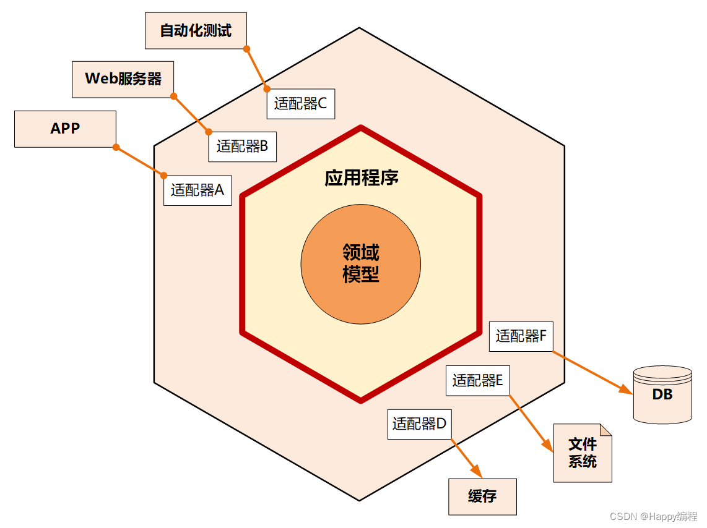

# DDD本质论：从哲学到数学，再到工程实践的完整指南之理论篇

微服务的盛行催生了DDD（Domain Driven Design）的文艺复兴，然而，关于其最佳实践能否、以及应否被标准化为统一的技术框架，业界仍存有深刻的争论。在落地DDD的过程中，
很多设计会议都充斥着大量无谓的针对技术细节的争吵，谁也说服不了谁。

那么，DDD的优势究竟何在？是为了更好地适应面向对象的生态环境？还是为了统一团队心智，将管理上的阻力清晰地映射到技术世界，从而弥合技术与业务之间的鸿沟？又或者，其背后存在着某种可以在数学层面得到证明的技术必然性？本文结合（广义）可逆计算理论和开源低代码平台Nop平台的技术实现方案，剖析一下DDD的技术内核。

> 文中的（广义）可逆计算理论（Generalized Reversible Computation）与物理学中的可逆计算机(Reversible Computing)概念并不相同，它并非指计算指令的逆向执行，而是对“可逆”概念在软件构造学层面的扩展性认知。参见[可逆计算：下一代软件构造理论](https://mp.weixin.qq.com/s/CwCQgYqQZxYmlZcfXEWlgA)， [广义可逆计算: 一个软件构造范式的正名与阐释](https://mp.weixin.qq.com/s/pNXPEvyVB7ljOhBQVh6c-A)

> Nop平台是（广义）可逆计算理论的开源参考实现。Nop是Nop is not Programming(非编程)的递归缩写。

## 一. DDD的标准理解：战略和战术设计

如果我们向AI大模型提问：你了解DDD吗？知道它为什么能起作用吗？

GPT5会做出如下标准回答：

---------------------------------

了解。DDD（领域驱动设计）既是一套思维方式，也是一组实践，用来在复杂业务中把软件设计与领域知识紧密对齐，从而更快更稳地交付可演化的系统。

## 是什么（两层视角）

### 战略设计：划分业务版图，明确边界与团队协作

- **领域/子领域（Domain）**：按业务能力拆分（核心、支撑、通用）。
- **限界上下文（Bounded Context）**：在明确边界内使用一致的模型和术语，边界之间通过集成模式（防腐层Anti-Cruption Layer等）进行通信。
- **通用语言（Ubiquitous Language）**：业务与技术共享同一种语言，避免“翻译损耗”。

### 战术设计：在边界内如何建模与实现

- **实体/值对象、聚合与聚合根**：定义不变量与事务一致性边界。
- **领域服务、领域事件、仓储、工厂、规范（Specification）等**。
- **端口与适配器（六边形架构）**：隔离领域与基础设施。

## 为什么它能起作用（背后的机制）

- **减少认知与沟通损耗**：通用语言与协作建模把隐性规则显性化，减少需求与代码之间的“意译层”。
- **管理复杂度**：用限界上下文把大问题切成若干“内部高度一致、外部低耦合”的小问题；聚合把强一致性约束局部化。
- **保证业务正确性**：把不变量写进模型（而不是分散在控制器/SQL/校验里），让“无效状态不可表示”。
- **促进演化**：边界清晰、依赖向内收敛，方便重构与替换；领域事件与最终一致性让跨边界协作更松耦合。
- **社会技术对齐**：借助Conway定律，团队边界与限界上下文对齐，减少跨团队协作摩擦。
- **资源聚焦**：通过核心/支撑/通用子领域分类，把建模与工程投入集中在“差异化价值”的核心域。

## 何时适合用

- 业务规则复杂、概念多变、需要长期演化（电商订单、金融风控、供应链计划等）。
- 多团队协作、系统边界不清、集成复杂。
- 需要对不变量与一致性有严格控制。

## 不太适合

- 以CRUD为主、规则简单、短生命周期的小项目；此时简单架构更高效。

## 如何开始（实操建议）

- **发现与对齐**
  - 领域访谈、Event Storming、Domain Storytelling梳理流程与事件。
  - 子领域划分与价值评估（区分核心/支撑/通用），与团队边界对齐。
- **画边界与集成**
  - 定义限界上下文与上下文映射（共享内核、发布语言、防腐层等）。
- **建模与实现**
  - 以不变量划分聚合；倾向小聚合，跨聚合用事件/流程编排（Saga/进程管理器）实现最终一致性。
  - 优先值对象（不可变、易测试），实体只在确需标识时使用。
  - 应用服务编排用例，领域服务承载跨聚合领域逻辑，仓储只负责持久化聚合根。
  - 用端口/适配器隔离外部系统与基础设施。
- **迭代**
  - 模型随认知演进，经常重构；度量变更成本与缺陷率验证边界是否合适。

## 一个简化示例（电商）

- **限界上下文**：目录、定价、下单、支付、配送。
- **下单上下文的聚合**：Order（不变量：总金额=明细汇总；状态流转受限；同一订单不可重复支付）。
- **跨上下文**：OrderPlaced事件通知库存与配送；支付成功后发布PaymentConfirmed，订单状态异步变更。边界之间通过ACL适配不同模型，避免共享数据库耦合。

## 常见坑

- 只用“战术模式”（Entity/Repository）而不做战略划分，结果仍旧大泥球。
- 把DDD当“微服务银弹”：微服务是部署决策，DDD是建模与协作方法；可以先在模块化单体内落地DDD。
- 过度一致性：把跨上下文的不变量硬塞进单事务，导致高耦合与性能/可用性问题。
- 语言不落地：会议上用业务话术，代码里换成技术术语，通用语言断裂。

## 一句话总结

DDD之所以有效，是因为它用清晰的业务边界、共享语言与显性化的不变量，把复杂业务的知识结构直接反映到代码与团队协作中，从而降低复杂度、提高正确性并支持持续演化。

------------GPT5创作完毕---------

## 二. DDD的第一性原理：发现并表达领域的内在规律

DDD作为一套成熟的软件工程方法论，它必然是一个涉及**管理、技术和外部环境约束**的综合性社会技术系统。

DDD之所以常常难以“完美落地”，正是因为它试图解决的，是真实世界中混杂着各种非技术因素的难题。例如，当我们面对一个技术实力参差不齐、沟通成本极高、甚至存在利益冲突的外部合作团队时，**这些人和组织层面的利益及协调问题（即所谓的"办公室政治"）会直接影响到系统的接口设计、模块划分、甚至技术选型**。这充分说明，DDD的许多设计决策，其根源往往脱离不了**人的因素、沟通的博弈以及组织间的利益协调**。

然而，这是否便是DDD的全部真相？倘若我们暂且剥离其社会技术系统的外衣，将目光聚焦于纯技术的范畴，DDD所倡导的模式是否依然展现出某种技术上的必然优越性？换言之，为什么“聚合根”这种模式在技术上就是比随意的对象组合更能控制状态变迁？为什么“限界上下文”的划分就是比一个大一统的模型更能降低耦合？

**如果DDD真的能够广泛有效地解决技术问题，那么其背后一定存在某种数学层面的本质原因，是某种不受人和环境影响的客观规律在起作用的表现。**

这个客观规律的出发点，可以归结为一个核心洞察：**业务逻辑本质上是技术无关的**。它是一套关于领域内概念、规则和流程的纯粹信息描述。因此，最稳定、最能抵抗时间侵蚀的软件结构，必然是那种能够**使用且仅使用**业务领域内的概念来表达业务逻辑的结构。这里的“且仅使用”是关键，它意味着要最大限度地避免引入“技术噪音”——那些源于数据库、消息队列、Web框架等具体实现技术的偶然因素。

一旦我们能够做到这一点，我们就得到了一种完全基于**领域固有结构**建立的描述。由于摆脱了技术实现的偶然性，这种描述获得了长久的稳定性。更重要的是，因为它直接反映了领域本身的规律，所以它在**概念上显得更为纯粹**和优雅。

**领域具有内在的某种规律性，这是领域模型能够穿越业务发展周期、持久提供价值的核心。** 试想，如果领域根本没有内在的规律，那么直接针对特定的业务场景编写代码就足够了，为什么还要费力提炼一个可以适应各种业务发展的稳定领域模型呢？为什么需要这个“中间层”？这就像软件产品线工程中，我们之所以要提炼核心资产和可变性机制，正是因为我们相信在一系列相似产品背后，存在着可以被抽象、可以被复用的稳定结构。**领域模型的价值，恰恰在于它捕捉的是领域问题空间中那些稳定的、本质的、具有内在规律性的部分。**

> 我们经常可以观察到：一个完全不懂分布式原理的业务专家，为确保业务流程不出错而设计的业务日志表，其结构往往与分布式系统专家为保证数据一致性而设计的Saga日志或事件溯源表惊人地相似。
> 这是因为他们面对的是同一个受强约束的根本问题——“如何在一个多步、不可靠的过程中保证整体的正确性”。正是问题本身的内在结构，使得其解法往往收敛于相似的结构。

从这个角度看，DDD的战术模式（聚合、实体、值对象、领域服务等）不再仅仅是“最佳实践”，而是我们为了构建一个**技术中立的、纯粹的业务逻辑表达体系**所发明的一系列工具和约束。DDD之所以在技术上有效，是因为它引导我们去发现和构建一个更贴近领域问题本质的、**结构上更精炼的“计算模型”**，而不是将业务逻辑零散地、偶然地散落在与技术实现紧密耦合的各个角落。

**这也正是“统一语言”（Ubiquitous Language）为什么如此重要的最本质原因。** 它不仅仅是为了让团队“说得更顺”或改善日常沟通，更是为了**让代码中的业务逻辑用问题自身的语言来准确映射其内在规律，避免被实现细节污染**。当我们坚持使用领域概念而非技术概念来表达业务逻辑时，我们实际上是在确保代码映射的是领域的稳定结构，而不是某个特定技术栈的偶然特征。这样构建出的领域模型，才能在业务演化、技术更迭中保持稳定，持续提供价值。

## 三. 分解的艺术：纵向切分与横向分层

理解了DDD的目标是捕捉领域的内在规律后，一个随之而来的问题是：我们如何系统地构建这个反映领域规律的“计算模型”？一个强大的思维框架是：**将软件设计本质上视为一个对复杂问题空间进行“分而治之”的过程，而这个过程可以归结为两种最基础的分解维度：纵向分解与横向分解。**

### 纵向分解：对象化的自然涌现

如果我们希望对一个复杂的设计空间进行分解，最直接的目标是**最小化分解后各部分间的耦合**。最理想的状况是，分解后的部分能够完全独立、并行不悖地演进。

1. **第一级分解与对象命名**：要实现这种隔离，首要任务就是找到那个能将系统“切得最干净”的维度（主分解维度）。这个维度的选择，直接对应于我们将系统概念化为哪些**核心构件**。当我们为这些构件赋予名称时——例如“订单”、“客户”、“库存”——我们实际上就在进行**对象分解**。这是最根本的抽象手段，因为它直接对应了我们对问题域中核心实体的认知划分。一个恰当的对象分解，其内在的凝聚力最高，而彼此间的关联最弱。

2. **次级分解与内部结构**：在确定了核心对象之后，我们自然需要描述每个对象的内部构成。此时，次级分解出的部分不可能是完全无关的（否则它理应成为一个独立的一级对象）。这些“有些相关又有些不同”的结构，恰恰定义了对象的内在特征和行为。在程序空间中，它们被自然地命名为**属性（数据）** 和**方法（函数）**。这并非偶然，而是因为数据和函数是程序世界中最基本的构造单元。

因此，**纵向分解是一个自然导向对象化抽象的过程**。它通过识别领域中的核心概念及其内在构成，将系统的复杂性封装在一个个边界清晰、职责明确的模块单元之中。

#### 纵向分解的工程实现：从概念分裂到可寻址的领域坐标

> 无名，天地之始。有名，万物之母。

纵向分解的本质，是在均质、平权的函数与数据构成的初始空间中，通过识别“内在相关性”，引入结构性的不对称，从而使得更高级的概念（对象）得以“自然涌现”。

> 最早的编程语言是由打孔纸带所体现的0101二进制机器语言，汇编语言为指令和地址“赋予别名”，打开了符号化世界的大门。C/Pascal等高级语言更进一步，支持为复杂数据结构引入**自定义类型名**，并通过局部作用域创造了局部变量名。面向对象则完成了下一次概念跃迁，为一切相关的数据和函数命名，并且通过this指针引入了**相对的名**：this.fly() 的具体含义不再绝对，而是相对于this指针所指向的那个对象实体而定。

从系统外部向内部看，我们最先看到的就是纵向切分所带来的**概念分裂**。以Nop平台为例，其前台访问后台的REST链接格式根据第一性原理确定为 `/r/{bizObjName}__{bizAction}`（如 `/r/NopAuthUser__findPage`），它直观地将一个完整的后台服务，按核心领域概念（如用户、订单）**分裂**为多个独立的语义子空间。

**对象名界定分裂边界**：`NopAuthUser` 正是这一次分裂的产物，它作为一个坐标，界定了一个高内聚领域概念的边界。

**分裂催生内部聚合**：在此边界内，系统自动聚合该概念的所有技术实现：
- `NopAuthUser.xbiz` - 定义业务逻辑
- `NopAuthUser.xmeta` - 定义元数据模型
- `NopAuthUser.view.xml` - 定义视图大纲

**分裂的递归演进**：这一分裂过程可以递归进行，实现差量化的精细治理。例如：`/r/NopAuthUser_admin__active_findPage`
- **纵向再分裂**：`NopAuthUser_admin` 从通用用户概念中再次分裂，形成服务于管理员角色的特化版本。它可以拥有自己定制的业务逻辑 (`NopAuthUser_admin.xbiz`) 和界面模型，同时可以选择性地继承通用用户的定义（使用 `x:extends`）。这完美体现了从单一通用模型到“核心模型+多个差量变体”的演进式设计。
- **横向精细化**：`active_findPage` 则在行为层面进行细化。它的基本逻辑与 `findPage` 相同，只是额外指定了 `active` 查询条件。

在Nop平台中，URL链接正是这种概念分裂的直接体现，它将抽象的纵向切分，具象化为稳定、可寻址的工程契约。

### 横向分解：层次化架构的必然性

与纵向分解关注“系统由哪些不同事物构成”互补，横向分解关注的是“处理任一事物的流程中，哪些步骤在本质上不同”。它的目标是**分离关注点**，让不同性质的技术逻辑能够独立变化和复用。

1. **输入、处理、输出的天然分离**：最朴素的横向分解，就是将任何流程视为 **“输入 -> 处理 -> 输出”** 三个阶段。我们立刻意识到，同样的核心“处理”逻辑，完全可以适配不同的“输入”来源和“输出”目的地。为了复用核心逻辑并隔离变化，将这三个阶段分离成独立的层次就成为了必然选择。

2. **三层架构**：经典的**表现层、业务逻辑层、数据持久层**三层架构，正是这种横向分解思想的直接体现。它将与技术细节强相关的输入（Web请求）、输出（数据库操作）与核心的业务处理逻辑分离开来。

### 合二为一：矩阵化治理复杂性

在实际的软件系统中，纵向分解与横向分解并非择一而行，而是**同时作用、交织在一起**，形成一个设计的矩阵。

- **纵向分解定义了系统的“静态结构”**：它回答了“系统中有哪些核心对象？”（是什么）
- **横向分解定义了系统的“动态流程”**：它回答了“每个用例的请求是如何穿越层次，与这些对象交互并完成任务的？”（如何做）

一个优雅的架构，正是在这两个维度上都做出了清晰、一致的切割。正是在这个横纵交织的十字线上，我们得以精准地定位每一段代码的职责，从而系统地构建出那个能够忠实反映领域内在规律的、稳定而灵活的系统结构。

## 四. **限界上下文：发现“空间”的革命**

在DDD出现之前，软件设计的世界，就像是牛顿经典力学之前的物理学世界。

### **1. 前DDD时代：一个无限、均质的“绝对空间”**

在经典的对象和分层设计中，整个软件系统被视为一个**统一、无限、均质的“绝对空间”**。

* **统一且无限**：所有对象，无论其业务归属，都存在于同一个全局命名空间和语义场中。理论上，任何对象都可以直接或间接地与其他任何对象交互。这就好比宇宙中所有星体都漂浮在同一个无边无际的以太里。
* **均质**：这个空间本身没有特性。我们只关注空间中的“物体”（对象）及其相互作用（方法调用），而忽略了“空间”本身可能具有的属性和边界。**空间只是一个被动的、透明的背景容器。**
* **设计的焦点**：因此，所有的设计复杂性都集中在如何管理和组织空间中的“物体”上。我们发明了设计模式、组件化等方法，试图在线团般的物体关系中梳理出秩序。但我们从未想过，问题可能出在“空间”本身。

### **2. DDD的革命：发现“相对空间”——限界上下文**

DDD所引入的范式转换，在认知层面上，类似于物理学从牛顿的绝对时空观到爱因斯坦相对论的视角转换。爱因斯坦指出，空间并非被动的背景，而是可以被质量弯曲、具有自身属性的动态实体。

同样，DDD通过**限界上下文（Bounded Context）**，向我们揭示：

* **软件设计空间不是统一的，而是由多个异质的、有边界的“相对空间”构成的。**
* **每个“空间”（限界上下文）都具有自己独特的“物理定律”**——这就是**统一语言（Ubiquitous Language）**。在“订单空间”里，“商品”遵循的是一套规则；而在“库存空间”里，“商品”遵循的是另一套完全不同的规则。
* **“空间”定义了“物体”的意义**：一个对象（如“商品”）的真正含义和行为，是由它所在的“空间”（限界上下文）所决定的。脱离了上下文，谈论对象是毫无意义的。

**所以，限界上下文的核心贡献，就是让我们第一次“看见”了空间本身。** 我们不再将空间视为理所当然的透明背景，而是将其作为**设计的头等公民**。（此前我们只看到了前景而忽略了背景）

### **3. “空间”带来的设计范式转变**

一旦我们发现了“空间”的存在，整个设计范式就发生了根本性的转变：

1. **从“先有对象，后有关系”到“先有空间，后有对象”**：
   
   * **旧范式**：我们先设计出一大堆对象，然后绞尽脑汁地梳理它们之间的关系。
   * **新范式（DDD战略设计）**：我们首先要做的是**划分空间**（识别限界上下文）。这是一个战略性的、宏观的决策。只有在空间被定义之后，我们才能在其中安全地、无歧义地设计和演化属于这个空间的物体（聚合、实体）。**切分，是在空间中发生的。**

2. **复杂性的治理从“内部整理”到“边界隔离”**：
   
   * **旧范式**：面对复杂性，我们试图在同一个大房间里把家具摆放得更整齐一些。
   * **新范-式**：我们直接建墙，把一个大房间隔成多个功能独立的小房间。每个小房间内部可以很简单，房间之间的交互通过明确的门（防腐层、开放主机服务）进行。**复杂性被边界有效地隔绝和控制了。**

## 五. 六边形架构：边界与隔离

纵向维度的"空间革命"解决了宏观语义边界的问题，而在单个限界上下文内部，横向架构的演进则致力于守护领域模型的纯粹性，其标志是从**三层架构**到**六边形架构**的演进。

1. **三层架构的贡献与局限**
   
   经典的三层架构（表现层、业务逻辑层、数据持久层）是横向分解思想的成功实践。它通过**分离关注点**，将用户交互、核心逻辑和数据持久化这些不同性质的任务隔离，使得业务逻辑层在理论上可以独立于具体的数据源和用户界面而存在。
   
   然而，在实践中，"业务逻辑层"常常是一个模糊的容器。技术实现细节（如事务管理、数据库连接、远程调用）很容易渗透进来，与核心的领域规则纠缠在一起。更为关键的是，它隐含了某种"上下"等级观念，未能清晰、对称地表达出一个最核心的设计意图：**保护领域内核不受任何外部技术的影响**。

2. **六边形架构：清晰的内部与外部**
   
   
   六边形架构（或称端口与适配器架构）是对三层架构理念的一次彻底贯彻和升华。它进行了一次根本性的概念重构：
   
   * **从"上下"到"内外"**：它不再使用具有等级暗示的"上层-下层"概念，而是明确地将系统划分为**内部（领域模型）** 与**外部（技术实现与世界）**。
   * **端口与适配器**：
     * **内部**通过**端口**——一组抽象的接口——来声明它需要什么功能，或能提供什么功能。
     * **外部**通过**适配器**来连接具体的实现（如Web控制器、数据库仓储）与这些端口。
   
   六边形架构的本质，是将"技术分层"转变为"业务内核与技术实现的边界划分"。它将核心领域模型置于架构的中心，使其被一个由端口和适配器构成的保护圈所隔离。**领域模型因此不再"依赖"于任何具体技术，它只是定义了契约（端口），而由外部世界来适配它。** 这完美地实现了前文所述的"构建技术中立的业务逻辑表达体系"的目标。

这里的架构演进，可以类比于生物细胞通过**细胞膜**实现“边界与内部”的分离。细胞膜（**端口与适配器**）作为选择性边界，严格管控内外物质与信息交换，其根本目的在于：**创造一个受保护的内部环境，使得内部结构可以与外部环境的复杂性解耦，从而获得独立演化和适应的能力。** 正是凭借这种机制，细胞质和细胞核（**领域模型**）内部高度复杂、精密的化学反应（**核心业务逻辑**）才得以在不受外部环境无序干扰的情况下稳定、高效地进行。限界上下文与六边形架构共同作用，正是在软件系统中实现了类似的“细胞化”封装。

### 纵横交汇，构建认知镜像

至此，我们可以看到一个清晰的演进脉络：

* **在纵向上**，DDD通过**限界上下文**完成了从"整理物体"到"划分空间"的范式革命，解决了宏观的语义边界问题。
* **在横向上**，架构风格通过**六边形架构**完成了从"分离关注点"到"守护内核"的理念精进，解决了微观的技术依赖问题。

当二者结合时，我们便得到了一个强大的架构范式：**一个系统由多个限界上下文（纵向的语义空间）构成，而每一个限界上下文自身，又采用六边形架构（横向的技术边界）来组织其内部结构。**

这标志着我们的设计思维从简单的"切分"与"分层"，进化到了对"边界"的深思熟虑的设计与治理。通过在这纵横两个维度上绘制清晰、坚固的边界，我们最终构建出的，才是那个能够真正**映射领域内在规律**、兼具强韧性与演化能力的软件系统——一个领域知识在数字世界中的精准**认知镜像**。

## 六. 实体与领域事件：时间维度的演化

通过纵向与横向的分解，我们塑造了软件系统的空间结构。然而，一个真正反映领域规律的模型，不仅要刻画其在某一时刻的**静态快照**，更要描述其随着时间推移的**动态演化**过程。DDD通过**实体**与**领域事件**这两个核心构造，为我们打开了理解系统行为的时间维度。

### **实体：在时间中延续的同一性**

在DDD的战术模式中，**实体**被定义为由其**身份标识**而非属性值决定的对象。这一定义看似简单，却蕴含着深刻的哲学洞见：它捕捉的是领域中那些需要在时间流逝中保持**同一性**的事物。

1. **身份：穿越时间的锚点**
   一个“订单”从创建、支付到配送，其状态（金额、收货地址、物流信息）可能不断变化，但我们始终视其为**同一个**订单。身份标识（如订单号）就是这个订单在时间洪流中保持自身的“锚点”。它回答了一个根本问题：“在状态的全集变化中，什么是不可变的、用于追踪该事物本身的？”

2. **状态的有限性**
   实体的状态变迁并非随意。**聚合根**模式强加了边界，规定了一个实体可以“控制”哪些状态（其聚合内部），并通过对不变量的守护，确保了状态变迁的**合法性**。这使得实体的生命周期虽然漫长，但其变化路径是可预测、受约束的。

**实体，本质上是在时间维度上，对领域中有状态、有生命周期、需要被持续追踪的事物的建模。**

### **命令与通知：意图与事实的哲学分野**

在驱动实体状态演化的源头，我们必须进行一个根本性的区分：**命令（Command）** 与**通知（Notice）**，亦即**意图**与**事实**的分野(待办事项 vs. 操作日志)。

1. **命令：蕴含不确定性的意图**（指向未来，是过程的起点）
   **命令**是一个**祈使句**，表达的是希望系统执行某个操作的**意图**，例如 `PlaceOrder`、`ConfirmPayment`。命令的执行结果并非预先确定，它依赖于系统接收命令时的**当前状态**与**外部环境**。因此，**多次执行同一个命令，可能因为时机和上下文的不同而产生不同的结果**。这种不确定性，正是业务规则复杂性和现实世界非确定性的直接体现。

2. **通知：作为确定事实的事件** （指向过去,是过程的终点）
   **通知**（在DDD中通常表现为**领域事件**）是一个**陈述句**，记录的是一个已经发生且不可更改的**事实**，例如 `OrderPlaced`、`PaymentConfirmed`。它是对状态变迁结果的断言，本身不包含任何执行逻辑。**对同一个通知的多次处理，其结果应当是确定且幂等的**，因为它描述的是过去，而过去是无法改变的。

> **【设计视角的注解】**
> 这一区分澄清了经典**Command模式**在业务建模中可能带来的误导。该模式中记录的“命令”，为了实现安全的`Redo/Undo`，必须消除其内在的不确定性，本质上记录的是对状态空间的一个**确定性变更函数**。而这更接近于我们所说的**事件溯源**中的“事件”——即一个已被确定、可安全重放的事实通知。真正的业务“命令”，则位于这个确定性变更函数之前，是触发计算的输入，其本身包含了不确定性的种子。

### **从单一时间线到平行宇宙：时间维度的新图景**

传统的建模视角是“俯视”的，我们观察的是实体在某个时间点上的最终状态。而领域事件与CDC等技术，促使我们的视角转变为“侧视”——我们开始关注状态变迁所构成的**时间线**本身。

1. **时间线作为第一公民与状态差量**
   当我们侧视时，实体的当前状态不再是关注的唯一焦点，由领域事件构成的、记录其完整生命周期的**时间线**变得同等重要，甚至更为根本。当前状态只是这条时间线在“现在”这个时刻的切面。更重要的是，我们可以用一个简洁的数学公式来理解这种关系：
   `NewState = Action(OldState, Event) = OldState ⊕ Event`
   在这里，**事件（Event）可以被精确地理解为状态空间中的`Delta`差量**，而 `⊕` 运算代表了应用这个差量到旧状态上，从而得到新状态的**确定性演化函数**。这个公式清晰地揭示了事件作为“状态增量”的本质。

2. **多宇宙演化的可能性**
   这一数学视角为“多宇宙”演化提供了理论基础。既然系统的演化由事件流驱动，那么从同一个初始状态 `S0` 出发，施加不同的事件序列 `[E1, E2, ...]`，通过 `⊕` 运算的连续应用，就会衍生出不同的**时间线分支**。这就像物理学家谈论的“平行宇宙”。
   **事件溯源（Event Sourcing）** 技术正是这一思想的工程实践：它将事件流 `[E1, E2, ..., En]` 作为系统状态的唯一真相源，系统的当前状态即是 `S0 ⊕ E1 ⊕ E2 ⊕ ... ⊕ En` 的计算结果。这使得我们可以通过重放事件流，精确地重建实体在任意历史时刻的状态，乃至通过注入不同的事件序列来推演不同的“如果……会怎样？”的场景。

3. **无限事件流与系统韧性**
   **无限长、可重复消费的消息队列**（如Apache Kafka）为这种多时间线图景提供了基础设施支持。它使得作为确定性差量的领域事件可以作为一种永久的、共享的通信媒介。不同的限界上下文（乃至不同的衍生系统）可以按照自己的节奏和逻辑，独立地从事件流中消费、处理，基于同一个 `S0` 和 `⊕` 函数，构建出自己视角下的状态宇宙，从而实现前所未有的系统解耦与演化韧性。

### **结论：构建时域可追溯与可推演的系统**

将**实体**的生命周期、**命令**的不确定性与作为状态差量的**事件**的确定性相结合，我们便在软件系统中构建了一个**时域可追溯、甚至可推演**的模型。

* **实体**提供了在时间中追踪变化的**主体**。
* **命令**是驱动变化的、蕴含不确定性的**意图输入**。
* **事件（Δ）** 则是记录已确定变化的、构成时间线的**状态差量**，通过 `⊕` 运算驱动状态的确定性演化。

这一“命令-事件-实体”的三角关系，辅以 `State ⊕ Event` 的数学模型，与从“状态俯视”到“时间线侧视”的视角转换，共同将系统的动态行为彻底显性化和数学化。它使得业务逻辑不再是隐藏在方法调用背后的黑盒，而是变成一系列可观察、可追溯、甚至可模拟的因果链条。正是在这个时间维度上，DDD帮助我们构建的系统，才真正具备了应对真实业务世界复杂性与不确定性的洞察力与演化能力。

> 一个实体（Entity）对应于一条具有内在活动性的时间线，对它的任何操作，都意味着不同时间线之间将发生纠缠，从而创造出复杂的历史和难以管理的副作用。而值对象则是一个不可变的、代表某个事实的时间点快照，它没有自己的时间线，因此可以作为通用的描述符，安全地嵌入到任何一个时间线中去。所以凡是能用值对象的地方，就应该用值对象，尽量避免不必要的实体化所带来的“纠缠”成本。

### **尾声：时间不可逆的代价——传统设计的现实困境**

然而，在大多数传统软件设计中，这种对时间维度的系统化考量是严重缺失的。系统通常只维护实体的“当前状态”，却丢弃了完整的演化历史。这种设计导致了**时间的不可逆**——当业务需要“回退”时（如退款、利息回算），由于缺乏精确的历史事件，逆向逻辑只能基于**推测和估算**，本质上是一种不精确的近似（反演基于假设而非事实）。

技术上的信息缺失，最终迫使业务做出妥协，制定各种“虽不完美但可行”的解决方案。这正反衬出以事件为核心、保留完整时间线模型的价值。它要求我们在设计之初，就正视**时间对称性**的需求，确保系统保留了足够的信息量，使得状态不仅能够向前演化，也能在必要时进行精确的“反演”。

这不仅仅是技术实现的升级，更是一种设计哲学的根本转变：**从只关心“现在是什么”，到同样关心“如何成为现在”以及“如何回到过去”**。

## **七. 数学的洞察：语言即坐标系**

我们已经从哲学层面，通过“边界”与“时间”的概念，确立了领域驱动设计（DDD）驾驭复杂性的认知框架。传统DDD在此止步——它提供了强大的分析思维和一系列模式，但本质上仍停留在定性认知的层面。但是我们能否将这种方法论层面的哲学化认知，转化为一套严谨、可计算、可执行的软件构造体系？答案，隐藏在对“可扩展性”与“系统演化”的纯粹数学考察之中。

### **1. 可扩展性的数学公理**

让我们将软件的演化过程抽象为一个数学公式。假设系统从初始状态 `X` 演化到新状态 `Y`。如果我们将 `X` 视为由多个部分 `A`、`B`、`C` 构成的集合，那么演化后的 `Y` 可能变为 `A'`、`B'` 和一个新增部分 `D` 的集合。这个过程可以表达为：

`X = A + B + C`，`Y = A' + B' + D`

其中，`A'` 和 `B'` 是对 `A` 和 `B` 的修改，我们可以将其表示为 `A' = A + dA` 和 `B' = B + dB`。代入上式得到：

`Y = (A + dA) + (B + dB) + D`

为了将演化后的 `Y` 与原始的 `X` 建立清晰的数学关联，我们引入一个“差量”（`Delta`）的概念，定义 `Y = X + Delta`。通过简单的代数推导，我们可以揭示 `Delta` 的具体构成：

`Delta = Y - X`
`Delta = (A + dA + B + dB + D) - (A + B + C)`
`Delta = dA + dB + D - C`

> 这里是一种启发式的推导，实际可逆计算理论中Delta差量的数学定义更加复杂，一般的Delta差量并不满足交换律。

这个看似简单的公式，揭示了实现真正可扩展性的两个不可或缺的数学公理：

1. **差量必须同时包含“增”与“减”**：`Delta` 不仅包含了新增的 `D` 和修改 `dA`、`dB`（可视为增量），还必须包含一个**逆元 `-C`**，即**删除**原始部分的能力。任何只支持“增加”的扩展机制（如多数插件系统）在数学上都是不完备的。

2. **差量必须是可分离和可重定位的**：为了实现关注点分离，我们希望将所有变更（`dA`, `dB`, `D`, `-C`）统一存放在一个独立的 `Delta` 包中，与基础系统 `X` 分开管理。当需要应用这个 `Delta` 时，系统必须有能力精确地知道 `dA` 应该作用于 `A`，`-C` 应该移除 `C`。

这第二个公理直接导向一个必然的结论：**系统内部必须存在一个精确、无歧义的定位系统，使得任何一个可被修改的部分都能被唯一地“指称”。**

### **2. 坐标系：从定位到寻址**

这个“定位系统”在数学上的正式名称是**坐标系**。一个合格的坐标系，必须为我们提供两个基本操作：

1. `value = get(path)`：根据一个唯一的坐标（路径），获取一个值。
2. `set(path, value)`：根据一个唯一的坐标，设置（或修改/删除）一个值。

这就要求，**系统中所有需要被关注、被修改、被演化的对象，都必须在此坐标系中拥有一个唯一的、稳定的坐标。**

回顾我们传统的扩展机制，会发现它们的本质都是在尝试构建某种坐标系：

* **插件/扩展点（Plugin/Extension Points）**：这可以被看作是一种**离散的、预定义的坐标点**。我们在系统中预先挖好几个“洞”，并给它们命名，这就是坐标。这种方式的根本缺陷在于其**预测性**——我们必须事前预测所有可能的扩展点。扩展点太少，架构就僵化；扩展点太多，架构就“溶解”，失去其内聚性。我们永远无法在一个未曾预料到的位置施加影响，除非修改源码。

### **3. 语言的内禀坐标：从通用到专属**

我们如何才能建立一个无所不包、无需预测的坐标系？答案就在我们习以为常的事物之中：**程序语言**。因为系统的一切逻辑最终都必须通过某种语言来表达，所以，**语言的结构本身，就构成了一个天然的坐标系。**

然而，不同的语言，其坐标系的精度和适用性天差地别：

* **通用语言（GPL）的坐标系**：Java、C#等语言提供了一个“类-方法”的**两级坐标系统**。我们可以定位到一个类，再定位到其中的一个方法。**AOP（面向切面编程）** 本质上就是利用了这个坐标系，并通过引入注解（Annotation）等手段，对这个坐标系进行了一定程度的“细化”，增加了更多的“坐标点”。但它依然无法深入方法内部，也无法稳定地指称一个匿名内部类或Lambda表达式。这是一个**通用的、但粗糙的**坐标系。当业务发生一个微小变化时，由于坐标系的“结构失配”，往往会导致大量源码文件发生分散的、非局部的变动。

* **领域特定语言（DSL）的内禀坐标系**：物理学告诉我们，描述圆周运动最自然的坐标系是极坐标，而非直角坐标。这个极坐标系是由问题本身的几何特性“内禀”的。它利用了运动本身“半径r为常量”这一内在约束，从而将原本需要两个变量(x, y)描述的轨迹，简化为只用一个变量θ（角度）即可描述，实现了**问题的降维**。同样，描述一个业务领域最自然的，是一个专门为其定制的**领域特定语言（DSL）**。这个DSL的抽象语法树（AST）上的每一个节点、每一个属性，都可以通过其唯一的路径（如XPath）被精确地定位。这就构成了一个**为领域问题量身定制的、精细的、稳定的内禀坐标系**。

> **【类比：微分几何中的活动标架法】**
> 
> 这种思想可以类比微分几何中的**活动标架法（Moving Frame Method）**。一个运动轨迹固然可以在外部坐标系中被描述，但更深刻的是，**这个运动轨迹本身就自然地生成了一个附着于其上的、最能反映其内在几何性质的内禀坐标系**。例如，对于三维空间中的一条曲线，其在每一点的“活动标架”由三个相互正交的单位向量构成：
> 
> 1. **切向量 (T)**：指向曲线前进的方向。
> 2. **法向量 (N)**：指向曲线弯曲的方向。
> 3. **副法向量 (B)**：同时垂直于切向量和法向量，描述曲线“扭转出”当前平面的方向。
> 
> 这三个向量完全由曲线自身的局部几何（速度、加速度）决定，而非依赖于外部固定的坐标系。同理，业务逻辑是在一个DSL中被描述的，而这个DSL的结构本身，就为描述业务逻辑的*变化*（即`Delta`）提供了最自然的内禀坐标系。

以XLang为代表的语言范式，其核心贡献就是通过 `XDef` 元模型等机制，确保了所有被定义的DSL，其每一个语法节点都能自动获得一个稳定的领域坐标。

### **4. 宏观拼图与场论世界观**

至此，我们为单个领域找到了其内禀坐标系。但一个复杂的企业级系统，往往涉及多个领域（如订单、库存、支付）。试图用一个大一统的DSL来描述所有领域，就像试图用一张平面的世界地图来精确描绘每一个城市的街道，既不可能也无必要。

现代数学中，微分流形理论的突破在于，它意识到描述一个复杂的弯曲空间（如地球表面），无法依赖单一的坐标系统，而必须引入一个由多个局部坐标系（地图）构成的**“图册”（Atlas）**。每张地图只负责描述一小块区域，地图之间通过“转移函数”实现平滑的粘合。这个思想可以启发式的映射到软件架构中：

* 一个复杂的系统，应该由一个**“DSL森林”**或**“DSL图册”**来描述。每一个DSL（如`orm.xml`, `workflow.xml`, `view.xml`）都是一张“局部地图”，负责描述一个限界上下文的内禀结构。
* 而一个像Nop平台这样的底层框架，其核心职责就是提供那个统一的“粘合剂”——即通用的**差量（Delta）运算机制**（如`x-extends`）。它使得我们可以跨越不同的DSL“地图”，应用一个统一的、基于坐标的`Delta`包，从而实现全局的、一致的系统演化。

引入坐标系之后，我们的世界观发生了根本性的转变。它不再是关于离散对象的相互作用，而是转向了**场论（Field Theory）** 的世界观。所谓的“场”，就是存在一个无所不在的坐标系，在坐标系的每一点上都可以定义一个物理量。我们关注的不再是孤立的对象，而是浸泡在场中的对象，以及场本身的性质。

### **5. 世界观的革命：从粒子到波，从组装到叠加**

最终，掌握这套基于坐标系和差量的思想，将带来一种深刻的**世界观革命**。这可以类比于量子物理学所揭示的**波粒二象性**。

* **传统世界观：粒子视角 (Particle View)**
  
  * **基本单元**：世界是由离散的、有边界的“**对象**”、“组件”、“模块”构成的。它们是软件世界的基本“粒子”。
  * **构造方式**：通过**侵入式组装（Invasive Assembly）**。我们将这些“粒子”通过调用、继承、组合等方式硬性地连接在一起，构建更大的聚合体。
  * **关注焦点**：单个对象的内部状态和行为。我们思考的是：“这个对象**是什么**？它能**做什么**？”

* **新世界观：波动视角 (Wave View)**
  
  * **基本单元**：世界是由作为背景的**连续模式（即坐标系/场）**和作用于其上的**扰动（即差量/Δ）**共同构成的。
  * **构造方式**：通过**非侵入式叠加（Non-Invasive Superposition）**。不同的“波”（差量包`Delta`）在同一个“场”（基础结构`X`）中相互干涉、叠加，共同塑造出最终我们观察到的复杂形态`Y`。
  * **关注焦点**：作为背景的**坐标系如何演化**，以及**变化(Δ)自身如何组合、传递和相互作用**。我们思考的是：“在**哪个坐标系**下，**发生了什么变化**？”

这场认知上的革命，是（广义）可逆计算带给我们的最宝贵的财富。它将我们从“存在”的本体论，引向了“生成”的演化论。我们对软件的理解，从静态的、孤立的“实体”，转向了动态的、关联的“过程”。一旦完成了这场世界观的转换，我们将能以一种前所未有的清晰、优雅和力量，去驾驭软件世界中永恒的、无处不在的——**变化**。

### **6. 复用原理的范式转换：从“拆解-重组”到“整体-变换”**

坐标系和差量模型的建立，直接引发了一场关于“复用”的**范式转换**。这场转换的核心，是**将变更的成本从“与系统整体复杂度相关”转变为“只与变更本身的大小相关”**。

* **旧范式：基于“相同”的“拆解-重组”复用**
  传统的复用是**“修改式复用”**。当系统从`X`演化到`Y`时，我们必须**“打开”**`X`的内部，识别出其中**相同**的部分进行复用，然后对其余部分进行修改、替换和重组。在这个过程中，**变更的成本与基础系统`X`的整体复杂度直接相关**。

* **新范式：基于“相关”的“整体-变换”复用**
  可逆计算的复用是**“叠加式复用”**。我们**原封不动地**将整个`X`视为一个黑箱整体，然后独立创建一个描述所有变化的**差量`Delta`**，最终通过`Y = X + Delta`得到新系统。`X`从未被“打开”或“修改”。**变更的成本只与差量`Delta`的复杂度有关，而与`X`的庞大和复杂程度完全解耦**。

> 这就像“基因手术”与“穿戴装备”的区别：
> 
> * **传统复用是“基因手术”**：手术的成本和风险与生物体自身的复杂度强相关。
> * **可逆计算是“穿戴装备”**：所有成本和风险只在于制作“装备”（`Delta`），而与生物体是小白鼠还是大象无关。

这场**范式转换**的最终洞见，在于复用原理的本质性跃迁：从**相同可复用（Reuse of Sameness）**到**相关可复用（Reuse of Relatedness）**。我们不再局限于复用“部分-整体”中相同的部分，而是可以在任意两个相关的系统`X`和`Y`之间，通过`Delta`建立转换关系。这使得“**像继承一个类一样，继承一整个软件产品**”成为可能，完美解决了企业软件领域“产品化与深度定制”的核心矛盾。

### 关于“领域语言”现实形态的备注

需要特别指出的是，在绝大多数DDD实践中，所谓的“通用语言”或“领域语言”远未达到**完整形式化语言**（拥有精确定义的语法和语义）的严谨程度。更多时候，它们表现为一组经过协商一致的**领域词汇表**，并依赖团队的经验与惯例来约束这些概念之间的组合关系。

这种约束关系在代码中的体现，正是面向对象编程中的**封装**与**关联**机制：特定的方法只能属于特定的类（定义了“能做什么”），特定的类之间只能通过特定的方式关联（定义了“谁和谁相关”）。这实质上是在模拟一种**受约束的上下文无关文法**——类名和关联构成了语法，而方法实现赋予了语义。目前许多成功的**内部DSL**所采用的也正是这一路径：它们并非创造一门全新的语言，而是巧妙地利用宿主语言（如Java、C#）的类系统，通过**流畅接口(Fluent Interface)**等方法，构建出一个在形态上更贴近领域问题的、受限的表达子集。

因此，“语言即坐标系”的洞察，其现实意义在于：它推动我们将依赖默契的、模糊的词汇组合规则，**工程化为一套有限但精确的显式规范**。一个卓越的领域DSL，正是这一过程的终极体现——它致力于将领域表达的“坐标系”，从依赖经验的“示意草图”升级为机器可严格解析的“工程蓝图”。

维特根斯坦有一句名言：**语言的边界就是我们世界的边界**，对此（广义）可逆计算理论进一步的诠释是：**一种语言就是一种坐标系，基于坐标自然产生差量**

## 八. 可逆计算：让演化可编程

当我们借助限界上下文“看见了空间”，借助事件时间线“看见了时间”，还差最后一步，才能真正把软件带入可持续演化的秩序：看见“变化”本身的形状，并让它可编排。可逆计算的洞见正在于此——它不把变化当作偶然的副作用，而是把变化本体化、数据化、可组合化（从动词降格为名词）。它用一条极其朴素却可无限递归的公式，试图为系统的构造与成长建立统一的“演化动力学”：Y = F(X) ⊕ Δ。

### 1. 演化的通用模式：从扰动模型到构造范式

任何计算都可以被抽象地描述为 `结果 = 函数(数据)`。当系统演化时，`函数`和`数据`都可能改变，`新函数 = 基础函数 + Δ函数`，`新数据 = 基础数据 + Δ数据`。这些底层变化的交互作用，最终导致了`结果`的变化。

传统思路会陷入分析这些复杂交互的泥潭。而可逆计算的革命性断言（assertion）是：**无论底层的变化多么复杂，其对最终结果的净效应（net effect），总可以被封装成一个独立的、结构化的‘总差量’（Total Delta）。**

这意味着，我们可以用一个通用的扰动模型来描述演化：

**`新结果 = 基础函数（基础数据） + 总差量`**

这个公式是描述一切演化系统的必然结构，**它在数学上是必然成立的。** 试想，如果我们将输出结果视为二进制数据，那么在二进制空间中，通过异或操作总能定义任意两个数据之间的差量。然而，这种原始比特流层面的差量毫无业务价值，我们既难以直观理解，也无法高效地组合与维护它。

**真正的突破在于将差量作用于一个结构化的空间。** 这其中的关键，可以类比Docker容器技术的成功之道：
- **虚拟机镜像**的差量备份机制，就如同在二进制空间中操作，虽然可行但笨重不堪。
- 而 **`App = DockerBuild<DockerFile> overlay-fs BaseImage`** 的范式，则通过在结构化的**文件系统命名空间**中建立Delta差量，实现了镜像层的轻量复用与灵活组合，从而彻底解放了生产力。

可逆计算理论正是将这种思想提升到了软件构造的更高维度，将`Y = F(X) ⊕ Δ`这种通用的计算模式落实为一条非常具体、可执行的技术实现公式：

**`App = Delta x-extends Generator<DSL>`**

这套范式将软件构造过程，精确地分解为三个可独立演化的**一等公民（First-class Citizen）**：

1. **DSL (领域特定语言)**: **作为精确的“领域坐标系”**
   它定义了问题的描述空间。一个结构良好的DSL，为系统中的每个语义单元都提供了稳定、可寻址的位置。这是`Delta`能够精确寻址和应用，以及`x-extends`能够实现可逆合并的**结构空间前提**。

2. **Generator (生成器)**: **作为“模型转换器”与“真理展开器”**
   在编译期，它负责执行从抽象到具体的多阶段变换（模型到模型、模型到代码）。更深刻地，它像一个数学定理的推导过程，将一个高度浓缩的“内核真理”（DSL模型），自动展开（unfold）为一个完整的、可运行的基础应用。

3. **Delta (差量)**: **作为可组合的“演化单元”**
   它是一个独立的、可逆的、非侵入式的变更单元。`Delta`封装了包含**结构化删除**在内的所有变更，并且其合并操作满足**结合律**，这意味着多个`Delta`可以被预先组合成一个可独立分发、版本化的“功能包”或“补丁包”。

最终，这三个一等公民通过 `x-extends` 算子被确定性地组合在一起。`x-extends` 是对传统 `extends` 的一次**代数升级**，它不再是简单的属性覆盖，而是在一个良定义的结构空间中，对一等公民 `Delta` 进行可逆的、确定性的合并。因为其操作的确定性，所以不存在传统版本控制中（如Git）的“合并冲突”概念。

通过这种方式，可逆计算将“定制”、“复用”和“演化”这些软件工程中最棘手的问题，从外部工具或设计模式的范畴，**提升到了语言的核心语义层面**，为它们提供了原生、统一、且具有坚实数学基础的解决方案。

**需要强调的是，可逆计算理论中的公式 `App = Delta x-extends Generator<DSL>` 并非一种示意性的比喻，而是在数学上可以严格定义、在工程上可以严格实现的技术路线。** Nop平台中通过XLang这一内置差量概念的第四代编程语言来系统化地落实这一编程范式。具体参见 [为什么说XLang是一门创新的程序语言?](https://mp.weixin.qq.com/s/O4VeA7Dw8cRF7HTHxi6pNw)。

### **2. 软件的分形构造：经线与纬线**

要真正理解可逆计算作为一种“系统构造论”的本质，我们必须洞悉 `Y = F(X) ⊕ Δ` 这个不变式最深刻的特性：**递归性**。它不仅是一个公式，更是一种在软件世界中递归贯彻的、**分形性（fractal）的自相似性原则**。

这种自相似性体现在软件架构的多个基本维度上：纵向的“经线”（跨层次）、横向的“纬线”（跨领域）、时间的流逝（版本演化）以及构造体系自身的“元层次”。它们共同编织出了一张完整、可演化的“DSL图册”。

#### **2.1 纵向经线：多阶段的软件生产线**

纵向的“经线”描绘的是一条**多阶段的软件生产线**，它解决了传统模型驱动架构（MDA）的一个核心困境。在传统MDA中，如果推理链条过长（例如，从一个高度抽象的业务模型直接生成最终的UI代码），会导致源模型定义过于复杂，而且会使得不同抽象层面的信息无序地混杂在一起，最终变得难以维护和扩展。

可逆计算为此提供了一条标准化的技术路线，将一次性的、复杂的模型转换，分解为一系列可控的、清晰的步骤：

1. **分解推理管线**：首先，将复杂的 `A => C` 转换，分解为多个更小、更专注的步骤，例如 `A => B => C`。这使得每个环节的职责单一，模型定义也得以简化。

2. **差量化（Deltify）每个步骤**：这是最关键的创新。在每一步转换中，上游模型（如`A`）并不直接生成最终的下游模型（`B`），而是生成一个“草稿”或“基底”模型，我们通常约定其名称以下划线开头（如 `_B`）。然后，最终的`B`是通过一个`Delta`差量包对这个草稿进行定制和扩展而得到的。这个过程可以被精确地描述为：
   **`B = Δ_B ⊕ _B`**
   其中 `_B = Generator<A>`。

3. **允许信息透传**：生产线上的每一个环节（`Generator`）都遵循“宽容原则”。它只处理自己能够理解的信息，对于无法识别的、来自上游的扩展属性或元数据，它会原封不动地暂存并“透传”到下游。这保证了在生产线的任何环节注入的定制化信息都不会丢失。

以NopPlatform内置的模型驱动生产线为例，它将从数据到页面的过程清晰地分解为四个主要模型阶段：

1. **XORM**: 存储层模型
2. **XMeta**: 接口层模型
3. **XView**: 框架无关的前端逻辑视图
4. **XPage**: 绑定具体前端框架的最终页面模型

这条生产线正是上述技术路线的完美体现，其每一步都可以用可逆计算的公式清晰地描述：

`XMeta = Δ_meta ⊕ Generator<XORM>`
`XView = Δ_view ⊕ Generator<XMeta>`
`XPage = Δ_page ⊕ Generator<XView>`

通过这种方式，可逆计算彻底解决了MDA的两难困境。它允许我们**在建模时不再需要追求对所有细节的完美覆盖**，只需集中精力构建能够处理80%通用场景的核心模型生成器（`Generator`），而剩下20%的特殊需求，则可以在生产线的任何一个环节，通过`Delta`差量被精确、优雅地注入。

#### **2.2 横向纬线：DSL特性向量的并行投影**

横向的“纬线”描绘的是一幅**DSL特性向量空间**的图景。在一个由多个DSL构成的“图册”中，无论是UI模型、数据模型、还是业务逻辑模型，它们都遵循**完全相同**的叠加演化规则。

一个跨领域的业务需求（例如“增加VIP用户等级”），可以被精确地分解为作用于不同DSL模型上的一组“同构”差量 `{Δ_ui, Δ_data, Δ_logic, ...}`。由于叠加算子 `⊕`（即 `x-extends`）的通用性，这些差量可以在各自的领域内被统一、确定性地应用。这构成了**一个精确的特性向量分解**：

`App = [DSL1, DSL2, ..., Δ_residual]`

**此处的 `Δ_residual` 确保了分解的完备性**：它代表了无法被现有DSL体系完美捕获、或需要特殊协调的“**残差**”。**更进一步，当我们将所有已知的DSL及其规则视为“背景知识”并从中剥离后，`Δ_residual` 所代表的剩余内容，其自身也可以被认为是一个语法和语义完备、可不依赖于前述背景而被独立理解的逻辑整体。** 这使得整个向量分解在数学上是精确且无损的。

#### **2.3 时间递归：版本演化的自相似性**

除了空间上的经纬分解，`Y = F(X) ⊕ Δ` 的递归性还体现在**时间维度**上。系统中的任何一个实体（无论是整个产品，还是一个`Delta`包），其自身都可以被看作是其更早版本（基底）与一个演化差量叠加的结果。这形成了一条无限延伸的演化链：

* `产品_V3 = Δ_v3 x-extends 产品_V2`
* 而 `产品_V2` 本身也是 `Δ_v2 x-extends 产品_V1`

更进一步，公式中的每个元素（`X`, `F`, `Δ`）自身都可以被再次分解。例如，一个复杂的差量包 `Δ_feature` 可以由其基础版本 `Δ_base` 和一个针对它的补丁 `Δ_patch` 构成：`Δ_feature = Δ_patch x-extends Δ_base`。

这使得**“变化”本身也成为可管理、可版本化、可演化的核心资产**。

在Nop平台的工程实现中，这种时间递归性通过内置的Delta定制机制得以完美体现：开发者可以在完全不修改基础产品源码的情况下，仅通过在特定的Delta目录下增加同名文件，即可实现对已有数据模型、业务逻辑乃至UI界面的差量化修改。参见 [如何在不修改基础产品源码的情况下实现定制化开发](https://mp.weixin.qq.com/s/JopDTYBIw0_Pmp0ZsTuMpA)。

#### **2.4 元递归：构造体系自身的自举（Bootstrapping）**

这是可逆计算最具颠覆性的一点：**用于构造软件的工具链、规则和平台自身，也完全遵循同样的不变式进行演化。**

* **DSL定义（元模型）的演化**：`MyDSL_v2 = Δ_meta x-extends MyDSL_v1`
* **构建工具的演化**：`Compiler_Pro = Δ_feature x-extends Compiler_Base`
* **甚至合并规则本身的演化**：`MergeRule_New = Δ_rule x-extends MergeRule_Old`

整个软件世界——从最终产品到中间模型，再到构造体系本身——都变成了一个由 `⊕` 算子连接起来的、巨大的、自相似的差量结构空间。在这个“分形空间”中，任何层次、任何粒度的实体都共享同一套构造与演化哲学。这实现了真正的“**一法通，万法通**”，将软件工程从为不同领域、不同层次重复发明扩展机制的“手工业时代”，带入了一个统一、自洽的工业化新纪元。在这个新纪元里，我们用来构建软件的工具，和我们所构建的软件，遵循着同样的生长法则。

图：基于可逆计算的面向差量架构示意图，展示了从基础设施层、核心引擎层到业务应用层的完整堆栈，以及贯穿各层的差量定制机制。该架构本身也遵循 Y = F(X) ⊕ Δ 的元递归原则——每一层的组件都可以通过差量进行定制和扩展，包括架构的构造规则自身。

#### **3. 统一的工程基石**

要让上述宏大的分形结构在工程上得以实现，所有DSL必须共享一个内在统一的“物理定律”。可逆计算为此提供了三大统一的工程基石。

* **统一的中间表示（IR）：XNode**
  所有DSL在内存中都被表示为一种增强的类XML树结构（XNode）。它利用类似XML的命名空间机制实现了“**局域化元信息**”，即每个节点和属性都可以附带自己的元数据（如来源文件、合并历史等），而不会污染业务数据本身。基于这种结构，我们可以在之上构建通用的、基于坐标的差量合并算法，其**运行代价只与变更规模成正比，而与整体模型规模无关**。

* **统一的元模型定义：XDef**
  XDef是一种用于定义DSL的DSL。与传统的元模型技术（如EMF/Ecore）不同，XDef本身也完全融入了差量叠加的演化体系。我们可以像定制业务模型一样，通过差量去定制和扩展语言自身的语法规则，这为语言的演化提供了前所未有的灵活性。

* **统一的全链路溯源：_dump**
  得益于XNode在合并过程中所携带和保留的丰富元信息，系统中的任何一个最终结果（例如页面上的一个按钮的颜色），都可以被精确地追溯其来源。我们可以一键dump出它的完整“生成历史”：它最初定义在哪个基础文件的哪一行，经过了哪些差量文件的哪些修改，最终形成了当前的状态。这种能力为调试和理解复杂的定制化系统提供了无可替代的便利。

通过这三大基石，可逆计算确保了“DSL图册”中的每一张“地图”都采用相同的纸张、相同的绘图规范和相同的坐标定位机制，从而使得统一的、递归的演化编程成为可能。

> 关于可逆计算理论的详细介绍，可以参见我的其他文章。
> 
> - [让演化可编程：XLang与可逆计算的结构化范式](https://mp.weixin.qq.com/s/iZWcRa_Af8Io6AAUXd-0Vg)
> - [XDef：一种面向演化的元模型及其构造哲学](https://mp.weixin.qq.com/s/gEvFblzpQghOfr9qzVRydA)

## 未完待续

以上是本文的上半部分，我们探讨了DDD从哲学思考、数学原理到理论框架的多个层面。内容包括了对DDD“发现并表达领域内在规律”这一本质的理解，分析了通过“纵向分解”与“横向分解”来管理复杂性的方法，并介绍了从“绝对空间”到“相对空间”的认知转变。借助（广义）可逆计算理论及“语言即坐标系”的数学视角，我们为DDD的工程化提供了一种可能的理论基础。

理论的价值最终需要通过实践来检验。在本文的下半部分，我们将转向工程实践层面，重点介绍Nop平台如何基于上述理论，通过可逆计算的工程范式来具体实现DDD的各项模式。同时，我们还将探讨一个关键问题：**如何通过底层技术平台的支撑，让符合DDD理念的系统设计能够自然地“涌现”出来，从而降低实践门槛，而非完全依赖设计者的个人经验与自觉。**

### **下半部分内容预告：**

**第九章：DDD的工程闭环——Nop平台的可逆计算实践**
*   **9.1 战略设计制度化：边界先行，语言即坐标系**
    *   9.1.1 限界上下文的物理化：从`模块化目录`到`DSL图册`
    *   9.1.2 上下文映射的工程化：`事件`、`API`与`转换DSL`
    *   9.1.3 六边形架构的护栏：由`BizModel`和`XMeta`模型派生的描述式契约
*   **9.2 战术设计平台化：内建的模式与涌现的健壮性**
    *   9.2.1 聚合、实体与值对象：由`NopORM`和`XMeta`统一承载
    *   9.2.2 服务与仓储的透明化：NopTaskFlow流程编排与通用`EntityDao`
    *   9.2.3 事件驱动的自然涌现：平台化的 `Outbox` 与 `同步事件`
    *   9.2.4 查询与读模型：`GraphQL`与`DataLoader`的自动化
    *   9.2.5 终结顽疾：从根源上解决`N+1`与`数据库死锁`
*   **9.3 演化可编程：可逆计算的"三位一体"范式**
    *   9.3.1 统一的演化公式：`有效模型 = Δ(差量) ⊕ Generator<基础模型>`
    *   9.3.2 确定性的构造阶段：`S-N-V`（结构合并-规范化-验证）加载
    *   9.3.3 分形的软件生产线：`XORM` → `XMeta` → `XView` → `XPage`
    *   9.3.4 全栈差量化定制示例：**不改一行基础代码**的演化之道
*   **9.4 契约先行：从"活文档"到"活系统"**
    *   9.4.1 契约即模型，模型即合同：以`Excel`为起点的自动化生产管线
    *   9.4.2 多重表象的可逆转换：Excel、XML、JSON的无损互转与差量合并
    *   9.4.3 统一的治理与质量保障：全链路`溯源`与`快照测试`

**第十章：最终的范式革命——从"应用DDD"到"涌现DDD"**
*   **10.1 从应用层抽象到第一性原理支撑**
    *   10.1.1 模式的内化：对比`Singleton`模式与`DI`框架的演进
    *   10.1.2 协议中立的BizModel：消解`Controller/Service/DTO`的冗余分层
    *   10.1.3 CRUD子空间分离：从`Repository`模式到`IEntityDao`与`补空间`编程
*   **10.2 从"部署决策"到"组合自由"**
    *   10.2.1 模块即限界上下文：拥有独立`DSL图册`的物理载体
    *   10.2.2 组合即架构：`模块化单体`与`微服务`的自由切换
    *   10.2.3 位置透明的通信：`本地调用`与`远程RPC`的自动适配
*   **10.3 从"数据为中心"到"信息流反转"**
    *   10.3.1 聚合根的再聚焦：从"写的边界"到"信息的访问中心"
    *   10.3.2 业务逻辑的解耦：从"推送数据(DTO)"到"拉取信息(EL)"

**第十一章：案例实证——某大型银行核心系统的可逆计算改造**
*   11.1 核心原则的轻量级落地：`Loader as Generator`
*   11.2 应对重大模型变更：差量定制的威力
*   11.3 流程编排的弹性扩展
*   11.4 领域模型的纯粹化：改造MyBatis以实现"聚合根编程"
*   11.5 服务层的统一与自动化：GraphQL Java的增强
*   11.6 前端的差量化配置：AMIS JSON的模块化治理
*   11.7 案例启示：思想重于形式

