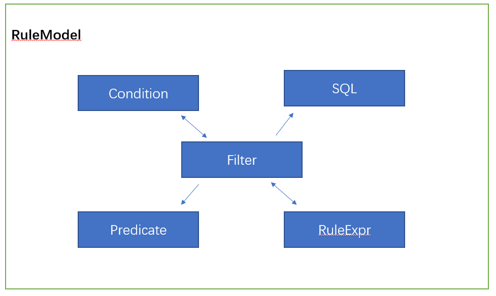
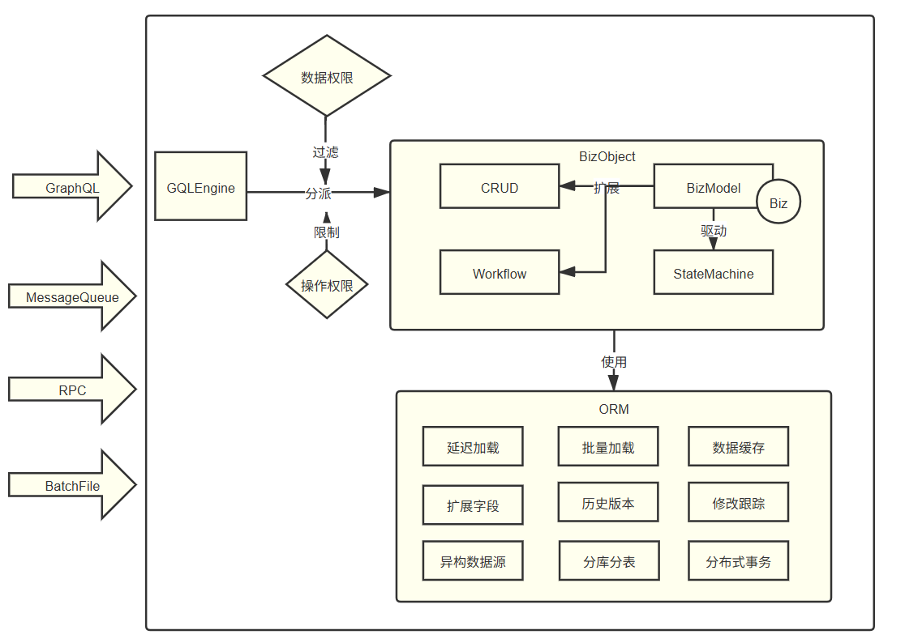
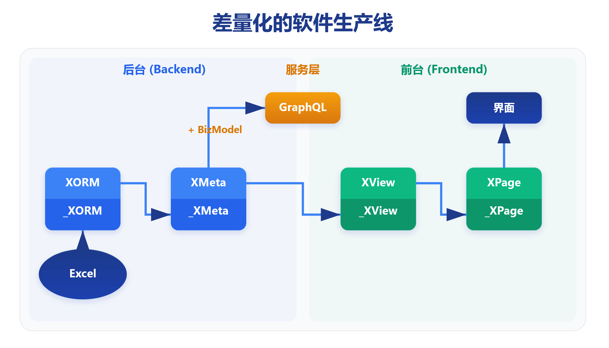
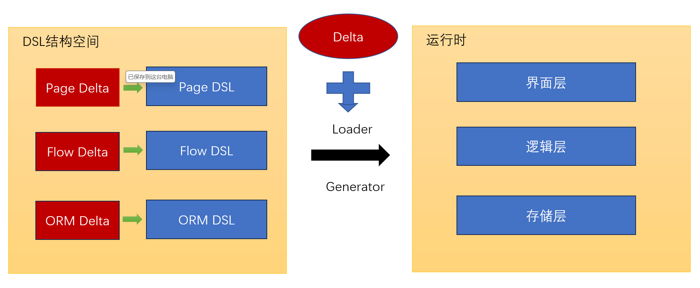
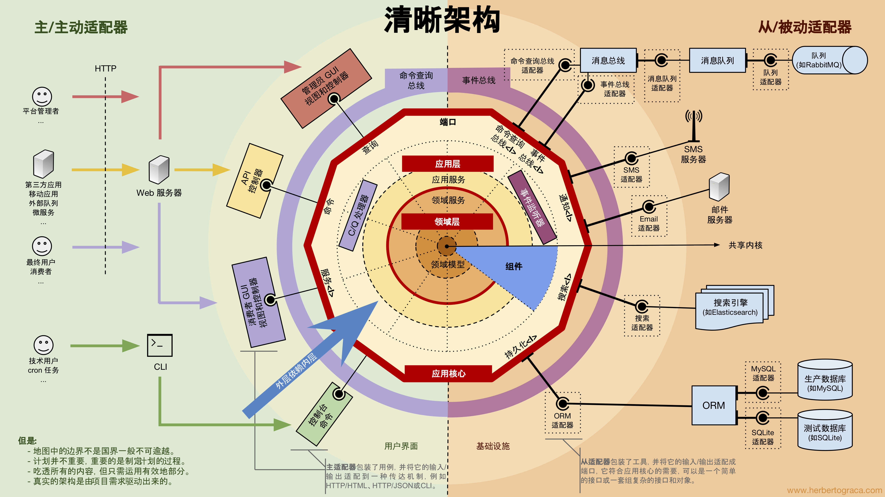

# DDD本质论：从哲学到数学，再到工程实践的完整指南之实践篇

## 引言：从理论到实践

在本文的上半部分[理论篇](https://mp.weixin.qq.com/s/xao9AKlOST0d97ztuU3z9Q)中，我们探讨了DDD的哲学背景和数学原理，并引入了（广义）可逆计算理论作为其技术内核。我们认识到，DDD的有效性在于它能够引导我们构建更贴近领域本质的计算模型，而可逆计算则为系统的构造与演化提供了数学基础。

理论的价值需要通过实践来验证。在本篇中，我们将关注这些理念的具体实现，重点介绍**Nop平台**如何将可逆计算理论应用于实际的DDD实践中。我们将看到，通过系统的工程化方法，DDD的战略与战术设计可以被有效地落实到了代码和架构中，从而降低实践门槛，提高系统的可维护性和演化能力。

> 文中的（广义）可逆计算理论（Generalized Reversible Computation）与物理学中的可逆计算机(Reversible Computing)概念并不相同，它并非指计算指令的逆向执行，而是对“可逆”概念在软件构造学层面的扩展性认知。参见[可逆计算：下一代软件构造理论](https://mp.weixin.qq.com/s/CwCQgYqQZxYmlZcfXEWlgA)， [广义可逆计算: 一个软件构造范式的正名与阐释](https://mp.weixin.qq.com/s/pNXPEvyVB7ljOhBQVh6c-A)

> Nop平台是（广义）可逆计算理论的开源参考实现。Nop是Nop is not Programming(非编程)的递归缩写。

## **第九章：DDD的工程闭环——Nop平台的可逆计算实践**

### 引言：从理论到可执行的工程体系

在前面的章节中，我们从哲学与数学的抽象高度，构建了一套关于软件设计与演化的认知框架。其核心，是围绕“空间”、“时间”、“坐标系”与“差量”这四大支柱建立的。然而，再宏大的理论，若不能转化为严谨、可执行、可治理的工程体系，终将沦为空中楼阁。

现在，我们必须回答最后一个，也是最关键的问题：**这套理论如何落地？**

Nop平台正是为回答此问题而生。它不是简单地提供一套DDD的辅助工具集，而是将DDD的战略与战术模式，彻底融入到“**可逆计算 + DSL图册 + 差量（Delta）**”这套统一的工程范式之中。其最终目的，是将DDD从依赖团队经验和个人悟性的“高手的艺术”，转变为一门可编排、可验证、可演化的“**工程科学**”。

### 9.1 战略设计制度化：边界先行，语言即坐标系

DDD的战略设计是其精髓所在，Nop平台通过一系列硬性的工程机制，确保了战略蓝图能够被精确、无损地映射到代码结构中。

#### 9.1.1 限界上下文的物理化：从`模块化目录`到`DSL图册`

在Nop平台中，一个**限界上下文（Bounded Context）** 不再是一个模糊的逻辑概念，它在工程上被精确地物理化为：

* 一个独立的**模块根目录**（如 `/nop/iam` 代表身份认证与访问管理上下文）。
* 在此目录内，包含了一套专属于该上下文的DSL组合，共同构成一个“**DSL图册（Atlas）**”。这套图册可能包括：
  * **数据模型**：`app.orm.xlsx` 或 `*.orm.xml`
  * **API与元数据模型**：`*.xmeta`
  * **视图模型**：`*.view.xml`
  * **规则模型**：`*.rule.xml`
  * **工作流模型**：`*.wf.xml`
  * ...等等

这些由统一的 `XDef` 元模型所约束的DSL，使得**统一语言（Ubiquitous Language）** 不再是漂浮在Wiki或会议纪要中的术语表，而是落地为一套可解析、可验证、可驱动代码生成的、活生生的**领域坐标系**。

> 所有这些DSL均可通过配置（无需编码）实现Excel格式与XML/JSON格式的自由双向转换。这使得许多模型可以直接采用业务人员熟悉的Excel格式进行表达，业务分析人员得以直接参与建模过程。由此产出的Excel文件，既是一份直观的需求文档，也是一个可被自动解析并驱动代码生成的精确模型，从根源上杜绝了文档与代码的脱节。

#### 9.1.2 上下文映射的工程化：`事件`、`服务`与`转换DSL`

在Nop平台中，限界上下文之间的协作机制被具体化为以下几类可执行的工程要素，并提供了统一的抽象接口：

* **异步事件通信**：跨上下文协作优先采用**领域事件**进行松耦合集成。平台为**单向信息收发**提供了统一的抽象接口 `IMessageService`，并内置了基于 `SysEvent` 表等机制的缺省实现，与数据库事务集成，确保事件的可靠发布。

```java
// 统一的单向消息抽象
interface IMessageService extends IMessageSender, IMessageReceiver {
    CompletionStage<Void> sendAsync(String topic, 
          Object message, MessageSendOptions options);
    IMessageSubscription subscribe(String topic, 
          IMessageConsumer listener, MessageSubscribeOptions options);
}
```

* **服务调用集成**：对于请求-响应的双向通信，平台通过 `IRpcService` 接口提供统一抽象。**NopRPC作为其核心实现，仅用约3000行代码，提供了类似Feign的强类型客户端调用体验**。它支持通过运行时反射或编译时代码生成来创建代理接口，将本地方法调用透明地映射为对远程 `IRpcService` 的调用。

```java
// 统一的双向RPC抽象
interface IRpcService {
    CompletionStage<ApiResponse<?>> callAsync(String serviceMethod, 
          ApiRequest<?> request, ICancelToken cancelToken);
}

// 标准化的响应封装，便于错误处理和跨协议适配
class ApiResponse<T> {
    Map<String, Object> headers;
    int status; // 用于适配命令行返回码
    String code;
    String msg;
    T data;
}
```

平台还提供了 `MessageRpcClient`/`MessageRpcServer` 等适配器，**实现了通信模式的灵活转换**：其核心机制是基于消息ID的请求-响应关联。客户端为每个请求生成唯一ID并发送至请求Topic，同时等待响应Topic上对应ID的返回结果；服务端订阅请求Topic，处理请求后将结果（或错误信息）与ID一同封装成响应消息，发送到响应Topic。

**同样，也可以利用 `IRpcService` 的能力，在双向的RPC信道上模拟出单向的`IMessageService` 接口**。这种双向的适配能力体现了通信抽象层的灵活性与对称性。

* **分布式事务协调**：对于需要强一致性的业务场景，平台通过 **`NopTcc`** 组件支持 **TCC（Try-Confirm-Cancel）** 和 **Saga** 模式的分布式事务。通过注解或XBiz模型中的tcc配置定义事务边界与补偿逻辑，协调跨多个服务的业务操作，确保最终一致性。    

* **反腐层(ACL)的DSL化与动态演化**：当需要进行模型转换时，**反腐层**不再散落于业务代码中。Nop平台推荐使用 **`Xpl` 模板语言** 或专用的**转换DSL**，在加载期或编译期完成模型翻译，确保运行时领域内核免受外部模型污染。
  
  * **强大的Record映射**：平台内置了专门的 **`record-mapping`** DSL，用于实现两个复杂对象之间的映射。它支持条件映射、多对一/一对多转换、字典翻译等高级特性，极大地简化了模型转换逻辑。
  * **多格式编解码与批量处理**：`record` 模型本身支持二进制和文本格式的编码与解析，可自动用于TCP消息、数据文件等的解析与生成。结合 **`NopBatch`** 模型，可以轻松实现多机器、多线程、分块（chunk）的并行数据处理，为高性能数据集成与ETL场景提供了强大支持。
  * **动态演化的反腐逻辑**：反腐层逻辑本身也可以通过 **Delta定制机制** 进行动态演进，确保集成逻辑能够适应外部系统的变化，而无需修改核心领域模型。

架构的腐化本质上源于系统被随机、偶然的需求不断侵蚀，导致系统熵增。**各种架构方法本质上都是在想办法阻止熵增，但物理学中的熵增定律却指出这是系统不可避免的宿命。但是如果我们换一个思路，即使无法完全阻止熵增，也可以尽力控制其发生的位置**。通过把随机的偶然性需求隔离到独立的Delta差量中，核心架构的整体规范得以与易变的需求解耦，从而获得长期的稳定，系统性地延缓腐化的进程。

#### 9.1.3 六边形架构的护栏：由`BizModel`和`XMeta`模型派生的描述式契约

在明确了上下文之间的协作机制后，我们转向上下文内部的架构治理。Nop平台的核心设计原则是**最小化信息表达**：即业务描述只包含领域核心概念（What），而延迟或省略具体的技术实现细节（How）。这种描述式表达天然具备了**框架中立性**（与任何特定运行时无关），为实现六边形架构提供了理想的工程基础。

* **技术中立的端口定义**：上下文对外提供的服务**端口**，在代码中表现为基于`@BizModel`的普通Java类（或等价的XBiz DSL模型）。其上的`@BizMutation`/`@BizQuery`等注解仅声明业务语义，**不包含任何HTTP路径、HTTP方法等特定协议信息**，从根源上确保了领域模型的纯洁性与多协议（如GraphQL, gRPC）适配潜力。

* **契约由模型唯一派生**：端口的完整契约由**XMeta模型**作为单一真相源(SSOT)唯一派生。该模型以纯描述方式定义了数据结构、校验规则与权限，并自动生成：
  
  * GraphQL Schema与OpenAPI文档
  * 运行时入参校验逻辑
  * 前端页面骨架与表单规则
    这确保了从模型到多种契约形式的**同源一致性**。

* **通过`Delta`差量补充实现细节**：基于可逆计算理论，平台允许通过`Delta`机制**非侵入式地补充**特定协议所需的细节。例如，在XMeta中可通过`rest:path`扩展属性定制URL路径。这些补充信息是**可选的、局部的**，实现了最小化表达与充分定制的统一。

* **适配器的可配置替换**：所有与外部基础设施（数据库、消息队列等）的交互，都通过**适配器(Adapter/Driver)** 完成。这些适配器是框架依赖的集中地，可以通过Nop的IoC容器，在 `_delta` 目录下通过配置**无需修改核心代码**即可替换。这从架构层面确保了领域内核与外部技术实现的隔离。

**理论闭环：从最小化表达到框架中立**

Nop平台的DSL模型是针对业务信息的最小化描述式表达，它捕捉了最稳定、最本质的业务结构，成为在不同技术框架间实现自由转换的**标准中间表示**。

> **最小化信息表达的内在逻辑**：它意味着只描述目标（What），而省略执行细节（How）。如果多个框架都实现了真正的最小化表达，其信息内容必然趋向唯一性。这种唯一性保证了不同框架表达形式之间必然存在**可逆的等价变换**。通过在架构中插入形式变换层，并结合最小化表达原则，自然实现了框架中立的效果。

这种纯粹基于POJO的、最小化的信息表达，带来了一个直接的工程优势：Nop平台的API服务函数总是可以进行纯粹的单元测试。 因为它的入口参数和返回对象就是普通的Java对象，测试时无需模拟复杂的Web容器或框架上下文，只需简单地构造POJO入参并验证POJO返回值即可，这极大地降低了测试成本，并反向印证了其架构的纯洁性与框架中立性。

### 9.2 战术设计平台化：内建的模式与涌现的健壮性

Nop平台将DDD繁杂的战术模式内化为平台的标准能力，让开发者无需刻意为之，便能自然地遵循最佳实践。

#### 9.2.1 聚合、实体与值对象：由`NopORM`和`XMeta`统一承载

Nop平台通过`NopORM`引擎和`XMeta`元数据模型，为DDD的战术建模提供了统一、高效且贴合领域的设计承载。其实现方式在保留模式核心价值的同时，规避了传统ORM（如JPA）的某些僵化设计，体现了可逆计算理论指导下的“渐进式”与“差量化”思想。

* **实体（Entity）的生成与扩展：Generation Gap模式**
  Nop平台中的实体直接根据ORM模型生成，并采用经典的**Generation Gap模式**。每个实体会生成两个部分：一个由工具维护的基类（如`_NopAuthUser`）和一个可供开发者自由扩展的子类（如`NopAuthUser`）。这种模式完美分离了**机械性代码**与**业务性代码**，确保了在模型变更后重新生成代码时，开发者手工添加的业务方法得以安全保留。由于`NopORM`的实体已天然支持一对一、一对多关联，能够直接映射出丰富的对象图，因此在很多场景下，实体本身就能自然地承担聚合根的职责，无需刻意引入额外的抽象层次。领域逻辑可以直接在以实体为核心的关联图上运作，开发者仅需在实体上增加辅助性的领域方法（如`order.calculateTotalAmount()`）即可。

* **关联关系的务实处理：对“多对多”的重新审视**
  `NopORM`在设计上有意**不内置支持多对多关联**，这一决策源于对关系数据库本质的洞察——数据库本身并不直接支持多对多，而是通过中间表实现。NopORM鼓励开发者显式地定义中间实体（如`OrderLine`），从而在模型上保留了最大的灵活性与可扩展性。同时，为了在领域层提供便利，平台支持在代码生成时通过标记，**自动在实体上生成模拟多对多关联的辅助方法**。例如，`order.getProducts()`方法内部可以通过访问`order.getOrderLines()`集合，并进一步获取每个`OrderLine`上的`Product`关联对象来组合返回。这使开发者可以在领域层以自然的面向对象方式编程，同时在持久层保持关系的精确映射与控制。

* **内置差量的实体：`OrmEntity`与状态跟踪**
  与JPA的透明延迟加载与隐式脏检查不同，`NopORM`提供了一个主动的`OrmEntity`实现基类。该基类通过`dirtyProps`集合精确跟踪所有发生变更的属性，并自动记录修改前后的值。这意味着**每个`OrmEntity`实例都内置了对自身状态变化的“差量”表示**。这一机制带来了两大核心优势：
  
  1. **高性能的差量更新**：在保存实体时，`NopORM`可以仅生成并执行针对变更字段的SQL，而非更新整个对象。
  2. **安全的领域数据合并**：通过`OrmEntityCopier`工具，可以将前端传递的复杂JSON数据（可视为一个数据差量`Δ`）安全、高效地合并到当前聚合根对象上，实现类似`聚合根.merge(Δ)`的效果，这对于处理并发更新和命令合并至关重要。

* **值对象（Value Object）的本质与实现：`OrmComponent`**
  值对象的本质并非仅仅在于其不可变性，更在于它**封装了一组具有内聚性的业务规则和不变式**。NopORM通过`IOrmComponent`接口来实现这种封装，其角色类似于JPA中的`@Embeddable`组件。然而，Nop的设计哲学是**渐进式和视图化的**，这与JPA“非此即彼”的刚性选择形成了鲜明对比：
  
  * **JPA的刚性**：一个字段要么是原生字段，要么被封装在Component中，二者择一。
  * **NopORM的柔性**：**永远为每个数据库字段生成原生的get/set方法**，保证最基础的访问能力。同时，`OrmComponent`被设计为建立在实体字段之上的一种**可计算的、非侵入式的“视图”**。
  
  这种“视图”模型带来了前所未有的灵活性：
  
  1. **一个字段可被多个Component复用**：例如，一个`经纬度`字段既可以属于`地理位置`Component，也可以属于`区域边界`Component。
  2. **对空值的稳健处理**：当一个Component由多个字段组成时，其中某个字段的值为`null`**不会导致整个Component对象为`null`**。Component始终存在，其内部方法可以稳健地处理部分数据缺失的情况，这避免了JPA中可能遇到的空指针陷阱。
  3. **显式的生命周期控制**：`IOrmComponent`接口定义了`flushToEntity`、`reset`等方法，使得Component与所属实体之间的数据同步时机变得可控和明确，尤其适合处理复杂的派生逻辑和临时计算状态。
  
  因此，在NopORM中，值对象更多地被视为一个**领域规则的携带者**和**数据的一致性视图**，而非简单的数据容器。其不可变性并非强制要求，而是根据其所封装的不变式的需要来决定的。

* **实体模型的动态扩展：内置的扩展字段机制**
  为了应对业务模型频繁变更、避免频繁修改数据库表的现实挑战，Nop平台在`NopORM`中内置了一套完善的**扩展字段（Ext Fields）** 机制。只需在Excel数据模型中为实体打上`use-ext-field`标签，即可无需修改DDL，动态地为实体增加任意数量的扩展字段。这些字段统一存储在专用的扩展表中（如`nop_sys_ext_field`），并通过ORM引擎在**实体对象层面提供与原生字段无异的访问体验**。无论是Java代码、EQL查询还是GraphQL接口，扩展字段都可以像普通字段一样被使用、筛选和排序。这套机制为解决产品化软件的需求定制化冲突提供了标准化的解决方案。

* **从端口到实体的无缝数据流转与验证**
  Nop平台构建了一个从外部端口到内部领域实体的、基于元数据的自动化数据管道。其核心在于多层次、可定制的元模型体系：
  
  1. **ORM模型 (`EntityModel`)**：`OrmEntity`可直接获取其`EntityModel`，该模型包含了ORM层面的完整反射信息，是支撑多租户、逻辑删除、字段加密等**持久化关切**的元数据基础。
  2. **XMeta模型**：面向外部端口（如GraphQL、RPC）的**数据契约与验证规则**则由`XMeta`元数据模型定义。`XMeta`可自动从ORM实体模型生成（如生成`_NopAuthUser.xmeta`），并同样遵循**Generation Gap模式**——开发者可在无下划线的`NopAuthUser.xmeta`文件中进行定制，覆盖或扩展自动生成的规则。
  3. **端到端的数据处理**：前台传入的数据首先通过基于`XMeta`的`ObjMetaBasedValidator`进行校验与转换。`XMeta`中的`mapToProp`、`getter`、`setter`等配置，使得**前后端属性名映射**、**数据格式转换**、**复杂逻辑计算**等需求得以声明式地实现。校验和转换后得到的`validatedData`，最终通过高效的`OrmEntityCopier`工具合并到领域实体对象上。这套机制确保了数据在穿越系统边界时的**安全性、正确性和语义一致性**，同时将开发从繁琐的数据胶水代码中解放出来。

* **领域驱动的不变式抽象：`domain` 与元编程**
  Nop平台进一步深化了“领域驱动”的理念，在字段级别引入了 **数据域（domain）** 的概念，这类似于PowerDesigner中的Domain，是对字段级别业务语义和不变式的抽象。例如，可以为字段指定 `currency`（货币）、`createTime`（创建时间）等 domain。
  
  这一简单的配置在平台中触发了广泛的**语义级联**效应，是Nop“假设很少、机制通用”设计哲学的完美体现：
  
  1. **持久化行为**：标记为 `createTime` 的字段，在实体保存时会**自动**被设置为当前时间，无需手动编码。
  2. **前端控件绑定**：`control.xlib` 等前端标签库会自动识别 domain 配置，并查找对应的专用控件（如 `<editor-currency>`），实现**领域语义到UI实现的自动映射**。
  3. **接口模型生成**：更为强大的是，通过 `meta-prop.xlib` 中定义的元编程规则，domain 可以**动态生成或修正 XMeta 中的属性定义**。例如，对于一个标记为逗号分隔列表的 domain，平台会自动应用转换规则，在接口层面将 `String` 类型转换为 `List<String>`，并自动注入序列化（`transformOut`）与反序列化（`transformIn`）逻辑。

```xml
<!-- 元编程规则示例：为csv-list域动态生成List<String>类型的schema和转换逻辑 -->
<domain-csv-list outputMode="node">
  <attr name="propNode"/>
  <source>
      <prop name="${propNode.getAttr('name')}">
          <schema type="List<String>"/>
          <transformIn>return value?.$toCsvListString();</transformIn>
          <transformOut>return value?.$toCsvList();</transformOut>
      </prop>
  </source>
</domain-csv-list>
```

  这些规则的引入并非平台硬编码，而是通过 XMeta 文件中的 `x:post-extends` 元编程段，调用如 `<meta-gen:GenPropFromDomain/>` 这样的**通用元编程指令**来动态实现的。**Nop平台内置的假设非常少，大量功能和规则正是通过 `x:gen-extends` 和 `x:post-extends` 这些通用的、可逆的元编程机制，按需引入和组合而成的。** 这使得平台内核保持极致简洁的同时，具备了近乎无限的语义扩展能力。

### 9.2.2 服务与仓储的透明化：NopTaskFlow流程编排与通用`EntityDao`

Nop平台将DDD繁杂的战术模式内化为平台的标准能力，其中仓储(Repository)和服务(Service)的透明化设计尤为突出。通过统一的`IEntityDao`接口、强大的`QueryBean`查询能力和`NopTaskFlow`逻辑编排引擎，开发者无需刻意为之，便能自然地遵循最佳实践。

#### 统一的仓储抽象：完备的`IEntityDao`接口

在NopORM中，仓储被彻底透明化。通过统一的`DaoProvider`，开发者可以获取到强类型的`IEntityDao<T>`接口（如`IEntityDao<NopAuthUser>`）。虽然每个实体都有对应的Dao接口，但在业务编码时通常**只使用聚合根的Dao接口**，这自然强化了DDD的聚合边界概念。

`IEntityDao`提供了非常完备的CRUD操作集，**无需再从中派生自定义仓储**：

```java
// 根据等于条件查询
User example = new User();
example.setStatus(10);
IEntityDao<User> dao = daoProvider.daoFor(User.class);
List<User> userList = dao.findAllByExample(example);
List<User> pageList = dao.findPageByExample(example, List.of(orderBy(PROP_NAME_status,true)), 0,100);
User user = dao.findFirstByExample(example);
long count = dao.countByExample(example);
dao.saveEntity(newEntity);
```

#### 强大的`QueryBean`：复杂查询的标准化封装

`QueryBean`提供了丰富的查询条件封装，支持从简单到复杂的各种查询场景：

**1. 复杂条件查询**

```java
// 类似MyBatisPlus的LambdaQueryWrapper
QueryBean query = new QueryBean();
query.addFilter(eq(PROP_NAME_username, "张三"))
    .addFilter(and(
        or(
            between(PROP_NAME_age, 18, 30),
            eq(PROP_NAME_gender, 1)
        )))
    .addOrderField(PROP_NAME_createTime, true)
    .offset(100)
    .limit(20);

List<User> userList = dao.findPageByQuery(query);
User user = dao.findFirstByQuery(query);
```

**2. 嵌入子查询**

```java
query.addFilter(SQL.begin("o.id in (select y.xx from tbl y where y.id=?)", 3).end().asFilter());
```

**3. 自动联表查询**

```java
// 复合属性自动展开为关联查询
query.addFilter(eq("product.productType.name", "abc"));
```

**4. 统一的Filter模型**


Filter提供了一种标准的复杂判断条件表达形式，可以在多种场景下复用：

- Java代码中通过`FilterBeans`工具类构建
- XML/Xpl模板中使用`<eq name="status" value="1" />`语法
- 自动转换为SQL语句或Java Predicate
- 前端通过Condition控件进行可视化编辑
- 在规则引擎、数据权限等场景统一使用

#### 统一的SQL管理：超越MyBatis的sql-lib机制

利用Nop平台内置的基础设施，通过不到1000行代码就可以实现sql-lib模型，它负责统一管理所有复杂的SQL/EQL/DQL语句，提供了比MyBatis更强大的能力：

> DQL是报表厂商润乾发明的一种面向OLAP的多维数据查询语言，让业务人员能够用简单的语法实现复杂的跨表数据分析。参见 [告别宽表，用 DQL 成就新一代 BI - 乾学院](http://c.raqsoft.com.cn/article/1653901344139?p=1&m=0)

**1. 统一管理多种查询语言**

```xml
<sql-lib>
  <sqls>
    <sql name="nativeSql">...</sql>
    <eql name="entityQuery">...</eql>
    <query name="dqlQuery">...</query>
  </sqls>
</sql-lib>
```

**2. Delta定制支持**
无需修改基础产品代码，通过差量化文件即可定制SQL语句：

```xml
<sql-lib x:extends="super">
  <sqls>
    <eql name="yyy">...</eql> <!-- 覆盖基础定义 -->
  </sqls>
</sql-lib>
```

**3. 强大的XPL模板语言**
相比MyBatis有限的标签，XPL提供完整的编程能力和标签抽象：

```xml
<sql name="complexQuery">
  <source>
    select <my:CustomFields/>
    from MyEntity o
    where <my:AuthFilter/>
    <c:if test="${!_.isEmpty(status)}">
      and o.status = ${status}
    </c:if>
  </source>
</sql>
```

**4. 宏标签元编程**
通过编译期宏变换简化SQL编写：

```xml
<sql:filter>and o.classId = :myVar</sql:filter>
<!-- 编译期展开为 -->
<c:if test="${!_.isEmpty(myVar)}">
  and o.classId = ${myVar}
</c:if>
```

**5. 安全的SQL输出模式**
自动防SQL注入，智能参数处理：

```sql
id in (${ids}) <!-- 自动展开为 id in (?,?,?) -->
name = ${name}  <!-- 自动参数化 -->
```

**6. 强类型Mapper接口**

```java
@SqlLibMapper("/app/mall/sql/LitemallGoods.sql-lib.xml")
public interface LitemallGoodsMapper {
    void syncCartProduct(@Name("product") LitemallGoodsProduct product);
}
```

#### 服务逻辑编排：NopTaskFlow的细粒度流程控制

NopTaskFlow是Nop平台内置的逻辑编排引擎，它采用**最小化信息表达**的设计原则，可以同时支持重量级的分布式服务编排，也可以支持轻量级的服务内函数级别的细粒度逻辑编排。

**与微服务编排引擎的对比优势**：

* **本地函数直接调用**：无需REST调用序列化开销，支持复杂的领域对象引用传递
* **本地环境集成**：支持在同一个数据库事务或OrmSession中执行多个步骤
* **轻量级运行**：可以无第三方依赖、无持久化的轻量级形态运行
* **异步与状态恢复**：内置支持异步处理、超时重试、断点重提等高级功能

**服务函数与TaskFlow的无缝集成**：

在xbiz模型中，可以通过极简配置将服务函数委托给TaskFlow执行：

```xml
<biz x:extends="/nop/biz/lib/common.xbiz">
  <actions>
    <mutation name="callTask" task:name="test/DemoTask"/>
  </actions>
</biz>
```

通过编译期元编程机制，平台自动根据TaskFlow模型推导出服务函数的输入输出参数类型和具体实现代码，实现**响应式推导**：当TaskFlow模型修改时，依赖它的服务函数定义会自动更新。

**TaskFlow示例：订单打折规则**

```yaml
version: 1
steps:
  - type: xpl
    name: book_discount_1
    when: "order.getOriginalPrice() < 100"
    source: |
      order.setRealPrice(order.getOriginalPrice());
      logInfo("没有优惠");
  - type: xpl
    name: book_discount_4
    when: "order.getOriginalPrice() >= 300"
    source: |
      order.setRealPrice(order.getOriginalPrice() - 100);
      logInfo("优惠100元");
  - type: xpl
    name: book_discount_2
    when: "order.getOriginalPrice() >= 100 && order.getOriginalPrice() < 200"
    source: |
      order.setRealPrice(order.getOriginalPrice() - 20);
      logInfo("优惠20元");
outputs:
  - name: realPrice
    source: order.realPrice
```

#### 规则引擎集成：NopRule的专业决策处理


对于复杂的业务规则，Nop平台还提供了专门的规则引擎NopRule，它与TaskFlow可以无缝集成：

```xml
<steps>
  <xpl name="calcDiscount">
    <source>
      <rule:Execute ruleModelPath="/nop/demo/rule/discount.rule.xlsx"
                    inputs="${{order}}" xpl:return="outputs"/>
      <c:script>
        order.setRealPrice(order.originalPrice - outputs.discount);
      </c:script>
    </source>
  </xpl>
</steps>
```

NopRule支持决策表和决策树，可以通过Excel进行可视化配置(也可以在线编辑)，特别适合复杂的业务规则管理。

#### 服务层的清晰分工

通过上述组件的协同工作，Nop平台实现了服务层的清晰分工：

* **仓储层**：由`IEntityDao`统一抽象，提供强大的数据访问能力
* **领域逻辑**：复杂的业务规则由`NopRule`处理，流程编排由`NopTaskFlow`管理
* **应用服务**：由`XBiz`模型承载，负责用例编排和事务管理
* **查询抽象**：通过`QueryBean`和sql-lib统一管理所有数据查询
* **CRUD自动化**：平台自动处理模板化的CRUD操作，开发者专注业务逻辑

### 9.2.3 事件驱动的自然涌现：平台化的全域可观测性与声明式事件编织

事件驱动是DDD的灵魂，但传统实现往往依赖于开发者在代码中手动发布事件，这种“刻意为之”的方式容易造成遗漏，并让领域代码混杂着技术关注点。Nop平台则走了另一条路：它通过**全域模型定义**和**统一的差量语法**，将系统打造成一个“**天然可观测**”的有机体，使得事件监听与触发成为一种可以**在任意层面、以声明方式无缝编织**的副作用，从而让事件驱动架构自然地从平台中“**涌现**”。

#### **跨上下文事件：可靠的事件总线与`Outbox`模式**

对于限界上下文之间的松耦合集成，平台提供了标准化的异步事件通信抽象 `IMessageService`，并内置了基于 **`SysEvent`** 表等机制的缺省实现 **`SysDaoMessageService`**。该实现与数据库事务紧密集成，确保领域事件的发布与业务操作在**同一个数据库事务中原子提交**，为最终一致性提供了可靠的工程基础。

#### **全域可观测性：标准化的事件触发坐标系**

Nop平台作为一个彻底的模型驱动架构，在系统的**每一个层面**都定义了具有明确生命周期的DSL模型。这些模型天然标准化了事件的触发时机，为声明式的事件监听提供了统一的“**观测点坐标系**”：

* **服务层观测点**：在承载应用服务的 **`XBiz`** 模型中，开发者可以通过 `observe` 段，声明式地配置在服务函数执行前、后触发的监听器。这些监听器可以响应全局EventBus上的事件，实现与业务逻辑解耦的横切关注点。
  
  ```xml
  <!-- 在XBiz模型中声明式监听：当执行指定BizModel的action时触发 -->
  <observe from="MyBizObj" event="createOrder">
  <source>
      <!-- 在这里编写Xpl模板脚本，响应事件，例如发送通知、记录审计日志 -->
  </source>
  </observe>
  ```

* **持久层观测点**：`NopORM` 引擎通过 **`IOrmInterceptor`** 接口，提供了实体级别的、粒度极细的生命周期事件（如 `pre-save`, `post-save`, `pre-update`, `post-delete`）。更重要的是，平台通过 **`XplOrmInterceptorFactoryBean`** 机制，允许开发者在不编写Java代码的情况下，仅通过配置 `/_moduleId/orm/app.orm-interceptor.xml` 文件，即可使用Xpl模板语言为特定实体定义“**数据库触发器**”式的拦截逻辑。
  
  ```xml
  <interceptor>
  <entity name="io.nop.auth.dao.entity.NopAuthUser">
      <post-save id="syncToEs">
          <!-- 声明式实现：用户实体保存后，自动同步至Elasticsearch -->
      </post-save>
  </entity>
  </interceptor>
  ```

* **流程层观测点**：当业务逻辑通过 **`NopTaskFlow`** 流程引擎进行精细编排时，事件机制变得更加灵活。开发者既可以在流程的任意步骤中直接插入用于触发事件的**观测步骤**，也可以利用Step的 **`decorator`** 机制（其作用类似于Java注解），以非侵入式的方式为步骤附加事件触发的副作用逻辑。

#### **声明式事件编织：基于`差量`的元编程注入**

Nop平台事件驱动能力的最高级体现，在于其**统一的差量化定制能力**。所有DSL模型都遵循XLang差量语法，支持通过 `x:gen-extends` 和 `x:post-extends` 进行元编程扩展。这意味着，**事件监听逻辑本身可以不作为基础模型的一部分，而是通过`Delta`差量文件，在后续的定制阶段“注入”到已有的模型中**。

例如，对于一个标准的产品模块，其基础模型可能并未包含审计日志功能。但在为特定客户部署时，我们可以通过一个 `_delta` 定制文件，向关键的服务方法或实体持久化操作中，“打入一个差量”，声明式地加入审计事件的触发逻辑。**这种方式实现了事件关注点的完全解耦和按需组合，使得系统的可观测性成为了一种可动态演化的特性，而非一成不变的静态设计。**

**理论闭环：从“刻意设计”到“自然涌现”**

在Nop平台中，事件驱动不再仅仅是DDD中的一个战术模式，而是上升为一种贯穿全域的**系统第一性原理**。通过：

1. **标准化的观测点**（各层模型的生命周期），
2. **统一的监听机制**（Observe段、OrmInterceptor、TaskFlow Decorator），
3. **差量化的编织能力**（元编程注入），

事件监听成了一种可以**事后声明、精准定位、非侵入式附加**的“插件化”能力。开发者无需修改核心业务逻辑，就能让系统“长出”事件驱动的神经末梢。这正是可逆计算理论在架构层面的深刻体现：通过差量（Δ）来为已生成的基础系统（F(X)）叠加新的行为（⊕），最终让复杂的事件响应能力从平台中自然**涌现**。

### 9.2.4 查询与读模型：`GraphQL`与`DataLoader`的自动化

在传统的API设计中，长期存在一个设计困境：是设计复杂的接口导致"过取"（over-fetching），还是设计多个简单接口引发"欠取"（under-fetching）和多次网络请求？

#### GraphQL作为可组合的信息代数系统

NopGraphQL对GraphQL进行了**根本性的重新诠释**，将其从单纯的API协议升格为**通用的信息分解、组合与派发引擎**。

> **GraphQL 本质上是在 REST 基础上引入了一个标准化的、可组合的 `@selection` 参数**。

例如：

```graphql
query {
  NopAuthDept__findAll {
    name, status, children { name, status }
  }
}
```

等价于：

```
/r/NopAuthDept__findAll?@selection=name,status,children{name,status}
```

这意味着GraphQL是REST的**自然超集**：当不传`@selection`时系统退化为传统REST行为，在数学上证明**REST是GraphQL在全选模式下的特例**。

#### 两阶段执行模型：内置的读写关注点分离

NopGraphQL采用**两阶段执行模型**，自然地实现了读写操作的架构分离，这与CQRS模式的思想相契合：

1. **阶段一：核心业务执行（事务内）**
   
   - 对于`@BizMutation`，自动开启并提交数据库事务
   - 执行主服务函数完成状态变更
   - **事务立即提交**，最短时间释放数据库连接

2. **阶段二：结果加工（只读）**
   
   - 根据客户端`FieldSelection`按需调用`@BizLoader`
   - ORM Session强制**只读模式**，防止状态污染
   - 执行字段级权限校验和数据脱敏

**CQRS关联**：通过`@BizLoader`和`XMeta`模型，系统能够定义**专门服务于查询场景的数据结构和加载逻辑**，这与主要关注状态变更和业务规则的写模型形成了自然的职责分离。读取侧可以自由地组合跨聚合的数据、定义计算字段、应用性能优化策略，而无需受限于写模型的事务边界和函数形式边界。

#### DataLoader自动化：解决N+1查询问题

通过`@BizLoader`机制实现知识的正交分解：

```java
// 核心查询
@BizQuery
public NopAuthUser getUser(@Name("id") String id) {
    return userDao.findById(id);
}

// 关联加载器
@BizLoader
public List<String> roles(@ContextSource NopAuthUser user) {
    return roleDao.findRolesByUserId(user.getId());
}
```

当客户端查询`{ user(id:"123") { id, name, roles } }`时，引擎自动：

1. 调用`getUser`获取核心对象
2. 发现`roles`字段需求，匹配`roles`加载器
3. 通过DataLoader机制合并批量查询，**根源解决N+1问题**

#### 性能优化：信息提前使用与执行剪裁

在阶段一通过判断字段选择避免不必要计算：

```java
@BizQuery
public Order getOrder(@Name("id") String id, FieldSelection selection) {
    Order order = orderDao.getById(id);

    // 仅当客户端需要时才执行昂贵计算
    if (selection.hasField("salesAnalysis")) {
        order.setSalesAnalysis(analysisService.calculateAnalysis(order));
    }

    return order;
}
```

#### 聚合根与GraphQL的对偶统一

Nop平台重新诠释了聚合根的内涵：

- **聚合根是信息的构造操作**：构建统一、高内聚的"概念地图"
- **GraphQL是信息的解构操作**：通过`FieldSelection`动态裁剪所需数据

这种"聚合"与"选择"的对偶统一，既保证模型的表达力，又确保运行时的高效性，使得前后端可以通过清晰契约各自演进。

#### 安全保障：字段级权限控制

- **字段级安全**内建于`XMeta`模型
- 字段级ACL与数据脱敏策略在查询计划生成阶段完成权限预裁剪
- 从根源上杜绝越权访问和侧信道信息泄漏

#### 理论价值

NopGraphQL的创新在于**将API从"端点集合"提升为"可组合的信息代数系统"**。业务逻辑编写一次，即可通过引擎自动适配为GraphQL、REST、gRPC等多种协议，构建真正的**活的信息空间**。

### 9.2.5 终结顽疾：从根源上解决`N+1`与`数据库死锁`

传统DDD实践中，因面向对象的导航式查询与数据库事务机制间的固有矛盾，常引发`N+1查询`与`数据库死锁`两大性能与并发顽疾。Nop平台通过其`NopORM`引擎的系统性设计，对这些问题进行了针对性的缓解与规避。

* **告别N+1：声明式的批量加载**
  `IEntityDao`提供的`batchLoadProps`函数，允许开发者在获取实体列表后，通过一次批量查询预先加载所有需要的关联属性。开发者只需一个简单的声明，即可解决N+1问题，而无需破坏聚合的封装性。

```java
List<MyEntity> list = dao.findAll();
// 通过一次批量查询，预先加载多级关联属性
dao.batchLoadProps(list, Arrays.asList("parent", "children", "parent.parent"));
```

  其内部实现机制类似于GraphQL的`DataLoader`，但针对ORM实体的关联图特性进行了深度优化。与JPA的困境相比——即使用实体导航最为自然，但遇性能瓶颈时必须侵入性地改写业务代码——NopORM的这种**描述式批量加载**提供了一条**与业务逻辑解耦的性能优化路径**。

  此机制也拓宽了聚合根的适用场景。针对批处理等需要加载大量数据的场景，开发者无需放弃面向对象的编程模式。只需在每个处理批次(chunk)加载后执行一次`batchLoad`，即可高效组装完整的对象图。更重要的是，在如`NopGraphQL`、`SqlManager`等上层框架中，可以根据客户端的字段选择(Field Selection)自动分析并执行批量加载，实现对开发者**透明无感的性能优化**。

* **系统性地避免死锁：全局排序的写操作**
  NopORM废弃了JPA易引发混乱的`auto-flush`模式。`dao.save(entity)`等写操作仅将实体状态注册到当前的`OrmSession`中，并不立即生成SQL。所有真正的数据库写操作被延迟到事务提交前，在一次统一的`flush`操作中执行。
  
  在此过程中，NopORM会**根据表依赖关系和实体主键，对所有待执行的INSERT、UPDATE、DELETE操作进行全局排序**。这一机制确保了在任何并发场景下，多个事务对数据库锁的获取顺序都是**确定且一致**的，从而从系统层面极大地降低了死锁发生的概率。死锁这一棘手的并发问题，不再仅仅依赖开发者遵循脆弱的最佳实践去规避，而是通过架构设计被很大程度上"**设计掉**"了。

#### 补充：作为LoadingCache的OrmSession

从本质上讲，`OrmSession`可以视为一个专为ORM设计的`LoadingCache`。当通过对象导航访问关联数据时，如果目标实体尚未加载，Session会自动调用相应的`Persister`从数据库加载。利用NopORM，我们可以实现**数据源的无感知性**：开发者可以手动将通过任何方式（如远程API调用、消息队列、文件解析等）获取的实体对象，通过`attach`方法"注入"到Session中。一旦被Session管理，这些对象便与从数据库加载的实体无异，所有基于对象导航的关联访问、状态跟踪及持久化机制都能正常工作。这确保了**当数据来源发生变化时，核心领域模型代码无需任何修改**，真正实现了数据源无关的领域编程。

```java
interface IOrmSession{
    // ...

    /**
     * 将session外的实体与session绑定
     *
     * @param entity
     */
    void attach(IOrmEntity entity, boolean cascade);

    /**
     * 假定所有数据都在内存中，直接从session中查找集合元素，并将其组装为集合对象
     *
     * @param collectionName
     */
    void assembleAllCollectionInMemory(String collectionName);

    void assembleCollectionInMemory(Collection<? extends IOrmEntity> coll);
}
```

### **架构全景：统一的技术内核与平台化能力**

通过前文的详细剖析，我们看到Nop平台如何将DDD的战术模式内化为平台的标准能力。下图全景式地展示了这些能力如何围绕统一的技术内核协同工作，形成完整的战术设计支撑体系：



该架构体现了以下核心设计理念：

* **领域模型为中心**：`BizObject`和`ORM`构成统一的领域对象模型，承载核心业务逻辑
* **多引擎平台化集成**：
  - `GraphQL`引擎提供灵活的查询能力，自动优化N+1问题
  - `Workflow`和`StateMachine`引擎驱动复杂业务流程
  - `BizModel`通过"分派-扩展"机制实现业务逻辑的有机组合
* **透明的数据访问增强**：`ORM`层内置延迟加载、批量加载、扩展字段、分布式事务等企业级特性
* **正交的安全架构**：数据权限和操作权限作为独立关注点，通过标准接口注入业务流程
* **多样化的集成支持**：原生支持`MessageQueue`、`RPC`、`BatchFile`等集成模式

这种设计使得开发者无需刻意遵循DDD模式，便能自然地获得健壮、可演化的系统架构——这正是"涌现的健壮性"的工程体现。

## 9.3 演化可编程：可逆计算的“三位一体”范式

可逆计算通过统一的`Y = F(X) ⊕ Δ`范式，为DDD模型的落地和长期演化提供了坚实的数学和工程基础。

### 9.3.1 统一的演化公式：`有效模型 = Generator<基础模型> ⊕ Δ(差量)`

在Nop平台中，任何模型的构造都遵循此公式。无论是数据模型、UI模型还是流程模型，其最终的有效形态，都是由一个基础模型（通常由上游模型**生成**而来）和一个或多个**Delta差量**包叠加而成。

**深刻的数学洞察：全量即差量**

这一设计背后蕴含着深刻的数学原理：**全量只是差量的一个特例**（`A = 0 + A`）。在任何一个存在单位元的系统中，全量都等价于"单位元 + 自身"。例如，在软件构造中，"什么都不做"的空操作就是单位元，任何操作都可以视为在空操作基础上的一个差量。这一看似简单的认知转变，实则是从"动作思维"向"名词思维"的范式转换，是将**差量作为第一性概念**的关键突破。它使得"从零构建"和"定制修改"在数学上被彻底统一，为软件演化提供了前所未有的灵活性。

#### **同构设计的工程价值**

这一原理的直接工程体现是**同构设计**：差量的表达形式与全量完全一致，无需为差量专门设计特殊格式。对比JSON Patch与Nop平台的实现：

```json
// JSON Patch（异构设计，专门格式）
[
  {"op": "add", "path": "/columns/-", "value": {"name": "newColumn"}},
  {"op": "remove", "path": "/columns/2"}
]

// Nop平台（同构设计，统一格式）
{
  "columns": [
    {"name": "newColumn", "type": "string"},
    {"name": "column2", "x:override": "remove"}
  ]
}
```

JSON Patch使用完全不同的语法结构，且依赖不稳定的数组下标；而Nop平台的差量保持与全量相同的结构，仅通过`x:override`等少量扩展属性来表达变更意图，通过稳定的语义标识（如name）来定位元素。这种同构设计贯穿整个平台：从前台提交的修改数据、到后台数据库的变更记录，全部采用统一的差量表达。

**突破性的认知：差量的作用范围可以覆盖任意粒度**

认识到"全量是差量的特例"还能破除一个常见误解：差量必须是局部的小变化。实际上，**差量的作用范围可以覆盖任意粒度**——从单个字段的修改，到整个模块的重构，乃至全新系统的构建，都可以通过差量来表达。在存在逆元的数学背景下，差量甚至可以表达"从当前系统到空"的逆向操作。这种认知解放了软件演化的思维边界，为系统重构和定制提供了统一的理论框架。

#### **DSL的内置差量支持：所有DSL都遵循统一的分解合并机制**

Nop平台中的所有DSL都原生支持分解、合并机制，通过标准化的XLang Delta语法实现复杂的模型管理：

```xml
<!-- 通过x:extends继承基础模型 -->
<meta x:extends="_NopAuthUser.xmeta" x:schema="/nop/schema/xmeta.xdef"
      xmlns:x="/nop/schema/xdsl.xdef">

    <!-- 通过元编程动态生成模型内容 -->
    <x:post-extends>
        <biz-gen:GenDictLabelFields xpl:lib="/nop/core/xlib/biz-gen.xlib"/>
    </x:post-extends>
</meta>
```

关键机制包括：

* **`x:extends`**：继承已有的模型文件
* **`x:gen-extends`/`x:post-extends`**：内置元编程机制，实现可逆计算中的Generator部分  
* **`x:override`**：指定节点合并策略（合并、替换、移除等）
* **扩展属性支持**：所有DSL模型对象都支持任意扩展属性，无需修改平台内置元模型

### 9.3.2 确定性的构造阶段：`S-N-V`（结构合并-规范化-验证）加载

Nop平台中所有DSL模型的构造过程被分解为三个确定性的阶段：S（Structure Merge）**→**N（Normalization）**→**V（Validation）。这一分层准则通过巧妙的"过程分解"和"关注点分离"，解决了通用合并算法设计中的核心难题。

#### **根本性洞察：退回到结构层的统一**

与关系数据库通过**退回到无冗余的标准化表结构**来解决数据一致性问题类似，Nop平台通过**退回到标准化的XDSL结构层**来实现差量的统一处理。也就是说，不是在解析后的强类型的对象模型层面进行差量合并，而是在更底层的、标准化的树形结构（XNode）上进行操作。

| 关系模型理论               | 可逆计算理论                       |
| -------------------- | ---------------------------- |
| Schema定义             | XDefinition元模型规范             |
| 无冗余的表格数据             | 无信息冗余的树形信息结构：XDSL            |
| 在标准化数据结构基础上的即时计算：SQL | 在通用的XNode数据结构基础上的编译期计算：XLang |

这种"后退一步"的设计使得：

- **差量合并算法与业务语义解耦**：一套通用算法可处理所有DSL的合并
- **合并结果具有确定性**：相同的输入总是产生相同的输出结构  
- **支持跨领域统一处理**：不同业务领域的DSL使用相同的合并机制

**"虚时间"与延迟验证**

S-N-V准则引入了一种"虚时间"（Virtual Time）的哲学，它大胆地允许模型在构造过程中存在**临时的、语义不一致的中间状态**。在最终的验证发生之前，系统对模型的"不完美"保持宽容，从而将通用的"结构摆放"与复杂的"意义检查"彻底解耦。

**三阶段分解**

* **S - 结构合并：通用的树结构操作**
  此阶段只在**结构层**操作，执行与领域无关的通用算法。根据`x:override`等元指令对XNode树进行机械化的合并，保证合并过程满足**结合律**。产出可能暂时不满足语义约束的中间模型。

* **N - 规范化：领域特定的语义加工**  
  在结构合并的基础上，进行领域特定的语义修正。这类似于关系数据库中的视图计算，包括：
  
  * 解析并应用默认值
  * 计算派生属性  
  * 展开简写语法
  * 自动修复良性的语义冲突

* **V - 验证：最终的合法性检查**
  在所有结构语义稳定后，进行全局的最终验证，确保产出完全合法的模型。

**工程价值：结构层统一带来的确定性**

```javascript
// 统一的模型加载过程：结构层 => 对象层
modelPath => XDSL => [S-N-V处理] => DslModel
```

这种基于结构层的统一处理确保了：

1. **算法通用性**：S阶段一套算法处理所有模型，复杂度O(1)
2. **语义可扩展性**：N/V阶段作为可插拔规则附加到特定领域
3. **运行期高性能**：所有复杂转换在加载期完成
4. **在线动态更新**：通过虚拟文件系统支持运行时模型热更新

#### 动态差量化更新

DSL模型进行差量化更新时如何保证运行时状态在更新前后的一致性？对于这个问题的回答，我们可以参考一下微服务架构的解决方案。

微服务架构之所以能够实现动态滚动更新，依赖于所谓的无状态设计。面向对象的传统做法是函数和它所处理的数据封装到所谓的对象中，最后函数和数据相互纠缠，形成意大利面条般盘根错节的混乱结构，难以进行拆解，自然也难以做到局部更新。理想的情况下，最好形成类似千层饼的切片结构，随时可以一层层的叠加或者削减。

无状态设计的本质是实现逻辑处理和运行时状态空间的解耦。清气上升，浊气下沉，运行时的动态状态数据从静态的纯逻辑处理结构中被排挤出去，一部分成为被传递的参数数据，另一部分成为保存在共享存储中的持久化数据，这样微服务本身的运行时结构中就不再明确包含状态数据，因此它的动态更新也就不和状态空间的数据迁移纠缠在一起，成为一个可以被独立解决的问题。

访问微服务的时候我们会先访问服务注册中心，通过服务名动态查找得到服务实例，然后再向它发送输入参数，服务实例根据输入参数再自动加载持久化状态数据。如果采用函数式语言的抽象表达形式，微服务的处理过程对应于

```
  serviceName => Service => input => state => Result
```

类似的，在Nop平台中，所有模型的处理过程都采用同样的逻辑结构

```
  modelPath => XDSL => DslModel => arguments => scope => Result
```

类似于微服务，DSL模型的动态更新可以独立于状态空间的结构迁移。

### 9.3.3 分形的软件生产线：`XORM` → `XMeta` → `XView` → `XPage`



Nop平台将从数据到页面的过程，分解为一条多阶段的**分形软件生产线**。这条生产线上的每一步转换，都严格遵循可逆计算的演化公式：

`XMeta = Generator<XORM> ⊕ Δ_meta`
`XView = Generator<XMeta> ⊕ Δ_view`  
`XPage = Generator<XView> ⊕ Δ_page`

**分形的本质：无限递归的分解**

这种分形设计的核心在于其**自相似性**：每个组件都可以继续分解为更细粒度的生成器与差量的组合。不仅最终产物遵循这一模式，连生成器和差量本身也遵循同样的结构：

`Generator<X> = Generator<Generator<X>> ⊕ Δ_generator`
`Δ_meta = Generator<Δ_base> ⊕ Δ_custom`

这意味着：

- **生成器可以分层构造**：基础生成器可以通过差量定制来创建更专用的生成器
- **差量可以递归定义**：差量本身也可以由更基础的差量通过生成器组合而来
- **任意粒度都保持统一**：从最细粒度的字段定义，到完整的页面布局，都遵循相同的构造模式

**每个层面的完全独立性**

基于这种分形特性，每个层面都具备完整独立的能力：

- **XMeta层面**：可以完全基于XORM生成，也可以独立手工编写，或者通过`Generator<空> ⊕ Δ_meta`从零构建
- **XView层面**：生成器本身可以是`Generator<XMeta>`，也可以是`Generator<空>`加上完整的Δ_view
- **任意组合**：任何层面都可以选择性地利用下层信息，或者完全独立开发

这种无限递归的分形设计彻底解决了传统MDA的刚性约束（要么全自动，要么全手写），实现了真正的柔性软件生产线。开发者可以在任意粒度、任意层面介入，通过差量机制实现从微调到底层重构的各种定制需求，而整个系统始终保持统一的数学结构和可预测的行为。

### 9.3.4 全栈差量化定制：不改一行基础代码的演化之道

在Nop平台中，可逆计算的差量定制理念通过**差量文件系统**这一核心技术得以系统化实现。这一机制使得“不改一行基础代码”的深度定制从理想走向工程现实，并从根本上改变了软件的交付和演化模式。

#### 差量文件系统：系统级定制的基石

Nop平台的虚拟文件系统提供了类似Docker技术中UnionFS的能力，通过分层覆盖实现系统级的资源定制：

* `/_vfs/_delta/default/a.xml` 会自动覆盖 `/_vfs/a.xml`。
* 所有通过`ResourceComponentManager.loadComponentModel("/a.xml")`加载的代码，在启用差量层后，实际读取的是`/_vfs/_delta/default/a.xml`。
* 可以通过配置`nop.core.vfs.delta-layer-ids`支持多个差量层，实现更复杂的定制策略。
* 数据库中的模型记录（如`wf:MyWf/1.0`）也可以映射为虚拟文件路径，使得动态创建的模型同样受差量机制管理。

#### 全栈定制示例：从数据模型到前端界面的无缝覆盖



在`_delta`目录下，通过与基础模型同名的差量文件，可以对系统的任何层面进行非侵入式修改：

* **数据模型增量**：在`orm/app.orm.xml`中，通过`x:override="remove"`删除基础产品中的字段，或直接添加新的业务实体。
* **业务逻辑增量**：通过`xbiz/app.xbiz`文件，声明式地为基础实体的CRUD服务增加新的业务方法或覆盖已有逻辑。
* **IoC配置增量**：覆写`beans/app.beans.xml`，使用`x:extends="super"`追加新的Bean、修改已有Bean的属性，甚至替换整个Bean的实现类。
* **前端界面增量**：在`pages/MyEntity/MyEntity.view.xml`中，通过差量合并为基础列表页增加新的操作按钮，或修改表单的布局结构。
* **引擎能力增量**：所有引擎（规则、报表、工作流）的模型均为XDSL，均可通过`Delta`机制注入扩展节点或修改现有定义。

#### 范式转变：从"1 core + N forks"到"1 base + N deltas"

可逆计算的差量机制带来了一场根本性的范式转变，将软件的构建与交付模式从传统的分支模型升级为差量叠加模型：

- **传统模式 (1 Core + N Forks)**: 基于一个核心版本，通过创建多个独立的分支(Fork)来满足不同客户或市场的需求。这导致**维护成本呈指数级增长**，各分支间的特性难以同步，最终陷入合并地狱。

- **可逆计算模式 (1 Base + N Deltas)**: 基于一个统一的基础产品(Base)，通过叠加多个独立的、可组合的差量包(Δ)来生成最终系统。其统一公式为：
  `Effective System = Base ⊕ Δ_Industry ⊕ Δ_Region ⊕ Δ_Customer`

#### 定制演化的可持续性

这种全栈差量化的定制方法，确保了软件演化的可持续性：

1. **基础产品可独立升级**：差量定制与基础代码物理隔离，基础产品的bug修复和功能增强可以独立发布，定制项目通过更新依赖版本即可安全合并。
2. **定制逻辑可累积复用**：针对特定行业或客户的定制逻辑，可以封装为独立的Delta模块，在不同项目中复用。
3. **定制冲突可可视化追溯**：通过XNode在合并过程中保留的元信息，可以精确追溯每个定制元素的来源，当多个Delta模块发生冲突时，可以快速定位和解决。

通过这种系统化的差量定制机制，Nop平台实现了“在保留自动化效率的同时不丧失定制灵活性”的理想目标，为复杂业务系统的长期演化提供了坚实的技术基础。

#### **多租户的平台化实现：作为坐标维度的租户**

这套全栈差量化定制机制，为多租户（Multi-tenancy）这一复杂需求提供了极为优雅的平台级解决方案。在Nop平台中，多租户并非一个需要特殊编码处理的“特例”，而是其核心架构的自然推论。基于“可扩展性即维度扩展”的思想，**租户（Tenant）被视为系统坐标空间中的一个独立维度**。

当系统需要加载任何资源（如一个ORM模型、一个业务流程、一个UI页面）时，其核心模型加载器（`Loader`）便自动增加一个`tenantId`维度，将加载函数从 `Model = Loader(resourcePath)` 扩展为 `Model = Loader(resourcePath ⊗ tenantId)`。**这正类似于数学中从单变量函数扩展为作用在张量积空间上的函数。**

这一抽象在工程上通过平台的**差量文件系统**无缝实现：`Loader`在加载 `a.xml` 时，会自动将“当前租户ID”作为一个维度纳入考量，优先在租户专属的差量层（如 `/_delta/tenantA/a.xml`）进行查找和合并。

因此，无论是实现简单的**数据隔离**（通过在租户差量层下定制`NopORM`模型，自动为所有查询增加租户ID过滤条件），还是实现复杂的**租户特有业务逻辑**（通过定制`NopTaskFlow`或`NopRule`模型），都统一在`Y = F(X) ⊕ Δ`的差量范式下完成。多租户能力不再是散落在各处的`if-else`判断，而是从平台第一性原理中**涌现**出的一种通用、可预测的系统行为。

### 9.4 契约先行：从“活文档”到“活系统”

Nop平台将DDD所倡导的“统一语言”和“模型驱动”，真正提升为一条自动化的、契约先行的软件生产线。

#### 9.4.1 契约即模型，模型即合同：以`Excel`为起点的自动化生产管线

在Nop中，契约先行（Contract-First）得到了最彻底的贯彻。数据模型、API接口等所有关键设计，都在需求阶段通过一份**Excel模型**被明确定义。这份模型不再是静态文档，而是一份“**可执行的合同**”，是驱动后续所有自动化流程的唯一真相源。一旦“合同”确立，平台便能自动生成数据库DDL、后端实体与服务、API文档乃至前端页面骨架。

**AI增强的模型生成**

Nop平台的DSL驱动架构天然适配AI辅助开发。通过与AI大模型交互，可以直接生成`orm.xml`、`xmeta`等模型DSL，然后通过平台内置的转换器自动转换为Excel格式：

```
AI生成 => orm.xml => 自动转换 => Excel模型
```

#### 9.4.2 多重表象的可逆转换：Excel、XML、JSON的无损互转与差量合并

可逆计算理论指出，信息具有多重表象，且可相互转换。Nop平台将此工程化：**任何模型都天然地拥有Excel、XML、JSON、YAML等多种形式，并且可以自动双向转换**。技术人员可以在IDE中享受XML的语法检查，而业务人员则可以在熟悉的Excel中审查甚至编辑同一个模型。

更重要的是，这些表象同样是**差量化**的。业务人员可以在一个`app-delta.orm.xlsx`文件中只定义变更，然后通过命令行工具，将多个`Delta`模型与基础模型安全地合并在一起。

```bash
# XML → XLSX
java -jar nop-cli.jar convert app.orm.xml  -o app.orm.xlsx

java -jar nop-cli.jar convert app.orm.xlsx app-delta.orm.xlsx -o app.orm.xml
```

### 9.4.3 统一的治理与质量保障：全链路`溯源`与`快照测试`

Nop平台为这套复杂的自动化体系提供了强大的治理能力：

* **全链路溯源**：得益于XNode在合并过程中保留的丰富元信息，系统中的任何一个最终结果（如页面上的一个按钮），都可以被一键`_dump`，精确追溯其完整的"生成历史"：它最初定义在哪个基础文件的哪一行，经过了哪些差量文件的哪些修改。

* **契约即测试**：通过`JunitAutoTestCase`和`@EnableSnapshot`注解，平台可以自动录制服务调用的请求、响应及所有可观测的副作用作为"快照"。后续执行测试时，自动比对快照，实现"**契约即测试**"。这可以极大的降低自动化测试的创建和维护成本。

* **完备观测性与副作用确定性**：可逆计算理论指出，一个设计良好的系统应当具备完备的可观测性。检验这一特性的关键标准是：**所有的副作用（如数据库状态变更、消息队列发送、缓存更新、文件系统操作、外部API调用等）都应该是可观测的**。
  
  软件系统的完整行为可以抽象为：

```shell
完整系统行为 = 输入 + 输出 + 副作用
```

  传统的单元测试往往只关注输入和输出，而忽略了各种副作用，导致：

- 测试结果的不确定性

- 环境依赖导致的脆弱性

- 难以复现的偶发问题
  
  Nop平台通过系统化的观测机制，能够捕获并记录所有关键的副作用数据。当我们将观测到的副作用数据补充到输入输出数据集中时，就得到了系统行为的**完全信息集合**：

```shell
确定性测试用例 = 输入 + 输出 + 观测到的副作用
```

  这种完备的观测性**消除了所有不可知的副作用影响，将原本受环境干扰的测试用例恢复为具有完全确定性的纯函数**，从而从根本上克服了因信息不完备所导致的测试脆弱性问题。

  基于这一原理，Nop平台实现了可靠的**录制回放式单元测试**：

- **录制阶段**：系统完整记录输入参数、返回值以及所有可观测的副作用（包括数据库变更记录、消息发送记录、缓存操作等）

- **回放阶段**：通过重放相同的输入，并验证输出和所有副作用的完全一致性

- **环境隔离**：测试不依赖真实的外部环境，所有副作用都在受控的模拟环境中重放
  
  这种测试方法特别适合验证多层`Delta`叠加后的复杂系统，确保定制化修改不会破坏原有的业务逻辑，为系统的可靠演化提供了坚实保障。

**从架构层面看，完备的可观测性为事件驱动架构提供了坚实的技术基础。** 正如前文所述，通过全域标准化的观测点，系统能够在状态变化的恰当时机自动触发事件，使得声明式的事件编织成为可能，从而实现业务逻辑与横切关注点的彻底解耦。

**这也反向提出了一个评判架构设计的重要标准：系统的可观测性是否足够充分，以至于能够实现录制回放的自动化测试，将复杂的业务逻辑处理恢复为一个确定性的纯函数。**

## **第十章：最终的范式革命——从“应用DDD”到“涌现DDD”**

### 引言：架构的“无招胜有招”之境

行文至此，我们已经从工程层面详细剖析了Nop平台如何将DDD的战略与战术模式，固化为一套严谨、可执行的闭环体系。然而，要真正理解Nop平台所带来的变革，我们必须回答一个更深层次的问题：它与其他试图标准化DDD的框架，其根本差异在何处？

答案在于一场深刻的**范式革命**：从“**有意识地应用DDD**”，到“**无意识地涌现DDD**”。

这场变革，恰如物理学从牛顿力学到相对论的范式跃迁。**牛顿力学依赖于精细的受力分析**，要求我们精确计算每一个作用力与反作用力——这正如传统的DDD实践，要求开发者时刻保持设计警觉，有意识地划分边界、定义实体、构建聚合。它是一种基于外部规则的、主动的“架构设计”。

**而爱因斯坦相对论指出，是时空本身因质量和能量而弯曲，而物体的运动，只是沿着这个弯曲时空中的最短路径（测地线）自然前行**。它不再聚焦于孤立的“力”，而是描述了时空本身的内在几何属性。同样，Nop平台的终极追求，并非提供一套更精细的“DDD设计工具”，而是通过其元模型体系和差量合并机制，塑造了一个让领域模型能够自然生长的“弯曲空间”。在这个由可逆计算理论定义的“空间”中，代码的组织、边界的划分、模型的演进，都自发地趋向于最符合领域本质的形态。

正如武学的最高境界是“无招胜有招”，DDD实践的理想终点，或许正是“忘记DDD”本身——当系统的构造空间本身即蕴含了所有领域模型的演化可能时，对特定设计模式的刻意“应用”便不再是必要的。合乎领域本质的结构，将在其中自然涌现。

### 10.1 从应用层抽象到第一性原理支撑

传统DDD架构的一个精致典范是Herberto Graca提出的清晰架构(Explicit Architecture)，参见[清晰架构(01): 融合 DDD、洋葱架构、整洁架构、CQRS...](https://www.jianshu.com/p/d3e8b9ac097b)。Nop平台要达到的技术目标类似，但是实现路径不同。



绝大多数试图将DDD工程化的框架，其本质都是在**应用层提供固化的抽象**。它们会提供一系列诸如 `AggregateRootBase`、`AbstractRepository`、`DomainEvent` 之类的基类或接口，开发者需要有意识地去继承和实现它们，像是在用一套“DDD积木”来搭建应用。这种方法的初衷是好的，但它依然要求开发者首先成为一名合格的DDD思想家，然后将这种思想“翻译”为对框架特定API的调用。

Nop平台则走了另一条截然不同的道路。它**不在应用层提供固化的DDD模式，而是在软件构造的底层，提供了支持这些模式自然涌现的第一性原理**。

#### 10.1.1 模式的内化：对比`Singleton`模式与`DI`框架的演进

这就像现代高级语言和框架的发展史：

> 曾几何时，开发者需要手动实现“单例模式”（Singleton Pattern），并时刻警惕双重检查锁定等并发陷阱。而现代的依赖注入（DI）框架（如Spring, NopIoC）出现后，开发者只需声明一个组件的作用域（`@Singleton`），“单例”便成为了一种自然的结果，我们不再需要关心其背后的复杂实现。同样，我们曾需要手动实现“观察者模式”（Observer Pattern），而如今的响应式编程框架，让我们只需声明数据流和转换关系，复杂的事件传播和订阅管理便被框架透明化了。

**Nop平台正是将这种“模式内化”的思想，提升到了整个DDD体系的高度。**

### 10.1.2 协议中立的BizModel：消解`Controller/Service/DTO`的冗余分层

传统分层架构（如Controller-Service-DAO）中，`Controller`、`Service`、`DTO` 等概念构成了显式的、强制的分层。这导致了大量的胶水代码和“翻译损耗”：领域对象在每一层之间都需要被转换和封装，`Service`返回的丰富领域对象在`Controller`层被“拍平”或转换为专用的`DTO`，以适配前端需求或隐藏内部细节。

Nop平台通过统一的`NopGraphQL`引擎和**协议中立的BizModel**，彻底消解了这些冗余的边界。

**`BizModel`是一种纯粹的、与外部接口协议无关的业务逻辑表达。** 开发者只需在一个普通的Java类（POJO）上使用`@BizModel`和`@BizMutation`/`BizQuery`注解，便定义了核心业务逻辑。这个方法直接返回领域实体、聚合根或其他复杂的领域对象。

**实现协议中立的关键在于其极简的接口签名。** 与许多传统MVC框架允许甚至鼓励在Controller方法中暴露`HttpServletRequest`、`WebContext`等运行时特定对象不同，NopGraphQL服务函数的入口参数被严格限定为**纯粹的POJO**（或基础类型），以及可选的`FieldSelection`（用于感知客户端查询需求）。它不需要，也无法访问任何特定于HTTP协议或其他传输协议的运行时对象。

**这一设计带来了根本性的好处：**

* **自动解耦**：业务逻辑从根源上与任何特定的接口协议（如HTTP、gRPC、消息队列）解耦。同一个`BizModel`可以不经任何修改，直接暴露为GraphQL、REST、RPC等多种端点。
* **纯粹性与可测试性**：由于不依赖任何Web容器或框架上下文，服务函数可以进行纯粹的单元测试。测试时只需简单地构造POJO入参，并验证POJO返回值，极大地降低了测试的复杂度和成本。
* **意图清晰**：函数签名清晰地表达了业务的输入和输出，没有任何与技术实现相关的“噪音”，使得领域逻辑成为绝对的核心。

**那么，在如此纯粹的接口下，如何满足复杂的接口适配需求？其根本原因在于，`NopGraphQL`引擎提供了一个强大、标准化的“后处理管道”，替代了传统架构中手写的、分散的胶水代码。**

当`BizModel`的服务函数返回一个结果后，引擎的后续处理远非简单的JSON序列化。这个厚重的后处理层自动执行了一系列复杂且关键的逻辑：

1. **按需加载与N+1优化**：引擎解析客户端的`FieldSelection`，自动识别出需要延迟加载的关联属性，并通过`DataLoader`机制进行批量加载，从根源上解决N+1查询问题。
2. **字段级后处理**：根据`XMeta`元模型中定义的`transformOut`、`getter`等配置，对字段值进行复杂的转换、计算和格式化。这使得接口可以返回实体模型上并不直接存在的**计算字段**或**派生字段**。
3. **字段级安全控制**：在字段级别自动应用数据权限校验和数据脱敏策略。根据当前用户权限，动态决定哪些字段可以返回（字段剪裁），以及敏感字段（如手机号、身份证）应以何种形式返回（字段掩码）。
4. **多协议适配**：同一个`BizModel`可以同时暴露为GraphQL、REST、gRPC等多种协议，后处理管道会根据协议特点进行适当的响应封装。

**因此，`BizModel`的返回值无需是特意为某个接口准备的、经过“预处理”的DTO。它只需返回最自然、最丰富的领域对象。** 所有针对接口的适配、裁剪、安全和优化工作，都交由引擎的后处理管道统一、声明式地完成。`BizModel`成为了一个**协议中立的领域内核**，而`NopGraphQL`引擎则充当了那个唯一的、强大的**通用适配器**，彻底摒弃了繁琐的DTO和手动的胶水代码。

### 10.1.3 CRUD子空间分离：从`Repository`模式到`IEntityDao`与`补空间`编程

DDD社区一个广为流传的观点是："简单的CRUD系统不适用于DDD"。这背后反映了`Repository`模式在面对大量模板化CRUD代码时的无力。传统的做法要求为每个聚合根定义一个专属的`Repository`接口，这导致了一个内在矛盾：**CRUD操作本身是一个具有完备操作集的、高度统一的数学子空间，却被按照不同的对象类型人为割裂**。

Nop平台对此提出了一个源自数学思想的解法：**分离CRUD子空间**。既然CRUD操作（Create, Read, Update, Delete）具有统一的结构和完备的操作集合，就应该用统一的、通用的解法去解决它。

**1. 统一的实体空间与描述式持久化**

在NopORM中，我们不再需要为每个实体定义单独的`Repository`。平台提供了一个通用的`IEntityDao<T>`接口，它作为一个完备的工具，适用于所有实体类型。更重要的是，NopORM对持久化操作进行了重新诠释：

* **传统的`Repository.save`带有命令式执行语义**，调用即意味着立即或计划执行数据库操作。
* **NopORM中的`session.save`本质上是描述式的**：它仅仅是将实体对象注册到当前`OrmSession`这个统一的**实体空间**中进行管理。实体被纳入Session的管辖范围，其状态变化被跟踪（通过内置的`dirtyProps`差量），但真正的数据库操作被延迟到事务提交时统一处理。

这种描述式管理的直接好处是：**操作的组合具有数学上的确定性**。例如，保存一个实体后立即删除它，在最终的flush操作中，这两个操作会相互抵消，不会产生任何数据库调用。这体现了可逆计算中"差量叠加"的思想：`(+Δ) ⊕ (-Δ) = 0`。

**2. 子空间分解：长波背景与短波前景**

我们可以借鉴信号处理中的小波分析思想来理解这一设计：

* **CRUD操作** 如同信号中的**长波背景**，它变化缓慢、结构统一、可以被完美预测和自动化。
* **独特的领域逻辑** 如同信号中的**短波前景**，它承载了主要的信息量，变化快速且不可预测。

传统的`Repository`模式试图用同一种"基"（即每个聚合根一个Repository）来分解整个信号，这导致了背景噪声（CRUD模板代码）对前景信息（领域逻辑）的干扰。而Nop平台的做法是进行**子空间正交分解**：

* **CRUD子空间**：通过通用的`IEntityDao`和内置的`CrudBizModel`自动处理。这个子空间选择了一套"标准正交基"（增、删、改、查、分页等），为所有实体类型提供了统一、完备的解决方案。
* **领域逻辑补空间**：这是真正体现业务价值的、非标准的、独特的业务逻辑所在。开发者被重新聚焦于此，在`XBiz`模型或领域服务中，专注地编写那部分独特的业务逻辑。

这可以用一个优雅的可逆计算公式来表达：

`完整的领域行为 = Generator<CRUD子空间> ⊕ Δ(领域补空间)`

**结论**：开发者无需让所有业务类都继承自`CrudRepository`之类的接口。`IEntityDao`是作为一个**完备的工具**被使用的，它负责解决统一的CRUD背景问题。而开发者的核心工作，就是在`XBiz`这个"差量（Δ）"模型中，在**领域补空间**里，专注地实现那些真正定义业务核心价值的独特逻辑，从而彻底从增删改查的模板代码中解放出来。

### 10.2 从“部署决策”到“组合自由”

DDD强调，微服务是一种部署决策，而限界上下文是逻辑边界。Nop平台通过其模块化机制，将这一理念践行到了极致。

#### 10.2.1 模块即限界上下文：拥有独立`DSL图册`的物理载体

在Nop中，一个**模块**就是限界上下文的物理载体。每个模块都拥有自己独立的ORM模型、权限模型、业务服务模型（BizModel）等一整套“**DSL图册**”。它们自成一体，拥有自己的“内禀坐标系”。

#### 10.2.2 组合即架构：`模块化单体`与`微服务`的自由切换

Nop的IoC容器具备强大的模块自动发现和装配能力，这带来了前所未有的架构灵活性：

* 当你的应用打包时，**引入多个模块依赖**，它们便在同一个进程内运行，自动构成一个高性能的“**模块化单体**”。
* 当你**只打包一个模块**时，它便独立成为一个“**微服务**”应用。

#### 10.2.3 位置透明的通信：`本地调用`与`远程RPC`的自动适配

模块之间的交互，总是通过定义好的**API接口（端口）**进行。Nop的框架底层会自动处理通信的细节：如果调用的模块在同一进程内，它就是一次高效的**本地方法调用**；如果调用的模块在远程，它就自动切换为一次**RPC调用**。

这意味着，架构的演进——从单体到微服务——不再是一场伤筋动骨的重构，而仅仅是改变一下应用的打包组合方式。

### 10.3 从“数据为中心”到“信息流反转”

Nop平台的设计哲学，还引发了业务逻辑实现方式的根本性转变。

### 10.3.1 聚合根的再聚焦：从"写的边界"到"信息的访问中心"

传统DDD中，聚合根的首要职责被确立为"一致性"和"事务"的**写边界**。这一设计在单体架构下具有其合理性，它通常体现为一个黑箱式的命令方法（如`order.confirm()`），该方法内部负责将聚合根从一种一致状态同步地、原子性地转变为另一种一致状态。

然而，这一模式在微服务架构和复杂业务场景下暴露出其局限性：

1. **无状态的服务化架构减弱了对内存中强一致性的要求**：领域对象是从具有一致性的持久化数据中临时重组的，进程内的短暂不一致不会被外部观察者感知。关键保障在于**提交门限**——确保最终持久化的**差量更改（Δ）** 满足数据库约束和业务规则。
2. **黑箱方法不利于复杂逻辑的编排与理解**：将一个涉及多个实体、多个不变量的复杂业务操作，封装在聚合根的一个方法内，会使得该方法变成一个庞大的、难以测试和维护的"上帝函数"。更重要的是，**用单个函数来保证全部不变量这个概念本身就是不合适的**。一个业务一致性约束（不变量）通常只涉及聚合中的少数对象和少数属性，它们本可以被独立地描述和验证。

Nop平台通过`NopTaskFlow`流程编排引擎，提供了一种更具表现力的"灰盒"建模方式。修改业务实体的函数本身并不必须是聚合根上的一个黑箱方法。一个服务函数（或一个大的业务动作）可以被分解为多个明确定义的**步骤（Step）**，每个步骤负责处理一个局部的状态转换或验证一个特定的不变量。这种分解使得复杂一致性的保证过程变得透明、可追溯且易于组合。

要理解这一转变，我们需要重新审视**领域模型**的本质。领域模型通过领域语言来表达，而**聚合根是实现领域语言最直接、最廉价的载体**。所谓的统一语言首先提供了一个词汇表（类名、方法名、属性名），而聚合根则定义了这些词汇的可行组织方式。**聚合根相当于提供了一个稳定的"底空间"（数据结构与关联），而领域服务则是发生在这个底空间上的"动力学"（业务行为）**。这种清晰的角色分离，可以看作是吸收函数式编程思想后对传统DDD的改进。

基于这一认识，Nop平台对聚合根的职责进行了根本性的重新诠释和聚焦：

**聚合根的核心价值在于定义一个稳定的"领域结构空间"（底空间），并确保"信息的最佳可访问性"。**

这个结构空间由以下要素构成，它们在整个产品的生命周期中，跨越不同客户的部署和定制，都保持高度的稳定性：

* **核心数据结构**：实体及其关键属性
* **丰富的内在关联**：实体之间稳定的关系（一对一、一对多等）
* **固定的计算属性**：少量与具体业务逻辑无关的、纯粹由实体自身属性决定的派生计算（如`总价 = 单价 × 数量`）

聚合根的首要职责从维护"写的边界"和提供"黑箱一致性方法"，回归到构建一个逻辑上统一、内含丰富关联、可自由导航的对象图。这个对象图成为了整个限界上下文中**信息的访问中心**，为**读侧**的各种需求（如规则引擎`NopRule`的条件判断、报表引擎的数据提取、复杂查询的数据源）以及**写侧**的流程步骤，提供了最自然、最完整的信息源。

在此模型下，写操作的一致性保障被上移、分解并"**平台化**"：

* **事务边界**：由服务方法（即`@BizModel`中的Action）负责划定
* **一致性约束**：由流程步骤分步保证、数据库约束最终校验，共同构成一个多层次的安全网

这种聚焦带来了根本性的优势：**聚合根不再为迁就过时的一致性封装模式而牺牲其结构清晰度和演化灵活性**。它回归到作为丰富"信息源"的本质，而复杂的状态变迁逻辑则通过可编排的流程步骤来优雅地实现。这种清晰的**结构（底空间）与行为（动力学）的分离**，是支撑产品化软件深度定制和长期演化的架构基石。

### 10.3.2 业务逻辑的解耦：从"推送数据(DTO)"到"拉取信息(表达式语言EL)"

传统做法中，每个业务函数（如规则、报表）都需要为其精心准备独立的参数（DTO）。当逻辑微调时，往往需要修改调用链路上的多个函数签名。这种模式的本质在于：**我们始终是在针对特定需求编写代码，因此需要为每个需求单独准备和推送其专用的数据。**

Nop平台通过将聚合根作为稳定的"信息中心"，实现了**信息流的反转**，其关键在于设计哲学的转变：

**在Nop的设计中，聚合根所表达的领域模型并非为特定业务需求定制，而是作为一种客观存在、直接可用的通用信息源。** 它提供了一个统一的、富含语义的信息空间，各种业务逻辑可以在此空间内自由地探索和获取所需信息。

基于这一设计：

* **从"推"到"拉"**：规则引擎（`NopRule`）或报表引擎在执行时，传入的是整个聚合根对象或对象图。引擎内部通过表达式（如`order.customer.address.city`）从这个丰富的、通用的信息源中**主动拉取**所需信息。
* **局部化变更**：当报表或规则的逻辑需要调整时（例如，从依据客户地址改为收货地址），我们**无需修改任何调用方的代码**。因为传入的始终是那个完整的、客观的信息源，我们只需在报表/规则模型内部，修改局部的数据抓取表达式即可。这种"拉"模型，极大地增强了系统的解耦和演化能力。

**这种信息流的反转，使得业务逻辑与数据供给方式彻底解耦。** 业务组件不再依赖外部为其准备特定结构的数据，而是声明式地从统一的信息空间中提取所需。这大大降低了组件间的耦合度，使系统能够更加灵活地应对业务变化。

## **第十一章 案例实证：某大型银行核心系统的可逆计算改造**

理论的价值在于指导实践。为了证明可逆计算并非绑定于Nop平台的“象牙塔”理论，而是一种普适的、可落地的技术思想，我们考察某大型银行核心系统的改造实践。该项目在**未全盘采用Nop平台**的情况下，基于 **SpringBoot + MyBatis + SpringMVC + GraphQL Java** 这一标准技术栈，系统地引入了可逆计算的核心思想，并取得了显著成效。

### 11.1 核心原则的轻量级落地：`Loader as Generator`

可逆计算理论中的 `App = Generator<DSL> ⊕ Δ` 公式，其关键在于将“生成”与“差量”的叠加视为一个统一的构造过程。在该银行项目中，这一思想通过 **“Loader as Generator”** 原则得以轻量级实现。

- **差量合并的加载期实现**：项目团队开发了一个 **`Delta Aware`的模型加载器**，用以替换标准的JSON/XML解析器。该加载器在读取基础模型文件（如`cms.beans.xml`, `User.mapper.xml`）时，会自动查找并合并delta目录下的同名文件（如`/_delta/default/beans/cms.beans.xml`）。这意味着，**`Generator<DSL> ⊕ Δ` 的合并逻辑被封装在加载器中，对运行时引擎完全透明**。Spring的IoC容器和MyBatis看到的，已经是合并后的最终模型。
- **编译期与运行时的分离**：借鉴Nop平台的`nop-cli`工具思路，他们将部分复杂的模型转换（如Excel到JSON的转换、`x:gen-extends`拓展、`xdef`元模型校验）前置到**Maven打包阶段**执行。运行时引擎无需引入这些概念，保持了技术栈的纯粹与高性能。这完美诠释了可逆计算理论中 **“构造期”与“运行期”分离** 的深刻价值。

### 11.2 应对重大模型变更：差量定制的威力

在项目实施阶段，系统经历了重大的模型变更需求，充分验证了可逆计算架构的韧性：

- **外部系统集成与表结构变更**：关键配置表和账户表要求复用外部系统已有内容，涉及表命名规范变更、字段精简等破坏性修改。
- **零代码修改的数据层适配**：通过**Delta定制**，在不修改核心系统代码的情况下，仅通过差量数据模型定义就改变了MyBatis的`mapper.xml`中的数据库映射关系。合并Delta模型后，系统自动生成了符合新规范的数据访问层。
- **混合数据源支持**：在获取业务对象(BO)时，系统能够透明地组合多个数据源：
  - 部分信息从本地数据库获取
  - 另一部分信息从远程API获取
  - 所有数据在`DataCache`中统一管理，形成完整的领域对象视图

### 11.3 流程编排的弹性扩展

基于可逆计算的流程编排机制，系统实现了业务逻辑的柔性扩展：

- **自动生成的调用骨架**：系统根据API模型自动生成流程编排的基本调用结构
- **Delta定制的流程修改**：通过差量文件对流程编排定义进行非侵入式修改
- **前后置适配器**：增加前置适配步骤进行请求数据转换（如字典映射），后置转换步骤处理响应数据
- **分布式事务支持**：在流程最后，自动将`DataCache`中的变更通过API调用同步到远程系统

**关键成果**：在整个业务模型发生重大变化的情况下，**核心业务处理代码几乎没有发生任何变化**(增加了部分处理步骤，调整已有步骤的配置参数)，充分证明了差量叠加架构在面对业务变更时的稳定性。

### 11.4 领域模型的纯粹化：改造MyBatis以实现“聚合根编程”

DDD战术设计的核心是围绕聚合根进行面向对象的编程。然而，在传统MyBatis实践中，开发者常常陷入“贫血模型”和大量DAO调用的泥潭。该项目对MyBatis进行了关键性改造，使其能够支持类似JPA的领域编程模式。

- **引入`DataCache`上下文**：他们创建了一个类似NopORM中`OrmSession`的 **`DataCache`** 组件。它在一个业务操作（通常对应一个GraphQL请求或一个Service方法）的生命周期内，充当实体对象的缓存和变更跟踪器。

- **状态管理与脏检查**：为实体对象引入了状态属性（如`_state`）和脏属性集合（`_dirtyProps`）。当实体属性被修改时，会自动标记为“脏”。

- **编程模式的革新**：经过改造后，后台业务逻辑的编写方式发生了根本变化：

```java
// 1. 从Manager（应用服务）入口获取聚合根
IAccountBo accountBo = accountManager.getAccountBo(accountId);
Account account = accountBo.getAccount();

// 2. 纯对象编程：在聚合根内部导航，执行业务逻辑
ICustomerBo customerBo = accountBo.getCustomerBo();
IAccountBo foreignCurrencyBo = accountBo.getForeignCurrencyBo(currencyCode);

// ... 复杂的业务逻辑，全部通过对象方法调用完成 ...

// 3. 声明保存意图
dataCache.save(account);

// 4. 在事务边界（如@Transactional结束时），DataCache自动flush
// 此时，它会根据脏检查，仅生成并执行变更的SQL，并处理关联对象。
```

**这一改造的核心价值**：它建立了一个严格的编程规范——**在业务逻辑代码中绝对避免直接使用DAO**。开发者在编写业务逻辑时，只需要也**只能**针对聚合根这一纯粹的领域概念进行编程，所有的数据访问都通过对象导航来完成。

这种"聚合根编程"模式带来了显著优势：

* **代码意图清晰**：业务逻辑完全围绕领域概念展开，不再混杂数据库访问细节
* **与持久化实现解耦**：业务代码不依赖具体的DAO实现，便于测试和架构演进  
* **性能优化透明化**：通过`DataCache`的脏检查机制，自动避免不必要的SQL执行，同时保证数据一致性
* **架构约束明确**：仅在应用服务入口处通过DAO获取聚合根，进入业务逻辑层后完全基于对象模型工作

### 11.5 服务层的统一与自动化：GraphQL Java的增强

在服务层，项目选择了GraphQL作为统一的API网关，并对标准的GraphQL Java库进行了增强。

- **REST化映射**：为方便传统前端调用，为GraphQL Java提供了REST风格的映射层，使得可以通过简单的HTTP POST请求调用复杂的GraphQL查询。
- **标准CRUD的自动化**：基于可逆计算“生成”的思想，他们开发了一套**代码生成器**，能够根据数据模型（元数据）自动生成GraphQL Schema和对应的CRUD Resolver实现。这极大地减少了对于简单实体的重复编码工作，使团队能聚焦于复杂的业务规则。

### 11.6 前端的差量化配置：AMIS JSON的模块化治理

前端采用低代码平台AMIS，但其JSON配置容易随着业务增长变得臃肿不堪。项目团队将可逆计算的差量化思想应用于前端配置的管理。

- **Delta JSON加载器**：开发了通用的**Delta JSON加载器**，能够识别JSON配置中的 `x:extends` 等扩展标记。
- **配置的分解与合并**：
  - **纵向分解**：将一个庞大的页面JSON，按UI组件（如表格、表单、对话框）**拆分成多个子文件**。
  - **横向生成与定制**：首先根据后端模型（如`XMeta`）**自动生成**基础的`_form_view.json`等视图骨架。然后，开发者可以创建手写的 `form_view.json` 文件，通过 `x:extends` 机制对自动生成的内容进行**修正、覆盖和扩展**。

### 11.7 案例启示：思想重于形式

该银行核心系统的成功改造，为我们提供了至关重要的启示：

1. **可逆计算是一种架构思想，而非特定产品**：其核心——**差量叠加、生成式编程、构造与运行分离**——可以渗透到不同的技术栈中。Nop平台是这一思想的完整、自洽的实践，但你也可以将其精髓抽取出来，赋能于现有体系。
2. **渐进式演进路径**：企业无需“休克疗法”式地全盘替换技术栈。可以从**配置文件的差量化管理**、**领域层的纯化改造**等单个维度切入，逐步享受到理论带来的可维护性与演化能力提升。
3. **解决的是本质性痛点**：无论是后端配置的定制、领域模型的贫血，还是前端配置的膨胀，都是软件工程中的本质性难题。可逆计算提供了一套统一的思维模型和工具范式，来系统性地应对这些挑战。

这个案例雄辩地证明，可逆计算理论所揭示的软件构造规律，正在也必将被更广泛的工程实践所验证和采纳，无论其实现的具体形态如何。

### 结语：DDD的终点是“忘记DDD”

Nop平台所开启的，是一场静悄悄的革命。它没有给你一套更复杂的DDD工具箱，而是提供了一套更简洁、更强大的软件“物理学”。

在这套物理学中，**DDD不是需要学习的纪律，而是一种自然抵达的归宿**。当你使用一套源自第一性原理的构造工具时，你便不再需要时刻用设计模式的条条框框来约束自己。你的精力将从“**如何正确地构建**”这个技术问题，彻底回归到“**所构建的业务本身是什么**”这个根本问题。

开发者只需专注于用DSL描绘业务的蓝图，一个健壮、可演化、边界清晰的系统便会如星辰运转般自然涌现。这，或许才是DDD思想在工程领域最理想的未来。
