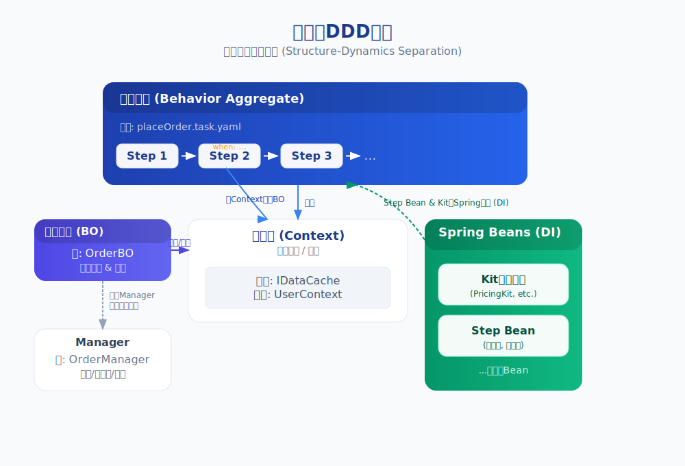

# **广义可逆计算：统一软件构造与演化的新范式**

**摘要**：为应对软件系统日益增长的复杂性与持续演化的挑战，软件工程领域已涌现出模型驱动、差量化编程等多种探索。本文提出并系统阐述了广义可逆计算（Generalized Reversible Computation, GRC）理论，它旨在为这些探索提供一个统一的理论框架和范式级的综合。GRC以统一公式 App = Generator<DSL> ⊕ Δ 将“生成式主干+结构化差量”确立为构造不变式。不同于运行时的逻辑可逆，GRC把“可逆性”拓展到构造期：将差量提升为一等公民，并将“优良代数性质”视为由表示空间设计获得的工程结果。核心思想是主动以DSL构建稳定的语义坐标系，使差量在模型空间内具结构级封闭与高组合性（业务一致性由后续校验判定）。本文贡献包括：（1）给出最小差量代数核及关键性质的条件化证明（如结合律在局部合并上的成立）；（2）提出S-N-V三阶段加载、XDef元DSL与“Loader as Generator”等实现原则，将GRC以低侵入性方式融入主流生态。通过对DDD的重解与对Docker、Kustomize、OpenUSD等实践的统一分析，展示GRC的解释力；基于Nop平台与大型银行核心系统改造的案例，给出工程可行性与变体治理效果的证据。GRC为产品线场景下的“标准化与定制化”提供了系统化路径，减少分支维护与演化熵增。

**关键词**：Generalized Reversible Computation, Delta-Oriented Programming, Metaprogramming, Model-Driven Engineering, Software Product Lines, Domain-Specific Languages, Recursive Fractal-like Construction, Domain-Driven Design, Minimal Information Expression, Software Configuration Management, Variability Management, Software Product Line Engineering, Compositional Software Development

## 1. 引言：从可计算性到复杂性的挑战

计算科学的发展史上，图灵机和Lambda演算两大范式共同奠定了"可计算性"的理论基础，回答了"什么问题是可计算的"这一根本问题。然而，当软件系统从独立的算法演变为错综复杂的生态系统时，我们面临的核心挑战已从"可计算性"转向了"复杂性管理"。

软件工程领域面临的一些长期挑战可归结为三个基本矛盾：
- **标准化与定制化**的矛盾：如何在保持核心产品稳定性的同时满足个性化需求。
- **复用与演化**的矛盾：如何在复用现有资产的同时支持系统的持续演进。
- **熵增与控制**的矛盾：如何系统性地治理软件腐化，控制复杂度增长。

为此，本文正式提出**广义可逆计算（Generalized Reversible Computation, GRC）**。GRC的核心思想是：任何复杂软件系统的构造与演化，都可由一个统一的构造公式所描述。它断言，一个系统总是可以被分解为一个由标准化的**模型**通过确定性的**生成器**构建的、可预测的“理想主干”，以及一个或多个封装了所有非理想、定制化、演化修正的结构化**差量**的叠加。这个核心思想可以形式化地表达为：

`App = Generator<DSL> ⊕ Δ`

在深入展开其理论体系之前，我们首先通过下表对本文涉及的核心概念进行简要说明，以帮助读者建立清晰的认知地图。

### **核心概念术语表 (Glossary of Core Concepts)**

| 术语 (Term) | 英文/符号 (English/Symbol) | 定义与说明 (Definition & Explanation) |
| :--- | :--- | :--- |
| **广义可逆计算** | Generalized Reversible Computation (GRC) | 本文提出的新范式。它将“可逆性”原理从运行时扩展到**软件构造与演化全过程**，其核心是通过代数化的差量运算来系统性地管理复杂性。 |
| **核心构造公式** | `App = Generator<DSL> ⊕ Δ` | GRC的数学基石。它断言任何软件应用（App）都可被分解为一个**可预测的、由生成器（Generator）和DSL构建的基础**，与一个或多个**封装了所有变化的结构化差量（Δ）**的组合。 |
| **结构化差量** | Structured Delta (Δ) | GRC中的**第一类公民**。它是一个封装了对基础模型进行增、删、改等演化操作的**结构化数据包**。与文本`diff`不同，它在**语义层面**操作，具有代数性质。 |
| **生成器** | Generator | GRC公式中的确定性转换函数。它负责读取一种**领域特定语言（DSL）**，并将其“编译”或“解释”为系统的一个可预测的、标准化的“理想主干”。 |
| **领域特定语言** | Domain-Specific Language (DSL) | GRC的“**语义坐标系**”的载体。它为软件制品提供了一个稳定的、具有业务含义的结构，使得差量（Δ）可以拥有**精确、健壮的寻址锚点**。 |
| **可逆合并算子** | Reversible Merge Operator (⊕) | 用于将差量（Δ）应用到基础模型上的核心代数运算。它被设计为**非侵入性**的，并且理论上支持**逆运算**（`Base = App - Δ`），从而实现变更的精确计算与剥离。 |
这一核心构造原理在宏观架构层面，可以被直观地理解为一个全新的架构范式。**如图1所示**，一个典型的分层软件系统，无论其内部如何划分（例如，基础设施层、核心引擎层和业务应用层），都可以被一个新增的、正交的“差量定制”维度所增强。这个Delta维度，正是GRC公式中结构化差量 `Δ` 的体现。它像一个统一的控制总线，能够非侵入性地对系统的任何层次进行修改、替换或扩展，从而将原本散乱的、临时的定制化需求，收敛到一个系统性的、可管理的框架之内。


！[Delta Oriented Architecture](ddd/delta-oriented-arch.svg)

**图1：广义可逆计算的顶层架构隐喻——基于差量定制的分层架构。** 该图展示了GRC范式的核心思想：一个传统的、垂直分层的软件系统（基础设施层、核心引擎层、业务应用层）被一个正交的、贯穿所有层次的“差量定制（Delta Customization）”维度进行非侵入式地增强。这个Delta维度对应GRC公式中的 `Δ`，为系统演化和变体管理提供了一个统一、可伸缩的机制。

本文的主要贡献在于：
1.  **范式建立与定位**：首次系统性地定义GRC，通过与物理学方法论的类比，建立其作为计算框架的 conceptual foundation（概念基础），并厘清其与DOP、MDA等相关工作的关系。
2.  **理论内核阐释**：详细阐述GRC的递归分形构造特性、三重可逆性维度以及基于差量代数的运算基础。
3.  **统一解释力展示**：从GRC的第一性原理出发，对领域驱动设计（DDD）进行重新诠释，并揭示Docker、OpenUSD等现代实践背后的统一构造法则。
4.  **工程实践验证**：通过Nop平台的规范实现和大型企业级案例，展示GRC理论的工程可行性、潜在优势与普适性。

接下来，我们将从理论定位与相关工作开始，系统性地阐述GRC的内涵。

## 2. 理论定位与相关工作

### 2.1. 广义可逆计算的概念界定
为了精确界定广义可逆计算（GRC）的理论范畴，必须清晰地将其与计算科学中其他“可逆性”概念进行辨析：

*   **物理可逆计算 (Physical Reversible Computing)**：该领域关注在物理定律层面，如何利用可逆过程构建能耗极低的计算硬件。其理论基础可追溯至兰道尔原理（Landauer's principle），该原理阐明了信息擦除与能量耗散之间的必然联系 [1]。
*   **逻辑可逆计算 (Logical Reversible Computation, LRC)**：理论计算机科学的一个分支，关注计算步骤在运行时是否具有严格的逻辑双射（bijection），即每个计算状态都有唯一的后继和前驱。Bennett证明了任何计算过程原则上都可以被转换为逻辑可逆的形式 [2]。
*   **广义可逆计算 (Generalized Reversible Computation, GRC)**：本文提出的软件构造范式。它将“可逆性”的原理从**运行时（runtime）**的执行逻辑，扩展至软件全生命周期的**构造时（design/build-time）**活动。GRC的核心议题并非消除所有不可逆性，而是在一个宏观上熵增的软件工程世界中，如何将可逆的、代数性的构造操作作为核心机制，去系统性地组织和驾驭不可避免的不可逆性。

因此，GRC与LRC并非竞争关系，而是关注不同层面的概念。LRC可以被视为GRC在构造维度被极大简化、仅关注运行时执行步骤的一个理论特例。GRC关注的是更广泛的、涵盖软件设计、实现、部署与演化全过程的构造动力学。

### 2.2. 与相关工作的系统性比较 (Systematic Comparison with Related Work)

广义可逆计算（GRC）的核心思想最初于2007年独立提出，其灵感来源并非软件工程领域的主流范式，而是源于理论物理学中处理复杂多体系统的方法论（详见第4.1节）。在本文将其理论体系化的过程中，我们梳理了软件工程领域的学术文献，发现许多与GRC核心思想相似的探索，已在模型驱动工程（MDE）、软件产品线（SPL）和特征导向编程（FOP）等领域独立展开。

这种来自不同路径却指向相似解决方案的“趋同演化”（convergent evolution）现象，在一定程度上表明“差量化”和“生成式”构造可能是应对软件复杂性的一种有效模式。本节的目的不仅是阐明GRC的思想起源，更是将其置于更广阔的学术坐标系中，通过与这些前人工作的对比，来揭示GRC在理论完备性、代数严格性及统一性上的特点。我们认为，许多现有的构造理论，可以被理解为对GRC核心公式 `App = Generator<DSL> ⊕ Δ` 在不同维度上的不完全实现。

在展开具体比较之前，必须首先明确GRC作为一个范式的根本定位：GRC的核心在于确立了 Y = F(X) ⊕ Δ 这一统一的构造关系与心智模型，而非推广某一个特定的代数算子或技术实现。 GRC的理论框架具有强大的包容性，它承认并允许并存多种不同类型的“差量空间”，例如Git的行级文本差量、Docker的文件系统层、以及本文后续将重点展示的基于领域特定语言（DSL）的语义树差量。

GRC的先进性体现在，它为这些不同的差量空间提供了一个统一的评估和组织框架。它引导我们去主动设计和选择那些具有更优良代数性质（如确定性、可组合性、可逆性）的差量空间，因为代数性质越精良，我们能获取的自动化和演化治理收益就越高。因此，当我们后续讨论GRC的“代数性”时，应理解为这是一种可以通过良好设计达成的、理想的目标性质，而非一个僵化的、适用于所有场景的先决条件。带着这一认知，我们将能更深刻地理解GRC与其他相关工作的本质区别。

#### 2.2.1. 模型驱动工程 (MDE)：有生成，无差量

模型驱动工程（Model-Driven Engineering, MDE），及其早期具体实现模型驱动架构（MDA）[3]，是软件工程领域一次将抽象层次从代码提升到模型的重大范式探索 [4]。其核心模式可抽象为 `App = Transformer(Model)`，这与GRC公式中的 `Generator<DSL>` 部分在思想上高度一致，即都承认“生成”是系统化构造的核心手段。

MDE通过将模型作为唯一的真理来源（Single Source of Truth），并从中自动生成代码和其他产物，极大地提升了生产力与一致性。然而，一个在经典MDE方法中公认的挑战是其在处理偏离核心模型的“例外”或“定制化”需求时的相对刚性。GRC通过引入一个结构化的、与生成过程正交协作的差量机制（`Δ`），旨在系统性地解决这一问题。它允许在不破坏核心模型（`Generator<DSL>`的输出）的前提下，进行非侵入式的、可追溯的演化修正，从而补全MDE缺失的关键一环。

#### 2.2.2. 面向差量/特征编程 (DOP/FOP)：有差量，但坐标系不完备

面向特征编程（Feature-Oriented Programming, FOP）[5] 及其后续演进的面向差量编程（Delta-Oriented Programming, DOP）[6]，主要用于管理软件产品线（Software Product Lines, SPL）中的可变性 [7]。这些范式抓住了GRC公式中 `Δ` 这一半的真理，将“变化”本身实体化为可操作的“特征”或“差量”模块。

然而，当审视其经典模式 `Product = Core ⊕ Deltas` 时，我们可以从GRC的视角发现其关注点与GRC的不同，这也解释了其在某些场景下遇到的挑战：

1.  **`Core`的来源与构造**：DOP/FOP的理论焦点在于差量的组合，而`Core`的构造方式通常被假定为外部问题。GRC通过`Generator<DSL>`，将`Core`的生成也纳入了统一的构造理论。
2.  **差量作用的“坐标系”**：DOP/FOP的差量操作通常作用于由通用编程语言（GPL）定义的代码结构之上。GRC认为，GPL的语法树是一个**相对脆弱的坐标系**，易受重构和风格变化的影响（即“噪声”较高）。GRC的核心主张之一，就是通过**主动设计DSL来构建一个更稳定的语义坐标系**，从而让差量操作更健壮、组合冲突更少。

#### 2.2.3. 面向切面编程 (AOP)：空间共性 vs. 时间相似性

面向切面编程（AOP）[9] 提出了一种模块化横切关注点的机制。从GRC的视角看，AOP可以被视为一种非结构化的差量注入机制。

AOP与GRC在捕捉“变化”的维度上存在差异。AOP的切点（Pointcut）主要捕捉同一时刻、横跨不同模块的“**空间共性**”（spatial commonality）。而GRC的差量（`Δ`）主要捕捉同一个制品在演化过程中的“**时间相似性**”（temporal similarity）。AOP的切点是一种查询语义，其作用范围可能因代码重构而改变；而GRC的差量是一种构造语义，它基于由DSL定义的精确领域坐标，其作用目标是确定性的。

#### 2.2.4. 版本控制系统 (VCS)：一种代数性质较弱的文本差量

以Git为代表的现代版本控制系统（VCS），是差量化思想在工程实践中最成功的应用，其`diff/patch`机制深刻地影响了一代开发者。学术界也已对VCS的历史数据进行了广泛的挖掘与分析 [10]。

然而，GRC通过将差量从**“语法/文本空间”提升到“语义/模型空间”**，并赋予其健壮的代数性质，试图实现对VCS思想的范式升级。Git的`diff`与GRC的`Δ`在数学性质上存在差异：
*   **差量空间不同**：Git的差量定义在**行文本空间**，缺乏业务语义。GRC的差量定义在**领域模型空间**，其最小操作单元是具有明确业务含义的语义节点。
*   **缺乏封闭性（Closure）（以‘合法源码/模型’为运算域）**：Git的`merge`可能产生“冲突（Conflict）”，生成一种脱离了原始“合法源码”空间的异常结构，需要人工干预，破坏了运算的封闭性。GRC的合并算子`⊕`则被设计为在模型结构空间内是封闭的（业务一致性需要额外判断）。
*   **结合性受限（Associativity）**：Git的差量（patch）与特定的基线版本紧密耦合，无法脱离基线独立地进行`(patch₁ ⊕ patch₂) ⊕ patch₃ = patch₁ ⊕ (patch₂ ⊕ patch₃)`这样的运算，这使其不具备一般意义上的可组合性（Composability）。GRC在语义模型空间为常见改动提供局部具结合律的合并，提高自动化。

综上，Git在文本层面的差量管理对协作与历史追踪至关重要；GRC在语义/模型空间提供稳定坐标与局部具结合律的合并，以降低噪声并提升自动化，两者在工程体系中是分层互补的.

### 2.2.5 语言工作台（Language Workbench）：统一元模型 vs 多语言组合

JetBrains MPS (Meta Programming System) 作为语言工作台（Language Workbench）的典范 [15, 16]，其核心思想在于通过**投影编辑器（Projectional Editor）**将开发者与底层的文本语法解耦，直接操作抽象语法树（AST）。它为每一种DSL构建专属的、高度定制化的开发体验，再通过**语言组合（Language Composition）**将这些独立的能力聚合起来，这一整套方法论也被称为语言导向编程（Language-Oriented Programming）[17]。

广义可逆计算（GRC）虽然同样大量使用DSL，但其理论出发点和构造哲学存在根本性差异。GRC认为，既然任何语言最终都可以被解析为AST，那么将这些异构的AST归一化为一个**统一的元模型**（在Nop平台中为XNode，其本质是承载了Lisp S表达式通用结构的工程化实现）是一个自然且强大的抽象。基于此，GRC提供了一条实现语言工作台能力的、更轻量且代数完备的路径。

GRC与MPS的范式差异，可以从以下几个关键点进行剖析：

1.  **统一元模型与同态元编程 (Unified Metamodel & Homomorphic Metaprogramming)**：MPS为每种语言维护独立的AST结构。而GRC提出统一的XNode元模型，使得**对模型的变换（元编程）与模型自身的结构是同态的**。这使得`Generator`可以被实现为一种类似Lisp宏的机制，在统一的AST层面进行图灵完备的变换，其能力远超简单的代码生成。

2.  **多重可逆表象 (Multiple, Reversible Representations)**：在GRC中，**同一个信息可以拥有多个不同的展现形式（表象）**。DSL的文本是其**文本表象**，而一个复杂的交互界面是其**可视化表象**。这些表象之间理论上可以自由地进行可逆转换。MPS的投影编辑器是“语言定义”的一部分，而GRC的表象是与模型分离的。一个有力的例证是：GRC框架可以为所有DSL都自动提供一个Excel表象。可以通过一份补充的映射定义补充必要的解析和校验逻辑。**关键在于，这种映射是灵活的，它完全根据属性名称来匹配数据，而无需指定固定的单元格位置。**因此，系统不仅能够生成、也能够可靠地反向解析结构化的Excel文件，从而让用户能直接使用Excel编辑复杂的DSL树状结构。这种为任意DSL低成本提供健壮、通用编辑方式的能力，是GRC范式的重要优势。

3.  **生成器即表象构造器 (Generator as Representation Constructor)**：基于上述观点，GRC的核心公式 `App = Generator<DSL> ⊕ Δ` 获得了更深刻的诠释。这里的**`Generator`**不再仅仅是代码生成器，它被泛化为**任何从统一元模型到具体表象的转换器**。这其中就包括了构造一个“投影编辑器”的过程。在具体实现层面，这可以做到非常通用和灵活：一个渲染引擎在遍历XNode树时，**可以根据每个节点的标签名（`tagName`），从一个指定的控件库（`control.xlib`）中动态查找并加载对应的UI控件**。例如，一个`<wf:send-task>`节点可以映射到一个显示“发送任务”的图形块。通过提供不同的控件库——一个用于Web渲染，一个用于桌面IDE插件——就可以为同一份XNode模型数据，**生成出外观和行为完全不同的可视化编辑器**。

4.  **显式的差量代数 (Explicit Delta Algebra)**：这是GRC最独特的理论贡献。MPS本身并未内置“差量合并与分解”的概念。GRC通过在统一的XNode元模型之上定义`⊕`合并算子和结构化差量`Δ`，为模型的演化、定制与组合提供了一套显式的、具有良好代数性质的操作语言。

下表总结了两种范式在核心机制上的差异：

| 维度 | JetBrains MPS | 广义可逆计算 (GRC) |
| :--- | :--- | :--- |
| **理论焦点** | 投影式编辑、语言组合 | **统一元模型、多重表象、差量代数** |
| **核心结构** | 各语言独立的、类型化的AST | 统一的XNode元模型（承载Lisp S表达式思想） |
| **表象机制** | 语言与编辑器强绑定 | **同一XNode通过控件库可逆映射到多种表象** |
| **Generator的内涵** | 主要是代码生成器 | **表象构造器（含可视化编辑器）与同态宏** |
| **演化机制** | 依赖语言模块自身版本管理 | **基于差量代数的显式、可计算演化** |
| **范式定位** | 重型、完备的语言工作台 | **实现语言生态的、基于代数与元编程的轻量级框架** |

综上所述，GRC并非简单地复制或替代语言工作台。它通过回归到Lisp S表达式的通用结构思想，并创造性地补充了“差量代数”和“多重可逆表象”两大概念，为软件的构造（通过`Generator`生成表象）与演化（通过`⊕ Δ`施加变化）提供了一个更为根本和统一的理论框架。

### 2.2.6. 宽松透镜 (Lenses)：更新传播理论 vs. 系统构造论

以宽松透镜（Lenses）[11]为代表的双向变换（Bidirectional Transformations, BX）理论，旨在解决“视图更新问题”：即在两个关联的模型（如源A和视图B）之间，如何将对一方的修改“良性”地传播回另一方。其核心在于定义`get`和`put`操作，并使其满足一组保证行为一致性的公理。后续演进的δ-lenses更是将“编辑/差量（Δ）”提升为传播的实体，并通过同态（homomorphism）来保证组合编辑的正确传播。

初看之下，GRC的“变换可逆性”与Lenses的目标似乎相似。然而，两者的理论焦点和工程射程存在本质差异，这种差异根植于它们的基本公设。

| 对比维度 | 宽松透镜 (Lenses / BX) | 广义可逆计算 (GRC) |
| :--- | :--- | :--- |
| 理论焦点 | 局部一致性：如何将一侧的更新良性传播到另一侧（A ↔ B）。 | 全局构造论：整个系统如何统一遵循 `Y = F(X) ⊕ Δ` 的构造与演化不变式。 |
| 基本公设 | 通常依赖对齐算法，或借助踪迹（Trace）/补充信息来定位与回溯变更。 | 公设：系统中每个语义单元应具备内禀坐标（如`id`），以显著缓解“对齐”难题。 |
| 差量(Δ)地位 | 瞬时输入：服务于一次同步计算的过程性概念。 | 第一类公民：可独立打包、版本化、分发，贯穿软件全生命周期。 |
| 系统尺度 | 点对点（A ↔ B）。扩展到多模型链路需要额外的组合证明。 | 系统级闭环：借助“DSL图册”、统一IR与同态传递契约，更易支持全链路演化与溯源。 |

Lenses理论的强大之处在于为“两模型同步”问题提供了深刻而优雅的形式化骨架，主要回答在给定两个模型A和B后如何传播更新。

GRC则采取更具“构造性、规定性”的视角：不试图解决任意两模型间的同步，而是主张主动设计内含稳定“内禀坐标”（Intrinsic Coordinates）的系统，从源头上显著减少对齐问题的复杂度。`Generator<DSL>`确保基础模型结构化且可寻址，`Δ`则在该坐标系中进行操作。

因此，Lenses可被视为GRC在 `Y = F(X)` 这一受限情形（即`Δ`为空）下，对 `F` 与近似逆 `F⁻¹` 关系的精细化研究；而GRC将“内禀坐标”和“叠加代数⊕”提升为基本公设，把问题从“如何同步两个既有模型”转化为“如何以统一、基于坐标的代数法则来构造并演化整个系统”。

#### **2.2.7 软件产品线工程 (SPLE)：从特征模型到差量代数**

软件产品线工程（SPLE）[7]是工业界为应对“软件产品家族”开发而提出的一套系统性方法论，其核心思想是通过**领域工程（Domain Engineering）**构建可复用平台，再通过**应用工程（Application Engineering）**快速衍生具体产品。SPLE直面“标准化与定制化”的矛盾，在方法论层面与GRC高度相关。

然而，传统的SPLE实践在将“可变性模型”映射到“实现资产”时，面临着一系列挑战：
1.  **特征模型与实现的鸿沟**：SPLE通常使用**特征模型（Feature Model）**来描述产品间的共性与差异。但特征模型本身（一个逻辑上的树状结构）与最终的代码实现（如使用`#ifdef`、AOP或设计模式）之间存在巨大的“语义鸿沟”，其映射关系复杂且难以维护。
2.  **组合爆炸与实现复杂性**：特征之间的交互和约束，在实现层面可能导致复杂的条件编译、织入规则或配置逻辑，难以进行端到端的推理和验证。
3.  **核心资产的演化僵化**：SPLE中的“核心平台（Core Platform）”通常仍是一个手工维护的、一体化的代码库。当核心平台自身需要演化时，很容易破坏对现有产品变体的兼容性。

GRC可以被视为**SPLE方法论的一个更根本、更具代数一致性的实现范式**。它不是简单地替代SPLE，而是为其提供了一套更强大的引擎。

| 对比维度 | 传统SPLE实践 | 广义可逆计算 (GRC) 实现 |
| :--- | :--- | :--- |
| **可变性模型** | 独立的、逻辑上的**特征模型** | **结构化差量（Δ）本身**即是可变性模型，与实现同构 |
| **核心资产** | 手工维护的**核心平台（Core）** | 由`Generator<DSL>`确定性生成的**理想主干** |
| **组合机制** | 分散的、异构的实现技术（预处理器、AOP、配置等） | 统一的、代数完备的**合并算子（⊕）** |
| **构造过程** | `Product = Bind(Core, FeatureConfig)` | `App = Generator<DSL> ⊕ Δ` |
| **演化范式** | 核心与变体分离，演化路径复杂 | **构造即演化**，所有变更都统一为差量叠加 |

**GRC的范式跃迁在于**：它不再将“特征”和“核心”视为两种异构的实体，而是将它们统一在`Generator<DSL> ⊕ Δ`的框架之下。
*   **DSL本身定义了所有可能的“特征空间”**，它是一个完备的语义坐标系。
*   一个具体的“特征”被实现为一个或多个`Δ`的组合，这些`Δ`精确地作用于DSL坐标系的不同位置。
*   “核心资产”不再是静态的代码库，而是可由`Generator`从空集或最小模型生成的、可预测的理想形态。

**由此，GRC带来了一个创新性的工程实践：系统复用不再依赖于对基础产品（Base）的侵入式修改或预留扩展点。一个全新的产品变体，可以通过提供一组纯粹的、附加的`Δ`差量文件来创建，而基础产品的源码和模型可以保持100%不变。这种“基线只读，增量扩展”的模式，将演化带来的风险严格隔离在`Δ`中，极大地提升了核心平台的稳定性和可维护性。**

因此，GRC通过“语言即坐标系”和“差量代数”，将SPLE中分离的“问题空间”（特征模型）和“解空间”（实现技术）无缝地统一起来，为实现**系统级的、粗粒度的软件产品家族复用**，提供了一条更简洁、更健壮、更具数学美感的路径。

#### 2.2.8. 结论：一个更根本的构造范式

GRC并非对上述理论的简单组合，而是提供了一个更根本、更通用的构造范式。它通过引入**生成器（Generator）**、**代数性的差量（Algebraic Delta）**和**语义坐标系（Semantic Coordinate System via DSL）**这三大基石，将其他理论统一为在不同约束下的特例或近似。从这个视角看，软件构造范式的演进历史，可以被解读为一个不断向 `App = Generator<DSL> ⊕ Δ` 这一完备形式逐步探索和逼近的过程。

## 3. GRC的核心机制：递归分形与差量代数

GRC理论的核心机制建立在三个紧密关联的基石之上：其一，是作为基础范式的“生成与差量”二元协同；其二，是将“构造”与“演化”统一起来的代数原理；其三，是揭示软件自相似性的递归分形构造法则。这三者共同构成了驾驭复杂性的操作框架。

### 3.1. 核心范式：生成与差量的二元协同

GRC的构造范式由统一公式 `App = Generator<DSL> ⊕ Δ` 体现，其本质是一种“**基础+扰动**”的分解思想。这一思想的抽象类比，是将软件构造范式从OOP的 `Map = Map extends Map`，升维至GRC的 `Tree = Tree x-extends Tree`。这代表了操作空间从扁平的类结构扩展至层级的系统模型树，以及操作算子从简单的属性覆盖升级为代数完备的可逆合并。

落实为具体的技术实现路线：

```javascript
App = Delta x-extends Generator<DSL>
```

其中：
- **Generator<DSL>**：系统的理想化主干，提供标准、默认结构
- **Delta**：结构化的差量，定义对标准基础的所有定制与特化  
- **x-extends**：可逆合并算子，对传统继承机制的代数升级

### 3.2. 构造即演化：A = ∅ ⊕ A 的统一性原理

代数恒等式 `A = ∅ ⊕ A`，在GRC语境下揭示了**软件构造与演化的内在统一性**。

在传统软件工程中，“项目初始化”（构造）和“功能变更”（演化）通常被视为两种截然不同的活动，使用不同的心智模型和工具集。而GRC通过将“差量”提升为第一类公民，将它们完美统一在同一个代数法则之下。

我们将 `A = ∅ ⊕ A` 翻译成GRC的语言：

*   **A (左侧)**: 代表一个最终完成的、可运行的**应用系统（Application）**。
*   **∅ (空集符号)**: 代表一个**“零模型”（Zero Model）**或**“空基线”（Empty Baseline）**。它是在GRC差量代数体系中的**单位元（Identity Element）**，是一个逻辑上存在的、包含零信息的结构化起点。
*   **⊕ A (右侧)**: 这里的`A`不再是最终的应用实体，而是**“创世差量”（Genesis Delta）**。它是一个包含了从“无”到“有”创建出整个应用`A`所需**全部信息**的、一个巨大的、完备的差量 `Δ_A`。

因此，`A = ∅ ⊕ A` 这句话在GRC语境下的深刻含义是：
**一个全新应用的构造过程，本质上等同于在“零模型”的基础上，应用一个包含了该应用全部定义的“创世差量”。**

现在，我们来看系统的演化过程，比如从版本V₁到V₂，它可以表示为：`V₂ = V₁ ⊕ Δ`。将两个公式并列：

1.  **构造 (Construction)**: `App_V₁ = ∅ ⊕ Δ_Genesis`
2.  **演化 (Evolution)**: `App_V₂ = App_V₁ ⊕ Δ_Incremental`

统一性在此刻体现：**构造即演化**。构造过程，可以看作是**基于“零基线”的一次宏大演化**。反之，演化过程，也可以看作是**在“非零基线”上的一次局部构造**。

这一统一性原理带来了巨大的工程价值：
*   **概念简化**: 整个软件生命周期被简化为一种单一的核心操作：**应用差量（Apply Delta）**。
*   **工具链统一**: 既然底层法则是统一的，那么用于“构造”和“演化”的工具链也可以是统一的。一个合并引擎，既可以用来从零生成应用，也可以用来为其打上微小的补丁。
*   **万物皆“补丁”**: 一个新功能、一个客户定制、一个紧急修复、甚至整个初始应用本身，都被抽象为可独立管理、可组合、可重用的差量资产。

### 3.3 递归分形构造：软件构造的自相似性原则

GRC理论的一个核心洞察，是软件构造过程所展现的递归自相似性：其基本构造公式 Y = F(X) ⊕ Δ 作为一个不变的模式，贯穿于从宏观系统架构到微观功能实现的所有层次。我们借用**分形（fractal-like）**这一隐喻来描述这种模式的自重复特性，它指代的是构造上的自相似，而非严格的数学几何概念。

这种递归性在软件构造的四个关键维度上均有体现：

#### 3.3.1 纵向递归：多阶段软件生产线

在纵向维度上，GRC构建了一条**多阶段的软件生产线**，将复杂的模型转换分解为一系列可控的步骤：

```
XMeta = Δ_meta ⊕ Generator<XORM>
XView = Δ_view ⊕ Generator<XMeta>  
XPage = Δ_page ⊕ Generator<XView>
```

这种递归分解解决了传统模型驱动架构（MDA）的核心困境：允许在建模时不再需要追求对所有细节的完美覆盖，只需构建处理80%通用场景的核心生成器，而剩余20%的特殊需求通过Δ差量在任意环节精确注入。

**图2提供了一个这种多阶段软件生产线的具体示例。** 在这个例子中，构造过程始于一个非技术的`Excel`文件，它首先被一个生成器转换为结构化的`XORM`数据模型。这个`XORM`模型随后作为下一阶段的输入，被用于生成更高层次的`XMeta`业务模型。这个过程不断持续，`XMeta`与业务逻辑模型（`BizModel`）结合生成`GraphQL`服务，同时也被用于生成前端的`XView`和`XPage`模型，直至最终渲染出用户界面。整个流程清晰地展示了 `Y = F(X) ⊕ Δ` 这一构造模式如何在不同层次上自相似地重复。


**图2：GRC纵向递归构造的示例——一条从数据源到前端UI的软件生产线。** 此流程图展示了GRC构造公式的递归应用。它始于一个业务人员易于维护的Excel数据源，通过一系列确定性的生成器（Generator），逐步将模型从一个表示（`XORM`）转换到另一个表示（`XMeta`, `XView`, `XPage`），最终生成GraphQL服务和前端界面。在每一个转换阶段，都可以通过叠加差量（`_XORM`, `_XMeta`等）来引入定制化修正。

#### 3.3.2 横向递归：DSL特性向量空间

在横向维度上，GRC构建了**DSL特性向量空间**的图景。一个跨领域的业务需求可以被分解为作用于不同DSL模型上的一组同构差量：

```
App = [DSL₁, DSL₂, ..., DSLₙ, Δ_residual]
```

其中Δ_residual确保了分解的完备性，代表了无法被现有DSL体系完美捕获的残差。

#### 3.3.3 时间递归：版本演化的自相似性

在时间维度上，系统的任何实体都可以被视为其更早版本与演化差量的叠加：

```
产品_V₃ = Δ_v₃ ⊕ 产品_V₂
产品_V₂ = Δ_v₂ ⊕ 产品_V₁
```

这使得"变化"本身成为可管理、可版本化、可演化的核心资产。

#### 3.3.4 元递归：构造体系的自举

构造体系自身（`Generator`、`DSL`定义、合并规则）也遵循同样的不变式进行演化：

```
MyDSL_v₂ = Δ_meta ⊕ MyDSL_v₁
Compiler_Pro = Δ_feature ⊕ Compiler_Base  
MergeRule_New = Δ_rule ⊕ MergeRule_Old
```

整个软件世界——从最终产品到中间模型，再到构造体系本身——都变成了一个由⊕算子连接起来的、巨大的、自相似的差量结构空间。

### 3.4. 差量代数：驾驭变化的基础

GRC的数学基石是**差量代数（Delta Algebra）**。它要求构造过程是可求解的代数方程，而非一系列不可逆的指令。通过为合并运算`⊕`引入**逆元（`-Δ`）**，我们得以实现：
*   **精确求解差量**：`Δ = App - Base` (语义diff)。
*   **安全剥离变更**：`Base = App - Δ` (语义rebase)。

这使得软件复用从“相同可复用”的组件模式，扩展至“**相关即可复用**”的变换模式，从根本上解决了“核心产品与客户定制”的核心矛盾。

## 4. 理论基石：与物理学方法论的类比

GRC的理论建立在与物理学基本分析方法论的**思想类比**之上。

### 4.1. 狄拉克（相互作用）绘景的类比

GRC的“基础+扰动”分解思想，与量子力学中处理复杂交互问题的狄拉克绘景在方法论上完全一致。`Generator<DSL>`的产物对应“可精确求解的自由部分”（`H₀`），`Delta`则对应“作为微扰处理的相互作用部分”（`V`）。这揭示了GRC是应对软件“复杂性”问题的一种通用的计算框架。

#### 计算范式与物理学绘景的方法论对比：

| 对比维度 | 图灵机范式 (Turing Machine) | Lambda演算范式 (Lambda Calculus) | 广义可逆计算范式 (GRC) |
| :--- | :--- | :--- | :--- |
| **理论类比** | **薛定谔绘景 (Schrödinger Picture)** | **海森堡绘景 (Heisenberg Picture)** | **狄拉克（相互作用）绘景 (Dirac/Interaction Picture)** |
| **核心哲学** | 算子（程序）不变，状态（数据）随时间演化。 | 状态（数据）不变，算子（函数）随时间演化。 | **系统分解为“可精确求解的自由部分”和“作为微扰处理的相互作用部分”。** |
| **演化的主体** | **状态/数据**<br>（磁带上的符号、内存中的值） | **算子/函数**<br>（通过组合与应用，生成新的函数） | **相互作用/差量 (Δ)**<br>（封装了所有对理想主干的修正、定制与演化） |
| **不变的主体** | **程序/规则**<br>（图灵机的状态转移表） | **数据**<br>（不可变数据结构） | **理想主干 (Generator<DSL>)**<br>（一个可预测、可精确求解的、标准化的基础） |
| **应对复杂性的方法** | **模拟过程**：通过精确描述每一步的状态变迁来控制系统。 | **抽象组合**：通过将行为封装成无状态、可组合的函数来管理复杂性。 | **分解与叠加**：将复杂问题分解为一个简单的、可生成的“理想模型”和一系列可管理的“结构化差量”的叠加。 |
| **带来的认知升华** | 奠定了“**可计算性**”的**过程观**：万物皆可由状态机逐步演化。 | 奠定了“**可计算性**”的**变换观**：万物皆可由函数抽象与应用来表达。 | 提供了“**复杂性管理**”的**方法论**：任何复杂系统都可以被分解和构造，从而被系统性地驾驭。 |


#### 软件世界观的范式转换：从粒子到波

| 对比维度 | **传统世界观：粒子视角 (Particle View)** | **新世界观：波动/场视角 (Wave/Field View)** |
| :--- | :--- | :--- |
| **基本单元** | 世界是由离散的、有边界的 **"对象"、"组件"、"模块"** 构成的软件基本"粒子"。 | 世界的基本单元是 **"变化" (Change) 本身**，即结构化的**差量 (Delta / Δ)**。它作用于一个作为背景的**坐标系**之上。 |
| **构造方式** | 通过**侵入式组装**，将这些"粒子"通过调用、继承、组合等方式硬性地连接在一起。 | 通过**非侵入式叠加**，不同的"变化" (差量Δ) 在同一个坐标系（基础模型）中相互干涉、叠加，共同**重构**出最终的系统。 |
| **关注焦点** | 单个"粒子"的内部状态和行为。思考的是：<br>"这个**对象**是什么？它能**做什么**？" | **"变化"本身的规律和组合**。思考的是：<br>"在哪个**坐标系**下，发生了什么**变化**？这些变化如何组合？" |
| **本体论地位** | **数据** (状态) 和 **函数** (行为) 是构成"粒子"的**基本元素**，它们是第一性的。 | **数据**是应用一系列"变化"后得到的**结果**。<br>**函数**是一种**可复用的"变化模式"**。<br>它们都是从**差量 (Δ) 派生**出来的，不再是第一性的。 |


### **4.2. 最小信息表达：GRC的第一性原理**

广义可逆计算的所有机制，都可从一个更为根本的原则——最小信息表达原则 (Principle of Minimum Information Expression)——推导得出。该原则的核心是一句箴言：“表达且仅表达需要表达的信息 (Express what is necessary, and nothing more)”。它要求软件构造只包含问题的本质复杂性，并系统性地将所有因技术实现而引入的偶发复杂性降至零。

此原则在思想结构上，与物理学中的**最小作用量原理**具有内在的相似性。两者都蕴含深刻的“经济性”哲学，假设存在一个可“最小化”的度量（作用量 vs. 信息量），系统的理想形态是该度量取极小值的结果。遵循这一原则，将引导我们走向以下三个关键的构造策略，它们共同构成了GRC的理论基石：

1.  **描述式编程与领域特定语言（DSL）的必要性**
    要实现信息最小化，就必须尽可能剥离与具体执行方式、顺序、环境相关的“偶然”信息，只描述希望达成的目标状态。这种“是什么”而非“怎么做”的表达方式天然就是描述式的。通用编程语言（GPL）为保证其图灵完备性，必然携带大量与特定业务领域无关的通用语法和概念，这本身就是一种偶发复杂性。因此，**追求最小表达的路径，必然导向创造和使用领域特定语言（DSL），其本质就是要求我们“使用且仅使用领域概念来表达领域逻辑**。这为GRC公式中 `Generator<DSL>` 的存在提供了理论上的必然性。

2.  **语义唯一性与可逆变换的追求**
    在理论上，如果存在两种不同的最小表达形式 *A* 和 *B* 描述同一业务本质，但它们之间无法进行信息无损的相互转换，那必然意味着其中至少一方包含了对方没有的额外信息，或缺失了对方包含的关键信息，这违背了“最小性”或“完整性”的要求。因此，一个理想的最小表达，其**语义内核应是唯一的**。
    这一“语义唯一性”的理想，直接**导向了对不同表达形式之间可逆变换的追求**。尽管在现实工程中，不同技术范式（如聚合模型 vs. 事件溯源）之间的直接变换极其复杂，但最小信息表达原则指引我们通过**生成式架构**来逼近这一理想：即构建一个纯粹的、与技术范式无关的业务语义模型作为“唯一信源”，然后通过确定性的生成器将其映射到不同的技术实现上。这在工程层面实现了**从“核心语义”到“多重表象”的可追溯性与逻辑可逆性**，为GRC的“变换可逆性”（见5.2节）提供了理论指引和实现路径。

3.  **演化的最小信息单元是差量（Delta）**
    当一个处于最小表达状态的系统 *Base* 需要演化时，引入的变更信息也应遵循最小化原则。描述从 *Base* 到新状态 *App* 的最经济方式，不是重新描述整个 *App*，而是仅仅描述两者之间的**差异**。这个差异的最小化表达，就是**结构化差量（Δ）**。因此，`App = Base ⊕ Δ` 不仅是一个构造公式，更是系统演化过程的最小信息表达形式，它使得“变化”本身成为可管理的实体。

综上所述，“最小信息表达”原则为GRC的构造范式 `App = Generator<DSL> ⊕ Δ` 的每一个组成部分都提供了来自第一性原理的坚实论证。它并非一个僵化的教条，而是一个**指引方向的罗盘**，引导我们去发现并构造那条由问题本质决定的、信息量最小的“逻辑最优路径”。

## 5. 三重维度：广义可逆性的完整阐释

GRC范式中的“可逆性”是一个立体的、多维度的工程原则。

### 5.1 代数可逆性：从构造指令到可解方程

代数可逆性要求将软件构造过程从不可逆的程序化指令升华为可求解的代数方程。传统的 `App = Build(Source)` 是单向的，而GRC提出构造应满足：

```
App = Base ⊕ Δ
```

这一方程的"可解性"源于差量代数结构，使得我们可以：
- 精确计算系统间的差异：`Δ = App - Base`
- 从定制系统中还原标准平台：`Base = App - Δ`

**对最小信息表达的意义**：代数可逆性保证信息的无损操作，使我们在保持核心表达最小化的同时，通过差量组合应对复杂性。

### 5.2 变换可逆性：从单向有损到语义往返

变换可逆性旨在建立不同表示形态（DSL、代码、GUI、Excel等）之间的高保真"语义往返"，由**宽松透镜（Lax Lens）** 模型保证：

```
G⁻¹(G(A)) ≈ A   且   G(G⁻¹(B)) ≈ normalize(B)
```

其中≈是语义等价，normalize代表规范化过程。这种机制：
- 实现跨形态的双向编辑
- 确保多重视角下的系统一致性
- 有意识地忽略纯表现层修改，只提取结构化变更

**对最小信息表达的意义**：允许每个角色使用最适合的表象进行最小化表达，同时保证这些表达在语义层面的统一性。

### 5.3 过程可逆性：从线性时间到可修正历史

过程可逆性提供了一种能力：用"未来"的差量Δ去修正"过去"已发布的系统：

```
M_final = M_base ⊕ Δ_patch
```

这打破了物理世界的线性因果律，在软件构造的"虚拟时空"中实现：
- 非侵入式的热补丁机制
- 对不可逆副作用的可补偿性（SAGA模式）
- 基于证据对象的补偿操作

**对最小信息表达的意义**：使系统演化不再受制于线性时间，可随时注入新的最小表达来优化系统，而不破坏已有信息结构。

### 5.4 可逆与不可逆的边界治理

GRC的现实主义体现在它不追求完全可逆的乌托邦，而是提供治理可逆性与不可逆性的工程策略：
- **R/I划分**：清晰划分系统的可逆核心（R-Core）和不可逆边界（I-Boundary）
- **边界管理**：审计所有I-Boundary穿越，生成补偿所需的证据对象
- **熵的治理**：通过差量隔离有效局部化和管理熵增

## 6. GRC的解释力：重解DDD与统一现代实践

### 6.1. DDD的重新诠释

领域驱动设计（DDD）作为一套旨在应对业务复杂性的强大实践框架，其核心概念“聚合根（Aggregate Root）”通常被定义为“**一致性与事务的边界**”。然而，从GRC的视角看，这一传统认知恰恰是导致系统在超大规模、高演化场景下变得僵化和脆弱的一个因素。

GRC旨在为DDD提供一种新的理论视角，试图将其从一套实践框架，补充和发展为一套形式化的构造理论。它提出：**聚合根最重要的职责，是成为领域语言的载体，一张统一的信息访问地图**。

基于GRC的“结构与动力学分离”思想，我们可以将传统的、臃肿的聚合根拆分为两个独立的组件：
1.  **数据聚合 (Data Aggregate)**：对应GRC公式中的`X`，一个纯粹的、仅承载结构性数据和最小不变式（如`amount >= 0`）的**信息空间**。它通过智能加载机制，为上层逻辑提供一个富含领域语义的、可按需**拉取（Pull）**信息的统一视图，如`order.getCustomer().getCreditLimit()`。
2.  **行为聚合 (Behavior Aggregate)**：对应GRC公式中的`F`，一个通过**领域特定语言（DSL）**（如YAML流程定义）描述的**流程编排器**。它将复杂的业务逻辑分解为一系列单一职责、可组合的**步骤（Step）**，以声明式的方式对数据聚合进行变换。

这种范式转移，代表了从传统面向对象思维向可逆计算思维的一种演进。

| 对比维度      | 传统DDD范式                           | GRC赋能的演化式DDD范式                    |
|:--------- |:--------------------------------- |:----------------------------------- |
| **理论基础**  | 面向对象范式 (Object-Oriented) | **可逆计算理论 (Reversible Computation)** |
| **核心职责**  | 行为容器，**一致性与事务的守护者**               | 领域语言载体，**统一的信息访问地图**                |
| **架构隐喻**  | 精心设计的**对象网络**                     | 可逆变换生成的**结构化信息空间**                  |
| **数据与行为** | 行为与数据**必须合一**（封装）                 | **结构（数据）与动力学（流程）分离**             |
| **信息流**   | **推送模式**（为方法准备专用DTO）              | **拉取模式**（逻辑按需从信息空间拉取数据）             |
| **扩展机制**  | 继承、组合（侵入式，需改源码）                   | **差量编程**（非侵入式，通过差量叠加扩展）             |
| **事务边界**  | 与聚合根操作**强绑定**                 | 与聚合根**解耦**，由上层服务**声明式**定义           |

在这种新范式下，GRC对DDD核心概念的重新诠释变得清晰：
*   **空间**：限界上下文是对问题空间的**坐标系划分**。
*   **时间**：领域事件是状态空间中遵循 `NewState = OldState ⊕ Event` 的**差量（Δ）**。
*   **语言**：统一语言物化为**DSL**（如流程定义、规则集），为空间提供**内禀坐标系**。
*   **变化**：软件演化即在坐标系中施加的、包含增减的**差量（Δ）**，例如通过差量模型文件替换或增加一个业务步骤。

### 6.2. 统一多种技术创新：趋同演化的证据

GRC的普适性体现在它揭示了一系列看似无关的现代技术创新背后，共同遵循着“差量优先”的构造逻辑。这些技术在各自的领域独立地“重新发现”了GRC的核心原则，构成了支持GRC范式普遍性的“趋同演化”证据。

**Docker**的镜像构造机制，是GRC在**文件系统结构空间**中的一个对等实现。其构造过程可以映射到GRC公式：

`FinalImage = DockerBuild<Dockerfile> ⊕ BaseImageLayers`。


- **Dockerfile** ↔ **DSL**：声明式的环境构造蓝图。
- **DockerBuild** ↔ **Generator**：解释DSL并将其变换为文件系统变更。
- **文件系统层（Layer）** ↔ **Delta (Δ)**：每个镜像层都是一个结构化的文件系统差量。
- **OverlayFS** ↔ **合并算子 (⊕)**：非破坏性的差量合并引擎。

同样，Kubernetes生态中的**Kustomize**工具，通过其“基础+补丁（Patches）”的模式来管理YAML配置的变体，也是GRC思想在**Kubernetes资源模型空间**中的直接应用。

另一个有力的证据来自三维计算机图形学领域。由皮克斯动画工作室（Pixar）开发并已成为行业标准的**OpenUSD (Universal Scene Description)** [12]，是差量化思想在非企业软件领域的一次大规模、成功的独立实践。OpenUSD通过**层（Layers）**的非破坏性叠加来协作构建复杂的3D场景，这与GRC的构造范式在思想上是一致的：`ComposedScene = CompositionEngine<Layers> ⊕ BaseLayer`。

- **USD文件** ↔ **DSL**：描述3D场景中元素的语言。
- **层（Layer）** ↔ **Delta (Δ)**：每个`.usd`文件都可以作为一个差量层，对下层进行非破坏性的覆盖或增强。
- **组合引擎（Composition Engine）** ↔ **合并算子 (⊕)**：负责根据一系列规则将所有层组合成最终的场景图。

这些成功案例表明：将系统分解为“一个可生成的基础”和“一系列可组合的差量”，可能是一种应对复杂性和协同工作的、具有普适性的有效方法。GRC正是对这一方法的系统性提炼与理论升华。

## **7. 实践与验证：从理论到工程的闭环**

广义可逆计算（GRC）理论的价值最终必须通过工程实践来检验。为了展示GRC从抽象理论到具体工程实践的转化路径，本节将深入剖析其一个**规范的参考实现（Canonical Reference Implementation）**——Nop平台[^1]，**并以此为例，揭示将GRC思想转化为健壮、可落地解决方案所需的核心工程原则。**

随后，我们将通过一个大型企业级改造案例，来系统性地验证GRC范式的工程可行性、优越性与普适性。**本节的目的不仅是展示一个成功的工具集，更是要阐明，抽象的GRC公式`App = Generator<DSL> ⊕ Δ`是如何通过一套精心设计的、可被借鉴的工程决策，以低成本、非侵入的方式解决真实世界的复杂问题。**

### **7.1. Nop平台的规范实现：基于XLang的GRC语言体系**

Nop平台是GRC理论从抽象到具体的完整工程映射。它之所以能够系统性地解决GRC在落地时面临的集成、成本和风险挑战，其根本在于：**Nop平台的核心是构建在一套名为XLang的、为GRC范式专门设计的元语言体系之上。**

下图展示了XLang如何具体实现GRC的核心构造范式`App = Delta x-extends Generator<DSL>`，为可编程演化建立了结构化基础。


**图3：GRC范式的XLang实现** 此图可视化了Nop平台的XLang系统如何具体实现GRC核心公式。它突出了三大支柱：**DSL图谱**提供稳定的领域坐标系，**差量**作为具有代数性质的可逆演化单元，以及**生成器**作为由XDef和Xpl等工具驱动的编译期引擎。它们共同实现了从语法范式到结构空间构造规则的根本性重构。

XLang将GRC的核心构造公式`App = Generator<DSL> ⊕ Δ`的每个组成部分，都赋予了具体的、可操作的语言级实现：

*   **DSL（领域特定语言）**: 对应于由**XDef元模型**所定义的、具有稳定领域坐标系的各种XDSL（如工作流、UI、ORM模型等）。
*   **生成器**: 对应于图灵完备的、在编译期执行的**Xpl模板语言**。它负责执行从模型到模型、模型到代码的转换。关键的是，Xpl支持`XNode`的结构化生成，保留了源代码位置信息，避免了字符串拼接。
*   **Δ（差量）与 ⊕（合并算子）**: 对应于原生内置于所有XDSL中的**`x-extends`差量合并机制**，它实现了代数完备的、可逆的结构化合并。

这种设计使得GRC的理论公式在Nop平台中获得了完整、自洽的闭环实现。在此基础上，平台通过"Loader as Generator"、"XDef元模型"和"S-N-V三阶段加载"这三大工程支柱，将这套强大的语言能力以低成本、非侵入的方式融入现有技术生态。

#### **7.1.1. Loader as Generator：非侵入式引入可逆计算**

GRC的核心公式 `App = Generator<DSL> ⊕ Δ` 看起来似乎需要一个复杂的、类似编译器的“生成器”（Generator）。但在工程实践中，尤其是要与Spring、MyBatis等现有生态融合时，从零构建一个庞大的生成器是不现实的。

“Loader as Generator”原则巧妙地解决了这个问题。它指出：**在任何一个通过解析配置文件来构造对象的框架中，其“资源加载器（Resource Loader）”本身就可以被视为一个“生成器”**。**这一原则的普适性在于，它为GRC的引入提供了一条增量式、非侵入的路径，避免了对现有成熟框架进行颠覆性改造。**

我们无需替换整个框架，只需提供一个“**感知差量（Delta-Aware）**”的加载器。这个加载器在执行标准加载流程之前，会先完成 `Base ⊕ Δ` 的合并操作。

**工作流程如下**：
1.  **拦截加载**：当框架（如Spring）尝试加载一个配置文件（如`beans.xml`，即**DSL**）时，被**一个感知差量的加载器**拦截。
2.  **定位差量**：加载器通过某种机制（如Nop中的虚拟文件系统）找到对应的差量文件（`Δ`），例如 `_delta/customer-a/beans.xml`。
3.  **执行合并**：加载器在内存中执行 `x-extends` 等价的合并操作，将基础模型`Base`与差量模型`Δ`合并成最终的模型`App`。
4.  **交付框架**：加载器将合并后的、符合框架规范的最终模型`App`交付给标准的框架引擎进行后续处理。

通过这种方式，GRC可以像一个“插件”一样，**非侵入式地**为任何配置驱动的框架赋予差量化和可逆构造的能力，极大地降低了GRC理论的引入成本。例如，原则上可以为Maven或Gradle构建一个插件，在资源处理阶段实现类似的差量合并，从而为任何基于Spring/CDI的应用赋能；或者为Webpack/Vite开发一个自定义loader，在前端构建时对JSON或YAML配置文件进行差量化组合。“Loader as Generator”将一个看似庞大的编译期问题，巧妙地转化为了一个范围可控的加载期扩展问题。

#### **7.1.2. XDef与O(1)成本：统一的DSL构造引擎**

一旦“Loader as Generator”就位，它需要一个强大的内部引擎来高效处理系统中可能存在的多种DSL。传统方法是为N个DSL开发N套独立的工具链（解析器、校验器、代码生成器等），成本为**O(N)**，这在平台化项目中是不可持续的。

XDef通过**提升抽象层次**解决了这个问题。它提供了一种**用于定义DSL的元DSL**。开发者只需编写一个`.xdef`文件来描述新DSL的语法、约束和对象映射关系，Nop平台围绕XDef构建的**通用工具链**就会自动为这个新DSL提供全面的、工业级的支持：
*   **统一的解析与加载引擎**：遵循S-N-V（Source-Node-View）流程，将任何DSL解析为统一的`XNode`中间表示，并在此之上执行差量合并。
*   **IDE智能支持**：通过IDE插件，自动实现语法高亮、自动补全、实时校验和文档悬浮提示。
*   **自动化的代码生成**：根据元模型中的`bean-*`等指令，自动生成类型安全的Java POJO，并将注释转化为JavaDoc。
*   **内置的差量能力**：所有基于XDef的DSL天然就支持`x:extends`差量合并。

如此一来，创造一种新DSL的边际成本被戏剧性地从“开发一套完整工具链”降低到“编写一个定义文件”，实现了从**O(N)到近似O(1)的成本飞跃**。这正是GRC理论在工程经济学上的具体体现：**通过一次性的、对统一元模型框架的投入，换取未来无限扩展可能性下的近似常数级边际成本**。一旦架构师使用XDef定义了一种新的业务DSL，平台会**立刻、自动地**为这种新语言赋予GRC的全套能力。这种“即时收益”是对新范式学习曲线的最好补偿。

### **7.1.3. S-N-V三阶段加载：统一的计算空间与阶段分离**


一个对GRC和XDef常见的、合理的担忧是：复杂的差量合并和元编程机制是否会渗透到运行时，导致系统行为不可预测，从而陷入“调试噩梦”？

Nop平台通过一个名为**S-N-V（Structure-Normalization-Validation）**的三阶段加载流程，从架构上彻底解决了这个问题。这个流程不仅为所有DSL提供了统一的差量计算空间，更是**“阶段分离”**这一核心工程哲学的具体实现。

#### **根本性洞察：退回到结构层的统一**

与关系数据库通过**退回到无冗余的标准化表结构**来解决数据一致性问题类似，Nop平台通过**退回到标准化的XDSL结构层**来实现差量的统一处理。其核心在于，不是在解析后强类型的、与领域绑定的对象模型层面进行差量合并，而是在更底层的、标准化的、与领域无关的树形结构（`XNode`）上进行所有操作。

| 关系模型理论 | 可逆计算理论 (在Nop中的实现) |
| :--- | :--- |
| Schema定义 | `XDefinition` 元模型规范 |
| 无冗余的表格数据 | 无信息冗余的树形信息结构：`XDSL` |
| 在标准化数据结构上的即时计算：SQL | 在通用的`XNode`数据结构上的编译期计算：`XLang` |

这种“后退一步”到统一结构层的设计，是S-N-V原则力量的源泉。它使得：
- **差量合并算法与业务语义解耦**：一套通用的、机械化的合并算法可以处理所有DSL的差量，无需为每种DSL重写。
- **合并结果具有确定性**：相同的输入（基础模型 + 差量模型）总是产生相同的输出结构。
- **支持跨领域统一处理**：无论是工作流模型、UI模型还是数据模型，都使用同一套合并与变换机制。

#### **“虚时间”与三阶段分解**

为了实现上述洞察，S-N-V准则引入了一种 **“虚时间”（Virtual Time）** 的哲学。它大胆地允许模型在构造过程中存在**临时的、语义不一致的中间状态**。在最终的验证发生之前，系统对模型的“不完美”保持宽容，从而将通用的“结构摆放”与复杂的“意义检查”彻底解耦。整个加载过程被清晰地分解为三个顺序执行的阶段：

**1. S (Source/Structure Merge) - 源文件处理与结构合并阶段**

此阶段专注于从物理源文件到逻辑结构树的转换与初步合并。
- **文件层级操作 (Source)**：虚拟文件系统（VFS）根据当前上下文的`deltaId`，遵循覆盖规则定位并加载具体的DSL源文件（可能是基础层文件，也可能是某个差量层中的定制文件）。
- **结构层级合并 (Structure Merge)**：无论源文件是XML、JSON还是YAML，都会被解析成统一的、与语法无关的树状中间表示——`XNode`。随后，所有`x:extends`指令被识别，并在**统一的XNode结构空间**中，根据`x:override`等元指令，执行一套通用的、递归的树合并算法。**此阶段的核心产出是一个已经完成所有差量合并的、但可能包含未解析的简写或派生属性的“粗”模型树。** 所有GRC的“魔法”（如差量合并、元编程生成）都在此阶段发生并完成。

**2. N (Node/Normalization) - 规范化与语义加工阶段**

在获得一个结构上完整的模型树后，此阶段负责对其进行领域特定的语义精加工。
- 此时，模型树被传递给由`XDefinition`元模型所定义的**规范化处理器**。
- 该处理器会执行一系列领域感知的转换，包括：
  - **解析并应用默认值**
  - **计算派生属性**
  - **展开简写语法**（例如，将字符串格式的简写展开为结构化的子节点）
  - **自动修复良性的语义冲突**或进行智能补全。
- **此阶段的产出是一个语义丰满、结构完备的“精”模型树**，它已经非常接近最终运行时所需要的形式。

**3. V (View/Validation) - 视图编译与最终验证阶段**

这是加载期的终点和运行期的起点。
- **视图编译 (View)**：规范化后的`XNode`树被编译或反序列化为最终的、强类型的、不可变的Java对象（即`View`模型），例如一个`TaskFlow`对象或一个`BizForm`定义。
- **最终验证 (Validation)**：在转换为View对象的前后，会执行最终的、全局的合法性检查，确保所有业务规则和约束得到满足。**此阶段的产出是纯净的、高性能的、直接供运行时引擎使用的静态模型。**

#### **工程价值：复杂性治理与确定性构造**

S-N-V流程是“阶段分离”思想的典范工程实现，它带来了巨大的工程价值：

1.  **复杂性治理**：它将与演化相关的所有复杂性（差量合并、元编程、规范化）严格约束在可控的**加载期（S和N阶段）**。而**运行期（V阶段之后）** 面对的是一个已被“烘焙”好的静态模型，因此极其高效和稳定。
2.  **调试简化**：如果开发者对合并或变换结果有疑问，**无需进行复杂的动态调试**。Nop平台可以将S和N阶段处理后的中间`XNode`树dump出来。这使得调试从“在时空中追溯一个动态过程”降维为“对一个静态的树状结构进行可视化检查”，彻底消除了“抽象泄漏”和“幽灵状态”的调试噩梦。
3.  **构造确定性**：基于稳定结构层的统一操作，确保了整个软件构造过程如同求解一个代数方程，对于给定的输入（DSL源文件 + 差量），其输出（最终View模型）是完全确定的。

通过S-N-V三阶段加载原则，GRC理论中抽象的`⊕`算子和`Δ`差量，在Nop平台中获得了精确、可靠且高效的工程实现，为大规模软件产品线的构造与演化奠定了坚实的技术基础。


### 7.2. 案例研究：重构大型银行核心系统的“下单”流程

在一个基于标准技术栈（SpringBoot, MyBatis）的大型银行核心系统改造项目中，我们应用GRC思想，对一个典型的复杂业务场景——“下单流程”——进行了非侵入式重构。该项目旨在打造一个可向多家银行客户交付的标准化核心产品，同时支持对每家客户的特定需求进行高效定制。这个案例清晰地展示了GRC公式 `App = Generator<DSL> ⊕ Δ` 是如何指导实践的。


#### **Before: 一个传统的"上帝聚合"**

改造前的`Order`聚合根是一个典型的“上帝对象”，它将数据、校验、业务策略和外部依赖调用全部耦合在一起。

```java
// 传统的Order聚合根，行为与数据强耦合
public class Order {
    private Long id;
    private List<OrderItem> items;
    private Long customerId;
    private BigDecimal totalPrice;
    private OrderStatus status;

    // 一个巨大的、混合了所有逻辑的方法
    public void placeOrder(CustomerRepository customerRepo, PromotionService promotionSvc, InventoryService inventorySvc) {
        // 1. 校验订单状态
        if (this.status != OrderStatus.DRAFT) throw new IllegalStateException(...);
        // 2. 加载关联对象，产生N+1问题
        Customer customer = customerRepo.findById(this.customerId);
        // 3. 检查客户信用（易变策略）
        if (customer.isVip() && ...) throw new CreditExceededException(...);
        // 4. 应用促销（易变策略）
        this.totalPrice = promotionSvc.apply(this);
        // 5. 检查库存 (外部RPC)
        inventorySvc.checkStock(this.items);
        // ...更多风控、积分等逻辑...
        this.status = OrderStatus.PENDING_PAYMENT;
    }
}
```
该设计的**问题**显而易见：职责混杂、违反开闭原则、难以测试、与外部环境紧密耦合。

#### **After: 基于GRC的声明式流程重构**

我们应用GRC的“结构与动力学分离”原则，将`placeOrder`流程重构为一个由**声明式DSL**驱动的、由多个单一职责**步骤(Step)**构成的**行为聚合**。


**1. 声明式的流程定义 (DSL: `placeOrder.task.yaml`)**

业务流程被外部化为一个清晰的YAML文件，它就是GRC中的**领域特定语言（DSL）**。

```yaml
# === placeOrder.task.yaml (流程定义) ===
name: placeOrder
steps:
  # 每个step都是一个可复用的Spring Bean，通过'when'条件动态执行
  - name: creditValidation
    bean: validateCreditStep
    when: "order.customer.isVip()" # 仅对VIP客户执行

  - name: promotionApplication
    bean: applyPromotionStep

  - name: stockChecking
    bean: checkStockStep

  - name: statusFinalization
    bean: finalizeStatusStep
```

**2. 数据聚合 (Data Aggregate: `OrderBO`) 与单一职责步骤 (Step)**

`Order`对象被改造为纯粹的**数据聚合**（`OrderBO`），负责提供信息视图。复杂的业务逻辑被拆分到独立的、可测试的`Step`中，它们是GRC中的**变换单元**。

```java
// 1. 数据聚合(BO)，仅作为信息访问地图
public class OrderBO {
    private final Order data; // 持有底层POJO
    private final OrderManagerImpl manager; // 负责智能加载
    // ...
    // 关键：关联对象的加载是拉取式的、惰性的、高效的
    public CustomerBO getCustomer() {
        return manager.getCustomerOfOrder(this.data, this.cache);
    }
}

// 2. 单一职责的步骤，实现为无状态的Spring Bean
@Component("validateCreditStep")
public class ValidateCreditStep implements IStep {
    public void execute(Context ctx) {
        // 直接从上下文获取BO，按需拉取信息
        OrderBO order = (OrderBO) ctx.getAttribute("order");
        CustomerBO customer = order.getCustomer(); // 惰性加载
        if (order.getTotalPrice().compareTo(...) > 0) {
            throw new CreditExceededException(...);
        }
    }
}
```

通过上述重构，原先庞大而僵化的`Order`聚合根被分解为一系列清晰、正交的组件。这些组件协同工作的完整图景**如** **图3所示**。这个“演化式DDD架构”的核心是“结构与动力学分离”原则。代表“动力学”的**行为聚合**（顶部）由一个外部化的`placeOrder.task.yaml`文件驱动，将复杂的业务流程编排为一系列独立的步骤（`Step`）。代表“结构”的**业务对象（BO）**（左侧）成为一个纯粹的数据视图，它通过其关联的`Manager`实现对关联对象的惰性、按需拉取。这两个聚合通过一个中央的**上下文（Context）**对象进行通信，该对象充当了信息总线。值得注意的是，所有的逻辑单元（如`Step Bean`和`Kit`）都是无状态的Spring Bean（右侧），由DI容器统一管理，这证明了GRC范式可以与现有成熟技术生态良好地共存。



**图3：基于GRC思想重构后的演化式DDD架构。** 该架构图展示了“结构与动力学分离”的核心原则。**行为聚合**（顶部）负责流程编排，它由声明式的DSL（如YAML文件）驱动，并由一系列无状态的`Step Bean`（右侧）执行。**数据聚合**（左侧`BO`）则演变为一个纯粹的、按需拉取（pull-based）的信息视图，其加载和持久化由`Manager`负责。两者通过一个中央**上下文（Context）**对象（中部）进行解耦交互。整个架构与Spring等DI容器（右侧）无缝集成。

**3. 演化与定制：差量（Δ）的应用**

为特定银行客户（如“客户A”）提供定制化流程时，**无需修改任何标准产品的代码或配置**。只需提供一个“差量”YAML文件（即`Δ`），通过`x-extends`声明式地替换或增加步骤。

```yaml
# === _delta/customer-a/placeOrder.task.yaml (客户A的定制差量模型) ===
# Δ: 客户A的演化差量模型, 继承标准流程并进行定制
x:extends: /placeOrder.task.yaml
steps:
  # 1. 替换：将标准的信用校验步骤，替换为客户A专用的版本
  - x:override: creditValidation
    name: customerACreditValidation
    bean: customerAValidateCreditStep

  # 2. 增加：在库存检查后，增加一个客户A特有的反欺诈检查步骤
  - name: customerAFraudCheck
    bean: customerAFraudCheckStep
    x:insert-after: stockChecking
```
在为“客户A”部署系统时，只需将环境的`deltaId`设置为`customer-a`。Nop平台的加载器会自动识别到`x:extends`指令，将标准产品的基础模型`/placeOrder.task.yaml`（Base）和客户A的差量模型`_delta/customer-a/placeOrder.task.yaml`（Δ）在内存中合并，生成最终的、符合客户A需求的流程模型，然后交付给流程引擎执行。

此案例清晰地证明了GRC思想的巨大工程价值：
1.  **系统性的复杂性治理**：GRC首先通过声明式DSL将庞大、纠缠的业务逻辑分解为清晰、正交的单元。这不仅降低了系统的内在复杂度，更关键的是，它为整个系统建立了一个稳定的“语义坐标系”，为后续的变化（`Δ`）提供了可以精确附着的锚点。

2.  **代数化的可演化性**：在此坐标系之上，GRC通过“差量”模型实现了真正的无侵入式扩展和定制。任何客户化的需求，都被封装成可独立管理的`Δ`资产，通过代数合并（`⊕`）应用到基础产品上。这从根本上解决了软件产品线中“标准化与定制化”的核心矛盾，使得演化不再是破坏性的修改，而是可计算、可组合的叠加。

3.  **从理论到实践的闭环落地**：它将抽象的理论，转化为了一个具体、可操作、且能与现有主流技术栈（如SpringBoot）无缝集成的工程解决方案，为ToB软件的高效、可预测交付提供了系统性的支持。

利用这个统一的Delta定制机制，一个粗粒度的软件资产（如银行核心应用）可以被100%复用，仅通过提供一组声明式的Δ差量文件，便可以完成对数据模型、业务流程和前端展现的全栈、非侵入式定制，而这一切都**无需基础产品预设任何扩展点**。

### **7.3. 对比分析：GRC与传统组合式架构**

前一节的案例不仅展示了GRC的应用，更提供了一个具体的上下文，用以对比GRC范式与业界成熟的**传统组合式架构（Traditional Composite Architecture）**。如前文（2.2.6节）所述，后者通常是插件、策略模式和特性标志等技术的组合。现在，我们以“下单流程”为例，深入剖析两种范式在工程实践中的根本差异。

假设我们面对的是一个设计良好的“Before”版本，它已经运用了策略模式来处理信用校验，并使用特性标志来控制新风控功能的开关。即便如此，GRC依然在三个核心维度上提供了不同的解决方案。

**1. 可变性锚点：从“预留接口”到“模型即坐标”**

*   **传统方式**：在`OrderService`中，开发者必须**预见**到信用校验是可变的，因此在此处调用一个策略接口。这是一个**预留的扩展点**。如果业务提出新需求，例如“在库存检查后，为特定客户增加一个反欺诈扫描”，而`OrderService`的`placeOrder`方法没有在此处预留钩子，那么唯一的办法就是**修改`OrderService`的源码**，增加一个新的扩展点。

*   **GRC方式**：在GRC范式中，`placeOrder.task.yaml`这个流程模型本身就是一个**完备的坐标系**。我们无需预见所有变化。当需要增加反欺诈扫描时，我们只需在差量模型中声明 `x:insert-after: stockChecking`。变更的目标（`stockChecking`）是模型中的一个已有坐标，变更的行为（`insert-after`）是差量代数的操作符。整个过程**无需触碰任何Java基础代码**，实现了真正的非侵入式演化。

**2. 组合机制：从“命令式分支”到“声明式合并”**

*   **传统方式**：一个用户的最终流程，是由散布在代码中的多个`if-else`条件（如`customer.isVip()`，`feature.isEnabled()`）在运行时动态组合决定的。当存在多个可变性维度时，这些命令式分支会交织成一张复杂的逻辑网，难以完整地推理一个特定组合下的系统行为。

*   **GRC方式**：每个可变性维度（客户类型、新特性）都对应一个独立的差量模型（`Δ`）。一个复杂场景的最终流程，是在加载时通过一个确定性的代数运算 `Base ⊕ Δ₁ ⊕ Δ₂ ...` 计算得出的。组合逻辑被收敛到统一的`⊕`合并算子中，而不是分散的`if`语句，这使得复杂组合变得系统化且可预测。

**3. 决策时机：从“运行时决策”到“加载时剪裁”**

GRC对特性标志（Feature Flags）的管理，是其与传统方法差异的集中体现。

*   **传统方式**：特性标志通常在运行时被检查，这导致未激活的代码路径依然存在于最终的运行时代码中。

*   **GRC方式**：GRC借鉴并扩展了这一思想，将其从**运行时分支**转变为**加载时模型剪裁**。Nop平台通过`feature:on`元属性来实现这一机制。例如，要为一个新风控功能增加开关，我们可以在基础模型中这样定义：
    ```yaml
    # === placeOrder.task.yaml (基础模型) ===
    # ...
    steps:
      # ...
      - name: newFraudDetection
        bean: newFraudDetectionStep
        feature:on: "features.new-fraud-detection.enabled" # 声明式特性开关
      # ...
    ```
    这里的`feature:on`属性值是一个布尔表达式，引用一个全局的特性上下文。在S-N-V加载流程的N（Node）阶段，不满足此条件的模型节点会被**彻底从模型树中剪裁掉**。这种“加载时剪裁”机制带来了显著的工程优势：
    *   **运行时更简单**：无需执行任何条件判断，执行路径更短，行为更确定。
    *   **静态可分析性**：我们可以为任何给定的特性组合，在不运行系统的情况下，生成（dump）其最终生效的模型配置。这对于调试、审计和理解复杂系统的行为至关重要，它将动态的“黑盒”问题转化为了静态的“白盒”分析。

**总结而言**，通过下单流程的重构案例可以看出，GRC并非简单地对传统模式进行优化，而是提供了一种根本性的范式转移。它将工程师的关注点从“**如何通过编写命令式代码和预留接口来应对变化**”，引导向“**如何为业务领域构建声明式模型，并通过代数运算系统性地组合和演化这些模型**”。这种转变，旨在为软件系统——尤其是需要长期演化和高度定制化的产品线——提供一种更为结构化和可伸缩的构造方法。

### **8. 结论**

本文系统提出并阐释了广义可逆计算（GRC）这一统一软件构造与演化的范式。GRC并非凭空创造，而是对Lisp元编程、模型驱动工程与差量化编程等长期探索的系统性综合与代数化升级；其核心在于以 `App = Generator<DSL> ⊕ Δ` 为统一构造不变式，并以DSL塑造稳定的语义坐标系，使差量在模型空间内具备低噪声的表达与高组合性（结构层合并闭包，业务一致性由后续校验判定）。

本文的主要贡献为：
1) **统一框架**：以“生成式主干+结构化差量”的构造不变式，将MDE、FOP等实践纳入同一理论坐标系，揭示其对完备构造法则的趋同。
2) **代数路径**：强调“坐标系优先”，即健壮的差量代数须建立在由DSL定义的稳定语义坐标之上，从而获得可伸缩、可组合、低冲突的演化能力。
3) **工程方法**：提出S-N-V三阶段加载、XDef元DSL与“Loader as Generator”等实现原则，以低侵入性方式融入主流生态，统一构造期与演化期的工具链。
4) **实证与解释力**：基于Nop平台与大型银行核心系统改造案例，展示了在产品线场景中以Δ替代分支的非侵入式定制路径，并通过对DDD、Docker、Kustomize、OpenUSD的统一分析体现GRC的解释力。

我们认为，GRC为解决软件工程中的“复杂性”与“演化”两大根本难题提供了一条系统、可伸缩且具理论支撑的路径：以“语义坐标系 + 差量代数”重构构造行为，减少分支维护与演化熵增，推动软件开发由手工作坊式实践走向更可预测的工业化生产。

### **9. 讨论与未来工作 (Discussion and Future Work)**

广义可逆计算（GRC）作为一个旨在统一软件构造与演化的新范式，其理论的普适性与工程的有效性已在Nop平台的实现和企业级案例中得到初步验证。然而，任何强大的理论和工具都存在其适用边界与内在挑战。本节旨在坦诚地讨论GRC的局限性，对其常见的一些误解进行澄清，并展望未来的研究方向。

范式定位声明：GRC 的核心不是预设一个单一、完备、先验的“理想合并代数”，而是确立一个抽象构造关系

$$
Y = F(X) \oplus \Delta
$$

其中 F(X) 提供可批量生成的骨架；Δ 是在某个被主动选定或设计的“变化表达空间”中的稀疏叠加。多种结构的子空间可以并存（如 Git 行级差分、文件层 Overlay、AST / DSL 语义树、CRDT 结构、图形场景 Layer 等），它们仅在“坐标稳定性、噪声、闭包性、组合性、可逆性”等质量维度上优劣不同。代数性质（如结合性/近似逆）越精良，自动化（批量生成、冲突规约、可逆剥离、并发融合）收益越高；但即便是数学性质较弱的空间（如行级diff），仍可作为快速、低门槛的可用实现。核心方法论是：持续构造 / 评估 / 迭代 / 组合多类 Δ 空间，使变化在恰当坐标系中稀疏化、可治理化，而不是收敛到唯一“规范 ⊕ 语义”。若现成的 CRDT 或 OverlayFS 已提供成熟并发/合并结构，可直接接入为子域 Δ 空间。本质上，范式统一的是“关系与心智模型”，而非某个排他算子实现。

#### **9.1. 讨论**

##### **9.1.1. 适用性边界与模型化成本**

GRC范式的核心在于将软件系统的构造与演化，置于由领域特定语言（DSL）定义的、结构化的模型空间中。因此，GRC的有效性边界本质上是由一个核心问题决定的：**一个组织或项目，愿意在多大程度上将其业务世界“模型化”？**

对于需要长期演化、存在大量复用和定制需求的系统（如软件产品线），GRC提供了一套系统化的解决方案。在这些场景下，模型化的前期投入，可以被后期极高的可维护性、可扩展性和自动化水平所补偿，从而获得巨大的长期收益。

然而，对于一次性脚本或需求极度模糊的探索性开发，强行模型化的结构化成本可能超过其带来的好处。但值得注意的是，对于看似不适用的**算法密集型或性能极端敏感的底层系统**，GRC依然能提供独特的价值。许多高性能软件（如数据库、编译器）的内核本身就是一种复杂的代码生成器，这与GRC的`Generator<DSL>`模式高度同构。开发者可以设计一种描述高性能计算任务的DSL，然后通过代码生成器将其编译为高度优化的底层代码。GRC的`Δ`差量则为这种生成逻辑的定制化提供了一种比经典“生成间隙模式”（Generation Gap Pattern）更系统、更结构化的替代方案。

总之，GRC并非解决所有问题的“银弹”。它的价值在于，为特定领域（高复杂度、高演化性）内原本棘手或无系统解的问题，定义并实现了一种通用的、可伸缩的解决方案。

##### **9.1.2. 复杂性的管理与范式融合**

GRC常被误解为会增加不必要的复杂性。实际上，它并非消灭复杂性，而是通过“阶段分离”和“范式融合”的策略，对复杂性进行了**转移、削减与有效管理**。它将大量散乱在命令式代码中的隐式逻辑，转移到声明式的DSL模型中，并通过代码生成削减了海量的“胶水代码”。

GRC的一个核心优势在于它实现了声明式编程与命令式编程的无缝、正交融合。在其核心公式 `Y = Generator<DSL> ⊕ Δ` 的结构中，DSL作为模型的文本表示，其本身**不需要是图灵完备的**，这使其保持了简单与高度结构化。而当声明式模型不足以表达所有逻辑时，差量`Δ`则允许引入命令式的“逃生舱口”（escape hatch），例如一段脚本或一个图灵完备的模板调用。这赋予了系统应对任意复杂度的能力，同时将命令式代码的复杂性严格约束在局部的、明确的差量单元之内。

此外，虽然GRC要求开发者拥抱一种新的心智模型，但其工程实现（如Nop平台的XDef元模型）极大地降低了这一转变的成本。一旦架构师使用XDef定义了一种新的业务DSL，平台会**立刻、自动地**为这种新语言赋予GRC的全套能力，包括统一的差量机制和工具链支持。这种“即时收益”是对学习曲线的最好补偿。

#### **9.2. 未来工作展望**

基于以上讨论，我们认为GRC的未来研究与发展可以聚焦于以下方向：

1.  **差量代数的形式化（Formalization of Delta Algebra）**：**本文为GRC提供了一个完整的概念框架和坚实的工程实现，并对其代数性质（如结合律）给出了直观的论证。** 下一步的关键工作是为这套差量代数建立严格的形式化模型。这包括：为其核心算子`⊕`提供公理化的定义；严格证明其结合律、单位元等性质；并探索在不同合并策略下代数结构的完备性。这将为GRC的理论提供更加坚固的数学基础，并可能启发更高级的自动化推理和验证工具。

2.  **AI与GRC的结合**：GRC为AI辅助/自主编程提供了理想的“脚手架”。`Generator<DSL> ⊕ Δ` 提供了一个结构清晰、语义明确、可验证的构造目标。未来的研究可以探索如何利用大型语言模型（LLM）来自动生成DSL模型、智能推荐差量，甚至从遗留代码中逆向提炼模型。

3.  **工具链与开发者体验的优化**：持续投入研发更智能的IDE插件、可视化差量比对工具、以及交互式学习教程，以降低GRC范式的学习曲线，提升开发者体验。

4.  **更广泛的案例研究与理论印证**：将GRC范式应用于更多不同类型的软件系统中，以检验和拓展其理论的适用边界，并寻找更多独立实践中的“趋同演化”证据。

我们相信，通过直面其局限性并持续探索，广义可逆计算有潜力从一个新颖的理论范式，成长为一个成熟、健壮、并深刻改变软件产业生产方式的核心基础设施。相关的开源实现和进一步的文档可以在[https://github.com/entropy-cloud/nop-entropy](https://github.com/entropy-cloud/nop-entropy)找到，我们欢迎社区的贡献与合作。

## 参考文献

[1] Landauer, R. (1961). Irreversibility and heat generation in the computing process. *IBM Journal of Research and Development, 5*(3), 183-191.

[2] Bennett, C. H. (1973). Logical reversibility of computation. *IBM Journal of Research and Development, 17*(6), 525-532.

[3] Object Management Group (OMG). (2003). *MDA Guide Version 1.0.1*. OMG Document ab/2003-06-01.

[4] Schmidt, D. C. (2006). Model-driven engineering. *IEEE Computer, 39*(2), 25-31.

[5] Batory, D., Sarvela, J. N., & Rauschmayer, A. (2004). Scaling step-wise refinement. *IEEE Transactions on Software Engineering, 30*(6), 355-371.

[6] Schaefer, I., & Czarnecki, K. (2010). Delta-Oriented Programming of Software Product Lines. In *Software Product Lines: Going Beyond* (pp. 95-120). Springer.

[7] Pohl, K., Böckle, G., & Van Der Linden, F. J. (2005). *Software product line engineering: foundations, principles, and techniques*. Springer.

[8] Kästner, C., Apel, S., & Batory, D. (2009). A case study implementing a domain-specific language for feature-oriented programming. *International Journal on Software Tools for Technology Transfer, 11*(5), 403-421.

[9] Kiczales, G., Lamping, J., Mendhekar, A., Maeda, C., Lopes, C., Loingtier, J. M., & Irwin, J. (1997). Aspect-oriented programming. In *ECOOP'97 — Object-Oriented Programming* (pp. 220-242). Springer.

[10] Gousios, G. (2013). The GHTorrent dataset and tool suite. In *Proceedings of the 10th Working Conference on Mining Software Repositories* (pp. 233-236).

[11] Foster, J. N., Greenwald, M. B., Moore, J. T., Pierce, B. C., & Schmitt, A. (2007). Combinators for bidirectional tree transformations: A linguistic approach to the view-update problem. *ACM Transactions on Programming Languages and Systems (TOPLAS), 29*(3), 17.

[12] Pixar Animation Studios. (2016). Universal Scene Description: A System for Composing and Collaborating on Animated 3D Scenes. *ACM SIGGRAPH 2016 Talks*.

[13] Evans, E. (2004). *Domain-Driven Design: Tackling Complexity in the Heart of Software*. Addison-Wesley Professional.

[14] Fowler, M. (2010). *Domain-Specific Languages*. Addison-Wesley Professional.

[15] Erdweg, S., van der Storm, T., Völter, M., Boersma, M., Bosman, R., Cook, W. R., ... & Visser, E. (2013). The state of the art in language workbenches. In *Software Language Engineering* (pp. 197-217). Springer.

[16] Fowler, M. (2005). Language workbenches: The killer-app for domain specific languages?. *martinfowler.com*. Retrieved from https://martinfowler.com/articles/languageWorkbench.html

[17] Dmitriev, S. (2004, October). Language oriented programming: The next programming paradigm. In *Companion to the 19th annual ACM SIGPLAN conference on Object-oriented programming, systems, languages, and applications* (pp. 122-130).

[^1]: The Nop Platform, the reference implementation of GRC, is available as open-source software at: [https://github.com/entropy-cloud/nop-entropy](https://github.com/entropy-cloud/nop-entropy).

## **附录 A：GRC范式的命名原则**

本附录旨在阐明广义可逆计算（GRC）范式命名的理论依据，并论证为何选择“可逆性”（Reversibility）而非“差量”（Delta）作为定义该范式的核心概念。

这一选择基于一个核心区分：**“差量”描述的是GRC的“操作实体”，而“可逆性”则定义了其追求的“根本性质”与“终极目标”。** 以后者为名，才能准确捕捉该理论的精髓。我们认为，“可逆性”是定义其理论高度、数学结构与哲学目标的唯一恰当概念。放弃它，将导致对该范式本质的误解，并使其与既有的、在能力上存在局限的“差量化”实践相混淆。

### **A.1 “可逆性”：连接软件构造与物理法则的桥梁**

将“可逆性”置于理论核心，使得GRC超越了一般的软件构造方法论，得以与物理世界的基本法则产生共鸣。

*   **熵增的治理**：热力学第二定律预示着孤立系统的熵增是不可避免的。软件系统的长期演化同样表现出熵增趋势，即“腐化”与“混乱”的累积。GRC直面此现实，其核心策略并非试图消除熵增，而是**通过引入构造层面的可逆性，来主动地、系统性地管理和隔离熵增**。一个代数上可逆的构造过程，允许我们将易变的、高熵的变更（如客户定制）封装在可剥离的差量`Δ`中，从而保护核心架构的低熵状态。这种对熵增的“治理”能力，源于“可逆”这一核心性质。

*   **信息的守恒与变换**：在信息论中，“可逆性”与信息的守恒紧密相关。GRC所追求的“广义可逆性”，特别是其**变换可逆性**（详见5.2节），旨在实现不同表示形态（如DSL、GUI）之间“语义信息”的守恒与高保真往返。这为解决传统软件开发中因信息单向、有损流动所导致的“信息孤岛”和“翻译成本”问题，提供了理论基础。

### **A.2 “可逆性”的多维内涵超越了“差量”**

“差量（Delta）”是GRC的操作实体，但它本身不足以概括整个理论框架。“差量”一词并未规定应如何操作它，而GRC的核心正是对差量操作施加了“可逆”这一强约束。

GRC中的“可逆性”是一个多维度的概念，其内涵远非“差量”所能覆盖：
1.  **代数可逆性**（详见5.1节）：为差量运算赋予了“逆元”，将构造过程从程序指令提升为可解的代数方程。
2.  **变换可逆性**（详见5.2节）：保证了不同模型表示之间的“语义往返”。
3.  **过程可逆性**（详见5.3节）：实现了对已发布系统进行非侵入式修正和补偿的能力。

这三重可逆性共同构成了GRC的理论支柱，它们定义了一套完备的、关于“可逆变化”的构造法则。仅强调“差量”，会丢失这套法则的核心精神。

### **A.3 “可逆性”：源于群论的代数结构**

GRC范式的提出直接受到了**群论（Group Theory）**的启发。在代数结构中，群（Group）与更为人熟知的幺半群（Monoid）——函数式编程中Monad概念的数学基础——其最本质的区别恰恰在于**逆元（Inverse Element）的存在性**。

*   **Monoid（幺半群）**：仅要求满足结合律和存在单位元（幺元）。这足以实现操作的组合与链接。
*   **Group（群）**：在Monoid的基础上，增加了**逆元律**。

GRC通过将“可逆性”作为其核心追求，实际上是声明其构造代数在**设计上是以“群”的完备结构为理论目标的，而非仅仅满足于“幺半群”的组合能力。** 引入“逆元”这一概念，即便在工程实现中是近似的，也为软件构造带来了思维上的质变：

1.  **理论上的可解性**：它使得`App = Base ⊕ Δ`这个构造方程在理论上是可解的，从而能够推导出`Δ = App - Base`这样的“语义差分”操作。

2.  **高级复用模式的启用**：它催生了“相关即可复用”这一高级复用模式。变更的分解、剥离与重组得以系统化，其理论基础正是源于逆元的存在。

**结论**：将范式命名为“广义可逆计算”，是经过审慎考量的理论决策。因为“可逆性”准确地捕捉了该理论的数学结构（源于群论）、哲学目标（治理熵增）与核心能力（超越简单差量组合的多维可逆性）。它明确地将GRC与所有仅停留在“差量”层面的方法论（如Git、传统DOP）区分开来，是定义其范式先进性的关键所在，也是连接软件构造与更深层科学原理的理论基石。

## **附录 B：GRC的范式创新与价值定位**

本附录旨在将广义可逆计算（GRC）范式置于软件工程发展的历史背景中，系统性地阐述其作为一次**范式创新**的理论内涵，并由此推导出其在解决当前复杂软件演化难题上的**独特价值**。

## **B.1 GRC的范式创新：一种新的世界观**

GRC的范式创新，是从传统面向对象（OOP）的“粒子”视角，向GRC所倡导的“场论”视角的转变。我们可以将其概括为：**从关注“离散的对象”，转向关注“结构化的坐标系和作用于其上的变化”**。

#### **B.1.1 核心思想：从对象到坐标系**

*   **传统世界观**: 软件是由“对象”构成的宇宙
在以OOP为主导的传统世界观中，软件系统被看作是由一个个离散的、封装了状态和行为的**对象**构成的。
*   **基本单元**：对象是宇宙中的基本“粒子”。
*   **构造方式**：通过消息传递（方法调用）、继承、组合等方式，将这些“粒子”硬性地连接在一起。
*   **演化方式**：通常是**侵入式**的。一个需求的变更，往往需要深入多个对象的内部，修改其私有状态或方法。这种修改的元数据变得难以追踪，且容易引发不可预知的连锁反应（副作用）。

*   **GRC新世界观**: 软件是“坐标系”中的演化场
GRC提出了一种全新的世界观，其核心要素如下：

1.  **语言即坐标系 (Language as Coordinate System)**
    GRC首先要求我们为软件世界建立一个**结构化的坐标系**。这个坐标系由**领域特定语言（DSL）**来定义。在这个坐标系中，系统中的每一个信息单元（一个配置、一个UI组件、一个业务规则）都拥有一个**稳定、可寻址的语义坐标**（例如，类似于文件路径、XPath或JSON Pointer）。这个坐标不应随格式化、代码重排等非语义因素而轻易改变。

2.  **变化即叠加 (Change as Superposition)**
    一旦有了坐标系，任何“变化”（新功能、Bug修复、客户定制）都可以被精确地描述为一个**结构化的差量（Δ）**。这个差量本质上是一个**“坐标-新值”**的稀疏集合。将变化应用到系统，不再是侵入式地修改代码，而是将这个差量`Δ`**非侵入式地“叠加”**到基础模型之上。这种叠加是一种具有良好数学性质（如结合律）的**代数运算**，使得变化本身变得可计算、可组合、可预测。

3.  **多坐标系协同 (Multi-Coordinate System Collaboration)**
    复杂的系统不可能由单一的全局坐标系描述。因此，GRC借鉴了数学中微分流形理论的思想，将复杂的系统分解为一个由多个**局部坐标系**（由不同的DSL定义）构成的**“坐标图谱”（Atlas）**。**生成器（Generator）**则扮演了在不同坐标系之间进行**坐标变换**的角色。这使得我们可以“分而治之”，系统性地驾驭复杂性。

**世界观转换的意义：**

从“对象”到“坐标系”的转换，意味着我们将关注点从**“如何编排一堆相互调用的对象”**，转移到了**“如何设计一套稳定的坐标系，并通过代数叠加来持续演化其内容”**。

#### **B.1.2 统一构造公式**

这一新视角的核心，被一个简洁的**统一构造公式**所描述：
$$ Y = F(X) \oplus \Delta $$
此公式不仅统一了**构造**（$Y_0 = F(\emptyset) \oplus \Delta_{\text{genesis}}$）与**演化**（$Y_k = Y_{k-1} \oplus \Delta_k$），更揭示了一种**分形（Fractal-like）的自相似性**，递归地贯穿于软件构造的四个维度：垂直流水线、水平DSL族、时间演化链、以及元层工具自身。

#### **B.1.3 核心创新：主动的差量空间设计**

GRC的一个关键创新在于，它将软件工程的核心挑战之一，从“被动地处理源码变更”，引导至“**主动地设计一个承载变化的、具有优良语义坐标的结构空间**”。它鼓励我们从脆弱、充满噪声的行文本空间，转向健壮、信息密集的语义模型空间，从而让软件的构造与演化过程变得更加精确和可控。（详见**附录C**）

## **B.2 复杂软件演化范式的评价判据**

为了客观、系统地评估GRC的价值，我们提出以下十个核心判据，用以衡量一个旨在解决长期可演化复杂软件问题的范式：

1.  **统一性 (Unification)**: 是否能用一个稳定、自洽的心智模型，覆盖软件生命周期的多层次、多领域、多阶段活动。
2.  **主动空间设计 (Active Space Design)**: 是否引导开发者主动构造一个承载“变化”的、具有优良性质的表达空间。
3.  **变化实体化 (Change as First-Class)**: “变化”本身是否被提升为可独立命名、度量、组合、版本化的“第一类公民”。
4.  **可逆/可剥离性 (Reversibility / Peelability)**: 是否系统性地支持从最终系统中安全、精确地分离出特定的变更。
5.  **稀疏表达 (Sparse Expression)**: 是否机制性地支持开发者只表达最小必要信息，并压缩“偶然复杂性”噪声。
6.  **组合与局部代数 (Local Algebraicity)**: 是否存在一套关于“变化”的、具有良好代数性质的组合运算规则。
7.  **跨DSL/模型协同 (Cross-DSL Coherence)**: 是否提供了系统性的机制来管理多模型系统在演化中的“概念漂移”。
8.  **度量与监测 (Metrics & Observability)**: 范式本身是否内生性地支持对系统的复杂性、变更耦合度等演化指标进行度量。
9.  **范式迁移阻力 (Adoption Resistance)**: 引入范式所需的心智转变、工具建设或集成成本是否可控。
10. **AI协同潜力 (Synergy with AI)**: 是否为AI辅助/自主编程提供了一个结构化、低噪声、语义明确的接口。

## **B.3 近三十年工程路线的系统性对比**

下表使用上述判据，对近三十年来一系列有影响力的技术范式进行概览性对比，以厘清GRC在其中的历史位置。

| 范式 / 方向 | 核心抓手 | 主要解决面 | 判据概况 (简介) | 与 GRC 的关系 |
|---|---|---|---|---|
| **MDE / MDA** | 模型→代码生成 | 抽象提升、减少手工代码 | 统一性中等；变化实体化弱；跨模型协同不足；可逆性弱 | GRC 承接其 `F(X)` 生成思想，但补全了结构化的 `Δ` 与系统性的差量协同代数。 |
| **SPL / FOP / DOP** | 特征/增量模块化 | 产品线变体管理 | 变化实体化强；统一性受`Core`与`Variants`割裂限制；代数不系统 | GRC 将其`Core`生成化、`Feature`差量化，并通过稳定的`DSL`坐标系强化其组合能力。 |
| **AOP** | 横切关注点 | 非功能/散布逻辑分离 | 点状增强；变化表达脆弱（基于代码模式）；组合冲突频繁 | 在 GRC 框架中，可被视为一种基于非稳定坐标的、语义密度较低的差量空间。 |
| **Git / VCS** | 行文本 diff/merge | 协作与历史追踪 | 变化实体化（文本级）；噪声高；语义弱；局部可逆 | GRC 提供更高语义的差量空间，而Git可继续作为其底层物理存储的承载。 |
| **DDD** | 领域模型/通用语言 | 核心领域复杂度 | 概念治理强；但变化实体化不系统；演化度量缺失 | GRC 为其提供了形式化的构造与演化机制，通过`DSL Atlas`和`差量链`强化其演化治理能力。 |
| **DevOps / CI/CD** | 流水线自动化 | 交付频率与反馈 | 加速了演化过程，但未重塑构造资产的表达空间；变更本身仍不可逆。 | GRC 作为构造资产的结构化层，提升了DevOps流水线中变更内容的可追溯性与可控性。 |
| **IaC / Kustomize** | 声明式资源/Patch | 环境与部署管理 | 变化实体化（Patch）；统一性局限于部署域。 | GRC 吸纳其思想，并将其视为在“基础设施资源模型”这一特定差量空间的成功应用。 |
| **微服务架构** | 服务边界拆分 | 团队自治/规模化 | 将复杂性外部化至服务间交互；演化碎片化；跨模型协同是主要挑战。 | GRC 可通过对接口契约、服务配置的差量化，系统性地治理服务间的“概念漂移”。 |
| **Event Sourcing** | 事件不可变日志 | 状态可追溯与读写分离 | 时间轴上可逆；但空间坐标系弱；跨领域模型的一致性协同不足。 | 事件可被视为一种“时间差量”，GRC则补充了对系统“空间结构”进行差量化管理的能力。 |
| **CRDT / OT** | 并发可合并数据类型 | 实时协同编辑/冲突消解 | 强并发闭包；但语义坐标少，与高层业务模型脱节。 | 可作为一种高性能的并发合并策略，嵌入到GRC为特定领域（如协同文档）设计的差量空间中。 |
| **Language Workbench** | 定制语言编辑与组合 | DSL生态构建 | 语言层统一；但缺乏显式的差量代数；跨语言的演化治理较弱。 | GRC 通过统一元模型和显式的差量代数，为其提供了演化与组合的系统性解决方案。 |
| **Generative AI (LLM)** | 代码/配置生成 | 加速编写与探索 | 生成内容噪声高、结构不稳定；缺少结构化的演化心智模型。 | GRC 可作为AI生成内容的“结构化吸收层”和“差量化反馈闭环层”。 |

## **B.4 GRC的核心贡献与相对优势**

基于以上分析，GRC的核心贡献在于：

1.  **统一的构造公式**：以 `Y = F(X) ⊕ Δ` 这一自相似的构造公式，统一了软件构造的垂直阶段、水平DSL、时间版本与元层工具四个维度。
2.  **变化的稀疏化与代数化**：将“变更”本身封装为可独立组合、可精确剥离、可系统度量的一等资产（`Δ`），提升了演化过程的可预测性与可治理性。
3.  **多空间协同框架**：GRC提供了一个统一的评估框架，使得行级diff、文件Overlay、语义树等多种差量机制可以并存于同一个认知体系下。
4.  **构造与演化的心智简化**：将新建、定制、升级、热补丁等多种活动，统一归约为单一的核心操作——“应用差量”。
5.  **AI友好的结构化接口**：为AI辅助/自主编程提供了一个高语义、低噪声的结构化目标（DSL）与反馈机制（`Δ`），为AI时代的软件工程提供了一个可行的、结构化的演化路径。

## **B.5 风险、挑战与缓解策略**

| 风险 | 说明 | 缓解策略 |
|---|---|---|
| **前期认知成本** | 采纳GRC需要开发者采纳“模型优先”和“差量化”的心智模型。 | 提供清晰的渐进式采纳路径（如从配置文件的差量化开始）；提供最小化的、开箱即用的脚手架示例和工具。 |
| **工具生态成熟度** | 实现GRC需要健壮的统一元模型和高效的合并引擎等底层工具支持。 | 依托如Nop平台这样的开源参考实现；通过插件化架构，逐步扩展对现有IDE和构建工具的支持。 |
| **过度模型化风险** | 对于生命周期短、需求简单的项目，进行全面的模型化可能得不偿失。 | 明确定义范式的适用边界和采用门槛，例如通过项目的预期寿命、变体数量、协作角色复杂度等指标进行评估。 |
| **并发差量冲突** | 在高并发协作场景下，对同一语义节点的多次编辑可能产生需要人工介入的冲突。 | 在需要强并发能力的特定差量空间中，集成CRDT或三向合并等成熟的冲突解决策略（见**附录F**）。 |

## **B.6 结论：GRC的价值定位**

GRC的价值不在于发明某一项孤立的技术，而在于它通过**确立“主动设计差量空间 + 统一构造公式”这一核心心智框架**，为软件工程提供了一次有意义的范式创新。

它系统性地整合了过去三十年软件工程中关于模型驱动、变体管理、声明式配置等领域的孤立探索，为它们提供了一个统一的、具有形式化基础（见**附录F**）的理论归宿。

最终，GRC将**“变化”**本身从一种需要被动应对的、充满噪声和风险的“问题”，转化为了一种可被主动设计、精确度量、代数组合与系统治理的、稀疏而宝贵的**“一等资产”**。它为AI时代的结构化生成与反馈提供了一个健壮的承载层，旨在将软件开发从“手工作坊”模式，向更可预测、更自动化的工业化生产方向推进。

## **附录 C：差量空间的选择与构造**

本附录旨在阐明GRC范式的一个核心前提：统一构造公式 $Y = F(X) \oplus \Delta$ 并非一个需要被证明的**假设**，而是一个在特定解读下**必然成立的恒等关系**。

因此，GRC的核心挑战**不是去“发明”这个关系，而是去“发现”并“设计”一个最优的表达空间**，使得该关系中的生成器 $F$ 和差量 $\Delta$ 具有最大的工程价值和最强的代数性质。

### C.1 从二进制空间到文本空间
从最基础的层面看，任何软件实体（代码、配置、模型）最终都可以表示为一串二进制比特。在**二进制空间**中，`App = Base ⊕ Δ` 这个方程总是可以求解的。如果我们定义 `⊕` 为按位异或（XOR）运算，那么差量 `Δ` 可以被精确计算得出：

`Δ = Base ⊕ App`

这是因为异或运算满足结合律和归零律：`Base ⊕ (Base ⊕ App) = (Base ⊕ Base) ⊕ App = 0 ⊕ App = App`。

然而，尽管理论完备，但二进制差量对人类开发者来说是完全不可读、不可理解、不可组合的，其工程价值几乎为零。这促使我们必须寻找更高层次的表达空间。

另一个常见的空间是**行文本空间**，这也是Git等版本控制工具工作的空间。然而，行文本空间存在根本性的缺陷：其坐标（行号）非常**脆弱**，与业务语义无关。对代码进行一次格式化，或者调整两个独立函数的定义顺序，在业务上是等价的，但在行文本空间中可能会产生巨大的、无意义的“差量”。这种“**噪声**”极大地削弱了差量 $\Delta$ 的价值：
*   **信噪比低**：差量中包含了大量与本质变更无关的信息。
*   **组合性差**：两个不相关的业务变更，可能因为触碰了相邻的代码行而产生合并冲突。
*   **生成器 $F$ 的价值受限**：即使我们有一个强大的生成器，任何微小的手工调整（哪怕是加个空行）都会以一种结构脆弱的 `diff` 形式存在，难以管理和重用。

> Go语言强制统一的格式化风格，可以看作是一种旨在稳定其“行文本差量空间”的工程决策，通过减少格式化带来的噪音，使得文本差量能更准确地反映语义变化。


### C.2 GRC的跃迁：设计语义模型空间
GRC理论的深刻洞察在于，我们必须主动设计一个具有良好数学特性和明确业务语义的差量空间。
*   **Docker的成功**，可以看作是它巧妙地选择了**文件系统**作为其核心的差量空间。一个Docker镜像层就是一个文件系统层级的差量（Δ）。Linux社区围绕文件系统构建的庞大技术资产（如OverlayFS）和工具链，自然地成为了这个空间中的生成器和操作算子。
*   **GRC的实践（如Nop平台）**，则是通过定义一系列的XDSL（如业务流程、UI页面、数据模型等），构建了一个个独立的、语义明确的**领域模型空间**。在这些空间中，差量是结构化的、有业务含义的节点变更（如增加一个步骤、修改一个属性），其坐标由领域概念（如`entity`, `column`, `name`）构成，具有高度的稳定性。

因此，GRC的本质不是被动地接受一个给定的表示空间，而是**主动地构造一个更优越的差量空间**，使得软件的构造与演化过程变得更加精确、可控和自动化。这个设计决策是所有后续形式化和代数性质得以成立的根本前提。

## **附录 D：广义可逆计算（GRC）的最小形式化基础**

### D.0 引言与层次定位

本附录为GRC范式公式 $Y = F(X) \oplus \Delta$ 提供一个**最小工作代数核（Minimal Operational Algebraic Core）**。它并不宣称对全部潜在扩展（如并发、范畴化）给出完备的证明体系，而是旨在为论文中的所有技术讨论提供一个可检核的、严谨的形式化基础。

本附录将首先定义并分析基于**覆盖（Override）**语义的核心代数，这是GRC最基础也是最核心的合并策略。随后，将展示该代数框架如何自然地扩展到更丰富的语义，如**追加（Append/Prepend）**和**环绕（Around）**，并同样保持其关键的代数性质，如**结合律**。


### D.1 基本对象定义

*   **语义坐标集合 (Semantic Coordinate Set, $C$)**: 一个可数的、元素唯一的集合，其元素称为**坐标 (coordinate)**。我们假定该集合带有一个**有限前缀关系 `⪯`**。其设计原则详见**附录C**。
*   **值域 (Value Domain, $V$)**: 一个抽象集合，代表任意坐标点上可能存在的值。
*   **潜在模型 (Potential Model, $P$)**: 一个从坐标到（值或删除标记）的**偏函数 (partial function)**，记为 $p: C \rightharpoonup (V \cup \{\bot\})$。其中，`⊥` 是一个特殊的**删除标记 (Tombstone)**。

    *   **基本设定**：在GRC的代数世界中，**不存在“模型”和“差量”的类型区分**。无论是基础、变更、还是中间结果，它们都是“潜在模型”。
    *   **工程约定**：虽然在代数层潜在模型是统一的，但在工程语境中，我们保留术语**差量 $\Delta$** 指代用于增量应用的、通常是**稀疏的潜在模型**，以便在讨论性能、存储和工具接口时保持清晰，但这并非类型上的区分。


### D.2 核心代数：基于覆盖（Override）的语义

#### D.2.1 核心算子

*   **合成算子 (Composition Operator, $\diamond$)**: 该算子将两个潜在模型 $P_a$ 和 $P_b$ 合成为一个新的潜在模型 $P_{new}$，其语义为“$P_b$ 的定义覆盖 $P_a$ 的定义”（Last-Write-Wins）。
    $$ P_{new} = P_a \diamond P_b $$
    对于任意坐标 $c \in C$，新潜在模型 $p_{new}$ 的值由以下规则确定：
    $$
    p_{new}(c) =
      \begin{cases}
         p_b(c) & \text{if } c \in Dom(p_b) \\
         p_a(c) & \text{otherwise}
      \end{cases}
    $$
*   **投影算子 (Projection Operator, `Pr`)**: 该算子将一个“潜在模型” $P$ 转换为一个纯粹的、可观测的**“实现模型” (Realized Model)** $M$。此过程确保了最终模型中不含任何删除意图（`⊥`）并且结构上是一致的。
$$ Pr: P \rightarrow M $$
为了精确定义结构一致性，我们首先假定坐标集合 $C$ 带有**有限前缀关系 `⪯`**。如果 $c_1 \preceq c_2$，我们称 $c_1$ 是 $c_2$ 的一个祖先（或前缀）。这形式化了坐标之间的层级结构，例如，坐标 `/a/b` 是坐标 `/a/b/c` 的前缀。

投影算子的执行分为以下三个明确的步骤：

1.  **定义初始删除集 (Tombstone Set, $D$)**:
    该集合包含所有被显式标记为删除的坐标。
    $$ D = \{ c \in C \mid p(c) = \bot \} $$

2.  **计算闭包删除集 (Closure Tombstone Set, $D^+$)**:
    该集合包含了初始删除集中的所有坐标，以及它们的所有后代坐标。这实现了**级联删除（cascading deletion）**的语义：如果一个分支节点被标记为删除，则其整个子树都将被移除。
    $$ D^+ = \{ x \in C \mid \exists c \in D, c \preceq x \} $$

3.  **定义最终投影 (Final Projection)**:
    对于任意坐标 $c \in C$，实现模型 $m(c)$ 的值被定义为：
    $$
    m(c) = \begin{cases}
       p(c) & \text{if } c \notin D^+ \text{ and } p(c) \in V \\
       \text{undef} & \text{otherwise}
     \end{cases}
    $$
    这个定义确保：只有当一个坐标**既不属于闭包删除集**，**又在潜在模型中拥有一个有效值（非`⊥`且非`undef`）**时，它才会出现在最终的实现模型中。

#### D.2.2 核心性质与证明草图

1.  **P1 - 确定性 (Determinism)**: `⋄`算子的结果唯一。
    *   **证明草图**: `⋄`的定义是一个逐坐标的分段函数，对于任意坐标 $c$，其取值路径是唯一的。

2.  **P2 - 单位元素 (Identity Element)**: 存在空潜在模型 $P_\emptyset$ 作为单位元。
    *   **证明草图**: 当 $P_b=P_\emptyset$ 时，$Dom(p_b)$为空，结果总是取自 $P_a$。反之亦然。

3.  **P3 - 结合律 (Associativity)**: `⋄`算子满足结合律：$(P_a \diamond P_b) \diamond P_c = P_a \diamond (P_b \diamond P_c)$。
    *   **证明草图**: 对于任意坐标 $x$，两边结果均为 $p_c(x)$ (若 $x \in Dom(p_c)$)，或 $p_b(x)$ (若 $x \notin Dom(p_c)$ 且 $x \in Dom(p_b)$)，或 $p_a(x)$ (若两者皆否)。LWW策略保证最终结果只由最右侧的定义决定。

4.  **P4 - 幂等性 (Idempotence)**: `⋄`算子满足幂等性：$P \diamond P = P$。
    *   **证明草图**: 根据`⋄`定义，当 $P_a=P_b=P$ 时，$Dom(p_b)$ 覆盖所有情况，结果总是取自 $P_b=P$。

5.  **P5 - 局部交换性 (Disjoint Commutativity)**: 若 $Dom(p_a) \cap Dom(p_b) = \emptyset$，则 $P_a \diamond P_b = P_b \diamond P_a$。
    *   **证明草图**: 对于任意坐标 $c$，若 $c \in Dom(p_a)$，则 $c \notin Dom(p_b)$，两边结果均为 $p_a(c)$。反之亦然。若 $c$ 两者皆不属，两边结果均为`undef`。

6.  **P6 - 链规约等价 (Chain Normalization Equivalence)**: 对潜在模型的链式合成等价于先进行链规约再合成：$P_0 \diamond \Delta_1 \diamond \dots \diamond \Delta_n = P_0 \diamond NF(\vec{\Delta})$。
    *   **证明草图**: 这是`⋄`算子结合律（P3）的直接推论，通过对链长度进行数学归纳即可证明。

7.  **P7 - Tombstone支配 (Tombstone Dominance)**: 如果在一个合成链中，对坐标 $c$ 的最后一次操作是赋值为`⊥`，那么该坐标在最终的实现模型中必定为`undef`。
    *   **证明草图**: 设 $P_{final}$ 为最终合成的潜在模型。由`⋄`的LWW性质，$p_{final}(c) = \bot$。根据`Pr`的定义，坐标 $c$ 属于删除集 $D$，因此 $(Pr(P_{final}))(c) = \text{undef}$。

8.  **P8 - 投影幂等 (Projection Idempotence)**: 投影算子`Pr`是幂等的：$Pr(Pr(P)) = Pr(P)$。
    *   **证明草图**: $Pr(P)$ 的结果 $M$ 是一个不含`⊥`的实现模型。将 $M$ 视作一个潜在模型 $P_M$ 再进行投影，$P_M$ 的删除集 $D$ 为空，因此 $Pr(P_M)$ 的结果就是 $M$ 本身。

9.  **P9 - 规范化语义保持 (Normalization Semantics Preservation)**: 规范化操作不改变最终投影结果的语义解释。形式化地，使用一个语义解释函数 `Sem: M -> (C -> V ∪ {undef})`，则有 $Sem(Pr(P)) = Sem(Pr(Norm(P)))$。
    *   **证明草图**: `Norm` 被定义为不改变核心坐标值映射的函数（仅影响排序等），因此在 `Pr` 之后，两者的语义解释是相同的。

10. **P10 - 局部可逆性 (Local Reversibility)**: 一个合成操作 $P' = P \diamond \Delta$ 是可逆的，当且仅当`Δ`不含任何删除标记，并且所有被`Δ`覆盖的坐标在`P`中的**前像 (pre-image)** 集合 `Pre` 被记录。
    *   **证明草图**: 若条件满足，可构造逆差量 $\Delta^{-1}$，其定义为 $\delta^{-1}(c) = Pre(c)$ 对于所有 $c \in Dom(\delta)$。应用 $P' \diamond \Delta^{-1}$ 会将所有被`Δ`修改的坐标恢复为原始值。

11. **P11 - 不可逆删除 (Irreversibility of Deletion)**: 若 `Δ` 中包含任何删除标记 `⊥`，且未记录被删除节点的前像，则不存在一个差量 $\Delta'$ 能从 $P \diamond \Delta$ 中无损地恢复出 `P`。
    *   **证明草-图**: `⋄`操作丢失了被删除坐标的原始值，这是信息论上的损失。没有前像记录，无法从结果中推断出原始值，因此不存在一个通用的`Δ'`可以完成恢复。
	
### D.3 冲突、度量与复杂度

*   **冲突 (Conflict)**: 在GRC的LWW（Last-Write-Wins）核心代数中，不存在阻塞性的“合并冲突”。对同一坐标的多次不同赋值被称为“**写冲突 (write conflict)**”，并由`⋄`算子确定性地解决（取最后一次写入）。当前代数假设变更序列是线性的，并发场景下的冲突管理则需要将`⋄`替换为更强的收敛型合并函数。

*   **复杂度 (Complexity)**:
    *   合成`⋄`: $O(|Dom(p_b)|)$。
    *   链规约`NF`: $O(\sum_{i=1}^{n} |Dom(\delta_i)|)$。
    *   投影`Pr`: $O(|Dom(p)| + |D^+|)$。
    *   规范化`Norm`（排序）: $O(k \log k)$，与代数核独立。

*   **核心度量 (Core Metrics)**:
    *   **稀疏度 (Sparsity, $Sp$)**: $Sp = |Dom(\delta)| / |\{c \mid (Pr(P_{base}))(c) \neq \text{undef}\}|$。
    *   **可逆覆盖率 ($R_{inv}$)**: $R_{inv} = |\{c \in Dom(\delta) \mid \delta(c) \neq \bot\}| / |Dom(\delta)|$。	

### D.4 扩展代数：更丰富的合并语义

GRC的代数框架并非局限于覆盖语义。重要的是，这些扩展语义同样可以被设计为满足**结合律**。

#### D.4.1 坐标维度的独立性

我们首先确立一个通用原则：**如果一个高维向量的每个维度上的运算都满足结合律，则整个向量之间的运算也满足结合律。**

考虑到GRC将潜在模型视为定义在“语义坐标空间”上的高维向量，为了论证任何一种合并语义的结合律，我们**只需证明在单个坐标点上的值合并运算满足结合律即可**。

#### D.4.2 追加（Append）语义

让我们考虑一个特定坐标 $c$ 上的值是列表或字符串的场景。我们可以为这个坐标定义一种“追加”合并语义。设 `⋄_append` 为该坐标上的合并算子。
$$ v_a \diamond_{append} v_b = \text{concat}(v_a, v_b) $$
**结合律验证**: `concat` 操作本身是满足结合律的，因此 `⋄_append` 也满足结合律。

#### D.4.3 环绕（Around）语义

一个更复杂的场景是类似面向切面编程（AOP）的“环绕”增强。假设一个差量所代表的**操作（Operation）**可以在一个基础**值（Value）**的前后环绕内容。

*   设操作 `Op_B` 的定义为：`Op_B(super) = a super b`。
*   设操作 `Op_C` 的定义为：`Op_C(super) = c super d`。

我们需要证明，**将操作序列依次应用**与**先将操作复合再应用**的结果是等价的，这正是结合律的体现。为此，我们定义：
*   `apply(Op, Val)`: 将操作 `Op` 应用到值 `Val`。
*   `compose(Op₂, Op₁)`: 复合两个操作，`Op₁`先作用，`Op₂`后作用。

**路径一：依次应用操作 `apply(Op_C, apply(Op_B, A))`**
1.  首先，将操作 `Op_B` 应用于基础值 `A`：`apply(Op_B, A) = a A b`。
2.  然后，将操作 `Op_C` 应用于上述新值：`apply(Op_C, a A b) = c (a A b) d = c a A b d`。

**路径二：先复合操作 `apply(compose(Op_C, Op_B), A)`**
1.  首先，复合操作 `Op_B` 和 `Op_C` 得到一个新操作 `Op_New`。复合的定义为 `Op_New(super) = apply(Op_C, apply(Op_B, super))`。
2.  推导 `Op_New`：`apply(Op_C, a super b) = c (a super b) d = c a super b d`。所以，`Op_New(super) = c a super b d`。
3.  然后，将这个复合后的新操作 `Op_New` 应用于基础值 `A`：`apply(Op_New, A) = c a A b d`。

**结论**：两条路径的结果完全相同。这证明了即使是“环绕”这种复杂的合并语义，只要其组合规则被恰当地定义，同样可以满足结合律。

### D.5 结论

本附录通过引入“潜在模型”、“合成算子”和“投影算子”，为GRC范式构建了一个理论统一、逻辑严谨的最小工作代数核。它明确了一组核心代数性质（P1-P11）并给出了其证明草图，同时对冲突、复杂度、度量等关键问题进行了形式化的界定。这个代数核不仅为论文的所有主张提供了坚实的理论基础，也为未来的研究（如并发、范畴论应用）留下了清晰的扩展接口。

**关于有序集合的说明**：本最小代数核专注于“覆盖”与“删除”的核心语义，而将列表的“排序”等与顺序相关的操作，交由代数合并运算完成后的**规范化（Normalization）**阶段统一处理。这种设计确保了核心算子的结合律，同时保持了工程上的灵活性。

### D6. 符号与性质速查表

| 符号/术语 | 定义 | 说明 |
| :--- | :--- | :--- |
| **$C$** | 语义坐标集合 | 带有前缀关系 `⪯` 的可数集合 |
| **$V$** | 值域 | 任意值的集合 |
| **`⊥`** | 删除标记 (Tombstone) | 用于在潜在模型中表示删除意图 |
| **`undef`** | 缺席 (Absent) | 表示坐标在（实现）模型中未定义 |
| **$P$** | 潜在模型 (Potential Model) | 偏函数 $p: C \rightharpoonup (V \cup \{\bot\})$ |
| **$M$** | 实现模型 (Realized Model) | 偏函数 $m: C \rightharpoonup V$ |
| **$\Delta$** | 差量 (Delta) | 工程术语，指用于增量应用的稀疏潜在模型 |
| **`⋄`** | 合成算子 (Composition Op.) | $P_a \diamond P_b$，实现LWW的潜在模型合并 |
| **`Pr`** | 投影算子 (Projection Op.) | $Pr(P) = M$，移除`⊥`并保证结构一致性 |
| **`NF`** | 链规约 (Chain Normalization) | $NF(\vec{\Delta})$，将差量序列合成为单一差量 |
| **`Norm`**| 规范化 (Normalization) | `Norm(P)`，处理排序等，保持核心语义 |

| 性质 | 名称 | 描述 |
| :--- | :--- | :--- |
| **P1** | 确定性 | `⋄`算子的结果唯一 |
| **P2** | 单位元素 | 存在空潜在模型 $P_\emptyset$ |
| **P3** | 结合律 | `⋄`算子满足结合律 |
| **P4** | 幂等性 | `⋄`算子满足幂等性 |
| **P5** | 局部交换性 | 定义域不相交的潜在模型合成可交换 |
| **P6** | 链规约等价 | 链式合成等价于先规约再合成 |
| **P7** | Tombstone支配 | `⊥`在合成链中的最终支配地位 |
| **P8** | 投影幂等 | `Pr`算子是幂等的 |
| **P9** | 规范化语义保持 | `Norm`操作不改变最终投影结果的语义 |
| **P10**| 局部可逆性 | `⋄`操作在记录前像且无删除时可逆 |
| **P11**| 不可逆删除 | 含`⊥`且无前像记录的合成不可还原 |

## **附录 E：核心代数示例——一个ORM模型的演化**

### E.0 引言

本附录通过一个具体的ORM模型演化场景，直观地展示**附录D**中定义的抽象代数是如何工作的，并验证其**结合律**。这个例子将涵盖**增加字典项**、**删除整个列（column）**等多种真实的演化需求，并基于 `entities` 和 `dicts` 平级的DSL结构。

**属性删除规则说明：**
*   **默认行为**：在差量模型中，如果一个属性被设置为空字符串（`""`），这被解释为**删除该属性**。
*   **显式行为**：特殊值 `__undefined` 提供了与空字符串等价的、更明确的删除语义，用于需要清晰表达“删除意图”的场景。

### E.1 场景设定：基础订单模型

**`order.orm.xml` (基础模型 $M_0$)**
```xml
<orm x:schema="/nop/schemas/orm.xdef">
  <entities>
    <entity name="Order" table="TBL_ORDER">
      <columns>
        <column name="id" type="long" primaryKey="true" />
        <column name="orderNo" type="string" length="50" />
        <column name="status" type="string" length="20" dictName="OrderStatusDict" />
      </columns>
    </entity>
  </entities>
  <dicts>
    <dict name="OrderStatusDict">
      <option value="PENDING" label="待处理" />
      <option value="PROCESSING" label="处理中" />
    </dict>
  </dicts>
</orm>
```
其形式化表示为偏函数 $m_0$。在这个结构中，`status`列的坐标是 `/orm/entities/entity[@name='Order']/columns/column[@name='status']`，而它引用的字典的坐标是 `/orm/dicts/dict[@name='OrderStatusDict']`。

### E.2 演化一：客户A的定制化需求 (增加字典项)

客户A的业务流程中，订单还有一个“已取消 (CANCELED)”的状态。

**`/_delta/customer-a/order.orm.xml` (差量 $\Delta_A$)**
```xml
<orm x:extends="super" x:schema="/nop/schemas/orm.xdef">
  <dicts>
    <dict name="OrderStatusDict">
      <option value="CANCELED" label="已取消" />
    </dict>
  </dicts>
</orm>
```
其形式化表示 $\delta_A$ 包含操作：
$\delta_A(\text{/orm/dicts/dict[@name='OrderStatusDict']/option[@value='CANCELED']/@label}) \mapsto \text{"已取消"}$

### E.3 演化二：产品升级 (删除整列)

随着产品迭代，决定用一个新的、更复杂的“履约流程(Fulfillment)”概念来替代简单的“状态(status)”字段。因此，需要在新版本中**删除整个`status`列**。

**`/_delta/v2.0/order.orm.xml` (差量 $\Delta_{v2}$)**
```xml
<orm x:extends="super" x:schema="/nop/schemas/orm.xdef">
  <entities>
    <entity name="Order">
      <columns>
        <column name="status" x:override="remove" />
      </columns>
    </entity>
  </entities>
</orm>
```
*（`x:override="remove"`是用于删除整个节点的工程实现）*

其形式化表示 $\delta_{v2}$ 包含操作：
$\delta_{v2}(\text{/orm/entities/entity[@name='Order']/columns/column[@name='status']}) \mapsto \bot$ (Tombstone)

### E.4 结合律的示例验证

现在，我们要为客户A部署**升级到v2.0版本**的系统。最终模型为 $M_{final} = M_0 \oplus \Delta_A \oplus \Delta_{v2}$。我们要验证 `(M₀ ⊕ Δ_A) ⊕ Δ_{v2} = M₀ ⊕ (Δ_A ⋄ Δ_{v2})`。

**路径一：先应用客户定制，再进行版本升级 `(M₀ ⊕ Δ_A) ⊕ Δ_{v2}`**
1.  计算中间模型 $M_A = M_0 \oplus \Delta_A$。结果是 `OrderStatusDict` 字典中**增加了 "CANCELED" 选项**。`status`列依然存在并引用该字典。
2.  在 $M_A$ 的基础上应用版本升级差量 $\Delta_{v2}$。$\Delta_{v2}$ 中的删除操作会移除 $M_A$ 中存在的整个 `status` 列。
3.  **最终结果**：模型中不再有`status`列。`OrderStatusDict`字典虽然在逻辑上仍然存在（并且包含CANCELED选项），但已经没有字段引用它了。

**路径二：先合并变更，再统一应用 `M₀ ⊕ (Δ_A ⋄ Δ_{v2})`**
1.  计算合成差量 $\Delta_{final} = \Delta_A \diamond \Delta_{v2}$。根据`⋄`算子的“后来者居上”规则：
    *   $\Delta_{v2}$ 中关于 `status` 列的操作（删除整个节点）**覆盖**了 $\Delta_A$ 中对其的“无操作”。
    *   $\Delta_A$ 中关于 `OrderStatusDict` 的操作（增加字典项）被保留，因为 $\Delta_{v2}$ 没有触及 `/orm/dicts` 区域。
    *   因此，$\Delta_{final}$ 包含了两个操作：**增加 "CANCELED" 字典项**，以及**删除 `status` 列**。
2.  将这个合成的差量 $\Delta_{final}$ 应用到原始的基础模型 $M_0$ 上。
3.  **最终结果**：模型中不再有`status`列。`OrderStatusDict`字典被增加了 "CANCELED" 选项。

**验证结论**：两条路径产生了完全相同的结果模型。这具体地展示了差量合并操作满足**结合律**。即使一个差量（$\Delta_A$）修改了模型的一个区域（`dicts`），而另一个差量（$\Delta_{v2}$）修改了另一个独立的区域（`entities`），它们的组合效果也是确定且与顺序无关的。这为差量的独立开发、管理和组合提供了坚实的代数保证。

## **附录 F：XDSL——GRC范式的工程实现载体**


广义可逆计算（GRC）的构造公式 `App = Generator<DSL> ⊕ Δ` 通过一套名为XDSL的通用语言规范获得工程实现。XDSL的核心设计是将**差量（Δ）**和**生成器（Generator）**直接内嵌于具有稳定坐标系的树形结构（如XML）中。

### **F.1 结构化差量（Δ）与合并算子（⊕）**

XDSL通过一组通用的`x:`元属性，为所有DSL原生内置了差量合并能力。

*   **`x:extends`**: 定义一个文件为**差量（Δ）**。`x:extends="base.xml"`指令会触发加载器将当前文件作为差量，合并到`base.xml`之上。
*   **`x:override`**: 在节点级别控制**合并算子（⊕）**的行为。
    *   `merge` (默认): 递归合并子节点。
    *   `replace`: 完全替换基础节点。
    *   `remove`: 删除基础节点，为GRC提供“逆元”操作。

**示例：**
```xml
<!-- delta.xml -->
<config x:extends="base.xml">
    <!-- `enabled`属性被修改 -->
    <feature name="A" enabled="false"/>
    <!-- `feature[name='B']`节点被删除 -->
    <feature name="B" x:override="remove"/>
    <!-- 新增`feature[name='C']`节点 -->
    <feature name="C" enabled="true"/>
</config>
```

### **F.2 内嵌的生成器（Generator）**

`Generator<DSL>`通过`x:gen-extends`和`x:post-extends`指令内嵌实现。这些指令的内容是**纯函数式**的Xpl标签库调用，其输出仅由声明式属性决定，保证了构造过程的确定性。

**工作机制**：在模型加载时，Xpl标签被执行，其返回的**XNode（抽象语法树节点）**被视为一个动态生成的差量（`Δ_generated`），并参与后续的合并。

**示例：**
```xml
<orm x:schema="/nop/schema/orm.xdef">
    <x:gen-extends>
        <!--
          内嵌的Generator：调用pdman:GenOrm标签，
          它读取一个JSON元数据文件，并将其转换为一系列ORM实体节点。
        -->
        <pdman:GenOrm src="/my-app/meta/app.pdma.json"
                      xpl:lib="/nop/orm/xlib/pdman.xlib"
                      versionCol="REVISION" />
    </x:gen-extends>

    <!-- 对Generator生成的结果进行差量修正 -->
    <entities>
        <entity name="MyOrder">
             <components>
                 <component name="orderSummary" class="my.OrderSummaryComponent"/>
             </components>
        </entity>
    </entities>
</orm>
```

### **F.3 确定的构造顺序**

XDSL定义了一个确定的、多阶段的差量合并流水线，优先级从左到右依次降低：

`post-extends生成的Δ` ⊕ `当前模型定义的Δ` ⊕ `gen-extends生成的Δ` ⊕ `x:extends引用的基础模型`

所有这些构造操作都在模型加载期完成，对运行时完全透明，实现了GRC“阶段分离”的核心思想。

## **附录 G：差量合并算子 `x-extends` 的实现机制**

本附录深入到底层，详细解释了**附录F**中描述的`x-extends`指令是如何通过具体的算法来实现**附录D**中定义的`⊕`合并算子的。它提供了该算子的两层实现机制（Overlay + Merge）和递归合并算法的伪代码，展示了从形式化定义到可执行代码的完整路径。

### G.1 两层差量机制：Overlay + Merge
`x-extends`的实现巧妙地结合了两种差量策略：

1.  **文件层级差量（Overlay）**：一种宏观的、基于**虚拟文件系统（VFS）**的覆盖机制。它通过不同“层”的优先级来决定使用哪个文件版本，适用于对整个文件进行替换或提供定制化版本的场景。

2.  **文件内部差量（Merge）**：一种微观的、“手术刀”式的合并机制。它在XML、JSON、YAML等结构化文件内部，根据`x:override`等元指令，对模型的树状结构进行精准的节点级增、删、改操作。

这两种机制协同工作，使得GRC既能处理粗粒度的整体定制，又能实现细粒度的局部演化。

### G.2 文件内部差量：结构化合并算法
以下是Delta合并算法的一个示意性简化版本，它是一个递归过程，自顶向下地遍历基础模型（Base）和差量模型（Delta）的树状结构。

```python
function merge(base_node, delta_node):
    # 1. 检查差量节点的 override 指令
    override_action = delta_node.getAttribute('x:override')

    if override_action == 'remove':
        return NULL  # 标记为删除
    
    if override_action == 'replace':
        return delta_node # 完全替换

    # 2. 默认执行合并 (MERGE)
    # 复制基础节点作为结果模板
    result_node = base_node.clone()

    # 3. 合并属性：Delta 的属性覆盖 Base 的属性
    for attr_name, attr_value in delta_node.getAttributes():
        result_node.setAttribute(attr_name, attr_value)

    # 4. 合并子节点 (核心)
    base_children_map = build_map_by_key(base_node.children) # e.g., {'securityManager': node, ...}
    delta_children_map = build_map_by_key(delta_node.children)

    # 创建一个新的子节点列表，以保持顺序
    new_children = []
    
    # 遍历基础模型的子节点顺序
    for base_child in base_node.children:
        child_key = base_child.getKey() # e.g., 'securityManager'
        
        if child_key in delta_children_map:
            # 在Delta中找到匹配的子节点，递归合并
            delta_child = delta_children_map[child_key]
            merged_child = merge(base_child, delta_child)
            if merged_child is not NULL:
                new_children.append(merged_child)
            # 从Delta Map中移除已处理的节点
            del delta_children_map[child_key]
        else:
            # Delta中没有匹配，保留基础子节点
            new_children.append(base_child)
            
    # 5. 将Delta中剩余的、未匹配的子节点视为新增，追加到末尾
    for remaining_delta_child in delta_children_map.values():
        new_children.append(remaining_delta_child)
    
    # 用新的子节点列表替换结果节点的子节点
    result_node.setChildren(new_children)
    
    return result_node

# 辅助函数，根据唯一标识（id, name, x:id）建立映射
function build_map_by_key(nodes):
    map = {}
    for node in nodes:
        # 如果没有id/name, 可以使用虚拟的x:id作为定位键
        key = node.getAttribute('id') or node.getAttribute('name') or node.getAttribute('x:id')
        if key:
            map[key] = node
    return map
```

**算法要点**：
*   **坐标定位**：算法的核心是为列表（集合）中的每个元素找到一个稳定的唯一标识（如`id`、`name`或虚拟的`x:id`）。这相当于为每个列表元素建立了坐标。
*   **递归合并**：一旦通过坐标找到了匹配的节点，算法就会递归调用自身，对节点的子树进行深度合并。
*   **顺序保持**：算法会尽可能地保持基础模型中原有的元素顺序，并将新增的元素追加到列表末尾。