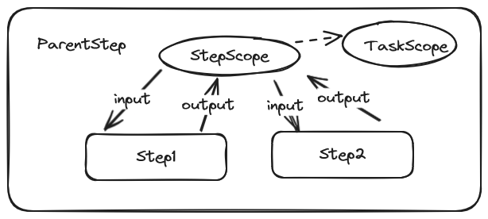

# 从零开始编写的下一代逻辑编排引擎

随着低代码概念和产品的流行，很多人都在考虑在自己的项目中引入逻辑编排的概念，将传统上通过手工硬编码生产的逻辑卸载到某个可以灵活配置的逻辑编排引擎上。在本文中，我将介绍一下Nop平台中的逻辑编排引擎NopTaskFlow的设计思想，分析一下NopTaskFlow的设计在数学层面的必然性。在文章的最后我会解释一下为什么NopTaskFlow是下一代逻辑编排引擎，这个所谓的下一代具有什么典型特征。

## 一. 逻辑编排到底在编排什么？

当我们使用传统的编程语言和编程框架进行编程时，本质上是在遵循语言所定义的某种约束规范，也可以看作是某种**最佳实践**。但是当我们自己从零开始编写一个非常灵活、非常底层的逻辑组织框架时，很容易就会打破此前语言内置的形式规范，从而偏离隐含的最佳实践模式。

**可以灵活组织的最小逻辑单元是什么**？传统编程语言的回答现在很标准：函数。那么**函数有什么本质性特征**？

1. 函数具有明确定义的输入和输出

2. 函数可以进行嵌套调用

3. 函数中使用的变量具有复杂的词法作用域

如果更进一步的研究函数的结构，我们还会发现更加复杂的特征，例如

1. 函数参数是传值还是传引用？callByValue? callByRef?callByName?

2. 是否支持函数式参数，也就是所谓的高阶函数？

3. 是否存在独立于返回值的异常处理机制？

4. 是否支持异步返回？

当然，还有最最重要的，**函数不仅仅是认知和组织逻辑的最小单元，还是我们进行抽象的最小单元**。**我们可以复用已有的函数来定义的新的函数**。

那么为什么函数会成为编程语言中最基本的逻辑组织单元，我们现在编写一个逻辑编排引擎的时候还需要基于函数抽象吗？有没有更好的抽象形式？为了搞清楚这个问题，我们有必要懂一点历史。

首先，我们需要清醒的意识到，**计算机编程语言中最初并没有函数概念**，函数概念的建立是一件不平凡的事情。

> ==== 以下为智谱清言AI的创作=====

**早期编程语言（1950s-1960s）**：

- **汇编语言**：在汇编语言中，函数的概念并不明显，程序员通常使用跳转指令来执行代码块。
- **Fortran**：在1955年发布的Fortran语言中，引入了子程序（subroutine）的概念，这可以看作是函数的早期形式。**但是Fortran中的子程序不支持返回值**。

**高级编程语言的兴起（1960s-1970s）**：

- **ALGOL 60**：在1960年发布的ALGOL 60中，引入了现代函数概念，支持返回值，并提出了块结构（局部变量作用域），这是编程语言发展中的一个重要里程碑。
- **Lisp**：在1958年开发的Lisp语言中，函数被视为一等公民，这意味着函数可以作为数据传递、存储和返回，这是函数式编程语言的核心特性。

**结构化编程（1970s）**：

* 结构化编程的概念最早由Edsger W.Dijkstra在1968年的论文[《Go To Statement Considered Harmful》](https://www.dcs.gla.ac.uk/~pat/cpM/choco4/nqueens/Goto-Harmful-Dijkstra.pdf)中提出，他主张通过限制或消除goto语句的使用来改善程序的结构。结构化编程的核心理念是将程序分解为模块化的部分，使用顺序、选择（if-then-else）和循环（while、for）等结构来控制程序的流程。
- **C语言**：1972年发布的C语言，深受Algol 68的影响，其函数定义简洁，支持递归调用，是第一批原生支持结构化编程概念的高级编程语言之一。C语言的流行极大地推动了结构化编程范式的普及。

> ==== 智谱清言的创作结束=====

后续的1980年代是面向对象的天下，函数的地位下降，变得从属于对象，在Java中我们甚至不能在类的外部单独定义函数。而在2000年以后函数式编程逐渐复兴，推动了不可变性和所谓无副作用的纯函数概念的普及。随着多核并行编程、分布式消息系统和大数据处理系统的盛行，函数的概念也在不断地扩展和深化，现代程序语言现在普遍标配async/await机制。

下面我们来分析一下函数概念所带来的隐含假定是什么。

**首先，函数是信息隐藏的一种必然结果**。**信息隐藏必然导致世界被区分为内部和外部**
，内部的小环境如果可以独立于外部存在（也就是说同样的函数可以在不同的外部环境中被调用，函数内部不需要感知到环境的变化），那么**内部和外部的关联一定被限制为只发生在边界上**。内部从外部获取的信息被称为Input，而外部从内部获取的信息被称为Output。边界的维度一般远小于系统整体结构的维度（类比三维球体的边界是二维的球面），这使得函数能提供降低外在复杂度的价值。

> * 如果在函数内部总是在读写全局变量，那么我们实际是在使用procedure抽象，而不是函数抽象。
> 
> * 服务化相当于是约定了Input和Output都是可序列化的值对象。

**第二，函数自动引入了如下因果顺序关系**：

1. 对表达式求值得到函数的Input参数

2. 执行函数

3. 接收到函数输出Output

在调用函数之前，Input的值就会确定下来，而**函数成功执行之后才会产生Output**
。如果函数调用失败，我们根本不会得到输出变量。特别的，如果一个函数具有多个输出的情况下，我们总是要么得到全部Output，要么没有得到Output，不会出现得到只观察到部分Output的情况。

> 现在有些逻辑编配框架会在步骤执行的过程中将一些中间结果暴露出来作为Output
> Endpoint，例如将循环过程中的循环下标暴露为一个Endpoint，在循环的过程中不断输出这种临时的Output，这种做法相当于是偏离了函数抽象。

**第三，函数内部拥有独立的变量作用域（名字空间）**。不管一个变量在函数外部叫做什么名字，它作为参数传递给函数之后，我们**在函数内部总是使用局部的输入变量名来指向它**。同时，函数内部使用的临时变量并不会被外部观测到。有名，万物之母。任何一种大规模的、系统化的复用，第一个要求就是避免名字冲突，必须使用局部名称。

**第四，函数组合调用的时候，是通过当前的scope来间接实现信息传递**。例如

```
 output = f(g(input))
 // 实际对应于
 output1 = g(input)
 output = f(output1)
```

一个变量必须存在于一个scope中。当函数`g`返回的时候，它内部的scope在概念层面就被销毁了，而执行函数`f`之前，它内部的scope还不存在，所以函数`g`的返回值一定是先被存放在外部的scope中，然后再转发给函数f。

**第五，函数意味着配对的双向信息流**。我们都知道goto是有害的，因为goto往往是一去不复返，只有天知道它什么时候才会goback，会goback到哪里。但是函数是一种非常自律的、可预测性极强的信息流组织。Input向函数传递信息，然后**Output一定会返回，而且会在原先的调用点返回**（也就是说goto和goback是在数学意义上严格配对的）。传统程序语言中函数调用是同步调用，它带有阻塞语义，会自动阻塞当前的执行指令流（相当于是程序世界的时间线）。对于异步调用而言，函数调用返回并不意味着Output可用，因此只能使用回调函数来处理逻辑依赖关系，导致出现所谓的嵌套回调地狱。现代编程语言中的async/await语法相当于是为异步函数也补充了阻塞语义，使得源码中的函数调用顺序仍然可以被看作是时间线演进的顺序。

> 在分布式架构下最灵活的组织方式无疑是事件发送和监听，本质上它是单向信息传递，与goto有异曲同工之妙。灵活是灵活了，但是代价是什么？

### 迷失在历史中的先贤真言

正所谓人类从历史中学到的唯一教训就是人类无法从历史中学到任何教训。二十年就是一代人，下一代人面对新的问题时会忘记前人的智慧，一切仍然从拍脑袋开始。

goto是不好的，结构化编程是好的，这是我们从学习编程就被灌输的理念，但是为什么？如果在面试中问起，相信很多程序员都能侃侃而谈，甚至援引到图灵奖得主Dijkstra的经典论文[《Go To Statement Considered Harmful》](https://www.dcs.gla.ac.uk/~pat/cpM/choco4/nqueens/Goto-Harmful-Dijkstra.pdf) （这也是Dijkstra最著名的论文）。但是有多少人真正认真的读过这篇论文？反正我自己是很早就知道这篇论文，但从未认真读过。直到最近我真的去读了，才发现Dijkstra反对goto的理由与我们自己脑补的根本不一样，我们早已经把Dijkstra的智慧遗忘得干干净净。

在这篇论文的一开始，Dijkstra开宗明义的就说到自己早就观察到goto语句会损害软件质量，但直到最近他才找到一个科学意义上能够解释为何如此的原因。

> The unbridled use of the go to statement has an immediate consequence that it becomes terribly hard to find a
> meaningful set of coordinates in which to describe the process progress.

> a programmer independent coordinate system can be maintained to describe the process in a helpful and manageable way.

Dijkstra论文的核心思想是如果我们按照结构化编程的思想去写代码，那么我们的代码文本就会构成一个**客观存在的坐标系统（独立于Programmer）**，借助于这个坐标系统，我们可以在思维中直观的将静态程序（在文本空间中展开）和动态过程（在时间中展开）之间建立对应关系，而goto会破坏这种可以自然存在的坐标系统。

> ==== 以下是KimiChat AI的总结===

这个所谓坐标系的坐标指的是用来唯一确定程序执行状态的一组值。

1. **文本索引（Textual Index）** 。当程序仅由一系列指令串联组成时，可以通过指向两个连续动作描述之间的某个点来确定一个“文本索引”。这个索引可以看作是程序文本中的位置，指向程序中的一个具体语句。在没有控制结构（如条件语句、循环语句等）的情况下，文本索引足以描述程序的执行进度。

2. **动态索引（Dynamic Index）**。 当程序中引入了循环（如`while`或`repeat` 语句）时，单一的文本索引就不再足够了。循环可能导致程序重复执行相同的代码块，因此需要额外的信息来追踪当前循环的迭代次数，这就是所谓的“动态索引”。动态索引是一个计数器，记录当前循环迭代的次数。

3. **程序执行的描述**。 程序的执行状态不仅取决于程序文本中的位置（文本索引），还取决于程序执行的动态深度，即当前嵌套调用的层数。因此，程序的执行状态可以通过一系列文本索引和动态索引的组合来唯一确定。

> == KimiChat AI的创作结束===

可逆计算理论可以看作是对Dijkstra这个坐标系思想的进一步深化。**使用领域特定语言(DSL)我们可以建立领域特定的坐标系（而不仅仅是一个通用的、客观存在的坐标系），而且不仅仅是用于理解，我们可以更进一步，在这个坐标系统上定义可逆差量运算，真正的把这个坐标系统利用起来，将它用于软件构造过程**。

NopTaskFlow的设计遵循了Nop平台XDSL的通用设计，每个step/input/output都具有name属性作为唯一标识，从而形成一个完全领域坐标化的逻辑描述。我们可以使用`x:extends` 算子继承一个这样的描述，然后利用Delta差量机制对它进行定制修改。

需要指出的是，NopTaskFlow中假定了Input和Output都是单个的具有确定性的值，而不是可以不断产生item的流(Flow)对象。流的问题要更加复杂，与上一节的函数概念分析也存在冲突之处，在Nop平台的规划中是通过NopStream框架来完成建模。

如果从坐标系的角度去考虑，我们可以认为**流系统引入了一种特殊的假定：空间坐标冻结，而时间坐标在流动（空间坐标确定了流系统的拓扑）**。这种特殊的假定带来一种特殊的简化，因此它也值得写一个特殊的框架去充分发掘这个假定的价值。

## 二. 最小逻辑组织单元 TaskStep

NopTaskFlow的设计目标是提供一种**支持差量运算的结构化逻辑分解方案**，贴近编程语言中的函数概念无疑是一种最省心的选择，而且如果未来需要高性能编译执行，也更容易将编排逻辑翻译为普通的函数实现代码。

NopTaskFlow中的最小逻辑组织单元是所谓的TaskStep，它的执行逻辑如下图所示：



```javascript
for each inputModel
   inputs[inputModel.name] = inputModel.source.evaluate(parentScope)

outputs = await step.execute(inputs);

for each outputModel
   parentScope[outputModel.exportAs] = outputs[outputModel.name]
```

在概念层面上非常类似于一般程序语言中的函数调用：

```javascript
var { a: aName, b: bName} = await fn( {x: exprInput1, y: exprInput1} )
```

我们来看一个顺序调用的具体实例：

```xml
<sequential name="parentStep">
  <input name="a"/>
  <steps>
    <xpl name="step1">
      <!-- 步骤中使用的变量信息需要通过input传入，子步骤并不会直接使用父步骤中的变量 -->
      <input name="a"/>
      <!-- source段的返回值类型如果不是Map，则会被认为是RESULT变量 -->
      <source>
        return a + 1
      </source>
      <!-- 输出变量可以动态计算得到。如果不指定source，则返回当前scope中对应名称的变量 -->
      <output name="a2">
        <source>a*2</source>
      </output>
    </xpl>

    <call-step name="step2" libName="test.MyTaskLib" stepName="myStep">
      <!-- 通过source段可以动态计算得到输入参数。RESULT对应于父scope中名为RESULT的变量 -->
      <input name="a">
        <source>RESULT + 1</source>
      </input>
      <!-- 返回到父scope的结果被重命名为b2 -->
      <output name="b" exportAs="b2"/>
    </call-step>
  </steps>
  <output name="b2"/>
</sequential>
```

TaskFlow内置了sequential/parallel/loop/choose/xpl/call-step等多种步骤类型，相当于是一种图灵完备的函数式编程语言。

> 具体步骤定义可以查看[task.xdef元模型定义](https://gitee.com/canonical-entropy/nop-entropy/blob/master/nop-xdefs/src/main/resources/_vfs/nop/schema/task/task.xdef)

上面的示例等价于如下代码

```javascript
var { RESULT, a2 } = function step1(a){
  return { RESULT : a + 1, a2: a*2}
}(a);

var { b: b2} = test.MyTaskLib.myStep({a: RESULT+1})
return { b2 }
```

* 步骤具有name属性，它在局部具有唯一性，但是并不要求全局唯一。这种局部名称是复杂步骤可以被复用的前提。
* xpl相当于是一种函数调用，它的source段执行结果如果不是Map结构，则被设置为RESULT变量
* output变量如果指定了source段，则表示动态执行表达式来构建返回值，否则按照名称从当前scope中获取返回值
* 成功调用step之后，会把output返回的结果设置到当前scope中
* 通过`call-step`可以复用已有的步骤定义
* input变量如果指定source段，则相当于是动态计算变量值，否则就按照name属性从当前scope获取
* output如果指定exportAs属性，则设置到父scope中时会重命名

TaskStep对应的接口定义如下所示：

```java
interface ITaskStep {
  String getStepType();

  List<ITaskInputModel> getInputs();

  List<ITaskOutputModel> getOutputs();

  CompletionStage<Map<String, Object>> execute(
    Map<String, Object> inputs, Set<String> outputNames,
    ICancelToken cancelToken, ITaskRuntime taskRt);
}
```

* TaskStep具有inputs和outputs的模型信息，相当于是一种反射元数据，可以通过它们获知函数的参数名和参数类型，返回变量名和返回变量类型等。
* 作为一种通用编排元件，TaskStep强制约定了多输入和多输出结构，所以inputs和outputs都是Map对象。
* **outNames提供了一种类似于GraphQL的结果数据选择能力**
  。在调用Step的时候我们就指定是否需要用到哪些返回变量。这样在步骤内部实现时，可以选择性的进行性能优化，对于不需要返回的复杂计算可以直接跳过。
* TaskStep缺省支持异步执行，同时通过**cancelToken提供了运行时取消的能力**。TaskFlow在运行的时候会自动添加await语义，自动等待前一个step结束。
* ITaskRuntime是整个任务执行过程中共享的全局信息，包括TaskScope等。

如果需要扩展TaskFlow，最简单的方式是在NopIoC容器中注册一个`ITaskStep`接口的bean，然后通过如下语法调用

```xml
<simple bean="myStepBean">
  <input name="a1"/>
  <input name="a2"/>

  <output name="b1"/>
  <output name="b2"/>
</simple>
```

如果真的查看一下ITaskStep接口的定义，会发现它的实现要更加复杂一些：

```java
interface ITaskStep {
  // ...

  TaskStepReturn execute(ITaskStepRuntime stepRt);
}
```

* TaskStepReturn的作用是优化同步调用时的性能，并增加了步骤跳转和步骤挂起的能力。
* ITaskStepRuntime则是把函数参数统一管理起来，便于向下传递。

```java
interface ITaskStepRuntime {

  IEvalScope getEvalScope();

  ITaskStepState getState();

  ITaskRuntime getTaskRuntime();

  ICancelToken getCancelToken();

  Set<String> getOutputNames();

  default boolean needOutput(String name) {
    Set<String> names = getOutputNames();
    return names == null || names.contains(name);
  }

  default Object getValue(String name) {
    return getEvalScope().getValue(name);
  }

  default void setValue(String name, Object value) {
    getEvalScope().setLocalValue(name, value);
  }

  default Object getResult() {
    return getLocalValue(TaskConstants.VAR_RESULT);
  }
}
```

**ITaskStepRuntime除了包含所有步骤外部传入的参数之外，还暴露了内部的状态信息**
，额外提供了IEvalScope和ITaskStepState变量。其中ITaskStepState是步骤实例的持久化状态信息，可以用于实现实现类似Coroutine的suspend/resume机制。

IEvalScope是步骤内部的变量作用域，它通过父子关系构成了类似词法作用域的作用域链。当从scope中读取变量的时候，如果在当前scope中没找到，就会自动向上到父scope中去找。一般情况下stepScope的父是TaskScope，也就是说在当前步骤的变量作用域中查找不到的话，会在共享的任务级别的变量作用域中查找，并不会在父步骤的scope中查找，**除非步骤实例上设置了`useParentScope=true`。useParentScope允许在父步骤的scope中查找，从而实现类似函数闭包的效果**。

```xml
<sequential name="parentStep">
  <input name="a"/>

  <steps>
    <!-- 如果设置了useParentScope=true，则不需要声明input
          就可以直接读取父scope中的变量a
    -->
    <xpl name="step1" useParentScope="true">
      <source>
        return a + 1
      </source>
    </xpl>
  </steps>
</sequential>
```

## 三. 比函数更强的是包装后的函数

如果逻辑编排的对象就是普通的函数，那它和手写代码有什么区别？除了把AST抽象语法树可视化之外，逻辑编排还能做点更有价值的事情吗？可以，我们可以升级一下编排的对象。

**参与编排的可以不是一穷二白的裸函数(Naked Function)，而是被重重修饰过的富函数（Rich Function）**。

> 在我们的宇宙中，基本粒子如夸克和电子本身并没有静止质量，但是它们浸泡在无处不在的希格斯场中，被希格斯场所拖拽（修饰），从而使得我们观测到的重整化电子产生了所谓的有效质量。

在现代的面向对象程序语言中，注解（Annotation）机制基本已经成为标配，甚至发展到了某种近乎泛滥的程度。很多程序框架的主要工作就是不辞辛苦的将执行逻辑都搬迁到注解处理器中。

```javascript
  // 示例函数由智谱清言AI生成 
    @GetMapping("/example/{id}")
    @Cacheable(value = "examples", unless = "#result == null") // 缓存响应结果
    @Retryable(value = {Exception.class}, maxAttempts = 3, backoff = @Backoff(delay = 1000)) // 重试策略
    @Transactional(readOnly = true) // 声明事务为只读
    @Secured({"ROLE_ADMIN", "ROLE_USER"}) // 权限注解，限制访问权限
    @RateLimiter(key = "exampleService", rate = "5/minute") // 限流注解
    @Fallback(ExampleServiceFallback.class) // 服务降级注解
    @AuditTrail // 自定义注解，用于记录操作日志
    public Example getExampleById(@PathVariable("id") Long id) {
        // 业务逻辑处理
        return exampleRepository.findById(id);
    }
```

函数注解的作用本质上就是利用类似AOP的机制对原始函数进行增强，在框架中，我们最终使用的一般都是经过Interceptor包裹的增强函数。实际上，在服务层，我们很少会使用一个没有任何注解的裸函数。

在函数式编程领域，也存在一种类似AOP增强的函数增强机制，称为代数效应(Algebraic Effect)。

```python
// 示例代码由智谱清言AI生成
def log(message):
    perform print(message)

def handlePrint(effect):
    if effect == "print":
        return lambda message: println(message)

withHandler handlePrint:
    log("Hello, world!")
```

在log函数中，perform print(message)表示产生一个print效应，但是它不会立即执行打印操作。相反，它将这个效应请求委托给当前作用域内的处理程序。
withHandler将处理程序handlePrint绑定到当前的代码块上。当我们调用log("Hello, world!")时，它会产生一个print效应，这个效应会被handlePrint处理程序拦截，并执行打印操作。**`perform print`的作用相当于是定义了一个定位坐标，然后withHandler会定位到这个坐标处，将它替换为增强后（往往带有副作用）的函数**。

NopTaskFlow中所有Step的元模型都继承自如下基础结构，相当于是允许添加一些共性的修饰。

```xml
<xdef:define xdef:name="TaskStepModel" executor="bean-name" timeout="!long=0"
             name="var-name" runOnContext="!boolean=false" ignoreResult="!boolean=false"
             next="string" nextOnError="string">
  <input name="!var-name" xdef:name="TaskInputModel" type="generic-type" mandatory="!boolean=false"
         fromTaskScope="!boolean=false" xdef:unique-attr="name">
    <source xdef:value="xpl"/>
  </input>

  <output name="!var-name" xdef:name="TaskOutputModel" toTaskScope="!boolean=false" type="generic-type"
          xdef:unique-attr="name" exportAs="var-name">
    <source xdef:value="xpl"/>
  </output>

  <when/>
  <validator/>

  <retry/>
  <catch/>
  <finally/>

  <throttle/>

  <rate-limit/>
  <decorator name="!string"/>
</xdef:define>
```

* executor: 在指定的线程池上执行

* timeout: 整个步骤的超时时间，如果超时在自动取消，抛出NopTimeoutException

* runOnContext: 投递到IContext的任务队列中执行，可以确保不会并行处理

* ignoreResult: 忽略RESULT返回值，不把它更新到父步骤的scope中。有时需要加入一些日志步骤，设置这个属性可以避免影响原先的运行上下文

* next: 执行完本步骤之后会自动跳转到指定步骤

* nextOnError: 执行本步骤失败的时候跳转到指定步骤

* when: 满足判断条件之后才会执行本步骤，否则直接跳过

* validator：对Inputs变量进行验证

* retry: 如果步骤失败，可以按照指定的重试策略进行重试

* catch/finally：捕获步骤异常进行一些额外处理

* throttle/rate-limit：控制执行速率

* decorator: 在NopIoC中可以注册自定义的decorator

```java
interface ITaskStepDecorator {
  ITaskStep decorate(ITaskStep step, TaskDecoratorModel config);
}
```

## 四. 考不上三本也能实现Coroutine

SpringBatch是Spring生态中用于批处理任务的一个逻辑编排框架。它针对批处理任务的可恢复（recoverable）的要求提供了从失败点重启的功能。在概念层面上，SpringBatch支持如下调用:

```javascript
try {
    JobExecution execution = jobLauncher.run(job, jobParameters);
} catch (Exception e) {
    e.printStackTrace();
}
// 修复报错问题之后，如果job尚未执行完毕，我们可以再次用同样的参数去执行job，
// 它会自动从上次中断处继续执行
jobLauncher.run(job, jobParameters);
```

Job执行报错时会抛出异常，中断执行。如果我们修复了报错的问题，则可以重新执行Job，它会自动定位到上次中断的地方，继续向下执行。在概念层面上，SpringBatch中的Job可以被看作是一种“可以暂停和恢复执行”的函数。在学术领域，**对于具有暂停（中断）和恢复（继续执行）的能力的函数有一个专门的术语，这就是所谓的协程（Coroutine）**。只不过，SpringBatch中的Job是因为发生异常被动暂停的，而一般化的协程概念支持程序在执行过程中主动暂停，让出控制权。

现代的程序语言，如JavaScript/Python/Kotlin/C#/Go/Swift/Lua/Ruby/Rust等，都内置了协程或者等价的概念。async/await语法本质上就是一种协程，它是出现异步调用的时候主动暂停。

> JDK21中也已正式加入了协程支持

有些人将协程理解为轻量化的用户空间的线程，但实际上这只是协程概念的一种具体应用而已。根据维基百科的定义

> Coroutines are computer program components that generalize subroutines for non-preemptive multitasking, by allowing
> multiple entry points for suspending and resumingexecution at certain locations.

显然协程是一个比线程概念应用更广泛、更加细粒度的概念。

### JavaScript中的Coroutine

下面我们来看一下JavaScript语法中的Generator函数，它本质上就是一种协程机制。

> === 以下是智谱清言AI的创作====

下面是一个使用 JavaScript Generator 函数演示循环的最简单示例。这个示例中的 Generator 函数将遍历一个数字数组，并在每次迭代中产生一个数字。使用 `yield` 关键字，我们可以在每次迭代后暂停函数的执行，并在下次调用 `next()` 方法时继续执行。

```javascript
// 定义一个 Generator 函数
function* generateNumbers() {
  // 使用 for 循环遍历数字数组
  for (let i = 0; i < 5; i++) {
    // 使用 yield 关键字暂停函数执行，并产生当前的数字 i
    yield i;
  }
}
// 调用 Generator 函数，得到一个遍历器对象
const iterator = generateNumbers();
// 使用 next() 方法手动遍历 Generator 函数的每个状态
console.log(iterator.next()); // { value: 0, done: false }
console.log(iterator.next()); // { value: 1, done: false }
console.log(iterator.next()); // { value: 2, done: false }
console.log(iterator.next()); // { value: 3, done: false }
console.log(iterator.next()); // { value: 4, done: false }
console.log(iterator.next()); // { value: undefined, done: true }
```

在上面的代码中，`generateNumbers` 是一个 Generator 函数，它包含一个 for 循环，循环从 0 到 4。在每次迭代中，`yield i` 会产生当前的数字 `i`，并暂停函数的执行。
当我们调用 `generateNumbers()` 时，它并不立即执行，而是返回一个遍历器对象。我们可以通过调用这个对象的 `next()` 方法来手动遍历 Generator 函数的每个状态。每次调用 `next()`，Generator 函数都会从上次 `yield` 表达式的地方继续执行，直到遇到下一个 `yield` 或函数结束。
`next()` 方法的返回值是一个对象，其中 `value` 属性是当前 `yield` 表达式的值，`done` 属性是一个布尔值，表示是否已经遍历完成。当 `done` 为 `true` 时，表示 Generator 函数已经执行完毕，`value` 属性将是 `undefined`。
通过这个示例，我们可以看到 Generator 函数的暂停和继续执行的概念。`yield` 关键字用于暂停函数的执行，并将一个值传递给 `next()` 方法的调用者。调用 `next()` 方法时，函数会从上次暂停的地方继续执行。这个过程可以重复进行，直到 Generator 函数执行完毕。

> ====智谱清言的创作结束===

### TaskFlow对Coroutine的实现

“可以暂停和恢复执行的函数”这一概念，表面上看起来非常简单，实际实现起来那也是一点都不复杂。根据vczh（梅启铭）的研究，[考不上三本也能给自己心爱的语言加上Coroutine](https://zhuanlan.zhihu.com/p/25964339)。

仔细回想一下Dijkstra的论文，他指出结构化编程会自动引入一个坐标系，在这个坐标系中只需要知道少数几个坐标值，就可以精确定位到程序运行时空间中的一个执行状态点。那么，如果要实现函数的暂停和恢复，**只需要想办法把这几个坐标记下来，然后再提供一个跳转到指定坐标处的机制**就可以了。

一般程序语言内置的Coroutine需要最大化运行性能，必须充分利用语言运行时的执行堆栈信息等，所以实现逻辑看起来有些云山雾绕，貌似很高级，实则是因为所处层次太低级（更接近机器码层级）导致的。

NopTaskFlow内置了类似Coroutine的机制，利用它可以实现批处理任务的失败重启。因为是使用高级语言结构实现，也不用特别考虑极限性能，所以具体的实现方案非常简单，考不上高中都可以理解。首先我们来看一个循环如何实现suspend和resume。

```javascript
for (let i = 0; i < 5; i++) {
    executeBody();
}
```

中断/重启的困难在于这个循环中用到了一些临时的状态变量，比如上面的`i`。当我们中断执行的时候会丢失这些临时状态信息，那自然也就无法恢复执行。所以，**实现Coroutine的第一步是将所有的临时变量都搜集起来，转换成某个类的成员变量**。这样就可以把这些内部的状态信息暴露给某个外部的管理者。

```java
class LoopNTaskStep extends AbstractTaskStep{
     public TaskStepReturn execute(ITaskStepRuntime stepRt) {
        LoopStateBean stateBean = stepRt.getStateBean(LoopStateBean.class);
        if (stateBean == null) {
            stateBean = new LoopStateBean();
            // 初始化循环变量
            int begin = ConvertHelper.toPrimitiveInt(beginExpr.invoke(stepRt), NopException::new);
            int end = ConvertHelper.toPrimitiveInt(endExpr.invoke(stepRt), NopException::new);
            int step = stepExpr == null ? 1 : ConvertHelper.toPrimitiveInt(stepExpr.invoke(stepRt), NopException::new);

            if (step == 0)
                throw TaskStepHelper.newError(getLocation(), stepRt, ERR_TASK_LOOP_STEP_INVALID_LOOP_VAR)
                        .param(ARG_BEGIN, begin).param(ARG_END, end).param(ARG_STEP, step);

            stateBean.setCurrent(begin);
            stateBean.setEnd(end);
            stateBean.setStep(step);
            stepRt.setStateBean(stateBean);

        }

        do {
            if (!stateBean.shouldContinue()) {
                return TaskStepReturn.RETURN_RESULT(stepRt.getResult());
            }

            if (varName != null) {
                stepRt.setValue(varName, stateBean.getCurrent());
            }
            if (indexName != null) {
                stepRt.setValue(indexName, stateBean.getIndex());
            }

            TaskStepReturn stepResult = body.execute(stepRt);
            if (stepResult.isSuspend())
                return stepResult;

            // 处理同步返回的情况
            if (stepResult.isDone()) {
                stateBean.incStep();
                stepRt.setBodyStepIndex(0);
                stepRt.saveState();

                stepResult = stepResult.resolve();
                if (stepResult.isEnd())
                    return stepResult;
                if (stepResult.isExit())
                    return RETURN_RESULT(stepRt.getResult());
            } else {
                // 处理异步返回的情况，这里省略一些实现代码
            }
        } while (true);
}
```

上面是NopTaskFlow中对于`loop-n`步骤的实现，大致上相当于做如下改造:

```javascript
  while(state.index < state.end)
      executeBody(state.bodyStepIndex, state)
      state.index += state.step
  }
```

除了index,end等临时变量（动态坐标）之外，stateBean中还需要记录当前body执行到哪一行这样的静态坐标信息。总之，只要记录下足够多的坐标信息，支持我们唯一确定当前执行状态点即可。

在NopTaskFlow的实现中，“跳转到指定坐标点”的做法也非常简单。就是**从根节点开始执行，发现不是目标坐标点就直接跳过，直到找到目标坐标点为止**。

> 单点定位可以被实现为扫描+过滤。

## 五. 数据驱动的图模式
NopTaskFlow的`sequential`、`loop`等步骤相当于是模拟了过程式编程语言中的函数运行过程。此时，函数之间是通过**位置关系**形成隐式关联关系，也就是说当一个步骤执行完毕之后，我们会找到它的后续位置处的步骤继续执行。这里所说的位置，就是在源码层面可以确定的一组坐标，所以过程式的执行可以看作是一种**坐标驱动**的运行模式。

虽然NopTaskFlow提供了parallel步骤，可以实现一种结构化的并行处理（这里所谓的结构化指的是并行执行的步骤在执行完毕后会自动执行join操作得到最终汇总后的返回结果）。

## 六. TaskFlow与行为树(Behavior Tree)的区别

行为树是游戏AI领域常用的一种逻辑编排方案。著名的游戏设计引擎Unity就支持行为树的插件。应该说，NopTaskFlow的设计也受到了行为树的直接影响，以至于它可以直接表达行为树的逻辑。

关于行为树的介绍可以参考如下文章：

* [行为树入门教程](https://zhuanlan.zhihu.com/p/463182588)

* [行为树的理论与实践入门](https://zhuanlan.zhihu.com/p/611393851)

我们也可以利用AI快速学习一下。如果你问智谱清言AI: 什么是行为树？回答限制在100个字以内。它会回复：

**行为树是一种用于模拟和控制人工智能(AI)行为的图形化编程范式，它将复杂的行为分解为一系列简单的任务和条件，并通过树状结构组织这些任务。每个节点代表一个动作或条件判断，AI通过从根节点遍历至叶节点来选择和执行行为**。

> *AI每次回复的内容是随机的，需要自己从中进行挑选。也可以一次性让它返回五个不同的回复。*

然后可以问它更详细的介绍，并举例说明

> ===以下为智谱清言AI的创作===

行为树（Behavior Tree）是人工智能领域中使用的一种用于描述和控制机器人或虚拟角色行为的算法。它是一种层次化的图形化工具，能够清晰地表示复杂的决策逻辑，并易于理解和修改。
行为树由节点组成，主要分为以下几种类型：

1. **控制节点（Control Nodes）**：控制节点的子节点的执行逻辑。常见的控制节点包括：
- **选择节点（Selector）**：它的子节点会被顺序评估，直到找到一个可以成功执行的孩子节点。
- **顺序节点（Sequence）**：它的子节点会按顺序执行，如果某个子节点执行失败，整个顺序节点就会失败。
- **并行节点（Parallel）**：它的子节点会同时执行，根据需要的条件（如所有子节点成功或只需部分成功）来决定整个并行节点的成功或失败。
2. **执行节点（Action Nodes）**：执行节点代表具体的行为或动作。例如，移动到一个位置，攻击敌人等。
3. **条件节点（Condition Nodes）**：条件节点用于检查某个特定的条件是否满足，它通常返回成功或失败。
   行为树通过组合这些节点来构建决策逻辑。它具有以下优点：
- **模块化**：行为树的结构允许开发者将复杂的行为分解成小的、可重用的模块。
- **灵活性和可扩展性**：可以很容易地通过添加或修改节点来调整行为。
- **清晰性**：行为树提供了一种直观的方式来观察和理解角色的行为逻辑。
- **易于调试**：在执行过程中，可以清楚地看到每个节点的状态，便于调试和优化。
  行为树广泛应用于游戏AI、机器人控制、自动化系统等领域。

以下是一个简单的行为树例子，用于控制一个虚拟角色在游戏中寻找并收集资源的行为。

```
Selector
├── Sequence
│   ├── Condition: "检查资源列表是否为空"
│   ├── Action: "选择最近的资源"
│   └── Sequence
│       ├── Action: "移动到资源位置"
│       └── Action: "收集资源"
│
└── Action: "巡逻"
```

在这个行为树中，我们有一个选择节点（Selector）作为根节点，它包含两个子节点：一个顺序节点（Sequence）和一个动作节点（Action）。

1. **选择节点（Selector）**：首先评估第一个子节点（顺序节点），如果该子节点失败，则评估第二个子节点（巡逻动作）。

2. **顺序节点（Sequence）**：这个节点包含三个子节点，它们会按顺序执行：
- **条件节点**：检查当前资源列表是否为空。如果资源列表为空，条件失败，整个顺序节点失败，进而导致选择节点评估下一个子节点。

- **动作节点**：选择最近的资源，并将其设置为当前目标。

- **顺序节点**：这个内部顺序节点包含两个动作节点：
  
  - **移动到资源位置**：角色移动到选定的资源位置。
  - **收集资源**：角色执行收集资源的动作。
3. **动作节点（巡逻）**：如果顺序节点失败（比如没有找到资源），角色将执行巡逻动作。
   这个行为树的基本逻辑是：如果角色知道有资源可以收集，它会尝试移动到资源位置并收集它；如果没有资源可收集，角色将执行巡逻动作。通过这种方式，行为树可以确保角色始终有事情做，并根据当前游戏状态动态调整行为。

> ===智谱清言创作结束===

使用NopTaskFlow我们可以用一种一比一的方式实现以上行为树的逻辑。

```xml
<task>
  <steps>
    <selector name="actions">
      <steps>
        <sequential name="step1">
          <steps>
            <exit name="检查资源列表是否为空">
              <when>
                <agent:检查资源列表是否为空/>
              </when>
            </exit>

            <xpl name="选择最近的资源">
              <source>
                <agent:选择最近的资源/>
              </source>
            </xpl>

            <sequential>
              <steps>
                <xpl name="移动到资源位置">
                  <source>
                    <agent:移动到资源位置/>
                  </source>
                </xpl>

                <xpl name="收集资源">
                  <source>
                    <agent:收集资源/>
                  </source>
                </xpl>
              </steps>
            </sequential>
          </steps>
        </sequential>
        <xpl name="巡逻">
          <source>
            <agent:巡逻/>
          </source>
        </xpl>
      </steps>
    </selector>
  </steps>
</task>
```

* 行为树要求它的节点总是返回当前执行状态，它具有三个可能的值：成功（Success）、失败（Failure）和运行中（Running）。NopTaskFlow的步骤节点返回类型为TaskStepReturn，它提供了判断函数可以区分出行为树所要求的三种状态。同时，TaskStepReturn还支持返回`CompletionStage`异步对象，可以触发异步回调。

* NopTaskFlow内置了`selector`步骤，可以直接表达行为树的选择节点功能。

* NopTaskFlow的`exit`步骤用于退出当前顺序执行序列，结合`when`装饰器，可以起到行为树的`Condition`节点的作用。

* NopTaskFlow的parallel步骤可以表达行为树中的Parallel节点的功能。同时，parallel步骤还提供了aggregator配置，可以实现最简单的并行任务分解合并。

原则上使用行为树能够表达的逻辑，使用NopTaskFlow都可以表达，而且因为NopTaskFlow的步骤内置了timeout/retry等修饰功能，在表达常见逻辑的时候嵌套层级数比行为树要更少，表达更加紧凑。

> 行为树的一个优点是所有逻辑都直观可见。NopTaskFlow可以考虑使用类似脑图的方式去显示，使用脑图中常用的图标、标签等表达各种步骤修饰功能，而不必一定要把这些信息展现为一个节点。

行为树主要应用于单个Agent的决策和行动过程，相当于是将决策树和行动序列编织在一起。在概念层面上，**Sequence相当于and(与)逻辑，而Selector相当于or(或)逻辑**。行为树的步骤更接近于Predicate抽象，只返回True/False（一般还会更新全局上下文），并不支持更通用的返回值类型。NopTaskFlow建立在更一般化的函数抽象上，包含了行为树的功能，但是在实现层面上，它并没有针对游戏AI应用场景进行优化。

## 七. TaskFlow与工作流(Workflow)的区别

## 八. 为什么说是下一代

说NopTaskFlow是下一代逻辑编排引擎，可能有些人会不服气：我看这个设计平平无奇，都是早已被反复实现过的东西，创新点在哪？别急，这里的下一代指的不是它的功能多，也不是性能高，而是它基于下一代软件构造理论：可逆计算理论所构建，从而呈现出与现有的软件架构设计迥然不同的典型特征。
**这些特征是与逻辑编排本身无关的**。这里的逻辑是这样的：

1. 可逆计算是下一代软件构造理论

2. Nop平台是可逆计算指导下从零开始构建的下一代低代码开发平台

3. NopTaskFlow是Nop平台的一个组成部分，它自动继承了这个所谓下一代的特征

这是一件真正有趣的事情。

不是针对单个引擎构建，而是大量引擎共享结构共性。

差量化和元编程

为什么要将decorator从步骤的父节点独立出来，本质上还是要使得业务层面认知的坐标更加稳定。

信息最小化表达，描述式结构与运行时结构分离
