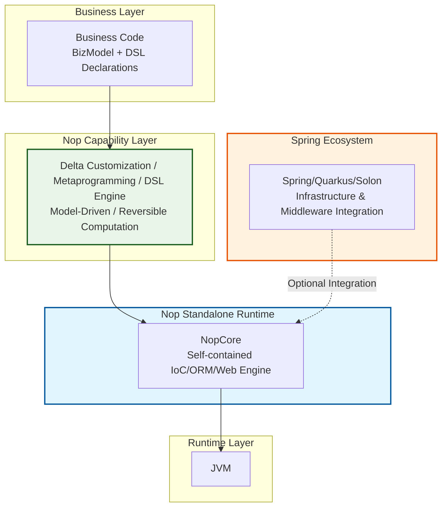

# 当复杂性被显式化：Nop平台的认知经济学

## 开篇：两个误解，一个真相

Nop平台（官网：https://nop-platform.github.io/）是一个基于可逆计算理论从零开始构建的新一代低代码开发平台。它的核心理念是通过DSL（领域特定语言）和差量定制机制，在保持与Spring等主流框架兼容的同时，显著降低软件开发的认知负担和本质复杂度。

初次接触Nop平台的开发者，常会问：“概念这么多，学习曲线会不会很陡？”

这个疑问背后，藏着一个最根本的误会：**很多人以为Nop是Spring的替代品，用了Nop就得放弃整个Java生态。**

两个误解叠加，让Nop的认知成本被系统性高估。

真相是：Nop基于可逆计算理论，通过**最小信息表达原则**和**统一代数结构**，构建了一个自相似、自洽的认知框架。更重要的是，它的架构定位是**叠加在Spring/Quarkus/Solon之上的能力增强层**，而非互斥替换品。

澄清这一点后，我们将从多个维度系统论证：**Nop的认知成本被显著高估，而其降低系统本质复杂性的能力，被严重低估。**

---

## 第零部分：先纠正那个最根本的误判——Nop是增强层，不是替代品

在展开任何技术论证之前，必须首先纠正那个最具破坏力的误判：Nop平台不是Spring或Quarkus的替代品，而是一个可以与它们协同工作的能力增强层。

### 0.1 架构定位：正交叠加，而非互斥替换

Nop平台的架构定位如下：



这张图说明了三个关键事实：

1.  **Nop拥有自己的核心引擎**：IoC、ORM、GraphQL引擎均为自研，遵循可逆计算理论，实现声明式、可差量定制的核心能力。
2.  **Nop运行在基础框架之上**：类加载、网络通信、线程管理、中间件集成——这些仍由Spring/Quarkus等负责。Nop通过轻量适配层与之集成，而非重新发明轮子。
3.  **Nop提供的是正交能力**：基础框架解决“如何集成组件”，Nop解决“如何用更优的范式构造软件”。两者解决的问题域正交，因此可以协同工作。你可以在Spring应用中引入Nop，也可以在Nop应用中引入Spring。

**采用Nop，是一个渐进式、可逆的决策。** 

### 0.2 采用路径：从零风险到逐步深入

```
阶段0：在现有Spring Boot项目中引入Nop依赖 → 不改任何代码，零风险
阶段1：对一个配置文件试用Delta定制 → 体验x:extends的差量合并，投入：半天
阶段2：对一个新模块使用XMeta + BizModel → 体验无DTO、无Controller的开发，投入：1-2天
阶段3：引入代码生成，从数据模型生成基础CRUD → 体验“生成+差量”永不冲突，投入：2-3天，收益开始显现
阶段4：根据需要逐步扩展 → 任何阶段都可停止，已有代码不受影响
```

### 0.3 工具的隐喻：从“锄头”到“多功能一体机”

将Nop平台与Spring等单一框架进行比较，就像用“锄头”来对比“多功能一体机”。锄头易于上手，功能专一，但当你需要挖地之外的功能（如钻孔、切割）时，它便无能为力，你必须去寻找并学习新的、独立的工具。而多功能一体机初看复杂，有很多功能部件，需要阅读说明书（理解核心概念），但当你用它来“挖地”（做CRUD）时，会发现它的自动化程度可能比专用锄头更高；当你遇到更复杂的任务（深度定制、代码生成）时，它提供了现成的、集成良好的工具，而无需临时拼凑一个杂乱的工具箱。Nop平台的初始学习成本，正是掌握一个强大、统一工具体系的“驾校培训费”。

**理解了这个架构定位之后，后续所有的技术分析才能被正确理解。** Nop不是要你放弃什么，而是在你已有的一切之上，增加一种新的能力。

---

## 第一部分：设计层面的“降维打击”——更优越的开发范式

讨论学习成本时，一个容易被忽略但更关键的前提是：**我们比较的应该是“解决同等复杂度问题的总成本”，而不是“在最简单场景下谁更轻”。**

Nop平台覆盖从简单CRUD到大型SaaS产品的完整复杂度谱系，它的“能力上限”确实很高；但这并不意味着“入门门槛”必须同样高。更准确的描述是：

- 对于简单问题，你可以只使用平台中最基础、最直观的一小部分能力（例如BizModel + 约定式URL），获得干净一致的开发体验。
- 当问题域复杂度上升，你再**按需解锁**Delta定制、模型驱动、编译期元编程等能力，让解决方案的结构复杂度与问题域复杂度**同构**，而不是靠堆叠胶水层硬扛。

这就引出另一个常被混淆的概念：

- **本质复杂性（Essential Complexity）**：业务规则本身的复杂度，任何技术都无法消除。
- **偶然复杂性（Accidental Complexity）**：由于工具碎片化、扩展机制不统一、信息冗余（DTO/映射/多套配置体系）等带来的额外复杂度。

传统技术栈在应对复杂场景时往往“被迫升级复杂度”：为了实现局部差异，追加一层一层的子系统、拦截器链、patch机制、DTO转换、脚手架后手改等，最终把偶然复杂性当成了“理所当然”。而Nop的主张是：在统一代数结构与最小信息表达原则的约束下，将变化表达为Delta，将推导发生在编译期，将最终形态物化为`_dump`，从而把大量偶然复杂性变成**可见、可定位、可压缩**的结构。

### 1.1 统一模型 vs. 模型冗余：显著减少DTO

大多数开发者习惯于传统框架的“分层隔离”设计哲学，这不仅带来了技术分层，也导致了模型定义的重复和繁琐的转换逻辑。

```java
// 传统Spring技术栈：不可避免的模型转换与冗余
@RestController
public class UserController {
    @GetMapping("/api/users")
    public List<UserDTO> getUsers() { // 1. 需要专门定义Web层DTO
        return userService.getUsers().stream()
                         .map(this::convertToDTO) // 2. 模型转换逻辑不可避免
                         .toList();
    }
    private UserDTO convertToDTO(User user) {
        // 3. 繁琐且易错的属性拷贝逻辑
        UserDTO dto = new UserDTO();
        dto.setId(user.getId());
        dto.setName(user.getName());
        return dto;
    }
}
```

认知负担在于**维护多套模型及其映射关系**：实体模型、API传输模型、持久化模型，以及它们之间的转换逻辑。

Nop平台通过统一的元数据驱动机制，**显著减少了这类冗余与重复劳动**。

```java
// Nop平台：一个模型，多处复用
@BizModel("User")
public class UserBizModel {
    @BizQuery
    public List<User> getUsers() { // 直接返回内部实体，无需DTO
        // 纯粹的业务逻辑，无需关心字段暴露或剪裁
        return daoProvider.daoFor(User.class).findAll();
    }
}
```

关键在于，平台通过 **`XMeta`元数据配置** 与 **GraphQL/REST的Selection机制**，自动完成了传统模式下需要手动完成的工作。例如，在`/model/User/User.xmeta`中可以声明：

```xml
<!-- /model/User/User.xmeta -->
<meta>
    <prop name="deptName" mapTo="department.name"/> 
    <prop name="password" published="false" /> 
</meta>
```

**认知优势**：开发者只需定义和维护核心业务实体，**在大量场景下可以显著减少DTO与模型映射**的繁冗工作。字段的暴露、过滤和权限控制通过声明式元数据统一管理，从而减少硬编码的转换逻辑。

### 1.2 统一约定 vs. 决策过载：终结API设计争论

传统RESTful设计面临持续的“决策过载”，团队需为URL结构、HTTP动词等非业务问题持续争论。

```java
// 传统RESTful：持续的决策疲劳
@RestController
public class UserController {
    // 需要为每个资源与方法反复决策：URL结构、HTTP动词等
    @PostMapping("/users/{id}/activate")   // RPC风格？是否违背REST原则？
    @PutMapping("/users/{id}/status")      // 或者用子资源？哪个更“正确”？
    // 团队内极易出现风格不一、难以维护的API设计。
}
```

Nop平台采用固定的URL模式`/r/{bizObjName}__{bizAction}`，体现了约定优于配置（CoC）的原则，**降低了长期认知负担**。

```java
// Nop：统一模式，直达本质
@BizModel("User")
public class UserBizModel {
    @BizMutation
    public void activate(@Name("id") String id) { ... } 
    // => 统一映射为：POST /r/User__activate
    // 规则简单、明确、一致，无需二次决策。
}
```

**认知优势**：

- **认知一致性**：所有服务入口遵循完全相同的定位逻辑，形成统一的团队心智模型。
- **零设计决策**：彻底消除关于URL风格、HTTP动词选用的技术争论，让开发者聚焦于业务逻辑本身。
- **架构可推导性**：高度统一的模式为自动化工具（如链路追踪、API网关、代码生成器）提供了完美的分析基础。

### 1.3 通用范式 vs. 特化工具：Delta的本质与价值

在Kubernetes生态中，Kustomize作为配置管理的差量工具被广泛接受，但其学习成本实际上高于Nop的Delta机制。让我们通过具体代码来直观对比：

#### **Kustomize的认知负担：需要掌握多种patch语法**

**场景**：在生产环境中，需要修改Deployment的副本数，**并从一组容器中删除名为"debug-tool"的sidecar容器**。

**基础配置 (`base/deployment.yaml`)**：
```yaml
apiVersion: apps/v1
kind: Deployment
metadata:
  name: my-app
spec:
  replicas: 1
  template:
    spec:
      containers:
      - name: app
        image: myapp:latest
      - name: debug-tool      # 需要在生产环境删除这个容器
        image: alpine:latest
        command: ["sleep", "3600"]
      - name: log-collector
        image: fluentd:latest
```

**Kustomize的解决方案：要么用脆弱的索引，要么重写整个containers数组**

```yaml
# kustomization.yaml - 生产环境定制
apiVersion: kustomize.config.k8s.io/v1beta1
kind: Kustomization

bases:
- ../base

# 方案一：使用patchesJson6902，但需要知道精确的数组索引（脆弱且易变）
patchesJson6902:
- target:
    group: apps
    version: v1
    kind: Deployment
    name: my-app
  patch: |-
    - op: remove
      path: /spec/template/spec/containers/1  # 假设debug-tool是第2个（索引1）
    # 问题：如果基础配置中容器的顺序发生变化，这个patch就失效了

# 方案二：使用patchesStrategicMerge来表达“删一个元素”时，常见写法会退化为重写/复制列表（更重也更容易遗漏）
- |-
  apiVersion: apps/v1
  kind: Deployment
  metadata:
    name: my-app
  spec:
    template:
      spec:
        containers:
        - name: app                # 必须完整复制所有保留的容器
          image: myapp:latest
        - name: log-collector       # debug-tool被手动删除
          image: fluentd:latest
        # 问题：即使只想删一个容器，也必须完整列出所有保留的容器
        # 如果基础配置新增了容器，这里会遗漏，导致意外删除
```

**Kustomize的认知负担清单**：
- 需要掌握两种完全不兼容的patch语法
- 删除指定对象时，要么依赖脆弱的数组索引，要么被迫完整重写整个集合
- 这些知识**仅限于K8s领域**，无法迁移到其他配置场景

---

#### **Nop Delta的认知优势：统一的差量语法**

**同样场景**：在生产环境中修改副本数，**并从容器列表中删除名为"debug-tool"的sidecar**。

**基础配置 (`base/app.yaml`)**：
```yaml
deployment:
  replicas: 1
  containers:
    - name: app
      image: myapp:latest
    - name: debug-tool      # 需要在生产环境删除
      image: alpine:latest
      command: ["sleep", "3600"]
    - name: log-collector
      image: fluentd:latest
```

**Nop Delta的解决方案：只表达差异**

```yaml
# prod.delta.yaml - 生产环境定制
x:extends: ../base/app.yaml

deployment:
  replicas: 3  # 修改副本数
  
  containers:
    - name: debug-tool
      x:override: remove  # 只标记要删除的容器，其他容器自动继承保留
```

**Nop Delta的认知优势**：
- 只需掌握`x:extends`（继承基础）和`x:override`（控制合并行为）
- **最小信息表达**：只写出要修改或删除的部分，其余自动继承
- **显式的删除语义**：`x:override=remove`明确标记要删除的对象
- 按xdef元模型中定义的唯一键定位（例如id/name等），不依赖索引位置，基础配置变化时delta依然有效
- **知识可迁移**：同样的机制适用于所有DSL（ORM、UI、API、工作流...）

---

### 对比分析：为什么Kustomize“被接受”而Nop Delta“被质疑”？

| 维度 | Kustomize | Nop Delta | 认知成本对比 |
|------|-----------|-----------|--------------|
| **从集合中删除对象的方式** | 依赖脆弱索引或完整重写 | 只标记要删除的对象，其余自动继承 | **Nop显著提升** |
| **信息表达效率** | 必须完整列出所有保留项 | 只写差异，符合最小信息原则 | **Nop显著提升** |
| **知识可迁移性** | 仅限于K8s领域 | 适用于所有DSL | **Nop极大提升** |
| **学习曲线** | 陡峭，需掌握多种不相关概念 | 平缓，一套机制通吃所有场景 | **Nop显著平缓** |

**结论**：当把“生态强制性”这个因素剥离后，Nop Delta的设计质量优势便清晰可见——它不仅更强大，而且**本质上更简单**。

### 1.4 复杂度不升级：在最恰当的粒度上解决问题

传统技术栈常常因为工具的限制，迫使开发者将一个微小的改动“升级”为一个复杂的解决方案。例如，为一个对象增加一个临时属性，可能被迫引入新的子类或使用无类型安全的Map，将一个**属性级别**的简单需求，硬生生**升级为对象级别**的复杂问题。这种因工具限制导致的“复杂度升级”是传统开发中隐性的巨大认知成本。

Nop的模型对象在设计上天然支持扩展。你可以通过一个极小的`Delta`，在**最需要的地方**为模型**局部地**增加一个扩展属性，而无需修改原始定义。复杂性被完美地控制在它应该在的地方。你**总可以在最适合的结构中承载信息**，而无需为了绕过技术限制而引入额外的、不必要的结构，然后再费力地将这些拼凑的结构整合在一起。这正是可逆计算公式`Y = F(X) + Δ`中差量Δ的威力——它允许在最精确的坐标点上注入变化，而不扰动整体。

从“认知成本”视角看，这一点的价值在于：**复杂度被分解到合适的粒度后，团队不必为一个小需求引入一整套新架构**；当需求真的变复杂时，再逐级提升抽象与工具强度，实现“复杂性匹配”。

---

## 第二部分：工程实现的证明——更少的代码，更强的能力

如果说设计层面的优雅还停留在理念，那么Nop在**工程实现**层面展现的优势，则为其正确性提供了无可辩驳的物理证据。

| 组件 | Nop体系 | 传统体系 |
|:---|:---|:---|
| IoC容器 | **NopIoC (≈5000行)** | SpringIoC |
| Web框架 | **NopGraphQL (≈5000行)** | SpringMVC |
| 分布式RPC | (内置于NopGraphQL) | Feign |
| ORM引擎 | **NopORM (≈20000行)** | JPA/MyBatis |
| 规则引擎 | NopRule | Drools |
| 报表引擎 | **NopReport (≈5000行)** | JasperReport |

这种效率优势源于两个系统性设计：

**第一，统一理论带来的复用。** 所有子系统共享同一套XDef元模型、Delta合并机制、Xpl模板引擎。传统技术栈中每个组件各自实现的扩展机制、配置解析等基础能力，在Nop中只需实现一次。这不仅避免了“胶水代码”和概念冗余，更重要的是——**学习一次，处处可用**。

**第二，元编程与模型驱动。** 通过“模型驱动+编译期元编程”，实现业务逻辑的自动生成与传播。高层模型中的概念可通过生成器自动传递到所有下游产物；需要定制时，Delta允许在精确位置注入变化。

最终体现出来的代码效率是系统性设计优势的必然结果：

- **更纯粹的IoC容器**：NopIoC回归声明式设计，**装载顺序不影响结果**，行为完全确定。原生支持通过Delta对Bean定义进行**覆盖甚至删除**。
- **更通用的Web与RPC框架**：NopGraphQL实现了SpringMVC+graphql-java+Feign的组合功能，且协议无关。
- **更强大的存储与报表引擎**：NopORM以**约2万行**实现JPA+MyBatis+SpringData核心功能，并原生支持多租户、逻辑删除等特性。NopReport以**仅5000多行**，实现了一个强大的中国式报表引擎。

**结论**：**更少的代码不仅意味着更低的维护成本和更少的Bug，它本身就是设计优越性的最终体现。**

---

## 第三部分：架构的显式化——`_dump`目录，可导航的系统蓝图

传统框架的复杂性往往隐藏在内存中、散布于日志里，形成一个难以捉摸的“隐形”架构。开发者需要通过阅读大量代码、文档，并在大脑中拼凑，才能形成对系统行为的完整心智模型。Nop平台通过一个极其简单而强大的机制，彻底颠覆了这一点：**所有可定制的模型，在启动时都会在`_dump`目录下生成其最终合并后的版本。**

这个`_dump`目录不是一个简单的调试输出，它是一个**完全显式化、可导航、自解释的系统最终架构蓝图**。

1.  **确定性的最终形态**：`_dump`下的文件，展示了模型在运行时的**最终、唯一、确定的形态**。无需猜测。
2.  **绝对精确的血缘追溯**：每个节点都包含溯源信息（`source`），精确指明来源。

```xml
<!-- _dump目录下的merged-app.beans.xml显示了每一个bean的原始定义位置和完整的autowire组装关系 -->
<beans x:schema="/nop/schema/beans.xdef">

    <!--LOC:[54:6:0:0]/nop/dao/beans/dao-defaults.beans.xml-->
    <bean id="nopHikariConfig" class="com.zaxxer.hikari.HikariConfig">
        <property name="connectionTimeout" 
		        value="@cfg:nop.datasource.connection-timeout|60000"
                ext:autowired="true"/>
        <property name="password" value="@cfg:nop.datasource.password|"/>
        <property name="username" value="@cfg:nop.datasource.username"/>
        <property name="jdbcUrl" value="@cfg:nop.datasource.jdbc-url"/>
    </bean>
    <!--LOC:[37:6:0:0]/nop/auth/beans/auth-service.beans.xml-->
    <bean id="nopLoginService" class="io.nop.auth.service.login.LoginServiceImpl">
        <property name="passwordEncoder" ref="nopPasswordEncoder"
                  ext:resolved-loc="[29:6:0:0]/nop/auth/beans/auth-core-defaults.beans.xml"/>
    </bean>
</beans>
```

3.  **自描述的DSL结构**：每个`_dump`文件的根节点通过`x:schema`指向其元模型定义文件（`.xdef`），**完整描述该DSL的所有合法元素及其含义**。

**认知突破**：

- **零运行时知识入门**：无需理解运行时机制，只需查看`_dump`目录，就能**局部化、精确地**理解系统任何部分的构成。
- **引导式定制**：先看`_dump`找到目标属性，通过`source`定位源文件，再通过`x:schema`查看元模型文档。整个过程如同**在拥有完美地图的城市中导航**。

**结论**：`_dump`将“黑箱”彻底变为“白箱”，将隐式的架构知识物化为**静态、可查询、自解释**的文件结构，从根本上降低了认知门槛。

---

## 第四部分：从隐式约定到显式规范——DSL的系统化设计

每个框架都有其隐含的领域模型，但这些模型往往并未被显式表达。例如SpringBoot的条件装配、JPA的实体注解等，背后都存在一套“框架自带的模型”，但它们通常不以独立、可检索、可校验的形式呈现。

这里真正推高学习成本的关键，并不是“学习成本更隐蔽/更显性”这种表层现象，而是**模型信息的可获取性与独立性**：在许多传统框架里，系统究竟“由哪些模型组成、这些模型最终长什么样、它们之间如何关联”，往往无法在**不运行引擎**的情况下被确定地获取。

具体表现为：

- **模型信息偏运行时**：大量信息只存在于启动装配/运行时推导的结果中（条件装配、扫描与回调、注解约定等），最终生效形态藏在内存图里，离线阅读源码与配置难以得到确定答案。
- **模型信息难汇总**：信息分散在注解、配置片段、约定规则、扩展点、第三方默认行为中，缺少一个“全景、可导航、可检索”的汇总视图。
- **模型缺乏独立性**：模型语义与引擎实现强绑定，导致模型难以被独立审阅、复用与迁移（很多时候只能“跑起来再看”）。
- **缺少独立元模型（schema）支撑理解与验证**：缺少可离线阅读、可机器校验、可被工具链消费的元模型，就难以在编码阶段建立确定性，也难以把团队知识沉淀为可复用资产。
  

Nop平台通过**XDef元模型语言**，将所有隐含模型显式化：

```xml
<!-- /nop/schema/xui/api.xdef -->
<api xmlns:x="/nop/schema/xdsl.xdef" x:schema="/nop/schema/xdef.xdef"
     xdef:name="UiApiModel" url="#!string" method="string" ...>
    <headers>xjson-map</headers>
    <data>xjson</data>
    <!-- 仅当满足条件的时候才触发 -->
    <sendOn>string</sendOn>
</api>
```

**显式DSL的认知收益**：

- **自描述性**：每个DSL元素都有明确的类型、约束和文档，开发者可以直接阅读元模型来学习DSL，无需反复查阅外部文档。
- **机器可验证**：IDE可以基于XDef提供精确的自动完成、语法检查和错误提示，将问题消灭在编码阶段。
- **工具链统一**：所有DSL共享同一套编辑、校验和生成基础设施，掌握一个DSL的经验可以无缝迁移到其他DSL。

更重要的是，Nop平台通过可逆变换，实现了多种格式（Excel/XML/YAML/JSON）之间的无损转换：

```markdown
<!-- 以ORM模型为例：系统支持Markdown <-> XML的双向可逆转换（示例风格参考：docs/tutorial/simple/14-add-dsl-loader.md） -->

## 实体定义：NopAiProject

- 表名: nop_ai_project
- 类名: NopAiProject
- 中文名: AI项目
- 备注: 存储AI项目基本信息

### 字段列表

|编号|标签|主键|非空|字段名|属性名|显示|中文名|类型|长度|字典|备注|
| --- | --- | --- | --- | --- | --- | --- | --- | --- | --- | --- | --- |
| 1 | seq | true | true | id | id | X | 主键 | VARCHAR | 36 |  |  |
| 2 |  | false | true | name | name |  | 项目名称 | VARCHAR | 100 |  |  |
```

上述Markdown内容可无损转换为等价的XML（ORM DSL）：

```xml
<?xml version="1.0" encoding="UTF-8"?>

<orm x:schema="/nop/schema/orm/orm.xdef" xmlns:x="/nop/schema/xdsl.xdef" xmlns:ext="ext" xmlns:ui="ui">
  <entities>
    <entity className="io.nop.ai.dao.entity.NopAiProject" displayName="AI项目"
            name="io.nop.ai.dao.entity.NopAiProject" tableName="nop_ai_project">
      <columns>
        <column code="id" displayName="主键" mandatory="true" name="id" precision="36" primary="true"
                stdDataType="string" stdSqlType="VARCHAR" tagSet="seq" ui:show="X"/>
        <column code="name" displayName="项目名称" mandatory="true" name="name" precision="100"
                stdDataType="string" stdSqlType="VARCHAR"/>
      </columns>
      <comment>存储AI项目基本信息</comment>
    </entity>
  </entities>
</orm>
```

**多格式支持的工程意义**：

- **工具链灵活性**：业务人员可以使用Excel进行批量编辑，开发人员使用YAML/XML/Markdown进行精细调整，版本控制系统选择最适合diff的格式。
- **协作效率**：不同角色可以在自己最熟悉的工具中工作，而平台保证了数据模型的一致性。

**认知优势**：DSL的显式化将框架的“潜规则”变成了“明文规定”，消除了学习过程中的猜测成本。统一的元模型和工具链创造了“学一用百”的认知复利——掌握一个DSL后，其他DSL自然理解。

---

## 第五部分：复杂度的系统化治理——从根源解决软件熵增

Nop之所以能实现“更少代码、更强能力”和“架构显式化”，根源在于其对复杂性的系统化治理。

### 5.1 隔离与转移：元编程作为复杂度的“治理者”

**传统元编程的困境**：每种技术都有自己的元编程模型——

| 技术栈 | 元编程模型 | 问题 |
|--------|-----------|------|
| Java APT | Element, TypeMirror, RoundEnvironment | 概念复杂，字符串生成 |
| Babel插件 | AST节点类型(上百种), Visitor模式 | 需理解编译原理 |
| Lisp宏 | 引用/反引用, gensym, 变量捕获 | 调试困难 |
| Velocity | 模板指令, 上下文变量 | 仅文本生成，无结构 |

**核心问题**：N套不兼容的模型，知识无法迁移，每次都要从头学习。


Nop的元编程不是炫技，而是治理复杂度的终极武器。它将系统的复杂性从“无序的、弥散的状态”转变为“有序的、集中的状态”，并严格隔离。

Nop实现了**元编程的平民化**，让元编程成为普通开发者都能理解和使用的工具：

- **核心理念**：元编程即“在编译期运行”。`#{...}`编译期表达式 vs `${...}`运行期表达式，清晰区分。
- **统一语言**：使用与业务代码相同的XLang/Xpl语言，唯一需要学习的是“何时运行”。
- **结构化生成**：Xpl模板直接输出`XNode`树，每个节点自带**绝对准确的源码位置信息**（`source`），彻底消除调试黑洞。

通过元编程，少数专家可以将分散的复杂性**收敛、封装**到可复用的Xpl模板中。对于使用者来说，他只是认为业务模型上内置了某项能力，却不知这背后是元编程的功劳。

**认知优势**：元编程将理解复杂性的成本严格**隔离**在少数专家身上，使整个开发团队的平均认知负担大幅降低。

### 5.2 平滑的复杂度阶梯：按需深入的渐进式学习

Nop构建了一条平滑的“复杂度爬坡”路径，确保**绝大多数开发者可以长期停留在低复杂度的舒适区**。

- **阶段1：基础使用者（80%）**：只需掌握`@BizModel`等注解。享受平台自动生成的成果。
- **阶段2：配置调优者（15%）**：开始学习`x:extends`等差量语法，对模型进行微调。
- **阶段3：元编程使用者（4%）**：学习Xpl模板和编译期表达式，编写简单的代码生成逻辑。
- **阶段4：平台扩展者（1%）**：深入理解可逆计算理论，定义新的DSL。

**结论**：这种分层设计，确保了**高级能力作为可选的“升级包”，仅在需要时才被少数人解锁**。

### 5.3 复杂度治理的配套设施：NopAutoTest

降低认知成本不仅依赖“把结构显式化”，也依赖“把行为可验证化”。`nop-autotest`提供与业务模型深度集成的自动化测试：**录制-回放（snapshot）**。

测试用例不再需要手工编写大量“准备数据+断言”的样板代码。引擎在**录制模式**下自动捕获可观测行为，沉淀为`_cases/`目录下的用例数据；在**验证模式**下自动用录制数据初始化环境，并比对结果。

**认知收益**：传统框架中需要靠经验和试错才能摸清的“隐式行为边界”，在Nop中被固定为可回放、可比对、可审计的快照，显著降低调试与回归验证成本。

---

## 第六部分：AI时代的结构性优势——被低估的契合

前五个部分的论证都建立在人类开发者的认知模型之上。但在AI辅助开发已成为现实的2025-2026年，Nop平台展现出一种新的**结构性优势**：它的设计特征恰好是AI最擅长处理的那类系统。

### 6.1 传统生态优势正在被AI重新定价

过去二十年，技术选型的隐含公式是：**框架价值 = 技术质量 × 社区规模 × 生态丰富度**。社区规模之所以权重极高，是因为开发者理解一个系统的主要途径是搜索Stack Overflow、阅读博客文章、请教有经验的同事。

AI正在使这个公式的权重发生根本性的位移：**AI时代的框架价值 = 技术质量 × AI可理解性 × 设计一致性**。AI不依赖Stack Overflow上是否有人问过同样的问题——它直接阅读源码、理解结构、推导行为。在这个新公式下：

- **社区规模的权重下降**：AI充当了“无限耐心、随时可用的专家社区”。
- **设计质量的权重上升**：设计越一致、结构越清晰的系统，AI理解得越好。
- **代码量小反而成为优势**：AI更容易对一个小而一致的代码库建立全局理解。

### 6.2 Nop的设计特征天然对AI友好

| 设计特征            | Nop的做法             | 对AI的意义                      |
| --------------- | ------------------ | --------------------------- |
| **声明式DSL**      | 业务逻辑用结构化的DSL表达     | 声明式描述比命令式代码更容易推理、验证和转换      |
| **XDef元模型**     | 每个DSL都有精确的schema定义 | AI可以直接读取schema理解DSL的合法结构和语义 |
| **`_dump`目录**   | 所有模型最终合并结果物化为文件    | AI无需模拟运行时合并过程，直接看到最终状态      |
| **`source`溯源** | 每个节点标注来源文件和行号      | AI可以精确追踪任何配置项的来源和变更链路       |
| **小而一致的代码库**    | 核心组件代码量远小于同类框架     | AI更容易建立完整的全局理解              |
| **统一的扩展机制**     | 所有DSL共享同一套Delta语法  | AI学习一次机制即可应用于所有领域           |

作为对比，**Spring的很多行为对AI是不透明的**：AOP代理在运行时动态生成，源码中无法直接看到最终行为；Auto-configuration的生效条件散落在几十个jar的`@Conditional`注解中；`BeanPostProcessor`的执行顺序依赖于加载顺序，难以静态推断。AI要理解“这个Spring Bean最终变成了什么样”，需要在模型中模拟整个Spring容器的启动过程。而在Nop中，**打开`_dump`目录即可**。

### 6.3 AI解决了生态差距问题

之前对Nop最有力的批评是：“Spring有现成的Starter对接各种中间件，Nop没有。”在AI辅助开发背景下，这个差距的实际影响大幅缩小：

```
传统模式：需集成新中间件 → 搜索Starter → 没有 → 自己写适配 → 成本高
AI辅助模式：需集成新中间件 → AI阅读Nop的DSL规范和已有适配模式 → 生成适配代码 → 人工审查 → 成本极低
```

Nop的声明式DSL意味着集成逻辑可以被模式化——AI写过一个集成适配器后，写下一个的效率会非常高。

### 6.4 AI可维护性

在讨论“可维护性风险”时，一个新变量是：**AI对代码库的可理解性**。AI不依赖“有没有人写过同样的博客”，它更擅长直接阅读源码、归纳规律。

**代码库越小、风格越一致、抽象越统一，AI越容易建立全局心智模型**。这一点，Nop具有天然优势。

---

## 第七部分：正面回应——对常见顾虑的坦诚分析

### 顾虑一：Nop的概念太多，增加了记忆负担？

**回应**：Nop没有新增领域概念，而是用**统一的扩展机制**替代了多套互不关联的机制。传统开发需分别掌握JPA的继承策略、Spring的BeanPostProcessor、MyBatis的Plugin等各自独立的扩展机制。Nop通过统一的XDef元模型和`x:extends`差量机制，将需要记忆的“机制集”从N套减少为1套，**显著降低了长期记忆总量和上下文切换成本**。

初次接触时确实需要理解XDef、Delta、XPL等基础概念。但这是一次性投入，且这些概念在Nop的所有子系统中通用复用——学会一次，处处可用。

### 顾虑二：编译期元编程和差量合并，让调试变得更复杂？

**回应**：Nop通过分离关注点，实质性地**简化了调试**。

1. **编译期（推导期）**：所有定制在启动时被一次性计算。通过查看`_dump`目录下的输出，可以**清晰地看到每一个配置的最终来源和合并过程**。这把“运行时魔法”变成了“编译期可见的推导步骤”。
2. **运行期**：运行时执行的是基于最终模型的、纯净的、**几乎无动态扩展点的业务逻辑**，逻辑是线性的、确定的。

当Delta层级很多时，追溯某个配置项的最终来源可能需要查看多个文件。但`_dump`目录和`source`溯源信息使得这个过程是确定性的——你总是能找到答案，不像在Spring中有时不得不靠猜测和试错。

### 顾虑三：固定的REST URL格式不如手动设计的RESTful API灵活清晰？

**回应**：固定规则消除了设计决策疲劳，提供了机器可分析的确定性。“灵活”的代价是**风格不一、难以维护**。Nop的`/r/{bizObjName}__{bizMethod}`是一种统一契约，从URL可直接定位到执行它的Java方法。

对于面向外部的公共API，可通过Nop Gateway重新映射URL。

### 顾虑四：Delta比Kustomize更复杂？

**回应：** 这是将“生态强制性”误判为“语法简单性”。Kustomize引入了多种特有的、仅在K8s领域适用的概念和语法。Nop Delta的`x:extends`是通用语法，适用于所有DSL。Kustomize之所以被认为可接受，是因为它是Kubernetes生态的事实标准，用户别无选择。在公平的语法复杂度对比中，Nop Delta更简单、更一致。

### 顾虑五：元编程是黑魔法，需要团队全员掌握，成本太高？

**回应**：Nop的元编程与“普通编程”共享同一套语法与数据结构——仍然是XLang/XPL。它更像是“可调试、可溯源的模板生成”，而非需要全员掌握的“黑魔法”。

同时，元编程是分层、渐进式的**高级能力**。80%的开发者作为基础使用者，**完全可以不接触元编程**。

### 顾虑六：使用Nop会导致严重的平台锁定？

您补充的这一点非常关键，它揭示了Nop平台降低锁定风险的另一个重要机制：**代码生成能力使得Delta合并可以提前到编译期/打包期完成，运行期依赖极小，甚至可以不依赖Nop运行时**。这一特性极大提升了系统的可移植性，是对原文“平台锁定”回应的有力补充。

基于此，我对原文第七部分“顾虑六”的改进建议将进一步深化，将代码生成纳入论证，使回应更全面、更具说服力。

---

## 改进后的回应（整合代码生成视角）

### 顾虑六：使用Nop会导致严重的平台锁定？

**回应**：如第零部分所述，Nop定位为能力增强层，并非替代品。但更关键的是，Nop的设计提供了**多层次的解耦**，使得“平台锁定”风险远低于传统框架，甚至在某些场景下可以做到**零运行时依赖**。

#### 1. 架构定位：增强层，非替代品
采用Nop不意味着替换任何现有组件，而是在现有技术栈之上增加一个能力层。最坏情况下移除Nop层，底层Spring/Quarkus的所有代码、配置、中间件集成**本身不受影响**，主要成本是将Nop DSL描述的业务逻辑重新实现为Java代码。

#### 2. 代码生成：将Delta合并提前到编译期
Nop不仅支持运行时差量合并，更允许通过**代码生成器**将模型（含所有Delta定制）在**编译期或打包期**提前生成为标准Java代码、配置文件等。这意味着：

- 生成的代码是纯Java/Spring等框架的原生代码，**运行时不依赖Nop的任何库**。
- 业务逻辑以DSL描述，通过代码生成转化为目标框架的实现，从而实现“一次建模，多平台部署”。
- 即使未来完全放弃Nop平台，已生成的代码依然可独立运行、维护，只是失去了再次利用Nop进行模型驱动开发的能力。

这种模式将“锁定”从**运行时依赖**转移到了**建模阶段**——而建模阶段本身也是可选的：你可以只使用Nop的建模工具（如Excel模型设计器）和代码生成器，生成代码后就不再依赖Nop。这相当于将Nop作为**增强型开发工具**使用，而非必须的运行平台。

#### 3. 建模工具与运行平台分离
Nop的建模工具和代码生成器是独立于运行时的。这意味着：

- 团队可以用Nop进行模型设计、差量定制，然后生成代码，后续开发完全脱离Nop。
- 生成的代码可被任何Java项目使用，无任何Nop依赖。
- 未来如需变更模型，可重新导入生成器，再次生成代码，实现“模型驱动”与“代码独立”的灵活结合。

#### 4. 与传统框架的锁定对比

| 维度 | 传统框架组合的锁定 | Nop的锁定 |
|:---|:---|:---|
| **锁定对象** | 与多个框架的实现细节深度耦合 | 与Nop的DSL描述方式耦合，但可通过代码生成转化为无依赖代码 |
| **退出成本** | 需逐个替换框架，牵一发动全身 | 移除Nop层后，底层框架代码保留；若已使用代码生成，则仅需维护生成的代码，无运行时依赖 |
| **业务知识** | 散布在各种框架的注解和配置中 | 集中在声明式DSL中，语义清晰，易于理解和转换 |
| **运行时依赖** | 必须依赖原框架 | 可通过编译期生成消除运行时依赖，或仅依赖极小运行时（如Nop的微内核） |
| **AI辅助迁移** | 命令式代码，AI需理解复杂意图 | 声明式DSL结构清晰，AI更容易处理；生成的代码亦可作为迁移目标 |

#### 5. 渐进式采用与风险控制
团队可以从单个模块开始，采用“建模+代码生成”模式，生成独立代码集成到现有项目，零风险起步。后续可根据需要，逐步引入Nop运行时以利用更多动态能力（如Delta热更新、在线调试等）。任何阶段都可停止，已生成的代码不受影响。


---

## 第八部分：最小信息表达原则——Nop低复杂度的第一性原理

贯穿全文有一条主线：**最小信息表达原则**。这是可逆计算理论的基石，也是Nop所有设计决策的最终根源。它是奥卡姆剃刀在软件设计中的应用：**“如无必要，勿增实体（信息）”。**

在Nop平台的语境下，它具体体现为：

1. **消除冗余信息**：一份信息只应该有一个权威的来源。任何派生、转换、重复的信息都应该被自动生成，而不是手动维护。这正是**统一模型（告别DTO）**背后的逻辑。

2. **只表达“差量”**：当描述一个与已有事物相关的新事物时，只需要描述它们之间的“不同之处”（Delta），而不是完整地重复所有相同的部分。这正是**Delta机制**的本质。

3. **信息与意图分离**：只描述“是什么”（What），而不是“怎么做”（How）。将业务意图（模型）与技术实现（执行引擎）分离。这正是**DSL设计**的哲学。

回顾全文，每一处优势都可以追溯到这个原则：

- **设计降维**：统一模型消除了冗余信息层；固定URL消除了决策信息；Delta只表达差异。
- **工程实现**：代码量少，正是因为消除了所有非本质的冗余信息。
- **架构显式化**：`_dump`将隐式推导过程显式化，无需在脑中模拟。
- **DSL显式化**：XDef消除了对框架“潜规则”的猜测成本。
- **复杂度治理**：元编程将分散的复杂性收敛，避免信息重复散布。
- **AI友好**：结构化、元信息完备的设计，让AI可直接“读取”系统知识。

**结论**：Nop的低复杂度，是其遵循“最小信息表达”这一第一性原理的必然结果。它不是通过隐藏复杂性来制造简单的假象，而是通过系统性地消除信息冗余，让必须存在的复杂性以最清晰、最经济的方式呈现。

---

## 最终结论：从认知负担到架构自由

认为Nop学习成本高、采用风险大的观点，根源在于两个不再准确的假设：**Nop是Spring的替代品**（实为增强层），以及**理解框架必须依赖人类社区**（AI正在改变这一点）。

当这两个假设被修正后，Nop的价值主张变得清晰而务实。

| 认知维度 | 传统技术栈 | Nop平台 | 真实对比 |
|:---|:---|:---|:---|
| **初始学习成本** | **看似平缓**（每个框架概念简单） | **存在门槛**（需理解统一理论） | 传统栈**表面占优** |
| **日常开发成本** | **持续消耗**（在多套概念间切换） | **持续积累**（统一的思维模型） | **Nop胜出** |
| **问题调试成本** | **高昂且痛苦**（追踪隐形逻辑） | **可控且高效**（清晰的推导过程） | **Nop胜出** |
| **架构演进成本** | **高**（重构风险大） | **低**（差量定制，非侵入式扩展） | **Nop胜出** |
| **团队协作成本** | **高**（知识孤岛） | **低**（统一认知模型） | **Nop胜出** |
| **技术债管理成本**| **高**（隐式约定） | **低**（显式规范，债项可见） | **Nop胜出** |
| **总体认知成本** | **高** | **低** | **Nop胜出** |

**对于技术选型决策者：**

- 采用Nop不需要放弃Spring/Quarkus/Solon的任何东西。
- 可以渐进式引入，从一个模块开始试用，零风险起步。
- 最坏情况下移除Nop层，底层一切仍在。

**对于关注认知成本的团队：**

- 解决同类问题时，Nop的方案复杂度更低，代码量更少。
- 统一的机制创造认知复利——学习一次，处处可用。
- `_dump`将隐式架构显式化，大幅降低理解门槛。

**对于面向未来的架构师：**

- Nop的声明式、结构化、元信息完备的设计，天然契合AI辅助开发。
- 在AI能弥补生态差距的背景下，设计质量的权重正在上升。
- 小而一致的代码库对AI更友好，为长期可维护性提供新保障。

**真实的权衡依然存在：** Nop的生态规模小于Spring，核心维护者有限，XML的使用可能与部分开发者的审美偏好不符。这些是事实，不是误解。但在AI辅助开发日益普及的背景下，这些因素的实际影响正在持续降低，而Nop在设计质量和理论一致性方面的优势，其价值正在持续上升。

可逆计算理论诞生于2007年，远早于Docker、Kustomize等。如今，基于差量概念的创新实践早已成为主流。理解这一理论，不应再是一种困难。可逆计算为这些实践提供了统一的理论基础，并将其推广至更广泛的应用场景。**这不仅是技术选型的不同，更是工程思维的范式升级。**

Nop的核心承诺不是让你学得更少，而是让你的**每一次学习都更有价值**。它在你已有的技术栈之上，赋予你前所未有的差量定制能力和架构自由度。

**至少，现在你可以零风险地试一试了。**