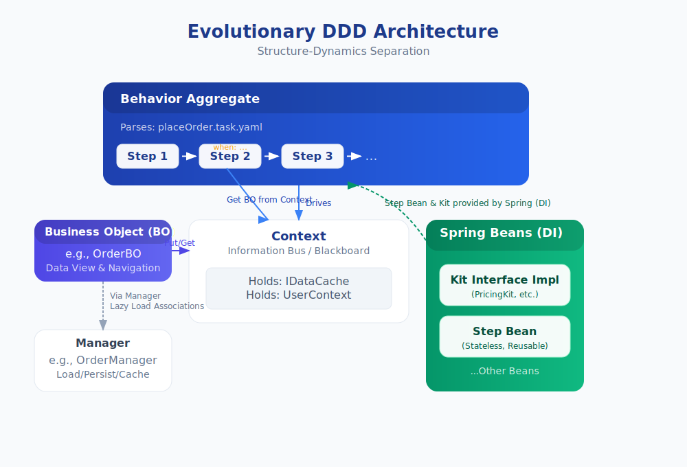

# **Generalized Reversible Computation: A New Paradigm for Unifying Software Construction and Evolution**

**Abstract**: This paper proposes and systematically elucidates the theory of Generalized Reversible Computation (GRC), a new paradigm for unifying software construction and evolution. Unlike traditional logical reversible computation, which focuses on runtime execution, GRC extends the principle of "reversibility" from runtime to the construction process across the entire software lifecycle. Its core principle is the elevation of the **Structured Delta** to a first-class citizen, systematically taming the complexity of software evolution through a unified construction formula: `App = Generator<DSL> ⊕ Δ`. This paper first defines the theoretical scope of GRC from first principles, positioning it as a computational framework for managing complexity by drawing an analogy to the Dirac (Interaction) Picture in physics. Building on this foundation, we detail GRC's core mechanisms, including its recursive fractal-like construction properties and delta composition based on algebraic operations. We demonstrate the explanatory power of GRC theory by reinterpreting Domain-Driven Design (DDD) and providing a unified analysis of modern engineering practices such as Docker, Kustomize, and OpenUSD. Finally, we validate the engineering feasibility and potential advantages of GRC through a canonical implementation in the Nop Platform and a case study of retrofitting a large-scale banking core system. We believe that GRC provides a systematic solution to the two major challenges in software engineering: 'complexity' and 'evolution'. It specifically addresses the core contradiction in software product line engineering: how to maintain a single, standard product baseline while providing deep customization for different customers, thereby avoiding the nightmare of maintaining multiple code branches. By articulating this framework and providing initial validation, this paper aims to lay the groundwork for its further formalization and widespread application. 


**Keywords**: Generalized Reversible Computation, Delta-Oriented Programming, Metaprogramming, Model-Driven Engineering, Software Product Lines, Domain-Specific Languages, Recursive Fractal-like Construction, Domain-Driven Design, Minimal Information Expression, Software Configuration Management, Variability Management, Software Product Line Engineering, Compositional Software Development

## 1. Introduction: From Computability to the Challenge of Complexity

In the history of computer science, the Turing Machine and Lambda Calculus laid the theoretical foundation for "computability," answering the fundamental question of "what is computable?" However, as software systems have evolved from isolated algorithms into intricate ecosystems, our core challenge has shifted from "computability" to "complexity management."

Several long-standing challenges in software engineering can be distilled into three fundamental dichotomies:

- The conflict between **standardization and customization**: How to satisfy individual needs while maintaining the stability of a core product.
- The conflict between **reuse and evolution**: How to support the continuous evolution of a system while reusing existing assets.
- The conflict between **entropy and control**: How to systematically govern software decay and control the growth of complexity.

To address these, this paper formally introduces **Generalized Reversible Computation (GRC)**. The core idea of GRC is that the construction and evolution of any complex software system can be described by a single, unified construction formula. It asserts that a system can always be decomposed into a predictable "ideal backbone" built from a standardized **model** via a deterministic **generator**, and the superposition of one or more structured **deltas** that encapsulate all non-ideal, customized, and evolutionary modifications. This core idea can be formally expressed as:

`App = Generator<DSL> ⊕ Δ`

Before delving into the theoretical system, we provide a brief glossary of the core concepts discussed in this paper to help readers build a clear cognitive map.

### **Glossary of Core Concepts**

| Term                                   | English/Symbol                           | Definition & Explanation                                                                                                                                                                                                                                            |
|:-------------------------------------- |:---------------------------------------- |:------------------------------------------------------------------------------------------------------------------------------------------------------------------------------------------------------------------------------------------------------------------- |
| **Generalized Reversible Computation** | Generalized Reversible Computation (GRC) | The new paradigm proposed in this paper. It extends the principle of "reversibility" from runtime to the **entire process of software construction and evolution**, with a core focus on systematically managing complexity through algebraic delta operations.     |
| **Core Construction Formula**          | `App = Generator<DSL> ⊕ Δ`               | The mathematical cornerstone of GRC. It asserts that any software application (App) can be decomposed into a **predictable foundation built from a Generator and a DSL**, combined with one or more **Structured Deltas (Δ) that encapsulate all changes**.         |
| **Structured Delta**                   | Structured Delta (Δ)                     | A **first-class citizen** in GRC. It is a **structured data packet** that encapsulates evolutionary operations—additions, deletions, modifications—on a base model. Unlike a text `diff`, it operates at the **semantic level** and possesses algebraic properties. |
| **Generator**                          | Generator                                | The deterministic transformation function in the GRC formula. It is responsible for reading a **Domain-Specific Language (DSL)** and "compiling" or "interpreting" it into a predictable, standardized "ideal backbone" of the system.                              |
| **Domain-Specific Language**           | Domain-Specific Language (DSL)           | The carrier of the "**semantic coordinate system**" in GRC. It provides a stable, business-meaningful structure for software artifacts, enabling deltas (Δ) to have **precise and robust addressing anchors**.                                                      |
| **Reversible Merge Operator**          | Reversible Merge Operator (⊕)            | The core algebraic operation used to apply a delta (Δ) to a base model. It is designed to be **non-invasive** and theoretically supports an **inverse operation** (`Base = App - Δ`), enabling the precise calculation and stripping of changes.                    |

At a high level, this core construction principle can be understood as a new architectural paradigm. **As illustrated in Figure 1**, a typical layered software system, regardless of its internal divisions (e.g., infrastructure, core engine, and business application layers), can be enhanced by a new, orthogonal "delta customization" dimension. This Delta dimension is the manifestation of the structured delta `Δ` in the GRC formula. It acts like a unified control bus, capable of non-invasively modifying, replacing, or extending any layer of the system, thereby converging scattered, ad-hoc customization requirements into a systematic, manageable framework.


**Figure 1: A Top-Level Architectural Metaphor for GRC—A Layered Architecture with Delta Customization.** This diagram illustrates the core idea of the GRC paradigm: a traditional, vertically layered software system (Infrastructure, Core Engine, Business Application) is non-invasively enhanced by an orthogonal "Delta Customization" dimension that cuts across all layers. This Delta dimension corresponds to the `Δ` in the GRC formula, providing a unified and scalable mechanism for system evolution and variability management.

The main contributions of this paper are:

1. **Paradigm Establishment and Positioning**: We systematically define GRC for the first time, establish its conceptual foundation as a computational framework through analogies with methodologies in physics, and clarify its relationship with related work such as DOP and MDA.
2. **Elucidation of the Theoretical Core**: We detail GRC's recursive fractal-like construction properties, its three dimensions of reversibility, and the foundation of its delta algebra.
3. **Demonstration of Unifying Explanatory Power**: Starting from GRC's first principles, we reinterpret Domain-Driven Design (DDD) and reveal the unified construction laws underlying modern practices like Docker and OpenUSD.
4. **Engineering Practice Validation**: We demonstrate the engineering feasibility, potential advantages, and universality of GRC theory through its canonical implementation in the Nop Platform and a case study of a large-scale enterprise system.

We begin by systematically articulating the substance of GRC, starting with its theoretical positioning and related work.

## 2. Theoretical Positioning and Related Work

### 2.1. Conceptual Demarcation of Generalized Reversible Computation

To precisely define the theoretical scope of Generalized Reversible Computation (GRC), it is essential to distinguish it clearly from other "reversibility" concepts in computer science:

* **Physical Reversible Computing**: This field focuses on how to build extremely low-energy computing hardware using reversible processes at the level of physical laws. Its theoretical basis can be traced to Landauer's principle, which clarifies the necessary link between information erasure and energy dissipation [1].
* **Logical Reversible Computation (LRC)**: A branch of theoretical computer science concerned with whether computational steps at runtime have a strict logical bijection, meaning each computational state has a unique successor and predecessor. Bennett proved that any computational process can, in principle, be transformed into a logically reversible form [2].
* **Generalized Reversible Computation (GRC)**: The software construction paradigm proposed in this paper. It extends the principle of "reversibility" from the execution logic at **runtime** to the **design/build-time** activities across the entire software lifecycle. The core issue for GRC is not to eliminate all irreversibility, but rather, in a software engineering world that is macroscopically entropic, how to use reversible, algebraic construction operations as a core mechanism to systematically organize and tame unavoidable irreversibility.

Therefore, GRC and LRC are not in competition but are concepts that focus on different levels. LRC can be seen as a theoretical special case of GRC where the construction dimension is greatly simplified to focus solely on runtime execution steps. GRC is concerned with the broader construction dynamics that encompass the entire process of software design, implementation, deployment, and evolution.

### 2.2. Systematic Comparison with Related Work

The core idea of Generalized Reversible Computation (GRC) was independently conceived in 2007, inspired not by mainstream software engineering paradigms but by methodologies from theoretical physics for handling complex many-body systems (see Section 4.1). In the process of systematizing its theory for this paper, we reviewed the academic literature in software engineering and discovered that many similar explorations have been independently undertaken in fields such as Model-Driven Engineering (MDE), Software Product Lines (SPL), and Feature-Oriented Programming (FOP).

This phenomenon of "convergent evolution"—different paths leading to similar solutions—suggests to some extent that "delta-oriented" and "generative" construction may be an effective pattern for tackling software complexity. The purpose of this section is not only to clarify the origins of GRC's ideas but also to place it within a broader academic coordinate system. By comparing it with these prior works, we aim to reveal GRC's distinct characteristics in terms of theoretical completeness, algebraic rigor, and unifying power. We argue that many existing construction theories can be understood as incomplete implementations of the core GRC formula `App = Generator<DSL> ⊕ Δ` along different dimensions.

Before proceeding with detailed comparisons, it is essential to clarify GRC's fundamental paradigm: its core lies in establishing Y = F(X) ⊕ Δ as a unified construction relationship and mental model, not in promoting any specific algebraic operator or technical implementation. The GRC framework is highly inclusive; it acknowledges and allows for the coexistence of diverse "delta spaces," such as Git's line-level textual diffs, Docker's filesystem layers, and the DSL-based semantic tree diffs discussed later in this paper.

GRC's advancement lies in providing a unified framework for evaluating and organizing these different delta spaces. It guides us to proactively design and select delta spaces with more refined algebraic properties (e.g., determinism, composability, reversibility), as better algebraic properties yield greater benefits in automation and evolution management. Therefore, subsequent discussion of GRC's "algebraic nature" should be understood as referring to an ideal property achievable through sound design, not a rigid prerequisite for all scenarios. With this understanding, we can more deeply grasp the essential distinctions between GRC and other related work.

#### 2.2.1. Model-Driven Engineering (MDE): Generation without Deltas

Model-Driven Engineering (MDE), and its early concrete implementation, Model-Driven Architecture (MDA) [3], represented a major paradigm exploration in software engineering to raise the level of abstraction from code to models [4]. Its core pattern can be abstracted as `App = Transformer(Model)`, which is highly consistent in spirit with the `Generator<DSL>` part of the GRC formula, as both recognize "generation" as a core means of systematic construction.

MDE significantly improves productivity and consistency by making the model the Single Source of Truth and automatically generating code and other artifacts from it. However, a well-recognized challenge in classic MDE methods is their relative rigidity in handling "exceptions" or "customization" requirements that deviate from the core model. GRC aims to systematically solve this problem by introducing a structured delta mechanism (`Δ`) that collaborates orthogonally with the generation process. It allows for non-invasive, traceable evolutionary modifications without corrupting the core model (the output of `Generator<DSL>`), thus completing a crucial missing piece in MDE.

#### 2.2.2. Delta-Oriented/Feature-Oriented Programming (DOP/FOP): Deltas without a Complete Coordinate System

Feature-Oriented Programming (FOP) [5] and its subsequent evolution, Delta-Oriented Programming (DOP) [6], are primarily used to manage variability in Software Product Lines (SPL) [7]. These paradigms grasp one half of the truth in the GRC formula—the `Δ`—by reifying "change" itself into manipulable "feature" or "delta" modules.

Their classic pattern, `Product = Core ⊕ Deltas`, reveals their theoretical limitations:

1. **The Unspecified Core**: The origin and construction method of the `Core` are not theorized; it is usually assumed to be a pre-existing, manually crafted artifact.
2. **Lack of a Stable Semantic Coordinate System**: The delta operations in DOP/FOP typically act on unstable code structures defined by General-Purpose Languages (GPLs), and their addressing mechanisms (e.g., matching based on code patterns) are relatively fragile. Although some research has explored the use of DSLs in FOP [8], the role of the DSL is more auxiliary.

GRC systematically addresses these two problems with its other two theoretical pillars: the `Generator` and the `DSL`. `Generator<DSL>` provides a deterministic theoretical origin for the `Core`, while the DSL itself, through its inherent structure and domain semantics, constructs a stable "**semantic coordinate system**" that provides robust anchors for delta operations.

#### 2.2.3. Aspect-Oriented Programming (AOP): Spatial Commonality vs. Temporal Similarity

Aspect-Oriented Programming (AOP) [9] introduced a mechanism for modularizing cross-cutting concerns. From a GRC perspective, AOP can be seen as a form of unstructured delta injection.

AOP and GRC differ in the dimension of "change" they capture. AOP's Pointcuts primarily capture "**spatial commonality**"—concerns that cut across different modules at the same point in time. In contrast, GRC's deltas (`Δ`) primarily capture the "**temporal similarity**" of the same artifact during its evolution. An AOP pointcut is a query semantic, and its scope of effect may change due to code refactoring. A GRC delta, however, is a construction semantic; its target is deterministic, based on precise domain coordinates defined by a DSL.

#### 2.2.4. Version Control Systems (VCS): Textual Deltas with Weaker Algebraic Properties

Modern Version Control Systems (VCS) like Git represent the most successful application of delta-oriented thinking in engineering practice. Their `diff/patch` mechanism has profoundly influenced a generation of developers, and academia has extensively mined and analyzed VCS history data [10].

However, GRC seeks to achieve a paradigm upgrade over VCS by elevating the delta from the **"syntactic/text space" to the "semantic/model space"** and endowing it with robust algebraic properties. Git's `diff` and GRC's `Δ` differ in their mathematical properties:

* **Different Delta Spaces**: Git's deltas are defined in the **line-based text space** and lack business semantics. GRC's deltas are defined in the **domain model space**, where the minimal unit of operation is a semantic node with clear business meaning.
* **Lack of Closure**: A Git `merge` can result in a "Conflict," producing an abnormal structure that falls outside the space of "valid source code." This requires manual intervention and breaks the closure of the operation. GRC's merge operator `⊕` is designed to be closed within the model space.
* **Lack of Associativity**: A Git delta (patch) is tightly coupled to a specific baseline version and cannot be independently composed in a way like `(patch₁ ⊕ patch₂) ⊕ patch₃ = patch₁ ⊕ (patch₂ ⊕ patch₃)`. This prevents it from having general-purpose composability.

In summary, Git provides valuable but mathematically weak management of text-level deltas. GRC, by elevating deltas to **semantic-level entities** with well-behaved algebraic properties, makes large-scale, automated, and predictable software construction and evolution possible.

#### 2.2.5. Language Workbenches: Language Composition vs. Unified Metamodel

JetBrains MPS (Meta Programming System), as a paradigm of a Language Workbench [15, 16], has at its core the idea of decoupling developers from the underlying text syntax through a **Projectional Editor**, allowing them to directly manipulate the Abstract Syntax Tree (AST). It builds a dedicated, highly customized development experience for each DSL and then aggregates these independent capabilities through **Language Composition**. This entire methodology is also known as Language-Oriented Programming (LOP) [17].

While GRC also makes extensive use of DSLs, its theoretical starting point and construction philosophy are fundamentally different. GRC posits that since any language can ultimately be parsed into an AST, normalizing these heterogeneous ASTs into a **unified metamodel** (in the Nop Platform, this is the XNode, an engineered implementation of the universal structure of Lisp S-expressions) is a natural and powerful abstraction. Based on this, GRC provides a more lightweight and algebraically complete path to achieving the capabilities of a language workbench.

The paradigmatic differences between GRC and MPS can be analyzed through several key points:

1. **Unified Metamodel & Homomorphic Metaprogramming**: MPS maintains separate AST structures for each language. In contrast, GRC proposes a unified XNode metamodel, making **transformations on the model (metaprogramming) homomorphic to the structure of the model itself**. This allows the `Generator` to be implemented as a mechanism akin to Lisp macros, performing Turing-complete transformations at the unified AST level, with capabilities far exceeding simple code generation.

2. **Multiple, Reversible Representations**: In GRC, **the same information can have multiple different representations**. The text of a DSL is its **textual representation**, while a complex interactive interface is its **visual representation**. These representations can, in theory, be freely and reversibly converted between one another. In MPS, the projectional editor is part of the "language definition," whereas in GRC, representations are separate from the model. A powerful example is that the GRC framework can automatically provide an Excel representation for *all* DSLs. The necessary parsing and validation logic can be supplemented through a mapping definition. **Crucially, this mapping is flexible; it matches data purely based on attribute names without specifying fixed cell locations.** Thus, the system can not only generate but also reliably reverse-parse structured Excel files, allowing users to directly edit complex DSL tree structures using Excel. This ability to provide robust, universal editing methods for any DSL at low cost is a significant advantage of the GRC paradigm.

3. **Generator as Representation Constructor**: Based on the above, the core GRC formula `App = Generator<DSL> ⊕ Δ` gains a deeper interpretation. The **`Generator`** here is no longer just a code generator; it is generalized to be **any transformer from the unified metamodel to a specific representation**. This includes the process of constructing a "projectional editor." At the implementation level, this can be achieved with great generality and flexibility: as a rendering engine traverses an XNode tree, **it can dynamically look up and load the corresponding UI control from a specified control library (`control.xlib`) based on each node's tag name (`tagName`)**. For example, a `<wf:send-task>` node could be mapped to a graphical block displaying "Send Task." By providing different control libraries—one for web rendering, another for a desktop IDE plugin—one can **generate completely different-looking and -behaving visual editors for the same XNode model data**.

4. **Explicit Delta Algebra**: This is GRC's most unique theoretical contribution. MPS itself does not have a built-in concept of "delta merging and decomposition." GRC, by defining the `⊕` merge operator and the structured delta `Δ` on top of the unified XNode metamodel, provides an explicit, algebraically well-behaved language of operations for model evolution, customization, and composition.

The table below summarizes the differences in the core mechanisms of the two paradigms:

| Dimension                    | JetBrains MPS                                      | Generalized Reversible Computation (GRC)                                                           |
|:---------------------------- |:-------------------------------------------------- |:-------------------------------------------------------------------------------------------------- |
| **Theoretical Focus**        | Projectional Editing, Language Composition         | **Unified Metamodel, Multiple Representations, Delta Algebra**                                     |
| **Core Structure**           | Separate, typed ASTs for each language             | Unified XNode metamodel (embodying Lisp S-expression ideas)                                        |
| **Representation Mechanism** | Language and editor are tightly coupled            | **Same XNode reversibly mapped to multiple representations via control libraries**                 |
| **Meaning of Generator**     | Primarily a code generator                         | **Representation Constructor (incl. visual editors) & Homomorphic Macros**                         |
| **Evolution Mechanism**      | Relies on language module's own version management | **Explicit, computable evolution based on delta algebra**                                          |
| **Paradigm Positioning**     | Heavyweight, complete language workbench           | **A lightweight, algebra- and metaprogramming-based framework for realizing a language ecosystem** |

In conclusion, GRC does not simply replicate or replace language workbenches. By returning to the universal structural idea of Lisp S-expressions and creatively supplementing it with the concepts of "delta algebra" and "multiple reversible representations," it provides a more fundamental and unified theoretical framework for both the construction (via `Generator` creating representations) and evolution (via `⊕ Δ` applying changes) of software.

### 2.2.6. Lenses: Update Propagation Theory vs. System Construction Theory

Bidirectional Transformation (BX) theory, represented by Lenses [11], aims to solve the "view update problem": how to propagate modifications made to one of two related models (e.g., source A and view B) "well-behavedly" back to the other. Its core lies in defining `get` and `put` operations and ensuring they satisfy a set of axioms that guarantee behavioral consistency. Subsequent evolutions like δ-lenses even elevate "edits/deltas (Δ)" to be the entities of propagation, ensuring the correct propagation of composite edits through homomorphism.

At first glance, GRC's "transformational reversibility" and the goal of Lenses appear similar. However, their **theoretical focus and engineering scope** are fundamentally different, a difference rooted in their basic postulates.

| Comparison Dimension       | **Lenses / BX**                                                                                                        | **Generalized Reversible Computation (GRC)**                                                                                                       |
| :------------------------- | :--------------------------------------------------------------------------------------------------------------------- | :------------------------------------------------------------------------------------------------------------------------------------------------- |
| **Theoretical Focus**      | **Local Consistency**: How to well-behavedly propagate an update on one side to the other (A ↔ B).                       | **Global Construction Theory**: How the entire system uniformly follows the construction and evolution invariant `Y = F(X) ⊕ Δ`.             |
| **Basic Postulate**        | Relies on **alignment algorithms** or **traces** to dynamically resolve the localization of changes.                     | **Postulates** that every semantic unit in the system must have an **intrinsic coordinate** (e.g., an `id`), fundamentally circumventing the alignment problem. |
| **Status of Delta (Δ)**    | **Transient Input**: A procedural concept serving a single synchronization computation.                                 | **First-Class Asset**: Can be independently packaged, versioned, and distributed, persisting throughout the software lifecycle.                  |
| **System Scale**           | **Point-to-point** (A ↔ B). Extending to multi-model chains requires complex compositional proofs.                       | **System-level Closed Loop**: Natively supports full-chain evolution and traceability through a "DSL atlas," a unified IR, and homomorphic propagation contracts. |

The strength of Lenses theory lies in providing a profound and elegant formal framework for the "two-model synchronization" problem. However, it does not treat "coordinate systems" and "an overlay algebra with associativity" as its first principles. This leads to challenges with "alignment difficulties" and "insufficient delta composability" when dealing with the construction of large-scale, multi-DSL, long-term evolving systems.

GRC, by **elevating "intrinsic coordinates" and the "overlay algebra `⊕`" to basic postulates**, shifts the problem from "how to synchronize two existing models" to "**how to construct and evolve the entire system using a unified, coordinate-based set of algebraic rules**." Lenses can be seen as a fine-grained, formal study of the relationship between `F` and `F⁻¹` in the special case of GRC where `Y = F(X)` (i.e., `Δ` is empty). GRC's vision, however, is much broader. It is committed to providing a complete engineering framework for making the leap from a "point-wise update propagation theory" to a "unified methodology for system construction and evolution."

### **2.2.7 Software Product Line Engineering (SPLE): From Feature Models to Delta Algebra**

Software Product Line Engineering (SPLE) [7] is a systematic methodology proposed by the industry to address the development of "software product families." Its core idea is to build a reusable platform through **Domain Engineering** and then rapidly derive specific products through **Application Engineering**. SPLE directly confronts the conflict between standardization and customization, making it highly relevant to GRC at a methodological level.

However, traditional SPLE practices face a series of challenges when mapping "variability models" to "implementation assets":

1.  **The Gap Between Feature Models and Implementation**: SPLE typically uses **Feature Models** to describe commonalities and differences among products. But there is a huge "semantic gap" between the feature model itself (a logical tree-like structure) and the final code implementation (e.g., using `#ifdef`, AOP, or design patterns). The mapping relationship is complex and difficult to maintain.
2.  **Combinatorial Explosion and Implementation Complexity**: Interactions and constraints between features can lead to complex conditional compilation, weaving rules, or configuration logic at the implementation level, which are difficult to reason about and verify end-to-end.
3.  **Evolutionary Rigidity of Core Assets**: The "Core Platform" in SPLE is often a manually maintained, monolithic codebase. When the core platform itself needs to evolve, it can easily break compatibility with existing product variants.

GRC can be seen as **a more fundamental and algebraically consistent implementation paradigm for the SPLE methodology**. It does not simply replace SPLE but rather provides it with a more powerful engine.

| Comparison Dimension | Traditional SPLE Practice | Generalized Reversible Computation (GRC) Implementation |
| :--- | :--- | :--- |
| **Variability Model** | Independent, logical **Feature Model** | **Structured Delta (Δ) itself** is the variability model, isomorphic to the implementation |
| **Core Asset** | Manually maintained **Core Platform (Core)** | Deterministically generated **ideal backbone** by `Generator<DSL>` |
| **Composition Mechanism** | Dispersed, heterogeneous implementation techniques (preprocessors, AOP, configuration, etc.) | Unified, algebraically complete **merge operator (⊕)** |
| **Construction Process** | `Product = Bind(Core, FeatureConfig)` | `App = Generator<DSL> ⊕ Δ` |
| **Evolution Paradigm** | Core and variants are separate, with complex evolution paths | **Construction is evolution**; all changes are unified as delta superposition |

**The paradigm shift of GRC lies in** the fact that it no longer treats "features" and "core" as two heterogeneous entities, but unifies them under the framework of `Generator<DSL> ⊕ Δ`.
*   **The DSL itself defines the entire possible "feature space"**; it is a complete semantic coordinate system.
*   A specific "feature" is implemented as a combination of one or more `Δ`s, which act precisely on different locations within the DSL coordinate system.
*   The "core asset" is no longer a static codebase but a predictable, ideal form that can be generated by the `Generator` from an empty set or a minimal model.

Consequently, GRC introduces an innovative engineering practice: system reuse no longer relies on invasive modifications or pre-defined extension points in the base product. A completely new product variant can be created by providing a set of purely additive `Δ` delta files, while the source code and models of the base product remain 100% unchanged. This "read-only baseline, incremental extension" model strictly isolates the risks brought by evolution within the `Δ`, significantly enhancing the stability and maintainability of the core platform.

Therefore, through "language as a coordinate system" and "delta algebra," GRC seamlessly unifies the separate "problem space" (feature models) and "solution space" (implementation techniques) found in SPLE, providing a more concise, robust, and mathematically elegant path for achieving **system-level, coarse-grained reuse of software product families**.

### **2.2.8. Conclusion: A More Fundamental Construction Paradigm**

GRC is not a simple combination of the aforementioned theories but offers a more fundamental and general construction paradigm. By introducing the three cornerstones of a **Generator**, an **Algebraic Delta**, and a **Semantic Coordinate System (via DSL)**, it unifies other theories as special cases or approximations under different constraints. From this perspective, the history of software construction paradigms can be interpreted as a gradual process of exploration and convergence toward the complete form of `App = Generator<DSL> ⊕ Δ`.

## 3. The Core Mechanisms of GRC: Recursive Fractals and Delta Algebra

The core mechanisms of GRC theory are built upon three closely related cornerstones: first, the foundational paradigm of "generation and delta" synergy; second, the algebraic principle that unifies "construction" and "evolution"; and third, the recursive fractal-like construction law that reveals software's self-similarity. Together, these form the operational framework for taming complexity.

### 3.1. The Core Paradigm: A Binary Synergy of Generation and Delta

The GRC construction paradigm, embodied by the unified formula `App = Generator<DSL> ⊕ Δ`, is essentially an idea of decomposition into a "**base + perturbation**." An abstract analogy for this idea is the elevation of the software construction paradigm from OOP's `Map = Map extends Map` to GRC's `Tree = Tree x-extends Tree`. This represents an expansion of the operational space from a flat class structure to a hierarchical system model tree, and an upgrade of the operator from simple property overriding to an algebraically complete, reversible merge.

This translates into a concrete technical implementation path:

```javascript
App = Delta x-extends Generator<DSL>
```

Where:

- **Generator<DSL>**: The idealized backbone of the system, providing a standard, default structure.
- **Delta**: A structured delta defining all customizations and specializations to the standard base.
- **x-extends**: The reversible merge operator, an algebraic upgrade to traditional inheritance mechanisms.

### 3.2. Construction is Evolution: The Unifying Principle of A = ∅ ⊕ A

The algebraic identity `A = ∅ ⊕ A`, in the context of GRC, reveals the **intrinsic unity of software construction and evolution**.

In traditional software engineering, "project initialization" (construction) and "feature changes" (evolution) are typically treated as two distinct activities, using different mental models and toolsets. GRC, by elevating the "delta" to a first-class citizen, perfectly unifies them under the same algebraic law.

Let's translate `A = ∅ ⊕ A` into the language of GRC:

* **A (left side)**: Represents a final, runnable **Application**.
* **∅ (empty set symbol)**: Represents a **"Zero Model"** or **"Empty Baseline."** It is the **Identity Element** in the GRC delta algebra system, a logically existing structure containing zero information.
* **⊕ A (right side)**: Here, `A` is no longer the final application entity but the **"Genesis Delta."** It is a massive, complete delta `Δ_A` that contains **all the information** needed to create the entire application `A` from "nothing."

Thus, the profound meaning of `A = ∅ ⊕ A` in the GRC context is:
**The construction process of a new application is essentially equivalent to applying a "Genesis Delta," which contains the application's entire definition, to a "Zero Model."**

Now, let's consider the system's evolution, for example, from version V₁ to V₂, which can be expressed as: `V₂ = V₁ ⊕ Δ`. Placing the two formulas side by side:

1. **Construction**: `App_V₁ = ∅ ⊕ Δ_Genesis`
2. **Evolution**: `App_V₂ = App_V₁ ⊕ Δ_Incremental`

The unity becomes apparent: **Construction is evolution**. The construction process can be seen as **one grand evolution from a "zero baseline."** Conversely, the evolution process can be seen as **a local construction on a "non-zero baseline."**

This unifying principle brings immense engineering value:

* **Conceptual Simplification**: The entire software lifecycle is simplified to a single core operation: **Apply Delta**.
* **Toolchain Unification**: Since the underlying law is unified, the toolchains for "construction" and "evolution" can also be unified. A single merge engine can be used both to generate an application from scratch and to apply a tiny patch to it.
* **Everything is a "Patch"**: A new feature, a customer customization, an emergency fix, or even the entire initial application itself, are all abstracted into independently manageable, composable, and reusable delta assets.

### 3.3. Recursive Fractal-like Construction: The Principle of Self-Similarity in Software Construction

A core insight of GRC theory is the recursive self-similarity exhibited by the software construction process: its fundamental construction formula, Y = F(X) ⊕ Δ, acts as an invariant pattern that permeates all levels, from macroscopic system architecture to microscopic function implementation. We use the metaphor of a **fractal-like** structure to describe this self-repeating pattern, referring to constructional self-similarity rather than a strict mathematical geometric concept.

This recursiveness is evident across four key dimensions of software construction:

#### 3.3.1. Vertical Recursion: The Multi-Stage Software Production Line

In the vertical dimension, GRC builds a **multi-stage software production line**, breaking down complex model transformations into a series of manageable steps:

```
XMeta = Δ_meta ⊕ Generator<XORM>
XView = Δ_view ⊕ Generator<XMeta>
XPage = Δ_page ⊕ Generator<XView>
```

This recursive decomposition solves a core dilemma of traditional Model-Driven Architecture (MDA): it allows one to avoid striving for perfect coverage of all details during modeling. Instead, one can build a core generator that handles 80% of common scenarios, while the remaining 20% of special requirements are precisely injected via Δ deltas at any stage.

**Figure 2 provides a concrete example of such a multi-stage software production line.** In this example, the construction process begins with a non-technical `Excel` file, which is first converted by a generator into a structured `XORM` data model. This `XORM` model then serves as input for the next stage, used to generate a higher-level `XMeta` business model. The process continues, with `XMeta` and a business logic model (`BizModel`) combining to generate a `GraphQL` service, while also being used to generate front-end `XView` and `XPage` models, until the final user interface is rendered. The entire flow clearly demonstrates how the `Y = F(X) ⊕ Δ` construction pattern repeats self-similarly at different levels.


**Figure 2: Example of GRC's Vertical Recursive Construction—A Software Production Line from Data Source to Front-end UI.** This flowchart shows the recursive application of the GRC construction formula. It starts with an Excel data source that is easy for business personnel to maintain and, through a series of deterministic generators, progressively transforms the model from one representation (`XORM`) to another (`XMeta`, `XView`, `XPage`), ultimately generating a GraphQL service and a front-end interface. At each transformation stage, customizations can be introduced by superimposing deltas (`_XORM`, `_XMeta`, etc.).

#### 3.3.2. Horizontal Recursion: The DSL Feature Vector Space

In the horizontal dimension, GRC envisions a **DSL feature vector space**. A cross-domain business requirement can be decomposed into a set of isomorphic deltas acting on different DSL models:

```
App = [DSL₁, DSL₂, ..., DSLₙ, Δ_residual]
```

Here, `Δ_residual` ensures the completeness of the decomposition, representing the residuals that cannot be perfectly captured by the existing DSL system.

#### 3.3.3. Temporal Recursion: Self-Similarity of Version Evolution

In the time dimension, any entity in the system can be seen as a superposition of its earlier version and an evolutionary delta:

```
Product_V₃ = Δ_v₃ ⊕ Product_V₂
Product_V₂ = Δ_v₂ ⊕ Product_V₁
```

This makes "change" itself a manageable, versionable, and evolvable core asset.

#### 3.3.4. Meta-Recursion: Bootstrapping the Construction System

The construction system itself (`Generator`, `DSL` definitions, merge rules) also evolves according to the same invariant:

```
MyDSL_v₂ = Δ_meta ⊕ MyDSL_v₁
Compiler_Pro = Δ_feature ⊕ Compiler_Base
MergeRule_New = Δ_rule ⊕ MergeRule_Old
```

The entire software world—from the final product to intermediate models, and even the construction system itself—becomes a vast, self-similar space of delta structures connected by the ⊕ operator.

### 3.4. Delta Algebra: The Foundation for Taming Change

The mathematical cornerstone of GRC is **Delta Algebra**. It requires the construction process to be a solvable algebraic equation, not a series of irreversible instructions. By introducing an **inverse element (`-Δ`)** for the merge operation `⊕`, we can achieve:

* **Precise Delta Calculation**: `Δ = App - Base` (semantic diff).
* **Safe Stripping of Changes**: `Base = App - Δ` (semantic rebase).

This extends software reuse from the component pattern of "reusing what is identical" to the transformation pattern of "**reusing what is related**," fundamentally resolving the core conflict between a "core product and customer customizations."

## 4. Theoretical Cornerstone: Analogy with Physics Methodology

The theory of GRC is founded on an **ideological analogy** with fundamental analytical methodologies in physics.

### 4.1. Analogy with the Dirac (Interaction) Picture

GRC's "base + perturbation" decomposition idea is methodologically identical to the Dirac Picture used in quantum mechanics to handle complex interaction problems. The product of `Generator<DSL>` corresponds to the "exactly solvable free part" (`H₀`), while the `Delta` corresponds to the "interaction part treated as a perturbation" (`V`). This reveals that GRC is a general-purpose computational framework for tackling the problem of "complexity" in software.

#### Methodological Comparison of Computational Paradigms and Physics Pictures

| Comparison Dimension       | Turing Machine Paradigm                                                                                                | Lambda Calculus Paradigm                                                                                                                    | Generalized Reversible Computing (GRC) Paradigm                                                                                                                                |
|:-------------------------- |:---------------------------------------------------------------------------------------------------------------------- |:------------------------------------------------------------------------------------------------------------------------------------------- |:------------------------------------------------------------------------------------------------------------------------------------------------------------------------------ |
| **Theoretical Analogy**    | **Schrödinger Picture**                                                                                                | **Heisenberg Picture**                                                                                                                      | **Dirac (Interaction) Picture**                                                                                                                                                |
| **Core Philosophy**        | Operators (program) are invariant; state (data) evolves over time.                                                     | State (data) is invariant; operators (functions) evolve over time.                                                                          | **The system is decomposed into an "exactly solvable free part" and an "interaction part treated as a perturbation."**                                                         |
| **What Evolves**           | **State/Data**<br>(Symbols on the tape, values in memory)                                                              | **Operators/Functions**<br>(New functions are generated through composition and application)                                                | **Interaction/Delta (Δ)**<br>(Encapsulates all modifications, customizations, and evolutions to the ideal backbone)                                                            |
| **What is Invariant**      | **Program/Rules**<br>(The state transition table of the Turing machine)                                                | **Data**<br>(Immutable data structures)                                                                                                     | **Ideal Backbone (Generator<DSL>)**<br>(A predictable, exactly solvable, and standardized foundation)                                                                          |
| **Approach to Complexity** | **Process Simulation**: Control the system by precisely describing the state transition at each step.                  | **Abstract Composition**: Manage complexity by encapsulating behavior into stateless, composable functions.                                 | **Decomposition and Superposition**: Decompose a complex problem into the superposition of a simple, generatable "ideal model" and a series of manageable "structured deltas." |
| **Conceptual Advancement** | Established the **procedural view** of **"Computability"**: Everything can be evolved step-by-step by a state machine. | Established the **transformational view** of **"Computability"**: Everything can be expressed through function abstraction and application. | Provides a **methodology** for **"Complexity Management"**: Any complex system can be decomposed and constructed, and thus be systematically mastered.                         |

#### Paradigm Shift in Software Worldview: From Particles to Waves

| Comparison Dimension    | **Traditional Worldview: Particle View**                                                                                          | **New Worldview: Wave/Field View**                                                                                                                                                                |
|:----------------------- |:--------------------------------------------------------------------------------------------------------------------------------- |:------------------------------------------------------------------------------------------------------------------------------------------------------------------------------------------------- |
| **Basic Unit**          | The world is composed of discrete, bounded software "particles" such as **"objects", "components", and "modules"**.               | The fundamental unit of the world is **"Change" itself**, i.e., a structured **Delta (Δ)**. It acts upon a **coordinate system** that serves as a background.                                     |
| **Construction Method** | Through **intrusive assembly**, these "particles" are rigidly connected via mechanisms like calls, inheritance, and composition.  | Through **non-intrusive superposition**, different "changes" (Deltas/Δ) interfere and superpose within the same coordinate system (base model), collectively **reconstructing** the final system. |
| **Focus**               | The internal state and behavior of individual "particles". The question is:<br>"What **is** this **object**? What can it **do**?" | The patterns and combinations of **"Change" itself**. The question is:<br>"In which **coordinate system** did a **change** occur? How do these changes combine?"                                  |
| **Ontological Status**  | **Data** (state) and **functions** (behavior) are the **fundamental elements** that constitute a "particle". They are primary.    | **Data** is the **result** of applying a series of "changes".<br>**A function** is a **reusable "pattern of change"**.<br>Both are **derived** from the **Delta (Δ)** and are no longer primary.  |

### **4.2. The Principle of Minimum Information Expression: The First Principle of GRC**

All mechanisms of Generalized Reversible Computing (GRC) can be derived from a more fundamental principle: the **Principle of Minimum Information Expression**. The core of this principle is a maxim: "Express what is necessary, and nothing more." It mandates that a software artifact should contain only the essential complexity of the problem it solves, while systematically reducing all accidental complexity introduced by technical implementation to zero.

Conceptually, this principle is analogous to the **Principle of Least Action** in physics. Both embody a profound philosophy of "economy," positing the existence of a minimizable metric (action vs. information), where the ideal form of a system is achieved when this metric reaches its minimum value. Adherence to this principle leads us to three key constructive strategies that collectively form the theoretical cornerstones of GRC:

1. **The Necessity of Declarative Programming and Domain-Specific Languages (DSLs)**
   To minimize information, one must strip away "accidental" details related to specific execution methods, sequences, and environments, describing only the desired target state. This expressive style—focusing on "what" rather than "how"—is inherently declarative. General-Purpose Languages (GPLs), in order to ensure their Turing completeness, inevitably carry a large volume of generic syntax and concepts unrelated to the specific business domain, which is in itself a form of accidental complexity. Therefore, **the pursuit of minimum expression inevitably leads to the creation and use of Domain-Specific Languages (DSLs) designed to express domain logic using—and only using—the concepts of that domain.** This provides the theoretical justification for the presence of `Generator<DSL>` in the GRC formula.

2. **The Pursuit of Semantic Uniqueness and Reversible Transformations**
   Theoretically, if two different minimal expressions, *A* and *B*, describe the same business essence but cannot be losslessly converted into one another, it must mean that at least one of them contains extra information the other lacks, or is missing key information the other possesses. This would violate the requirements of "minimality" or "completeness." Therefore, an ideal minimal expression must have a **unique semantic core**.
   This ideal of "semantic uniqueness" directly **leads to the pursuit of reversible transformations between different forms of expression**. Although direct transformation between different technical paradigms (e.g., aggregate models vs. event sourcing) is exceedingly complex in real-world engineering, the principle of minimum information expression guides us to approximate this ideal through a **generative architecture**. This involves building a pure, technology-agnostic business semantics model as the "single source of truth" and then using deterministic generators to map it to various technical implementations. At an engineering level, this achieves **traceability and logical reversibility from the "core semantics" to "multiple representations,"** providing both the theoretical guidance and an implementation path for the "transformational reversibility" of GRC (see Section 5.2).

3. **The Minimal Unit of Evolution is the Delta**
   When a system *Base*, already in a state of minimal expression, needs to evolve, the information introduced for the change must also adhere to the principle of minimization. The most economical way to describe the transition from *Base* to a new state *App* is not to re-describe the entirety of *App*, but to describe only the **difference** between them. The minimal expression of this difference is the **structured delta (Δ)**. Consequently, the formula `App = Base ⊕ Δ` is not merely a construction formula; it is the minimal information expression of the system's evolutionary process, rendering "change" itself a manageable, first-class entity.

In summary, the Principle of Minimum Information Expression provides a solid, first-principles justification for each component of the GRC construction paradigm `App = Generator<DSL> ⊕ Δ`. It is not a rigid dogma but a **guiding compass**, leading us to discover and construct the "logically optimal path"—one that is dictated by the essence of the problem and is minimal in its information content.

## 5. The Three Dimensions: A Complete Exposition of Generalized Reversibility

"Reversibility" in the GRC paradigm is a multi-dimensional engineering principle.

### 5.1. Algebraic Reversibility: From Construction Instructions to Solvable Equations

Algebraic reversibility demands elevating the software construction process from irreversible programmatic instructions to solvable algebraic equations. The traditional `App = Build(Source)` is unidirectional, whereas GRC proposes that construction should satisfy:

```
App = Base ⊕ Δ
```

The "solvability" of this equation stems from the delta algebra structure, which allows us to:

- Precisely calculate the difference between systems: `Δ = App - Base`
- Restore the standard platform from a customized system: `Base = App - Δ`

**Significance for Minimal Information Expression**: Algebraic reversibility ensures lossless information manipulation, allowing us to manage complexity through delta composition while keeping the core expression minimal.

### 5.2. Transformational Reversibility: From Unidirectional Loss to Semantic Round-tripping

Transformational reversibility aims to establish high-fidelity "semantic round-tripping" between different representation forms (DSL, code, GUI, Excel, etc.), guaranteed by the **Lax Lens** model:

```
G⁻¹(G(A)) ≈ A   and   G(G⁻¹(B)) ≈ normalize(B)
```

where `≈` denotes semantic equivalence and `normalize` represents a normalization process. This mechanism:

- Enables bidirectional editing across different forms.
- Ensures system consistency across multiple perspectives.
- Intentionally ignores purely presentational changes, extracting only structured modifications.

**Significance for Minimal Information Expression**: It allows each role to use the most suitable representation for minimal expression, while guaranteeing the semantic unity of these expressions.

### 5.3. Process Reversibility: From Linear Time to a Correctable History

Process reversibility provides the ability to use a "future" delta `Δ` to correct a system that has already been released in the "past":

```
M_final = M_base ⊕ Δ_patch
```

This breaks the linear causality of the physical world, achieving in the "virtual spacetime" of software construction:

- A non-invasive hot-patch mechanism.
- Compensatability for irreversible side effects (SAGA pattern).
- Compensation operations based on evidence objects.

**Significance for Minimal Information Expression**: It frees system evolution from the constraints of linear time, allowing new minimal expressions to be injected at any time to optimize the system without destroying existing information structures.

### 5.4. Governing the Boundary between Reversible and Irreversible

GRC's pragmatism is reflected in its not pursuing a utopia of complete reversibility, but rather providing engineering strategies for governing both:

- **R/I Partitioning**: Clearly divide the system into a reversible core (R-Core) and an irreversible boundary (I-Boundary).
- **Boundary Management**: Audit all crossings of the I-Boundary, generating the evidence objects needed for compensation.
- **Entropy Governance**: Effectively localize and manage entropy increase by isolating it within deltas.

## 6. The Explanatory Power of GRC: Reinterpreting DDD and Unifying Modern Practices

### 6.1. Reinterpreting DDD

Domain-Driven Design (DDD), as a powerful set of practices aimed at tackling business complexity, has a core concept, the "Aggregate Root," which is traditionally defined as "the boundary of consistency and transactions." From a GRC perspective, however, this traditional understanding is precisely what can cause a system to become rigid and fragile in ultra-large-scale, high-evolution scenarios.

GRC aims to provide a new theoretical perspective for DDD, seeking to supplement and evolve it from a set of practices into a formal construction theory. It proposes that: **The most crucial role of the Aggregate Root is to serve as the carrier of the domain language—a unified map for accessing information.**

Based on GRC's principle of "separating structure from dynamics," we can decompose the traditional, bloated aggregate root into two independent components:

1. **Data Aggregate**: Corresponds to `X` in the GRC formula. It is a pure **information space** that only carries structural data and minimal invariants (e.g., `amount >= 0`). Through an intelligent loading mechanism, it provides a unified view rich in domain semantics for the upper logic to **pull** information on demand, such as `order.getCustomer().getCreditLimit()`.
2. **Behavior Aggregate**: Corresponds to `F` in the GRC formula. It is a **process orchestrator** described by a **Domain-Specific Language (DSL)** (e.g., a YAML process definition). It decomposes complex business logic into a series of single-responsibility, composable **Steps**, transforming the data aggregate in a declarative manner.

This paradigm shift represents an evolution from traditional object-oriented thinking to reversible computation thinking.

| Comparison Dimension       | Traditional DDD Paradigm                                               | GRC-Empowered Evolutionary DDD Paradigm                                                    |
|:-------------------------- |:---------------------------------------------------------------------- |:------------------------------------------------------------------------------------------ |
| **Theoretical Foundation** | Object-Oriented Paradigm                                               | **Reversible Computation Theory**                                                          |
| **Core Responsibility**    | Behavior container, **guardian of consistency and transactions**       | Carrier of domain language, **a unified map for accessing information**                    |
| **Architectural Metaphor** | A carefully designed **network of objects**                            | A **structured information space** generated by reversible transformations                 |
| **Data & Behavior**        | Behavior and data **must be unified** (encapsulation)                  | **Structure (data) and dynamics (process) are separated**                                  |
| **Information Flow**       | **Push-based** (preparing specific DTOs for methods)                   | **Pull-based** (logic pulls data from the information space as needed)                     |
| **Extension Mechanism**    | Inheritance, Composition (invasive, requires source code modification) | **Delta Programming** (non-invasive, extension via delta superposition)                    |
| **Transaction Boundary**   | **Tightly coupled** with aggregate root operations                     | **Decoupled** from the aggregate root, defined **declaratively** by a higher-level service |

Under this new paradigm, GRC's reinterpretation of DDD's core concepts becomes clear:

* **Space**: A Bounded Context is a **partitioning of the problem space's coordinate system**.
* **Time**: A Domain Event is a **delta (Δ)** in the state space that follows `NewState = OldState ⊕ Event`.
* **Language**: The Ubiquitous Language is materialized as a **DSL** (e.g., process definitions, rule sets), providing an **intrinsic coordinate system** for the space.
* **Change**: Software evolution is the application of **deltas (Δ)**, including additions and deletions, within this coordinate system, for instance, by replacing or adding a business step via a delta model file.

### 6.2. Unifying Diverse Technical Innovations: Evidence of Convergent Evolution

The universality of GRC is evident in how it reveals that a series of seemingly unrelated modern technical innovations all follow a "delta-first" construction logic. These technologies have independently "rediscovered" GRC's core principles in their respective domains, constituting "convergent evolution" evidence that supports the generality of the GRC paradigm.

**Docker's** image construction mechanism is an equivalent implementation of GRC in the **filesystem structure space**. Its construction process can be mapped to the GRC formula:

`FinalImage = DockerBuild<Dockerfile> ⊕ BaseImageLayers`.

- **Dockerfile** ↔ **DSL**: A declarative blueprint for environment construction.
- **DockerBuild** ↔ **Generator**: Interprets the DSL and transforms it into filesystem changes.
- **Filesystem Layer** ↔ **Delta (Δ)**: Each image layer is a structured filesystem delta.
- **OverlayFS** ↔ **Merge Operator (⊕)**: A non-destructive delta merging engine.

Similarly, the **Kustomize** tool in the Kubernetes ecosystem, with its "base + patches" model for managing YAML configuration variants, is a direct application of GRC principles in the **Kubernetes resource model space**.

Another powerful piece of evidence comes from the field of 3D computer graphics. **OpenUSD (Universal Scene Description)** [12], developed by Pixar Animation Studios and now an industry standard, is a large-scale, successful, independent implementation of delta-oriented thinking outside of enterprise software. OpenUSD uses the non-destructive superposition of **Layers** to collaboratively build complex 3D scenes, which is ideologically consistent with GRC's construction paradigm: `ComposedScene = CompositionEngine<Layers> ⊕ BaseLayer`.

- **USD file** ↔ **DSL**: A language for describing elements in a 3D scene.
- **Layer** ↔ **Delta (Δ)**: Each `.usd` file can act as a delta layer, non-destructively overriding or augmenting the layers below it.
- **Composition Engine** ↔ **Merge Operator (⊕)**: Responsible for combining all layers into the final scene graph according to a set of rules.

These successful cases indicate that decomposing a system into "a generatable base" and "a series of composable deltas" may be a universally effective method for managing complexity and collaboration. GRC is the systematic refinement and theoretical sublimation of this method.

## 7. Practice and Validation: Closing the Loop from Theory to Engineering

The value of Generalized Reversible Computation (GRC) theory must ultimately be tested through engineering practice. To demonstrate the path from GRC's abstract theory to concrete engineering application, this section will deeply analyze its **Canonical Reference Implementation**—the Nop Platform[^1]—**and use it as an example to reveal the core engineering principles required to transform GRC ideas into a robust, implementable solution.**

Subsequently, we will systematically validate the engineering feasibility, advantages, and universality of the GRC paradigm through a large-scale enterprise transformation case study. **The purpose of this section is not just to showcase a successful toolset, but to elucidate how the abstract GRC formula `App = Generator<DSL> ⊕ Δ` can solve real-world complex problems in a low-cost, non-invasive manner through a set of well-designed, reusable engineering decisions.**

### 7.1. The Canonical Implementation of the Nop Platform: A GRC Language System based on XLang

The Nop Platform is a complete engineering mapping of GRC theory from abstraction to reality. The fundamental reason it can systematically address the integration, cost, and risk challenges of implementing GRC is that: **The core of the Nop Platform is built upon a meta-language system called XLang, specifically designed for the GRC paradigm.**

The following diagram illustrates how XLang concretely implements the core GRC construction paradigm `App = Delta x-extends Generator<DSL>`, establishing a structural foundation for programmable evolution.

 
**Figure 3: The XLang Implementation of the GRC Paradigm.** This diagram visualizes how the Nop Platform's XLang system materializes the core GRC formula. It highlights the three pillars: the **DSL Atlas** providing a stable domain coordinate system, the **Delta** as a reversible evolution unit with algebraic properties, and the **Generator** as a compile-time engine powered by tools like XDef and Xpl. Together, they enable a fundamental refactoring from syntactic paradigms to structural space construction rules.

XLang gives each component of GRC's core construction formula `App = Generator<DSL> ⊕ Δ` a concrete, actionable language-level implementation:

* **DSL (Domain-Specific Language)**: Corresponds to various XDSLs (e.g., workflow, UI, ORM models) defined by the **XDef metamodel**, which possess stable domain coordinate systems.
* **Generator**: Corresponds to the Turing-complete **Xpl template language**, which executes at compile-time. It is responsible for performing model-to-model and model-to-code transformations. Crucially, Xpl supports structured generation of `XNode`, preserving source code location information and avoiding string concatenation.
* **Δ (Delta) & ⊕ (Merge Operator)**: Corresponds to the **`x-extends` delta merging mechanism** natively built into all XDSLs, which implements an algebraically complete, reversible structured merge.

This design gives the GRC theoretical formula a complete, self-consistent, closed-loop implementation within the Nop Platform. Building on this, the platform integrates this powerful language capability into existing technology ecosystems at low cost and non-invasively through three core engineering pillars: "Loader as Generator," the "XDef Metamodel," and "S-N-V Three-Stage Loading."

#### 7.1.1. Loader as Generator: Non-invasively Introducing Reversible Computation

The core GRC formula `App = Generator<DSL> ⊕ Δ` seems to require a complex, compiler-like "Generator." However, in engineering practice, especially when integrating with existing ecosystems like Spring and MyBatis, building a massive generator from scratch is unrealistic.

The "Loader as Generator" principle elegantly solves this problem. It posits that: **in any framework that constructs objects by parsing configuration files, the resource loader itself can be considered a "generator."** **The universality of this principle lies in its providing an incremental, non-invasive path for introducing GRC, avoiding disruptive overhauls of mature, existing frameworks.**

We don't need to replace the entire framework; we only need to provide a "**Delta-Aware**" loader. This loader, before executing the standard loading process, first completes the `Base ⊕ Δ` merge operation.

**The workflow is as follows**:

1. **Intercept Loading**: When a framework (e.g., Spring) attempts to load a configuration file (e.g., `beans.xml`, which is the **DSL**), the request is intercepted by a **delta-aware loader**.
2. **Locate Delta**: The loader finds the corresponding delta file (`Δ`), for example, `_delta/customer-a/beans.xml`, through some mechanism (like the virtual file system in Nop).
3. **Execute Merge**: The loader performs the `x-extends`-equivalent merge operation in memory, combining the base model `Base` and the delta model `Δ` into the final model `App`.
4. **Deliver to Framework**: The loader delivers the merged final model `App`, which conforms to the framework's specification, to the standard framework engine for subsequent processing.

In this way, GRC can act like a "plugin," **non-invasively** endowing any configuration-driven framework with delta-oriented and reversible construction capabilities, drastically reducing the adoption cost of GRC theory. For example, one could, in principle, build a plugin for Maven or Gradle to implement a similar delta merge during the resource processing phase, thereby empowering any Spring/CDI-based application. Or, one could develop a custom loader for Webpack/Vite to perform delta-based composition of JSON or YAML configuration files during the front-end build. "Loader as Generator" cleverly transforms a seemingly massive compile-time problem into a manageable load-time extension problem.

#### 7.1.2. XDef and O(1) Cost: The Unified DSL Construction Engine

Once the "Loader as Generator" is in place, it needs a powerful internal engine to efficiently handle the multiple DSLs that may exist in a system. The traditional approach is to develop N separate toolchains (parsers, validators, code generators, etc.) for N DSLs, at a cost of **O(N)**, which is unsustainable in platform projects.

XDef solves this problem by **raising the level of abstraction**. It provides a **meta-DSL for defining DSLs**. A developer only needs to write a single `.xdef` file describing the new DSL's syntax, constraints, and object mapping relationships, and the **generic toolchain** built around XDef in the Nop Platform will automatically provide comprehensive, industrial-grade support for this new DSL:

* **Unified Parsing and Loading Engine**: Follows the S-N-V (Source-Node-View) process to parse any DSL into a unified `XNode` intermediate representation, on which delta merging is performed.
* **IDE IntelliSense Support**: Automatically provides syntax highlighting, auto-completion, real-time validation, and documentation pop-ups through an IDE plugin.
* **Automated Code Generation**: Automatically generates type-safe Java POJOs and converts comments into JavaDoc based on `bean-*` directives in the metamodel.
* **Built-in Delta Capability**: All DSLs based on XDef naturally support `x:extends` delta merging.

Thus, the marginal cost of creating a new DSL is dramatically reduced from "developing a complete toolchain" to "writing a definition file," achieving a cost leap from **O(N) to approximately O(1)**. This is a concrete manifestation of GRC theory in engineering economics: **a one-time investment in a unified metamodel framework is exchanged for a near-constant marginal cost for future infinite extensibility**. Once an architect defines a new business DSL using XDef, the platform **immediately and automatically** endows this new language with the full suite of GRC capabilities. This "instant ROI" is the best compensation for the learning curve of a new paradigm.

#### **7.1.3. S-N-V Three-Stage Loading: Unified Computation Space and Phase Separation**

A common and reasonable concern regarding GRC and XDef is whether complex delta merging and metaprogramming mechanisms might leak into runtime, leading to unpredictable system behavior and a "debugging nightmare."

The Nop platform thoroughly addresses this issue architecturally through a process called **S-N-V (Structure-Normalization-Validation)** three-stage loading. This process not only provides a unified delta computation space for all DSLs but is also a concrete implementation of the core engineering philosophy of **"phase separation."**

**Fundamental Insight: Unification by Retreating to the Structural Layer**

Similar to how relational databases solve data consistency issues by **retreating to a normalized table structure without redundancy**, the Nop platform achieves unified delta processing by **retreating to a standardized XDSL structural layer.** The core idea is that delta merging is performed not on the strongly-typed, domain-bound object model after parsing, but on a lower-level, standardized, domain-agnostic tree structure (`XNode`).

| Relational Model Theory | Reversible Computation Theory (Implementation in Nop) |
| :--- | :--- |
| Schema Definition | `XDefinition` Metamodel Specification |
| Non-redundant Tabular Data | Non-redundant Tree-shaped Information Structure: `XDSL` |
| On-the-fly Computation on Standardized Data Structures: SQL | Compile-time Computation on the Universal `XNode` Data Structure: `XLang` |

This design of "taking a step back" to a unified structural layer is the source of the S-N-V principle's power. It enables:
- **Decoupling of Delta Merging Algorithms from Business Semantics**: A single set of generic, mechanical merging algorithms can handle deltas for all DSLs, eliminating the need to rewrite them for each DSL.
- **Deterministic Merge Results**: Identical inputs (base model + delta model) always produce identical output structures.
- **Support for Cross-Domain Unified Processing**: Whether for workflow models, UI models, or data models, the same set of merging and transformation mechanisms is used.

**"Virtual Time" and Three-Stage Decomposition**

To realize the above insight, the S-N-V guideline introduces a philosophy of **"Virtual Time"**. It boldly allows models to exist in **temporary, semantically inconsistent intermediate states** during the construction process. The system remains tolerant of a model's "imperfections" until the final validation occurs, thereby completely decoupling generic "structure placement" from complex "meaning checking." The entire loading process is clearly decomposed into three sequential stages:

**1. S (Source/Structure Merge) - Source File Processing and Structural Merge Stage**

This stage focuses on the transformation from physical source files to a logical structure tree and preliminary merging.
- **File-Level Operations (Source)**: The Virtual File System (VFS), based on the current context's `deltaId`, locates and loads specific DSL source files (which could be from the base layer or customization files in a delta layer) according to override rules.
- **Structure-Level Merging (Structure Merge)**: Regardless of whether the source files are XML, JSON, or YAML, they are parsed into a unified, syntax-agnostic tree intermediate representation – `XNode`. Subsequently, all `x:extends` directives are identified, and a universal, recursive tree merging algorithm is executed within the **unified XNode structure space**, guided by meta-instructions like `x:override`. **The key output of this stage is a "coarse" model tree that has undergone all delta merging but may contain unresolved shorthands or derived properties.** All the GRC "magic" (like delta merging, metaprogramming generation) occurs and completes within this stage.

**2. N (Node/Normalization) - Normalization and Semantic Processing Stage**

After obtaining a structurally complete model tree, this stage is responsible for domain-specific semantic refinement.
- The model tree is now passed to the **normalization processor** defined by the `XDefinition` metamodel.
- This processor executes a series of domain-aware transformations, including:
  - **Resolving and applying default values**
  - **Calculating derived properties**
  - **Expanding shorthand syntax** (e.g., expanding string-format shorthands into structured child nodes)
  - **Automatically repairing benign semantic conflicts** or performing intelligent completion.
- **The output of this stage is a semantically rich, structurally complete "refined" model tree**, very close to the form required at runtime.

**3. V (View/Validation) - View Compilation and Final Validation Stage**

This is the endpoint of the loading period and the starting point of the runtime.
- **View Compilation (View)**: The normalized `XNode` tree is compiled or deserialized into the final, strongly-typed, immutable Java objects (the `View` model), such as a `TaskFlow` object or a `BizForm` definition.
- **Final Validation (Validation)**: Before and after conversion to View objects, final, global validity checks are performed to ensure all business rules and constraints are satisfied. **The output of this stage is a pure, high-performance static model ready for direct use by the runtime engine.**

**Engineering Value: Complexity Governance and Deterministic Construction**

The S-N-V process is a paradigmatic engineering implementation of the "phase separation" idea, delivering significant engineering value:

1.  **Complexity Governance**: It strictly confines all complexities related to evolution (delta merging, metaprogramming, normalization) within the controllable **loading period (S and N stages)**. The **runtime period (after the V stage)** deals with a pre-"baked" static model, making it extremely efficient and stable.
2.  **Simplified Debugging**: If a developer has questions about the merge or transformation result, **complex dynamic debugging is unnecessary**. The Nop platform can dump the intermediate `XNode` tree after S and N stage processing. This reduces debugging from "tracing a dynamic process through time and space" to the lower dimension of "visually inspecting a static tree structure,"completely eliminating the debugging nightmare of "leaky abstractions" and "spooky state."
3.  **Deterministic Construction**: Unified operations based on a stable structural layer ensure that the entire software construction process is like solving an algebraic equation: for a given input (DSL source files + deltas), the output (final View model) is completely deterministic.

Through the S-N-V three-stage loading principle, the abstract `⊕` operator and `Δ` delta from GRC theory receive a precise, reliable, and efficient engineering implementation within the Nop platform, laying a solid technical foundation for the construction and evolution of large-scale software product lines.

### 7.2. Case Study: Refactoring the "Order Placement" Process of a Large-Scale Banking Core System

In a project to refactor a large-scale banking core system based on a standard tech stack (SpringBoot, MyBatis), we applied GRC principles to non-invasively reconstruct a typically complex business scenario—the "order placement process." The project aimed to create a standardized core product deliverable to multiple banking clients, while efficiently supporting customizations for each client's specific needs. This case clearly demonstrates how the GRC formula `App = Generator<DSL> ⊕ Δ` guides practice.

#### **Before: A Traditional "God Aggregate"**

The `Order` aggregate root before refactoring was a typical "God Object," coupling data, validation, business policies, and external dependency calls all in one place.

```java
// A traditional Order aggregate root, with strong coupling between behavior and data
public class Order {
    private Long id;
    private List<OrderItem> items;
    private Long customerId;
    private BigDecimal totalPrice;
    private OrderStatus status;

    // A huge method mixing all logic
    public void placeOrder(CustomerRepository customerRepo, PromotionService promotionSvc, InventoryService inventorySvc) {
        // 1. Validate order status
        if (this.status != OrderStatus.DRAFT) throw new IllegalStateException(...);
        // 2. Load associated objects, causing N+1 problem
        Customer customer = customerRepo.findById(this.customerId);
        // 3. Check customer credit (volatile policy)
        if (customer.isVip() && ...) throw new CreditExceededException(...);
        // 4. Apply promotions (volatile policy)
        this.totalPrice = promotionSvc.apply(this);
        // 5. Check inventory (external RPC)
        inventorySvc.checkStock(this.items);
        // ...more logic for risk control, points, etc...
        this.status = OrderStatus.PENDING_PAYMENT;
    }
}
```

The **problems** with this design are obvious: mixed responsibilities, violation of the Open-Closed Principle, difficulty in testing, and tight coupling with the external environment.

#### **After: Declarative Process Refactoring Based on GRC**

We applied GRC's "separation of structure and dynamics" principle to refactor the `placeOrder` process into a **behavior aggregate** driven by a **declarative DSL** and composed of multiple single-responsibility **Steps**.

**1. Declarative Process Definition (DSL: `placeOrder.task.yaml`)**

The business process was externalized into a clear YAML file, which is the **Domain-Specific Language (DSL)** in GRC.

```yaml
# === placeOrder.task.yaml (Process Definition) ===
name: placeOrder
steps:
  # Each step is a reusable Spring Bean, dynamically executed via a 'when' condition
  - name: creditValidation
    bean: validateCreditStep
    when: "order.customer.isVip()" # Execute only for VIP customers

  - name: promotionApplication
    bean: applyPromotionStep

  - name: stockChecking
    bean: checkStockStep

  - name: statusFinalization
    bean: finalizeStatusStep
```

**2. Data Aggregate (`OrderBO`) and Single-Responsibility Steps**

The `Order` object was transformed into a pure **data aggregate** (`OrderBO`), responsible for providing an information view. The complex business logic was broken down into independent, testable `Step`s, which are the **transformation units** in GRC.

```java
// 1. Data Aggregate (BO), acting only as an information access map
public class OrderBO {
    private final Order data; // Holds the underlying POJO
    private final OrderManagerImpl manager; // Responsible for smart loading
    // ...
    // Key: Loading of associated objects is pull-based, lazy, and efficient
    public CustomerBO getCustomer() {
        return manager.getCustomerOfOrder(this.data, this.cache);
    }
}

// 2. Single-responsibility step, implemented as a stateless Spring Bean
@Component("validateCreditStep")
public class ValidateCreditStep implements IStep {
    public void execute(Context ctx) {
        // Directly get the BO from the context, pull information as needed
        OrderBO order = (OrderBO) ctx.getAttribute("order");
        CustomerBO customer = order.getCustomer(); // Lazy loading
        if (order.getTotalPrice().compareTo(...) > 0) {
            throw new CreditExceededException(...);
        }
    }
}
```

Through the above refactoring, the once monolithic and rigid `Order` aggregate root was decomposed into a series of clear, orthogonal components. The complete picture of how these components work together is shown in **Figure 4**. The core of this "Evolutionary DDD Architecture" is the principle of "separating structure from dynamics." The **Behavior Aggregate** (top), representing "dynamics," is driven by an externalized `placeOrder.task.yaml` file, orchestrating the complex business process as a series of independent `Step`s. The **Business Object (BO)** (left), representing "structure," becomes a pure data view, which lazily pulls associated objects on demand via its associated `Manager`. These two aggregates communicate through a central **Context** object, which acts as an information bus. Notably, all logical units (like `Step Bean`s and `Kit`s) are stateless Spring Beans (right), managed by the DI container, proving that the GRC paradigm can coexist well with mature existing technology ecosystems.



**Figure 4: Evolutionary DDD Architecture after Refactoring with GRC Principles.** This architecture diagram illustrates the core principle of "separating structure from dynamics." The **Behavior Aggregate** (top) is responsible for process orchestration, driven by a declarative DSL (e.g., a YAML file) and executed by a series of stateless `Step Bean`s (right). The **Data Aggregate** (the `BO` on the left) evolves into a pure, pull-based information view, with its loading and persistence managed by a `Manager`. The two are decoupled and interact via a central **Context** object (middle). The entire architecture integrates seamlessly with DI containers like Spring (right).

**3. Evolution and Customization: The Application of Deltas (Δ)**

When providing a customized process for a specific banking client (e.g., "Customer A"), there is **no need to modify any of the standard product's code or configuration**. One simply provides a "delta" YAML file (i.e., `Δ`), declaratively replacing or adding steps using `x-extends`.

```yaml
# === _delta/customer-a/placeOrder.task.yaml (Customer A's Customization Delta Model) ===
# Δ: Customer A's evolutionary delta model, inheriting from the standard process and customizing it
x:extends: /placeOrder.task.yaml
steps:
  # 1. Replace: Replace the standard credit validation step with Customer A's specific version
  - x:override: replace
    name: creditValidation
    bean: customerAValidateCreditStep

  # 2. Add: After the stock check, add a fraud check step specific to Customer A
  - name: customerAFraudCheck
    bean: customerAFraudCheckStep
    x:insert-after: stockChecking
```

When deploying the system for "Customer A," one simply needs to set the environment's `deltaId` to `customer-a`. The Nop Platform's loader will automatically recognize the `x:extends` directive, merge the standard product's base model `/placeOrder.task.yaml` (Base) with Customer A's delta model `_delta/customer-a/placeOrder.task.yaml` (Δ) in memory, generate the final process model that meets Customer A's requirements, and then deliver it to the process engine for execution.

This case clearly demonstrates the immense engineering value of GRC principles:

- **Complexity Governance**: Decomposes large, entangled business logic into clear, orthogonal units.
- **Evolvability**: Achieves truly non-invasive extension and customization through "delta" models, perfectly resolving the core "standardization vs. customization" conflict in software product lines.
- **Theory into Practice**: It translates the abstract formula `App = Generator<DSL> ⊕ Δ` into a concrete, actionable engineering practice that seamlessly integrates with existing tech stacks, providing a systematic solution for the efficient delivery of B2B software.

### 7.3. Comparative Analysis: GRC vs. Traditional Composite Architecture

The case study in the previous section not only demonstrates the application of GRC but also provides a concrete context for comparing the GRC paradigm with the industry's mature **Traditional Composite Architectures**. As mentioned earlier (Section 2.2.6), the latter are typically a combination of technologies like plugins, the Strategy pattern, and feature flags. Now, using the "order placement process" as an example, we will delve into the fundamental differences between the two paradigms in engineering practice.

Let's assume we are dealing with a well-designed "Before" version that already uses the Strategy pattern for credit validation and feature flags to control a new risk control feature. Even so, GRC still offers a different solution in three core dimensions.

**1. Variability Anchors: From "Reserved Interfaces" to "Model as Coordinates"**

* **Traditional Approach**: In the `OrderService`, a developer must **foresee** that credit validation is variable and thus call a strategy interface at that point. This is a **pre-defined extension point**. If a new business requirement arises, such as "add an anti-fraud scan for specific customers after the stock check," and the `placeOrder` method in `OrderService` does not have a hook pre-defined at that location, the only option is to **modify the source code of `OrderService`** to add a new extension point.

* **GRC Approach**: In the GRC paradigm, the process model `placeOrder.task.yaml` is itself a **complete coordinate system**. We do not need to foresee all changes. When the anti-fraud scan needs to be added, we simply declare `x:insert-after: stockChecking` in the delta model. The target of the change (`stockChecking`) is an existing coordinate in the model, and the action of the change (`insert-after`) is an operator in the delta algebra. The entire process **requires no modification to any base Java code**, achieving truly non-invasive evolution.

**2. Composition Mechanism: From "Imperative Branching" to "Declarative Merging"**

* **Traditional Approach**: A user's final process flow is determined at runtime by a dynamic combination of multiple `if-else` conditions scattered throughout the code (e.g., `customer.isVip()`, `feature.isEnabled()`). When multiple dimensions of variability exist, these imperative branches intertwine into a complex logical web, making it difficult to fully reason about the system's behavior for a specific combination.

* **GRC Approach**: Each dimension of variability (customer type, new feature) corresponds to a separate delta model (`Δ`). The final process for a complex scenario is calculated at load-time through a deterministic algebraic operation: `Base ⊕ Δ₁ ⊕ Δ₂ ...`. The composition logic is converged into the unified `⊕` merge operator, rather than being dispersed in `if` statements, which makes complex compositions systematic and predictable.

**3. Decision Timing: From "Runtime Decisions" to "Load-time Pruning"**

GRC's management of Feature Flags is a concentrated manifestation of its difference from traditional methods.

* **Traditional Approach**: Feature flags are typically checked at runtime, which means that inactive code paths still exist in the final runtime code.

* **GRC Approach**: GRC borrows and extends this idea, transforming it from **runtime branching** into **load-time model pruning**. The Nop Platform achieves this through the `feature:on` meta-attribute. For example, to add a toggle for a new risk control feature, we can define it in the base model like this:
  
  ```yaml
  # === placeOrder.task.yaml (Base Model) ===
  # ...
  steps:
    # ...
    - name: newFraudDetection
      bean: newFraudDetectionStep
      feature:on: "features.new-fraud-detection.enabled" # Declarative feature toggle
    # ...
  ```
  
  The value of the `feature:on` attribute is a boolean expression that references a global feature context. During the N (Node) phase of the S-N-V loading process, any model node that does not satisfy this condition is **completely pruned from the model tree**. This "load-time pruning" mechanism brings significant engineering advantages:
  
  * **Simpler Runtime**: No need to execute any conditional checks, resulting in a shorter execution path and more deterministic behavior.
  * **Static Analyzability**: We can generate (dump) the final effective model configuration for any given combination of features without running the system. This is crucial for debugging, auditing, and understanding the behavior of complex systems, as it transforms a dynamic "black box" problem into a static "white box" analysis.

**In summary**, the order placement refactoring case shows that GRC does not simply optimize traditional patterns but offers a fundamental paradigm shift. It guides the focus of engineers from "**how to deal with change by writing imperative code and pre-defining interfaces**" to "**how to build declarative models for the business domain and systematically compose and evolve these models through algebraic operations**." This shift aims to provide a more structured and scalable construction method for software systems—especially for product lines that require long-term evolution and high degrees of customization.

### 8. Conclusion

This paper has systematically proposed and elucidated Generalized Reversible Computation (GRC), a new paradigm aimed at unifying software construction and evolution. Unlike traditional reversible computation, which focuses on bijective logic at runtime, GRC creatively extends the principle of "reversibility" to the entire lifecycle of software construction. Its theoretical core lies in elevating the **Delta** to a computable and composable first-class citizen.

We established GRC's core construction formula, `App = Generator<DSL> ⊕ Δ`, and argued for its recursive, fractal-like self-similarity across the vertical, horizontal, temporal, and meta-levels of software construction. By drawing an analogy with the "Dirac Picture" in physics, we have positioned GRC as a high-level computational framework for managing complexity. The main contributions of this paper are:

1. **Establishing a Unified Theoretical Framework**: By introducing the concepts of a generator, an algebraic delta, and a semantic coordinate system, GRC provides a unified explanation for various technological explorations like Model-Driven Engineering (MDE) and Feature-Oriented Programming (FOP), revealing them as "unconscious" approximations toward the complete form of GRC. (See Appendix F for the formal foundation of the paradigm innovation, including active semantic Delta space design, unified formula invariant, and minimal algebraic primitives.)
2. **Providing a Systematic Engineering Methodology**: Through the canonical implementation of the Nop Platform, we have demonstrated how to translate abstract theory into concrete engineering practice, addressing the challenges of cost, integration, and debugging when introducing a new paradigm.
3. **Demonstrating Powerful Explanatory and Practical Value**: By reinterpreting Domain-Driven Design (DDD) and analyzing a case study of a large-scale banking core system transformation, we have validated GRC's significant advantages in taming business complexity and achieving a harmonious coexistence of "standardization and customization."

We believe that GRC offers a systematic, scalable, and theoretically sound solution to the two fundamental problems in software engineering: "complexity" and "evolution." It invites us to re-examine and reorganize our construction activities from a new, first-principles-based perspective, pushing software development from a "craftsmanship" model toward more predictable, industrialized production.

### 9. Discussion and Future Work

As a new paradigm aimed at unifying software construction and evolution, the universality of Generalized Reversible Computation (GRC) theory and its engineering effectiveness have been preliminarily validated through the implementation of the Nop Platform and enterprise-level case studies. However, every powerful theory and tool has its application boundaries and inherent challenges. This section aims to frankly discuss the limitations of GRC, clarify some common misconceptions, and look ahead to future research directions.

**Paradigm Positioning Statement:** The core of GRC is not to presuppose a single, complete, a priori "ideal merge algebra," but rather to establish an abstract construction relation:

$$
Y = F(X) \oplus \Delta
$$

Here, F(X) provides a batch-generable skeleton, while Δ represents a sparse superposition within an actively chosen or designed "change expression space." Multiple structural subspaces—such as Git line-level diffs, filesystem layer overlays, AST/DSL semantic trees, CRDT structures, and graphics scene layers—can coexist. They differ only in quality dimensions like coordinate stability, noise, closure, composability, and reversibility. The more refined the algebraic properties (e.g., associativity/approximate inverse), the greater the benefits in automation (batch generation, conflict reduction, reversible separation, concurrent fusion). However, even spaces with weaker mathematical properties (e.g., line-level diffs) can still serve as fast, low-barrier implementations. The core methodology is to continuously construct, evaluate, iterate, and combine multiple types of Δ-spaces, thereby sparsifying and making changes governable within appropriate coordinate systems—rather than converging to a unique "canonical ⊕ semantics." If readily available solutions like CRDTs or OverlayFS already offer mature concurrency/merge structures, they can be directly integrated as subspace $\Delta$-spaces. Essentially, what the paradigm unifies is the "relationship and mental model," not the implementation of any exclusive operator.

#### 9.1. Discussion

##### 9.1.1. Applicability Boundaries and the Cost of Modeling

The core of the GRC paradigm lies in placing the construction and evolution of software systems within a structured model space defined by Domain-Specific Languages (DSLs). Therefore, the boundary of GRC's effectiveness is essentially determined by one core question: **To what extent is an organization or project willing to "model" its business world?**

For systems that require long-term evolution and have extensive reuse and customization needs (such as software product lines), GRC provides a systematic solution. In these scenarios, the upfront investment in modeling is compensated by extremely high maintainability, extensibility, and automation in the long run, yielding significant long-term benefits.

However, for one-off scripts or exploratory development with highly ambiguous requirements, the structural cost of forced modeling may outweigh its benefits. It is worth noting, though, that even for seemingly unsuitable **algorithm-intensive or extremely performance-sensitive low-level systems**, GRC can still offer unique value. The kernel of many high-performance software systems (like databases and compilers) is itself a complex code generator, which is highly isomorphic to GRC's `Generator<DSL>` pattern. Developers can design a DSL to describe high-performance computing tasks and then compile it into highly optimized low-level code via a code generator. GRC's `Δ` delta then provides a more systematic and structured alternative to the classic "Generation Gap Pattern" for customizing this generation logic.

In short, GRC is not a "silver bullet" for all problems. Its value lies in defining and implementing a general, scalable solution for problems that were previously intractable or lacked a systematic solution within specific domains (high complexity, high evolvability).

##### 9.1.2. Complexity Management and Paradigm Fusion

GRC is often misunderstood as adding unnecessary complexity. In reality, it does not eliminate complexity but rather **transfers, reduces, and effectively manages** it through strategies of "phase separation" and "paradigm fusion." It transfers a large amount of implicit logic scattered in imperative code into declarative DSL models and reduces vast amounts of "glue code" through code generation.

A core advantage of GRC is its seamless and orthogonal fusion of declarative and imperative programming. In the structure of its core formula `Y = Generator<DSL> ⊕ Δ`, the DSL, as the textual representation of the model, **does not need to be Turing-complete**, which keeps it simple and highly structured. When a declarative model is insufficient to express all logic, the delta `Δ` allows for the introduction of an imperative "escape hatch," such as a script or a Turing-complete template call. This endows the system with the ability to handle arbitrary complexity while strictly constraining the complexity of imperative code within local, explicit delta units.

Furthermore, although GRC requires developers to embrace a new mental model, its engineering implementation (such as the XDef metamodel in the Nop Platform) greatly reduces the cost of this transition. Once an architect defines a new business DSL using XDef, the platform immediately and automatically endows this new language with the full suite of GRC capabilities, including a unified delta mechanism and toolchain support. This "instant ROI" is the best compensation for the learning curve.

#### 9.2. Future Work

Based on the discussion above, we believe that future research and development in GRC can focus on the following directions:

1. **Formalization of Delta Algebra**: **This paper provides a complete conceptual framework and a solid engineering implementation for GRC, offering intuitive arguments for its algebraic properties (such as associativity).** The next critical step is to establish a rigorous formal model for this delta algebra. This includes providing an axiomatic definition for its core operator `⊕`, formally proving properties like associativity and the identity element, and exploring the completeness of the algebraic structure under different merge strategies. This will provide a more solid mathematical foundation for GRC theory and may inspire more advanced automated reasoning and verification tools.

2. **Integration of AI and GRC**: GRC provides an ideal "scaffolding" for AI-assisted/autonomous programming. `Generator<DSL> ⊕ Δ` offers a structurally clear, semantically explicit, and verifiable construction target. Future research can explore how to leverage Large Language Models (LLMs) to automatically generate DSL models, intelligently recommend deltas, and even reverse-engineer models from legacy code.

3. **Optimization of Toolchains and Developer Experience**: Continuously invest in developing smarter IDE plugins, visual delta comparison tools, and interactive learning tutorials to lower the learning curve of the GRC paradigm and improve the developer experience.

4. **Broader Case Studies and Theoretical Corroboration**: Apply the GRC paradigm to a wider variety of software systems to test and expand the boundaries of its theoretical applicability and to find more evidence of "convergent evolution" in independent practices.

We believe that by confronting its limitations and continuing to explore, Generalized Reversible Computation has the potential to grow from a novel theoretical paradigm into a mature, robust core infrastructure that profoundly changes the way the software industry produces software. The related open-source implementation and further documentation can be found at [https://github.com/entropy-cloud/nop-entropy](https://github.com/entropy-cloud/nop-entropy), and we welcome community contributions and collaboration.

## References

[1] Landauer, R. (1961). Irreversibility and heat generation in the computing process. *IBM Journal of Research and Development, 5*(3), 183-191.
[2] Bennett, C. H. (1973). Logical reversibility of computation. *IBM Journal of Research and Development, 17*(6), 525-532.
[3] Object Management Group (OMG). (2003). *MDA Guide Version 1.0.1*. OMG Document ab/2003-06-01.
[4] Schmidt, D. C. (2006). Model-driven engineering. *IEEE Computer, 39*(2), 25-31.
[5] Batory, D., Sarvela, J. N., & Rauschmayer, A. (2004). Scaling step-wise refinement. *IEEE Transactions on Software Engineering, 30*(6), 355-371.
[6] Schaefer, I., & Czarnecki, K. (2010). Delta-Oriented Programming of Software Product Lines. In *Software Product Lines: Going Beyond* (pp. 95-120). Springer.
[7] Pohl, K., Böckle, G., & Van Der Linden, F. J. (2005). *Software product line engineering: foundations, principles, and techniques*. Springer.
[8] Kästner, C., Apel, S., & Batory, D. (2009). A case study implementing a domain-specific language for feature-oriented programming. *International Journal on Software Tools for Technology Transfer, 11*(5), 403-421.
[9] Kiczales, G., Lamping, J., Mendhekar, A., Maeda, C., Lopes, C., Loingtier, J. M., & Irwin, J. (1997). Aspect-oriented programming. In *ECOOP'97 — Object-Oriented Programming* (pp. 220-242). Springer.
[10] Gousios, G. (2013). The GHTorrent dataset and tool suite. In *Proceedings of the 10th Working Conference on Mining Software Repositories* (pp. 233-236).
[11] Foster, J. N., Greenwald, M. B., Moore, J. T., Pierce, B. C., & Schmitt, A. (2007). Combinators for bidirectional tree transformations: A linguistic approach to the view-update problem. *ACM Transactions on Programming Languages and Systems (TOPLAS), 29*(3), 17.
[12] Pixar Animation Studios. (2016). Universal Scene Description: A System for Composing and Collaborating on Animated 3D Scenes. *ACM SIGGRAPH 2016 Talks*.
[13] Evans, E. (2004). *Domain-Driven Design: Tackling Complexity in the Heart of Software*. Addison-Wesley Professional.
[14] Fowler, M. (2010). *Domain-Specific Languages*. Addison-Wesley Professional.
[15] Erdweg, S., van der Storm, T., Völter, M., Boersma, M., Bosman, R., Cook, W. R., ... & Visser, E. (2013). The state of the art in language workbenches. In *Software Language Engineering* (pp. 197-217). Springer.
[16] Fowler, M. (2005). Language workbenches: The killer-app for domain specific languages?. *martinfowler.com*. Retrieved from https://martinfowler.com/articles/languageWorkbench.html
[17] Dmitriev, S. (2004, October). Language oriented programming: The next programming paradigm. In *Companion to the 19th annual ACM SIGPLAN conference on Object-oriented programming, systems, languages, and applications* (pp. 122-130).

[^1]: The Nop Platform, the reference implementation of GRC, is available as open-source software at: [https://github.com/entropy-cloud/nop-entropy](https://github.com/entropy-cloud/nop-entropy).

## **Appendix A: The Choice and Construction of Delta Space**

The core formula of GRC theory, `App = Base ⊕ Δ`, mathematically raises a fundamental question: in which "space" should we define the delta (Δ) and its merge operator (⊕)? This choice is crucial as it directly determines the engineering value of GRC theory.

At the most fundamental level, any software entity (code, configuration, model) can ultimately be represented as a string of binary bits. In **binary space**, the equation `App = Base ⊕ Δ` is always solvable. If we define `⊕` as the bitwise XOR operation, then the delta `Δ` can be precisely calculated:

`Δ = Base ⊕ App`

This is because the XOR operation satisfies the associative and nullifying properties: `Base ⊕ (Base ⊕ App) = (Base ⊕ Base) ⊕ App = 0 ⊕ App = App`.

However, although binary space is theoretically complete, its engineering value is extremely limited. A binary delta of a function is completely unreadable and incomprehensible to a human developer, and we lack intuitive tools to manipulate it.

Another common space is the **line-based text space**, which is the space where version control tools like Git operate. In this space, deltas manifest as line additions, deletions, and modifications (`diff/patch`). This type of delta is human-readable and supported by mature toolchains. However, the line-based text space is disconnected from business semantics and is very "fragile." For example, reformatting code or changing the order of two independent function definitions is semantically equivalent but can produce a massive, meaningless "delta" in the text space, creating significant noise for automated merging and comprehension.

> The mandatory unified formatting style in Go can be seen as an engineering decision aimed at stabilizing its "line-based text delta space," making text deltas more accurately reflect semantic changes by reducing noise from formatting.

The profound insight of GRC theory is this: **we must actively "design and construct" a delta space that has good mathematical properties and clear business semantics**. This space is the model space defined by a **Domain-Specific Language (DSL)**.

* The success of **Docker** can be seen as its clever choice of the **filesystem** as its core delta space. A Docker image layer is a filesystem-level delta (Δ). The vast technological assets (like OverlayFS) and toolchains (`cp`, `rm`, `mkdir`) built around the filesystem by the Linux community over decades naturally became the **generators** and operators in this space.

* The practice of **GRC (as in the Nop Platform)**, on the other hand, constructs a series of independent, semantically clear **domain model spaces** by defining a set of XDSLs (for business processes, UI pages, data models, etc.). In these spaces, deltas are structured, business-meaningful node changes (e.g., adding a step, modifying a property), and their merge rules (`x-extends`) are designed to be algebraically complete, allowing reversible computation to exert its full power.

Therefore, the essence of GRC is not to passively accept a given representation space, but to **actively and intentionally construct a superior delta space** that makes the process of software construction and evolution more precise, controllable, and automated.

## **Appendix B: Implementation Mechanism of the Delta Merge Operator `x-extends`**

The core operator `⊕` of GRC theory is implemented as `x-extends` in the Nop Platform. Its powerful delta merging capability is built on a layered, coarse-to-fine implementation mechanism that covers two levels: from the filesystem to the internal structure of files.

### B.1 Two-Layer Delta Mechanism: From File Overlay to Internal Fusion

The implementation of `x-extends` cleverly combines two delta strategies:

1. **File-Level Delta (Overlay)**: A macroscopic overlay mechanism based on a **Virtual File System (VFS)**. It determines which file version to use based on the priority of different "layers," suitable for scenarios involving the replacement of entire files or providing customized versions.

2. **Intra-File Delta (Merge)**: A microscopic, "scalpel-like" merge mechanism. Inside structured files like XML, JSON, or YAML, it performs precise node-level additions, deletions, and modifications on the model's tree structure based on meta-directives like `x:override`.

These two mechanisms work in concert, enabling GRC to handle both coarse-grained global customizations and fine-grained local evolutions.

### B.2 File-Level Delta: Virtual File System and Delta Layers

The Nop Platform implements a VFS that supports "delta layers." All application resources (like model files and configuration files) are accessed through the VFS. The path resolution in the VFS considers a global `deltaId` parameter, which specifies the currently active delta layer.

**Example Directory Structure**:

```
/_vfs/                           <-- VFS Root
  /_delta/customer-a/            <-- Delta layer for Customer A
    /beans/core.xml
  /_delta/customer-b/            <-- Delta layer for Customer B
    /config/auth.json
  /beans/core.xml                <-- Base product file
  /config/auth.json              <-- Base product file
```

**Working Mechanism**:

- When the system runs with `deltaId=customer-a` and requests access to `/beans/core.xml`.
- The VFS first checks if `/_delta/customer-a/beans/core.xml` exists. If it does, this file is returned.
- If it does not exist in the delta layer, the VFS falls back to the base layer and returns `/beans/core.xml`.

This mechanism is similar to Docker's OverlayFS and allows us to provide completely different file versions for different customers or scenarios simply by switching the `deltaId`, without modifying the base product code.

### B.3 Intra-File Delta: Structured Merge Algorithm

When the VFS locates a delta file, and that file's header contains a directive like `x:extends="super"` or `x:extends="./base-file.xml"`, the intra-file merge algorithm is triggered. Its core logic is very simple and intuitive.

**Example**:

**Base Definition (`/beans/core.xml`)**

```xml
<beans>
    <bean id="securityManager" class="com.mycorp.StandardSecurityManager"/>
    <bean id="dataService" class="com.mycorp.DefaultDataService"/>
</beans>
```

**Customer A's Delta Definition (`/_delta/customer-a/beans/core.xml`)**

```xml
<beans x:extends="super">
    <!-- 1. Modify attribute -->
    <bean id="securityManager" class="com.customer.AdvancedSecurityManager"/>

    <!-- 2. Remove node -->
    <bean id="dataService" x:override="remove"/>

    <!-- 3. Add new node -->
    <bean id="auditLogger" class="com.customer.AuditLogger" />
</beans>
```

**Core Logic of the Merge Algorithm (Pseudocode)**:

The following is a simplified, illustrative version of the Delta merge algorithm. It is a recursive process that traverses the tree structures of the base model and the delta model from top to bottom.

```python
function merge(base_node, delta_node):
    # 1. Check the override directive on the delta node
    override_action = delta_node.getAttribute('x:override')

    if override_action == 'remove':
        return NULL  # Mark for deletion

    if override_action == 'replace':
        return delta_node # Complete replacement

    # 2. Default action is MERGE
    # Clone the base node as a template for the result
    result_node = base_node.clone()

    # 3. Merge attributes: Delta's attributes override Base's
    for attr_name, attr_value in delta_node.getAttributes():
        result_node.setAttribute(attr_name, attr_value)

    # 4. Merge child nodes (the core)
    base_children_map = build_map_by_key(base_node.children) # e.g., {'securityManager': node, ...}
    delta_children_map = build_map_by_key(delta_node.children)

    # Create a new list of children to maintain order
    new_children = []

    # Iterate through the order of the base model's children
    for base_child in base_node.children:
        child_key = base_child.getKey() # e.g., 'securityManager'

        if child_key in delta_children_map:
            # Found a matching child in Delta, merge recursively
            delta_child = delta_children_map[child_key]
            merged_child = merge(base_child, delta_child)
            if merged_child is not NULL:
                new_children.append(merged_child)
            # Remove the processed node from the Delta map
            del delta_children_map[child_key]
        else:
            # No match in Delta, keep the base child
            new_children.append(base_child)

    # 5. Append any remaining, unmatched nodes from Delta as new additions
    for remaining_delta_child in delta_children_map.values():
        new_children.append(remaining_delta_child)

    # Replace the result node's children with the new list
    result_node.setChildren(new_children)

    return result_node

# Helper function to build a map based on a unique key (id, name, x:id)
function build_map_by_key(nodes):
    map = {}
    for node in nodes:
        # If no id/name, a virtual x:id can be used as the locating key
        key = node.getAttribute('id') or node.getAttribute('name') or node.getAttribute('x:id')
        if key:
            map[key] = node
    return map
```

**Key Points of the Algorithm**:

* **Coordinate Location**: The core of the algorithm is to find a stable unique identifier (like `id`, `name`, or a virtual `x:id`) for each element in a list (collection). This establishes coordinates for each list element.
* **Recursive Merging**: Once matching nodes are found via their coordinates, the algorithm recursively calls itself to perform a deep merge on the node's subtree.
* **Order Preservation**: The algorithm attempts to preserve the original order of elements from the base model and appends new elements to the end of the list (though precise insertion positions can be controlled with directives like `x:insert-before`).

Through this simple yet powerful recursive merge logic, `x-extends` achieves a non-invasive, predictable, and algebraically well-behaved merge operation for any structured model, providing a solid and reliable engineering implementation for GRC theory.

## **Appendix C: An Argument for the Associativity of the Merge Operator `⊕`**

The mathematical foundation of Generalized Reversible Computation (GRC) theory is delta algebra. To make the Delta a "first-class citizen" that is independently composable and reusable, its merge operator `⊕` **must be designed to satisfy** associativity:

`(Δ₁ ⊕ Δ₂) ⊕ Δ₃ = Δ₁ ⊕ (Δ₂ ⊕ Δ₃)`

Associativity ensures that the order of delta merging is irrelevant, which allows us to process deltas in parallel and locally, greatly enhancing the system's composability and scalability.

**As a programmatic introduction to the GRC paradigm, this paper aims to articulate its core ideas and engineering value. Therefore, this appendix provides an intuitive argument and design rationale for associativity, rather than a fully formal mathematical proof. A complete formal system will be presented in future work.**

### C.1 The Domain Model Coordinate System

First, we need to define the "space" in which GRC operates. GRC treats any structured software artifact (like an XML or JSON file) as a **domain model** and establishes a **domain coordinate system** for it. In this coordinate system, every value in the model can be located by a unique **Path**.

For example, for the following XML model:

```xml
<entity name="MyEntity" table="MY_ENTITY">
  <columns>
     <column name="status" sqlType="VARCHAR" length="10" />
  </columns>
</entity>
```

We can "flatten" it into a `{path: value}` map, where the path is the coordinate:

```json
{
  "/@name": "MyEntity",
  "/@table": "MY_ENTITY",
  "/columns/column[@name='status']/@sqlType": "VARCHAR",
  "/columns/column[@name='status']/@length": 10
}
```

The path here (a simplified form of XPath) is the **domain coordinate**, as it is composed of domain concepts with business meaning like `entity`, `column`, and `name`. All GRC operations are essentially operations on the values at specific coordinate points in this system.

### C.2 The Argument for Associativity

If we view a model as a high-dimensional vector where each dimension corresponds to a unique domain coordinate, then the merge of two models `M₁ ⊕ M₂` can be seen as a dimension-wise merge of two vectors. To **argue** that the merge of vectors satisfies associativity, we only need to **show** that the value merge operation at a single coordinate point (dimension) satisfies associativity.

Let `⊕` be the value merge operator at a single coordinate point. The most fundamental merge semantic in GRC is **Override**: `A ⊕ B = B`, meaning the later value overwrites the earlier one.

Its associativity **can be intuitively demonstrated as follows**:
`(A ⊕ B) ⊕ C = B ⊕ C = C`
`A ⊕ (B ⊕ C) = A ⊕ C = C`
Therefore, `(A ⊕ B) ⊕ C = A ⊕ (B ⊕ C)`. **A merge operation based on override naturally satisfies associativity.**

In practice, GRC's `x-extends` operator handles more complex cases, such as merging collections and adding or deleting nodes, but its underlying semantics **are designed to be** based on conditional overrides, thus also satisfying associativity. For instance, an AOP-style `super` call can be abstracted as `A ⊕ B = prefix_B + A + suffix_B`, which can also be shown to be associative. **In essence, the GRC merge operator guarantees macroscopic associativity of the overall merge behavior by decomposing complex merge scenarios into a series of atomic, associative operations based on stable coordinates.**

### C.3 The Independence of Deltas and the Inverse Element

A common question is: how can a delta that "deletes field C" (an inverse element `-Δ`) exist independently of a base model that does not contain field C?

The key here is to distinguish between the **logical world** and the **physical (observational) world**.

1. **In the logical world, deltas are complete and closed**. A delta that "deletes field C" can be logically merged with another delta that "modifies the type of field C" beforehand, without needing to know what the base model is. This is similar to lazy evaluation in functional programming.

2. **Projection from the logical to the physical world**. When we finally want to "materialize" the merged logical model into a runnable physical entity, we introduce a **Projection** operator. This operator is responsible for interpreting the logical operations. For example, if the final model contains an operation to "delete field C," but during projection it is found that the base model does not have this field, the operation is **safely ignored**.

In the Nop Platform's implementation, this is handled through meta-attributes like `x:override="remove"` and `x:virtual="true"`. In the final stage of merging:

* All nodes marked with `remove` and their operations are executed.
* All nodes marked as `virtual` (representing "dangling" operations for which no corresponding node was found in the base model) and their operations are **discarded**.

This "logically closed, physically projected" mechanism ensures that deltas are **independent and composable** in the logical world, while being **safe and robust** in the physical world. It frees GRC's delta algebra from the constraints of the instantaneous state of the physical world, thereby gaining powerful expressiveness and compositional capabilities. This is the theoretical cornerstone that enables GRC to systematically tame complex evolution.

## **Appendix D: XDSL—The Engineering Carrier for the GRC Paradigm**

The construction formula of Generalized Reversible Computation (GRC), `App = Generator<DSL> ⊕ Δ`, is realized in engineering through a set of universal language specifications called XDSL. The core design of XDSL is to embed the **Delta (Δ)** and the **Generator** directly into a tree-like structure (such as XML) that has a stable coordinate system.

### D.1 Structured Delta (Δ) and Merge Operator (⊕)

XDSL provides native delta merging capabilities for all DSLs through a set of common `x:` meta-attributes.

* **`x:extends`**: Defines a file as a **Delta (Δ)**. The directive `x:extends="base.xml"` triggers the loader to treat the current file as a delta and merge it on top of `base.xml`.
* **`x:override`**: Controls the behavior of the **Merge Operator (⊕)** at the node level.
  * `merge` (default): Recursively merges child nodes.
  * `replace`: Completely replaces the base node.
  * `remove`: Deletes the base node, providing an "inverse element" operation for GRC.

**Example:**

```xml
<!-- delta.xml -->
<config x:extends="base.xml">
    <!-- The `enabled` attribute is modified -->
    <feature name="A" enabled="false"/>
    <!-- The `feature[name='B']` node is removed -->
    <feature name="B" x:override="remove"/>
    <!-- A new `feature[name='C']` node is added -->
    <feature name="C" enabled="true"/>
</config>
```

### D.2 Embedded Generator

The `Generator<DSL>` is implemented through embedded `x:gen-extends` and `x:post-extends` directives. The content of these directives are calls to **purely functional** Xpl tag libraries, whose output is determined solely by declarative attributes, ensuring the determinism of the construction process.

**Working Mechanism**: During model loading, the Xpl tags are executed, and the **XNode (Abstract Syntax Tree node)** they return is treated as a dynamically generated delta (`Δ_generated`), which then participates in subsequent merges.

**Example:**

```xml
<orm x:schema="/nop/schema/orm.xdef">
    <x:gen-extends>
        <!--
          Embedded Generator: Calls the pdman:GenOrm tag,
          which reads a JSON metadata file and transforms it into a series of ORM entity nodes.
        -->
        <pdman:GenOrm src="/my-app/meta/app.pdma.json"
                      xpl:lib="/nop/orm/xlib/pdman.xlib"
                      versionCol="REVISION" />
    </x:gen-extends>

    <!-- Apply a delta correction to the result of the Generator -->
    <entities>
        <entity name="MyOrder">
             <components>
                 <component name="orderSummary" class="my.OrderSummaryComponent"/>
             </components>
        </entity>
    </entities>
</orm>
```

### D.3 Deterministic Construction Order

XDSL defines a deterministic, multi-stage delta merging pipeline, with priority decreasing from left to right:

`Δ from post-extends` ⊕ `Δ defined in current model` ⊕ `Δ from gen-extends` ⊕ `Base model from x:extends`

All these construction operations are completed during the model loading phase and are completely transparent to the runtime, implementing the core "phase separation" idea of GRC.


## **Appendix E: Naming Principles of the Generalized Reversible Computation (GRC) Paradigm**

This appendix aims to clarify the theoretical rationale behind the naming of the Generalized Reversible Computation (GRC) paradigm and to argue why "Reversibility," rather than "Delta," was chosen as the core concept to define it.

This choice is based on a key distinction: **"Delta" describes the *operational entity* of GRC, whereas "Reversibility" defines its pursued *fundamental property* and *ultimate goal*.** Naming the paradigm after the latter is essential to accurately capture its essence. We argue that "Reversibility" is the only appropriate concept to define its theoretical height, mathematical structure, and philosophical objectives. Abandoning it would lead to a misunderstanding of the paradigm's nature and cause it to be confused with existing, capability-limited "delta-oriented" practices.

### **E.1 "Reversibility": The Bridge Connecting Software Construction and Physical Laws**

Placing "reversibility" at the theoretical core allows GRC to transcend ordinary software construction methodologies and resonate with the fundamental laws of the physical world.

*   **Governance of Entropy**: The second law of thermodynamics predicts that entropy increase in isolated systems is inevitable. The long-term evolution of software systems similarly exhibits an entropic trend, i.e., the accumulation of "decay" and "chaos." GRC directly confronts this reality. Its core strategy is not to eliminate entropy but to **actively and systematically manage and isolate entropy increase by introducing reversibility at the construction level**. An algebraically reversible construction process allows us to encapsulate volatile, high-entropy changes (like customer customizations) in a detachable delta `Δ`, thereby protecting the low-entropy state of the core architecture. This ability to "govern" entropy stems from the core property of "reversibility."

*   **Conservation and Transformation of Information**: In information theory, "reversibility" is closely related to the conservation of information. The "generalized reversibility" pursued by GRC, especially its **transformational reversibility** (see Section 5.2), aims to achieve the conservation and high-fidelity round-tripping of "semantic information" between different representational forms (e.g., DSL, GUI). This provides a theoretical basis for solving the problems of "information silos" and "translation costs" caused by unidirectional, lossy information flow in traditional software development.

### **E.2 The Multi-dimensional Meaning of "Reversibility" Surpasses "Delta"**

"Delta" is the operational entity of GRC, but it alone is insufficient to encapsulate the entire theoretical framework. The term "delta" does not specify how it should be operated upon, whereas the core of GRC is precisely the imposition of the strong constraint of "reversibility" on delta operations.

"Reversibility" in GRC is a multi-dimensional concept whose meaning far exceeds what "delta" can cover:
1.  **Algebraic Reversibility** (see Section 5.1): Endows delta operations with an "inverse element," elevating the construction process from programmatic instructions to solvable algebraic equations.
2.  **Transformational Reversibility** (see Section 5.2): Guarantees "semantic round-tripping" between different model representations.
3.  **Process Reversibility** (see Section 5.3): Enables the ability to non-invasively correct and compensate for already-released systems.

These three dimensions of reversibility together form the theoretical pillars of GRC, defining a complete set of construction laws concerning "reversible change." Emphasizing only "delta" would lose the core spirit of this set of laws.

### **E.3 "Reversibility": An Algebraic Structure Originating from Group Theory**

The GRC paradigm was directly inspired by **Group Theory**. In algebraic structures, the most essential difference between a Group and the more widely known Monoid—the mathematical basis for the Monad concept in functional programming—is precisely the **existence of an Inverse Element**.

*   **Monoid**: Only requires associativity and an identity element. This is sufficient to achieve the composition and chaining of operations.
*   **Group**: Adds the **inverse law** to the Monoid.

By making "reversibility" its core pursuit, GRC is, in fact, declaring that its construction algebra **is designed with the complete structure of a "Group" as its theoretical goal, rather than being merely satisfied with the compositional capabilities of a "Monoid."** Introducing the concept of an "inverse element," even if it is an approximation in engineering implementation, brings a qualitative shift in thinking about software construction:

1.  **Theoretical Solvability**: It makes the construction equation `App = Base ⊕ Δ` theoretically solvable, thus allowing for the derivation of "semantic diff" operations like `Δ = App - Base`.

2.  **Enabling of Advanced Reuse Patterns**: It gives rise to the advanced reuse pattern of "reusing what is related." The decomposition, stripping, and recombination of changes become systematic, with their theoretical foundation rooted in the existence of an inverse element.

**Conclusion**: Naming the paradigm "Generalized Reversible Computation" was a carefully considered theoretical decision. This is because "reversibility" accurately captures the theory's mathematical structure (originating from group theory), philosophical goal (governing entropy), and core capabilities (multi-dimensional reversibility that surpasses simple delta composition). It clearly distinguishes GRC from all methodologies that remain at the "delta" level (such as Git, traditional DOP), and it is the key to defining the paradigm's advanced nature and the theoretical cornerstone connecting software construction with deeper scientific principles.


## Appendix F: Paradigm Innovation of Generalized Reversible Computation (GRC)

### **F.0 Introduction: The Worldview Shift of a Paradigm Leap — From "Objects" to "Coordinate Systems"**

Before delving into the technical skeleton of the Generalized Reversible Computation (GRC) paradigm, it is essential first to clarify the most fundamental shift in worldview underlying it. This shift is a transition from the "particle" perspective of traditional Object-Oriented Programming (OOP) to the "field theory" perspective advocated by GRC. To facilitate understanding for readers in the computer field, we summarize this as: **a shift from focusing on "discrete objects" to focusing on "continuous coordinate systems and the changes applied to them."**

#### **Traditional Worldview: The Software Universe is Composed of "Objects"**

In the traditional worldview dominated by OOP, a software system is seen as composed of discrete **objects**, each encapsulating state and behavior.
*   **Basic Unit**: Objects are the fundamental "particles" of the universe.
*   **Construction Method**: These "particles" are rigidly connected through means such as message passing (method calls), inheritance, and composition.
*   **Evolution Method**: It is typically **intrusive**. A change in requirements often requires delving into the internals of multiple objects to modify their private state or methods. The metadata of such modifications becomes difficult to track and can easily trigger unpredictable ripple effects (side effects).

#### **GRC New Worldview: Software is an Evolving Field within a "Coordinate System"**

GRC proposes a fundamentally new worldview, with the following core elements:

1.  **Language as Coordinate System**
    GRC first requires us to establish a **structured coordinate system** for the software world. This coordinate system is defined by **Domain-Specific Languages (DSLs)**. Within this coordinate system, every unit of information in the system (a configuration, a UI component, a business rule) possesses a **stable, addressable semantic coordinate** (e.g., similar to a file path, XPath, or JSON Pointer). This coordinate should not change easily due to non-semantic factors like formatting or code rearrangement.

2.  **Change as Superposition**
    Once a coordinate system exists, any "change" (new feature, bug fix, customer customization) can be precisely described as a **structured delta (Δ)**. This delta is essentially a sparse set of **"coordinate-new value"** pairs. Applying a change to the system is no longer about intrusively modifying code, but about **non-intrusively "superimposing"** this delta `Δ` onto the base model. This superposition is an **algebraic operation** with good mathematical properties (such as associativity), making change itself computable, composable, and predictable.

3.  **Multi-Coordinate System Collaboration**
    A complex system cannot be described by a single global coordinate system. Therefore, drawing inspiration from the theory of differentiable manifolds in mathematics, GRC decomposes complex systems into an **"Atlas"** composed of multiple **local coordinate systems** (defined by different DSLs). The **Generator** plays the role of performing **coordinate transformations** between different coordinate systems. This allows us to "divide and conquer," systematically managing complexity.

**Significance of the Worldview Leap:**

The leap from "objects" to "coordinate systems" means shifting our focus from **"how to orchestrate a collection of interacting objects"** to **"how to design a set of stable coordinate systems and continuously evolve their content through algebraic superposition."**

Understanding this fundamental shift in worldview makes the design motivations and theoretical value of the subsequent technical details in sections F.1 to F.12—regarding the unified formula, Delta space selection, fractal construction, and minimal algebraic primitives—self-evident. They are all designed to support the precise and efficient implementation of this new worldview in engineering practice.

### F.1 Abstract

By actively engineering stable semantic Delta spaces, we unify any software construction as $Y = F(X) \oplus \Delta$: generate a skeleton first, then perform minimal changes through sparse coordinate coverage. Construction and evolution are no longer separated; fractal recursion repeatedly appears across vertical stages, horizontal DSLs, temporal versions, and meta-layer tools. With an extremely minimal x-extends mechanism (XPath coverage + post-ordering processing), we obtain determinism, reversibility, and composability, significantly reducing complexity noise and enhancing evolution governance capabilities.

### F.2 Unified Paradigm Formula and Significance

**Formula**: $Y = F(X) \oplus \Delta$ uniformly describes:

- **$F(X)$**: Deterministic generation/projection/expansion of base model X within some structural space, corresponding to templates, loaders, compilation, transformation, or any deterministic process.
- **$\Delta$**: Sparse coverage (add/modify/delete/replace) defined in an actively selected or designed "delta structure space," superimposed with the result of $F(X)$ to obtain the final product Y.

**Unification of Construction and Evolution**:

- Initial construction: $Y_0 = F(\emptyset) \oplus \Delta_{\text{genesis}}$ (applying genesis Delta to "empty baseline")
- Ordinary evolution: $Y_k = Y_{k-1} \oplus \Delta_k$

Thus, "new project creation" and "version iteration" are no longer distinguished at the paradigm level, differing only in the selected baseline; all activities are reduced to the same structural operation—**applying Delta**.

### F.3 Active Selection and Design of Delta Space

Traditional text diff (e.g., Git line space) "passively accepts" underlying representations; its coordinates (line numbers, indentation) are affected by formatting and sorting, resulting in high noise, weak semantics, and poor algebraic closure. The paradigm innovation advocates:

1. **Actively construct/select** structural spaces with semantic coordinates (e.g., layered VFS, XDSL syntax trees, process models, UI layout models)
2. Define minimal primitives for Delta within this space, giving local operations good properties (determinism, reversible stripping, compositional closure)
3. Allow multiple spaces to interconnect in fractal ways (vertical pipeline, horizontal DSL family, temporal version chain, meta-layer tools themselves)

Active space design = upfront investment in stable coordinate systems; the payoff is that all subsequent superposition operations are no longer diluted by syntactic noise, improving the "information density and governability" of evolutionary assets.

### F.4 Typical Delta Space Type Comparison

| Space | Coord. Stability | Noise | Algebraic Closure | Semantic Density | Reversible Stripping | Applicable Scenarios |
| :--- | :--- | :--- | :--- | :--- | :--- | :--- |
| Git line space | Low (format/rearrangement affects) | High | Weak (conflicts break closure) | Low | Partial (text-level) | General source code collaboration |
| VFS layers | Medium-High (path stable) | Low | Strong (priority + shadowing) | Medium | Good (layer stripping) | Environment/configuration layering, image construction |
| XDSL XPath tree | High (semantic tags + attributes) | Very Low | Strong (coverage composable) | High | Strong (supports diff/stripping) | Business models, processes, data structures |
| UI layout free space | Medium (layout nodes variable) | Medium | Needs strategy (ordering/placeholders) | Medium | Convention dependent | Front-end views, visual orchestration |

### F.5 Space Selection Evaluation Criteria

1.  **Coordinate Stability**: Whether node/unit positioning during evolution changes with formatting or fine-tuning
2.  **Noise Compression Rate**: Whether non-semantic changes (line breaks, indentation, reordering) are naturally avoided
3.  **Algebraic Closure**: Whether superposition operations still produce legitimate elements of the same space, without "conflicting foreign objects"
4.  **Reversible Strippability**: Whether specific Deltas can be reliably stripped from the result to restore the baseline
5.  **Sparse Expressiveness**: Whether a single change can be precisely expressed with few structural units
6.  **Fractal Connection Capability**: Whether the space easily connects with others in vertical, horizontal, temporal, and meta-layer dimensions
7.  **Tool Implementability**: Complexity and maintainability of parsing/merging algorithms
8.  **Cognitive Load**: Whether developers can easily understand and predict results

### F.6 Fractal Construction Four Dimensions

1.  **Vertical Pipeline**: Multi-stage generation: $X_0 \xrightarrow{F_1} X_1 \xrightarrow{F_2} X_2$; each stage can superimpose its own $\Delta$
2.  **Horizontal DSL Family**: Cross-domain models: $Y = [\mathrm{DSL}_1, \mathrm{DSL}_2, \ldots, \mathrm{DSL}_n, \Delta_{\mathrm{residual}}]$
3.  **Temporal Evolution Chain**: $V_k = V_{k-1} \oplus \Delta_k$, version differences treated as first-class assets
4.  **Meta-layer Tool Self-recursion**: Generators, merge rules, DSL metamodels themselves: $\mathrm{Meta}_k = \mathrm{Meta}_{k-1} \oplus \Delta_{\mathrm{meta}}$

All four dimensions share the unified invariant, giving the system self-similar structure at both macro and micro levels.

### F.7 Minimal Delta Mechanism: x-extends + XPath Coverage

In XDSL tree space, an "extremely minimal yet sufficient" mechanism can support the paradigm:

- **x-extends**: Declares current file as Delta, specifies base file path or parent model identifier
- **XPath Coverage**: For appearing nodes/attributes, execute coverage according to their XPath coordinates; unappeared ones remain unchanged; use `x:override="remove"` to indicate deletion
- **Ordering Strategy**: List order doesn't rely on special insertion instructions; unified ordering after merging through conventional ordering fields `order`/`weight`
- **Placeholder Node Strategy**: In spaces where global ordering keys cannot be introduced (e.g., UI layout), use placeholder elements `<col id="placeholder"/>` then append `<col id="new"/>`, cleaned during normalization

**Rationale**: Reduce primitive count → Lower mental burden → Enhance merge predictability and algebraic analysis feasibility.

### F.8 Minimal Algebraic Primitives and Axiom Draft

**Assume**:

- Coordinate set $C$: Finite or countable set of XPath paths
- Model $M$: Function $m: C \to V$ (sparse, undefined coordinates = inherit base value)
- Delta $\delta$: Partial function $\delta: C \rightharpoonup V \cup \{\bot_{\mathrm{remove}}\}$, where $\bot_{\mathrm{remove}}$ denotes removal

**Superposition**: $m' = m \oplus \delta$, for any $c \in C$:

$$
m'(c) = \begin{cases}
   \text{undef} & \delta(c) = \bot_{\mathrm{remove}}\\
   \delta(c) & c \in \mathrm{Dom}(\delta), \delta(c) \neq \bot_{\mathrm{remove}}\\
   m(c) & \text{otherwise}
 \end{cases}
$$

**Candidate Axioms**:

1.  **Coordinate Independence**: Covers of $c_1 \neq c_2$ do not affect each other
2.  **Determinism**: Input $m, \delta$ yields unique output
3.  **Local Associativity**: Coordinate-level $((m \oplus \delta_1) \oplus \delta_2)(c) = (m \oplus (\delta_1 \oplus \delta_2))(c)$
4.  **Sparse Closure**: $\delta_1 \oplus \delta_2$ can still be normalized into a single partial function
5.  **Strippable Near-inverse**: Recording coverage sequence allows replay removal of last $\delta_k$: $m_{k-1} = m_k - \delta_k$
6.  **Idempotence**: $m \oplus \delta \oplus \delta = m \oplus \delta$

Extended operations (ordering, placeholder cleanup) are placed in the normalization stage, not entering the core algebra.

### F.9 Conflict and Simplification Model

Conflicts degenerate to "same coordinate coverage chain" resolution: take final non-removal value or removal state. Semantic constraint conflicts are moved out of the algebraic layer, handled by the validation stage: maintaining closure and merge determinism.

### F.10 Engineering Implementation Minimal Path

1.  **Unified Intermediate Structure**: All DSLs → Unified tree (XNode)
2.  **Order**: Delta superposition first → Ordering normalization → Semantic validation and projection
3.  **Delta Storage**: Only save Delta files; support stripping to restore standard distribution
4.  **Debugging**: Merged tree dump + Coordinate coverage chain view
5.  **Placeholder Strategy**: Limited to UI scenarios + Automatic cleaner
6.  **Performance**: Coordinate hash table; Merge $O(k)$

### F.11 Paradigm Transition and Relationship with Existing Technologies

| Existing Direction | Relationship with Paradigm | Paradigm Transition Point |
| :--- | :--- | :--- |
| Git text diff | Passive space, unstable line coordinates | Active semantic space selection, reduces noise & conflict spillover |
| MDE/MDA | Has generation $F(X)$ | Complements structured Delta & reversible stripping system |
| SPL/FOP/DOP | Has feature/incremental modules | Unified coordinates + minimal coverage algebra + fractal penetration across layers |
| Language Workbench | Multi-DSL editing | Simplifies editing→coverage, emphasizes Delta space selection & minimal primitives |
| OverlayFS/image layers | Filesystem Delta | Generalizes to arbitrary semantic model trees, finer coordinate granularity |

**Paradigm Innovation**: Extracting "generation + delta superposition" from isolated practices into a unified organizational method across spaces/layers, endowing it with reversible and fractal connection logic.

### F.12 Further Formalization and Research Directions

1.  **Complete Axiomatization**: Characterization of $\oplus$'s associativity/identity/near-inverse conditions (generalized group or semigroup + projection structure)
2.  **Insertion Externalization Proof**: Post-ordering processing maintains algebraic core simplicity
3.  **Metric System**: Define sparsity, noise compression rate, reversible stripping success rate
4.  **Concurrent Merging**: Integration with CRDT, timestamp/last-write convergence
5.  **AI Collaboration**: Automatic Delta recommendation in semantic coordinate spaces


## **Appendix G: GRC Paradigm Value Proposition and Historical Context**

This appendix aims to situate the General Reversible Computing (GRC) paradigm within the historical context of software engineering developments over the past three decades. It employs a systematic set of value criteria to clearly articulate its unique contributions and theoretical positioning amidst numerous technological waves.

### **G.1 Evaluation Criteria: Ten Dimensions for Assessing Paradigms for Complex Software Evolution**

To objectively and systematically evaluate a paradigm designed to address the challenges of long-term evolvable complex software, we propose the following ten core value criteria:

1.  **Unification:** Can a stable, self-consistent mental model encompass activities across multiple levels (architecture, code), domains (business, technology), and stages (design, development, operations) in the software lifecycle?
2.  **Active Space Design:** Does it guide developers to proactively construct an expression space (e.g., a semantic model space) with favorable properties for hosting "change," rather than just passively accepting the underlying representation (e.g., text)?
3.  **Change as First-Class Entity:** Is "change" itself elevated to a "first-class citizen" that can be independently named, measured, composed, and versioned, becoming the central subject of software construction and governance?
4.  **Reversibility / Peelability:** Does it systematically support the safe and precise separation of specific changes (e.g., customer customizations) from a finalized, customized system, to restore a standard baseline or enable refactoring?
5.  **Sparse Expression:** Does it encourage and mechanistically enable developers to express only the minimally necessary information ("What" rather than "How"), and systematically reduce "accidental complexity" noise from implementation details, formats, sequencing, etc.?
6.  **Composition & Local Algebraicity:** Does a set of compositional rules for "changes" exist, possessing sound local algebraic properties (e.g., determinism, associativity, approximate inverses), making compositional behavior predictable and amenable to reasoning?
7.  **Cross-DSL/Model Coherence:** For systems inevitably comprising multiple models (e.g., data, UI, process models), does it provide systematic mechanisms to manage inter-model relationships and govern "conceptual drift" during evolution?
8.  **Metrics & Observability:** Does the paradigm inherently support sustainable observation and measurement of key evolution metrics like system complexity, change coupling, and architectural "entropy increase"?
9.  **Adoption Resistance:** Are the initial costs of adoption—including shifts in mental models, toolchain development, or integration with existing stacks—manageable, and does a gradual adoption path exist?
10. **Synergy with AI:** Does it provide a structured, low-noise, semantically clear interface for AI-assisted or autonomous programming (especially leveraging Large Language Models), facilitating effective integration of AI-generated content and providing a verifiable feedback loop?

### **G.2 Overview and Comparison of Representative Engineering Approaches in the Past Three Decades**

This table summarizes influential software engineering paradigms or approaches from the last thirty years using the above criteria, clarifying GRC's historical position.

| Paradigm / Approach | Core Lever | Primary Focus | Criteria Profile (Summary) | Relation to GRC |
|---|---|---|---|---|
| **MDE / MDA** | Model→Code Generation | Raising Abstraction, Reducing Manual Code | Moderate Unification; Weak Change as 1st-Class; Limited Cross-Model Coherence; Weak Reversibility | GRC adopts its `F(X)` generation concept but adds structured `Δ` and systematic delta coordination algebra. |
| **SPL / FOP / DOP** | Feature/Incremental Modularization | Product Line Variant Management | Strong Change as 1st-Class; Unification limited by Core/Variant split; Non-systematic Algebra | GRC generalizes its `Core` via generation and its `Features` via deltas, enhancing composition via stable `DSL` coordinates. |
| **AOP** | Cross-Cutting Concerns | Separating Non-Functional/Scattered Logic | Point-cut enhancement; Fragile change expression (code patterns); Frequent composition conflicts | Viewed in GRC as a delta space with lower semantic density based on unstable coordinates. |
| **Git / VCS** | Line-based Text Diff/Merge | Collaboration & History Tracking | Change as 1st-Class (text-level); High noise; Weak semantics; Local reversibility | GRC provides higher-semantic delta spaces; Git can remain the underlying storage layer. |
| **DDD** | Domain Model/Ubiquitous Language | Core Domain Complexity | Strong conceptual governance; Unsystematic Change as 1st-Class; Lacks evolution metrics | GRC provides formal construction/evolution mechanisms, enhancing governance via `DSL Atlas` & `Delta Chains`. |
| **DevOps / CI/CD** | Pipeline Automation | Delivery Frequency & Feedback | Accelerates evolution but doesn't reshape artifact expression space; Changes remain irreversible. | GRC serves as a structured layer for artifacts, enhancing change traceability/control in pipelines. |
| **IaC / Kustomize** | Declarative Resources/Patches | Environment & Deployment Management | Change as 1st-Class (Patches); Unification confined to deployment domain. | GRC incorporates its ideas as a successful application in the "infrastructure resource model" delta space. |
| **Microservices** | Service Boundary Decoupling | Team Autonomy/Scalability | Externalizes complexity to communication; Fragmented evolution; Cross-model coherence is challenging. | GRC can systematically govern inter-service "conceptual drift" via delta management of contracts/configs. |
| **Event Sourcing** | Immutable Event Log | State Traceability & CQRS | Temporally reversible; Weak spatial coordinates; Insufficient cross-domain model coherence. | Events are "temporal deltas"; GRC adds "spatial structure" delta management capabilities. |
| **CRDT / OT** | Concurrent Mergeable Data Types | Real-time Collaboration/Conflict Resolution | Strong convergence guarantees; Limited semantic coordinates; Disconnected from business models. | Can be embedded as a high-concurrency merge strategy in GRC-designed delta spaces for specific domains. |
| **Language Workbenches** | Custom Language Editing & Composition | DSL Ecosystem Building | Language-level unification; Lacks explicit delta algebra; Weak cross-language evolution governance. | GRC provides systematic evolution/composition via unified meta-models and explicit delta algebra. |
| **Generative AI (LLMs)** | Code/Config Generation | Accelerating Creation & Exploration | Noisy, unstable output; Lacks structured evolution mental model. | GRC acts as a "structured absorption layer" and "delta-based feedback loop" for AI-generated content. |

### **G.3 Relative Advantages and Core Contributions of GRC**

1.  **Unified Invariant:** Employs the self-similar construction invariant `Y = F(X) ⊕ Δ` to penetrate and unify vertical stages, horizontal DSLs, temporal versions, and meta-level tooling in software construction.
2.  **Active Delta Space Design:** Shifts a core software engineering challenge from "passively handling source changes" to "proactively designing a structural space with good semantic coordinates for hosting change."
3.  **Sparsification & Algebraification of Change:** Encapsulates "change" as a first-class entity (`Δ`) that is independently composable, precisely peelable, and systematically measurable, greatly enhancing evolution predictability and governability.
4.  **Multi-Space Coordination Framework:** GRC is inclusive, providing a unified framework for evaluating and coordinating diverse delta mechanisms (diffs, overlays, semantic trees, CRDTs) within a coherent cognitive system.
5.  **Mental Compression:** Unifies activities like new development, customization, upgrades, and patches into the core operation of "applying a delta."
6.  **AI-Friendly Interface:** Offers a high-semantics, low-noise structured target (DSL) and feedback mechanism (`Δ`) for AI-assisted programming, outlining a viable path for AI-era software evolution.

### **G.4 Risks and Mitigation Strategies**

| Risk | Description | Mitigation Strategy |
|---|---|---|
| **Upfront Cognitive Cost** | Adopting GRC requires a "model-first" and "delta-oriented" mindset shift. | Provide clear, incremental adoption paths (e.g., start with config file deltas); offer minimal, ready-to-use examples and tooling. |
| **Tooling Ecosystem Maturity** | Implementing GRC requires robust foundational tools (unified meta-models, efficient merge engines). | Leverage open-source reference implementations (e.g., Nop platform); extend support for existing tools via plugins. |
| **Over-Modeling Risk** | Full modeling may not be cost-effective for simple, short-lived projects. | Define clear applicability boundaries using metrics like lifespan, variant count, collaboration complexity. |
| **Concurrent Delta Conflicts** | High-concurrency edits may cause semantic conflicts needing resolution. | Integrate conflict resolution strategies (CRDTs, three-way merge) in delta spaces requiring high concurrency. |
| **Lack of Metric Baselines** | Measuring architectural entropy/drift effectively requires industry benchmarks. | Promote open-source evolution datasets; release standardized metric tools; foster community collaboration. |

### **G.5 One-Sentence Positioning**

**The value of GRC lies not in inventing a specific technology, but in establishing the core mental framework of "proactive delta space design + a unified construction invariant," transforming "change" into a sparse, first-class entity that can be systematically measured, composed, and re-engineered; it integrates fragmented evolution governance practices from the past thirty years and provides a robust foundation for structured generation and feedback in the AI era.**

