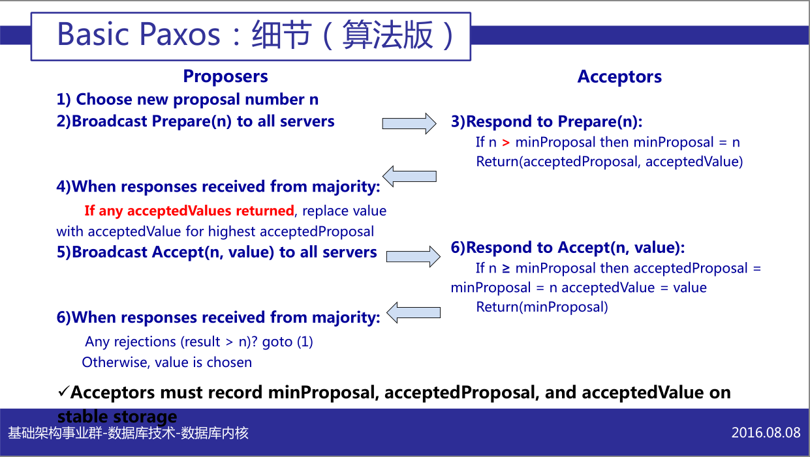
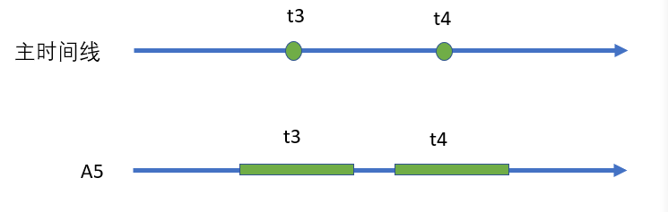
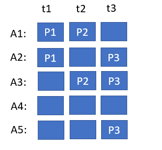
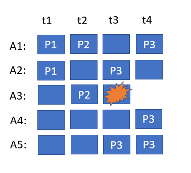
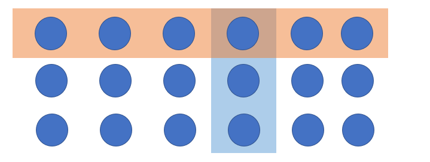
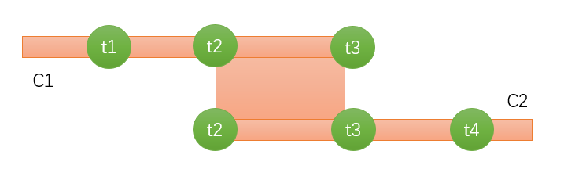

# 小学生也能轻松掌握的Paxos/Raft算法奥秘

Paxos算法是分布式领域中一个非常基本的算法，一向以晦涩烧脑著称。但是它之所以让人感到摸不着头脑，主要是因为我们不容易直观地理解它为什么要这样设计。尽管我们可以通过具体例子来验证其正确性，甚至可以用严谨的数学证明来说服自己它是对的，但我们还是很难回答，为什么一定要选择这种方式？这是否是唯一可行的方法？有没有可能不依赖数学推导，就能找到一种解释，让Paxos算法在直觉上显得不言而喻？

我在《[Paxos的魔法学研究报告](https://mp.weixin.qq.com/s/CVa_gUdCtdMEURs40CiXsA)》这篇文章中从异次元魔法学的角度为Paxos算法建立了一个魔法学图像，试图给出了一个Why的答案，而不仅仅是介绍Paxos算法“How to do”。本文是对上述文章的补充说明。

关于Paxos算法的基本知识，可以参考知乎上xp的文章 [200行代码实现基于paxos的kv存储](https://zhuanlan.zhihu.com/p/275710507), [可靠分布式系统-paxos的直观解释](https://zhuanlan.zhihu.com/p/145044486)

## 一. 为什么要学习Paxos算法？

或许有人会质疑，我的工作与分布式系统没什么关系，还有必要学习Paxos算法吗？答案是肯定的。只要你面临的问题涉及到多个状态空间，或者需要协调多个独立行动的实体，你就会遇到类似的问题，而Paxos算法提供的解决方案可以为你提供启示。

有人可能会提出，现在Raft算法更为流行，Paxos算法似乎不是那么常见。对此，我们可以这样理解：Raft算法实际上是Paxos算法的一个变种，它是在Paxos算法的基本原则指导下选择了一些特殊的实现策略。

将Paxos比作一个高层的接口定义可能更为恰当，它只涵盖了最基本的概念和策略。而Raft则是一种具体的实现，它补充了更多的实现细节，但是这些细节本质上是可选的，并不是实现分布式共识所必须的。

## 二. 什么是Paxos算法？

Paxos 解决的是分布式系统中达成共识的一个最简单的问题，即多个节点如何在可能发生故障的情况下就某个值达成一致。

正确的共识算法需要满足以下性质：

**一致性（Agreement）**: 所有的节点必须对同一个值达成一致。

**合法性（Validity）**: 这个达成一致的值只能来自于某个节点的提议。

**终止性（Termination）**: 最终所有节点会达成一致。

以上条件也被称为 Safety + Liveness，这是典型的既要又要，既要正确又要可行。一致性体现了共识的基本含义，而合法性用于排除一些平庸的情况，比如说所有节点约定不管外部提议是什么，我们都固定选择值是3，这样相当于是也可以形成共识，但是这种共识缺乏动态性，没有什么用。

共识算法所描绘的场景：一开始整个系统处于不确定状态，允许存在很多种可能性，比如值x和值y都可能，但是**执行完某个关键动作之后，整个系统会突然转变（类似于物理学中的相变，水突然冻成了冰），进入一种确定性的全局协同状态（凝固在某个选定的值上）**，按照算法的运行规则执行下去，最终所有的节点都会承认值只能是x，而不可能是y。

> 如果把参与共识算法的所有节点的所有动作按照一定的顺序组织成一个动作序列，则必然存在一个关键性动作，在这个动作执行之前允许多种可能，执行完这个动作之后结果固化。比如说一个Acceptor记录下一个值，则构成多数派，值被固化。如果它没有成功记录，则尚未构成多数派，还允许新的可能。
> 
> 虽然共识算法中所有节点都是并行运行的，但是在事后我们总是可以将所有动作组织成一个动作序列，并识别出其中的关键转变动作。

有趣的是，系统有没有可能进入一种类似薛定谔猫的状态，即选定了值，又没有选定值呢？从观察者的角度看，确实会存在这种状态，但是Paxos算法解决了这个问题，它内置了一种观测手段，使得最终必然会出现波包塌缩，得到确定性的结果。

### FLP定理

有趣的是，**满足上面的三个条件的共识算法在绝对的意义上是不存在的**！FLP定理（Fischer, Lynch, and Paterson theorem）指出在完全异步的分布式系统中，不存在一种共识算法能够同时满足一致性、可靠性和终止性这三个条件。

异步模型指的是没有全局时钟，进程可以以任意速度执行，消息可以在任意时间到达，但是消息最终会被保证送达。

FLP本质上是在说，如果一个全知全能的神故意对共识的进程进行捣乱，每次在共识将要达成的前夕（在关键性的转变即将发生的时候）都将一个关键节点无限期挂起，则没有任何算法可以确保达成共识。幸运的是，在我们的世界中目前还没有发现这种无聊的神明，多尝试几次，总会有成功的运气。

### Paxos算法速览




以上图片出自阿里巴巴基础架构事业部何登成的ppt, [PaxosRaft 分布式一致性算法原理剖析及其在实战中的应用.pdf](https://github.com/hedengcheng/tech/blob/master/distributed/PaxosRaft%20%E5%88%86%E5%B8%83%E5%BC%8F%E4%B8%80%E8%87%B4%E6%80%A7%E7%AE%97%E6%B3%95%E5%8E%9F%E7%90%86%E5%89%96%E6%9E%90%E5%8F%8A%E5%85%B6%E5%9C%A8%E5%AE%9E%E6%88%98%E4%B8%AD%E7%9A%84%E5%BA%94%E7%94%A8.pdf)

值被chosen的定义： 值被多数（超过半数）的acceptor接受。

### 相对论、时间和分布式系统

[Time, Clocks and the Ordering of Events in a Distributed System(1978)](https://dl.acm.org/doi/pdf/10.1145/359545.359563)

是Lamport被引用次数最多的文章，也号称是分布式领域最重要的一篇文章。Lamport在对这篇文章的回顾中有这么一段话：

> The origin of this paper was the note [The Maintenance of Duplicate Databases](http://www.rfc-archive.org/getrfc.php?rfc=677) by Paul Johnson and Bob Thomas. I believe their note introduced the 
> idea of using message timestamps in a distributed algorithm. I happen to
>  have a solid, visceral understanding of special relativity .
>  This enabled me to grasp immediately the essence of what they were 
> trying to do. Special relativity teaches us that there is no invariant 
> total ordering of events in space-time; different observers can disagree
>  about which of two events happened first. There is only a partial order
>  in which an event e1 precedes an event e2 iff e1 can causally affect 
> e2. I realized that the essence of Johnson and Thomas’s algorithm was 
> the use of timestamps to provide a total ordering of events that was 
> consistent with the causal order. This realization may have been 
> brilliant. Having realized it, everything else was trivial. **Because 
> Thomas and Johnson didn’t understand exactly what they were doing**, they didn’t get the algorithm quite right; their algorithm permitted 
> anomalous behavior that essentially violated causality. I quickly wrote a
>  short note pointing this out and correcting the algorithm.

Lamport具有MIT的数学学士学位（1960年），并且是布兰迪斯大学的数学博士（1972年），系统化的学习过狭义相对论。Lamport的这段自述充分说明，**学好计算机必须要懂一点物理**！

爱因斯坦通过想象发射一个光子去探测周围的世界，发现了一个惊天的秘密：**不同地方的时间只具有因果关联所导致的偏序关系，时间线并不是唯一的**！Lamport看到别人的文章中描述了消息发送、消息时间戳这样的概念之后，立刻意识到消息传递和光子传播是一回事，这背后的物理图像就是狭义相对论。一旦意识到这一点，后面的逻辑推导就是完全平凡的！而**Thomas和Johnson吃亏在没有学好物理学，压根没有理解自己创造的算法到底在干什么事情，导致算法中存在微妙的错漏**。缺少物理图像的指引，难免会在关键的时候犯迷糊。

有趣的是，Lamport虽然受到了狭义相对论的指引，他在自己的文章中却只是大谈特谈逻辑时钟，只字未提狭义相对论，导致有些人还以为这是Lamport拍脑袋拍出来的神来之笔。

Lamport的关于Paxos的原始论文[The Part-Time Parliament](https://ying-zhang.github.io/dist/1989-paxos-cn/)在1998年好不容易正式发表之后，一堆人大呼看不懂，于是Lamport在2001年又写了[Paxos Made Simple](https://www.jianshu.com/p/1bbbfbe300d1)一文，开宗明义就是一句话：Paxos算法，当用日常语言来表述时，是非常简单的（The Paxos algorithm, when presented in plain English, is very simple）。在这篇文章中，Lamport对于Paxos提供了一个为什么如此设计的解释（Why），只是这种解释是基于一步步的数学推理，相当于是强按着别人的头迫使别人承认Paxos算法的合理性，结果必然是一堆人刚看的时候以为是懂了，但一转头又迷糊了。

物理学的学习和研究非常讲究物理图像，物理系的人永远不会老老实实的按照数学规则去推导，他们之所以相信某个推导结果完全是因为这个结果对应于合理的物理解释。那么对于Paxos算法，我们不禁要问，它背后的物理图像是什么？在Lamport的心底，是否还隐藏着一个不为人知的、非数学化的对Paxos算法必然性的理解？就像当年他对那帮搞计算机的家伙悄悄隐瞒了相对论的存在？

## 三. Paxos的魔法学图像

分布式系统的底色是生的自由、死的随机的一片混沌，矛盾冲突无处不在，但是Paxos算法却偏偏在这一片混沌之上建立了统一一致的共识世界，这看起来宛如神迹。但是，凡人是很难理解神迹的，他无法站在神的高度俯瞰众生，只能凭借自己有限的生活经验去追索揣摩神的意图，最终必然会产生属于凡人的困惑。

人神之分，在于神域。神域之中，言出法随。制定规则，是神的起点，而谦卑的接纳规则、并狡诈的利用规则则是人之本质。所谓天人鸿沟，尽在于此。但是如果人族起了不臣之心，幻想着他也是规则掌控者，那么是否可以洞察这凡间一切的不可思议？所谓僭越一念起，刹那天地宽。我们突然发现，神，作为凌驾于一切有限客体之上的最完满的存在，解决共识问题只需要三步：

1. 神说：要有时间

2. 神说：时间静止

3. 神说：值应是X
* 时间静止的前提是时间需要先存在

* 在已经存在时间的情况下，如果全宇宙的时间都静止下来，那么就不会出现任何意料之外的事情发生，此时神可以从容的去干任意他想干的事情。注意，我们总是通过观察变化来认知时间的存在，比如比较单摆的摆动和其他变化的比例关系。**如果时间静止，就意味着没有出现任何可观测的变化**。但这并不意味着完全没有变化发生，比如说如果在我们这个宇宙中所有的变化都齐刷刷的延迟1秒钟，我们是无法发现这种变化的。

* 在时间静止之后，神在多处直接指定相同的值即可。这样当时间重新流动之后，处于不同地点的人们会发现同样的值突然出现在眼前，共识已经达成。

我们的世界现在处于末法时代，天地间灵气耗尽，魔力散失，真正的魔法在这个世界上已经不复存在。但是，我们手上还有一台计算机。如果我们世界的底层是一台超级计算机，那这个世界的所有物理规律完全可能是由这台机器所模拟出来的。那么在现在这个低魔的世界中，是不是同样可以用手中的计算机去模拟高魔世界的魔法？

> 计算机的本质是图灵机，而图灵机的本质是它是万能模拟器，可以模拟一切计算过程，这就是所谓的图灵完备。

**Paxos算法是对时间静止这一九级魔法的模拟实现**。

一旦想清楚Paxos的真正秘密是它是来源于异次元的魔法学，剩下的就只是一些平凡的技术细节了。

> 这里需要的是世界观或者说认知范式的转换：我们为达到目标先设计一个自然法则，然后再去思考如何落实这个法则。就好像在编程中我们先设计一套接口，然后再去具体实现这些接口。

回想一下，**Paxos算法中Proposer和Acceptor的一系列动作本质上都是在保证时间的单向流动**。

1. Proposer 生成全局唯一且递增的Proposal ID，这个Proposal ID就是一种时间的标记，每个ID对应一个唯一的时刻。

2. Acceptor 收到Propose后，为什么不再应答 Proposal ID 小于等于当前请求的 Propose？因为时间是单向流动的，Propose成功表示时间静止的开始，在时刻t静止，就不能再在小于时刻t的时刻静止。

3. Acceptor 收到Propose后，为什么不再应答 Proposal ID 小于当前请求的 Accept请求？从Propose到Accept是时间静止的阶段，所以我们可以接受时间静止开始时刻t对应的Accept，但是不能接受小于时刻t的时间的Accept。

在我们这个低魔的世界中模拟魔法，最基本的手段是认知删除，也就说，将一切不符合魔法学原理的事实从我们的认知中删除就好了，**看不见的就不存在！**  Acceptor一系列看起来古怪的行为只是在忽略那些会导致时间静止魔法穿帮的事实而已。


每一个Acceptor都记录了一个只增不减的ProposalID，相当于建立了本地的时间箭头。而整个系统通过ProposalID对齐到同一时间点，相当于是将多个局部的时间箭头对齐后，捆绑为一个粗粒化的、整体性的时间箭头。时间的流逝类似于波阵面扫过整个系统。

所以，从神的视角来看，Paxos算法不过是通过时间静止魔法，**强行将多条时间线对齐为唯一的一条主时间线**的雕虫小技而已。

### 有趣的应用：停止-对齐与乐观锁

这种”停止-对齐“的技术是我们在分布式系统中获得共识的一种基本策略。例如，在kafka消息队列中，同一个消费者分组中的多个消费者是独立行事的，但同时它们必须就如何分配工作达成共识。因此，当消费者分组中的成员增减或者topic结构发生变化时，会触发所谓的再平衡（Rebalance）过程。再平衡过程中，Coordinator首先要求所有worker停止当前的工作，集体切换到下一个世代(epoch)，然后再下发新的分配方案。一个分配方案仅在一个世代中有效。  

我们在数据库中常用的乐观锁也是同样的处理策略。刚进入处理程序的时候去读取MainRecord的版本号，然后再修改MainRecord以及相关联的SubRecord，最后在一个事务中批量提交修改，同时尝试更改主记录的版本号。  

```
 update MainRecord 
 set version = version + 1 
 where version = :record_version
```

如果能够更新成功，说明在整个处理过程中时间静止，没有其他人执行相冲突的动作。

### 微观与宏观

局部的时间箭头随时会因为各种异常发生中断，这时候就需要一点大局观，也就是区分所谓的微观和宏观。微观上可能有些成功了，有些失败了，但只要大多数(Majority)成功了，则我们就定义它在宏观上成功了。因为一个集合不允许同时存在两个Majority，而Majority不可能既选择了值X，又选择了值Y，所以从微观到宏观的上升路径是明确的。

理解Paxos算法的一个关键点是，我们只需要关注那些上升到宏观世界的事件，也就是在主世界的主时间线上发生的事情。主时间线上的每一个时间点对应于小世界中都是一个时间静止开始--时间静止结束的一段过程，在每个时间点上都可能会发生一次值的设置（如果成功设置，则共识达成）。**时间静止的效果最终是在主世界中完全体现**：在主时间线上表现为一个个孤立的时间点，这些点不会重叠，**对应于小世界中的过程区间不会交错**。



大多数小世界中都发生的事件才会上升到主世界中，成为主世界中的事件。也就是说，大多数小世界在时刻t都写入了某个值A，那么这个事实就不会被任何后续的变化所改变或遮蔽，不会有第二个声音提出有效的反对意见，此时主世界中才会发生写入值A这个事件。

### 有趣的应用：避免脑裂（Split Brain）

在需要Leader选举的算法中，一个经典的问题是**如何避免脑裂**？如果新生代的Leader已经得到了人民的拥护，而老一代的Leader却不肯退位，总在那里不停的搅局怎么办？一个一般性的解决方案就是：**直接把旧Leader定义为zombie, 彻底忽略来自上一个世代的所有信息**（比如拒绝所有epoch较小的请求）。实际上，我们并没有限制旧Leader的行为，在自己的小世界中，它完全可以自以为是的为所欲为，只不过它的行为最终无法上升为集体意志，无法对主世界产生影响而已。新的Leader一继位，需要**未读先写**，先在主世界中打上自己的epoch标记（类似于更改全局共享变量），这样老的Leader在提交计算结果的时候通过乐观锁发现自己已经失势，最终只能无奈放弃自己的处理结果。  

在我们这个位面的物理学中，随着量子力学的发展，观察或者说测量已经具有了非常独特的理论意义。按照量子场论所描绘的视图，在我们看不见的虚时间中，无数狂野的事物在相互竞争、湮灭，最终反映到现实世界中的只是某种综合运算后的结果而已。透过诡异的量子隧道效应，实际上我们也可以窥见这背后的惊涛骇浪。  

## 四. 单调性：从薛定谔猫态塌缩

Paxos的第二阶段有一个非常令人费解的操作：Proposer 收集到多数派的Propose应答后，如果应答中有值，则会从应答中选择Proposal ID最大的提案的Value，作为本次要发起 Accept 的提案。为什么Proposer要放弃自己原来的提案，还要选择别人的提案的值？为什么偏偏需要选择Proposal ID最大的那个提案的值？

这些问题的存在，本质上是因为凡人的局限性所导致的。



考虑有5个Acceptor，多个Proposer的情况。在ProposalID=t1的时候，提案P1被A1和A2接受，但是没有达到多数派，因此在这一轮处理中值并没有被确定下来。ProposalID=t2的提案P2同样没有达到多数派。ProposalID=t3的提案P3被多数派A2、A3、A4接受，从而达成共识。

**当ProposalID=t3达成共识之后，有没有可能在t4时刻我们达成一个新的共识P4**？这样的话，t3的共识是P3，t4的共识是P4，而t1和t2时刻没有达成共识。对神来说，不同的时刻选定不同的值是完全OK的，No Problem，因为神是全知全能的。但是**对于鲁钝的凡人而言，如果允许不同的时刻有不同的共识，他会出现认知障碍**。

假如允许共识被推翻，一个只有有限认知能力的凡人，他怎么知道哪个值才是要用的值呢？很多时刻根本没有达成共识（例如t1和t2），他要从t1到tn遍历所有的时刻来获知所有共识的值吗？所以人类所研究的基础共识算法都会直接要求，一旦达成共识就一直保持共识不变。



现在，考虑上图中的情况。假设A3在处理P3的时候直接宕机了。从外部看来，存在两种情况：

1. A3已经接受P3，所以达成了共识
2. A3还没有接受P3, 所以尚未达成共识

**除了A3自己之外，没有任何人知道它的处理情况。但是，A3已经挂掉了，它不能回答任何问题**！所以，如果不同的时刻可能有不同的共识，那么我们有可能会陷入一个尴尬的境地，那就是历史结果完全处于一种量子不确定状态，无法简单的回答是或者否。

对于凡人而言，最理想的选择是系统具有某种**单调性**：它只会向着一个方向不断迈进，而且一旦到达目标状态，就永远禁锢于该状态中。这样的话，任何时候我们想从系统中提取信息，都可以直接将系统向前推进一步。如果系统已经达成共识，则继续前进一步得到的仍然是共识的值，如果没有达成共识，则我们将实际选定一个值，从而摆脱不确定的状态。例如，在上面的例子中，我们继续运行一步Paxos算法，无论t3时A3做出何种选择，我们一定会在t4得到P3的结果，从而在t4之后**消除了系统中的不确定性**。在郁白的文章中，这也称为最大提交原则。

如果沿用上一节的宏观世界分析，我们会发现因为微观世界随时存在着生生灭灭的随机涨落的情况，导致宏观世界中我们认知到的事实可能会处于薛定谔猫态中。Proposer从多数派Acceptor中获取到应答时，相当于是在主时间线上完成了一次读取操作，只是这种读取操作具有某种副作用。

1. 我们知道所有主时间线上的事实肯定能按照发生的”时间点“排序，而共识是在主时间线的某个时间点上发生的写入。那么保持共识一致的最简单的方案就是，**未写先读**，写入之前先偷看一眼前面的情况。

2. 如果读取到的多数派的值和时刻t都一样，则表示时刻t的值已经确定，本质上主时间线上的共识已经达成，没有必要再继续下去，直接返回结果就可以了。

3. 但是如果从多数派读取到的值或者时刻t不一样，则前一个时刻有可能已经实现共识也有可能尚未实现，整个系统处于一个不确定的状态。这种情况下我们需要确保如果共识已经达成，则我们的后续行为不会破坏共识。也就是说，如果t-1时刻有多数派接受了值X，则时刻t我们不能提出一个不同的值Y。**如果共识已经达成，则共识的值一定是ProposalID最大的值**。因为如果t3时刻达成了共识，则**紧随其后**的t4一定看到了t3的结果，共识不能被推翻就必然导致t4的值一定是共识的值。所以如果ProposalID最大的值不是共识的值，则表示在它之前不可能已经达成共识。**Paxos算法的发展具有单调性，在主时间线上的状态是从没有值发展到不确定是否有值，再发展到确定为某个值，所以我们只需要查看最后一步的结果就好了**。因为一个ProposalID只会由某一个Proposer使用一次，所以一个ProposalID最多对应于一个值。

4. Paxos的第二阶段当从多数派读取到值之后，本质上是放弃了自己的写操作，它退化为一个纯粹的观测动作，只是这种观测有一个副作用：主世界中的时间点上的状态从可能设置了值（达成共识）也可能尚未设置值的不确定状态向一个确定性的有值状态塌缩。**相当于实际上并没有写入新的值，只是从当前可能的值中选择了一个，这与量子力学中观测的作用是一致的**。
   
   $$
   |X\rangle + |0\rangle \longrightarrow |X\rangle
   $$

5. Paxos算法的第二阶段如果成功执行，相当于在时间静止之后完成了一次原子性的`读取+写入`操作。

> 薛定谔猫态表示系统处于量子叠加态，你不看它的时候猫既没有死也不是活，处于既死又活的叠加状态，同时具有死和活的可能性。你看它一眼，系统发生状态塌缩，猫的状态就只能是死或者活。

回到上面的例子，有一个微妙的情况。在t1时刻只设置了两个P1, 并没有达成共识。t2时刻也只设置了两个P2，没有达成共识。但是t3时刻的时候在多数派中一定会看到P1或者P2，所以实际上P3只能是P1或者P2，不能是一个任意的值。在多数派中如果接收到的都是空值，则可以安全的判定尚未实现共识，如果已经有值的情况下，出于安全起见，按照Paxos的规则实际会从已有的值中选择。在明确接收到前一时刻的5个响应，明确知道尚未达成共识的情况下，我们如果不采用Paxos的选择，直接选择一个其他的值本质上也不会产生冲突。Paxos的选择虽然不是必须的，但是它比较简单，同时在一定程度上可以加速算法收敛。

### 什么时候达成的共识？

当共识出现的时候，参与者中有谁知道已经达成了共识吗？一个有趣的事实是，当共识达成的那一刹那，系统中所有的参与者，包括Acceptor和Proposer，没有任何人知道共识已经达成！只不过，随着时间的推移，算法的运行会**把共识已经达成这一事实逐步的揭示出来**。


首先，我们注意到当共识没有达成之前，**Acceptor是有可能改变自己接受的值的**，例如A3先接受了P2，后面又接受了P3。因为Proposer随时有可能失联，所以Acceptor只能选择接受新的值。这导致当A3接受P3的时候，它不可能知道共识已经达成，P3就是最终选定的值。同样的道理，A2和A4也只知道自己局部的情况，无从判断系统整体是否已经达成共识。而在Proposer一端，在接收到多数派Acceptor的成功响应之前，它也不知道自己提交的P3能否被多数Acceptor接受，成为最终的共识。所以说**共识是属于整体的，单个参与者对于共识是否达成需要有一个理解的过程**。

这里还有一个有趣的细节。在t2时刻，如果第一阶段收集到的多数派响应来自A3,A4,A5，则我们可以提出任意的值P2（如果多数派中包含A1和A2，则按照Paxos的规则，P2只能是等于P1了）。但是写入多数派的时候并不要求写入A3, A4,A5，而是允许选择任意一个多数派，所以我们能够将不同于P1的P2写入A1。为了强调这一点，Lamport在他的论文中还专门写了一句话：This need not be the same set of acceptors that responded to the initial requests。

## 五. Leader Based: 复制粘贴

施展九级魔法是相当消耗魔力的行为。一个具有社会主义核心价值观、勤俭节约的神绝对不会无端的浪费魔力。所以一旦时间静止下来，为了维系分处多地的节点的行为一致，神的最佳选择是施展一个八级魔法”大傀儡术“，将一个节点（称为Leader）上的行为复刻到其他所有节点上。

这种复刻源自于神的力量，因此一旦leader发动新的动作，它将穿越千山万水，无视物理阻隔直接降临于远端的follower身上，follower没有反驳的权利，只有执行的自由。不过，俗话说的好，上面动动嘴，下面跑断腿。在我们这样一个低魔世界中，实现大傀儡术并不是一件很轻松的事情，一般通过在发送端和接收端各自增加一个日志文件来实现。

发送端把动作决定写入日志，从而使它成为不可变的神谕。发送组件扫描日志系统，确保将其逐条传达到远端。如果连接不上接收端，或者发送出错，或者发送后没有接收到期待的响应信息，发送组件不能抱怨，不能放弃，唯有努力工作，**不断重试**，直到接收到成功响应为止，这一过程可以保证至少成功发送一次（At Least Once）。接收端必须无条件接收所有消息，不能拒收，不得篡改。因为有可能多次接收到同一个消息，它必须通过本地日志进行**幂等检查**，过滤掉所有重复消息，从而实现最多成功处理一次（At Most Once）。如果消息需要通过一个流式处理系统（Stream）进行接力处理，为避免每次从源头开始不断重播，需要中间节点能够通过**快照机制**把已经完成的处理结果记录下来。

毫无疑问，MultiPaxos和Raft算法都是以上复刻策略的一种具体实现。一旦选主成功，代表任期的Term编号就可以被多次复用，通过同一个Term编号可以发出多条执行指令，只要这些指令通过log index能够区分即可。

如果仔细分析一下，我们会发现，从网络上接收到的消息可以分成两类：一类是请求（Request），接收方可以自由选择相应的处理方式，处理结果也是不确定的，可以成功返回也可以抛出异常。另一类是单向的通知（Notice），它对应的处理方式是固定的，接收方不能有反驳的意见。

一个有趣的例子是两阶段提交。在Prepare阶段，Participant接收到的是请求消息，因此它可以根据自己的独立意志选择提交或者回滚。一旦Participant将自己可能的选择返回给Coordinator，它就向Coordinator让渡了自身的自主权，许诺今后只接收通知消息，将行为与Coordinator保持一致。当Coordinator决定提交时，Participant绝不会选择回滚。同样的，Participant如果回滚，我们知道Coordinator的选择也只能是回滚。它们两者的选择不再是独立的做出，而是纠缠在了一起。

### 2PC与量子纠缠态

2PC（两阶段提交）可以看作是由Coordinator提供一致性的来源，各个Participant逐渐和Coordinator建立纠缠。而Paxos是逐步建立一个Quorum，Quorum中的参与者纠缠在一起。

2PC运行之前，各个Participant都是可以独立选择成功或者失败，也就是说结果是随机的。第一阶段运行完毕之后，如果单独去观察每一个Participant，它仍然是可能成功或者失败，结果仍然是随机的。但是如果我们观察整个状态空间，却会发现状态空间中可行的状态被削减了，只有部分纠缠态存留下来。

$$
|成功,成功\rangle + |失败,失败\rangle 
$$

关于量子纠缠态，以下是智谱清言AI的介绍：

量子纠缠态是量子力学中一个非常特殊且非经典的现象，它描述了两个或多个粒子之间的一种强相关性，即使这些粒子被分隔得非常远，它们之间的状态仍然可以即时地相互影响。

假设我们有两个粒子A和B，它们可以被制备在一个特殊的量子态中，比如一个纠缠态。一个简单的纠缠态例子是贝尔态（Bell state）之一，可以表示为：

$$
\frac{1}{\sqrt{2}} (|00\rangle + |11\rangle) 
$$

在这个态中，"0" 和 "1" 分别代表粒子的某种量子属性（比如自旋方向）的两个可能状态，而 |00\rangle 表示粒子A处于状态"0"且粒子B处于状态"0"，|11\rangle 则表示粒子A处于状态"1"且粒子B处于状态"1"。

#### 纠缠粒子的行为

当粒子A和B处于上述纠缠态时，不论它们相隔多远，以下现象会发生：

- **测量一致性**：假设我们在粒子A的位置测量它的状态，并且发现它处于状态"0"。由于粒子A和B处于纠缠态，粒子B的状态将会立即确定为"0"，即使它距离粒子A非常远。如果我们测量粒子B并发现它处于状态"1"，那么粒子A的状态也立即确定为"1"。这种即时的状态关联是量子纠缠的一个关键特征。
- **随机性**：在纠缠态中，当我们测量粒子A或B时，我们无法预测具体会得到"0"还是"1"，因为纠缠态是这两个结果的叠加。然而，一旦我们测量了其中一个粒子，另一个粒子的状态也会立即确定，并且与第一个粒子的测量结果相关。
- **非局域性**：量子纠缠展现了非局域性，意味着粒子A的状态可以即时影响粒子B的状态，而不需要任何信号在它们之间传递。这一点违反了经典物理学中的局域实在论，即物理效应不可能瞬间传递。

===========智谱清言AI创作完毕========

### 分布式最本质的困难：不知道

在凡人的眼中，这个世界充斥着令人心烦意乱的不确定性，每一步行为都产生三种可能的结果：**1. 成功，2. 失败 3. 不知道什么结果**。曾几何时，孤立的单机系统为我们提供了一种乌托邦式的幻象，世界是二分的，好与坏，成功与失败，光明与黑暗。但是真实的世界让人清醒，在由偶然所主宰的世界中，这种内在的不确定性造就了分布式系统的本质性的困难。

当一个动作的结果是不知道的情况下，我们能够怎么办呢？答案是，我们只能等待反馈。要么被动等待负责执行的实体返回执行结果，要么发起主动探查，等待探查到执行结果。比如说，我们要确定一个数据导出任务是否成功生成了导出文件，唯一的方法就是在执行完生成任务之后，检查生成文件是否存在并且数据完整。

## 六. Paxos算法的变体

参见[SoK: A Generalized Multi-Leader State Machine Replication Tutorial](https://escholarship.org/uc/item/9w79h2jg)

### Fast Paxos

如果很确定自己是第一个提出一个值的话，那么就可以安全地跳过第一阶段，直接进入第二阶段提交。Fast Paxos使用rnd=0直接尝试一次phase2写入。
为了防止第一次尝试写入冲突后正确执行，quorum需要`n*3/4`，这样后续paxos读取的时候至少要读取`1/2+`，在这`1/2`多中，已经写入的值仍然是多数派。

$$
[\frac 1 2 ] = (\frac 1 4) + [\frac 1 4]
$$

也就是说，`t=0`时刻存在两个活动者，所以我们需要新的信息来判断它们的执行顺序。在时间冲突的情况下，但是仍然可以通过对多数派进行计数得到已经被选定的值。

如果一个值想要被快速提交，它不仅要得到大多数成员的认可，还要在大多数的大多数中得到认可，才能安全地提交。

### Flexible Paxos

为了在一个偶然的、不确定的世界中奋力求生，我们唯有精诚合作，形成超越个体的集体意识。个体可以消亡，而集体通过新陈代谢实现永生。一个有趣的问题是，多数派（Majority）是否是形成集体意识的唯一选择？显然不是。精神的传承，只需要种子的存在。

来看一个Grid Quorum的例子， 



对于上面`3*6`个Acceptor所组成的一个Grid，我们可以规定只要**写入任意一列**所构成的Quorum即可认为共识达成。显然，任意两列都是不相交的。为了避免做出自相矛盾的选择，我们需要横向架设一个桥梁，规定Paxos第一阶段读取的时候必须至少读取一行。假设某个时刻共识已经诞生，则下一个共识必然先经过一个行读取再执行一个列写入。因为任意的行和任意的列都是相交的，行读取必然会读到共识的值，因此写入的新值必然是和此前的共识保持一致的。注意到这个例子中的行Quorum与相交的列Quorum都没有达到多数派，而且它们的总元素个数为3+6-1=8个，也没有构成多数派。所以，读取和写入时候的Quorum既不需要相同，也不需要占据多数，只要能够相交，足以传递信息即可。

> Flexible Paxos指出第一阶段和第二阶段的 quorums 必须相交，但同一阶段内的 quorums 则不需要相交。这意味着任何具有这种性质的 quorum 系统都可以使用，而不仅仅是多数派 quorums。**读+写是时间静止过程中的一个原子操作，所以只需要读Quorum+写Quorum产生的结果互斥即可**，不需要写Quorum相交。

要超越个体，只需要把个体升华为Quorum中的一员。一个个体可以属于多个Quorum。只要过去和未来所有的Quorum协调一致，不会做出相互冲突的选择，最终我们就可以形成统一的集体意志。

### Quorum并不需要是大多数

Quorum（法定代表）的要求是Quorum之间存在交集。比如，要求所有Quorum都包含一个指定元素a，这样也是合法的Quorum，只是不容错。`{{a,d},{a,b},{a,c}}`

此外我们还注意到，$A \cap B $不为空，且A没有包含于B的情况下，实际上意味着A和B的补集的交集也不为空，所以$A\cap \bar B \ne \emptyset $ ，这也就意味着说一组存在交集的互不包含的Quorum

$$
Q_i \cap Q_j \ne \emptyset \Longrightarrow Q_i \cap \bar {Q_j} \ne \emptyset
$$

也就是说一组Quorum中，我们任意选择其中的一个$Q_j$，然后取它的补集，则这个补集与其他的Quorum也是两两相交的。

### 偶数节点集群

一般情况下集群节点总数是奇数，比如5，但如果节点总数是4，则在网络存在分区的时候，会出现整个系统容错性不足的问题。比如说考虑4个节点构成的集群，其中a,b在数据中心1，而c和d在数据中心2，多数派要求至少3个节点。这种情况下，如果数据中心1和数据中心2出现网络分区（Partition），则每个数据中心都只有两个节点，没有满足多数派要求，导致Paxos算法无法运行下去。

一种解决方案是扩充Quorum的构成，将`{a,b},{b,c},{a,c}`也加入到Quorum的集合中（也就是想办法最大化Quorum集合，这样只要能想办法 满足其中任意一个Quorum的构成，Paxos算法就可以运行下去，可选的Quorum个数当然是越多越好）。原本4节点集群的多数派Quorum为 `{a,b,c},{b,c,d},{a,c,d},{a,b,d}`，显然`{a,b}`和这个多数派中的每一个都重叠，因此它也可以加入到Quorum集合中。通过增加一些非3节点的Quorum，我们就可以克服上面的网络分区困难，在分区发生的时候仍然可以实现Paxos。

这是一种通用的策略，可以认为扩充后的Quorum集合为 $Major(D)\cup Major(D \backslash \{d\})$, 即以偶数个节点的多数派为基础，然后再删除一个节点d，考虑剩下的奇数个节点中的多数派，将结果合并到一起。

### Multi-Paxos和Raft

Raft和Paxos的统一性可以参考xp的文章 [将 paxos 和 raft 统一为一个协议: abstract-paxos](https://zhuanlan.zhihu.com/p/488629044)， Raft论文的翻译参见[raft-zh_cn.md](https://github.com/maemual/raft-zh_cn/blob/master/raft-zh_cn.md)

Paxos算法解决的是单个决策问题，即如何在分布式系统中对单个值达成一致。但是在实际应用中，我们总是需要连续做出决策。

Multi-Paxos是将Paxos算法用于Replicated State Machine这样一个实际问题。在Replicated State Machine中，每个状态变更都作为一个日志条目记录下来。Multi-Paxos确保这些日志条目在所有副本上的顺序和值是一致的。这是通过在每个条目的提交过程中运行Paxos算法来实现的。也就是说，每个日志条目对应一个Paxos Instance。

为了保证日志条目顺序提交，Multi-Paxos为每个条目引入了一个递增的logIndex，而且约定logIndex必须连续，不会出现空洞（否则不容易判断是否所有有效的日志条目都已经存在）。这样前后的日志条目就被隐式的关联起来。

本质上，Multi-Paxos算法中多个日志条目支持一定程度的并行处理。在确定每个条目的值的时候可以是乱序的，但是提交的时候（允许应用到状态机上的时候）需要按照顺序处理。比如说，我们可以先确定`logIndex=100`的日志条目，但是这个条目所代表的动作无法直接应用到状态机上（无法提交），只有当logIndex=1到logIndex=99的所有条目都确定后，才能从logIndex=1开始逐个应用到状态机上。因此，日志条目的提议过程可以是乱序的，但它们的应用过程必须是严格有序的，以确保状态机的一致性和正确性。

Multi-Paxos通过引入领导者（Leader）角色和状态共享，对Paxos的连续应用做了性能优化。首先，所有的提案都由领导者负责处理，减少了冲突并简化了交互逻辑。其次，领导者可以在获取到一次Promise之后，反复复用此前的ProposalID（通过logIndex区分不同的消息），跳过Paxos第一阶段的处理，相当于在一次时间静止过程中增加多个日志条目。

Raft可以看作是对Multi-Paxos的一种改进或者补充，它针对Multi-Paxos一笔带过的很多技术细节问题都提出了明确的解决方案（但也引入了更多的限制）。以下是智谱清言AI所返回的Raft相对于Multi-Paxos的一些关键点：

1. **明确性**：Raft对许多在Multi-Paxos中不够明确的技术细节提供了清晰的解决方案。例如，Raft明确规定了日志条目的复制过程、领导者选举的机制、日志的一致性检查等。

2. **可理解性**：Raft的设计目标之一就是提高算法的可理解性。它通过减少状态的数量和简化状态转换逻辑来实现这一点。

3. **限制性**：虽然Raft简化了算法，但它也引入了一些限制。例如，Raft要求日志条目必须按照顺序提交，而在Multi-Paxos中，日志条目的提议可以乱序进行（尽管应用时仍然需要有序）。

以下是Raft相对于Multi-Paxos的一些具体改进和限制：

- **领导者选举**：Raft使用随机计时器来选举领导者，这有助于减少选举冲突，并且选举过程更加明确。
- **日志复制**：Raft中的日志复制过程非常直接，领导者直接将日志条目复制到跟随者，而Multi-Paxos中的日志复制可能需要处理更多的乱序情况。
- **安全性**：Raft通过一些机制（如预投票阶段和日志匹配属性）来增强系统的安全性。
- **集群成员变更**：Raft提供了明确的集群成员变更机制（joint consensus），这在Multi-Paxos中通常需要额外的逻辑来处理。

==========智谱清言AI创作完毕=========

Raft的Leader选举使用了本地定时器，这相当于是额外引入了存在可比的本地时间这一新知识，原先Paxos算法中只需要因果关联所导致的逻辑时钟，则Raft相当于使用了某种物理时钟。需要注意的是，时间是我们这个世界内在一致性的来源，物理时钟的引入本身就会简化一致性处理。比如说，Google的TrueTime技术使用了精确计时的原子钟，相当于是在系统中引入了一定精度范围的绝对时钟，这使得他们在实现分布式事务的时候可以进行简化处理。

以下是智谱清言AI补充的一些解释：

**物理时钟与逻辑时钟**：

- 物理时钟是基于实际时间的时钟，而逻辑时钟（如Lamport时钟）是一种用于捕捉事件顺序关系的时钟，不依赖于实际物理时间。
- 引入物理时钟可以简化一致性处理，因为它提供了一种全局一致的参考时间，使得可以在不同的节点上比较事件的时间戳或者时间区间的长短。

**Google的TrueTime技术**：

- Google的Spanner数据库系统使用了TrueTime技术，该技术结合了原子钟和GPS时钟来提供非常精确的时间服务。TrueTime提供了一个时间范围，确保了不同节点上的时间同步误差是有界的。
- TrueTime技术的引入简化了分布式事务的处理，因为它允许系统在事务的时间戳上有更高的确定性，从而支持外部一致性（外部一致性是指事务的顺序与它们在全局时间线上的顺序一致）。

======智谱清言AI创作完毕=======

### 成员变更

参见[TiDB 在 Raft 成员变更上踩的坑](https://zhuanlan.zhihu.com/p/342319702)

Raft原始的论文提出了单步变更（逐个成员变更）和Join Consensus（一次性变更多个成员）两种方式，并且提倡单步变更，但后来发现这种方式存在问题，Raft原始论文中的算法也存在漏洞，最终还是join consensus算法成为理论层面和实践层面的最佳选择。

考虑由abc构成的集群C1迁移到def构成的集群C2



**在Paxos系列的算法中，我们只需要考虑主世界时间线上发生的事情，不用理会微观层面的细节。这其中就包括Leader在什么时候切换的问题**。因为Paxos算法的安全性本质上来源于指定时刻t只会有一个Quorum实现写入（Quorum的互斥性），至于这个Quorum写入是否是由某个Leader发起的根本无关紧要。Paxos算法并不依赖于选主，Leader的存在只是一种性能优化手段。

成员变更本质上是从集群C1的时间线切换到集群C2的时间线。在t1时刻（C1主世界的逻辑时间）集群配置为C1，在t2时间我们发起切换，相当于是准备切换时间线，这要求我们要把两条时间线对齐，因此t2时刻需要在C1时间线和C2时间线上都写下join集群配置，也就是说从t2开始，这两条时间线开始同步，任何事情都必须在C1的Quorum和C2的Quorum中同时发生。也就意味着t2是 Major(C1) + Major(C2)作为集群配置的提交(commit)时刻。在t3时刻，我们切换到C2配置，这个配置起作用的时间也是C2配置在Major(C1)和Major(C2)中成功写入为标志。t3之后只有C2集群存活，C1集群中不再使用的节点可以退出。

 从t2到t3的过程中，要求所有的提案都需要Major(C1)和Major(C2)同时通过。相当于我们先切换到一条较粗的时间线，然后再切换到一个较细的时间线。不可能直接从C1时间线直接切换到C2时间线，因为这样会导致在交叉点两者都存在自己的多数派，从而产生脑裂。我们需要t2到t3这样一段区间将两条时间线粘结在一起。

### 幽灵复现问题

参见[如何解决分布式系统中的“幽灵复现](https://www.infoq.cn/article/YH6UVyFLyN3oOOk1Ag7B), [共识协议：切主后的困境 - 日志恢复和幽灵复现](https://zhuanlan.zhihu.com/p/652849109)

Multi-Paxos协议处理过程中可能会出现一种所谓的“幽灵复现”的问题，它指的是在某些情况下，之前未能形成多数派确认的日志在后续操作中重新出现，导致数据不一致或重复处理的问题。也就是说在上一个leader没有达成共识的条目有可能会在下一个Leader达成共识，从未知状态转成提交状态。


第一轮，A被选为Leader，写下了1-10号日志，其中1-5号日志形成了多数派，并且已给客户端应答，而对于6-10号日志，客户端超时未能得到应答。
第二轮，A宕机，B被选为Leader，由于B和C的最大的logID都是5，因此B不会去重确认6-10号日志，而是从6开始写新的日志，此时如果客户端来查询的话，是查询不到6-10号日志内容的，此后第二轮又写入了6-20号日志，但是只有6号和20号日志在多数派上持久化成功。
第三轮，A又被选为Leader，从多数派中可以得到最大logID为20，因此要将7-20号日志执行重确认，其中就包括了A上的7-10号日志，之后客户端再来查询的话，会发现上次查询不到的7-10号日志又像幽灵一样重新出现了。

为了避免这个问题，新一任Leader上任后需要先写入一条StartWorking日志，开启一个新的epoch，然后忽略所有此前epoch未完成的工作。

## Generalized Paxos

参见[SoK: A Generalized Multi-Leader State Machine Replication Tutorial](https://mwhittaker.github.io/publications/bipartisan_paxos.pdf)

Multi-Paxos和Raft考虑的都是线性日志，日志中的条目构成一个全序(total order)集合：排在前面的日志总是要先执行。但是实际情况中日志中某些项的执行先后顺序是可以颠倒的，只要它们之间不存在冲突关系（比如读后写，写后读等），例如`a=1`和`b=2`这两个命令互不相关，可以交换执行顺序。泛化Paxos的做法是通过依赖服务来计算日志条目之间的偏序(partial order)依赖关系，然后构成冲突图。

> 偏序（Partial Order）是数学中的一个概念，用于描述集合中元素之间的一种“部分排序”关系。在偏序关系中，集合中的某些元素之间可以比较大小，而其他一些元素则无法直接比较。

部署配置：

proposers: 至少f+1个节点

dependency service nodes: 2f + 1个节点

acceptors: 2f+1个

replicas: 至少f+1个

$deps(v_x)$是至少f+1个依赖服务节点所计算得到的依赖集合的并集。

依赖服务接收到x，再接收到与之冲突的y时，会增加一个节点$v_y$到节点$v_x$的箭头，$v_x \in deps(v_y)$

共识不变式： 对于每一个顶点 v ，最多只能够有一个值 `(x,deps(v))` ，就如同 Raft 的日志中，一个日志项要么没有提交，一旦提交了所有节点都是同一个值。

依赖不变式：形式化的描述了依赖图中的冲突关系。如果x和y存在冲突，则要么$v_i \in deps(v_y)$, 要么$v_y\in deps(v_x)$, 要么两者同时满足。


两个冲突的操作，可能是同时发起的，而不同的消息到达不同的依赖服务节点的顺序有可能不同，这就导致了在不同服务节点中的依赖关系可能不同。即使依赖服务维护的冲突图是无环的，Replica 中形成的冲突图也有可能有环。

## EPaxos

记录deps, mmp3与EPaxos的不同在于它记录所有依赖的instance，包括所有间接依赖的，由此才能保证线性一致性。
