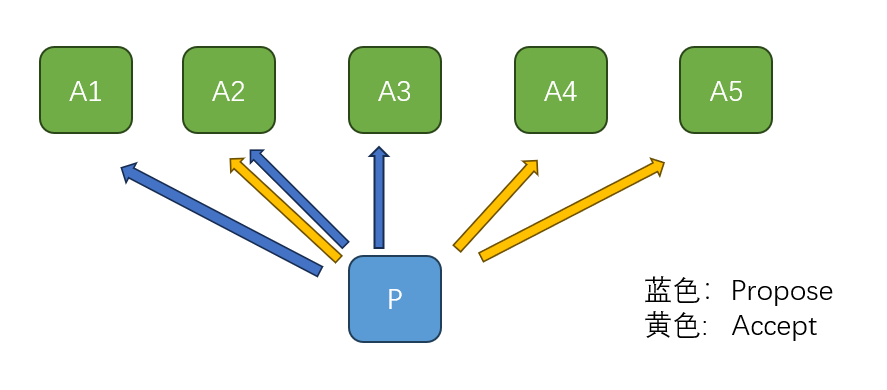

# 小学生也能轻松掌握的Paxos/Raft算法奥秘

Paxos算法是分布式领域中一个非常基本的算法，一向以晦涩烧脑著称。但是它之所以让人感到摸不着头脑，主要是因为我们不容易直观地理解它为什么要这样设计。尽管我们可以通过具体例子来验证其正确性，甚至可以用严谨的数学证明来说服自己它是对的，但我们还是很难回答，为什么一定要选择这种方式？这是否是唯一可行的方法？有没有可能不依赖数学推导，就能找到一种解释，让Paxos算法在直觉上显得不言而喻？

我在《[Paxos的魔法学研究报告](https://mp.weixin.qq.com/s/CVa_gUdCtdMEURs40CiXsA)》这篇文章中从异次元魔法学的角度为Paxos算法建立了一个魔法学图像，试图给出了一个Why的答案，而不仅仅是介绍Paxos算法“How to do”。本文是对上述文章的补充说明。

关于Paxos算法的基本知识，可以参考知乎上xp的文章 [200行代码实现基于paxos的kv存储](https://zhuanlan.zhihu.com/p/275710507), [可靠分布式系统-paxos的直观解释](https://zhuanlan.zhihu.com/p/145044486)

## 一. 为什么要学习Paxos算法？

或许有人会质疑，我的工作与分布式系统没什么关系，还有必要学习Paxos算法吗？答案是肯定的。只要你面临的问题涉及到多个状态空间，或者需要协调多个独立行动的实体，你就会遇到类似的问题，而Paxos算法提供的解决方案可以为你提供启示。

有人可能会提出，现在Raft算法更为流行，Paxos算法似乎不是那么常见。对此，我们可以这样理解：Raft算法实际上是Paxos算法的一个变种，它是在Paxos算法的基本原则指导下选择了一些特殊的实现策略。

将Paxos比作一个高层的接口定义可能更为恰当，它只涵盖了最基本的概念和策略。而Raft则是一种具体的实现，它补充了更多的实现细节，但是这些细节本质上是可选的，并不是实现分布式共识所必须的。

## 二. 什么是Paxos算法？

Paxos 解决的是分布式系统中达成共识的一个最简单的问题，即多个节点如何在可能发生故障的情况下就某个值达成一致。

正确的共识算法需要满足以下性质：

**一致性（Agreement）**: 所有的节点必须对同一个值达成一致。

**合法性（Validity）**: 这个达成一致的值只能来自于某个节点的提议。

**终止性（Termination）**: 最终所有节点会达成一致。

Safety + Liveness

以上图片出自阿里巴巴基础架构事业部何登成的ppt, [PaxosRaft 分布式一致性算法原理剖析及其在实战中的应用.pdf](https://github.com/hedengcheng/tech/blob/master/distributed/PaxosRaft%20%E5%88%86%E5%B8%83%E5%BC%8F%E4%B8%80%E8%87%B4%E6%80%A7%E7%AE%97%E6%B3%95%E5%8E%9F%E7%90%86%E5%89%96%E6%9E%90%E5%8F%8A%E5%85%B6%E5%9C%A8%E5%AE%9E%E6%88%98%E4%B8%AD%E7%9A%84%E5%BA%94%E7%94%A8.pdf)

值被chosen的定义： 值被多数（超过半数）的acceptor接受。

## 三. Paxos的魔法学图像

物理学的学习和研究非常讲究物理图像，物理系的人永远不会老老实实的按照数学规则去推导，他们之所以相信某个推导结果完全是因为这个结果对应于合理的物理解释。那么对于Paxos算法，我们不禁要问，它背后的物理图像是什么？

分布式系统的底色是生的自由、死的随机的一片混沌，矛盾冲突无处不在，但是Paxos算法却偏偏在这一片混沌之上建立了统一一致的共识世界，这看起来宛如神迹。但是，凡人是很难理解神迹的，他无法站在神的高度俯瞰众生，只能凭借自己有限的生活经验去追索揣摩神的意图，最终必然会产生属于凡人的困惑。

作为全知全能的神，解决问题的方式可以非常简单：

1. 神说：要有时间

2. 神说：时间静止

3. 神说：值应是X

## 微观与宏观

如果我们世界的底层是一台超级计算机，我们这个世界的所有规律完全可能是由这台机器所模拟出来的。反观我们的世界，现在处于末法时代，天地间灵气耗尽，魔力散失，真正的魔法在这个世界上已经不复存在。但是我们手上还有一台计算机，在这个低魔的世界中，是不是还可以用这台计算机去模拟高魔世界的规律？

时间静止在主世界中发生。主世界的时间线类似于宏观世界，而小世界的时间线类似于微观世界。

微观上可能有些成功了，有些失败了，但只要大多数(Majority)成功了，则我们就定义它在宏观上成功了。因为一个Majority不可能既是X，又不是X，所以这种宏观定义是明确的。

世界观的转换：我们可以先定义主世界中的规律，然后再寻求小世界中的实现方案。

## 2PC与量子纠缠态

2PC（两阶段提交）可以看作是由Coordinator提供一致性的来源，各个Participant逐渐和Coordinator建立纠缠。而Paxos是逐步建立一个Quorum，Quorum中的参与者纠缠在一起。

2PC运行之前，各个Participant都是可以独立选择成功或者失败，也就是说结果是随机的。第一阶段运行完毕之后，如果单独去观察每一个Participant，它仍然是可能成功或者失败，结果仍然是随机的。但是如果我们观察整个状态空间，却会发现状态空间中可行的状态被削减了，只有部分纠缠态存留下来。

$$
|成功,成功\rangle + |失败,失败\rangle 
$$

关于量子纠缠态，以下是智谱清言AI的介绍：

量子纠缠态是量子力学中一个非常特殊且非经典的现象，它描述了两个或多个粒子之间的一种强相关性，即使这些粒子被分隔得非常远，它们之间的状态仍然可以即时地相互影响。

假设我们有两个粒子A和B，它们可以被制备在一个特殊的量子态中，比如一个纠缠态。一个简单的纠缠态例子是贝尔态（Bell state）之一，可以表示为：

$$
\frac{1}{\sqrt{2}} (|00\rangle + |11\rangle) 
$$

在这个态中，"0" 和 "1" 分别代表粒子的某种量子属性（比如自旋方向）的两个可能状态，而 $|00\rangle$ 表示粒子A处于状态"0"且粒子B处于状态"0"，$|11\rangle$ 则表示粒子A处于状态"1"且粒子B处于状态"1"。

#### 纠缠粒子的行为

当粒子A和B处于上述纠缠态时，不论它们相隔多远，以下现象会发生：

- **测量一致性**：假设我们在粒子A的位置测量它的状态，并且发现它处于状态"0"。由于粒子A和B处于纠缠态，粒子B的状态将会立即确定为"0"，即使它距离粒子A非常远。如果我们测量粒子B并发现它处于状态"1"，那么粒子A的状态也立即确定为"1"。这种即时的状态关联是量子纠缠的一个关键特征。
- **随机性**：在纠缠态中，当我们测量粒子A或B时，我们无法预测具体会得到"0"还是"1"，因为纠缠态是这两个结果的叠加。然而，一旦我们测量了其中一个粒子，另一个粒子的状态也会立即确定，并且与第一个粒子的测量结果相关。
- **非局域性**：量子纠缠展现了非局域性，意味着粒子A的状态可以即时影响粒子B的状态，而不需要任何信号在它们之间传递。这一点违反了经典物理学中的局域实在论，即物理效应不可能瞬间传递。

===========智谱清言AI创作完毕========

## 相对论、时间和分布式系统

Time, Clocks and the Ordering of Events in a Distributed System（1978）

Lamport的原话:

> The origin of this paper was the note [The Maintenance of Duplicate Databases](http://www.rfc-archive.org/getrfc.php?rfc=677) by Paul Johnson and Bob Thomas. I believe their note introduced the 
> idea of using message timestamps in a distributed algorithm. I happen to
>  have a solid, visceral understanding of special relativity .
>  This enabled me to grasp immediately the essence of what they were 
> trying to do. Special relativity teaches us that there is no invariant 
> total ordering of events in space-time; different observers can disagree
>  about which of two events happened first. There is only a partial order
>  in which an event e1 precedes an event e2 iff e1 can causally affect 
> e2. I realized that the essence of Johnson and Thomas’s algorithm was 
> the use of timestamps to provide a total ordering of events that was 
> consistent with the causal order. This realization may have been 
> brilliant. Having realized it, everything else was trivial. Because 
> Thomas and Johnson didn’t understand exactly what they were doing, they 
> didn’t get the algorithm quite right; their algorithm permitted 
> anomalous behavior that essentially violated causality. I quickly wrote a
>  short note pointing this out and correcting the algorithm.

## 一些常见问题

## 成员变更

成员变更的约束条件：

- 上一个 config 在当前 commit_index 上提交后才允许 propose 下一个配置.

- 下一个配置必须跟最后一个已提交的配置有交集.也就是任意两个quorum必须有交集。

## Quorum并不需要是Majority

Quorum的要求是任意两个quorum之间存在交集。比如，要求所有Quorum都包含一个指定元素a，这样也是合法的Quorum，只是不容错。`{{a},{a,b},{a,b,c},{a,c}}`

hierarchical quorum 

$$
Q' = (Q -  \{Q_i\}) \cup  \{\bar Q_i\}
$$

去掉一个quorum，然后再加上它的补集，我们得到的仍然是一个合法的quorum集合。

## 接受Accept消息的需要是此前返回Propose响应的Acceptor吗？

- Lamport专门强调了："This need not be the same set of acceptors that responded to the initial requests."

## Paxos算法的变体

Paxos算法是解决分布式系统中一致性问题的经典算法，由Leslie Lamport在1990年提出。随着时间的推移，Paxos算法衍生出了一些变体，这些变体旨在提高算法的性能、简化理解、增强可用性或适应特定的应用场景。以下是一些Paxos算法的变体：

1. **Multi-Paxos**:
   
   - 为了解决Paxos算法在处理连续决策时的效率问题，Multi-Paxos允许对多个实例（或多个值）使用相同的领导者，从而减少了选择领导者的开销。

2. **Fast Paxos**:
   
   - 是Paxos的一个优化版本，它通过减少一轮通信来加速决策过程，但这需要在某些条件下才能实现。

3. **EPaxos (Efficient Paxos)**:
   
   - EPaxos通过允许并行处理多个提案来提高性能，它适用于冲突较少的场景。

4. **Generalized Paxos**:
   
   - 旨在处理更复杂的一致性要求，允许某些操作可以在不同服务器上以不同的顺序执行。

5. **Vertical Paxos**:
   
   - 专门为支持大型集群设计的Paxos变体，它通过分层结构来提高可扩展性。

6. **Cheap Paxos**:
   
   - 旨在减少Paxos算法中的存储需求，通过减少必须存储的信息量来实现。

7. **Paxos Made Live**:
   
   - 是Google实现Paxos算法的一个实践版本，它包含了对算法的工程化改进。

8. **Disk Paxos**:
   
   - 专为在具有持久性存储的系统中实现Paxos算法而设计，确保了即使在系统崩溃后也能恢复状态。

9. **State Machine Replication with Paxos**:
   
   - 这不是一个单独的变体，而是一种使用Paxos算法来实现状态机复制的通用方法。

10. **Raft**:
- 虽然不是Paxos的直接变体，但Raft算法受到了Paxos的启发，它旨在提供更易于理解和实现的一致性算法。
  这些变体各有优缺点，它们在设计时都考虑了不同的应用场景和性能要求。在选择适合自己系统的算法时，开发者需要根据具体需求来决定使用哪种变体。

===== 智谱清言AI创作完毕====

## Fast Paxos

如果很确定自己是第一个提出一个值的话，那么就可以安全地跳过第一阶段，直接进入第二阶段提交。

使用rnd=0直接尝试一次phase2写入。
为了防止第一次尝试写入冲突后正确执行，quorum需要`n*3/4`，这样后续paxos读取的时候至少要读取`1/2+`，在这`1/2`多中，已经写入的值仍然是多数派。

$$
[\frac 1 2 ] = (\frac 1 4) + [\frac 1 4]
$$

也就是说，时间可能冲突，但是仍然可以通过对多数派进行计数得到已经被选定的值。

如果一个值想要被快速提交，它不仅要得到大多数成员的认可，还要在大多数的大多数中得到认可，才能安全地提交。

`t=0`时刻存在两个活动者，所以我们需要新的信息来判断它们的执行顺序。

## EPaxos

记录deps, mmp3与EPaxos的不同在于它记录所有依赖的instance，包括所有间接依赖的，由此才能保证线性一致性。

## Paxos与 Raft

参考xp的文章 [将 paxos 和 raft 统一为一个协议: abstract-paxos](https://zhuanlan.zhihu.com/p/488629044)

Raft对 multi-paxos 没有明确定义的问题, 即多条日志之间的关系到底应该是怎样的, 给出了一个确定的答案.

Multi-Paxos: 很多instance共用一个Promise。

### 幽灵复现问题

某类没有提交且过时的日志可能被新 Leader 重新提交。也就是说在上一个leader没有达成共识的条目会不会在下一个Leader达成共识，从未知状态转成提交状态。

## Generalized Paxos

共识不变式： 对于每一个顶点 v ，最多只能够有一个值 `(x,deps(v))` ，就如同 Raft 的日志中，一个日志项要么没有提交，一旦提交了所有节点都是同一个值。

依赖不变式：形式化的描述了依赖图中的冲突关系。如果x和y存在冲突，则要么v_i \in deps(v_y), 要么v_y\in deps(v_x), 要么两者同时满足。

两个冲突的操作，可能是同时发起的，而不同的消息到达不同的依赖服务节点的顺序有可能不同，这就导致了在不同服务节点中的依赖关系可能不同。即使依赖服务维护的冲突图是无环的，Replica 中形成的冲突图也有可能有环。

## FLP定理

FLP定理（Fischer, Lynch, and Paterson theorem）指出在完全异步的分布式系统中，不存在一种共识算法能够同时满足一致性、可靠性和终止性这三个条件。

异步模型指的是没有全局时钟，进程可以以任意速度执行，消息可以在任意时间到达，但是消息最终会被保证送达。
