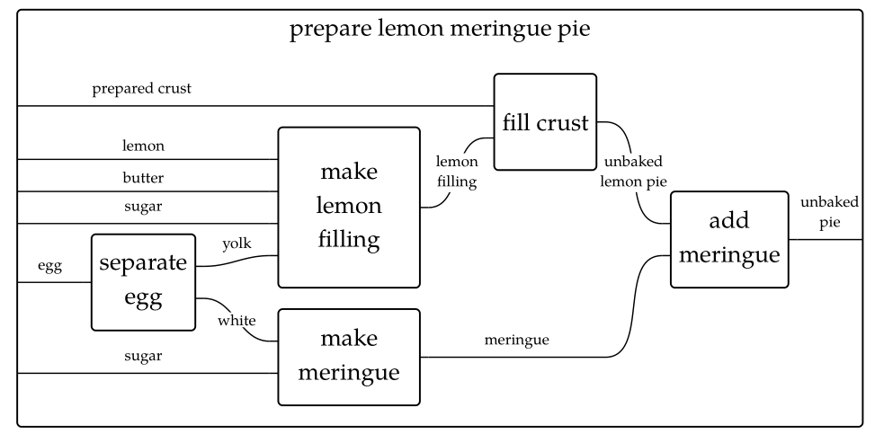
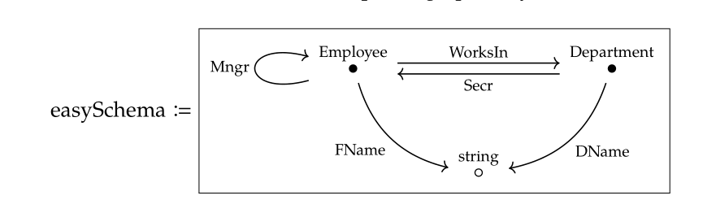

# 写给程序员的可逆计算理论辨析补遗

可逆计算理论是作者试图从物理学的基本原理出发来解释软件开发实践的时候所发现的一种面向演化的软件构造理论，所以它的方法论来源不是计算机科学本身，而是理论物理学，它所描述的是一种程序员不太熟悉的、相对抽象的软件构造规律。我在[可逆计算理论的方法论来源](https://zhuanlan.zhihu.com/p/64007521)一文中初步介绍了理论物理学和数学所带来的启发性思想。最近，我又专门写了一篇文章[写给程序员的可逆计算理论辨析](https://zhuanlan.zhihu.com/p/632876361)，从程序员熟悉的概念出发详细解释了差量与差量合并在程序实践中的具体形式和做法。根据读者的反馈信息，在本文中我将继续补充一些针对可逆计算理论的概念辨析，澄清对于可逆计算理论的一些常见误解。

## 一. 函数（业务处理逻辑）如何实现差量化

差量是定义在支持某种差量合并运算的模型空间中的变化量，不同的模型空间具有不同的差量形式。**这意味着对于同一个实体，如果放到不同的模型空间中去观察，我们实际上会得到不同的结果**。

首先，所有的结构都可以在通用的二进制比特空间中得到表示，比如函数A存储在文件中时对应于二进制数据10111...，而我们希望将它转换为函数B，它对应的二进制表示为010010...。在抽象的数学层面，寻找将函数A变换为函数B的差量X，相当于是求解如下方程   `A⊕X=B`。很显然，如果将⊕定义为二进制比特层面的异或操作，则我们可以自动求解得到 `X=A⊕B`。

```
 A ⊕ B = A ⊕ (A ⊕ X) = (A ⊕ A) ⊕ X = 0 ⊕ X = X
```

> 在证明中我们用到了异或操作的[归零律、结合律和恒等律](https://baike.baidu.com/item/%E5%BC%82%E6%88%96/10993677)。

虽然在二进制比特空间中我们总是可以求解得到函数的差量，但是这个差量却没有什么业务价值（对于二进制级别的压缩软件等还是有价值的）。我们既不能直观的理解它，也缺少便利的手段来直观的操纵它。

第二个常用的表示空间是源代码所在的行文本空间：所有的源码文件都可以通过代码行来描述。我们可以相对直观的在这个空间中定义代码的差量并很方便的操纵它。比如说一般的IDE工具都提供了拷贝行、删除行、复制行的操作快捷键。更进一步，所有调试工具和版本管理工具的业务价值都建立在行文本空间之上。例如，源代码版本管理工具在比较不同版本之间的差异时，会自动计算得到行文本空间中的Diff表示，而经过训练的程序员在代码评审时可以直接理解Diff表示。但是，行文本空间是一个与具体业务领域无关的通用表示空间，这导致它在描述业务逻辑代码的时候缺乏稳定性。一些在业务层面完全等价的结构变换会产生文本行空间中的大量差异。例如，代码格式化之后可能导致文本行层面出现巨大差异。此外调整函数的定义顺序一般并不影响程序语义，但是从行文本空间的角度来看，却是天翻地覆的巨大变化。

> Go语言在编译的时候总是按照固定的格式化规则对源码进行格式化。表面上看起来，这一做法使得程序员丧失了对源码的格式控制，但有趣的是，它并不意味着某种功能缺失，反而成就了更加稳定的文本行差量化表示形式。

**为了得到一种稳定的、具有明确业务语义的函数差量化表示形式，我们必须要在领域专用的模型空间中实现对函数的定义**。具体来说，我们可以将函数分解为多个步骤，然后为每个步骤分配一个唯一id等等。在Nop平台中，我们定义了两种可以实现分布式异步调用函数的差量化逻辑表达形式。

1. **基于堆栈结构的TaskFlow**。每一个步骤执行完毕之后缺省会自动执行下一个兄弟节点，而当所有的子节点都执行完毕之后会返回父节点继续执行。在运行时，可以按照父子节点关系查找到每个节点当前持有的状态数据，相当于是构成一个堆栈空间。通过引入外部持久化存储，TaskFlow可以实现类似程序语言中的[Continuation机制](https://www.zhihu.com/question/61222322/answer/564847803)：即某个步骤执行时可以将整个流程或者流程的一个分支挂起，然后外部程序可以调用TaskFlow的continueWith函数，从挂起的步骤继续执行。TaskFlow的XDef元模型参见[task.xdef](https://gitee.com/canonical-entropy/nop-entropy/blob/master/nop-xdefs/src/main/resources/_vfs/nop/schema/task/task.xdef)

2. **基于图结构的Workflow**。工作流模型可以描述大数据处理领域常见的DAG有向无环图，也可以描述办公自动化领域带回退、循环功能的审批流程图。工作流完全依赖于to-next步骤迁移规则来指定下一个待执行的步骤。同时，因为工作流的步骤之间完全平级，没有嵌套关系（子流程除外），所以在流程挂起之后，可以从任意一个步骤重新开始执行，在Workflow中实现Continuation机制要更加简单。Workflow的XDef元模型参见[wf.xdef](https://gitee.com/canonical-entropy/nop-entropy/blob/master/nop-xdefs/src/main/resources/_vfs/nop/schema/wf/wf.xdef)

```xml
<task x:extends="send-order.task.xml">
  <steps>
     <step id="save-order" />
     <step id="send-email">
         ...
     </step>
  </steps>
</task>
```

以上定义表示，对send-order.task.xml这个任务定义进行差量化调整，在save-order这一步骤之后增加一个send-email步骤。我们也可以通过差量化形式来调整某个步骤的配置参数或者删除某个步骤等。

## 二. 可逆计算能否应用于运行时演化

我在此前的文章中多次强调了可逆计算可以通过编译期元编程机制来实现，有些同学可能会产生疑问，这是否意味着可逆计算所描述的只是静态的系统演化实践(编译期实施差量)，那动态的系统演化(运行期实施差量)是否也能纳入可逆计算理论的描述范围？

这是一个非常有趣的问题。先说一下结论: 可以，**可逆计算可以应用于运行期演化**。

首先，**在运行期我们可以使用延迟编译和即时编译技术**。在Nop平台中，如果系统上线之后我们修改了DSL模型文件，则所有依赖于这个DSL模型的相关模型都会自动失效，下次再访问到这些模型的时候会自动重新加载编译。比如说，修改了NopAuthUser.xmeta文件会导致NopAuthUser.view.xml和用到NopAuthUser.view.xml的所有页面模型也会自动更新。DSL模型的自动更新过程不需要重新启动系统，只是更新缓存中的编译结果。

SAAS多租户系统在抽象的层面上看，也可以理解为一个Delta定制问题。每个租户对应于一个Delta，而且这些Delta在运行时的状态空间也是相互隔离的。实际上，因为Nop平台系统化的考虑了Delta的构建、分解机制，相比于其他技术方案它能够更加优雅的处理运行期演化问题。基于Nop平台的设计模式，我们可以在完全不停机的情况下实现持续的软件演化。

> 运行期的解释模型和编译期的代码生成模型之间的区别可以通过函数式编程中的[Curry化机制](https://zhuanlan.zhihu.com/p/38917159)来理解。例如，[低代码前端框架AMIS](https://aisuda.bce.baidu.com/amis/zh-CN/docs/index)的执行模型对应于 renderAmis(pageJson, pageData)。如果进行Curry化，则它对应于  (renderAmis(pageJson))(pageData)。如果我们可以对renderAmis(pageJson)这一形式中包含的逻辑进行优化，就相当于是执行 Component = CodeGenerator(pageJson)，编译过程等价于通过某种代码生成器生成优化后的代码，在编译期就可以提前执行大量的判断和循环逻辑，而在运行期就只需要保留必要的Component(pageData)逻辑即可。

**更为复杂的一个问题是运行期的状态空间是否也能纳入Delta的管理范围**，毕竟整个应用系统的完整描述 = 结构 + 状态。答案同样是可以，因为可逆计算是一个完全抽象的理论，它可以将结构空间+状态空间综合在一起，定义一个完整的高维空间，然后再考虑这个高维空间中的差量化演化。（在物理学中，这个高维空间被称为[相空间](https://baike.baidu.com/item/%E7%9B%B8%E7%A9%BA%E9%97%B4/8172498?fr=aladdin))。但是从实践的角度上说，考虑状态将导致需要处理的复杂度直线上升，所以一般情况下我们只会考虑结构空间中的Delta，而忽略状态空间。

具体举一个例子，比如说我们现在要对一个机器人进行Delta改进。对这个机器人的完整描述肯定是包括它的结构以及这些结构所处的状态，比如说机器人处于高速的运动状态中，我们需要描述它的各个部分的相对速度、加速度、角速度，甚至压力、温度等，但是一般情况下我们并不会在机器人的工作模式下对它进行改装，而是要把它转入到静息模式，也就是某种非激活的模式。工作模式下的各种状态信息对于改装而言是不相关的、可忽略的。少数极端的情况下，我们需要在行驶的火车上换车轮，那么基本的做法大概是： 先使用时间静止技术，在局部冻结时间线，然后将部分需要保持的状态序列化到存储中，然后修改结构，再次加载状态，一切就绪后再恢复时间演化。**在Delta修正所应用的过程中，时间是静止的，各类状态是冻结的，状态本身也是可以进行Delta修正的数据**。（比如说我们使用了某种锁机制，直接阻止外部操作，从外部使用者来看系统不再执行后续步骤，等价于时间静止。更复杂的技术则涉及到多重宇宙：在某个时刻通过快照复制分裂为多重宇宙之后，需要在平行宇宙中不断复制Delta进行追账，直到对齐到某个时间点，然后在短时间内静止时间，完成时间线切换）

> 关于时间静止的一个有趣应用，可以参见我的文章 [Paxos的魔法学研究报告](https://zhuanlan.zhihu.com/p/193117183)

对状态进行Delta修正的复杂度在于**对象关联的状态信息并不是仅仅由对象自身所决定**。比如我们的机器人正在和别的机器人进行激烈的对战，它的状态本质上是与对手相互作用导致的结果。如果需要复现这个状态，必须要考虑到能量守恒、动量守恒、角动量守恒等一系列物理约束。我们无法单方面的从机器人个体的角度出发复现它的状态，而是必须要考虑所有与它交互的客体的情况，需要考虑环境与机器人之间的相互影响，这导致复现状态或者修改状态是一件非常复杂的事情。如果我们通过Delta定制修改了对象结构，那么如何调整运行期的状态数据，使得它与新的对象结构以及外部运行时环境相协调就成为一件非常棘手的事情。

根据上面的讨论，如果我们希望在运行期实现演化，基本的做法有两种：

1. **分离结构和状态**，比如微服务强调无状态设计，将业务状态保留在共享存储中，所以可以随时启停
2. **定义激活和非激活两种模式**，切换到非激活模式下完成结构修订。

> 如果发散一下考虑生物界的演化问题。 我们可以把DNA看作是某种承载信息的DSL，生物的成长过程对应于Generator，它根据DSL的信息结合环境信息塑造出生物的本体。同时生物在应对具体问题挑战的时候，还可以利用外部的各种Delta。比如人可以穿上潜水服这个Delta，获得在水中活动的能力，可以加上不同厚度的衣服，获得在极寒和极热地区活动的能力。而一般的动植物能够加装的Delta很少，而特化的物理器官在增加某种适应性的同时也削弱了在其他环境中的适应性。比如北极熊的毛皮很保暖，很适合在寒冷的北极生活，这也导致了它无法适应热带的气候。

## 三. 现有系统要做到差量化是不是要推倒重建

Nop平台的代码看起来有点多（现在大概有二十多万行Java代码，包括十万行左右自动生成的代码），有些程序员看到之后可能感到有点疑虑，引入可逆计算的差量化计算模式，是否意味着必须要使用Nop平台？而使用Nop平台是否意味着要重写原有的业务代码？

首先，Nop平台的代码显得比较多是因为它没有直接使用Spring，而是重写了Java生态中的大量的底层框架，在重写的过程中纳入了很多创新的设计，提升了应用层的易用性，也提升了系统的性能。

### 为什么重写底层框架

目前流行的底层框架其设计时间都比较久远，历史积累的实现代码已经非常臃肿，因此面对新的技术环境挑战，例如异步化、支持GraalVM原生编译、支持GraphQL编程模型等，存在着船大难掉头的难题。**以Hibernate为例，它具有至少30万行以上的代码量**，却长期存在着不支持在From子句中使用子查询，不支持关联属性之外的表连接、难以优化延迟属性加载等问题。NopORM引擎实现了Hibernate+MyBatis的所有核心功能，可以使用大多数SQL关联语法，支持With子句、Limit子句等，同时增加了逻辑删除、多租户、分库分表、字段加解密、字段修改历史跟踪等应用层常用的功能，支持异步调用模式，支持类似GraphQL的批量加载优化，支持根据Excel模型直接生成GraphQL服务等。**实现所有这些功能，NopORM中手写的有效代码量只有1万行左右**。类似的，在Nop平台中我们通过4000行左右的代码实现了支持条件装配的NopIoC容器，通过3000行左右的代码实现了支持灰度发布的分布式RPC框架，通过3000代码实现了采用Excel作为设计器的中国式报表引擎NopReport等。具体介绍参见以下文章:

* [低代码平台需要什么样的ORM引擎](https://zhuanlan.zhihu.com/p/543252423)
* [如果重写SpringBoot，我们会做哪些不同的选择](https://zhuanlan.zhihu.com/p/579847124)
* [采用Excel作为设计器的开源中国式报表引擎：NopReport](https://zhuanlan.zhihu.com/p/620250740)
* [低代码平台中的分布式RPC框架](https://zhuanlan.zhihu.com/p/631686718)

之所以重写这些框架只需要很少的代码量，一个很重要的原因在于它们共用了Nop平台的很多通用机制。**任何一个具有一定复杂度的底层框架在某种意义上说都是提供了一种DSL领域特定语言**，比如Hibernate的hbm模型文件，Spring的beans.xml对象定义文件，Report的报表模型文件，RPC所使用的接口定义文件等。Nop平台为开发自定义的DSL提供了一系列的技术支撑，避免了每个框架都自行去实现模型的解析、加载、转换功能。同时，Nop平台提供了高度可定制的表达式语言和模板语言引擎，也避免了每个框架都重新去实现类似的脚本引擎。还有一点是，每个框架都使用IoC容器来实现动态装配，避免了自行去实现插件扩展机制。

Nop平台统一了所有底层框架所使用的DSL描述方式，因此可以使用统一的XDef元模型定义语言来定义不同的DSL，这使得我们可以提供统一的IDE插件来实现对不同DSL的编程支持，可以实现多个DSL之间的无缝嵌入。在未来，我们还将提供统一的可视化设计器生成器，它**根据XDef元模型自动为DSL生成可视化设计工具**。借助于XDSL内置的Delta差量定制机制，我们可以实现在完全不修改基础产品源码的情况下，实现深度的定制化开发。具体介绍参见文章：

* [XDSL：通用的领域特定语言设计](https://zhuanlan.zhihu.com/p/612512300)
* [如何在不修改基础产品源码的情况下实现定制化开发](https://zhuanlan.zhihu.com/p/628770810)

### 如果不重写底层框架，如何引入差量化机制

Nop平台重写底层框架只是为了简化编程、提升性能。如果坚持使用传统的开源框架，同样可以引入差量化机制，只是使用起来没有那么方便。实际上，在JSON格式基础上实现差量化虚拟文件系统和Delta差量合并算法大概只需要几千行代码。

如果希望以最小的成本向系统中引入可逆计算，可以使用如下两种方式：

#### 1. 将Nop平台作为增量式代码生成器

Nop平台的代码生成器可以集成在Maven打包工具中使用，在执行mvn package指令的时候会自动运行precompile和postcompile目录下的所有代码生成脚本。**生成的代码可以脱离Nop平台运行，完全不需要改变原有的运行模式，也不会增加新的运行时依赖**。

Nop平台支持程序员定义自己的领域模型，也支持扩展平台内置的数据模型、API模型等，而且这种扩展都是通过Delta定制方式实现，增加模型属性时不需要修改Nop平台的代码。目前已经有人使用Nop平台的代码生成器来生成其他低代码平台所需的模型文件。

Nop平台的代码生成器采用了一系列创新的设计，它的实现方式和完成的功能与常见的代码生成脚手架有着本质性区别，具体介绍参见文章 [数据驱动的差量化代码生成器](https://zhuanlan.zhihu.com/p/540022264)

除了集成在maven工具中使用之外，我们有可以使用命令行方式来执行持续性的代码生成。

```
java -jar nop-cli.jar run tasks/gen-web.xrun -t=1000
```

```xml
<!-- gen-web.xrun -->
<c:script><![CDATA[
    import io.nop.core.resource.component.ResourceComponentManager;
    import io.nop.core.resource.VirtualFileSystem;
    import io.nop.codegen.XCodeGenerator;
    import io.nop.xlang.xmeta.SchemaLoader;
    import io.nop.commons.util.FileHelper;

    assign("metaDir","/meta/test");

    let path = FileHelper.getRelativeFileUrl("./target/gen");
    let codegen = new XCodeGenerator('/nop/test/meta-web',path);
    codegen = codegen.withDependsCache();
    codegen.execute("/",$scope);
]]></c:script>
```

上面的例子表示每隔1秒钟执行一次gen-web.xrun任务，而这个任务的具体内容是针对/meta/test虚拟路径下的所有meta文件，应用/nop/test/meta-web虚拟路径下的代码生成模板，生成的代码保存到target/gen目录下。代码生成器设置了withDependsCache，因此每次执行的时候它都会检查代码生成器所用到的模型文件是否已经发生变化，只有发生变化的时候才会重新生成，否则会直接跳过。例如，如果my.page.json文件是根据NopAuthUser.xmeta模型以及web.xlib这个控件库生成的，那么只有当NopAuthUser.xmeta文件或者web.xlib文件发生变化的时候，才会重新生成my.page.json。

这种依赖追踪机制有些类似于前端Vite打包工具所内置的修改监听功能：当发现源码发生改变的时候自动重新加载源码，并把修改推送到前端浏览器中。

#### 2. 使用Nop平台的统一模型装载器

Nop平台所提供的Delta定制机制主要是用于动态生成并组装各类模型文件，并不涉及到任何运行时框架方面的知识，因此它可以很自然的与任何设计良好的运行时框架进行对接。**具体的对接策略就是将原先加载模型文件的函数调用替换为对Nop平台中的统一模型加载器的调用**。

```javascript
 Model = readModelFromJson("my.model.json");
 被替换为
 Model = (Model)ResourceComponentManager.instance()
                  .loadComponentModel("my.model.json");
```

ResourceComponentManager内部会缓存模型文件的解析结果，并且会自动跟踪解析过程中发现的所有模型依赖关系，当被依赖的模型发生修改时，会导致所有依赖于它的解析缓存结果自动失效。

**可逆计算理论所提出的Y= F(X)+Delta的计算模式可以被封装到一个抽象的加载器（Loader）接口之中，这一事实极大的降低了在第三方系统中引入可逆计算的成本**。详细介绍参见文章 [从张量积看低代码平台的设计](https://zhuanlan.zhihu.com/p/531474176)

在Nop平台中，我们对于百度AMIS框架的集成就采用了这种方式。

```yaml
type: page
x:gen-extends: |
   <web:GenPage view="MyEntity.view.xml" page="crud" />
body:
   - type: form
     "x:extends": "add.form.yaml"
     api:
       url: "/test/my-action"
```

通过使用ResourceComponentManager来加载AMIS的页面文件，我们为它引入了`x:extends`,`x:gen-extends`这样的差量化分解组合机制，可以使用XPL模板语言动态生成JSON页面内容，可以通过`x:extends`复用已经定义好的子页面，并在子页面的基础上进行精细化的定制，可以在Delta目录下增加同名的文件来覆盖系统中原有的模型文件。

所有JSON、YAML或者XML格式的模型文件都可以直接使用Nop平台的统一模型加载器来实现差量分解、合并。

通过统一模型加载器，我们还可以很容易的将原系统中的模型文件改造为输出模板文件。例如，我们在Word文件的基础上约定了一些特殊的表达式定义规则，就可以直接将Word文件转换为XPL模板语言文件，用于动态生成Word文档。具体介绍参见[如何用800行代码实现类似poi-tl的可视化Word模板](https://zhuanlan.zhihu.com/p/537439335)。

## 四. Delta差量相比于Scala Traits有什么本质性创新

我在[上一篇文章](https://zhuanlan.zhihu.com/p/632876361)中明确指出Scala语言中的Traits概念可以看作是**类空间中的某种Delta差量的定义方式**。有些同学读了这篇文章之后可能会有些疑惑，那么可逆计算理论中的Delta差量是否本质上也只是某种子类型的定义问题，它并没有什么特别的创新之处？

因为很多程序员从学习编程开始就只接触过面向对象的话语体系，所以在思维中可能会将代码编写等价于创建类、属性、方法。**包括在研究ChatGPT如何生成业务代码的时候，很多人的第一想法也是如何让GPT学会将问题分解为多个类，然后再生成每个类对应的代码**。

我们需要明确的是**Traits概念依附于类的概念，但是类并不是对所有逻辑结构的最适合的描述方式**。在本文的第一节中，我已经明确指出同一个结构可以放到不同的模型空间中去表达，而在每个模型空间中都存在着对应的、专属于这个模型空间的差量定义方式。比如一个函数总可以在二进制比特空间、源码文本行空间这两个通用的模型空间中得到表达。而**类空间本质上也是一个通用的模型空间**: 所有使用面向对象技术实现的逻辑结构，都具有类空间中的表达形式，因此也都可以通过类空间的差量来对它们进行Delta修正。

可逆计算理论**并不受限于使用某个特定的模型空间**，它作为一个理论首先是对众多分散的实践提供了统一的理论解释，并且指出了完整的技术路线应该是Y=F(X)+Delta，将[产生式编程（Generative Programming)](https://zhuanlan.zhihu.com/p/399035868)、面向差量编程和多阶段编程有机的结合在一起。在可逆计算的视角下，虚拟化领域的Docker技术、前端领域的React技术、云计算领域的Kustomize技术等近几年出现的创新实践都可以被看作是可逆计算理论的具体应用实例，在这种情况下，我们才可能识别出这些技术之间的共性，并抽象出一种统一的技术架构来将它推广到更多的应用领域。

可逆计算理论指出我们可以建立更加灵活的领域模型空间，在更加稳定的领域坐标系中表达逻辑结构的差量（这一点类似于在物理学中选择使用**内禀坐标系（intrinsic coordinates)**）。引入领域坐标系的概念之后，我们会发现类型系统所提供的是一种并不完善的坐标系，有些差量化问题在类型系统中无法得到精确的定义。因为类型概念的出发点就是多个实例可以具有同样的类型，所以使用它来作为定位坐标本身就很可能引入含混性。

可逆计算理论指出类的概念在结构层面可以看作是Map结构：类具有属性在结构层面对应于根据key可以从Map中获取到相应的值。**类的继承可以被看作是Map之间的一种覆盖关系**。可逆计算相当于是把这种覆盖关系推广到Tree结构之间，并且**补充了逆元的概念**。Tree是比Map复杂度更高的结构，Tree = Map + Nested。

> 可以应用于Tree结构的运算必然可以应用到Map结构上，所以Tree可以被看作是对Map的一种推广。

**补充了逆元的概念，相当于是扩大了问题的解空间**，一些原先不好解决的问题，在这个新的解空间中都存在通用的解决方案。比如说，Scala Traits不支持取消操作，一旦对象A混入了某个Trait B之后，就无法通过Scala语法实现取消，只能是手工修改源码，这直接导致很难实现系统级的粗粒度软件复用。在不修改X的情况下通过补充Delta来实现定制与将X拆解为多个组件重新再组装的方式有着本质性的区别: 拆解和组装是具有成本的，而且人工操作可能会引入偶然性的错误。这就好像是一支精密的手表，将它的各个组件拆解后再装配到一起很有可能会发现某个螺丝拧错了。

建立领域坐标系之后，Delta差量可以跨越传统的代码结构障碍，直接作用于指定的领域坐标处，这相当于是**建立了无所不在的传送门**，我们可以将逻辑差量直接传送到指定位置处。

> 在魔法的世界中，走出房间不一定要经过房门，我们可以直接穿墙而过!

### 为什么强调树结构而不是图结构

Tree结构具有很多优点。首先，它**实现了相对坐标与绝对坐标的统一**：从根节点开始到达任意节点只存在唯一的一条路径，它可以作为节点的绝对坐标，而另一方面，在某一个子树范围内，每一个节点都具有一个子树内的唯一路径，可以作为节点在子树内的相对坐标。根据节点的相对坐标和子树根节点的绝对坐标，我们可以很容易的计算得到节点的绝对坐标（直接拼接在一起就可以了）。

Tree结构的另一个优点是**便于管控，每一个父节点都可以作为一个管控节点**，可以将一些共享属性和操作自动向下传播到每个子节点。

另一方面，对于图结构，如果我们选定了一个主要的观察方向，选择某个固定的节点作为根节点，那么我们就可以很自然的将一个图结构转换为树结构。比如Linux操作系统中，一切都是文件，很多逻辑关系都被纳入到文件树的表达结构中，但借助于文件系统中的文件链接机制，本质上可以表达图结构。**所谓的树仅仅是因为我们在图上选择了一个观察方向而产生的**。

## 五. 系统差量化之后，版本机制还有意义吗

git的版本相当于是一个比较粗粒度的非结构化差量，可以给一次大的更新起一个名字，可以处理一般的程序源码。而Delta我们希望它是高度结构化、语义化的，如果所有的语言包括Java都实现合适的Delta差量化，则可以起到类似git的作用。

但另一方面，很多时候我们就想直接修改Delta的实现本身，不需要保留语义边界，此时用git这种非结构化的方式去管理Delta差量代码就很合适。

## 六. XML格式太复杂， 能不能考虑JSON？甚至YAML？

很多程序员并没有亲自设计过XML格式的DSL语言，只是听业界的前辈讲过上古时代的XML是如何被后起之秀淘汰的传说，就由此形成了一种刻板印象，认为XML过于冗长，只能用于机器之间传递信息，并不适合于人机交互。但是，这是一种错误的偏见，源于XML原教旨主义对于XML错误的使用方式，以及一系列XML国际规范对错误使用方式的推波助澜。

在此前的文章中我已经进行了详细的解释，参见[GPT用于复杂代码生产所需要满足的必要条件](https://zhuanlan.zhihu.com/p/632876916).

在Nop平台中我们提供了XML和JSON、YAML之间的自动双向转换机制，同样的DSL同时存在着XML表示和JSON表示。

## 七. 不完全等价的格式之间如何实现可逆转换？

有些程序员实践过DSL描述之间的转换机制，比如从高层的DSL自动转换到低层的DSL，此时我们经常会发现要实现可逆转换是非常困难的，甚至是不可能的。因为跨越复杂性层次或者系统边界的时候，经常会丢失细节信息，导致转换前和转换后仅仅是约等于关系，并不严格等价。

有些人寄希望于AI强大的猜测能力，可以根据残留的信息自动补全得到原始的信息，但这样做天生就是不精确的，容易出现错误的。

$$
A \approx F(B), G(A) \approx B
$$

为了使得上面的两个方程从约等于转变为等于，可逆计算理论建议的解决方案是在两侧都补充Delta差量。

```
  A + dA = F(B + dB),  G(A + dA) = B + dB
```

也就是说为了满足可逆转换的要求，每一个抽象层都应该提供一个内置的扩展信息保存机制，容纳一些当前使用不到的扩展信息。

> 正所谓有一种用处叫做无用之用，一些可有可无的功能会撑起一个灰色的设计空间，允许意料之外的一些演化在其中发生。

## 八. 从范畴论的角度如何理解可逆计算

范畴论在抽象数学领域中也能算得上是最抽象的数学分支之一，而一般的程序员其实并没有接受过很强的抽象数学训练，所以他们对于范畴论的理解往往局限在类型系统中，甚至可能和某些函数式语言的语法特性绑定在一起。但是范畴论的本质其实很简单，也不涉及到类型系统。可逆计算以及Nop平台中的很多做法都可以放到范畴论的理论框架中去理解。

所谓的范畴指的是：

1. 一些点和点与点之间的连接箭头

2. 箭头和箭头可以复合产生新的箭头，而且箭头的复合关系满足结合律

3. 每个点上存在一个单位箭头

也就是说**只要我们能够把一些概念映射为点和箭头，那么就可以很自然的组成一个范畴**。

比如说，制作柠檬派的过程可以构成一个范畴。



再比如，数据库的schema定义也构成一个范畴


这里需要注意的是，不是所有的有向图（Graph）都是范畴，因为范畴要求每个点上都存在单位箭头，而且箭头之间需要能够复合，复合关系还要满足结合律。数学上更加严谨的说法是，从任意一个有向图出发，我们可以通过Free Construction构造出一个范畴来。所以从下面这种只有两个箭头的图构造得到的范畴实际上包含6个箭头。


v1,v2,v3上需要增加3个单位箭头，而f1和f2的复合需要被定义为一个新的箭头，所以总共有6个箭头。

这里的所谓Free指的是我们没有添加任何新的约束条件，仅仅是从补足范畴论定义的需要出发向图中补充了最少量的元素。而一个不Free的构造方式是向图中引入约束条件：规定两条连接同样起点和钟点的路径是等价的。


一个比较容易理解的例子是向数据库的schema关系图中增加业务约束条件：


* 每个部门的秘书必须在这个部门中工作
* 每个雇员的经理必须和雇员在同一个部门

在easySchema这个范畴上增加equation约束条件之后就可以得到新的范畴 mySchema

> 以上关于范畴论的示意图全部出自 [Seven Sketches in Compositionality :
> An Invitation to Applied Category Theory](https://arxiv.org/pdf/1803.05316.pdf)一书。

在范畴论的视角下，我们当前的系统可以被看作是领域结构所构成的范畴，而Delta定制的作用是作用到每一个领域坐标处，把领域结构中的每个点映射为一个新的点，由此在整体上把当前的领域结构变换为一个新的领域结构。因此，**Delta定制可以被看作是领域结构范畴之间的映射函子(Functor)**。

所谓的函子，就是将范畴C中的每个点映射到另一个范畴D中的一个点，将范畴C中的每个箭头也映射到范畴D中的一个箭头，同时保持之间箭头的复合关系满足结合律。

注意函子的特殊性在于它作用在范畴C的每个点上，而且映射过程保持范畴C中的某种结构关系。

在Nop平台中，我们很注重以通用的方式来解决问题，这种所谓的通用性可以从范畴论的角度来解释。比如Excel模型文件解析，一般的做法是针对某个特殊约定好的Excel文件格式，特殊编写一个Excel文件解析函数，将它解析为某个特定结构的Java对象。而在Nop平台中，我们实现了一个通用的Excel解析器，它并不假定Excel具有特定格式，而是允许相对任意的Excel输入（字段顺序可以随意调整，允许任意复杂的字段嵌套关系），无需编程就可以将一个Excel文件解析得到对应的领域结构对象。从范畴论的角度观察，Nop平台所提供的是从Excel范畴到领域对象范畴的一个映射函子，而不仅仅是一个针对特定结构的解析函数。在另一个方向上，对于任意的领域对象，无需编程，就可以使用通用的报表导出机制将它导出为一个Excel文件。这个报表函子与Excel解析函子可以看作是构成了一对伴随函子(Adjoint Functor)。

## 九. 这些抽象的理论有什么用？搞GPT代码生成能用得上吗

首先，可逆计算理论本身非常有用，它解决了系统级粗粒度软件复用的问题。比如说，如果一开始系统底层就遵循可逆计算原理，那么我们就没有必要再发明Kustomize技术，Spring容器的实现方式也可以得到大幅简化。一个银行核心应用产品如果遵循可逆计算原理，那么它在不同客户处进行定制化开发的时候，就不需要修改基础产品的源代码，大幅降低同时维护多个不同版本的基础产品代码的压力。而革命性的Docker技术在抽象结构层面可以被看作是可逆计算理论的一个标准应用实例，类似Docker的结构构造方式理应可以被推广到更多的技术应用领域。

第二，从可逆计算理论出发我们可以对GPT代码生成提出以下几点建议。

1. 代码生成并不意味着一定要把代码拆分为类和方法来生成，类空间不过是通用的模型空间的一种，我们可以采用其他的领域模型空间来表达逻辑。

2. 如果GPT能够准确的生成代码，那么它一定能够理解元模型和差量模型。元模型可以帮助AI在尽量少的信息输入情况下精确掌握模型约束条件。而差量模型使得增量式开发成为可能。

3. 在训练的时候我们可以有意识的使用元模型和差量模型来训练，这样可以从少量的样本迅速衍生得到大量具有内在一致性的训练样本。差量化训练类似于数值空间的梯度下降学习。

基于可逆计算理论设计的低代码平台NopPlatform已开源：

- gitee: [canonical-entropy/nop-entropy](https://gitee.com/canonical-entropy/nop-entropy)
- github: [entropy-cloud/nop-entropy](https://github.com/entropy-cloud/nop-entropy)
- 开发示例：[docs/tutorial/tutorial.md](https://gitee.com/canonical-entropy/nop-entropy/blob/master/docs/tutorial/tutorial.md)
- [可逆计算原理和Nop平台介绍及答疑\_哔哩哔哩\_bilibili](https://www.bilibili.com/video/BV14u411T715/)
